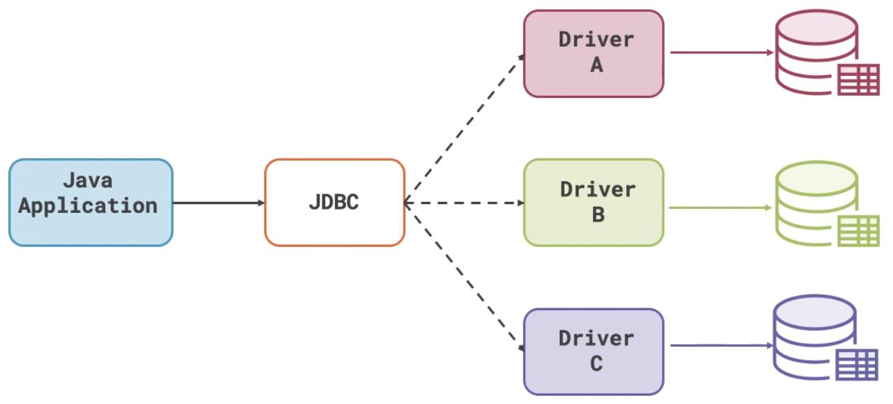

# JDBC
一:JDBC使用步骤:

1建项目，导入jar包

2准备四大参数

3建立连接

4准备sql

5获取Statement对象     

6执行Sql语句  executeUpdate() ->增删改 executeQuery()-->查询

7处理，关闭

二：防止Sql注入 ,PreparedStatement，支持占位符

三：遍历结果集 ResultSet  

​     |-判断是否查询到数据 next()

​      |-解析数据 getString \ getInt...（列名）       


## 一、概述

### 1.1、什么是JDBC

> JDBC（Java DataBase Connectivity，Java数据库连接）是一种用于执行SQL语句的Java API，可以为多种关系数据库提供统一访问。
>
> 简单说就是用Java语言来操作数据库。原来我们操作数据库是在控制台使用SQL语句来操作数据库，JDBC是用Java语言向数据库发送SQL语句。

### 1.2、JDBC原理

>早期SUN公司的天才们想编写一套可以连接天下所有数据库的API，但是当他们刚刚开始时就发现这是不可完成的任务，因为各个厂商的数据库服务器差异太大了。后来SUN开始与数据库厂商们讨论，最终得出的结论是，由SUN提供一套访问数据库的规范（就是一组接口），并提供连接数据库的协议标准，然后各个数据库厂商会遵循SUN的规范提供一套访问自己公司的数据库服务器的API实现。SUN提供的规范命名为JDBC，而各个厂商提供的，遵循了JDBC规范的，可以访问自己数据库的API被称之为**驱动**。
>
>JDBC是接口，而JDBC驱动才是接口的实现，没有驱动无法完成数据库连接！每个数据库厂商都有自己的驱动，用来连接自己公司的数据库。
>
>**JDBC -- Java官方提供 -- 一系列接口 -- 规范**
>
>**驱动 -- 数据库厂商提供 -- JDBC接口的实现类 -- 实现**



## 二、JDBC入门

### 2.1、准备工作

#### 2.1.1、建库建表

```sql
DROP DATABASE IF EXISTS mydbjdbc;

CREATE DATABASE mydbjdbc;
USE mydbjdbc;

CREATE TABLE tb_stu ( 
    sid INT PRIMARY KEY auto_increment, 
    sname VARCHAR (50), 
    sage INT, 
    sgender VARCHAR (10) 
);
INSERT INTO tb_stu(sname, sage, sgender) VALUES('John', 20, "male");
INSERT INTO tb_stu(sname, sage, sgender) VALUES('bob', 20, "male");

CREATE TABLE USER(
    username VARCHAR (20), 
    password VARCHAR (20)
);
INSERT INTO USER VALUES('Peter', '123');
INSERT INTO USER VALUES('John', '123');
```

#### 2.1.2、新建项目

>1. 新建Java项目；
>2. 在项目下新建lib目录；
>3. 将MySQL驱动jar包拷贝到lib目录下；
>4. 选中lib目录右键Add as Library--单击OK。

### 2.2、建立连接

#### 2.2.1、准备四大参数

```java
//驱动名
String driverName = "com.mysql.jdbc.Driver";
//连接数据库的url
String url = "jdbc:mysql://localhost:3306/mydbjdbc?useSSL=false&useUnicode=true&characterEncoding=utf8"
//用户名
String username = "root";
//密码
String password = "root";
```

#### 2.2.2、加载驱动

```java
//手动加载字节码文件到JVM中
Class.forName(driverName);
```

#### 2.2.3、准备SQL语句

```sql
//SQL语句
String sql = "INSERT INTO tb_stu(sname, sage, sgender) VALUES('Peter', 20, 'male')";
```

#### 2.2.4、建立连接

```java
//建立连接
Connection connection = DriverManager.getConnection(url, username, password);

//验证是否成功建立连接
System.out.println(connection);
```

> 如果能够正常输出连接信息，说明连接建立成功，这是后续一切操作的基础。

#### 2.2.5、常见问题

> `java.lang.ClassNotFoundException: com.mysql.jdbc.Driver`
>
> 原因：项目中没有添加MySQL驱动或驱动的名字写错
>
> `java.sql.SQLException: Access denied for user 'root'@'localhost' (using password: YES)`
>
> 原因：用户名或密码错误
>
> `com.mysql.jdbc.exceptions.jdbc4.MySQLSyntaxErrorException: Unknown database 'mydbjdbc1'`
>
> 原因：数据库名称不正确
>
> ` com.mysql.jdbc.exceptions.jdbc4.CommunicationsException: Communications link failureThe last packet sent successfully to the server was 0 milliseconds ago`
>
> 原因：MySQL服务没有启动或网络故障

### 2.3、获取发送SQL的对象

```sql
Statement statement = connection.createStatement();
```

### 2.4、执行SQL语句

```sql
//使用Statement发送SQL语句，返回受影响的行数
int i = statement.executeUpdate(sql);
```

> 增、删、改使用`executeUpdate`
>
> 查询使用`executeQuery`

### 2.5、处理结果

```sql
if(i == 1) {
	System.out.println("添加成功");
}
```

### 2.6、释放资源

> 遵循**先开后关**原则，释放所使用到的资源对象。

```java
//释放资源
statement.close();
connection.close();
```

> 资源对于系统来说非常重要，而且是有限的，用完之后一定要释放。

### 2.7、完整代码

```java
import java.sql.Connection;
import java.sql.DriverManager;
import java.sql.SQLException;
import java.sql.Statement;

public class TestJdbc1 {
    public static void main(String[] args) throws ClassNotFoundException, SQLException {
        //驱动名
        String driverName = "com.mysql.jdbc.Driver";
        //连接数据库的url
        String url = "jdbc:mysql://localhost:3306/mydbjdbc?useSSL=false";
        //用户名
        String username = "root";
        //密码
        String password = "root";

        //加载驱动
        Class.forName(driverName);
        //SQL语句
        String sql = "INSERT INTO tb_stu(sname, sage, sgender) VALUES('Peter', 20, 'male')";
        //建立连接
        Connection connection = DriverManager.getConnection(url, username, password);

        //System.out.println(connection);
        Statement statement = connection.createStatement();
        //发送SQL语句
        int i = statement.executeUpdate(sql);

        //处理结果
        if(i == 1) {
            System.out.println("添加成功");
        }

        //释放资源
        statement.close();
        connection.close();
    }
}
```

举一反三，我们可以按照上面的套路进行删除、修改操作。

### 2.8、上面的程序改进

> 我们在进行添加或其他操作时，SQL语句中的内容是不可能在程序中写死的，在数据库中操作的数据一定是能够变化的。我们对程序进行如下修改，其他部分不变。

```java
//假设用户输入的数据
String name = "zs";
int age = 10;
String gender = "male";

//SQL语句
//String sql = "INSERT INTO tb_stu(sname, sage, sgender) VALUES('Peter', 20, 'male')";
String sql = "INSERT INTO tb_stu(sname, sage, sgender) VALUES('" + name + "', " + age + ", '" + gender + "')";
```

> 通过上面的修改，我们就可以通过Java代码向数据库中添加变化的数据而不是在代码中写死。
>
> 同理，删除和修改操作也可以按照这样的套路进行操作。

### 2.9、改进后的完整代码

```java
import java.sql.Connection;
import java.sql.DriverManager;
import java.sql.SQLException;
import java.sql.Statement;

public class TestJdbc2 {
    public static void main(String[] args) throws ClassNotFoundException, SQLException {
        //驱动名
        String driverName = "com.mysql.jdbc.Driver";
        //连接数据库的url
        String url = "jdbc:mysql://localhost:3306/mydbjdbc?useSSL=false";
        //用户名
        String username = "root";
        //密码
        String password = "root";

        //加载驱动
        Class.forName(driverName);

        //假设用户输入的数据
        String name = "zs";
        int age = 10;
        String gender = "male";

        //SQL语句
        //String sql = "INSERT INTO tb_stu(sname, sage, sgender) VALUES('Peter', 20, 'male')";
        String sql = "INSERT INTO tb_stu(sname, sage, sgender) VALUES('" + name + "', " + age + ", '" + gender + "')";
        //建立连接
        Connection connection = DriverManager.getConnection(url, username, password);

        //System.out.println(connection);
        Statement statement = connection.createStatement();
        //发送SQL语句
        int i = statement.executeUpdate(sql);

        //处理结果
        if(i == 1) {
            System.out.println("添加成功");
        }

        //释放资源
        statement.close();
        connection.close();
    }
}
```

删除 实现

修改 实现

## 三、查询操作

> 查询操作和增删改操作在结果处理上有很大区别，我们有必要深入研究一下。

### 3.1、获取结果集

```java
//假设用户输入的数据
int stuid = 1;

//SQL语句
String sql = "SELECT * FROM tb_stu WHERE sid=" + stuid;
//建立连接
Connection connection = DriverManager.getConnection(url, username, password);

//System.out.println(connection);
Statement statement = connection.createStatement();
//发送SQL语句，获取结果集
ResultSet resultSet = statement.executeQuery(sql);
```

> 查询使用`executeQuery`

### 3.2、处理结果集

> ResultSet 以表（table）结构进行临时结果的存储，需要通过JDBC API将其中数据进行依次获取。
>
> - 数据行指针：初始位置在第一行数据前，每调用一次`boolean next()`方法ResultSet的指针向下移动一行，结果为 true，表示当前行有数据；
> - `resultSet.getXxx(整数)`：代表根据列的编号顺序获得，**从1开始（一定要注意）**；
> - `resultSet.getXxx("列名")`：代表根据列名获得。

```java
int getInt(int columnIndex) throws SQLException		//获得当前行第N列的int值
int getInt(String columnLabel) throws SQLException	//获得当前行columnLabel列的int值

double getDouble(int columnIndex) throws SQLException		//获得当前行第N列的double值
double getDouble(String columnLabel) throws SQLException	//获得当前行columnLabel列的double值

String getString(int columnIndex) throws SQLException 		//获得当前行第N列的String值
String getString(String columnLabel) throws SQLException	//获得当前行columnLabel列的String值

//处理结果
while(resultSet.next()) {
    int id  = resultSet.getInt("sid");
    String sname = resultSet.getString("sname");
    int sage = resultSet.getInt("sage");
    String sgender = resultSet.getString("sgender");
    System.out.println(id);
    System.out.println(sname);
    System.out.println(sage);
    System.out.println(sgender);
}
```

### 3.3、查询操作完整代码

```java
import java.sql.*;

public class TestJdbc3 {
    public static void main(String[] args) throws ClassNotFoundException, SQLException {
        //驱动名
        String driverName = "com.mysql.jdbc.Driver";
        //连接数据库的url
        String url = "jdbc:mysql://localhost:3306/mydbjdbc?useSSL=false";
        //用户名
        String username = "root";
        //密码
        String password = "root";

        //加载驱动
        Class.forName(driverName);

        //假设用户输入的数据
        int stuid = 1;

        //SQL语句
        String sql = "SELECT * FROM tb_stu WHERE sid=" + stuid;
        //建立连接
        Connection connection = DriverManager.getConnection(url, username, password);

        //System.out.println(connection);
        Statement statement = connection.createStatement();
        //发送SQL语句
        ResultSet resultSet = statement.executeQuery(sql);

        //处理结果
        while(resultSet.next()) {
            int id  = resultSet.getInt("sid");
            String sname = resultSet.getString("sname");
            int sage = resultSet.getInt("sage");
            String sgender = resultSet.getString("sgender");
            System.out.println(id);
            System.out.println(sname);
            System.out.println(sage);
            System.out.println(sgender);
        }

        //释放资源
        resultSet.close();
        statement.close();
        connection.close();
    }
}
```

## 四、PreparedStatement

### 4.1、SQL注入

#### 4.1.1、什么是SQL注入

> 用户输入的数据中**有SQL关键字或语法并且参与了SQL语句的编译**，导致SQL语句编译后的条件含义为true，一直得到正确的结果。这种现象称为SQL注入。

#### 4.1.2、SQL注入案例

```java
import java.sql.*;

public class TestJdbc4 {
    public static void main(String[] args) throws ClassNotFoundException, SQLException {
        //驱动名
        String driverName = "com.mysql.jdbc.Driver";
        //连接数据库的url
        String url = "jdbc:mysql://localhost:3306/mydbjdbc?useSSL=false";
        //用户名
        String username = "root";
        //密码
        String password = "root";

        //加载驱动
        Class.forName(driverName);

        //假设用户输入的数据
        String n = "abc' OR 1=1 OR '1=1";
        String p = "123";

        //SQL语句
        String sql = "SELECT * FROM user WHERE username='" + n + "' AND password='" + p + "'";
        System.out.println(sql);
        //建立连接
        Connection connection = DriverManager.getConnection(url, username, password);

        //System.out.println(connection);
        Statement statement = connection.createStatement();
        //发送SQL语句
        ResultSet resultSet = statement.executeQuery(sql);

        //处理结果
        while(resultSet.next()) {
            System.out.println(resultSet.getString("username"));
            System.out.println(resultSet.getString("password"));
        }

        //释放资源
        resultSet.close();
        statement.close();
        connection.close();
    }
}
```

#### 4.1.2、如何避免SQL注入

>由于编写的SQL语句是在用户输入数据，整合后再进行编译。所以为了避免SQL注入的问题，我们要使SQL语句在用户输入数据前就已进行编译成完整的SQL语句，再进行填充数据。
>
>使用PreparedStatement。

### 4.2、PreparedStatement使用

> PreparedStatement继承了Statement接口，执行SQL语句的方法无异。
>
> 作用：
>
> - 预编译SQL 语句，效率高。
> - 安全，避免SQL注入 。
> - 可以动态的填充数据，执行多个同构的 SQL 语句。

#### 4.2.1、预编译SQL语句

```java
//SQL语句
String sql = "SELECT * FROM user WHERE username=? AND password=?";

//预编译SQL语句
PreparedStatement statement = connection.prepareStatement(sql);
```

#### 4.2.2、设置参数

```java
String n = "abc' OR 1=1 OR '1=1";
String p = "123";

//设置参数
statement.setString(1, n);
statement.setString(2, p);
```

#### 4.2.3、完整代码

```java
import java.sql.*;

public class TestJdbc5 {
    public static void main(String[] args) throws ClassNotFoundException, SQLException {
        //驱动名
        String driverName = "com.mysql.jdbc.Driver";
        //连接数据库的url
        String url = "jdbc:mysql://localhost:3306/mydbjdbc?useSSL=false";
        //用户名
        String username = "root";
        //密码
        String password = "root";

        //加载驱动
        Class.forName(driverName);

        //假设用户输入的数据
        String n = "abc' OR 1=1 OR '1=1";
        String p = "123";

        //SQL语句
        String sql = "SELECT * FROM user WHERE username=? AND password=?";
        //建立连接
        Connection connection = DriverManager.getConnection(url, username, password);

        //预编译SQL语句
        PreparedStatement statement = connection.prepareStatement(sql);
        //设置参数
        statement.setString(1, n);
        statement.setString(2, p);

        //发送SQL语句
        ResultSet resultSet = statement.executeQuery();

        //处理结果
        while(resultSet.next()) {
            System.out.println(resultSet.getString("username"));
            System.out.println(resultSet.getString("password"));
        }

        //释放资源
        resultSet.close();
        statement.close();
        connection.close();
    }
}
```

## 五、使用JDBC进行CRUD操作（掌握）

> 在项目实战中，推荐使用PreparedStatement而不是使用Statement。
>
> 以下的代码必须熟练掌握，能够举一反三，这是后续学习的基础。

### 5.1、添加操作

```java
import java.sql.*;

public class TestJdbc6 {
    public static void main(String[] args) throws ClassNotFoundException, SQLException {
        //驱动名
        String driverName = "com.mysql.jdbc.Driver";
        //连接数据库的url
        String url = "jdbc:mysql://localhost:3306/mydbjdbc?useSSL=false";
        //用户名
        String username = "root";
        //密码
        String password = "root";

        //加载驱动
        Class.forName(driverName);

        //SQL语句
        String sql = "INSERT INTO tb_stu(sname, sage, sgender) VALUES(?, ?, ?)";
        //建立连接
        Connection connection = DriverManager.getConnection(url, username, password);

        //创建PreparedStatement
        PreparedStatement pstmt = connection.prepareStatement(sql);
        pstmt.setString(1, "zhangsan");
        pstmt.setInt(2, 20);
        pstmt.setString(3, "male");

        //发送SQL语句
        int i = pstmt.executeUpdate();

        //处理结果
        if(i == 1) {
            System.out.println("添加成功");
        }

        //释放资源
        pstmt.close();
        connection.close();
    }
}
```

### 5.2、删除操作

```java
import java.sql.*;

public class TestJdbc7 {
    public static void main(String[] args) throws ClassNotFoundException, SQLException {
        //驱动名
        String driverName = "com.mysql.jdbc.Driver";
        //连接数据库的url
        String url = "jdbc:mysql://localhost:3306/mydbjdbc?useSSL=false";
        //用户名
        String username = "root";
        //密码
        String password = "root";

        //加载驱动
        Class.forName(driverName);

        //SQL语句
        String sql = "DELETE FROM tb_stu WHERE sid=?";
        //建立连接
        Connection connection = DriverManager.getConnection(url, username, password);

        //创建PreparedStatement
        PreparedStatement pstmt = connection.prepareStatement(sql);
        pstmt.setInt(1, 5);

        //发送SQL语句
        int i = pstmt.executeUpdate();

        //处理结果
        if(i == 1) {
            System.out.println("删除成功");
        }

        //释放资源
        pstmt.close();
        connection.close();
    }
}
```

### 5.3、修改操作

```java
import java.sql.Connection;
import java.sql.DriverManager;
import java.sql.PreparedStatement;
import java.sql.SQLException;

public class TestJdbc8 {
    public static void main(String[] args) throws ClassNotFoundException, SQLException {
        //驱动名
        String driverName = "com.mysql.jdbc.Driver";
        //连接数据库的url
        String url = "jdbc:mysql://localhost:3306/mydbjdbc?useSSL=false";
        //用户名
        String username = "root";
        //密码
        String password = "root";

        //加载驱动
        Class.forName(driverName);

        //SQL语句
        String sql = "UPDATE tb_stu SET sage=? WHERE sid=?";
        //建立连接
        Connection connection = DriverManager.getConnection(url, username, password);

        //创建PreparedStatement
        PreparedStatement pstmt = connection.prepareStatement(sql);
        pstmt.setInt(1, 25);
        pstmt.setInt(2, 1);

        //发送SQL语句
        int i = pstmt.executeUpdate();

        //处理结果
        if(i == 1) {
            System.out.println("修改成功");
        }

        //释放资源
        pstmt.close();
        connection.close();
    }
}
```

### 5.4、查询操作

```java
import java.sql.*;

public class TestJdbc9 {
    public static void main(String[] args) throws ClassNotFoundException, SQLException {
        //驱动名
        String driverName = "com.mysql.jdbc.Driver";
        //连接数据库的url
        String url = "jdbc:mysql://localhost:3306/mydbjdbc?useSSL=false";
        //用户名
        String username = "root";
        //密码
        String password = "root";

        //加载驱动
        Class.forName(driverName);

        //SQL语句
        String sql = "SELECT * FROM tb_stu WHERE sgender=?";
        //建立连接
        Connection connection = DriverManager.getConnection(url, username, password);

        //预编译SQL语句
        PreparedStatement statement = connection.prepareStatement(sql);
        //设置参数
        statement.setString(1, "male");

        //发送SQL语句
        ResultSet resultSet = statement.executeQuery();

        //处理结果
        while(resultSet.next()) {
            int sid = resultSet.getInt("sid");
            String sname = resultSet.getString("sname");
            int sage = resultSet.getInt("sage");
            String sgender = resultSet.getString("sgender");
            System.out.println(sid + "---" + sname + "---" + sage + "---" + sgender);
        }

        //释放资源
        resultSet.close();
        statement.close();
        connection.close();
    }
}
```

## 六、封装工具类

> 上面的代码大部分是重复的，我们有必要把重复的代码进行提取。

### 6.1、工具类

```java
import java.io.IOException;
import java.io.InputStream;
import java.sql.*;
import java.util.Properties;

public class JdbcUtil {
    //定义成员变量用来保存四大参数
    private static String driverName;
    private static String url;
    private static String username;
    private static String password;

    static {
        try {
            //读取配置文件到输入流
            InputStream in = JdbcUtil.class.getResourceAsStream("/jdbc.properties");
            Properties properties = new Properties();
            //加载配置文件中的数据到Properties中
            properties.load(in);

            //获取四大参数
            driverName = properties.getProperty("jdbc.driverName");
            url = properties.getProperty("jdbc.url");
            username = properties.getProperty("jdbc.username");
            password = properties.getProperty("jdbc.password");

            //加载驱动
            Class.forName(driverName);
        } catch (IOException e) {
            e.printStackTrace();
        } catch (ClassNotFoundException e) {
            e.printStackTrace();
        }
    }

    //获取连接
    public static Connection getConnection() {
        Connection connection = null;
        try {
            connection = DriverManager.getConnection(url, username, password);
        } catch (SQLException throwables) {
            throwables.printStackTrace();
        }

        return connection;
    }

    //释放资源
    public static void close(Connection connection, Statement statement, ResultSet rSet) {
        try {
            if(rSet != null) {
                rSet.close();
            }

            if(statement != null) {
                statement.close();
            }

            if(connection != null) {
                connection.close();
            }
        } catch (SQLException throwables) {
            throwables.printStackTrace();
        }
    }
}
```

### 6.2、工具类使用

> 在src下创建jdbc.properties文件

```properties
jdbc.driverName=com.mysql.jdbc.Driver
jdbc.url=jdbc:mysql://localhost:3306/mydbjdbc?useSSL=false
jdbc.username=root
jdbc.password=root
```

> 在Java代码中使用工具类

```java
import com.qfedu.utils.JdbcUtil;

import java.sql.*;

public class TestJdbc10 {
    public static void main(String[] args) throws ClassNotFoundException, SQLException {

        //SQL语句
        String sql = "SELECT * FROM tb_stu WHERE sgender=?";
        //建立连接 --- 使用工具类
        Connection connection = JdbcUtil.getConnection();
        //预编译SQL语句
        PreparedStatement statement = connection.prepareStatement(sql);
        //设置参数
        statement.setString(1, "male");

        //发送SQL语句
        ResultSet resultSet = statement.executeQuery();

        //处理结果
        while(resultSet.next()) {
            int sid = resultSet.getInt("sid");
            String sname = resultSet.getString("sname");
            int sage = resultSet.getInt("sage");
            String sgender = resultSet.getString("sgender");
            System.out.println(sid + "---" + sname + "---" + sage + "---" + sgender);
        }

        //释放资源 --- 使用工具类
        JdbcUtil.close(connection, statement, resultSet);
    }
}
```

> 通过使用工具类，我们的代码变得简洁更容易维护。
