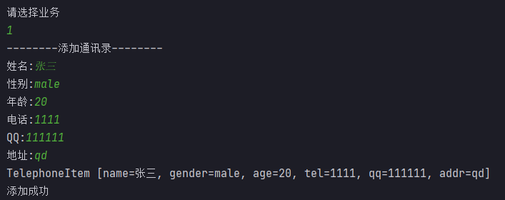
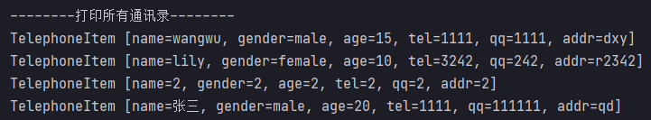
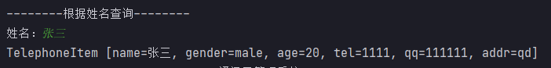
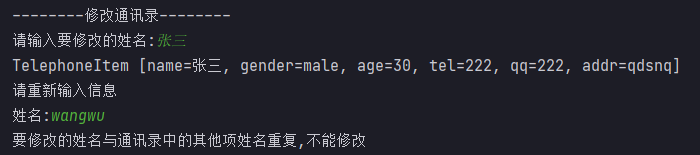

# 数据库连接池
## 一、连接池简介

> 连接池是一种管理连接的技术。
>
> 用连接池来管理Connection，可以重复使用连接。有了连接池，我们就不用自己来创建Connection，而是通过池来获取Connection对象。当使用完Connection后，调用Connection的close()方法也不会真的关闭Connection，而是把Connection**归还**给池。连接池就可以再利用这个Connection对象了。


> Java为数据库连接池提供了公共的接口：`javax.sql.DataSource`，各个厂商可以让自己的连接池实现这个接口。这样应用程序可以方便的切换不同厂商的连接池。

## 二、Druid连接池

> Druid是阿里巴巴开源的一个数据源，主要用于java数据库连接池，相比spring推荐的DBCP和hibernate推荐的C3P0、Proxool数据库连接池，Druid在市场上占有绝对的优势。

### 2.1、准备工作

> 1. 新建Java项目；
> 2. 在项目下新建lib目录；
> 3. 将MySQL驱动jar包和Druid jar包拷贝到lib目录下；
> 4. 选中lib目录右键Add as Library--单击OK。

### 2.2、Druid连接池使用入门

```java
import com.alibaba.druid.pool.DruidDataSource;
import com.alibaba.druid.pool.DruidPooledConnection;

import java.sql.SQLException;

public class Test1 {
    public static void main(String[] args) throws SQLException {
        //创建Druid连接池对象
        DruidDataSource dataSource = new DruidDataSource();

        //为Druid连接池设置参数
        dataSource.setDriverClassName("com.mysql.jdbc.Driver");
        dataSource.setUrl("jdbc:mysql://localhost:3306/mydbjdbc?useSSL=false");
        dataSource.setUsername("root");
        dataSource.setPassword("root");
        //初始化连接数量
        dataSource.setInitialSize(10);
        //最大连接数量
        dataSource.setMaxActive(100);
        //最小空闲连接
        dataSource.setMinIdle(5);

        //从连接池中获取连接
        Connection connection = dataSource.getConnection();
        //打印连接
        System.out.println(connection);
        
        //归还连接
        connection.close();
    }
}
```

> 通过上面操作我们知道了如何创建连接池，并且获取了连接，有了连接我们就可以进行CRUD操作。

### 2.3、封装工具类

> 在实际的开发中，连接池的参数我们不会在Java代码中写死，我们通常将其定义在独立的配置文件中。连接池我们通常放置在工具类中。**用户使用的时候直接使用工具类，不直接操作连接池。**
>
> 在src下创建jdbc.properties文件，内容如下

 ```properties
 #连接设置
 driverClassName=com.mysql.jdbc.Driver
 url=jdbc:mysql://localhost:3306/mydbjdbc?useSSL=false
 username=root
 password=root
 #初始化连接数量
 initialSize=10
 #最大连接数量
 maxActive=50
 #最小空闲连接
 minIdle=5
 ```

> 工具类代码如下

```sql
import com.alibaba.druid.pool.DruidDataSourceFactory;

import javax.sql.DataSource;
import java.io.IOException;
import java.io.InputStream;
import java.sql.Connection;
import java.sql.ResultSet;
import java.sql.SQLException;
import java.sql.Statement;
import java.util.Properties;

public class JdbcUtil {
    private static DataSource dataSource;

    static {
        try {
            Properties prop = new Properties();
            //读取配置文件
            InputStream in = JdbcUtil.class.getResourceAsStream("/jdbc.properties");
            prop.load(in);

            //创建DataSource
            dataSource = DruidDataSourceFactory.createDataSource(prop);
        } catch (IOException e) {
            e.printStackTrace();
        } catch (Exception e) {
            e.printStackTrace();
        }
    }

    //获取连接
    public static Connection getConnection() {
        Connection connection = null;
        try {
        	//从连接池获取连接
            connection = dataSource.getConnection();
        } catch (SQLException throwables) {
            throwables.printStackTrace();
        }
        return connection;
    }

    //释放资源
    public static void close(Connection connection, Statement statement, ResultSet rSet) {
        try {
            if(rSet != null) {
                rSet.close();
            }

            if(statement != null) {
                statement.close();
            }

            if(connection != null) {
                connection.close();
            }
        } catch (SQLException throwables) {
            throwables.printStackTrace();
        }
    }
}
```

> 我们已经完成了工具类的编写，接下来我们使用工具类进行CRUD操作。

#### 2.3.1、使用工具类进行添加操作

```java
public class Test2 {
    public static void main(String[] args) throws SQLException {
        String sql = "INSERT INTO tb_stu(sname, sage, sgender) VALUES(?, ?, ?)";

        //获取连接
        Connection connection = JdbcUtil.getConnection();
        //获取PreparedStatement
        PreparedStatement statement = connection.prepareStatement(sql);
        //设置参数
        statement.setString(1, "张三");
        statement.setInt(2, 30);
        statement.setString(3, "male");

        //发送SQL语句
        int i = statement.executeUpdate();
        System.out.println(i);

        //释放资源
        JdbcUtil.close(connection, statement, null);
    }
}
```

> 上面的代码，使用工具类完成了添加操作，**举一反三**，按照相同的套路我们可以完成修改和删除操作。

#### 2.3.2、使用工具类进行查询操作

```java
import com.qfedu.util.JdbcUtil;

import java.sql.Connection;
import java.sql.PreparedStatement;
import java.sql.ResultSet;
import java.sql.SQLException;

public class Test3 {
    public static void main(String[] args) throws SQLException {
        //查询名字叫张三的所有学生的信息
        String sql = "SELECT * FROM tb_stu WHERE sname=?";

        //获取连接
        Connection connection = JdbcUtil.getConnection();
        //获取PreparedStatement
        PreparedStatement statement = connection.prepareStatement(sql);
        //设置参数
        statement.setString(1, "张三");

        //发送SQL语句
        ResultSet rset = statement.executeQuery();

        //处理结果
        while(rset.next()) {
            int sid = rset.getInt("sid");
            String sname = rset.getString("sname");
            int sage = rset.getInt("sage");
            String sgender = rset.getString("sgender");
            System.out.println(sid + "---" + sname + "---" + sage + "---" + sgender);
        }

        //释放资源
        JdbcUtil.close(connection, statement, rset);
    }
}
```

## 三、三层架构

表示层：  和用户交互

业务逻辑层：  处理业务逻辑，控制事务

数据访问层：操作数据    

开发流程： 1 建库建表

​                    2建实体类 

​                    3数据访问层 (Dao、Mapper)

​                   4业务逻辑层

​                   5表示层

### 3.1、是什么

> - 表示层（View）：    (Controller)        和用户交互
>   - 命名：XXXView
>   - 职责：收集用户的数据和需求、展示数据。
>
> 
>
> - 业务逻辑层（Service）：      处理业务逻辑，控制事务
>   - 命名：XXXService（接口）、XXXServiceImpl（接口实现类）
>   - 职责：数据加工处理、调用DAO完成业务实现、控制事务。
>
> 
>
> - 数据访问层（Dao）：       操作数据
>   - 命名：XXXDao(接口)、XXXDaoImpl（接口实现类）
>   - 职责：向业务层提供数据，将业务层加工后的数据同步到数据库。


### 3.2、三层架构项目搭建（按开发步骤）

> - utils包存放工具类（JdbcUtils）
> - entity包存放实体类（Telephone）
> - dao包存放Dao接口（TelephoneDao）
>   - impl存放DAO接口实现类（TelephoneDaoImpl）
> - service存放Service接口（TelephoneService）
>   - impl存放Service接口实现类（TelephoneServiceImpl）
> - view 存放程序启动类（main）

- 程序设计时，考虑易修改、易扩展，为Service层和DAO层设计接口，便于未来更换实现类

### 3.3、案例

> 通讯录，实现对通讯录信息的CRUD操作。
>
> 要求，姓名是唯一的，姓名不能重复。
>
> 主界面


> 添加



> 添加同名信息


> 查询所有



> 根据姓名查询



> 修改通讯录


> 修改通讯里，修改的名字不存在


> 修改之后的名字和其他项名字重复，不允许修改


