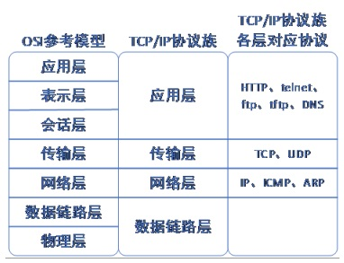
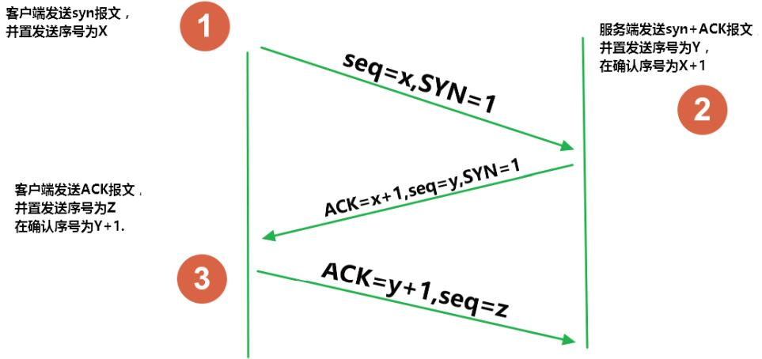
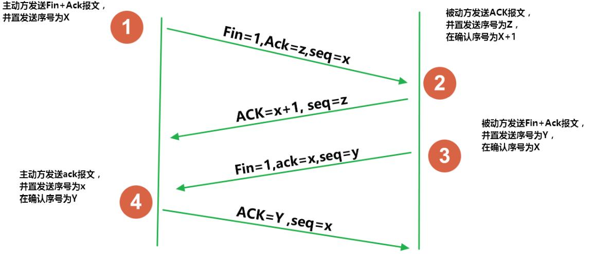

# 网络编程
## 一、概述

> 概念：
>
> * 用Java语言实现计算机间数据的信息传递和资源共享；
> * 其它编程语言也可以实现网络编程。
>
> 目的：
>
> * 直接或间接地通过网络协议与其它计算机进行通讯。
>
> 需要解决的问题：
>
> * 如何准确地定位网络上一台或多台主机；
> * 如何定位主机上的特定应用；
> * 找到主机后如何可靠高效地进行数据传输。

## 二、网络通信要素

> 如何实现网络中的主机互相通信？
>
> * 一定的规则（即：网络通信协议。有两套参考模型）
>   * `OSI`参考模型
>   * `TCP/IP`参考模型(或`TCP/IP`协议)
> * 通信双方地址
>   * IP地址
>   * 端口号

### 2.1、网络协议

> 一种规则，人和人交流有语言的规则，计算机之间通过网络交流也要有网络的规则。

#### 2.1.1、`OSI`参考模型


> 模型过于理想化，未能在因特网上进行广泛推广。

#### 2.1.2、`TCP\IP`协议


> 出现较早，事实上的标准。
>
> 两种协议之间存在对应关系：



> `TCP/IP`以其两个主要协议：传输控制协议(TCP)和网络互联协议(IP)而得名，实际上是一组协议，包括多个具有不同功能且互为关联的协议。

#### 2.1.3、`TCP`和`UDP`

> `TCP`协议：
>
> * 使用`TCP`协议前，须先建立`TCP`连接，形成传输数据通道；
> * 传输前，采用**三次握手**方式，是可靠的；
> * TCP协议进行通信的两个应用进程：**客户端**、**服务端**；
> * 在连接中可进行大数据量的传输；
> * 传输完毕，使用**四次挥手**方式，释放连接，结束传输，效率低。
>
> `UDP`协议：
>
> * 将数据、源、目的封装成数据包，不需要建立连接；
> * 每个数据报的大小限制在64KB内；
> * 因无需连接，故是不可靠的；
> * 发送数据结束时无需释放资源，速度快。
>
> 三次握手过程：



> 四次挥手过程：



> 为什么建立连接握手三次，关闭连接时需要是四次呢？
>
> TCP握手的时候，接收端发送`SYN+ACK`的包是将一个`ACK`和一个`SYN`合并到一个包中，所以减少了一次包的发送，三次完成握手。
>
> 对于四次挥手，因为TCP是全双工通信，在主动关闭方发送FIN包后，接收端可能还要发送数据，不能立即关闭服务器端到客户端的数据通道，所以也就不能将服务器端的`FIN`包与对客户端的`ACK`包合并发送，只能先确认 `ACK`，然后服务器待无需发送数据时再发送`FIN`包，所以四次挥手时必须是四次数据包的交互。

### 2.2、`IP`地址和端口号

#### 2.2.1、`IP`地址

> 唯一的标识Internet上的计算机（通信实体）。
>
> 本地回环地址：`127.0.0.1`。
>
> `IP`地址分类方式1：
>
> * `IPV4`：4个字节组成，4个0-255。大概42亿，30亿都在北美，亚洲4亿。2011年初已经用尽。以点分十进制表示，如`192.168.0.1`
> * `IPV6`：128位(16个字节)，写成8个无符号整数，每个整数用四个十六进制位表示， 数之间用冒号`:`分开，如：`3ffe:3201:1401:1280:c8ff:fe4d:db39:198`
>
> `IP`地址分类方式2：
>
> *  公网地址(万维网使用)和私有地址(局域网使用)。一般`192.168.`开头的就是私有址址，范围即为`192.168.0.0--192.168.255.255`，专门为组织机构内部使用。

#### 2.2.2、端口号

> **端口号**标识正在计算机上运行的进程(程序)，不同的进程有不同的端口号。端口号是一个`16`位的整数`0~65535`。
>
> 端口分类：
>
> * 公认端口：`0~1023`。被预先定义的服务通信占用(如：HTTP占用端口 80，FTP占用端口21，Telnet占用端口23)；
> * 注册端口：`1024~49151`。分配给用户进程或应用程序(如：Tomcat占用端口8080，MySQL占用端口3306，Oracle占用端口1521等)。
> * 动态/私有端口：`49152~65535`。
>
> 端口号与`IP`地址的组合得出一个网络套接字`Socket`。

#### 2.2.3、`InetAddress`类

> Internet上的主机有两种方式表示地址：
>
> * 域名，`stage1.codeaction.org`
> * `IP`地址：`216.127.178.187`
>
> `InetAddress`作用主要是表示IP地址，它有两个子类：
>
> * `Inet4Address`
> * `Inet6Address`
>
> `InetAddress`类对象含有一个Internet主机地址的域名和IP地址：
>
> * `stage1.codeaction.org`
> * `216.127.178.187`
>
> 域名容易记忆，当在连接网络时输入一个主机的域名后，域名服务器(DNS)负责将域名转化成IP地址，这样才能和主机建立连接。域名解析过程：
>
> * 先找本机`hosts`文件，是否有输入的域名地址；
> * 没有的话，再通过DNS服务器，找主机。
>
> `InetAddress`类没有提供公共的构造器，而是提供了如下几个静态方法来获取`InetAddress`实例：
>
> * `public static InetAddress getLocalHost()` 
> * `public static InetAddress getByName(String host) `
>
> `InetAddress`提供了如下几个常用的方法：
>
> * `public String getHostAddress()`：返回`IP`地址字符串(以文本表现形式)
> * `public String getHostName()`：获取此`IP`地址的主机名
> * `public boolean isReachable(int timeout)`：测试是否可以达到该地址

```java
import java.io.IOException;
import java.net.InetAddress;

public class MyTest1 {

	public static void main(String[] args) throws IOException {
		/*
		 * 对InetAdrress进行测试
		 * InetAddress表示的是IP地址
		 * */
		//获取InetAddress对象1
		//InetAddress address = InetAddress.getByName("127.0.0.1");
		InetAddress address = InetAddress.getByName("stage1.codeaction.org");//网址--域名
		System.out.println(address);
        
        InetAddress l1 = InetAddress.getByName("localhost");
        System.out.println(l1);

        //获取InetAddress对象2
        InetAddress l2 = InetAddress.getLocalHost();
        System.out.println(l2);
	
		//获取IP地址
		String ip = address.getHostAddress();
		System.out.println(ip);
		//获取主机名
		String hostName = address.getHostName();
		System.out.println(hostName);
		//测试主机是否可达 毫秒
		System.out.println(address2.isReachable(40));
	}
}
```

#### 2.2.4、网络套接字`Socket`

> 利用套接字(Socket)开发网络应用程序早已被广泛的采用，以至于成为事实上的标准。
>
> 网络上具有唯一标识的`IP`地址和端口号组合在一起才能构成唯一能识别的标志套接字。 
>
> 通信的两端都要有`Socket`，是两台机器间通信的端点。
>
> 网络通信其实就是`Socket`间的通信。
>
> `Socket`允许程序把网络连接当成一个流，数据在两个`Socket`间通过`IO`传输。
>
> 一般主动发起通信的应用程序属`客户端`，等待通信请求的为`服务端`。 
>
> `Socket`分类：
>
> * 流套接字(stream socket)：使用`TCP`提供**可依赖**的字节流服务；
> * 数据报套接字(datagram socket)：使用`UDP`提供**尽力而为**的数据报服务。
>
> `Socket`类的常用构造器：
>
> * `public Socket(InetAddress address, int port)`创建一个流套接字并将其连接到指定`IP`地址的指定端口号；
> * `public Socket(String host, int port)`创建一个流套接字并将其连接到指定主机上的指定端口号。
>
> `Socket`类的常用方法：
>
> * `getLocalAddress()`：返回本地`Socket`中的`IP`的`InetAddress`对象；
> * `getLocalPort()`：返回本地`Socket`中的端口号；
> * `getInetAddress()`：返回对方`Socket`中`IP`地址；
> * `getPort()`：返回对方`Socket`中的端口号；
> * `close()`：关闭套接字；
> * `getInputStream()`：获取输入流，用来读取数据；
> * `getOutputStream()`：获取输出流，用来发送数据。

## 三、基于`TCP`协议的网络编程

### 3.1、服务端

> 服务器程序的工作过程包含以下四个基本的步骤：
>
> 1. 调用`ServerSocket(int port)`：创建一个服务器端套接字，并绑定到指定端口上。用于监听客户端的请求；
> 2. 调用`accept()`：**监听**连接请求，如果客户端请求连接，则**接收连接**，返回套接字对象；
> 3. 调用该`Socket`类对象的`getOutputStream()`和`getInputStream()`，获取输出流和输入流，开始网络数据的发送和接收；
> 4. 关闭`ServerSocket`和`Socket`对象，客户端访问结束，关闭通信套接字。
>
> `ServerSocket`对象负责等待客户端请求建立套接字连接，类似邮局某个窗口中的业务员。也就是说，**服务器必须事先建立一个等待客户请求建立套接字连接的`ServerSocket`对象**，这个对象称为监听套接字。
>
> 所谓**接收**客户的套接字请求，就是`accept()`方法会返回一个`Socket`对象，这个对象称为**已连接套接字**。

```java
import java.io.IOException;
import java.io.InputStream;
import java.net.InetAddress;
import java.net.ServerSocket;
import java.net.Socket;

public class Server {

	public static void main(String[] args) throws IOException {
		/*
		 * 创建服务器
		 */
		// 创建监听套接字
		ServerSocket serverSocket = new ServerSocket(10001);
		while (true) {
			// 监听---->返回已连接套接字
			Socket socket = serverSocket.accept();
			// 获取对方地址信息
			InetAddress clientAddress = socket.getInetAddress();
			int port = socket.getPort();
			System.out.println(clientAddress.getHostAddress() + "连接, 端口号：" + port);
			byte[] arr = new byte[1024];
			String str = "";
			// 获取IO流
			InputStream in = socket.getInputStream();

			while (true) {
				// 获取客户端发送的消息
				int len = in.read(arr, 0, 1024);
				// 判断客户端是否关闭
				if (len == -1) {
					break;
				}
				// 将接受到的内容进行转换
				str = new String(arr, 0, len);
				System.out.println(str);
			}

			socket.close();
		}
		// serverSocket.close();
	}
}
```

### 3.2、客户端

>  客户端`Socket`的工作过程包含以下四个基本的步骤：
>
> 1. 创建`Socket`：根据指定服务端的`IP`地址或端口号构造`Socket`类对象。若服务器端响应，则建立客户端到服务器的通信线路。若连接失败，会出现异常；
> 2. 打开连接到`Socket`的输入/出流： 使用`getInputStream()`方法获得输入流，使用`getOutputStream()`方法获得输出流，进行数据传输；
> 3. 按照一定的协议对`Socket`进行读/写操作：通过输入流读取服务器放入线路的信息 （但不能读取自己放入线路的信息），通过输出流将信息写入线程；
> 4. 关闭`Socket`：断开客户端到服务器的连接，释放线路。

```java
import java.io.IOException;
import java.io.OutputStream;
import java.net.Socket;
import java.net.UnknownHostException;
import java.util.Scanner;

public class Client {

	public static void main(String[] args) throws UnknownHostException, IOException {
		/*
		 * 客户端
		 * */
		/*
		 * 创建套接字
		 * 需要制定服务器的IP地址和端口号
		 * 只要返回，就说明和服务器建立了连接
		 * */
		Socket socket = new Socket("127.0.0.1", 10001);
		//获取IO流，进行IO操作
		OutputStream out = socket.getOutputStream();
		
		Scanner sc = new Scanner(System.in);
		String str = "";
		while(true) {
			//获取用户输入的信息
			str = sc.next();
			//用户输入exit退出
			if(str.equals("exit")) {
				break;
			}
			//发送到服务器
			out.write(str.getBytes());
		}
		//关闭socket
		socket.close();
	}
}
```

### 3.3、支持多客户端的服务器

> 使用多线程

```java
import java.io.IOException;
import java.io.InputStream;
import java.net.InetAddress;
import java.net.Socket;

public class LinkThread extends Thread {
    private Socket socket;

    public LinkThread(Socket socket) {
        this.socket = socket;
    }

    @Override
    public void run() {
        try {
            InetAddress address = socket.getInetAddress();
            String hostAddress = address.getHostAddress();
            int port = socket.getPort();
            System.out.println(hostAddress + ":" + port + "已连接");
            InputStream in = socket.getInputStream();
            int len = 0;
            byte[] arr = new byte[1024];

            while((len = in.read(arr)) != -1) {
                String s = new String(arr, 0, len);
                System.out.println(hostAddress + ":" + port + "---" + s);
            }

            socket.close();
        } catch (IOException e) {
            e.printStackTrace();
        }
    }
}

public class Server1 {
    public static void main(String[] args) throws IOException {
        //创建监听套接字
        ServerSocket serverSocket = new ServerSocket(10001);

        while (true) {
            //获取已连接套接字
            Socket socket = serverSocket.accept();
            LinkThread linkThread = new LinkThread(socket);
            linkThread.start();
        }
    }
}
```

## 四、基于`UDP`协议的网络编程

> 类`DatagramSocket`和`DatagramPacket`实现了基于`UDP`协议网络程序。
>
> `UDP`数据报通过数据报套接字`DatagramSocket`发送和接收，系统不保证`UDP`数据报一定能够安全送到目的地，也不能确定什么时候可以抵达。 
>
> `DatagramPacket`对象封装了`UDP`数据报，在数据报中包含了发送端的`IP`地址和端口号以及接收端的`IP`地址和端口号。
>
> `UDP`协议中每个数据报都给出了完整的地址信息，因此无须建立发送方和接收方的连接。如同发快递包裹一样。
>
> `DatagramSocket`类的常用方法：
>
> * `public DatagramSocket(int port)`：创建数据报套接字并将其绑定到本地主机上的指定端口。套接字将被绑定到通配符地址，`IP`地址由内核来选择；
> * `public DatagramSocket(int port,InetAddress laddr)`：创建数据报套接字，将其绑定到指定的本地地址。 本地端口必须在0到65535之间（包括两者）。如果IP地址为 0.0.0.0，套接字将被绑定到通配符地址，IP 地址由内核选择；
> * `public void close()`：关闭此数据报套接字；
> * `public void send(DatagramPacket p)`：从此套接字发送数据报包。`DatagramPacket`包含的信息指示：将要发送的数据、其长度、远程主机的`IP`地址和远程主机的端口号；
> * `public void receive(DatagramPacket p)`：从此套接字接收数据报包。当此方法返回时，`DatagramPacket`的缓冲区填充了接收的数据。数据报包也包含发送方的`IP`地址和发送方机器上的端口号。 此方法在接收到数据报前一直阻塞。数据报包对象的`length`字段包含所接收信息的长度。如果信息比包的长度长，该信息将被截短；
> * `public InetAddress getLocalAddress()`：获取套接字绑定的本地地址；
> * `public int getLocalPort()`：返回此套接字绑定的本地主机上的端口号；
> * `public InetAddress getInetAddress()`：返回此套接字连接的地址。如果套接字未连接，则返回`null`；
> * `public int getPort()`：返回此套接字的端口。如果套接字未连接，则返回`-1`。
>
> `DatagramPacket`类的常用方法：
>
> * `public DatagramPacket(byte[] buf,int length)`：构造`DatagramPacket`，用来接收长度为`length`的数据包。`length`参数必须小于等于`buf.length`；
> * `public DatagramPacket(byte[] buf,int length,InetAddress address,int port)`：构造数据报包，用来将长度为`length`的包发送到指定主机上的指定端口号。`length`参数必须小于等于`buf.length`；
> * `public InetAddress getAddress()`：返回某台机器的`IP`地址，此数据报将要发往该机器或者是从该机器接收到的；
> * `public int getPort()`：返回某台远程主机的端口号，此数据报将要发往该主机或 者是从该主机接收到的。
> * `public byte[] getData()`：返回数据缓冲区。接收到的或将要发送的数据从缓冲区中的偏移量`offset`处开始，持续`length`长度；
> * `public int getLength()`：返回将要发送或接收到的数据的长度。
>
> `UDP`网络通信流程：
>
> 1. 建立发送端、接收端；
> 2. 建立数据包；
> 3. 调用`Socket`的发送、接收方法；
> 4. 关闭`Socket`。
>
> 发送端与接收端是两个独立的运行程序。

```java
public class Recv {
    public static void main(String[] args) {
        DatagramSocket datagramSocket = null;
        try {
            datagramSocket = new DatagramSocket(10001);
            byte[] arr = new byte[1024];

            DatagramPacket packet = new DatagramPacket(arr, arr.length);
            datagramSocket.receive(packet);

            String s = new String(packet.getData(), 0, packet.getLength());
            //System.out.println(Arrays.toString(arr));
            System.out.println(s);
        } catch (SocketException e) {
            e.printStackTrace();
        } catch (IOException e) {
            e.printStackTrace();
        } finally {
            if(datagramSocket != null) {
                datagramSocket.close();
            }
        }
    }
}

public class Send {
    public static void main(String[] args) {
        DatagramSocket socket = null;

        try {
            socket = new DatagramSocket();
            byte[] arr = "hello".getBytes();
            DatagramPacket packet = new DatagramPacket(arr, 0, arr.length, InetAddress.getByName("127.0.0.1"), 10001);
            socket.send(packet);
        } catch (SocketException e) {
            e.printStackTrace();
        } catch (UnknownHostException e) {
            e.printStackTrace();
        } catch (IOException e) {
            e.printStackTrace();
        } finally {
            if(socket != null) {
                socket.close();
            }
        }
    }
}
```

