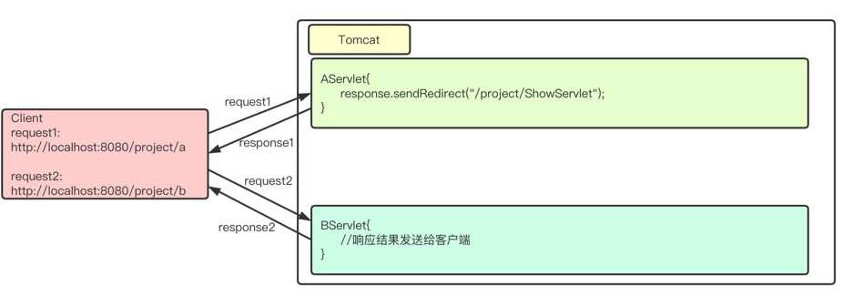

# Servlet
**GET和POST区别：**

* **GET**
  * **可以在请求的URL地址后以?的形式带上交给服务器的数据，多个数据之间以&进行分隔，不安全**
  * **在URL地址后附带的参数是有限制的，其数据容量通常不能超过1K**
  * **GET请求没有请求体**
* **POST**
  * **传送的数据量无限制**
  * **传输的数据在请求体内**
  * **请求参数不会显示浏览器的地址栏，相对安全**


**Servlet作用：**

* **接收请求**
* **处理数据**
* **做出响应**

**Servlet是单例的**    ------>   Spring 默认也是单例

**Servlet声明周期: 实例化 、初始化、处理请求、销毁**

**load-on-startup ----->web应用程序启动的时候就加载这个servlet**

**创建Servlet的三种方式： 1实现Servlet接口**

​                                               **2继承GenericServlet类**

​                                            **3继承HttpServlet类  （doGet() 和 doPost（））**

配置Servlet的两种方式：  给Servlet加访问路径

    1) web.xml方式
    1) **注解,@WebServlet()**

**response :  1)设置响应正文    字符流    PrintWriter**  

​                     **2)重定向      302        Location设置重定向地址**

**request获取请求数据:     getParameter()** 和getParameterValues（）

**解决乱码问题**

**request.setCharacterEncoding("utf-8"); //解决请求乱码**
**response.setContentType("text/html;charset=utf-8");//解决响应乱码**

**请求转发和重定向的区别**

* **请求转发是一个请求，而重定向是两个请求**
* **请求转发后浏览器地址栏不会有变化，而重定向会有变化，因为重定向是两个请求**
* **请求转发的目标只能是本应用中的资源，重定向的目标可以是其他应用**
* **请求转发对AServlet和BServlet的请求方法是相同的，即要么都是GET，要么都是POST，因为请求转发是一个请求**
* 重定向的第二个请求一定是GET

## 一、简介

> Server Applet（服务器小程序），是由服务器端调用和执行的、按照Servlet自身规范编写的**Java类**。
>
> JavaWeb的三大组件（**Servlet**、**Filter**、Listener）之一，是动态资源的一种。
>
> 作用：  
>
> * **接收请求**
> * **处理数据**
> * **完成响应**
>
> 后续我们学习Servlet也是集中在这三点。

## 二、Servlet入门案例

### 2.1、编写Servlet

> * 实现`javax.servlet.Servlet`
> * 重写5个主要方法
>
> - 在核心的`service()`方法中编写输出语句，打印访问结果
>
>   使用Servlet接口，要引入servlet-api.jar
>
>   **前置处理：把tomcat/lib/servlet-api.jar拷贝到项目WEB-INF/lib目录下**

```java
package com.qfedu.servlet;

import javax.servlet.*;
import javax.servlet.http.*;
import java.io.IOException;
import java.io.PrintWriter;

public class TestServlet implements Servlet {
	public void init(ServletConfig config) throws ServletException{
	}
    
	public void service(ServletRequest request,ServletResponse response) throws ServletException,IOException{
		System.out.println("My First Servlet!");
	}
    
	public void destroy(){
	
	}
    
	public ServletConfig getServletConfig(){
		return null;	
	}	
    
	public String getServletInfo(){
		return null;
	}
}
```

### 2.2、配置Servlet

> 在web.xml中配置Servlet

```xml
<?xml version="1.0" encoding="UTF-8"?>
<web-app xmlns="http://xmlns.jcp.org/xml/ns/javaee"
         xmlns:xsi="http://www.w3.org/2001/XMLSchema-instance"
         xsi:schemaLocation="http://xmlns.jcp.org/xml/ns/javaee http://xmlns.jcp.org/xml/ns/javaee/web-app_3_1.xsd"
         version="3.1">
    <!-- 1、添加servlet节点 -->
    <servlet>
        <!-- Servlet的名字，和2中的名字必须一致 -->
        <servlet-name>aServlet</servlet-name>
        <!-- Servlet的全类名 -->
        <servlet-class>com.qfedu.servlet.AServlet</servlet-class>
    </servlet>
    <!-- 2、添加servlet-mapping节点 -->
    <servlet-mapping>
        <!-- Servlet的名字，和1中的名字必须一致 -->
        <servlet-name>aServlet</servlet-name>
        <!-- Servlet的访问路径，通过该路径可以访问doServlet的Get或doPost方法 -->
       	<url-pattern>/aServlet</url-pattern>
    </servlet-mapping>
</web-app>
```

> `url-pattern`配置的内容就是浏览器地址栏输入的URL中项目名称后资源的内容

### 2.3、访问Servlet

> 在Tomcat中部署该项目，访问`http://localhost:8080/项目名/testServlet`，控制台及浏览器有输出证明Servlet部署及访问成功。

### 2.4、常见错误

> 500错误：**服务器内部出现了错误**
>
> 修改TestServlet代码如下：

```java
package com.qfedu.servlet;

import javax.servlet.*;
import java.io.IOException;

public class AServlet implements Servlet {

    @Override
    public void init(ServletConfig servletConfig) throws ServletException {

    }

    @Override
    public ServletConfig getServletConfig() {
        return null;
    }

    @Override
    public void service(ServletRequest servletRequest, ServletResponse servletResponse) throws ServletException, IOException {
        System.out.println("My First Servlet!");
        String str = null;
        System.out.println(str.length());
    }

    @Override
    public String getServletInfo() {
        return null;
    }

    @Override
    public void destroy() {

    }
}
```

> 运行JavaWeb项目，访问TestServlet，页面显示如下：


## 三、Servlet详解

> **Servlet是单例的，**一个类型的Servlet只有一个实例对象，那么就有可能会出现一个Servlet同时处理多个请求，Servlet不不应该在Servlet中创建成员变量，因为可能会存在一个线程对这个成员变量进行写操作，另一个线程对这个成员变量进行读操作。
>
> * 不要在Servlet中创建成员，创建局部变量即可；
> * 可以创建无状态成员；//不能存数据 
> * 可以创建有状态的成员，但状态必须为只读的。 //不能修改      final

### 3.1、实现Servlet的三种方式   面试

#### 3.1.1、实现Servlet接口

> `javax.servlet.Servlet`代码

```java
public interface Servlet {
    void init(ServletConfig var1) throws ServletException;
    ServletConfig getServletConfig();
    void service(ServletRequest var1, ServletResponse var2) throws ServletException, IOException;
    String getServletInfo();
    void destroy();
}
```

> Servlet中的大多数方法不由我们来调用，而是由Tomcat来调用，并且Servlet的对象也不由我们来创建，**由Tomcat来创建！**
>
> 生命周期方法
>
> * **init()      初始化** 
>   * 服务器会在Servlet第一次被访问时创建Servlet，在Servlet被创建后，服务器会马上调用Servlet的void init(ServletConfig)方法；
>   * 在整个servlet的生命周期中，**该方法只被调用一次**。
> * **service()   处理请求**
>   * 当服务器每次接收到请求时，都会去调用Servlet的service()方法来处理请求；
>   * **每次处理请求都会被调用**
> * **destroy()    销毁**
>   * 在服务器被关闭时，服务器会去销毁Servlet，在销毁Servlet之前服务器会先去调用Servlet的destroy()方法；
>   * 在整个servlet的生命周期中**，该方法只被调用一次**。
>
> 生命周期方法方法演示

```java
package com.qfedu.servlet;

import javax.servlet.*;
import java.io.IOException;

public class BServlet implements Servlet {

    @Override
    public void init(ServletConfig servletConfig) throws ServletException {
        System.out.println("init...");
    }

    @Override
    public ServletConfig getServletConfig() {
        return null;
    }

    @Override
    public void service(ServletRequest servletRequest, ServletResponse servletResponse) throws ServletException, IOException {
        System.out.println("service...");
    }

    @Override
    public String getServletInfo() {
        return null;
    }

    @Override
    public void destroy() {
        System.out.println("destroy...");
    }
}
```

> 在web.xml中配置Servlet

```xml
<servlet>
    <servlet-name>bServlet</servlet-name>
    <servlet-class>com.qfedu.servlet.BServlet</servlet-class>
</servlet>
<servlet-mapping>
    <servlet-name>bServlet</servlet-name>
    <url-pattern>/bServlet</url-pattern>
</servlet-mapping>
```

> 启动tomcat->访问BServlet->关闭tomcat
>
> 观察控制台的打印。
>
> 关于ServletConfig
>
> * 一个ServletConfig对象对应一段web.xml中的配置信息
> * ServletConfig是一个接口，该接口实现类的对象由Tomcat提供
> * 方法
>   * **getInitParameter(java.lang.String name)  获取servlet的初始化参数**
>   * getInitParameterNames() 
>   * getServletContext() 
>   * getServletName() 
>
> 修改BServlet代码

```java
package com.qfedu.servlet;

import javax.servlet.*;
import java.io.IOException;

public class BServlet implements Servlet {

    @Override
    public void init(ServletConfig servletConfig) throws ServletException {
        System.out.println("init...");
        System.out.println(servletConfig.getInitParameter("name"));
    }

    @Override
    public ServletConfig getServletConfig() {
        return null;
    }

    @Override
    public void service(ServletRequest servletRequest, ServletResponse servletResponse) throws ServletException, IOException {
        System.out.println("service...");
    }

    @Override
    public String getServletInfo() {
        return null;
    }

    @Override
    public void destroy() {
        System.out.println("destroy...");
    }
}
```

> 修改web.xml关于BServlet的配置

```xml
<servlet>
    <servlet-name>bServlet</servlet-name>
    <servlet-class>com.qfedu.servlet.BServlet</servlet-class>
    <!-- BServlet初始化参数 -->
    <init-param>
        <param-name>name</param-name>
        <param-value>zhangsan</param-value>
    </init-param>
</servlet>
<servlet-mapping>
    <servlet-name>bServlet</servlet-name>
    <url-pattern>/bServlet</url-pattern>
</servlet-mapping>
```

#### 3.1.2、继承GenericServlet类

> GenericServlet使编写Servlet变得更容易。它提供生命周期方法init和destroy的简单实现，要编写一般的Servlet，只需重写抽象service方法即可。
>
> 代码如下：

```java
package com.qfedu.servlet;

import javax.servlet.GenericServlet;
import javax.servlet.ServletException;
import javax.servlet.ServletRequest;
import javax.servlet.ServletResponse;
import java.io.IOException;

public class CServlet extends GenericServlet {

    @Override
    public void service(ServletRequest servletRequest, ServletResponse servletResponse) throws ServletException, IOException {
        System.out.println("CServlet....");
    }
}
```

> web.xml配置CServlet

```xml
<servlet>
    <servlet-name>cServlet</servlet-name>
    <servlet-class>com.qfedu.servlet.CServlet</servlet-class>
</servlet>
<servlet-mapping>
    <servlet-name>cServlet</servlet-name>
    <url-pattern>/cServlet</url-pattern>
</servlet-mapping>
```

#### 3.1.3、继承HttpServlet类   重点

> HttpServlet类是GenericServlet的子类，它提供了对HTTP请求的特殊支持，所以通常我们都会通过继承HttpServlet来完成自定义的Servlet。
>
> 在HttpServlet的`service(HttpServletRequest,HttpServletResponse)`方法会去判断当前请求是GET还是POST，如果是GET请求，那么会去调用本类的doGet()方法，如果是POST请求会去调用doPost()方法，这说明我们在子类中去覆盖doGet()或doPost()方法即可。

```java
package com.qfedu.servlet;

import javax.servlet.*;
import javax.servlet.http.*;
import java.io.IOException;

public class DServlet extends HttpServlet {
    @Override
    protected void doGet(HttpServletRequest request, HttpServletResponse response) throws ServletException, IOException {
        System.out.println("doGet.......");
    }

    @Override
    protected void doPost(HttpServletRequest request, HttpServletResponse response) throws ServletException, IOException {
        System.out.println("doPost........");
    }
}
```

> web.xml配置DServlet

```xml
<servlet>
    <servlet-name>dServlet</servlet-name>
    <servlet-class>com.qfedu.servlet.DServlet</servlet-class>
</servlet>
<servlet-mapping>
    <servlet-name>dServlet</servlet-name>
    <url-pattern>/dServlet</url-pattern>
</servlet-mapping>
```

### 3.2、配置Servlet的两种方式

#### 3.2.1、web.xml方式

> Servlet2.5及之前使用该方式

```xml
<!-- 1、添加servlet节点 -->
<servlet>
    <!-- Servlet的名字，和2中的名字必须一致 -->
    <servlet-name>aServlet</servlet-name>
    <!-- Servlet的全类名 -->
    <servlet-class>com.qfedu.servlet.AServlet</servlet-class>
    <!-- 配置启动加载 -->
    <load-on-startup>1</load-on-startup>
</servlet>
<!-- 2、添加servlet-mapping节点 -->
<servlet-mapping>
    <!-- Servlet的名字，和1中的名字必须一致 -->
    <servlet-name>aServlet</servlet-name>
    <!-- Servlet的访问路径，通过该路径可以访问doServlet的Get或doPost方法 -->
    <url-pattern>/aServlet</url-pattern>
</servlet-mapping>
```

> url-pattern定义匹配规则，取值说明：
>
> * **精确匹配`/具体的名称`只有url路径是具体的名称的时候才会找到Servlet**
> * 后缀匹配 `*.xxx`只要是以xxx结尾的就匹配触发Servlet  了解   .do /.action
> * 通配符匹配 `/*`匹配所有请求，包含服务器的所有资源   了解         SpringMVC  （前端控制器--Servlet）
> * 通配符匹配`/`匹配所有请求，包含服务器的所有资源，不包括jsp    了解
>
> load-on-startup     
>
> * **web应用程序启动的时候就加载这个servlet**；
> * 它的值必须是一个整数，表示servlet被加载的先后顺序；
> * 如果该元素的值为负数或者没有设置，则容器会当Servlet被请求时再加载；
> * 如果值为正整数或者0时，表示容器在应用启动时就加载并初始化这个servlet，值越小，servlet的优先级越高，就越先被加载。值相同时，容器就会自己选择顺序来加载。

#### 3.2.2、注解方式

> Servlet3.0新增特性，推荐使用
>
> @WebServlet常用属性
>
> * name：Serlvet名字，可选
> * value:：配置url路径，可以配置多个
>
> * urlPatterns：配置url路径 ，和value作用一样，不能同时和value使用
>
> * loadOnStartup：配置Servlet的创建的时机， 如果是0或者正数，启动程序时创建，如果是负数，则访问时创建。 数字越小优先级越高。

```java
package com.qfedu.servlet;

import javax.servlet.*;
import javax.servlet.http.*;
import javax.servlet.annotation.*;
import java.io.IOException;

@WebServlet(name = "EServlet", value = "/eServlet", loadOnStartup = 1)
public class EServlet extends HttpServlet {
    @Override
    protected void doGet(HttpServletRequest request, HttpServletResponse response) throws ServletException, IOException {
        System.out.println("doGet...");
    }

    @Override
    protected void doPost(HttpServletRequest request, HttpServletResponse response) throws ServletException, IOException {
        System.out.println("doPost...");
    }
}
```

### 3.3、常见问题

> 1. HTTP Status 404资源找不到
>    * 第一种情况：地址书写错误；
>    * 第二种情况：地址没有问题，把IDEA项目中out目录删除，然后重新运行。
> 2. Serlvet地址配置重复，多个Servlet的url-pattern使用相同的值
> 3. Serlvet地址配置错误，比如没有写`/`。 

## 四、request和response

### 4.1、请求响应流程


### 4.2、response对象

> reponse类型为`javax.servlet.http.HttpServletResponse`，客户端发出每个请求时，服务器都会创建一个response对象，并传入给`Servlet.service()`方法。response对象是用来对客户端进行响应的，这说明在service()方法中使用response对象可以完成对客户端的响应工作。
>
> 主要功能
>
> * **设置响应正文**
> * 设置响应头信息
> * 发送状态码
> * **重定向         302**

#### 4.2.1、设置响应正文

> 关于设置响应正文   **PrintWriter out = response.getWriter()  重点**
>
> * response是响应对象，向客户端输出响应正文（响应体）可以使用response的响应流，常用方法：
>
>   * `PrintWriter out = response.getWriter()`：获取字符流---16
>   * `ServletOutputStream out = response.getOutputStream()`：获取字节流---8
>
> * 如果响应正文内容为字符，那么使用response.getWriter()，如果响应内容是字节，例如下载时，那么可以使用response.getOutputStream()；
>
>   **注意**：在一个请求中，不能同时使用这两个流，也就是说，要么你使用`repsonse.getWriter()`，要么使用`response.getOutputStream()`，但不能同时使用这两个流。不然会抛出`IllegalStateException`异常。      （文件的上传与下载）
>
> 例：在页面打印文字，字体颜色为红色。

```java
package com.qfedu.servlet;

import javax.servlet.*;
import javax.servlet.http.*;
import javax.servlet.annotation.*;
import java.io.IOException;
import java.io.PrintWriter;

@WebServlet(name = "FServlet", value = "/FServlet")
public class FServlet extends HttpServlet {
    @Override
    protected void doGet(HttpServletRequest request, HttpServletResponse response) throws ServletException, IOException {
        PrintWriter out = response.getWriter();  //获取字符流对象
        out.println("<p style='color:red;'>Hello World</p>");
        out.println("<p style='color:red;'>你好世界</p>");
    }

    @Override
    protected void doPost(HttpServletRequest request, HttpServletResponse response) throws ServletException, IOException {

    }
}
```

#### 4.2.2、响应乱码问题处理

> 问题分析：
>
> 1. 在使用`response.getWriter()`时默认字符编码为`ISO-8859-1`，不支持中文；
> 2. 如果希望设置字符流的字符编码为utf-8，可以使用`response.setCharacterEncoding(“utf-8”)`来设置，这样可以保证输出给客户端的字符都是使用的UTF-8编码；
> 3. 客户端浏览器并不知道响应数据是什么编码的，浏览器解析之后依然出现乱码。
>
> 解决方案：
>
> * 使用`**response.setContentType("text/html;charset=utf-8")； 重点**
> * **一定要在获取输出流前进行设置**；
> * 优势
>   * 设置content-type响应头，客户端浏览器会使用content-type头来解读响应数据；
>   * 这个方法还会调用`response.setCharacterEncoding(“utf-8”)`保证输出给客户端的字符都是使用UTF-8编码的。
>
> 上述案例修改

```java
package com.qfedu.servlet;

import javax.servlet.*;
import javax.servlet.http.*;
import javax.servlet.annotation.*;
import java.io.IOException;
import java.io.PrintWriter;

@WebServlet(name = "FServlet", value = "/FServlet")
public class FServlet extends HttpServlet {
    @Override
    protected void doGet(HttpServletRequest request, HttpServletResponse response) throws ServletException, IOException {
        //设置响应头
        response.setContentType("text/html;charset=utf-8");

        PrintWriter out = response.getWriter();
        out.println("<p style='color:red;'>Hello World</p>");
        out.println("<p style='color:red;'>你好世界</p>");
    }

    @Override
    protected void doPost(HttpServletRequest request, HttpServletResponse response) throws ServletException, IOException {

    }
}
```

#### 4.2.3、重定向

  302

> 现象：当访问`http://baidu.com`时，发现地址栏变成`https://www.baidu.com`，这就是重定向了。
>
> 概念：重定向是服务器通知浏览器去访问另一个地址，即再发出另一个请求。



> 实现方式1：
>
> 1. 设置响应码`response.setStatus(302);`；
> 2. 设置重定向的位置`response.setHeader("Location", "/项目名/bServlet");`。
>
> 实现方式2：
>
> * `response.sendRedirect("/项目名/bServlet");`

```java
package com.qfedu.servlet;

import javax.servlet.*;
import javax.servlet.http.*;
import javax.servlet.annotation.*;
import java.io.IOException;

@WebServlet(name = "GServlet", value = "/GServlet")
public class GServlet extends HttpServlet {
    @Override
    protected void doGet(HttpServletRequest request, HttpServletResponse response) throws ServletException, IOException {
        System.out.println("GServlet............................");
        //实现方式1
        //response.setStatus(302);
        //response.setHeader("Location", "/JavaWebTest_war_exploded/bServlet");
        //实现方式2
        response.sendRedirect("/JavaWebTest_war_exploded/bServlet");
    }

    @Override
    protected void doPost(HttpServletRequest request, HttpServletResponse response) throws ServletException, IOException {

    }
}
```

> 关于重定向的总结
>
> * 重定向是两次请求        
>
> * 重定向的URL可以是其他应用，不局限于当前应用，例如重定向到百度
>
> * 重定向的响应状态码为302，并且必须要有Location响应头
>
>   

### 4.3、request对象

> request是`Servlet.service()`方法的一个参数，类型为`javax.servlet.http.HttpServletRequest`。在客户端发出每个请求时，服务器都会创建一个request对象，并把请求数据封装到request中，然后在调用`Servlet.service()`方法时传递给service()方法，这说明在service()方法中可以通过request对象来获取请求数据。
>
> 主要功能
>
> * 获取请求头
> * 获取请求参数    ------>   获取请求数据
> * 域对象功能    
> * 请求转发和请求包含

#### 4.3.1、获取请求头（了解）

> **`String getMethod()`：返回请求方法，例如：GET  了解**
>
> `String getRemoteAddr()`：返回当前客户端的IP地址
>
> `String getRemoteHost()`：返回当前客户端的主机名，但这个方法的实现还是获取IP地址
>
> `String getServerName()`：返回主机名，例如：localhost
>
> `int getServerPort()`：返回服务器端口号，例如：8080

```java
package com.qfedu.servlet;

import javax.servlet.*;
import javax.servlet.http.*;
import javax.servlet.annotation.*;
import java.io.IOException;

@WebServlet(name = "HServlet", value = "/HServlet")
public class HServlet extends HttpServlet {
    @Override
    protected void doGet(HttpServletRequest request, HttpServletResponse response) throws ServletException, IOException {
        System.out.println("请求方法：" + request.getMethod());
        System.out.println("客户端IP：" + request.getRemoteAddr());
        System.out.println("客户端主机名：" + request.getRemoteHost());
        System.out.println("主机名：" + request.getServerName());
        System.out.println("服务器端口号：" + request.getServerPort());
        System.out.println("客户端端口号：" + request.getRemotePort());
    }

    @Override
    protected void doPost(HttpServletRequest request, HttpServletResponse response) throws ServletException, IOException {

    }
}
```

#### 4.3.2、获取请求参数    重点

> 客户端传递参数方式有两种（GET和POST）
>
> * 浏览器地址栏直接输入：一定是GET请求
> * 超链接：一定是GET请求         a         location.href
> * 表单：可以是GET，也可以是**POST**，这取决与form的method属性值
>
> **GET请求和POST请求的区别   面试**
>
> * GET
>   * 可以在请求的URL地址后以?的形式带上交给服务器的数据，多个数据之间以&进行分隔，不安全
>   * 在URL地址后附带的参数是有限制的，其数据容量通常不能超过1K
>   * GET请求没有请求体
> * POST
>   * 传送的数据量无限制
>   * 传输的数据在请求体内
>   * 请求参数不会显示浏览器的地址栏，相对安全
>
> request获取请求参数的API   **getParameter() 重点**   **getParameterValues了解**
>
> * `String getParameter(String name)`：通过指定名称获取参数值（必须掌握**）  **重点**
> * `String[] getParameterValues(String name)`：当多个参数名称相同时，可以使用方法来获取
> * `Enumeration getParameterNames()`：获取所有参数的名字
> * `Map getParameterMap()`：获取所有参数封装到Map中，其中key为参数名，value为参数值，因为一个参数名称可能有多个值，所以参数值是String[]，而不是String
>
> Servlet代码如下：

```java
package com.qfedu.servlet;

import javax.servlet.*;
import javax.servlet.http.*;
import javax.servlet.annotation.*;
import java.io.IOException;
import java.util.Arrays;

@WebServlet(name = "IServlet", value = "/IServlet")
public class IServlet extends HttpServlet {
    @Override
    protected void doGet(HttpServletRequest request, HttpServletResponse response) throws ServletException, IOException {
        //获取请求参数
        String username = request.getParameter("username");
        System.out.println(username);
		
        //当多个参数名称相同时，可以使用方法来获取
        String[] hobbies = request.getParameterValues("hobby");
        System.out.println(Arrays.toString(hobbies));
    }

    @Override
    protected void doPost(HttpServletRequest request, HttpServletResponse response) throws ServletException, IOException {
        doGet(request, response);
    }
}
```

> Get方式提交：
>
> `http://localhost:8080/JavaWebTest_war_exploded/IServlet?username=zs&hobby=睡觉&hobby=game`
>
> Post方式提交：
>
> **注意点：**
>
> **1 index.html不要建在WEB-INF下**
>
> **2 action路径不能随意写，要写成"/项目的访问路径/Servlet的访问路径"**
>
> **3 标签的name属性要和request.getParameter(key) 一致**
>
> **4 出现乱码,request.setCharacterEncoding("utf-8")  response.setContentType("text/html;charset=utf-8")**

```html
<!DOCTYPE html>
<html lang="en">
<head>
    <meta charset="UTF-8">
    <title>Title</title>
</head>
<body>
    <form action="/JavaWebTest_war_exploded/IServlet" method="post">
        用户名<input type="text" name="username" /><br/>
        爱好<input type="checkbox" name="hobby" value="睡觉1">睡觉1
        <input type="checkbox" name="hobby" value="睡觉2">睡觉2
        <input type="checkbox" name="hobby" value="睡觉3">睡觉3
        <button type="submit">提交</button>
    </form>
</body>
</html>
```

#### 4.3.3、请求乱码问题处理

> Get请求乱码
>
> * Tomcat8的版本中get方式不会出现乱码了，因为服务器对url的编码格式可以进行自动转换。
>
> POST请求乱码
>
> * 由于客户端是以UTF-8字符编码将表单数据传输到服务器端的，因此服务器也需要设置以UTF-8字符编码进行接收。
> * 解决方案：使用从ServletRequest接口继承而来的`setCharacterEncoding(charset)`方法进行统一的编码设置。
>
> 修改IServlet代码如下：

```java
import javax.servlet.*;
import javax.servlet.http.*;
import javax.servlet.annotation.*;
import java.io.IOException;
import java.util.Arrays;

@WebServlet(name = "IServlet", value = "/IServlet")
public class IServlet extends HttpServlet {
    @Override
    protected void doGet(HttpServletRequest request, HttpServletResponse response) throws ServletException, IOException {
        //设置请求编码
        request.setCharacterEncoding("utf-8");

        //获取请求参数
        String username = request.getParameter("username");
        System.out.println(username);
        //当多个参数名称相同时，可以使用方法来获取
        String[] hobbies = request.getParameterValues("hobby");
        System.out.println(Arrays.toString(hobbies));
    }

    @Override
    protected void doPost(HttpServletRequest request, HttpServletResponse response) throws ServletException, IOException {
        doGet(request, response);
    }
}
```

#### 4.3.4、域对象功能

> * 域对象作用就是在多个Servlet之间传递数据
> * request可以在一个请求中共享数据，一个请求会创建一个request对象，如果在一个请求中经历了多个Servlet，那么多个Servlet就可以使用request来共享数据
> * 域方法    request请求域
>   * 存`void setAttribute(String name, Object value)`
>   * 取`Object getAttribute(String name)`
>   * 删除`void removeAttribute(String name)`
> * 一个请求可以通过转发、包含跨越多个servlet，在这个请求链之上的servlet可以通过request共享数据

#### 4.3.5、请求转发

> 转发的作用在服务器端，将请求发送给服务器上的其他资源，以共同完成一次请求的处理，多个Servlet或JSP共同来处理一个请求。


> 实现步骤：
>
> 1. 创建调度器`RequestDispatcher rd = request.getRequestDispatcher("/BServlet");`
> 2. 转发`rd.forward(request, response);`
>
> 以下代码实现转发，并通过request域传递数据

```java
@WebServlet(name = "JServlet", value = "/JServlet")
public class JServlet extends HttpServlet {
    @Override
    protected void doGet(HttpServletRequest request, HttpServletResponse response) throws ServletException, IOException {
        //在request域中存放数据
        request.setAttribute("name", "zs");

        //转发
        //创建调度器
        RequestDispatcher dispatcher = request.getRequestDispatcher("/KServlet");
        //转发
        dispatcher.forward(request, response);
    }

    @Override
    protected void doPost(HttpServletRequest request, HttpServletResponse response) throws ServletException, IOException {
        doGet(request, response);
    }
}

@WebServlet(name = "KServlet", value = "/KServlet")
public class KServlet extends HttpServlet {
    @Override
    protected void doGet(HttpServletRequest request, HttpServletResponse response) throws ServletException, IOException {
        //从request域中获取数据
        String name = (String)request.getAttribute("name");
        System.out.println(name);

        //从request域中删除数据
        request.removeAttribute("name");

        //转发
        request.getRequestDispatcher("/LServlet").forward(request, response);
    }

    @Override
    protected void doPost(HttpServletRequest request, HttpServletResponse response) throws ServletException, IOException {
        doGet(request, response);
    }
}

@WebServlet(name = "LServlet", value = "/LServlet")
public class LServlet extends HttpServlet {
    @Override
    protected void doGet(HttpServletRequest request, HttpServletResponse response) throws ServletException, IOException {
        //从request域中获取数据
        String name = (String)request.getAttribute("name");
        //由于KServlet删除了域对象中的内容，导致name输出为null
        System.out.println("LServlet:" + name);
    }

    @Override
    protected void doPost(HttpServletRequest request, HttpServletResponse response) throws ServletException, IOException {

    }
}
```

> 请求转发和重定向的区别
>
> * 请求转发是一个请求，而重定向是两个请求
> * 请求转发后浏览器地址栏不会有变化，而重定向会有变化，因为重定向是两个请求
> * 请求转发的目标只能是本应用中的资源，重定向的目标可以是其他应用
> * 请求转发对AServlet和BServlet的请求方法是相同的，即要么都是GET，要么都是POST，因为请求转发是一个请求
> * 重定向的第二个请求一定是GET

### 4.4、关于路径写法

#### 4.4.1、浏览器路径

> 超链接、表单、重定向都是客户端路径(假设当前主机是`http://localhost:8080`，应用名称Test)
>
> * 绝对路径`http://www.baidu.com`
> * 相对路径
>   * 以`/`开头的相对路径
>     * 表示相对于当前主机地址(`http://localhost:8080`)
>     * 在超链接、表单、重定向，如果以`/`开头，一定是`/Test/...`
>     * 参考重定向中路径的写法
>   * 不以`/`开头的相对路径
>     * 表示相对当前路径
>
> 注意：强烈建议使用`/`开头的相对路径，后面是当前应用的访问名称，再是资源路径。
>
> 例如: /javaweb01/imgs/**.png

#### 4.4.2、服务器路径

> 这里说的服务器路径，就是以`/`开头的相对路径
>
> * 表示相对于当前应用(`http://localhost:8080/Test`)
>
> * 参考请求转发中路径的写法
>
>   例如: /资源，不需要写项目的访问名称

## 五、登录案例

> 使用Servlet完成登录功能，不需要连接数据库，需求如下：
>
> * 输入用户名：admin，密码：admin，页面显示“登录成功”；
> * 输入其他用户名密码，页面显示“登录失败”。
>
> 登录页代码如下：

```html
<!DOCTYPE html>
<html>
	<head>
		<meta charset="utf-8" />
		<title>登录</title>
	</head>
	<body>
		<form action="http://localhost:8080/JavaWebTest/LoginServlet" method="post">
			<fieldset style="width: 300px;">
					<legend>用户登录</legend>
					<p>
						<label>账号</label>
						<input type="text" name="username" placeholder="请输入用户名" />
					</p>
					<p>
						<label>密码</label>
						<input type="password" name="password" placeholder="请输入密码" />
					</p>
					<p>
						<button type="submit">登录</button>
						<button type="reset">重置</button>
					</p>
			</fieldset>
		</form>
	</body>
</html>
```

> 登录成功页

```html
<!DOCTYPE html>
<html lang="en">
<head>
    <meta charset="UTF-8">
    <title>success</title>
</head>
<body>
    <p>登录成功</p>
</body>
</html>
```

> 登录失败页

```html
<!DOCTYPE html>
<html lang="en">
<head>
    <meta charset="UTF-8">
    <title>error</title>
</head>
<body>
    <p>登录失败</p>
</body>
</html>
```

> Servlet代码

```java
import javax.servlet.ServletException;
import javax.servlet.annotation.WebServlet;
import javax.servlet.http.HttpServlet;
import javax.servlet.http.HttpServletRequest;
import javax.servlet.http.HttpServletResponse;
import java.io.IOException;

@WebServlet(name = "LoginServlet", value = "/LoginServlet")
public class LoginServlet extends HttpServlet {
    @Override
    protected void doGet(HttpServletRequest request, HttpServletResponse response) throws ServletException, IOException {
        //获取请求参数
        String username = request.getParameter("username");
        String password = request.getParameter("password");

        if(username.equals("admin") && password.equals("admin")) {
            request.getRequestDispatcher("/success.html").forward(request, response);
        } else {
            request.getRequestDispatcher("/error.html").forward(request, response);
        }
    }

    @Override
    protected void doPost(HttpServletRequest request, HttpServletResponse response) throws ServletException, IOException {
        doGet(request, response);
    }
}
```


说明：

```
<jsp-config>
    <jsp-property-group>
        <url-pattern>*.html</url-pattern>
        <page-encoding>utf-8</page-encoding>
    </jsp-property-group>
</jsp-config>
解决请求转发的乱码问题
```


## 六、ServletContext

### 6.1、概述

> 一个项目只有一个ServletContext对象，使用它可以给多个Servlet传递数据，与天地同寿，这个对象在Tomcat启动时就创建，在Tomcat关闭时才会消失。
>
> 特点：
>
> - 唯一性: 一个应用对应一个ServletContext。
>
> - 生命周期: 只要容器不关闭或者应用不卸载，ServletContext就一直存在。

### 6.2、获取ServletContext

> - GenericServlet提供了`getServletContext()`方法；
>
> - HttpServletRequest提供了`getServletContext()`方法；
>
> - HttpSession提供了`getServletContext()`方法。

### 6.3、作用

#### 6.3.1、获取项目在服务器上发布的真实路径

```java
//获取项目在服务器上的真实路径
String realpath=servletContext.getRealPath("/");
```

#### 6.3.2、获取项目的上下文路径    （项目的访问路径）

> 上下文路径指的是应用名称。

```java
//获取项目的上下文路径
//上下文路径（应用程序名称）
System.out.println(servletContext.getContextPath());
System.out.println(request.getContextPath());
```

> 案例

```java
import javax.servlet.*;
import javax.servlet.http.*;
import javax.servlet.annotation.*;
import java.io.IOException;

@WebServlet(name = "MServlet", value = "/MServlet")
public class MServlet extends HttpServlet {
    @Override
    protected void doGet(HttpServletRequest request, HttpServletResponse response) throws ServletException, IOException {
        //获取servletContext
        ServletContext servletContext = this.getServletContext();
        //获取项目真实路径
        System.out.println(servletContext.getRealPath("/"));
        //获取项目上下文路径
        System.out.println(servletContext.getContextPath());
        System.out.println(request.getContextPath());
    }

    @Override
    protected void doPost(HttpServletRequest request, HttpServletResponse response) throws ServletException, IOException {

    }
}
```

#### 6.3.3、域对象功能

> ServletContext拥有作用域，可以存储数据到全局容器中
>
> * 存储数据：`servletContext.setAttribute("name",value);`
> * 获取数据：`servletContext.getAttribute("name");`
> * 移除数据：`servletContext.removeAttribute("name");`
>
> 案例，统计网站访问人数

```java
import javax.servlet.ServletContext;
import javax.servlet.ServletException;
import javax.servlet.annotation.WebServlet;
import javax.servlet.http.HttpServlet;
import javax.servlet.http.HttpServletRequest;
import javax.servlet.http.HttpServletResponse;
import java.io.IOException;
import java.io.PrintWriter;

@WebServlet(name = "NServlet", value = "/NServlet")
public class NServlet extends HttpServlet {
    @Override
    protected void doGet(HttpServletRequest request, HttpServletResponse response) throws ServletException, IOException {
        ServletContext sctx = this.getServletContext();

        Integer count = (Integer) sctx.getAttribute("count");

        if(count == null) {
            count = 1; //自动装箱
        } else {
            count++;
        }
        sctx.setAttribute("count", count);
        PrintWriter out = response.getWriter();
        out.println("<h1>" + count + "</h1>");
    }

    @Override
    protected void doPost(HttpServletRequest request, HttpServletResponse response) throws ServletException, IOException {

    }
}
```


