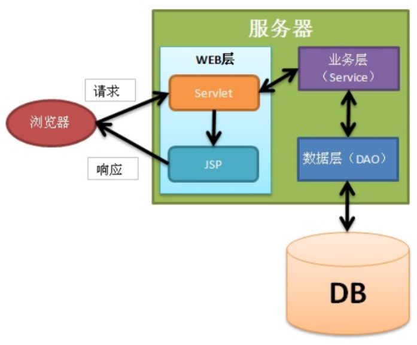

# JSP进阶_EL_JSTL

**JSP常用的内置对象**

**response 响应对象**

**out  输出**  

**pageContext  页面域 getAttribute()   setAttribute()**

**request  请求域  获取项目访问路径 getContextPath()   getAttribute()   setAttribute()   请求转发**

**session  会话域   getAttribute()  setAttribute()   invalidate()**

**application 应用域  ** 

**梳理：虽然pageContext功能强大，但不如直接用相关内置对象方便**

**请求域: request  放setAttribute()  取 getAttribute**

**会话域: session  放setAttribute()  取 getAttribute**

**应用域: application  放setAttribute()  取 getAttribute**

**在EL中pageContext才用的较多**

**include指令静态包含，include标签是动态包含**

**el表达式: 取数并输出,难点如何从集合中取得数据**

​    **常用 ${pageContext.request.contextPath}**

**jst核心标签库 : c:if   c:choose c:forEach**  

**MVC : V  视图  JSP html**

​          **C 控制器  Servlet**

​          **M 模型   Bean**

**三层架构：**

**WEB层  controller**  

**业务层  service    -->事务控制在service层**

 **数据层  dao**

## 一、JSP指令 

> JSP指令用来设置与整个JSP页面相关的属性。
>
> 语法格式：`指令格式：<%@  指令名 attr1="" attr2="" %>`。
>
> 一般都会把JSP指令放到JSP文件的最上方，但这不是必须的。
>
> 常用指令：
>
> * `page `：定义页面的依赖属性，比如脚本语言、error页面、缓存需求等等；
> * `include`：包含其他文件；
>
> * `taglib `：引入标签库的定义，可以是自定义标签。     jstl核心标签库

### 1.1、page指令

> page指令是最为常用的指定，也是属性最多的属性，page指令没有必须属性，都是可选属性，例如`<%@page %>`，没有给出任何属性也是可以的。
>
> 关于pageEncoding和contentType：
>
> * pageEncoding  少用
>   * 指定当前JSP页面的编码
>   * 这个编码是给服务器 tomcat看的，服务器需要知道当前JSP使用的编码，不然服务器无法正确把JSP编译成java文件       jsp本质就是servlet
>   * 这个编码只需要与真实的页面编码一致即可
> * **contentType   常用**
>   * **设置响应字符流的编码**
>   * **设置content-type响应头**
> * 无论是page指令的pageEncoding还是contentType，它们的默认值都是ISO-8859-1，ISO-8859-1是无法显示中文的，所以JSP页面中存在中文的话，一定要设置这两个属性
> * 两者关系
>   * 当pageEncoding和contentType只出现一个时，那么另一个的值与出现的值相同。
>   * 如果两个都不出现，那么两个属性的值都是ISO-8859-1。
>
> import属性：对应java代码中的import语句，用来导入包。

### 1.2、include指令

> * include指令表示静态包含，即目的是把多个JSP合并成一个java文件。
> * include指令只有一个属性：file，指定要包含的页面
> * a.jsp页面中使用include指令包含了b.jsp，那么在编译a.jsp时，会把两个文件合并成一个文件再编译成.java。

### 1.3、taglib指令     ----->    jstl核心标签库     分支 循环  

> 学习jstl标签使用，后面再讲

## 二、JSP九大内置对象（重点）


### 2.1、简要说明

> JSP内置对象：在JSP中无需创建就可以使用的9个对象。
>
> 九大内置对象如下：
>
> * `out(JspWriter)`：类似与response.getWriter()，用来向客户端发送文本数据 
> * `config(ServletConfig)`：对应”真身”中的ServletConfig    了解
> * `page(当前JSP的真身类型)`：当前JSP页面的“this”，即当前对象  了解
> * `pageContext(PageContext)`：页面上下文对象，它是最后一个没讲的域对象   **重点**
> * `exception(Throwable)`：只有在错误页面中可以使用这个对象   了解
> * `request(HttpServletRequest)`：即HttpServletRequest类的对象 **重点**
> * `response(HttpServletResponse)`：即HttpServletResponse类的对象 **重点  （jsp页面中主要是重定向）**
> * `application(ServletContext)`：即ServletContext类的对象 **重点，但少用**
> * `session(HttpSession)`：即HttpSession类的对象，不是每个JSP页面中都可以使用，如果在某个JSP页面中设置`<%@page session=“false”%>`，说明这个页面不能使用session   **重点**
>
> 使用情况
>
> * 极少使用：config、page、exception
> * 不是每个JSP页面都可以使用：exception、session

### 2.2、pageContext


> 主要功能：
>
> * 域对象功能    页面域
> * 代理其它域对象功能   （请求域，会话域，应用域）
> * 获取其他内置对象  

#### 2.2.1、域对象功能  重点

> 表示当前页面
> 和其他域对象一样，他们都有共同的方法：
>
> - **`void setAttribute(String name, Object value)`**
> - **`Object getAttribute(String name)`**
> - `void removeAttribute(String name)`

```jsp
<%@ page contentType="text/html;charset=UTF-8" language="java" %>
<html>
<head>
    <title>测试Page域对象</title>
</head>
<body>
    <%
    	//在page域中存放数据
        pageContext.setAttribute("name", "zhangsan");
    %>

    <%
    	//从page域中获取数据
        System.out.println(pageContext.getAttribute("name"));
    %>
</body>
</html>
```

#### 2.2.2、代理其他域对象  了解

> 可以使用pageContext向request、session、application对象中存取数据，“一个顶四个”
>
> `void setAttribute(String name, Object value, int scope)`：在指定范围中添加数据
>
> `Object getAttribute(String name, int scope)`：获取指定范围的数据
>
> `void removeAttribute(String name, int scope)`：移除指定范围的数据

```java
pageContext.setAttribute("x", "X");  \\向页面域中存数据
pageContext.setAttribute("x", "XX", PageContext.REQUEST_SCOPE); \\向请求域存数据
pageContext.setAttribute("x", "XXX", PageContext.SESSION_SCOPE);  \\会话
pageContext.setAttribute("x", "XXXX", PageContext.APPLICATION_SCOPE); \\应用域
```

> 创建Servlet

```java
import javax.servlet.*;
import javax.servlet.http.*;
import javax.servlet.annotation.*;
import java.io.IOException;

@WebServlet(name = "MServlet", value = "/MServlet")
public class MServlet extends HttpServlet {
    @Override
    protected void doGet(HttpServletRequest request, HttpServletResponse response) throws ServletException, IOException {
        //获取Session
        HttpSession session = request.getSession();
        //在Session域中存放数据
        session.setAttribute("name", "lisi");
    }

    @Override
    protected void doPost(HttpServletRequest request, HttpServletResponse response) throws ServletException, IOException {
        doGet(request, response);
    }
}

```

> 创建测试的JSP

```jsp
<%@ page contentType="text/html;charset=UTF-8" language="java" %>
<html>
<head>
    <title>Title</title>
</head>
<body>
    <%
        //通过page域从session中获取数据
        Object name = pageContext.getAttribute("name", PageContext.SESSION_SCOPE);
        System.out.println(name);
    %>
</body>
</html>

```

> `Object findAttribute(String name)`：依次在`page、request、session、application`范围查找名称为name的数据，如果找到就停止查找。这说明在这个范围内有相同名称的数据，那么page范围的优先级最高
>
> **findAttribute() 可以不加域范围**

```jsp
<%@ page language="java" contentType="text/html; charset=UTF-8"
    pageEncoding="UTF-8"%>
<html>
<head>
<title>Insert title here</title>
</head>
<body>
	<%
	
		pageContext.setAttribute("key", "page_value");
		request.setAttribute("key", "request_value");
		session.setAttribute("key", "session_value");
		application.setAttribute("key", "app_value");
	%>
	
	<%
    	//全域查找
		String value = (String)pageContext.findAttribute("key");
		out.print(value);
	%>
</body>
</html>
```

#### 2.2.3、获取其他内置对象   了解

> 一个pageContext对象等于所有内置对象，即1个当9个。这是因为可以使用pageContext对象获取其它8个内置对象。
>
> `JspWriter getOut()`：获取out内置对象
>
> `ServletConfig getServletConfig()`：获取config内置对象
>
> `Object getPage()`：获取page内置对象
>
> `ServletRequest getRequest()`：获取request内置对象
>
> `ServletResponse getResponse()`：获取response内置对象
>
> `HttpSession getSession()`：获取session内置对象
>
> `ServletContext getServletContext()`：获取application内置对象
>
> `Exception getException()`：获取exception内置对象

```jsp
<%@ page contentType="text/html;charset=UTF-8" language="java" %>
<html>
<head>
    <title>Title</title>
</head>
<body>
    <%                         
    	//获取application对象    ServletContext.getRealPath("/")    requestServletContext.getContextPath()                         
        System.out.println(pageContext.getServletContext().getContextPath());
    %>
</body>
</html>

```


## 三、JSP动作标签（了解）

> 动作标签的作用是用来简化Java脚本的，JSP动作标签是JavaWeb内置的动作标签，它们是已经定义好的动作标签，我们可以拿来直接使用。

### 3.1、include标签

> 语法：`<jsp:include page="相对URL地址" />`
>
> 作用：包含其它JSP页面
>
> 与include指令区别：
>
> * include指令是在编译级别完成的包含，即把当前JSP和被包含的JSP合并成一个JSP，然后再编译成一个Servlet；
> * include动作标签是在运行级别完成的包含，即当前JSP和被包含的JSP都会各自生成Servlet，然后在执行当前JSP的Servlet时完成包含另一个JSP的Servlet。它与RequestDispatcher的include()方法是相同的。
>
> 被包含的JSP：a.jsp

```jsp
<%@ page contentType="text/html;charset=UTF-8" language="java" %>
<html>
<head>
    <title>Title</title>
</head>
<body>
    <p>11111111111</p>
</body>
</html>
```

> b.jsp

```jsp
<%@ page contentType="text/html;charset=UTF-8" language="java" %>
<html>
<head>
    <title>Title</title>
</head>
<body>
    <jsp:include page="a.jsp" />
    <p>222222222222</p>
</body>
</html>
```

### 3.2、forward

> forward标签的作用是请求转发！forward标签的作用与`RequestDispatcher.forward()`方法相同
>
> page属性

## 四、EL表达式  重点

### 4.1、概述

> EL：Expression Language，表达式语言。在JSP页面中可以直接使用，从JSP2.0开始，代替JSP脚本，非Java开发人员也可以使用。
>
> 

### 4.2、EL表达式使用

> * 用于替换作用域对象`.getAttribute("name")`, 并将从域中获取的数据进行显示；
>
> * EL用来代替`<%=...%>`，`<%=...%>`代表输出。
>
>   EL表达式：取数并输出

#### 4.2.1、EL表达式应用（获取基本类型、字符串）

> 类JSP(模板引擎技术，Thymeleaf)
>
> `${scope.name}`获取具体某个作用域中的数据；
>
> `${name}`获取作用域中的数据，逐级查找（pageContext、request、session、application）
>
> EL和JSP脚本的区别
>
> * `<%=request.getAttribute() %>` 没有找到返回null 
> * `${requestScope.name}`没找到返回"" 

```jsp
<%@ page contentType="text/html;charset=UTF-8" language="java" %>
<html>
<head>
    <title>el初步</title>
</head>
<body>
    <%
        //在request域总存放数据 String
        pageContext.setAttribute("name", "Bob");
        request.setAttribute("name", "Zhangsan");
        request.setAttribute("age", 10);
        session.setAttribute("name", "Jim");
        application.setAttribute("name", "Lucy");
    %>

    <%-- 使用EL表达式获取某个域中的数据并在网页上显示
        作用域 xxxScope
     --%>
    <p>${requestScope.name}</p>
    <p>${requestScope.age}</p>
    <hr/>
    <%--
        全域查找
            如果没有限定xxxScope，会按照pageContext,request,session,application的顺序进行查找
     --%>
    <p>${name}</p>
    <hr/>
    <%--
        JSP脚本和EL表达式的区别
     --%>
    <p><%=request.getAttribute("abc")%></p>
    <p>${requestScope.abc}</p>
    <hr/>
</body>
</html>
```

#### 4.2.2、EL表达式应用（获取引用类型）  重点

> 使用EL获取作用域中的对象调用属性时，只能访问对象的get方法，必须遵守命名规范定义
>
> 创建实体类

```java
/**
 * 表示Person的实体类
 */
public class Person {
    private Integer id;
    private String name;
    private Integer age;

	//set,get
    //toString
}
```

> EL表达式演示

```jsp
<%@ page import="com.qf.entity.Person" %>
<%@ page import="java.util.List" %>
<%@ page import="java.util.ArrayList" %>
<%@ page import="java.util.Map" %>
<%@ page import="java.util.HashMap" %>
<%@ page contentType="text/html;charset=UTF-8" language="java" %>
<html>
<head>
    <title>el表达式处理复杂类型</title>
</head>
<body>
    <%
        Person p = new Person();
        p.setId(100);
        p.setName("Tom");
        p.setAge(20);

        Person p1 = new Person();
        p1.setId(200);
        p1.setName("zs");
        p1.setAge(21);
        //将Person对象存放在域当中
        request.setAttribute("person", p);

        int[] arr = {1, 2, 100, 50};
        request.setAttribute("arr", arr);

        List<String> names = new ArrayList<>();
        names.add("zs");
        names.add("ls");
        names.add("ww");
        request.setAttribute("names", names);

        List<Person> persons = new ArrayList<>();
        persons.add(p);
        persons.add(p1);
        request.setAttribute("persons", persons);

        Map<String, Object> map = new HashMap<>();
        map.put("name", "zs");
        map.put("addr", "qd");
        request.setAttribute("map", map);
    %>
    <%--
        通过EL表达式在页面上显示对象中的属性
        前提：属性要有对应的set和get方法
     --%>
    <p>${requestScope.person.id}</p>
    <p>${requestScope.person.name}</p>
    <p>${requestScope.person.age}</p>
    <hr/>
    <%--
        int[]
            1 2 100 1000
        List<String>
            "111" "222" "333"
        List<Person>
        Map<String, Object>
    --%>
    <%--
        通过EL表达式在页面上显示数组中的元素
    --%>
    <p>${requestScope.arr[3]}</p>
    <hr/>
    <%--
        通过EL表达式在页面上显示集合中的元素，集合中存放的是简单类型（基本数据类型 + String）
    --%>
    <p>${names[2]}</p>
    <hr/>

    <%--
        通过EL表达式在页面上显示集合(List, Map)中的元素，集合中存放的是复杂类型（除了String类型之外的引用数据类型）
    --%>
    <p>${persons[0].id}</p>
    <p>${persons[0].name}</p>
    <p>${persons[0].age}</p>
    <hr/>
    <p>${map.name}</p>
    <p>${map.addr}</p>
    <p>${map["addr"]}</p>
    <hr/>
</body>
</html>
```

**总结： 取List、map或数组，可以用 ${xx[]} list和数组可以传下标，map可以传key**

​             当然，list和map和set也可以用自身的方法取

### 4.3、EL表达式运算符

**empty 重点，常用**

**返回值是true或false**

**说明:true： 1 null为true**

​                     **2空串为true**

​                    **3 List中无元素，也为true**

 

> | **操作符** | **描述**                         |
> | :--------- | :------------------------------- |
> | .          | 访问一个Bean属性或者一个映射条目 |
> | []         | 访问一个数组或者集合的元素       |
> | +          | 加                               |
> | -          | 减或负                           |
> | *          | 乘                               |
> | / or div   | 除                               |
> | % or mod   | 取模                             |
> | == or eq   | 测试是否相等                     |
> | != or ne   | 测试是否不等                     |
> | < or lt    | 测试是否小于                     |
> | > or gt    | 测试是否大于                     |
> | <= or le   | 测试是否小于等于                 |
> | >= or ge   | 测试是否大于等于                 |
> | && or and  | 测试逻辑与                       |
> | \|\| or or | 测试逻辑或                       |
> | ! or not   | 测试取反                         |
> | empty      | 测试是否空值                     |

```jsp
<%@ page contentType="text/html;charset=UTF-8" language="java" %>
<html>
<head>
    <title>el_运算符</title>
</head>
<body>
    <%
        request.setAttribute("num", 15);
        request.setAttribute("name", "");
    %>

    <%-- el运算符 --%>
    <p>${num + 1}</p>
    <p>${num - 1}</p>
    <p>${num * 10}</p>
    <p>${num / 10}</p>
    <p>${num div 10}</p>
    <p>${num % 3}</p>
    <p>${num mod 3}</p>
    <hr/>
    <p>${num == 15}</p>
    <p>${num eq 15}</p> <%-- eq equals --%>
    <p>${num != 15}</p>
    <p>${num ne 15}</p><%-- ne not equals --%>
    <p>${num lt 20}</p><%-- lt less than --%>
    <p>${num gt 20}</p><%-- gt great than --%>
    <hr/>
    <p>${true or false}</p>
    <hr/>
    <p>${empty name}</p>
</body>
</html>
```

> 关于`empty`关键字

```jsp
<% 
	String s1="";
    pageContext.setAttribute("s1", s1);
    String s2=null;
    pageContext.setAttribute("s2", s2);
    String s3="abcdefg";
    pageContext.setAttribute("s3", s3);
    List list1 = new ArrayList();
    pageContext.setAttribute("list1", list1);
%>
<!-- empty关键只要内容是"空"就返回true -->
${empty s1}<br>    
${empty s2}<br>
${empty s3}<br>
${empty list1}<br>
```


### 4.4、EL的隐式对象

pageContext

> EL 表达式语言定义了11个隐式对象
>
> | **隐含对象**         | **描述**                                                     |
> | :------------------- | :----------------------------------------------------------- |
> | **pageScope**        | **page作用域**          重点     对标jsp中的内置对象pageContext |
> | **requestScope**     | **request作用域 **  重点       对标jsp.....内置对象request   |
> | **sessionScope**     | **session作用域 **  重点                         内置对象 session |
> | **applicationScope** | **application作用域**  重点                   内置对象 application |
> | **param**            | request对象的参数，字符串                                    |
> | paramValues          | request对象的参数，字符串集合                                |
> | **header**           | HTTP信息头，字符串                                           |
> | headerValues         | HTTP信息头，字符串集合                                       |
> | initParam            | 上下文初始化参数                                             |
> | **cookie**           | Cookie值                                                     |
> | **pageContext**      | **当前页面的pageContext域对象    pageContext.request.contextPath** |

```jsp
<%@ page contentType="text/html;charset=UTF-8" language="java" %>
<html>
<head>
    <title>Title</title>
</head>
<body>
    <%--
        访问服务器某个位置的时候
        协议://主机名:端口  http://localhost:8080
        项目名：在实际开发中不能写死 - “动”
        资源的位置
    --%>
    <%--<a href="/el_jstl/loginServlet?username=bob">登录</a>--%>
    <a href="${pageContext.request.contextPath}/loginServlet?username=bob">登录</a>
</body>
</html>
```

> 使用EL表达式修改登录案例
>
> login.jsp

```jsp
<%@ page contentType="text/html;charset=UTF-8" language="java" %>
<html>
<head>
    <title>登录</title>
</head>
<body>
<%
    String errorMsg = (String)request.getAttribute("errorMsg");
    if(errorMsg != null) {
%>
    <p style="color: red;">${errorMsg}</p>
<%
    }
%>
<form action="${pageContext.request.contextPath}/LoginServlet" method="post">
    <fieldset style="width: 300px;">
        <legend>用户登录</legend>
        <p>
            <label>账号</label>
            <input type="text" name="username" placeholder="请输入用户名" />
        </p>
        <p>
            <label>密码</label>
            <input type="password" name="password" placeholder="请输入密码" />
        </p>
        <p>
            <label>验证码</label>
            <input type="text" name="code" placeholder="请输入验证码" />
            
        </p>
        <p>
            <button type="submit">登录</button>
            <button type="reset">重置</button>
        </p>
    </fieldset>
</form>
</body>
</html>
```

> success.jsp

```jsp
<%@ page contentType="text/html;charset=UTF-8" language="java" %>
<html>
<head>
    <title>success</title>
</head>
<body>
    <%
        String username = (String) session.getAttribute("username");
        if(username != null) {
    %>
    <p>欢迎${username}</p>
    <p><a href="${pageContext.request.contextPath}/LogoutServlet">注销</a></p>
    <%
        } else {
    %>
    <p>您还没有登录，请先<a href="${pageContext.request.contextPath}/login.jsp">登录</a></p>
    <%
        }
    %>
</body>
</html>
```

## 五、JSTL  重点

### 5.1、目前存在的问题

> EL主要是用于作用域获取数据，虽然可以做运算判断，但是得到的都是一个结果，做展示；
>
> EL不存在流程控制。比如判断；
>
> EL对于集合只能做单点访问，不能实现遍历操作。比如循环。

### 5.2、什么是JSTL  (核心标签库)

> JSTL是apache对EL表达式的扩展（也就是说JSTL依赖EL），JSTL是标签语言;
>
> 不是JSP的内置标签，使用时需要导包

### 5.3、JSTL的作用

> 可对EL获取到的数据进行逻辑操作；
>
> 与EL合作完成数据的展示。

### 5.4、如何使用JSTL

>1. 导入Jar包，standard.jar 和 jstl.jar；
>2. 在JSP页面引入标签库`<%@ taglib prefix="c"  uri="http://java.sun.com/jsp/jstl/core" %> `

### 5.5、JSTL核心标签

#### 5.5.1、输入输出

>out标签  了解
>
>* value：可以是字符串常量，也可以是EL表达式
>* default：当要输出的内容为null时，会输出default指定的值

```jsp
<!-- 输出字符串aaa -->
<c:out value="aaa"/> 
<!-- 输出域属性aaa，其中与${aaa}相同 -->
<c:out value="${aaa}"/> 
<!-- 如果${aaa}不存在，那么输出xxx字符串 -->
<c:out value="${aaa}" default="xxx"/>
```

>set标签   **会用**

```jsp
<!-- 创建名为a,值为hello的域属性，范围：pageContext -->
<c:set var="a" value="hello"/>  等同于<% pageContext.setAttribute("a","hello")%>
<!-- 范围为session -->
<c:set var="a" value="hello" scope="session"/> <% session.setAttribute("a","hello")%>
```

>remove标签

```jsp
<!-- 删除名为a的域属性 -->
<c:remove var="a"/>      等同于 <% pageContext.removeAttribute("a","hello")%>
<!-- 删除page域中名为a的域属性 -->
<c:remove var="a" scope="page"/> 
```

> 案例

```jsp
<%@ page contentType="text/html;charset=UTF-8" language="java" %>
<%@ taglib prefix="c" uri="http://java.sun.com/jsp/jstl/core" %>
<html>
<head>
    <title>jstl输入输出</title>
</head>
<body>
    <%--
        JSTL
        增强EL表达式的功能，实现复杂的逻辑操作
     --%>
    <%-- 输出 --%>
    <p><c:out value="hello world"/></p>
    <p>hello world</p>
    <hr/>
    <%-- 定义变量
        int age = 10;
        在域对象中存放数据，默认在page域中存放
        scope:指定数据存放在哪个域中
     --%>
    <c:set var="name" value="Zhangsan" />
    <p>${pageScope.name}</p>

    <c:set var="age" value="10" scope="application" />
    <p>${age}</p>
</body>
</html>
```

#### 5.5.2、分支结构   重点

> **if标签  重点**

```jsp
<!-- 当条件为true时执行标签体内容 -->
<c:if test="${条件}">     
    hello
</c:if>
```

> **choose标签  重点**

```jsp
<!--
	等同于：
        if() {
        } esle if() {
        } esle if() {
        } else if() {
        } else {
        }
-->
<c:choose>
    <c:when test="${条件1}">a</c:when>
    <c:when test="${条件2}">b</c:when>
    <c:when test="${条件3}">c</c:when>
    <c:otherwise>d</c:otherwise>
</c:choose>
```

> 案例

```jsp
<%@ page contentType="text/html;charset=UTF-8" language="java" %>
<%@ taglib prefix="c" uri="http://java.sun.com/jsp/jstl/core" %>
<html>
<head>
    <title>jstl分支结构</title>
</head>
<body>
    <!--
        if...else
            if() {
            }

            if() {
            } else {
            }

            if() {
            } else if(){
            } else if() {
            } else {
            }
        使用JSTL实现分支结构
    -->
    <c:set var="num" value="10" />
    <c:if test="${num > 2}">  
        ${num}大于2是成立的
    </c:if>
    <hr/>

    <%-- 判断是否及格 --%>
    <c:set var="score" value="80" />
    <c:choose>
        <c:when test="${score >= 60}">
            <p>及格</p>
        </c:when>
        <c:otherwise>
            <p>不及格</p>
        </c:otherwise>
    </c:choose>
    <hr/>
    <c:choose>
        <c:when test="${score >= 80}">
            <p>优秀</p>
        </c:when>
        <c:when test="${score >= 70}">
            <p>良好</p>
        </c:when>
        <c:when test="${score >= 60}">
            <p>及格</p>
        </c:when>
        <c:otherwise>
            <p>不及格</p>
        </c:otherwise>
    </c:choose>
</body>
</html>
```

#### 5.5.3、循环结构  重点

> forEach标签

```jsp
<!-- 
    var：循环变量
    begin：设置循环变量从几开始。
    end：设置循环变量到几结束。
    step：设置步长！等同与java中的i++，或i+=2。step默认为1
-->
<c:forEach var="i" begin="1" end="10" step="1">
    ${i}
</c:forEach>


<!--
	用来输出数组、集合
    items：指定要循环谁，它可以是一个数组或一个集合
    var：把数组或集合中的每个元素赋值给var指定的变量

	可以使用varStatus来创建循环状态变量
		count：循环元素的个数
        index：循环元素的下标
        first：是否为第一个元素
        last：是否为最后一个元素
        current：当前元素
-->
<c:forEach items="${strs }" var="str">
    ${str }<br/>
</c:forEach>
```

> 案例

```jsp
<%@ page import="java.util.List" %>
<%@ page import="java.util.ArrayList" %>
<%@ page import="com.qf.entity.Person" %>
<%@ page contentType="text/html;charset=UTF-8" language="java" %>
<%@ taglib prefix="c" uri="http://java.sun.com/jsp/jstl/core" %>
<html>
<head>
    <title>JSTL循环结构</title>
</head>
<body>
    <%--
        循环 - 反复做某件事情
        1.输出1 2 3 ... 5
        for(int i = 1; i <= 5; i++) {
            System.out.println(i);
        }
    --%>
    <c:forEach var="i" begin="1" end="5" step="1">
        <p>${i}</p>
    </c:forEach>
    <hr/>

    <%--
        1+2+3+...+100

        int sum = 0;
        for(int i = 1; i <= 100; i++) {
            sum = sum + i;
        }
        System.out.println(sum);

        2+4+6+8+...+100
    --%>
    <c:set var="sum" value="0" />
    <c:forEach var="i" begin="2" end="100" step="2">
        <c:set var="sum" value="${sum + i}" />
    </c:forEach>
    <p>${sum}</p>
    <hr/>

    <%-- 通过jstl遍历一个集合,在h1标题中显示
        假设集合从servlet中保存到request域中，然后转发到该页面
     --%>
    <%
        List<String> list = new ArrayList<>();
        list.add("1111");
        list.add("2222");
        list.add("333");
        list.add("******");

        request.setAttribute("list", list);
    %>
    <%--
        items:表示被遍历的集合
        var:每一次被遍历到的元素

        int[] arr = {1, 2, 3};
        for(int i : arr) {

        }
    --%>
    <c:forEach items="${list}" var="item">
        <h1>${item}</h1>
    </c:forEach>

    <hr/>
    <%
        //模拟
        List<Person> persons = new ArrayList<>();
        Person p = new Person();
        p.setId(100);
        p.setName("Tom");
        p.setAge(20);

        Person p1 = new Person();
        p1.setId(200);
        p1.setName("zs");
        p1.setAge(21);

        persons.add(p);
        persons.add(p1);

        request.setAttribute("persons", persons);
        //emp
    %>

    <table border="1">
        <tr>
            <th>id</th>
            <th>name</th>
            <th>age</th>
            <th colspan="2">opt</th>
        </tr>
        <c:forEach items="${persons}" var="p">
            <tr>
                <td>${p.id}</td>
                <td>${p.name}</td>
                <td>${p.age}</td>
                <td><a href="${pageContext.request.contextPath}/xxxServlet?id=${p.id}">修改</a></td>
                <td><a href="${pageContext.request.contextPath}/aaaServlet?id=${p.id}">删除</a></td>
            </tr>
        </c:forEach>
    </table>
</body>
</html>
```

### 5.6、登录案例升级

> 修改login.jsp

```jsp
<%@ page contentType="text/html;charset=UTF-8" language="java" %>
<%@ taglib prefix="c" uri="http://java.sun.com/jsp/jstl/core" %>
<html>
<head>
    <title>登录</title>
</head>
<body>
<p style="color: red;">${errorMsg}</p>
<form action="${pageContext.request.contextPath}/LoginServlet" method="post">
    <fieldset style="width: 300px;">
        <legend>用户登录</legend>
        <p>
            <label>账号</label>
            <input type="text" name="username" placeholder="请输入用户名" />
        </p>
        <p>
            <label>密码</label>
            <input type="password" name="password" placeholder="请输入密码" />
        </p>
        <p>
            <label>验证码</label>
            <input type="text" name="code" placeholder="请输入验证码" />
            
        </p>
        <p>
            <button type="submit">登录</button>
            <button type="reset">重置</button>
        </p>
    </fieldset>
</form>
</body>
</html>
```

> 修改success.jsp

```jsp
<%@ page contentType="text/html;charset=UTF-8" language="java" %>
<%@ taglib prefix="c" uri="http://java.sun.com/jsp/jstl/core" %>
<html>
<head>
    <title>success</title>
</head>
<body>
    <c:choose>
        <c:when test="${not empty username}">
            <p>欢迎${username}</p>
            <p><a href="${pageContext.request.contextPath}/LogoutServlet">注销</a></p>
        </c:when>
        <c:otherwise>
            <p>您还没有登录，请先<a href="${pageContext.request.contextPath}/login.jsp">登录</a></p>
        </c:otherwise>
    </c:choose>
</body>
</html>
```

### 5.7、MVC设计模式   面试题

#### 5.7.1、经典的MVC

> MVC是软件工程中的一种架构模式，是一种软件设计思想，将数据操作(com.qfedu.dao)、页面展示(com.qfedu.controller)、业务逻辑分为三个层级(com.qfedu.service)（模块），独立完成，相互调用 ，MVC并不是Java独有的，现在几乎所有的B/S的架构都采用了MVC模式，三个层级如下：
>
> * 视图View： 视图即是用户看到并与之交互的界面，比如HTML（静态资源），JSP（动态资源）等等；JSP
> * 控制器Controller：控制器即是控制请求的处理逻辑，对请求进行处理，负责流程跳转(转发和重定向)；  servlet          （页面展示   业务逻辑    数据操作    ）
> * 模型Model：对客观世界的一种代表和模拟(业务模拟、对象模拟)。 Bean
>
> 优点：
>
> - 低耦合性：模块与模块之间的关联性不强，不与某一种具体实现产生密不可分的关联性；
> - 高维护性：基于低耦合性，可做到不同层级的功能模块灵活更换、插拔；
> - 高重用性：相同的数据库操作，可以服务于不同的业务处理。将数据作为独立模块，提高重用性。

#### 5.7.2、JavaWeb经典三层框架

> WEB层 controller：包含JSP和Servlet等与WEB相关的内容   
>
> 业务层 service：业务层中不包含JavaWeb API，它只关心业务逻辑
>
> 数据层 dao：封装了对数据库的访问细节，进行最细粒度的增删改查的操作



> 调用关系：web层调用---业务层(Service)---数据层(Dao)---DB
>
> * 业务处理从前到后
> * 开发时要从后向前进行
>
> 关于业务：
>
> * 转账
> * 对DAO层方法的组合
>
> 注意：
>
> * 业务层(Service)不要出现Java Web API，业务层代码是可重用的，甚至可以应用到非Web环境中；
> * 业务层不要出现JDBC相关的API；
> * JavaBean作为实体类贯穿web层、业务层、数据层，各层之间通过JavaBean或者JavaBean的组合进行数据交互。

#### 5.7.3、基于JavaWeb三层架构升级登录案例   重要

> 准备工作：
>
> * 建库建表
> * 新建项目
> * 拷贝Jar包到项目的WEB-INF发lib目录下
> * 准备jdbc配置文件，放置在src下
> * JdbcUtils工具类放在utils包下。

##### 5.7.3.1、建库建表

> SQL语句如下

```sql
CREATE DATABASE webtest;
USE webtest;

DROP TABLE IF EXISTS user;
CREATE TABLE user  (
  id int(11) NOT NULL AUTO_INCREMENT,
  username varchar(20),
  password varchar(20),
  PRIMARY KEY (id)
);

INSERT INTO user VALUES (1, 'zhangsan', '123456');
INSERT INTO user VALUES (2, 'lisi', '123456');
```

> 对应的实体类User

```java
public class User {
    private Integer id;
    private String username;
    private String password;
    
    //set和get
    //toString
}
```

##### 5.7.3.2、Dao层

> Dao层接口

```java
import com.qfedu.entity.User;
import java.sql.SQLException;

public interface UserDao {
    User findByUsernameAndPassword(String username, String password) throws SQLException;
}
```

> Dao层接口实现类

```java
import com.qfedu.dao.UserDao;
import com.qfedu.entity.User;
import com.qfedu.utils.JdbcUtils;
import org.apache.commons.dbutils.QueryRunner;
import org.apache.commons.dbutils.handlers.BeanHandler;

import java.sql.SQLException;

public class UserDaoImpl implements UserDao {
    @Override
    public User findByUsernameAndPassword(String username, String password) throws SQLException {
        String sql = "select * from user where username=? and password=?";
        Object[] params = {username, password};

        QueryRunner qr = new QueryRunner(JdbcUtils.getDataSource());
        User user = qr.query(sql, new BeanHandler<User>(User.class), params);
        return user;
    }
}
```

##### 5.7.3.3、Service层

> Service层接口

```java
import com.qfedu.entity.User;

public interface UserService {
    User login(String username, String password);
}
```

> Service层实现类对象

```java
import com.qfedu.dao.UserDao;
import com.qfedu.dao.impl.UserDaoImpl;
import com.qfedu.entity.User;
import com.qfedu.service.UserService;

import java.sql.SQLException;

public class UserServiceImpl implements UserService {
    private UserDao userDao = new UserDaoImpl();

    @Override
    public User login(String username, String password) {
        User user = null;
        try {
            user = userDao.findByUsernameAndPassword(username, password);
        } catch (SQLException throwables) {
            throwables.printStackTrace();
        }

        return user;
    }
}
```

##### 5.7.3.4、Controller层

> 用于登录验证的Servlet

```java
import com.qfedu.entity.User;
import com.qfedu.service.UserService;
import com.qfedu.service.impl.UserServiceImpl;
import javax.servlet.*;
import javax.servlet.http.*;
import javax.servlet.annotation.*;
import java.io.IOException;

@WebServlet(name = "LoginServlet", value = "/LoginServlet")
public class LoginServlet extends HttpServlet {
    private UserService userService = new UserServiceImpl();

    @Override
    protected void doGet(HttpServletRequest request, HttpServletResponse response) throws ServletException, IOException {
        //获取登录信息
        String username = request.getParameter("username");
        String password = request.getParameter("password");
        String code = request.getParameter("code");

        HttpSession session = request.getSession();
        //使用用户输入的验证码和生成的验证码进行比较
        String generateCode = (String)session.getAttribute("generateCode");
        //忽略大小写比较强
        if(generateCode.equalsIgnoreCase(code)) {
            //登录验证
            User user = userService.login(username, password);

            if(user != null) {
                //将成功登录的用户信息放在Session中
                session.setAttribute("user", user);
                request.getRequestDispatcher("/success.jsp").forward(request, response);
            } else {
                request.setAttribute("errorMsg", "用户名或密码错误，请重新登录");
                request.getRequestDispatcher("/login.jsp").forward(request, response);
            }
        } else {
            request.setAttribute("errorMsg", "验证码错误，请重新登录...");
            request.getRequestDispatcher("/login.jsp").forward(request, response);
        }

    }

    @Override
    protected void doPost(HttpServletRequest request, HttpServletResponse response) throws ServletException, IOException {
        doGet(request, response);
    }
}
```

> 用于生成验证码的Servlet

```java
import cn.dsna.util.images.ValidateCode;
import javax.servlet.*;
import javax.servlet.http.*;
import javax.servlet.annotation.*;
import java.io.IOException;

@WebServlet(name = "CodeServlet", value = "/CodeServlet")
public class CodeServlet extends HttpServlet {
    @Override
    protected void doGet(HttpServletRequest request, HttpServletResponse response) throws ServletException, IOException {
        //生成验证码
        ValidateCode codeImg = new ValidateCode(200, 30, 4, 5);
        String code = codeImg.getCode();
        System.out.println(code);

        //将生成的验证码存放在session中
        request.getSession().setAttribute("generateCode", code);

        //发送给浏览器
        codeImg.write(response.getOutputStream());
    }

    @Override
    protected void doPost(HttpServletRequest request, HttpServletResponse response) throws ServletException, IOException {
        doGet(request, response);
    }
}
```

> 用于退出登录的Servlet

```java
import javax.servlet.*;
import javax.servlet.http.*;
import javax.servlet.annotation.*;
import java.io.IOException;

@WebServlet(name = "LogoutServlet", value = "/LogoutServlet")
public class LogoutServlet extends HttpServlet {
    @Override
    protected void doGet(HttpServletRequest request, HttpServletResponse response) throws ServletException, IOException {
        //让session失效
        request.getSession().invalidate();
        //重定向到login.jsp
        response.sendRedirect(request.getContextPath() + "/login.jsp");
    }

    @Override
    protected void doPost(HttpServletRequest request, HttpServletResponse response) throws ServletException, IOException {
        doGet(request, response);
    }
}
```

##### 5.7.3.5、相关页面

> 登录页面login.jsp
>
> 注意这个页面中引入jquery用于实现单击刷新验证码，如果加载jquery不能运行成功，删除out目录重试。

```jsp
<%@ page contentType="text/html;charset=UTF-8" language="java" %>
<%@ taglib prefix="c" uri="http://java.sun.com/jsp/jstl/core" %>
<head>
    <title>登录</title>
    <script src="${pageContext.request.contextPath}/js/jquery-3.4.1.min.js"></script>
    <script>
        $(function () {
            //单击验证码图片，刷新验证码
            $("#codeImg").click(function () {
                var date = new Date();
                $("#codeImg").prop("src", "${pageContext.request.contextPath}/CodeServlet?timeStamp=" + date.getTime());
            });
        });
    </script>
</head>
<body>
<p style="color: red;">${errorMsg}</p>
<form action="${pageContext.request.contextPath}/LoginServlet" method="post">
    <fieldset style="width: 300px;">
        <legend>用户登录</legend>
        <p>
            <label>账号</label>
            <input type="text" name="username" placeholder="请输入用户名" />
        </p>
        <p>
            <label>密码</label>
            <input type="password" name="password" placeholder="请输入密码" />
        </p>
        <p>
            <label>验证码</label>
            <input type="text" name="code" placeholder="请输入验证码" />
            
        </p>
        <p>
            <button type="submit">登录</button>
            <button type="reset">重置</button>
        </p>
    </fieldset>
</form>
</body>
</html>
```

> 成功页面success.jsp

```jsp
<%@ page contentType="text/html;charset=UTF-8" language="java" %>
<html>
<head>
    <title>success</title>
</head>
<body>
    <c:choose>
        <c:when test="${not empty user}">
            <p>欢迎${user.username}</p>
            <p><a href="${pageContext.request.contextPath}/LogoutServlet">注销</a></p>
        </c:when>
        <c:otherwise>
            <p>您还没有登录，请先<a href="${pageContext.request.contextPath}/login.jsp">登录</a></p>
        </c:otherwise>
    </c:choose>
</body>
</html>
```
```vue
1拷贝login.jsp和success02.jsp ，改成success.jsp

2jquery导入到项目，mysql jar导入到项目

3复制LoginOutServlet.java过来

4修改CodeServlet类中 验证码的key 和取验证码的key保持一致,“code”
```

