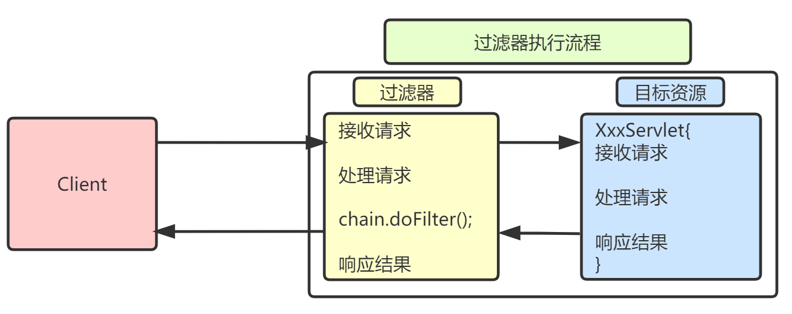
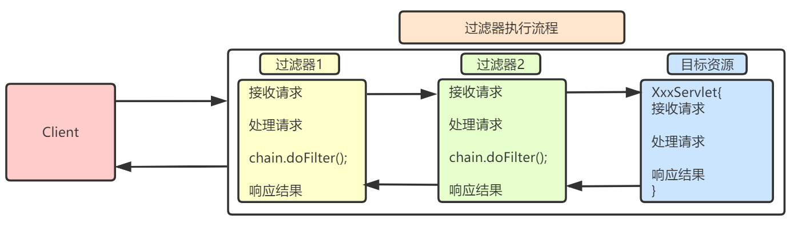

# Filter
## 一、什么是Filter

> JavaWeb三大组件（Servlet，Filter，Listener）之一；
>
> 与Servlet类似，用来拦截请求，不是用来处理请求的；
>
> 过滤器就是一个Java类，实现Filter接口。



> 执行地位在Servlet之前，客户端发送请求时，会先经过Filter，再到达目标Servlet中；响应时，会根据执行流程再次反向执行Filter。可以解决多个Servlet共性代码的冗余问题（例如：乱码处理、登录验证）

## 二、Filter入门

### 2.1、**编写Filter**   重点

   **chain.doFilter(request, response);放行，易错，重点**

> Servlet API中提供了一个Filter接口，开发人员编写一个Java类实现了这个接口即可，这个Java类称之为过滤器。

```java
import javax.servlet.*;
import java.io.IOException;

public class TestFilter implements Filter {
    public void init(FilterConfig config) throws ServletException {
    }

    public void destroy() {
    }

    @Override
    public void doFilter(ServletRequest request, ServletResponse response, FilterChain chain) throws ServletException, IOException {
        System.out.println("filter....");
        chain.doFilter(request, response);
    }
}
```

> 编写Servlet用来验证Filter

```java
import javax.servlet.*;
import javax.servlet.http.*;
import javax.servlet.annotation.*;
import java.io.IOException;

@WebServlet(name = "TestServlet", value = "/TestServlet")
public class TestServlet extends HttpServlet {
    @Override
    protected void doGet(HttpServletRequest request, HttpServletResponse response) throws ServletException, IOException {
        System.out.println("servlet...");
    }

    @Override
    protected void doPost(HttpServletRequest request, HttpServletResponse response) throws ServletException, IOException {
        doGet(request, response);
    }
}
```

### 2.2、配置Filter

> 在web.xml中配置Filter，类似在web.xml中配置Servlet

```xml
<?xml version="1.0" encoding="UTF-8"?>
<web-app xmlns="http://xmlns.jcp.org/xml/ns/javaee"
         xmlns:xsi="http://www.w3.org/2001/XMLSchema-instance"
         xsi:schemaLocation="http://xmlns.jcp.org/xml/ns/javaee http://xmlns.jcp.org/xml/ns/javaee/web-app_3_1.xsd"
         version="3.1">
    <filter>
        <!-- filter的名字，必须和另一组标签中的filter的名字一致 -->
        <filter-name>TestFilter</filter-name>
        <!-- filter的全类名 -->
        <filter-class>com.qfedu.filter.TestFilter</filter-class>
    </filter>
    <filter-mapping>
        <!-- filter的名字，必须和另一组标签中的filter的名字一致 -->
        <filter-name>TestFilter</filter-name>
        <!-- 被filter拦截的资源 -->
        <url-pattern>/TestServlet</url-pattern>
    </filter-mapping>
</web-app>
```

> 启动项目，访问TestServlet，发现先运行TestFilter再运行TestServlet。

## 三、Filter的生命周期

> `init`：**在服务器启动时**会创建Filter实例，并且每个类型的Filter只创建一个实例，从此不再创建，在创建完Filter实例后，会马上调用init()方法完成初始化工作，这个方法只会被执行一次；
>
> **`doFilter`：这个方法会在用户每次访问目标资源（web.xml文件配置Filter的url-pattern中的路径）时执行，如果需要“放行”，那么需要调用FilterChain的doFilter(ServletRequest,ServletResponse)方法，如果不调用FilterChain的doFilter()方法，那么目标资源将无法执行；**
>
> `destroy` ：服务器会在创建Filter对象之后，把Filter放到缓存中一直使用，通常不会销毁它。一般会在服务器关闭时销毁Filter对象，在销毁Filter对象之前，服务器会调用Filter对象的destory()方法。
>
> 修改TestFilter的代码，进行测试

```java
public class TestFilter implements Filter {
    public void init(FilterConfig config) throws ServletException {
        System.out.println("init...");
    }

    public void destroy() {
        System.out.println("destroy...");
    }

    @Override
    public void doFilter(ServletRequest request, ServletResponse response, FilterChain chain) throws ServletException, IOException {
        System.out.println("filter....");
        chain.doFilter(request, response);
    }
}
```

## 四、Filter的配置

> Filter的配置和Servlet的配置类似，分为xml和注解两种配置方式。

### 4.1、xml配置

```xml
<?xml version="1.0" encoding="UTF-8"?>
<web-app xmlns="http://xmlns.jcp.org/xml/ns/javaee"
         xmlns:xsi="http://www.w3.org/2001/XMLSchema-instance"
         xsi:schemaLocation="http://xmlns.jcp.org/xml/ns/javaee http://xmlns.jcp.org/xml/ns/javaee/web-app_3_1.xsd"
         version="3.1">
    <filter>
        <!-- filter的名字，必须和另一组标签中的filter的名字一致 -->
        <filter-name>TestFilter</filter-name>
        <!-- filter的全类名 -->
        <filter-class>com.qfedu.filter.TestFilter</filter-class>
    </filter>
    <filter-mapping>
        <!-- filter的名字，必须和另一组标签中的filter的名字一致 -->
        <filter-name>TestFilter</filter-name>
        <!-- 被filter拦截的资源 -->
        <url-pattern>/TestServlet</url-pattern>
    </filter-mapping>
</web-app>
```

### 4.2、注解配置  重点

**@WebFilter("/路径")**

> 在自定义的Filter类上使用注解`@WebFilter`，注解常用属性：
>
> * filterName：filter的名字；
> * value：过滤的目标资源的地址。
>
> 如果`@WebFilter`只写了字符串，这个字符串Filter过滤目标资源的地址。

```java
import javax.servlet.*;
import javax.servlet.annotation.*;
import java.io.IOException;
     
@WebFilter(filterName = "AFilter", value = "/AServlet")
public class AFilter implements Filter {
    public void init(FilterConfig config) throws ServletException {
    }

    public void destroy() {
    }

    @Override
    public void doFilter(ServletRequest request, ServletResponse response, FilterChain chain) throws ServletException, IOException {
        System.out.println("AFilter...");
        chain.doFilter(request, response);
    }
}
```

> 对应的Servlet

```java
import javax.servlet.*;
import javax.servlet.http.*;
import javax.servlet.annotation.*;
import java.io.IOException;

@WebServlet(name = "AServlet", value = "/AServlet")
public class AServlet extends HttpServlet {
    @Override
    protected void doGet(HttpServletRequest request, HttpServletResponse response) throws ServletException, IOException {
        System.out.println("AServlet...");
    }

    @Override
    protected void doPost(HttpServletRequest request, HttpServletResponse response) throws ServletException, IOException {
        doGet(request, response);
    }
}
```

### 4.3、过滤器路径  重点

**`/*`，表示拦截所有   项目中常用  重点**

> 过滤器的过滤路径通常有三种形式:
>
> * 精确过滤匹配 ，比如`/index.jsp`、`/myservlet1`；
> * 后缀过滤匹配，比如`*.jsp`、`*.html`、`*.jpg`；
> * 通配符过滤匹配`/*`，表示拦截所有。注意过滤器不能使用`/`匹配，`/aaa/bbb/*`允许。

### 4.4、过滤器链和优先级  了解

#### 4.4.1、过滤器链

> 客户端对服务器请求之后，服务器调用Servlet之前会执行一组过滤器（多个过滤器），那么这组过滤器就称为一条过滤器链。
>
> 每个过滤器实现某个特定的功能，当第一个Filter的doFilter方法被调用时，Web服务器会创建一个代表Filter链的FilterChain对象传递给该方法。在doFilter方法中，开发人员如果调用了FilterChain对象的doFilter方法，则Web服务器会检查FilterChain对象中是否还有filter，如果有，则调用第2个filter，如果没有，则调用目标资源。



> 创建BServlet

```java
import javax.servlet.*;
import javax.servlet.http.*;
import javax.servlet.annotation.*;
import java.io.IOException;

@WebServlet(name = "BServlet", value = "/BServlet")
public class BServlet extends HttpServlet {
    @Override
    protected void doGet(HttpServletRequest request, HttpServletResponse response) throws ServletException, IOException {
        System.out.println("BServlet...");
    }

    @Override
    protected void doPost(HttpServletRequest request, HttpServletResponse response) throws ServletException, IOException {
        doPost(request, response);
    }
}
```

> 创建BFilter1和BFilter2

```java
//BFilter1
public class BFilter1 implements Filter {
    public void init(FilterConfig config) throws ServletException {
    }

    public void destroy() {
    }

    @Override
    public void doFilter(ServletRequest request, ServletResponse response, FilterChain chain) throws ServletException, IOException {
        System.out.println("BFilter1...");
        //放行，如果有后续Filter，继续调用后续Filter执行过滤
        chain.doFilter(request, response);
    }
}

//BFilter2
public class BFilter2 implements Filter {
    public void init(FilterConfig config) throws ServletException {
    }

    public void destroy() {
    }

    @Override
    public void doFilter(ServletRequest request, ServletResponse response, FilterChain chain) throws ServletException, IOException {
        System.out.println("BFilter2...");
        //放行，如果有后续Filter，继续调用后续Filter执行过滤
        chain.doFilter(request, response);
    }
}
```

> 在web.xml中分别配置两个Filter

```xml
<!--
	使用XML方式配置两个Filter，此处注意两个的顺序 
-->
<filter>
    <filter-name>BFilter1</filter-name>
    <filter-class>com.qfedu.filter.BFilter1</filter-class>
</filter>
<filter-mapping>
    <filter-name>BFilter1</filter-name>
    <url-pattern>/BServlet</url-pattern>
</filter-mapping>

<filter>
    <filter-name>BFilter2</filter-name>
    <filter-class>com.qfedu.filter.BFilter2</filter-class>
</filter>
<filter-mapping>
    <filter-name>BFilter2</filter-name>
    <url-pattern>/BServlet</url-pattern>
</filter-mapping>
```

> 访问BServlet测试

####  4.4.2、过滤器 优先级

> 在一个Web应用中，可以开发编写多个Filter，这些Filter组合起来称之为一个Filter链。
> 优先级：	
>
> - 如果为注解的话，是按照类**全名称的字符串顺序**决定作用顺序；
> - 如果web.xml，按照 filter-mapping注册顺序，**从上往下**；
> - web.xml配置高于注解方式；
> - 如果注解和web.xml同时配置，会创建多个过滤器对象，造成过滤多次。
>
> 关于“注解和web.xml同时配置，会创建多个过滤器对象，造成过滤多次”，见下面的代码（注意注释中的内容）

```java
/**
 * 修改BFilter2代码，开发其注解配置，注意：注解的filterName和web.xml中filter-name值要是不同的
 */
@WebFilter(filterName = "BFilter2x", value = "/BServlet")
public class BFilter2 implements Filter {
    public void init(FilterConfig config) throws ServletException {
    }

    public void destroy() {
    }

    @Override
    public void doFilter(ServletRequest request, ServletResponse response, FilterChain chain) throws ServletException, IOException {
        //过滤时,打印BFilter2的hash值
        System.out.println("BFilter2...." + this.hashCode());
        chain.doFilter(request, response);
    }
}
```

> 测试，访问BServlet，打印如下，两次的hash值不同，说明“注解和web.xml同时配置，会创建多个过滤器对象，造成过滤多次”。

```l
BFilter1...
BFilter2....768904998
BFilter2....703274564
BServlet...
```

### 4.5、Filter应用

```
request.getRequestURI();获取请求路径
```

#### 4.5.1、权限验证

> 修改登录案例，使用Filter进行权限验证：
>
> * 登录成功，直接进入success.jsp；
> * 登录失败，跳转到login.jsp，并显示提示信息；
> * 强行访问success.jsp，跳转到login.jsp，并显示提示信息，提示未登录；
>
> 用于登录验证的Filter代码如下:

```java
/**
 * 用于登录验证的Filter
 */
@WebFilter(filterName = "LoginFilter", value = {"/success.jsp"})
public class LoginFilter implements Filter {
    public void init(FilterConfig config) throws ServletException {
    }

    public void destroy() {
    }

    @Override
    public void doFilter(ServletRequest request, ServletResponse response, FilterChain chain) throws ServletException, IOException {
        HttpServletRequest req = (HttpServletRequest)request;
        HttpServletResponse resp = (HttpServletResponse)response;

        //获取Session
        HttpSession session = req.getSession();
        User user = (User) session.getAttribute("user");
        if(user == null) {
            request.setAttribute("errorMsg", "您还未登录,请先登录");
            request.getRequestDispatcher("/login.jsp").forward(request, response);
        }

        chain.doFilter(request, response);
    }
}
```

> success.jsp

```jsp
<%@ page contentType="text/html;charset=UTF-8" language="java" %>
<html>
<head>
    <title>success</title>
</head>
<body>
    <p>欢迎${user.username}</p>
    <p><a href="${pageContext.request.contextPath}/LogoutServlet">注销</a></p>
</body>
</html>
```

#### 4.5.2、过滤器解决编码

```java
@WebFilter(filterName = "EncodingFilter", value = "/*")
public class EncodingFilter implements Filter {
    public void init(FilterConfig config) throws ServletException {
    }

    public void destroy() {
    }

    @Override
    public void doFilter(ServletRequest request, ServletResponse response, FilterChain chain) throws ServletException, IOException {
        //统一处理请求和响应的乱码
        request.setCharacterEncoding("UTF-8");
        response.setContentType("text/html;charset=utf-8"); //不要加
        chain.doFilter(request, response);
    }
}
```


