<LockArticle :highHeightPercent="0.05"/>

# Reactor

目的： 使用少量资源处理大量并发

## 1、Reactive-Stream

### 1、介绍

Reactive-Stream的GitHub地址：[reactive-streams-jvm/README.md at master · reactive-streams/reactive-streams-jvm · GitHub](https://github.com/reactive-streams/reactive-streams-jvm/blob/master/README.md)

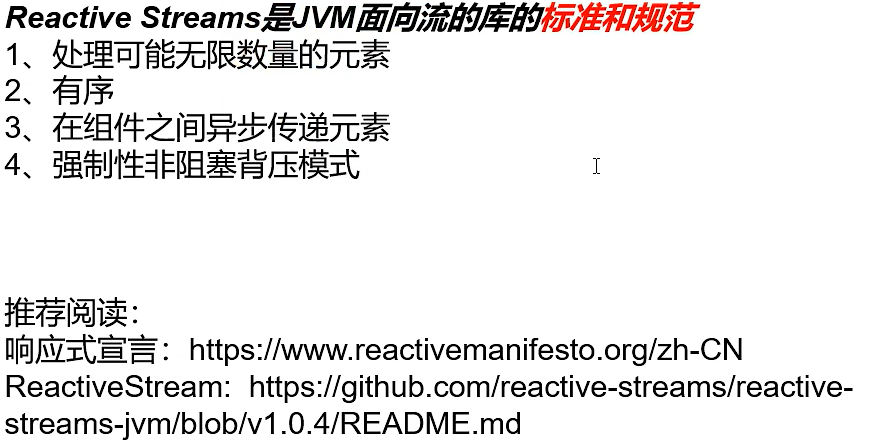


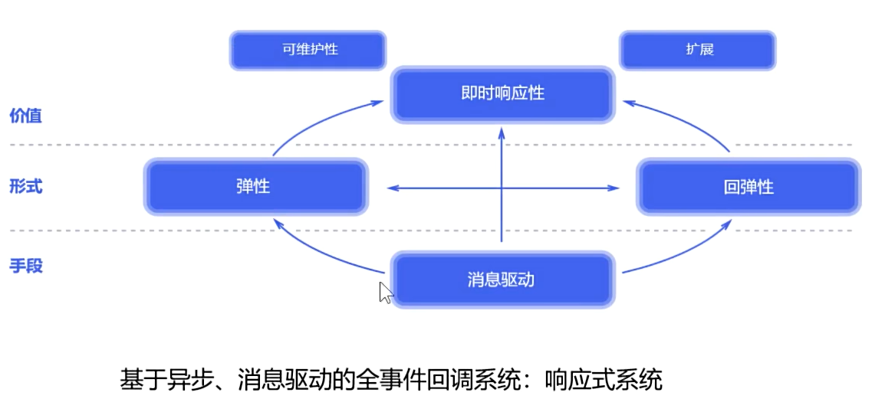


#### 1、正压

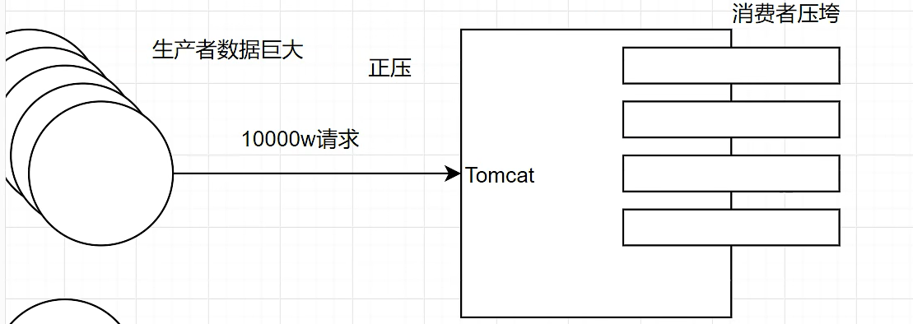

#### 2、背压

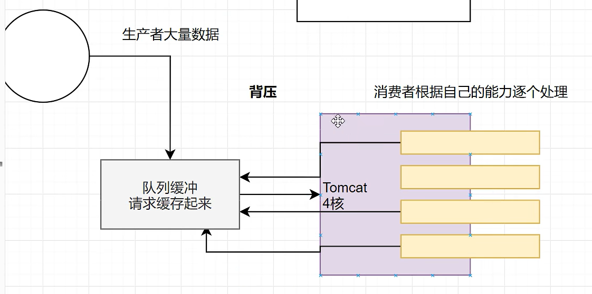

   线程数越多越好还是越少越好？

都不好，线程数跟cpu核心数一样多最好，让每一个核心都忙，减少线程切换


传统的方式，当某个cpu核心（某个线程）执行时，如果需要远程获取数据，则改线程等待，下个请求进来，则会切换线程执行，上个线程仍然等待获取结果，线程切换浪费时间空间多

响应式，当某个线程进来，需要远程获取数据的时候，数据还没返回来，该线程仍然继续执行下个请求，当远程的返回放到缓冲区中，线程在处理

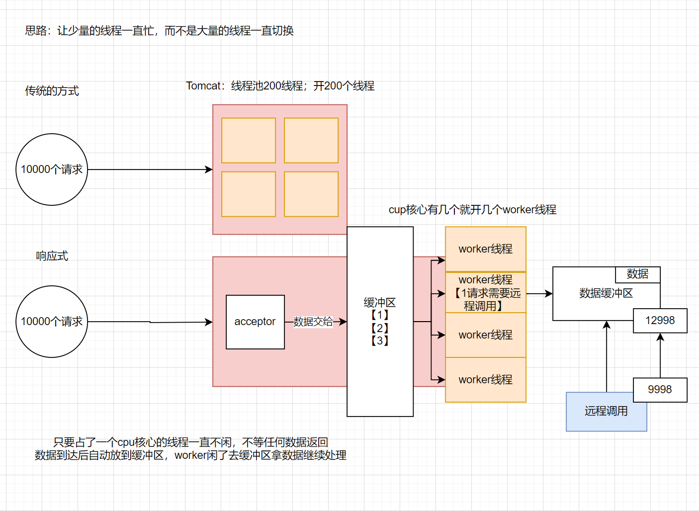

#### 3、目的

通过全异步的方式、加缓存区构建一个实施的数据流系统

### 2、Flow（jdk9新增的 java.util.concurrent.Flow类中的属性）

```java
//
// Source code recreated from a .class file by IntelliJ IDEA
// (powered by FernFlower decompiler)
//

package java.util.concurrent;

public final class Flow {
    static final int DEFAULT_BUFFER_SIZE = 256;

    private Flow() {
    }

    public static int defaultBufferSize() {
        return 256;
    }

    //处理器
    public interface Processor<T, R> extends Subscriber<T>, Publisher<R> {
    }

    //订阅关系
    public interface Subscription {
        void request(long var1);

        void cancel();
    }

    //订阅者
    public interface Subscriber<T> {
        void onSubscribe(Subscription var1);

        void onNext(T var1);

        void onError(Throwable var1);

        void onComplete();
    }

    //发布者
    @FunctionalInterface
    public interface Publisher<T> {
        void subscribe(Subscriber<? super T> var1);
    }
}

```

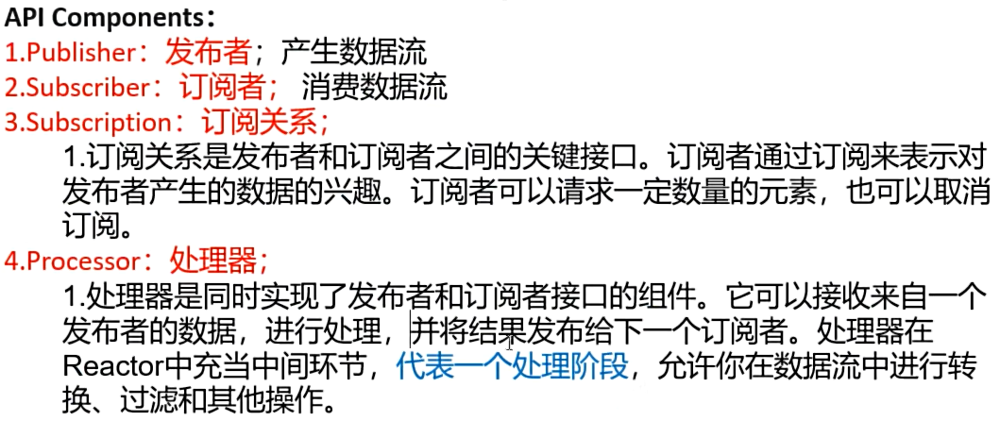

#### 1、无Processor模型的发布者订阅者模型

##### 1、模型


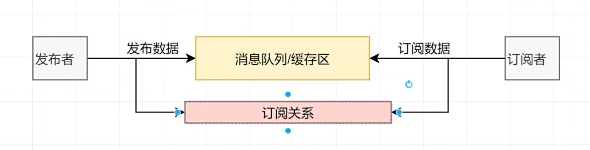

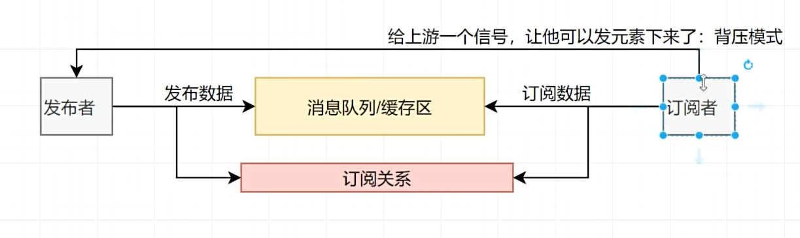

##### 2、入门案例

```java
package com.hjc.flowdemo;

import java.util.concurrent.Flow;
import java.util.concurrent.SubmissionPublisher;

/**
 * @author hjc
 * @version 1.0
 * @className FlowDemo
 * @description
 * @since 1.0
 **/
public class FlowDemo {

    public static void main(String[] args) {

        //1、定义一个发布者; 发布数据;
        SubmissionPublisher<String> publisher = new SubmissionPublisher<String>();


        //2、定义一个订阅者;订阅者感兴趣发布者的内容
        Flow.Subscriber<String> subscriber = new Flow.Subscriber<String>() {

            //绑定订阅关系
            private Flow.Subscription subscription;
            @Override  //在订阅时,  onXxxx:在xxx事件发生时，执行这个回调
            public void onSubscribe(Flow.Subscription subscription) {
                System.out.println(Thread.currentThread()+" 订阅开始了: "+subscription);
                this.subscription = subscription;
                //绑定订阅关系的时候向上游获取1个数据
                subscription.request(1);
                //绑定订阅关系的时候向上游获取全部个数据
                //subscription.request(Long.MAX_VALUE);

            }


            @Override  //在下一个元素到达时触发; 执行这个回调; 接受到新数据
            public void onNext(String item) {
                System.out.println(Thread.currentThread()+"订阅者,接受到数据:" + item);
                //表示每次来新元素就请求一个
                subscription.request(1);

                if("data-5".equals(item)){
                    //取消订阅
                    //subscription.cancel();
                    //System.out.println(Thread.currentThread()+"订阅者,取消订阅");
                }
            }


            @Override  //在错误发生时;
            public void onError(Throwable throwable) {
                System.err.println(Thread.currentThread()+"订阅者,接收到错误信号: "+throwable.getMessage());
            }


            @Override //在完成时;
            public void onComplete() {
                System.out.println(Thread.currentThread()+"订阅完成,接收到完成信号");
            }
        };


        //3、发布者订阅者关系绑定
        publisher.subscribe(subscriber);

        //发布者发布数据
        for (int i = 0; i < 10 ; i++) {
            //发布10条数据
            try {
                Thread.sleep(1000);
            } catch (InterruptedException e) {
                throw new RuntimeException(e);
            }

            if(i > 8 ){
                //异常中断
                publisher.closeExceptionally(new RuntimeException("发布者主动抛出异常"));
            }else {
                publisher.submit("data-"+i);
            }

            //发布者将数据发布到buffer中
        }

        //发布者通道关闭,此时订阅者将不再接收到数据,订阅者订阅结束
        publisher.close();


        //线程不能结果,如果线程结束则获取不到任何数据
        try {
            Thread.sleep(50000);
        } catch (InterruptedException e) {
            throw new RuntimeException(e);
        }

    }
}

```

jvm底层对于整个发布订阅关系做好了 异步+缓存区处理 = 响应式系统

#### 2、有processor的发布者订阅者模型

##### 1、模型

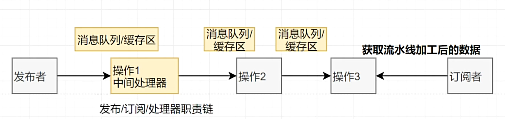


##### 2、入门案例

定义订阅者

```java
package com.hjc.flow.processer;

import java.util.concurrent.Flow;

/**
 * @author hjc
 * @version 1.0
 * @className MySubscriber
 * @description
 * @since 1.0
 **/
public class MySubscriber implements Flow.Subscriber<String> {
    private Flow.Subscription subscription;
    @Override
    public void onSubscribe(Flow.Subscription subscription) {
        this.subscription = subscription;
        //当需求来的时候向上游获取一个数据
        subscription.request(1);
    }

    @Override
    public void onNext(String item) {
        //当检测到上游有数据传下来的时候,获取一个数据
        System.out.println(item);
        subscription.request(1);
    }

    @Override
    public void onError(Throwable throwable) {
        //检测到有错误发生的时候执行
    }

    @Override
    public void onComplete() {
        System.out.println("当上游数据发送结束的时候执行到此");
    }
}

```

2、定义中间处理器

```java
package com.hjc.flow.processer;

import java.util.concurrent.Flow;
import java.util.concurrent.SubmissionPublisher;

/**
 * @author hjc
 * @version 1.0
 * @className MyProcessor
 * @description 自定义中间处理器 , Processor 既是发布者 Publisher ,也是订阅者 Subscriber
 * @since 1.0
 **/
public class MyProcessor extends SubmissionPublisher<String> implements Flow.Processor<String,String> {
    private Flow.Subscription subscription;

    //这里作为发布者与下游订阅者绑定
    @Override
    public void subscribe(Flow.Subscriber<? super String> subscriber) {
        //作为发布者与订阅者绑定
        //此处的super是继承的SubmissionPublisher的subscribe,因此这个方法可以不重写
        //此处相当于中间处理器作为发布者去订阅订阅者，与订阅者绑定
        super.subscribe(subscriber);
    }

    //这里是作为订阅者绑定中间处理器的上游发布者
    @Override
    public void onSubscribe(Flow.Subscription subscription) {
        //订阅订阅者
        this.subscription = subscription;
        //订阅时向上游获取一个数据
        subscription.request(1);
    }

    @Override
    public void onNext(String s) {
        s =  s + "哈哈";
        //作为发布者发送数据给下游,如果不向下游发布数据，则该中间处理器的下游订阅者获取不到数据
        submit(s);
    }

    @Override
    public void onError(Throwable throwable) {

    }

    @Override
    public void onComplete() {

    }
}
```

3、定义发布者并测试

```java
package com.hjc.flow.processer;

import java.util.concurrent.SubmissionPublisher;
import java.util.concurrent.TimeUnit;

/**
 * @author hjc
 * @version 1.0
 * @className Test
 * @description  需求，对发布者发布的数据添加 " 哈哈 "
 * @since 1.0
 **/
public class Test {
    public static void main(String[] args) {
        //定义发布者
        SubmissionPublisher<String> publisher = new SubmissionPublisher<>();

        //定义订阅者
        MySubscriber mySubscriber = new MySubscriber();

        //定义中间处理器
        MyProcessor myProcessor = new MyProcessor();
        //定义中间处理器
        MyProcessor myProcessor01 = new MyProcessor();
        //定义中间处理器
        MyProcessor myProcessor02 = new MyProcessor();


        // 发布者与中间处理器  订阅发布关系绑定
        publisher.subscribe(myProcessor);

        // 发布者与中间处理器  订阅发布关系绑定
        myProcessor.subscribe(myProcessor01);

        // 发布者与中间处理器  订阅发布关系绑定
        myProcessor01.subscribe(myProcessor02);

        // 发布者与订阅者  订阅发布关系绑定
        myProcessor02.subscribe(mySubscriber);

        publisher.submit("Hello");

        try {
            TimeUnit.SECONDS.sleep(10);
        } catch (InterruptedException e) {
            throw new RuntimeException(e);
        }
    }

    //输出结果
    //Hello哈哈哈哈哈哈
}
```


#### 3、响应式编程的优点

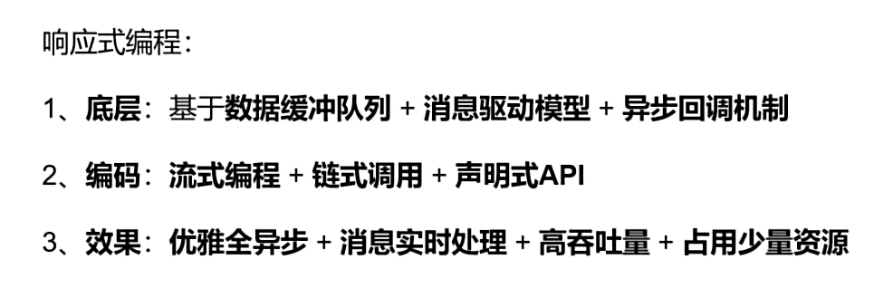

## 2、Reactor框架

Reactor的底层就是Reactive-stream

官网：[Project Reactor](https://projectreactor.io/)

Reactor 是基于 [Reactive Streams](https://github.com/reactive-streams/reactive-streams-jvm)规范的第四代响应式库，用于在 JVM 上构建非阻塞应用程序

数据有两种形式：单个（Mono（0/1个数据））/多个（Flux （N个数据））


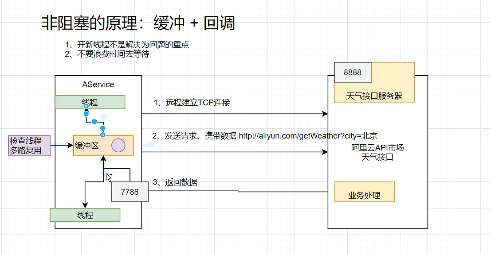

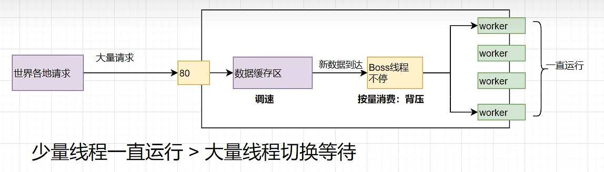


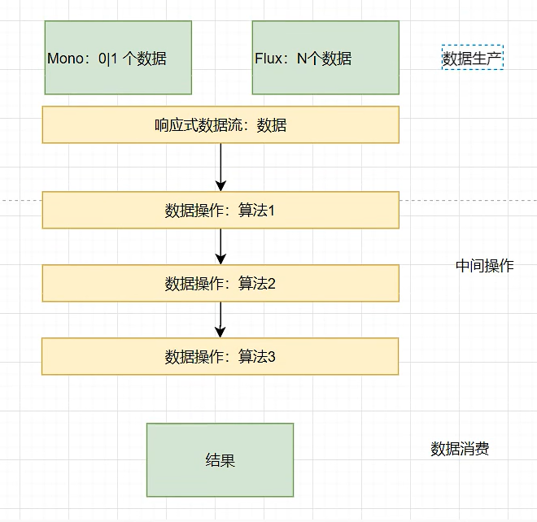

### 1、介绍

```java
Reactor is a fully non-blocking reactive programming foundation for the JVM, with efficient demand management (in the form of managing “backpressure”). It integrates directly with the Java 8 functional APIs, notably `CompletableFuture`, `Stream`, and `Duration`. It offers composable asynchronous sequence APIs — `Flux` (for [N] elements) and `Mono` (for [0|1] elements) — and extensively implements the [Reactive Streams](https://www.reactive-streams.org/) specification.

Reactor also supports non-blocking inter-process communication with the `reactor-netty` project. Suited for Microservices Architecture, Reactor Netty offers backpressure-ready network engines for HTTP (including Websockets), TCP, and UDP. Reactive encoding and decoding are fully supported.
```

### 2、说明

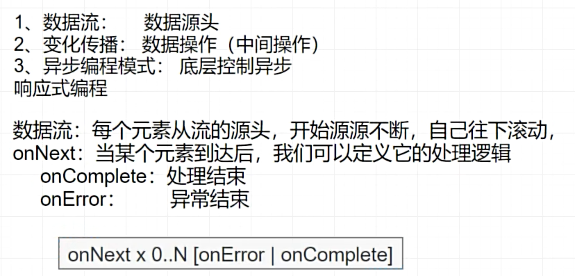

### 3、概念

 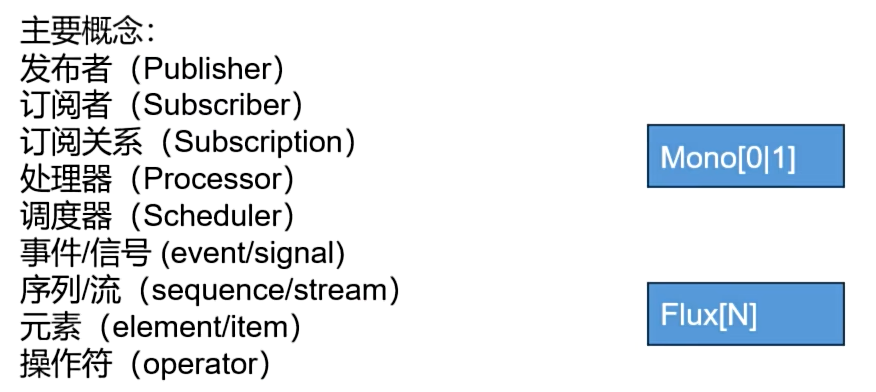

### 4、模型

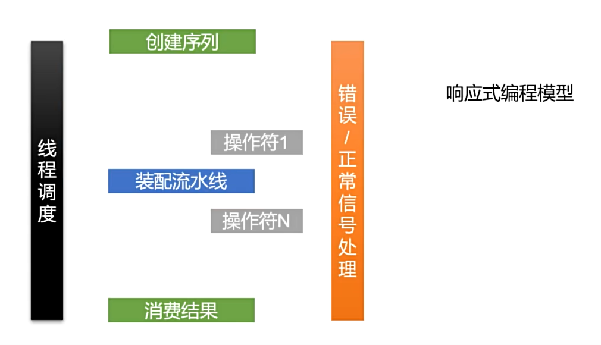


### 5、使用（看懂弹珠图）

官网入门    [Reactor 3 Reference Guide (projectreactor.io)](https://projectreactor.io/docs/core/release/reference/#getting-started)

#### 1、导入依赖

```xml
<dependencyManagement> 
    <dependencies>
        <dependency>
            <groupId>io.projectreactor</groupId>
            <artifactId>reactor-bom</artifactId>
            <version>2023.0.2</version>
            <type>pom</type>
            <scope>import</scope>
        </dependency>
    </dependencies>
</dependencyManagement>
    
    
<dependencies>
    <dependency>
        <groupId>io.projectreactor</groupId>
        <artifactId>reactor-core</artifactId> 
        
    </dependency>
    <dependency>
        <groupId>io.projectreactor</groupId>
        <artifactId>reactor-test</artifactId> 
        <scope>test</scope>
    </dependency>
</dependencies>
```

#### 2、Mono/Flux以及doOnxxx

doOnxxx要感知某个流的事件就放在这个流的后边，新流的前边

```java
package com.hjc.reactor;

import reactor.core.publisher.Flux;
import reactor.core.publisher.Mono;

import java.time.Duration;

/**
 * @author hjc
 * @version 1.0
 * @className FluxDemo
 * @description
 * @since 1.0
 **/
public class FluxDemo {

    //测试Mono :只有一个元素
    public static void main(String[] args) throws InterruptedException {
        Mono<Integer> mono = Mono.just(1);
        mono.subscribe(System.out::println);


        //空流-->流中没有元素,表示只有一个信号
        Flux<Object> empty = Flux.empty();
        empty.subscribe(System.out::println);


        //事件感知API：当流发生什么事的时候，触发一个回调,系统调用提前定义好的钩子函数(Hook[钩子函数])；doOnxxx
        //在链式api中，下面的操作符操作的是上面的流
        Flux<Integer> just = Flux.range(1, 8)
                //把每个元素延迟1s发送
                .delayElements(Duration.ofSeconds(1))
                .doOnComplete(()->{
                    System.out.println("流正常结束....");
                }).doOnCancel(()->{
                    System.out.println("流已被取消....");
                }).doOnError((throwable)->{
                    System.out.println("流出错啦"+throwable);
                }).doOnNext((element)->{
                    System.out.println("doOnNext"+element);
                });
        //just.subscribe(System.out::println);
	 just.subscribe(new BaseSubscriber<Integer>() {
            @Override
            protected void hookOnSubscribe(Subscription subscription) {
                System.out.println("绑定关系");
                request(1);
            }

            @Override
            protected void hookOnNext(Integer value) {
                System.out.println("获取一个元素"+value);
                request(1);
            }

            @Override
            protected void hookOnComplete() {
                System.out.println("完成...");
            }

            @Override
            protected void hookOnError(Throwable throwable) {
                super.hookOnError(throwable);
            }
        });

        Thread.sleep(50000);
    }

    //Mono : 0|1个元素
    //Flux: N个元素
    //Mono<Integer>   : 只有一个Integer元素
    //Fulx<Integer>   : 有很多Integer元素
    //测试Flux，Flux中有多个元素
    public static void aaa(String[] args) throws InterruptedException {
        //1、多元素的流
        Flux<Integer> just = Flux.just(1,2,3,4,5);

        //流不消费就没用
        just.subscribe(System.out::println);

        //一个流有很多消费者
        just.subscribe(System.out::println);

        //对于每个消费者来说流都是一样的,广播模式
        System.out.println("--------------------");

        Flux<Long> interval = Flux.interval(Duration.ofSeconds(1)); //每秒产生一个从0开始的递增数字
        interval.subscribe(System.out::println);


        Thread.sleep(5000);

    }
}

```

doOnNext()    /      doOnEach() 对比

```java
    //响应式编程核心:看懂文档弹珠图
    //doOnNext()在元素到达的时候触发
    //doOnEach()  每个数据到达的时候触发，包括元素和信号
    public static void main(String[] args) {

        Flux.just(10,5,4,45,22,1,5,213,0,15,6,89)
                .map(i->i/2)
                .doOnError((throwable)->{
                    System.out.println(throwable);
                })
                .doOnEach((integerSignal)->{
                    System.out.println("信号/元素"+integerSignal.get());
                }).subscribe(System.out::println);
    }
```


#### 3、流中信号

```java
public enum SignalType {

	SUBSCRIBE,  被订阅时

	REQUEST,  请求了N个元素
	
	CANCEL,   流被取消
 
 	ON_SUBSCRIBE,  在订阅时候
	
	ON_NEXT, 在元素到达时候
 
	ON_ERROR, 在流错误时候

	ON_COMPLETE, 在流正常完成时
	
	AFTER_TERMINATE, 中断以后

    CURRENT_CONTEXT,当前上下文
	
	ON_CONTEXT; 感知上下文
	}
```

#### 4、doOnxxx触发的时机（对发布者的事件绑定）

```java
doOnNext(): 每个数据(流的数据)到达的时候
doOnEach():每个元素(流的数据和信号)到达的时候触发
doOnRequest():消费者请求流元素的时候
doOnError():流发生错误的时候
doOnSubscribe():流被订阅的时候
doOnTerminate():发送取消/异常信号中断了流
doOnCancle():流被取消
doOnDiscard():流中元素被忽略的时候(当流过滤的时候例如小于5的元素过滤掉，则小于5的元素被忽略了)
```

#### 5、onXxx与doOnxxx

doOnxxx：代表发生这个事件产生一个回调，通知你(不能改变)

onXxx：发生这个事件之后执行一个动作，可以改变元素、信号

```java
        Flux<String> flux = Flux.range(1, 7)
                .map(d -> {

                    if(d == 6){
                        d = 10/0;
                    }
                    return "哈哈" + d;
                })
                .onErrorComplete();//通过弹珠图可知,流错误的时候将错误的信号转为正常的信号
                                    //发布者调用这个之后,下边的订阅者则无法感知异常
    flux.subscribe(new BaseSubscriber<String>() {
            @Override
            protected void hookOnSubscribe(Subscription subscription) {
                System.out.println("流被订阅 = " + subscription);
                request(1);//要一个数据
            }

            @Override
            protected void hookOnNext(String value) {
                System.out.println("下个元素 = " + value);
                request(1);//要一个数据
                //requestUnbounded();//要无限个数据
            }

            @Override
            protected void hookOnComplete() {
                System.out.println("流完成...");
            }

            @Override
            protected void hookOnError(Throwable throwable) {
                System.err.println("流出错...");
            }
        });
//结果
流被订阅 = reactor.core.publisher.FluxOnErrorReturn$ReturnSubscriber@5d76b067
下个元素 = 哈哈1
下个元素 = 哈哈2
下个元素 = 哈哈3
下个元素 = 哈哈4
下个元素 = 哈哈5
流完成...
```

#### 6、interval()产生一个从0开始的递增数字

```java
Flux<Long> interval = Flux.interval(Duration.ofSeconds(1)); //每秒产生一个从0开始的递增数字
```

#### 7、concat（）

连接两个流

```java
Flux.concat(Flux.just(1,2,3,4),Flux.just(5,6,7,8))
                .subscribe(System.out::println);	
```

#### 8、range()

生成范围为1-N的流

```java
  Flux.range(1, 9)
                //.log()
                .filter(d -> d > 3)
                //.log()
                .map(d -> d + "哈哈")
                //.log()
                .subscribe(System.out::println);

//结果
4哈哈
5哈哈
6哈哈
7哈哈
8哈哈
9哈哈
```

#### 9、log()打印日志

```java
     Flux.range(1, 9)
                .log()
                .filter(d -> d > 3)
                //.log()
                .map(d -> d + "哈哈")
                //.log()
                .subscribe(System.out::println);

//结果
[ INFO] (main) | onSubscribe([Synchronous Fuseable] FluxRange.RangeSubscriptionConditional)
[ INFO] (main) | request(unbounded)
[ INFO] (main) | onNext(1)
[ INFO] (main) | onNext(2)
[ INFO] (main) | onNext(3)
[ INFO] (main) | onNext(4)
4哈哈
[ INFO] (main) | onNext(5)
5哈哈
[ INFO] (main) | onNext(6)
6哈哈
[ INFO] (main) | onNext(7)
7哈哈
[ INFO] (main) | onNext(8)
8哈哈
[ INFO] (main) | onNext(9)
9哈哈
[ INFO] (main) | onComplete()
    
    
    Flux.range(1, 9)
                //.log()
                .filter(d -> d > 3)
                .log()
                .map(d -> d + "哈哈")
                //.log()
                .subscribe(System.out::println);
//结果
[ INFO] (main) | onSubscribe([Fuseable] FluxFilterFuseable.FilterFuseableSubscriber)
[ INFO] (main) | request(unbounded)
[ INFO] (main) | onNext(4)
4哈哈
[ INFO] (main) | onNext(5)
5哈哈
[ INFO] (main) | onNext(6)
6哈哈
[ INFO] (main) | onNext(7)
7哈哈
[ INFO] (main) | onNext(8)
8哈哈
[ INFO] (main) | onNext(9)
9哈哈
[ INFO] (main) | onComplete()
    

 Flux.range(1, 9)
                //.log()
                .filter(d -> d > 3)
                //.log()
                .map(d -> d + "哈哈")
                .log()
                .subscribe(System.out::println);    
//结果
[ INFO] (main) | onSubscribe([Fuseable] FluxMapFuseable.MapFuseableSubscriber)
[ INFO] (main) | request(unbounded)
[ INFO] (main) | onNext(4哈哈)
4哈哈
[ INFO] (main) | onNext(5哈哈)
5哈哈
[ INFO] (main) | onNext(6哈哈)
6哈哈
[ INFO] (main) | onNext(7哈哈)
7哈哈
[ INFO] (main) | onNext(8哈哈)
8哈哈
[ INFO] (main) | onNext(9哈哈)
9哈哈
[ INFO] (main) | onComplete()    
    
```

#### 10、subscribe()

入参

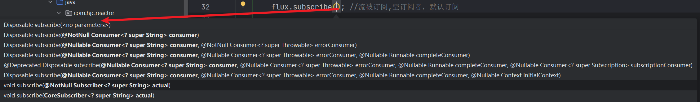

流订阅，没订阅之前流什么也不做

```java
public static void main(String[] args) throws InterruptedException {

        Flux<String> flux = Flux.range(1, 7)
                .map(d -> {

                    if(d == 6){
                        //d = 10/0;
                    }

                    return "哈哈" + d;
                });

        //flux.subscribe(); //流被订阅,空订阅者，默认订阅

        //flux.subscribe(v-> System.out.println("v = " + v)); //流被订阅

        //flux.subscribe(
        //        v-> System.out.println("v = " + v),//流正常
        //        throwable-> System.err.println(throwable.getMessage())); //流出现异常

        //flux.subscribe(
        //        v-> System.out.println("v = " + v),//流正常
        //        throwable-> System.err.println(throwable.getMessage()),//流出现异常
        //        ()-> System.out.println("流结束了....感知正常结束")); //感知正常结束

    
        //自定义订阅者
        flux.subscribe(new BaseSubscriber<String>() {
            @Override
            protected void hookOnSubscribe(Subscription subscription) {
                System.out.println("流被订阅 = " + subscription);
                request(1);//要一个数据
            }

            @Override
            protected void hookOnNext(String value) {
                System.out.println("下个元素 = " + value);
                request(1);//要一个数据
                //requestUnbounded();//要无限个数据
            }

            @Override
            protected void hookOnComplete() {
                System.out.println("流完成...");
            }

            @Override
            protected void hookOnError(Throwable throwable) {
                System.err.println("流出错...");
            }
        });


        TimeUnit.SECONDS.sleep(9000);
    }
```

#### 11、订阅者的cancle()

订阅者调用cancle取消流

```java
        Flux<String> flux = Flux.range(1, 10)
                .map(i -> {
                    System.out.println("map..."+i);
                    if(i==9) {
                        i = 10/(9-i); //数学运算异常;  doOnXxx
                    }
                    return "哈哈：" + i;
                }); //流错误的时候，把错误吃掉，转为正常信号


//        flux.subscribe(); //流被订阅; 默认订阅；
//        flux.subscribe(v-> System.out.println("v = " + v));//指定订阅规则： 正常消费者：只消费正常元素


//        flux.subscribe(
//                v-> System.out.println("v = " + v), //流元素消费
//                throwable -> System.out.println("throwable = " + throwable), //感知异常结束
//                ()-> System.out.println("流结束了...") //感知正常结束
//        );


        // 流的生命周期钩子可以传播给订阅者。
        //  a() {
        //      data = b();
        //  }
        flux.subscribe(new BaseSubscriber<String>() {

            // 生命周期钩子1： 订阅关系绑定的时候触发
            @Override
            protected void hookOnSubscribe(Subscription subscription) {
                // 流被订阅的时候触发
                System.out.println("绑定了..."+subscription);

                //找发布者要数据
                request(1); //要1个数据
//                requestUnbounded(); //要无限数据
            }

            @Override
            protected void hookOnNext(String value) {
                System.out.println("数据到达，正在处理："+value);
                if(value.equals("哈哈：5")){
                    cancel(); //取消流
                }
                request(1); //要1个数据
            }


            //  hookOnComplete、hookOnError 二选一执行
            @Override
            protected void hookOnComplete() {
                System.out.println("流正常结束...");
            }

            @Override
            protected void hookOnError(Throwable throwable) {
                System.out.println("流异常..."+throwable);
            }

            @Override
            protected void hookOnCancel() {
                System.out.println("流被取消...");
            }

            @Override
            protected void hookFinally(SignalType type) {
                System.out.println("最终回调...一定会被执行");
            }
        });
```

#### 12、**BaseSubscriber**

自定义消费者，推荐直接编写 **BaseSubscriber 的逻辑；**

#### 13、背压（Backpressure ）和请求重塑（Reshape Requests）

##### 1、背压（消费者向发布者要很多数据）

```java
Flux<String> flux = Flux.range(1, 7)
                .map(d -> {
                    return "哈哈" + d;
                });

flux.subscribe(new BaseSubscriber<String>() {
            @Override
            protected void hookOnSubscribe(Subscription subscription) {
                System.out.println("流被订阅 = " + subscription);
                request(1);//要一个数据
            }

            @Override
            protected void hookOnNext(String value) {
                System.out.println("下个元素 = " + value);
                //request(1);//要一个数据
                requestUnbounded();//要无限个数据
            }

            @Override
            protected void hookOnComplete() {
                System.out.println("流完成...");
            }

            @Override
            protected void hookOnError(Throwable throwable) {
                System.err.println("流出错...");
            }
        });
```


##### 2、请求重塑

###### 1、buffer：缓冲

```java
Flux<List<Integer>> flux = Flux.range(1, 10)  //原始流10个
        .buffer(3) //给数据加缓冲区, 缓冲区缓存3个元素
        .log();//缓冲区：缓冲3个元素: 消费一次最多可以拿到三个元素； 凑满数批量发给消费者
//
//        //一次发一个，一个一个发；
// 10元素，buffer(3)；消费者请求4次，数据消费完成


  public static void main(String[] args) {
        Flux.range(1, 7)
                .buffer(3)//缓存3个元素，消费者一次获取3个元素
                .subscribe(System.out::println);
    }
//结果
[1, 2, 3]
[4, 5, 6]
[7]

```

###### 2、limit：限流

```java
Flux.range(1, 1000)
    .log()
    //限流触发，看上游是怎么限流获取数据的
    .limitRate(100) //一次预取30个元素； 第一次 request(100)，以后request(75)
    .subscribe();


 public static void main(String[] args) {
        Flux.range(1, 100)
                .log()
                .limitRate(10)//一次预取10个元素
                .subscribe();
        
        
        //75% 的 预取策略: limitRate(10)   10的75% 四舍五入每次取8个，第一次取10个
        //第一次抓取10个数据，如果75%的元素已经处理啦，继续抓取新的75%元素
    }
//结果
[ INFO] (main) | onSubscribe([Synchronous Fuseable] FluxRange.RangeSubscription)
[ INFO] (main) | request(10)
[ INFO] (main) | onNext(1)
[ INFO] (main) | onNext(2)
[ INFO] (main) | onNext(3)
[ INFO] (main) | onNext(4)
[ INFO] (main) | onNext(5)
[ INFO] (main) | onNext(6)
[ INFO] (main) | onNext(7)
[ INFO] (main) | onNext(8)
[ INFO] (main) | request(8)
[ INFO] (main) | onNext(9)
[ INFO] (main) | onNext(10)
[ INFO] (main) | onNext(11)
[ INFO] (main) | onNext(12)
[ INFO] (main) | onNext(13)
[ INFO] (main) | onNext(14)
[ INFO] (main) | onNext(15)
[ INFO] (main) | onNext(16)
[ INFO] (main) | request(8)
[ INFO] (main) | onNext(17)
[ INFO] (main) | onNext(18)
[ INFO] (main) | onNext(19)
[ INFO] (main) | onNext(20)
[ INFO] (main) | onNext(21)
[ INFO] (main) | onNext(22)
[ INFO] (main) | onNext(23)
[ INFO] (main) | onNext(24)
[ INFO] (main) | request(8)
[ INFO] (main) | onNext(25)
[ INFO] (main) | onNext(26)
[ INFO] (main) | onNext(27)
[ INFO] (main) | onNext(28)
[ INFO] (main) | onNext(29)
[ INFO] (main) | onNext(30)
[ INFO] (main) | onNext(31)
[ INFO] (main) | onNext(32)
[ INFO] (main) | request(8)
[ INFO] (main) | onNext(33)
[ INFO] (main) | onNext(34)
[ INFO] (main) | onNext(35)
[ INFO] (main) | onNext(36)
[ INFO] (main) | onNext(37)
[ INFO] (main) | onNext(38)
[ INFO] (main) | onNext(39)
[ INFO] (main) | onNext(40)
[ INFO] (main) | request(8)
[ INFO] (main) | onNext(41)
[ INFO] (main) | onNext(42)
[ INFO] (main) | onNext(43)
[ INFO] (main) | onNext(44)
[ INFO] (main) | onNext(45)
[ INFO] (main) | onNext(46)
[ INFO] (main) | onNext(47)
[ INFO] (main) | onNext(48)
[ INFO] (main) | request(8)
[ INFO] (main) | onNext(49)
[ INFO] (main) | onNext(50)
[ INFO] (main) | onNext(51)
[ INFO] (main) | onNext(52)
[ INFO] (main) | onNext(53)
[ INFO] (main) | onNext(54)
[ INFO] (main) | onNext(55)
[ INFO] (main) | onNext(56)
[ INFO] (main) | request(8)
[ INFO] (main) | onNext(57)
[ INFO] (main) | onNext(58)
[ INFO] (main) | onNext(59)
[ INFO] (main) | onNext(60)
[ INFO] (main) | onNext(61)
[ INFO] (main) | onNext(62)
[ INFO] (main) | onNext(63)
[ INFO] (main) | onNext(64)
[ INFO] (main) | request(8)
[ INFO] (main) | onNext(65)
[ INFO] (main) | onNext(66)
[ INFO] (main) | onNext(67)
[ INFO] (main) | onNext(68)
[ INFO] (main) | onNext(69)
[ INFO] (main) | onNext(70)
[ INFO] (main) | onNext(71)
[ INFO] (main) | onNext(72)
[ INFO] (main) | request(8)
[ INFO] (main) | onNext(73)
[ INFO] (main) | onNext(74)
[ INFO] (main) | onNext(75)
[ INFO] (main) | onNext(76)
[ INFO] (main) | onNext(77)
[ INFO] (main) | onNext(78)
[ INFO] (main) | onNext(79)
[ INFO] (main) | onNext(80)
[ INFO] (main) | request(8)
[ INFO] (main) | onNext(81)
[ INFO] (main) | onNext(82)
[ INFO] (main) | onNext(83)
[ INFO] (main) | onNext(84)
[ INFO] (main) | onNext(85)
[ INFO] (main) | onNext(86)
[ INFO] (main) | onNext(87)
[ INFO] (main) | onNext(88)
[ INFO] (main) | request(8)
[ INFO] (main) | onNext(89)
[ INFO] (main) | onNext(90)
[ INFO] (main) | onNext(91)
[ INFO] (main) | onNext(92)
[ INFO] (main) | onNext(93)
[ INFO] (main) | onNext(94)
[ INFO] (main) | onNext(95)
[ INFO] (main) | onNext(96)
[ INFO] (main) | request(8)
[ INFO] (main) | onNext(97)
[ INFO] (main) | onNext(98)
[ INFO] (main) | onNext(99)
[ INFO] (main) | onNext(100)
[ INFO] (main) | onComplete()

Process finished with exit code 0

```

#### 14、编程方式创建序列-Sink

###### 1、Sink/通道

Sink.next  

Sink.complete  

###### 2、同步环境-generate

```java
public static void generate(){
        Flux<String> flux = Flux.generate(
                () -> 0,//初始值为0
                (state, sink) -> {
                    sink.next("3 x " + state + " = " + 3*state); //把元素传出去
                    if (state == 10) sink.complete();  //发送完成信号

                    if(state == 7){
                        sink.error(new RuntimeException("我不喜欢7"));
                    }

                    return state + 1; //初始值+1
                });
        Disposable subscribe = flux.log().subscribe();
        
        
        //可以取消
        subscribe.dispose();//表示销毁该流
    }
```

###### 3、多线程-create

```java
public static void h(){
        Flux.create(fluxSink -> {
            MyListener<String> listener = new MyListener<>(fluxSink);
            for (int i = 0; i < 30; i++) {
                String finalI = "用户"+i;
                new Thread(()->{
                    listener.listener(finalI);
                }).start();
            }
        }).log().subscribe();
    }


package com.hjc.reactor;

import reactor.core.publisher.FluxSink;

/**
 * @author hjc
 * @version 1.0
 * @className MyListener
 * @description
 * @since 1.0
 **/
public class MyListener<T> {

    private FluxSink<Object>  sink;

    public MyListener(FluxSink<Object> sink) {
        this.sink = sink;
    }

    public void listener(T i){
        System.out.println("用户登陆啦"+i);
        sink.next(i);//传入用户
    }
}

```

#### 15、 handle()

自定义流中元素处理规则

```java
Flux.range(1,10)
      .handle((value,sink)->{
    		System.out.println("拿到的值："+value);
            sink.next("张三："+value); //可以向下发送数据的通道
        })
        .log() //日志
        .subscribe();

Flux.range(1, 10)
    .handle((els, sink) ->{
        sink.next("变动"+els);
    }).doOnNext(System.out::println).subscribe();


//结果
变动1
变动2
变动3
变动4
变动5
变动6
变动7
变动8
变动9
变动10
```

#### 16、线程和调度

响应式：响应式编程： 全异步、消息、事件回调

默认还是用当前线程，生成整个流、发布流、流操作

###### 1、只要不指定线程池，默认发布者的线程就是订阅者的线程

```java
//流的发布、中间操作，默认使用当前线程
Flux.range(1,10).log().map(d->d+1).log().subscribe();

//结果
[ INFO] (main) | onSubscribe([Synchronous Fuseable] FluxRange.RangeSubscription)
[ INFO] (main) | onSubscribe([Fuseable] FluxMapFuseable.MapFuseableSubscriber)
[ INFO] (main) | request(unbounded)
[ INFO] (main) | request(unbounded)
[ INFO] (main) | onNext(1)
[ INFO] (main) | onNext(2)
[ INFO] (main) | onNext(2)
[ INFO] (main) | onNext(3)
[ INFO] (main) | onNext(3)
[ INFO] (main) | onNext(4)
[ INFO] (main) | onNext(4)
[ INFO] (main) | onNext(5)
[ INFO] (main) | onNext(5)
[ INFO] (main) | onNext(6)
[ INFO] (main) | onNext(6)
[ INFO] (main) | onNext(7)
[ INFO] (main) | onNext(7)
[ INFO] (main) | onNext(8)
[ INFO] (main) | onNext(8)
[ INFO] (main) | onNext(9)
[ INFO] (main) | onNext(9)
[ INFO] (main) | onNext(10)
[ INFO] (main) | onNext(10)
[ INFO] (main) | onNext(11)
[ INFO] (main) | onComplete()
[ INFO] (main) | onComplete()
```

###### 2、调度器：线程池

```java
  public static void j() {
        Flux.range(1,10)
                .publishOn(Schedulers.boundedElastic())  //改变发布者的线程
                .log()
                .map(d->d+1)
                .log()
                .subscribe();

        //publishOn(Schedulers.single())  //改变发布者的线程
        //subscribeOn(Schedulers.single())  //改变订阅者的线程


        //调度器：线程池
        Schedulers.immediate();// 默认:无执行上下文，当前线程运行所有操作
        Schedulers.single();//使用固定一个单线程
        Schedulers.boundedElastic();//有界，弹性调度;不是无限扩充的线程池，线程池中默认有10*cpu核心个线程；队列默认100k,线程池的空闲时间1分钟
        Schedulers.fromExecutor(Executors.newFixedThreadPool(10));//用自定义的线程池
        Schedulers.fromExecutor(new ThreadPoolExecutor(4,8,60,TimeUnit.SECONDS,new LinkedBlockingQueue<>(1000)));
        Schedulers.parallel();//并发池，ForkJoin线程池
      
    }
```

###### 3、修改线程

```java
         Flux.range(1,10)
                .publishOn(Schedulers.boundedElastic())  //改变发布者的线程
                .log()
                .map(d->d+1)
                .log()
                .subscribe();
   
   //publishOn(Schedulers.single())  //改变发布者的线程
   //subscribeOn(Schedulers.single())  //改变订阅者的线程
```

```java
public void thread1(){
    Scheduler s = Schedulers.newParallel("parallel-scheduler", 4);

    final Flux<String> flux = Flux
            .range(1, 2)
            .map(i -> 10 + i)
            .log()
            .publishOn(s)
            .map(i -> "value " + i);

    //只要不指定线程池，默认发布者用的线程就是订阅者的线程；
    new Thread(() -> flux.subscribe(System.out::println)).start();
}
```


