# JVM
## 一、内存结构

### 整体架构

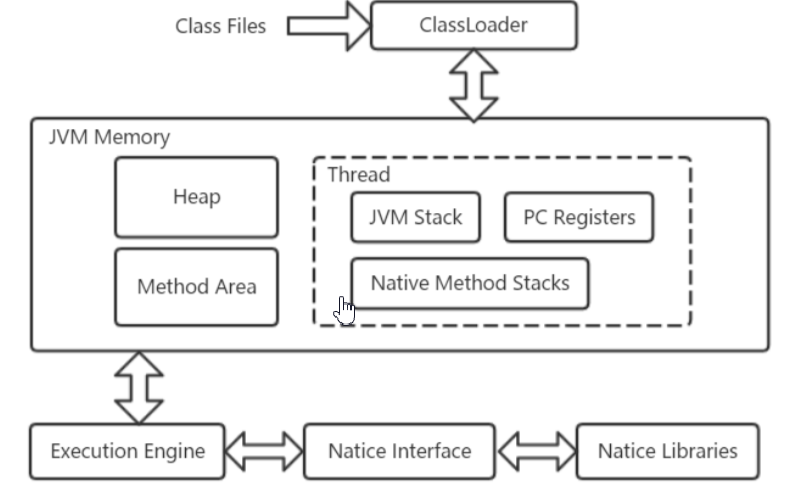

### 1、程序计数器   

  线程私有，不会发生内存溢出

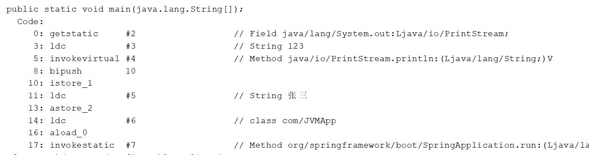

解释执行---->cpu

#### 作用

用于保存JVM中下一条所要执行的指令的地址  

#### 特点

- 线程私有
  - CPU会为每个线程分配时间片，当当前线程的时间片使用完以后，CPU就会去执行另一个线程中的代码
  - 程序计数器是**每个线程**所**私有**的，当另一个线程的时间片用完，又返回来执行当前线程的代码时，通过程序计数器可以知道应该执行哪一句指令
- 不会存在内存溢出    

### 2、虚拟机栈    （栈，先进后出）

#### 2.1：定义

```txt
- 每个线程运行需要的内存空间，称为**虚拟机栈**
- 每次调用方法时所占用的内存，称为**栈帧**
- 当前正在执行的方法  ，称为**活动栈帧**
```

#### 2.2：演示

```java
package com.stack;


public class Demo1 {

    public static void main(String[] args) {
        method1();
    }

    private static void method1() {
        method2(1, 2);
    }

    private static int method2(int a, int b) {
        int c = a + b;
        return c;
    }
}
```

[](https://nyimapicture.oss-cn-beijing.aliyuncs.com/img/20200608150534.png)


#### 2.3：问题解答

- **垃圾回收是否涉及栈内存？**
  - **不需要。在方法执行完毕后，对应的栈帧就会被弹出栈。所以无需通过垃圾回收机制去回收内存。**
- **栈内存的分配越大越好吗？**
  - **不是。因为物理内存是一定的，栈内存越大，可以支持更多的递归调用，但是可执行的线程数就会越少**。
- **方法内的局部变量是否是线程安全的？**
  - **如果方法内局部变量没有逃离方法的作用范围，则是线程安全的**
  - **如果如果局部变量引用了对象，并逃离了方法的作用范围，则需要考虑线程安全问题**

#### 2.4：内存溢出      （栈内存溢出，递归无退出 ）

```txt
溢出发生原因：虚拟机栈中，栈帧过多（无限递归）
```


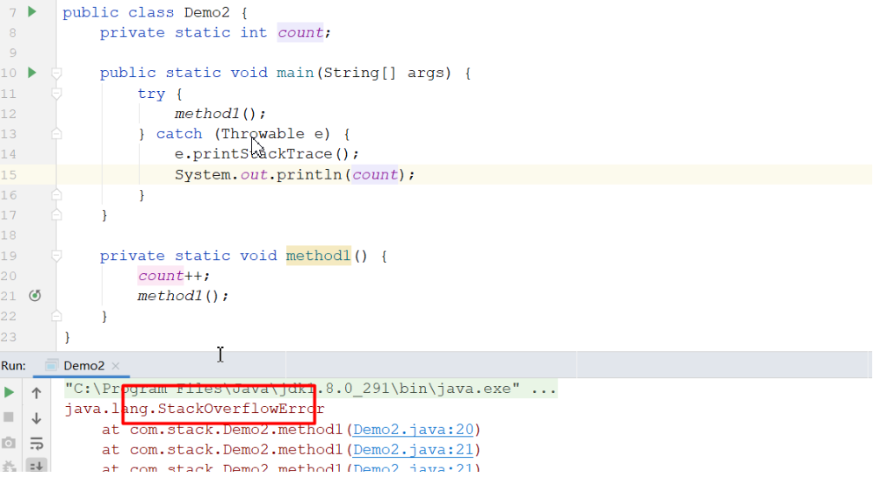


**设置栈大小**

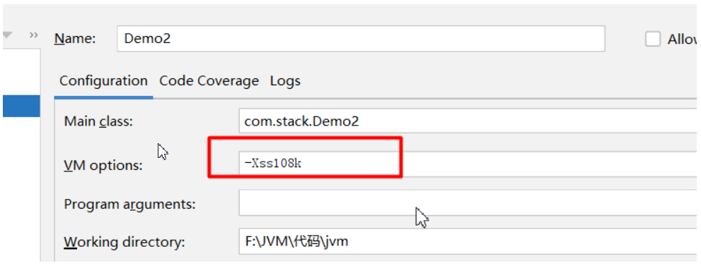


#### 2.5：生产排查

CPU占用过高    **（使用top命令看cpu占用率，   ps 查看 哪个线程占用CPU过高,  jstack - 查看进程中的线程 ）**

- Linux环境下运行某些程序的时候，可能导致CPU的占用过高，这时需要定位占用CPU过高的线程
  - **top**命令，查看是哪个**进程**占用CPU过高
  - **ps H -eo pid,tid,time,%cpu,cmd --sort=%cpu  | grep pid**  通过ps命令进一步查看是哪个线程占用CPU过高
  - **jstack -l 进程id** 通过查看进程中的线程的nid，注意：jstack查找出的线程id是**16进制的**，**需要转换**

### 3、本地方法栈     

```txt
一些带有native关键字的方法就是需要JAVA去调用本地的C或者C++方法，因为JAVA有时候没法直接和操作系统底层交互，所以需要用到本地方法
```

   

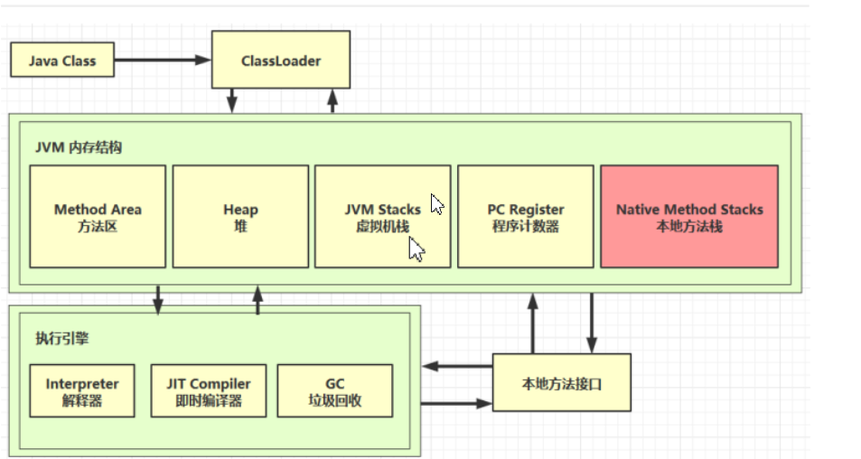

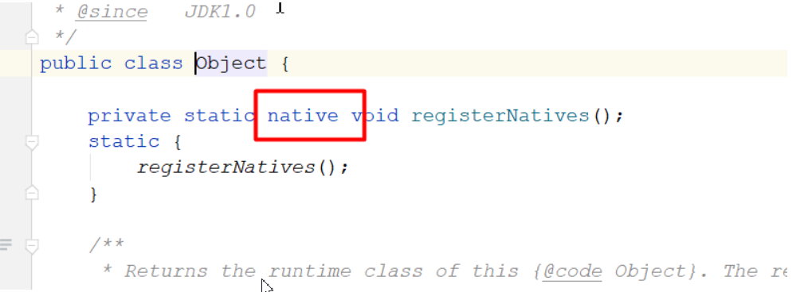


### 4、堆      （对象，数组，枚举）

#### 4.1：定义

> Student stu(栈) =   new Student()（堆）

>  通过new关键字**创建的对象**都会被放在堆内存

#### 4.2：特点

- **所有线程共享**，**堆内存中的对象都需要考虑线程安全问题**         对象的线程同步
- **有垃圾回收机制**   

#### 4.3：堆内存溢出

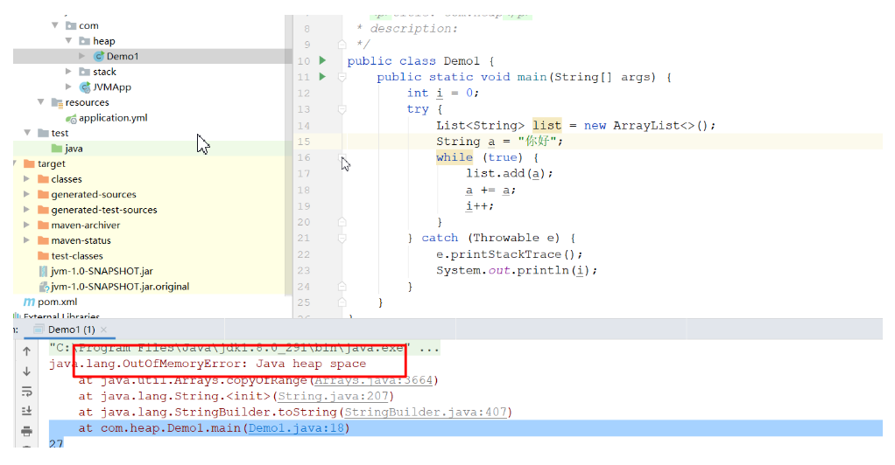


**设置堆大小**

> Unless the initial and maximum heap sizes are specified on the command line, they are calculated based on the amount of memory on the machine.
>
> - ###### 最大堆大小：物理内存小于192MB时，为物理内存的一半；物理内存大192MB且小于1GB时，为物理内存的四分之一；大于等于1GB时，都为256MB
>
> - **初始化堆大小：至少为8MB；物理内存大于512MB且小于1GB时，为物理内存的六十四分之一；大于等于1GB时，都为16MB**
>
> - -Xms  初始堆大小   -Xmn 最小堆大小   -Xmx 最大堆大小


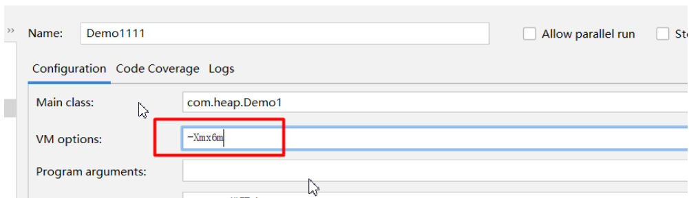


#### 4.4：堆内存诊断   


**jps**         （查看进程）

**jmap -heap 进程id   （查看堆内存使用情况） **         堆： 新生代 （1）  和老年代 （2）

​                                                     伊甸区（8） 、 S0（1）、 S1（1）

​                                                       

**jconsole 进程id**         windows下运行      HeapDemo2

**jvirsalvm 进程id**   堆dump搜索占用内存的数据    ，不用了

> *VisualVM* 是一款免费的，集成了多个 JDK 命令行工具的可视化工具，提供强大的分析能力，对 Java 应用程序做性能分析和调优。
>
> 在高版本JDK（大于1.8或后期更新的1.8版本）中已经不会再自动集成 *VisualVM*

### 5.Arthas        (JVM诊断工具)

**栈内存：thread -n 1   查找到最耗CPU的线程**     

**堆内存：heapdump  查找对象生成文件，jhat  启动打开文件**

> 文档：https://arthas.aliyun.com/doc/

#### 5.1：Arthas功能

 ```txt

这个类从哪个 jar 包加载的？为什么会报各种类相关的 Exception？
我改的代码为什么没有执行到？难道是我没 commit？分支搞错了？
遇到问题无法在线上 debug，难道只能通过加日志再重新发布吗？
线上遇到某个用户的数据处理有问题，但线上同样无法 debug，线下无法重现！
是否有一个全局视角来查看系统的运行状况？
有什么办法可以监控到JVM的实时运行状态？
怎么快速定位应用的热点，生成火焰图？
怎样直接从JVM内查找某个类的实例？
 ```

#### 5.2：Arthas安装        （查看JVM的运行情况）

**在线安装**

```txt

curl -O https://arthas.aliyun.com/arthas-boot.jar
java -jar arthas-boot.jar

```

**离线安装**

最新版本，点击下载：[](https://arthas.aliyun.com/download/latest_version?mirror=aliyun)

解压后，在文件夹里有`arthas-boot.jar`，直接用`java -jar`的方式启动：

```
java -jar arthas-boot.jar
```


**通过浏览器操作**

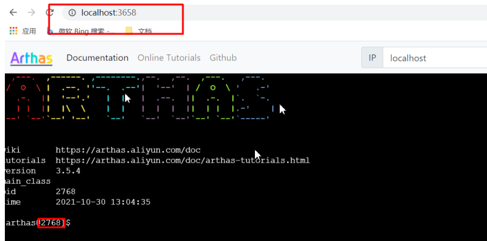


#### 5.3：命令简介      

dashboard 演示

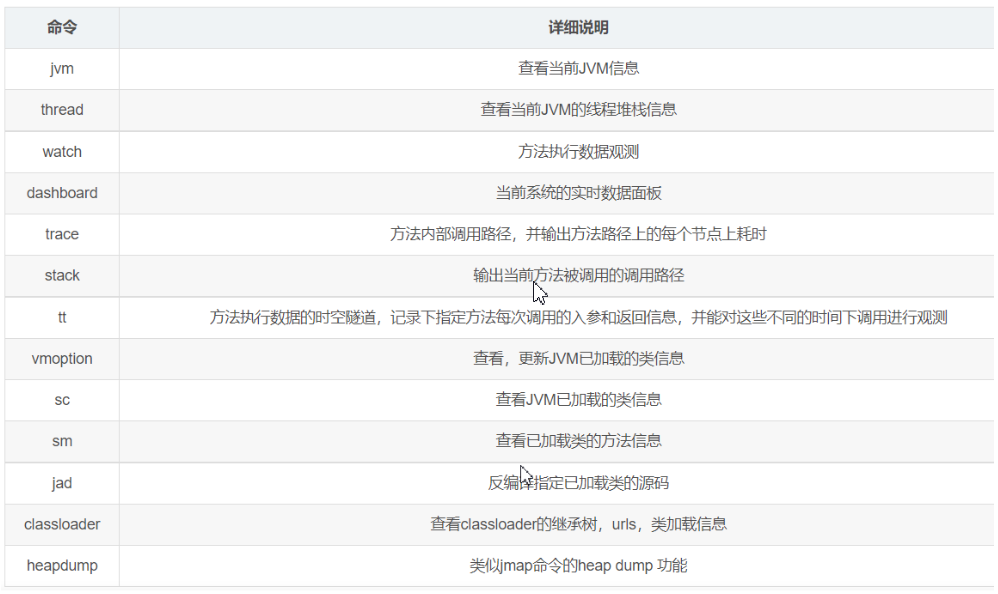

#### 5.5：CPU排查      （栈内存）

> 排查哪个线程最消耗CPU资源

先通过top命令找到最耗CPU的进程id

再通过arthas 监测该进程

通过thread -n 1   查找到最耗CPU的线程     


#### 5.4：排查内存消耗    （堆内存）

> 分析堆内存为什么占用这么高

通过top找到消耗内存的进程

开启arthas

heapdump --live  /usr/local/dump.hprof    （arthas的命令） 

jhat dump.hprof   

通过ip+端口访问      虚拟机:7000


### 6、方法区    （存的是类的结构）

常量和静态变量也是放在方法区中的


方法区定义：https://docs.oracle.com/javase/specs/jvms/se8/html/jvms-2.html

#### 6.1：结构


#### 6.2：内存溢出

- 1.8以前会导致**永久代**内存溢出

  -XX:MaxPermSize=64m 来设定永久代最大可分配空间。32 位机器默认是64M ，64位机器模式是 82M

- 1.8以后会导致**元空间**内存溢出

  `-XX:MetaspaceSize`=21m和`-XX:MaxMetaspaceSize=-1`  （不设限制） 

#### 6.3：常量池

通过javap指令可以查看字节码文件中类的基本信息、常量池、类的方法定义（包含了虚拟机指令）

```txt
F:\JVM\代码\jvm\target\classes\com\methodarea>javap -v MethodAreaDemo1.class
```


**解释器查表翻译：**

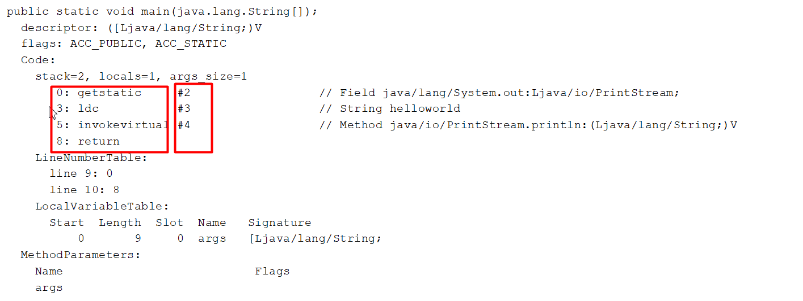


- 常量池
  - 就是一张常量表（constant pool），虚拟机指令根据这张常量表找到要执行的类名、方法名、参数类型、字面量信息
- 运行时常量池
  - 常量池是*.class文件中的，当该**类被加载以后**，它的常量池信息就会**放入运行时常量池**，并把里面的**符号地址变为真实地址**

#### 6.4：StringTable串池


StringTable.class

##### 6.4.1：字符串赋值过程

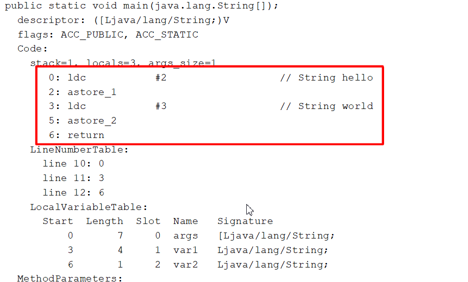


##### 6.4.2：字符串拼接过程1

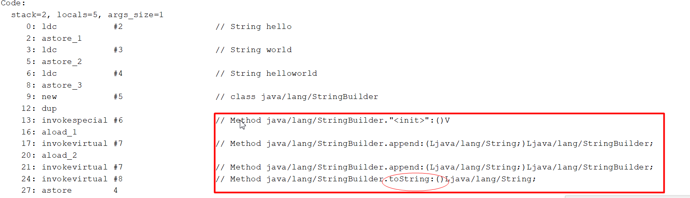


##### 6.4.2：字符串拼接过程2  

> ```
> String var5 = "hello"+"world"; //编译期间优化    
> ```

 String var1= "hello",var2="world";   

​    String var4 = var1+var2 和 String var5=  "hello"+"world"和 String var6=var1+"world"

##### 6.4.3：字符串intern方法  

> 作用：将字符串对象强制放入串池，并返回串池的对象引用

```java
String var1 = new String("hello");//对象在堆中
String var2 = "hello";//对象在串池中
System.out.println(var1 == var2);


String var1 = new String("hello");//对象在堆中
String var2 = "hello";//对象在串池中
String var3 = var1.intern(); //var3在串池中
System.out.println(var1 == var2);
System.out.println(var3 == var2);
System.out.println(var3 == var1);


```


##### 6.4.4：串池所处的位置

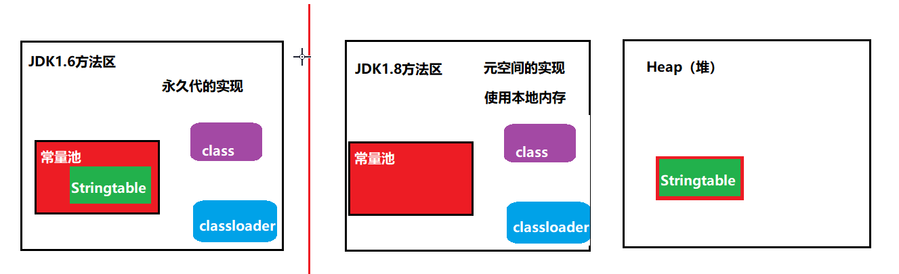

```txt
转移到堆的原因
永久代只有fullgc才会进行垃圾回收，如果放在永久代的方法区，会导致内存溢出
放入堆中，堆会频繁gc
```


**小结**

- 常量池中的字符串仅是符号，只有**在被用到时才会转化为对象**
- 利用串池的机制，来避免重复创建字符串对象
- 字符串**变量**拼接的原理是**StringBuilder**
- 字符串**常量**拼接的原理是**编译器优化**    
- 可以使用**intern方法**，主动将串池中还没有的字符串对象放入串池中
- **注意**：无论是串池还是堆里面的字符串，都是对象用来放字符串对象且里面的**元素不重复**


## 二：垃圾回收


### 2.1：怎么判断垃圾

**引用计数**：

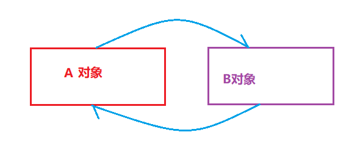

**弊端：内存不能回收，导致内存泄漏**


**可达分析**：


**GC Roots 到底是什么东西呢，哪些对象可以作为 GC Root 呢？**

- 虚拟机栈（栈帧中的本地变量表）中引用的对象
- 本地方法栈中 JNI（即一般说的 Native 方法）引用的对象
- 方法区中类静态属性引用的对象    
- 方法区中常量引用的对象


### 2.2：引用


> 为了充分利用计算机的内存，对象被设计成拥有生命周期。当对象的生命周期结束，会被垃圾回收器回收，从而释放内存资源。为了考虑回收的各种场景，在JDK1.2引用了强、软、弱、虚4种引用类型。

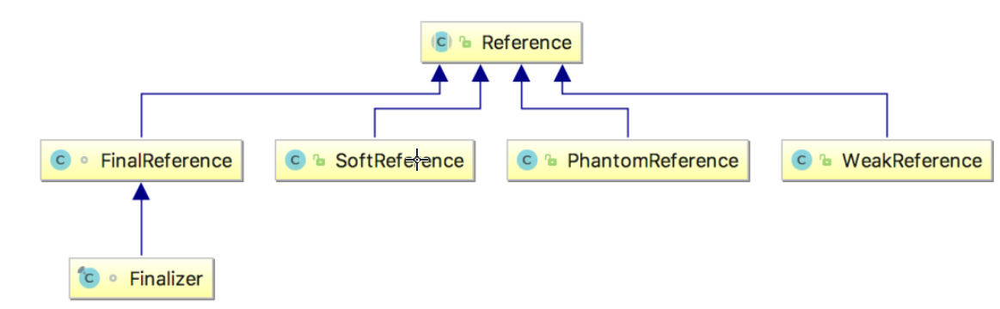


**强引用**

如果一个对象是强引用，那么垃圾回收器不会轻易回收它。只用当这个对象没有被使用，垃圾回收器才会回收它。

```java
//强引用
public void a (){
    Student stu = new Student();

    stu = null;

    System.gc();

}

```


**软引用**

当系统内存不足时，会触发GC。当垃圾回收后，内存还是不足，就会把软引用的包裹的对象给清理掉。

```java
  //软引用
    public static void b(){
        Student student = new Student();
        SoftReference<Student> ref = new SoftReference<>(student);
        student = null;
        System.gc();
        //只要内存够不会回收
        System.out.println(ref.get());


        try {
            //内存不够回收
            byte[]  data = new byte[1024*1024*10];
        } catch (Exception exception) {
            exception.printStackTrace();
        } finally {
            System.out.println(ref.get());
        }

    }

```


**弱引用**

如果触发GC，这时内存很充足，但是被弱引用的对象还是会被回收。所以说，被弱引用关联的对象只能生存到下一次垃圾收集发生之前。

```java
 //弱引用
    public static void c(){
        Student student = new Student();
        WeakReference<Student> ref = new WeakReference<>(student);
        student = null;
        System.out.println(ref.get());
        System.gc();
        System.out.println(ref.get());


    }


```


**虚引用**

这就是虚引用有几个特点：

- 虚引用必须与`ReferenceQueue`一起使用，当GC准备回收一个对象，如果发现它还有虚引用，就会在回收之前，把这个虚引用加入到与之关联的`ReferenceQueue`中。
- 虚引用可以跟踪对象的回收情况

```java
public  static void  d(){
    ReferenceQueue queue = new ReferenceQueue();

    PhantomReference<Student> ref = new PhantomReference<>(new Student(),queue);

    System.out.println(ref.get());
}
```


### 2.3：垃圾回收算法

#### 2.3.1：标记清除

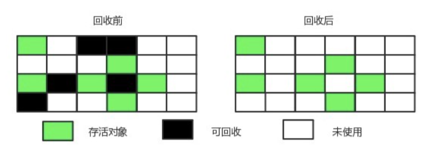

```txt
标记无用对象，然后进行清除回收
优点：效率快
缺点：内存碎片
```


#### 2.3.2：标记整理

```txt
标记无用对象，让所有存活的对象都向一端移动，然后直接清除掉端边界以外的内存。
优点：避免内存碎片
缺点：效率低
```


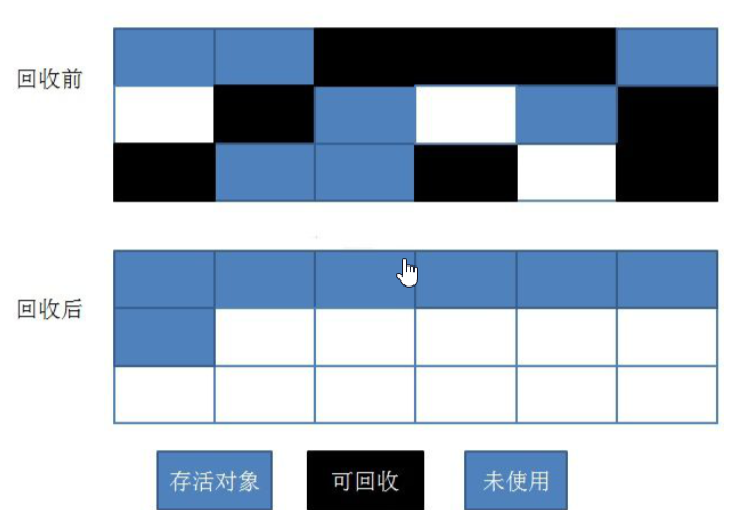


#### 2.3.3：复制

```txt
按照容量划分二个大小相等的内存区域，当一块用完的时候将活着的对象复制到另一块上，然后再把已使用的内存空间一次清理掉。
优点：避免内存碎片，效率相对页可以。
缺点：内存使用率不高，只有原来的一半。
```


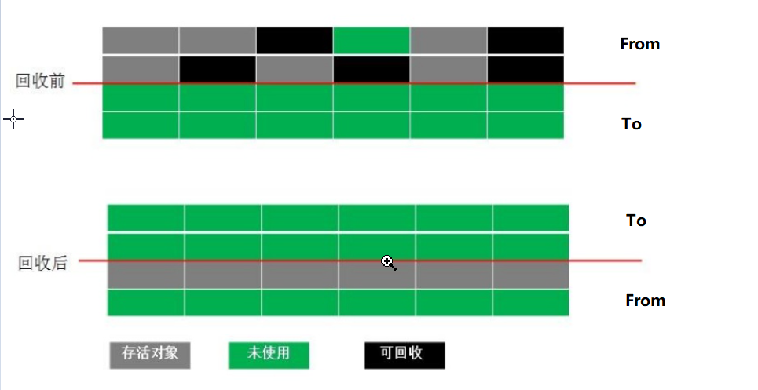


#### 2.3.4：分代回收

https://www.processon.com/diagraming/5febdd235653bb6b1b4f5bd6

```txt
分代回收算法是目前使用较多的一种算法，这个不是一个新的算法，只是将内存进行的划分，不同区域的内存使用不同的算法。
在新生代中使用是复制算法，在进行对象内存分配的时候只会使用 Eden 和 S0 区，当发生 GC 的时候，会将存活的对象复制到 S1 区，然后循环往复进行复制。
当某个对象在进行了 15 次GC 后依旧存活，那这个对象就会进入老年代。老年代因为每次回收的对象都会比较少，因此使用的是标记整理算法。
```


#### 2.3.5：JVM参数

| 含义               | 参数                                                        | eg                                                           |
| ------------------ | ----------------------------------------------------------- | ------------------------------------------------------------ |
| 堆初始大小         | Xms                                                         | **-Xms512m**                                                 |
| 堆最大大小         | -Xmx 或 -XX:MaxHeapSize=size                                | **-Xmx512m**                                                 |
| 新生代大小         | -Xmn 或 (-XX:NewSize=size + -XX:MaxNewSize=size )           | **-Xmn200m**                                                 |
| 幸存区比例（动态） | XX:InitialSurvivorRatio=ratio 和 -XX:+UseAdaptiveSizePolicy | **XX:SurvivorRatio=8，伊甸园区、幸存者0区和幸存者1区比例为： 8:1:1** |
| 幸存区比例         | -XX:SurvivorRatio=ratio                                     | -XX:SurvivorRatio=8                                          |
| 晋升阈值           | -XX:MaxTenuringThreshold=threshold                          | -XX:MaxTenuringThreshold=15                                  |
| 晋升详情           | XX:+PrintTenuringDistribution                               |                                                              |
| GC详情             | -XX:+PrintGCDetails -verbose:gc                             |                                                              |
| FullGC 前 MinorGC  | -XX:+ScavengeBeforeFullGC                                   |                                                              |


### 2.4：垃圾回收器

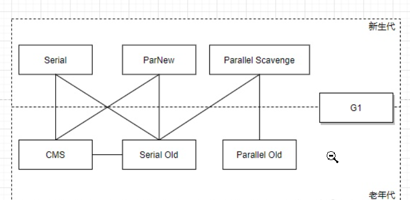


#### 2.4.1：串行   

**开启方式：**

```txt
XX:+UseSerialGC = Serial + SerialOld
```

**运行原理** 

​                                                                            stw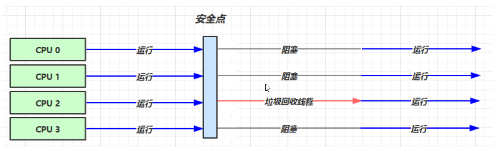

**应用场景:**

```txt
单核CPU
堆内存较小，适合个人电脑
```


#### 2.4.2：吞吐量优先

> 吞吐量=用户线程执行时间/(用户线程执行时间+垃圾收集时间)。
>
> 虚拟机总共运行100分钟，其中垃圾收集花费时间1分钟，那么吞吐量就是 99%


**开启方式：**

```txt
-XX:+UseParallelGC 
-XX:+UseParallelOldGC
-XX:ParallelGCThreads=n
```

**运行原理**

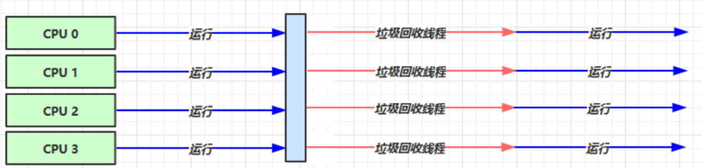

**应用场景:**

```txt
堆内存较大，多核 cpu
适用于后台计算型任务程序
```


#### 2.4.3：响应时间优先

> 单次 STW 的时间最短

**开启方式：**

```txt
-XX:+UseConcMarkSweepGC 
-XX:+UseParNewGC
-XX:ConcGCThreads=threads

并发（Concurrent），多个线程抢占CPU资源，不是真正意义的同时进行
并行（Parallel），当系统有一个以上CPU时，当一个CPU执行一个进程时，另一个CPU可以执行另一个进程，两个进程互不抢占CPU资源，可以同时进行，真正意义的同时进行
```

**运行原理：**

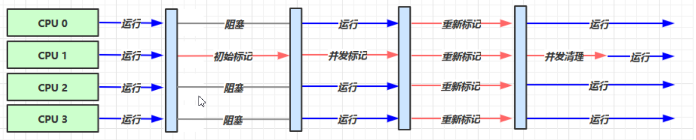

**应用场景：**

```txt
堆内存较大，多核 cpu
在互联网网站、B/S架构的中常用的收集器就是CMS，因为系统停顿的时间最短，给用户带来较好的体验
```


#### 2.4.4：G1

> | -XX:+UseG1GC           | 使用 G1 (Garbage First) 垃圾收集器                           |
> | ---------------------- | ------------------------------------------------------------ |
> | -XX:MaxGCPauseMillis=n | 设置最大GC停顿时间(GC pause time)指标(target). 这是一个软性指标(soft goal), JVM 会尽量去达成这个目标. |
>
> 

**1：简介**

```txt
1.所有的垃圾回收器的目的都是朝着减少STW的目的而前进。
2.G1(Garbage First)回收器的出现颠覆了之前版本CMS、Parallel等垃圾回收器的分代收集方式，从2004年Sun发3.布第一篇关于G1的论文后，直到2012年JDK7发布更新版本，花了将近10年的时间G1才达到商用的程度。
4.到JDK9发布之后，G1成为了默认的垃圾回收器，CMS也变相地相当于被淘汰了。
5.G1能管理超大堆内存的垃圾回收      

```

> 一共有4种Region：
>
> 分治
>
> 1. 自由分区Free Region
> 2. 年轻代分区Young Region，年轻代还是会存在Eden和Survivor的区分
> 3. 老年代分区Old Region
> 4. 大对象分区Humongous Region


每个Region的大小通过`-XX:G1HeapRegionSize`来设置，大小为1~32MB，默认最多可以有2048个Region，那么按照默认值计算G1能管理的最大内存就是32MB*2048=64G。

对于大对象的存储，存在Humongous概念，对G1来说，超过一个Region一半大小的对象都被认为大对象，将会被放入Humongous Region，而对于超过整个Region的大对象，则用几个连续的Humongous来存储（如下图H区域）。


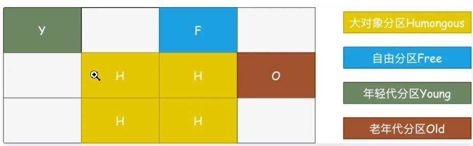


**2：怎么分region**

既然G1还是存在新生代和老年代的概念，那么新生代和老年代的空间是怎么划分的呢？


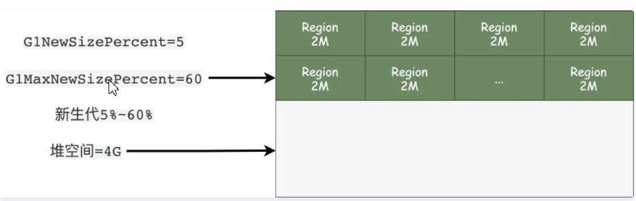


假设现在我们的堆空间大小是4G，按照默认最大2048个Region计算，每个Region的大小就是2M。

初始新生代的大小那么就是200M，大约100个Region格子，动态扩展最大就是60%*4G=2.4G大小。


### 2.5：调优

> 最好的GC调优是没有GC

##### 2.5.1：内存泄漏

>  对象不再被程序使用，但是GC又不能回收他们

**1：大量使用静态变量**

静态变量的生命周期与程序一致。因此常驻内存。

```java
public class StaticTest {
    public static  List<Integer> list = new ArrayList<>();
    public void populateList() {
        for (int i = 0; i < 10000000; i++) {
            list.add((int)Math.random());
        }
        System.out.println("running......");
    }
    public static void main(String[] args) {
      System.out.println("before......");
        new StaticTest().populateList();
        System.out.println("after......");
    }
}
```


**2：连接资源未关闭**

每当建立一个连接，jvm就会为这么资源分配内存。比如数据库连接、文件输入输出流、网络连接等等。


**3:ThreadLocal与内存泄漏**

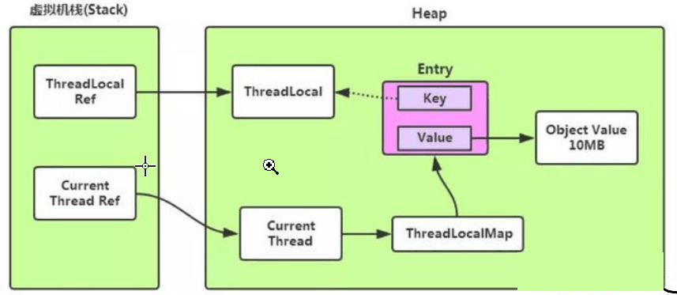


为什么要将Entry中的key设为弱引用？

设置为弱引用的key能预防大多数内存泄漏的情况。如果key 使用强引用，引用的ThreadLocal的对象被回收了，但是ThreadLocalMap还持有ThreadLocal的强引用，如果没有手动删除，ThreadLocal不会被回收，导致Entry内存泄漏。如果key为弱引用，引用的ThreadLocal的对象被回收了，由于ThreadLocalMap持有ThreadLocal的弱引用，即使没有手动删除，ThreadLocal也会被GC回收。value在下一次ThreadLocalMap调用set,get,remove的时候会被清除。

若当前线程一直不结束，可能是作为线程池中的一员，线程结束后不被销毁，或者分配（当前线程又创建了ThreadLocal对象）使用了又不再调用get/set方法，就可能引发内存泄漏。

##### 2.5.2：大表查询

select  name  from tbl   limit

Resultset  (堆)   

##### 2.5.3：面试
**JVM内存结构：**

**线程私有： 虚拟机栈，程序计数器，本地方法栈**

**线程公有： 堆 ，本地方法区**

- **垃圾回收是否涉及栈内存？**
  - **不需要。在方法执行完毕后，对应的栈帧就会被弹出栈。所以无需通过垃圾回收机制去回收内存。**
- **栈内存的分配越大越好吗？**
  - **不是。因为物理内存是一定的，栈内存越大，可以支持更多的递归调用，但是可执行的线程数就会越少**。
- **方法内的局部变量是否是线程安全的？**
  - **如果方法内局部变量没有逃离方法的作用范围，则是线程安全的**
  - **如果如果局部变量引用了对象，并逃离了方法的作用范围，则需要考虑线程安全问题**

**栈内存诊断命令：top命令(查看是哪个进程占用CPU过高)  jstack -l 进程id 通过查看进程中的线程的nid**

**堆内存诊断命令： jps（查看进程）     jmap -heap 进程id 查看堆内存使用情况**

**JVM诊断工具 (Arthas)**

**栈内存：thread -n 1   查找到最耗CPU的线程**

**堆内存：heapdump  查找对象生成文件，jhat  启动打开文件**

**串池，面试题：**

**String var1= "hello",var2="world";**   
**String var4 = var1+var2 和 String var5=  "hello"+"world"和 String var6=var1+"world"**

**intern方法，将堆内存中的字符串放到串池中**

**String s1="hello";**

**String s2 = new String("hello");**

**String s3 = s2.intern();**

**s1==s2?     不等于**

**s1==s3?     等于**

**怎么判断垃圾？ 引用计数（产生内存泄露）**

**可达分析**

**类型：**

**强 ：引用关系存在就对象不会回收**

**软： 当内存不足，gc时对象会被回收**

**弱:  只要gc，对象就回收**

**虚：无法获取对象，为了跟踪对象的回收情况**


