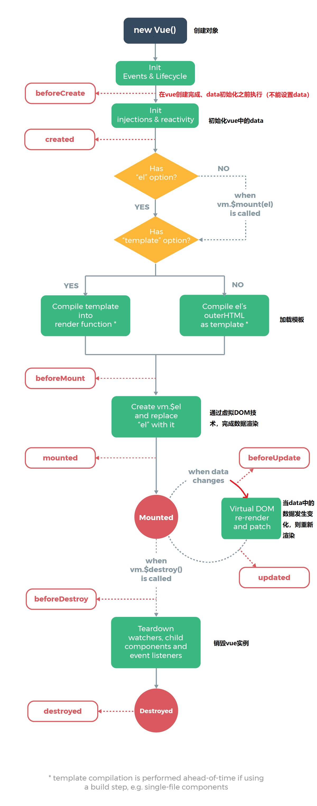

# Vue入门

## 一、Vue简介

### 1.1、使用jQuery存在的问题

> 使用jQuery进行前后端分离开发，既可以实现前后端交互，又可以完成数据渲染；
>
> 存在的问题：jQuery需要通过HTML标签拼接、DOM节点操作完成数据的显示，开发效率低且容易出错，渲染效率较低；
>
> Vue.js是继jQuery之后的又一优秀的前端框架：专注于前端数据的渲染——语法简单、渲染效率高。
>
> vue.js代替一部分jQuery的功能  val()  text() html() css()  $()  
>
>  axios.js   

### 1.2、Vue.js是什么

> Vue (读音` /vjuː/`，类似于view) 是一套用于构建用户界面的渐进式框架。
>
> Vue的核心库只关注视图层，不仅易于上手，还便于与第三方库或既有项目整合。另一方面，当与现代化的工具链以及各种支持类库结合使用时，Vue 也完全能够为复杂的单页应用提供驱动。
>
> 官方网站：`https://cn.vuejs.org`

### 1.3、关于MVVM   面试

> 项目结构经历的三个阶段：
>
> * **后端MVC**可以理解为单体架构，流程控制是由后端控制器来完成；
>
> * **前端MVC**前后端分离开发，后端只负责接收响应请求；
>
> * **MVVM**前端请求后端接口，后端返回数据，前端接收数据，并将接收的数据设置VM，HTML从VM取值
>   
>   * M(model)：数据模型，指的是后端接口返回的数据
>   
>   * V(view)：视图
>   
>   * VM(ViewModel)：视图模型，数据模型与视图之间的桥梁，后端返回的Model转换前端所需的VM，视图层可以直接从VM中提取数据
>   
>     **MVVM： 数据和视图的双向绑定，一方改变，另外一方也会改变**      (面试)
>
> 前端MVC


> MVVM


## 二、Vue入门案例

> Vue的核心库只关注视图层，不仅易于上手，还便于与第三方库或既有项目整合。   
>
> 在讲Axios之前，我们都假设数据是通过ajax请求返回的数据。我们主要学习的是上图中步骤4和之后的内容。

### 2.1、引入Vue.js       

> * 离线引用：下载Vue的js文件，添加到前端项目，在网页中通过script标签引用Vue.js文件
>
> - CDN引用：

```javascript
<script src="https://cdn.jsdelivr.net/npm/Vue/dist/Vue.js"></script>
```

### 2.2、入门案例

```html
<!DOCTYPE html>
<html lang="en">
<head>
    <meta charset="UTF-8">
    <title>vue入门</title>
</head>
<body>
    <div id="app">
        {{message}}
    </div>

    <script src="js/vue.js"></script>
    <script>
        new Vue({
            el: "#app",
            data: {
                message: "hello vue!"
            }
        })
    </script>
</body>
</html>
```

> 这就是声明式渲染：Vue.js的核心是一个允许采用简洁的模板语法来声明式地将数据渲染进DOM的系统。
>
> 这里的核心思想就是没有繁琐的DOM操作，例如在jQuery中，我们需要先找到div节点，获取到DOM对象，然后进行一系列的节点操作。

## 三、Vue基础

### 3.1、基本类型数据和字符串

```html
<body>
<div id="app">
    <p>姓名:{{name}}</p>
    <p>年龄:{{age}}</p>
</div>

<script src="js/vue.js"></script>
<script>
    new Vue({
        el: "#app",
        data: {
            name: 'zs',
            age: 10
        }
    })
</script>
</body>
```

### 3.2、对象类型数据

```html
<body>
<div id="app">
    <p>姓名:{{user.name}}</p>
    <p>年龄:{{user.age}}</p>
</div>

<script src="js/vue.js"></script>
<script>
    new Vue({
        el: "#app",
        data: {
            user: {
                name: 'zs',
                age: 10
            }
        }
    })
</script>
</body>
```

### 3.3、基本数据渲染和指令  (v-bind简写:)

> `v-bind`被称为指令。指令带有前缀`v-` 。
>
> 除了使用插值表达式`{{}}`进行数据渲染，也可以使用`v-bind`指令，它的简写的形式就是一个冒号`:`
>
> `v-bind`通常用于为`标签的属性`绑定值。 能够让数据影响视图，无法让视图影响数据
>
> 

```html
<body>
<div id="app">
    <div>
        <!-- 如果要将模型数据绑定在html属性中，则使用v-bind指令，此时title中显示的是模型数据 -->
        <h5 v-bind:title="title">{{content}}</h5>
        <h5 :title="title">{{content}}</h5>
    </div>
    
</div>

<script src="js/vue.js"></script>
<script>
    new Vue({
        el: "#app",
        data: {
            content: 'hello vue.js',
            title: '页面加载于 ' + new Date().toLocaleString()
        }
    })
</script>
</body>
```

### 3.4、双向数据绑定   (v-model:value 简写 v-model)

> - 双向数据绑定使用`v-model`；
> - 一般使用在表单输入标签；
> - `v-model:value`可以简写为`v-model`

```html
<body>
<div id="app">
    <p>
        单项数据绑定<input type="text" v-bind:value="keyword">
    </p>
    <p>
        双向数据绑定<input type="text" v-model="keyword">   
    </p>
    <p>
        {{keyword}}
    </p>
</div>

<script src="js/vue.js"></script>
<script>
    new Vue({
        el: "#app",
        data: {
            keyword: 'vue.js'
        }
    })
</script>
</body>
```

> 通过上面的案例我们发现，修改`v-model`中的数据，`data`对象中的数据也被修改。
>
> vm的测试也可以控制台进行 let vm =new Vue...

## 四、条件渲染与列表渲染

### 4.1、条件渲染

#### 4.1.1、v-if

> 在HTML标签可以添加`v-if`指令指定一个条件，如果条件成立则显示此HTML标签，如果不成立则不显示当前标签；
>
> 条件可以是一个表达式也可以是一个具体的`boolean`类型值。

```html
<body>
<div id="app">
    <p>id: {{student.id}}</p>
    <p>name: {{student.name}}</p>
    <p>age: {{student.age}}</p>
    <p>gender: 
        <span v-if="student.gender == 'M'">男</span>
        <span v-if="student.gender == 'F'">女</span>
    </p>

</div>

<script src="js/vue.js"></script>
<script>
    new Vue({
        el: "#app",
        data: {
            student: {
                id: 10,
                name: '张三',
                age: 20,
                gender: 'M'
            }
        }
    })
</script>
</body>
```

#### 4.1.2、v-else

```html
<body>
<div id="app">
    <p>id: {{student.id}}</p>
    <p>name: {{student.name}}</p>
    <p>age: {{student.age}}</p>
    <p>gender:
        <span v-if="student.gender == 'M'">男</span>
        <span v-else>女</span>
    </p>

</div>

<script src="js/vue.js"></script>
<script>
    new Vue({
        el: "#app",
        data: {
            student: {
                id: 10,
                name: '张三',
                age: 20,
                gender: 'M'
            }
        }
    })
</script>
</body>
```

#### 4.1.3、v-else-if

```html
<body>
<div id="app">
    <p>id: {{student.id}}</p>
    <p>name: {{student.name}}</p>
    <p>age: {{student.age}}</p>
    <p>gender:
        <span v-if="student.gender == 'M'">男</span>
        <span v-else>女</span>
    </p>
    <p>level:
        <span v-if="student.score >= 90">A</span>
        <span v-else-if="student.score >= 80">B</span>
        <span v-else-if="student.score >= 60">C</span>
        <span v-else>D</span>
    </p>
</div>

<script src="js/vue.js"></script>
<script>
    new Vue({
        el: "#app",
        data: {
            student: {
                id: 10,
                name: '张三',
                age: 20,
                gender: 'M',
                score: 90
            }
        }
    })
</script>
</body>
```

#### 4.1.4、v-show

v-if如果不满足条件，元素不会出现在页面中

v-show隐藏

```html
<p>
    gender:
    <span v-show="student.gender == 'M'">男</span>
    <span v-show="student.gender == 'F'">女</span>
</p>
```

> 从功能上将`v-show`和`v-if`作用是相同的，渲染过程有区别。
>
> `v-if` 是“真正”的条件渲染，因为它会确保在切换过程中条件块内的事件监听器和子组件适当地被销毁和重建。
>
> `v-if` 也是**惰性的**：如果在初始渲染时条件为假，则什么也不做——直到条件第一次变为真时，才会开始渲染条件块。
>
> 相比之下，`v-show` 就简单得多——不管初始条件是什么，元素总是会被渲染，并且只是简单地基于 CSS 进行切换。
>
> 一般来说，`v-if` 有更高的切换开销，而 `v-show` 有更高的初始渲染开销。因此，如果需要非常频繁地切换，则使用 `v-show` 较好；如果在运行时条件很少改变，则使用 `v-if` 较好。

### 4.2、列表渲染

> 将集合数据以表格、列表的形式显示
>
> 显示10个整数

```html
<body>
<div id="app">
    <ul>
        <li v-for="num in 10">{{num}}</li>
    </ul>
    <hr/>
    <!-- index表示索引 -->
    <ul>
        <li v-for="(num, index) in 10">{{num}}-{{index}}</li>
    </ul>
</div>

<script src="js/vue.js"></script>
<script>
    new Vue({
        el: "#app",
        data: {}
    })
</script>
</body>
```

> 遍历数组并显示

```html
<body>
<div id="app">
    <ul>
        <li v-for="(item, index) in titles">{{item}}</li>
    </ul>
</div>

<script src="js/vue.js"></script>
<script>
    new Vue({
        el: "#app",
        data: {
            titles: ['Java', 'JavaWeb', 'SSM', 'SpringBoot']
        }
    })
</script>
</body>
```

> 遍历数组并显示

```html
<body>
<div id="app">
    <table>
        <tr>
            <td>id</td>
            <td>username</td>
            <td>age</td>
        </tr>
        <tr v-for="(user, index) in userList">
            <td>{{user.id}}</td>
            <td>{{user.username}}</td>
            <td>{{user.age}}</td>
        </tr>
    </table>
</div>

<script src="js/vue.js"></script>
<script>
    new Vue({
        el: "#app",
        data: {
            userList: [
                { id: 1, username: 'helen', age: 18 },
                { id: 2, username: 'peter', age: 28 },
                { id: 3, username: 'andy', age: 38 }
            ]
        }
    })
</script>
</body>
```

## 五、事件处理

> 在使用Vue进行数据渲染时，如果使用原生js事件绑定(例如onclick)，如果需要获取Vue实例中的数据并传参则需要通过拼接来完成。
>
> Vue提供了`v-on`指令用于绑定各种事件`v-on:click`，简化了从Vue取值的过程，但是触发的方法需要定义在Vue实例的methods中。
>
> ```html
> <button type="button"  v-on:click="doDelete(s.stuNum,s.stuName)">删除</button>
> 
> <script type="text/javascript">
>  var vm = new Vue({
>      el:"#container",
>      data:{
>          s:{
>              stuNum:"1",
>              stuName:"张三"
>          }
>          
>      },
>      methods:{
>          doDelete:function(snum,sname){
>              console.log("----delete:"+snum+"   "+sname)
>          }
>      }
>  });
> </script>
> ```
>
> - `v-on:click`可以缩写为`@click`

### 5.1 使用JS函数传值

```html
<body>
<div id="app">
    <button v-on:click="doSth(stu.id)">click</button>
</div>

<script src="js/vue.js"></script>
<script>
    new Vue({
        el: "#app",
        data: {
            stu: {
                id: 10,
                name: 'zs'
            }
        },
        methods: {
            doSth(id) {
                console.log(id)
            }
        }
    })
</script>
</body>
```

### 5.2 使用dataset对象传值

```html
<!DOCTYPE html>
<html lang="en">
<head>
    <meta charset="UTF-8">
    <title>$Title$</title>
</head>
<body>
<div id="app">
    <button v-on:click="doSth($event)" :data-id="stu.id">click</button>
</div>

<script src="js/vue.js"></script>
<script>
    new Vue({
        el: "#app",
        data: {
            stu: {
                id: 10,
                name: 'zs'
            }
        },
        methods: {
            doSth(event) {
                console.log(event.srcElement.dataset)
                console.log(event.srcElement.dataset.id)
            }
        }
    })
</script>
</body>
</html>
```

### 5.3 混合使用

> * `$event`

```html
<body>
<div id="app">
    <button v-on:click="doSth(stu.name, $event)" :data-id="stu.id">click</button>
</div>

<script src="js/vue.js"></script>
<script>
    new Vue({
        el: "#app",
        data: {
            stu: {
                id: 10,
                name: 'zs'
            }
        },
        methods: {
            doSth(name, event) {
                console.log(name)
                console.log(event.srcElement.dataset.id)
            }
        }
    })
</script>
</body>
```

### 5.4 事件修饰符


> 当使用v-on进行事件绑定的时候，可以添加特定后缀，设置事件触发的特性

#### 5.4.1 事件修饰符使用示例

```html
<button type="submit" @click.prevent="事件函数">测试</button>
```

#### 5.4.2 事件修饰符

> `.prevent`消除元素的默认事件     v-on:click  v-on:submit

```html
<body>
<div id="app">
    <form action="https://www.baidu.com" method="post" v-on:submit.prevent="test()">
        <button type="submit">提交</button>
    </form>
</div>

<script src="js/vue.js"></script>
<script>
    new Vue({
        el: "#app",
        data: {
        },
        methods: {
            test() {
                console.log("---------------------------------------")
            }
        }
    })
</script>
</body>
```

`.stop`阻止事件冒泡（阻止子标签向上冒泡）

`.self`设置只能自己触发事件（子标签不能触发）

```html
<div id="app">
    <div style="width: 200px; height: 200px; background: red;" @click.self="method1">
        <div style="width: 150px; height: 150px; background: green;" @click="method2">
            <button type="button" @click.stop="method3">测试</button>
        </div>
    </div>
</div>

<script type="text/javascript">
    var vm = new Vue({
        el:"#app",
        data:{},
        methods:{
            method1:function(){
                alert("1");
            },
            method2:function(){
                alert("2");
            },
            method3:function(){
                alert("3");
            }
        }
    });
</script>
```

> `.once`限定事件只触发一次

#### 5.4.3 按键修饰符   （.enter）

> 按键修饰符就是针对键盘事件的修饰符，限定哪个按键会触发事件

```html
<input type="text" @keyup.enter="method4"/>    
```

> - `.enter`   
> - `.tab`
> - `.delete` (捕获“删除”和“退格”键)
> - `.esc`       
> - `.space`
> - `.up`
> - `.down`
> - `.left`
> - `.right`
>
> 除了以上Vue提供按钮的别名之外，我们还可以根据键盘为按键自定义别名
>
> [键盘码](https://developer.mozilla.org/en-US/docs/Web/API/KeyboardEvent/keyCode)
>
> **示例**：

```html
<div id="container">
   <!--2.使用自定义的按键别名aaa作为修饰符--> 
    <input type="text" @keyup.aaa="method4"/>
</div>	
<script type="text/javascript">
    //1.为按键J定于别名为  aaa
    Vue.config.keyCodes.aaa =74;

    var vm = new Vue({
        el:"#container",
        data:{},
        methods:{
            method4:function(){
                alert("4");
            }
        }
    });
</script>
```

#### 5.4.4 系统修饰符   了解

> 组合键
>
> `ctrl+j`触发事件

```html
<div id="container">
    <input type="text" @keyup.ctrl.j="method4"/>
</div>	
<script type="text/javascript">
    Vue.config.keyCodes.j =74;

    var vm = new Vue({
        el:"#container",
        data:{},
        methods:{
            method4:function(){
                alert("4");
            }
        }
    });
</script>
```

> - `.ctrl`
> - `.alt`
> - `.shift`
> - `.meta` windows键

## 六、计算属性与侦听器

el  data methods  computed

### 6.1、计算属性 

> 属性可以通过在data中声明获得，也可以通过在computed通过计算获得
>
> 特性：计算属性所依赖的属性值发生变化会影响计算属性的值同时发生变化

**示例**

```html
<!DOCTYPE html>
<html>
	<head>
		<meta charset="UTF-8">
		<title></title>
		<script type="text/javascript" src="js/Vue.js" ></script>
	</head>
	<body>
		<div id="container">
			<input type="text" v-model="str1"/><br/>
			<input type="text" v-model="str2"/><br/>
			{{str3}}
		</div>
		
		<script type="text/javascript">
			var vm = new Vue({
				el:"#container",
				data:{
					str1:"千锋",
					str2:"青岛"
				},
				computed:{
					str3:function(){
						return this.str1+this.str2;
					}
				}
			});
		</script>
	</body>
</html>
```

### 6.2、侦听器

> 侦听器，就是data中属性的监听器，当data中的属性值发生变化就会触发侦听器函数的执行

```html
<!DOCTYPE html>
<html>
	<head>
		<meta charset="UTF-8">
		<title></title>
		<script type="text/javascript" src="js/Vue.js" ></script>
	</head>
	<body>
		<div id="container">
			<input type="text" v-model="str1"/><br/>
			<input type="text" v-model="str2"/><br/>
			{{str3}}
		</div>
		
		<script type="text/javascript">
			var vm = new Vue({
				el:"#container",
				data:{
					str1:"千锋",
					str2:"青岛",
					str3:"千锋青岛"
				},
				watch:{
					str1:function(){
						this.str3 = this.str1 +this.str2; 
					},
					str2:function(){
						this.str3 = this.str1 +this.str2; 
					}
				}
			});
		</script>
	</body>
</html>
```

## 七、class与style绑定       

### 7.1、class绑定

```html
<!DOCTYPE html>
<html>
	<head>
		<meta charset="utf-8" />
		<title>class绑定</title>
		<style>
			.c1 {
				border: 2px solid fuchsia;
			}
			
			.c2 {
				text-align: center;
			}
		</style>
	</head>
	<body>
		<div id="app">
			<!-- 
				class是一个属性
				v-bind:class="data当中的某个属性"
			 -->
			<p class="c1">千锋青岛</p>
			<p v-bind:class="myClass1">千锋青岛</p>
			<!-- class有多个值绑定 -->
			<p class="c1 c2">千锋北京</p>
			<p :class="[myClass1, myClass2]">千锋北京</p>
			<!--
				通过标志控制让哪一个class生效
				三元运算符
					条件表达式 ? 表达式1 : 表达式2
			 -->
			<p :class="[flag3 ? myClass1 : myClass2]">千锋成都</p>
			<!-- 
				通过标志控制让哪一个class生效
				如果标志为true就生效
			-->
			<p :class="{c1:flag1, c2:flag2}">千锋郑州</p>    常用
			
		</div>
			<script src="./js/vue.js"></script>
        	<script>
                //创建vue对象 - vue的实例
                new Vue({
                    el: "#app", //表示要操作的元素
                    data: { //数据
                        myClass1: 'c1',
                        myClass2: 'c2',
                        flag1: true,
                        flag2: false,
                        flag3: false
                    }
                })
            </script>
	</body>
</html>
```

### 7.2、style绑定  了解

```html
<!DOCTYPE html>
<html>
	<head>
		<meta charset="utf-8" />
		<title>style绑定</title>
		<script src="./js/vue.js"></script>
	</head>
	<body>
		<div id="app">
			<!-- 
				style是标签中的属性
				可以为style使用v-bind进行绑定
			-->
			<p style="border: 1px solid cadetblue;">JavaEE</p>
			<p :style="mystyle">前端</p>
			<!-- 
				更细粒度的控制 - 只设定css的一部分
				语法:JSON
				注意：CSS的属性名要用驼峰写法，css键值对之间用逗号分割
			 -->
			<p :style="{color: mycolor, textAlign: mytextalign, backgroundColor: mybackgroundColor}">大数据</p>
			<!-- 
				为style属性绑定data中定义的表示css的对象
			 -->
			<p :style="mystyle1">运维</p>
			<p :style="[mystyle1]">运维</p>
			<p :style="[mystyle1, mystyle2]">软件测试</p>
		</div>
	</body>
	
	<script>
		//创建vue对象 - vue的实例
		new Vue({
			el: "#app", //表示要操作的元素
			data: { //数据
				mystyle: 'border: 5px solid #FF0000; text-align: center;',
				mycolor: 'yellow',
				mytextalign: "right",
				mybackgroundColor: 'brown',
				mystyle1: {
					color: 'red',
					border: '5px solid #000000'
				},
				mystyle2: {
					backgroundColor: 'green'
				}
			}
		})
	</script>
</html>
```

## 八、表单输入绑定

> v-model 
>
> 表单输入绑定，即双向绑定：就是能够将Vue实例的data数据渲染到表单输入视图（input\textarea\select），也能够将输入视图的数据同步更新到Vue实例的data中。

```html
<!DOCTYPE html>
<html>
	<head>
		<meta charset="utf-8" />
		<title>事件修饰符</title>
	</head>
	<body>
		<div id="app">
            <p>{{gender}}</p>
        	<div>
            	<input type="radio" name="gender" value="男" v-model="gender">
            	<input type="radio" name="gender" value="女" v-model="gender">
        	</div>
            <p>{{hobby}}</p>
    		<div>
                <input type="checkbox" name="hobby" value="游泳" v-model="hobby">
                <input type="checkbox" name="hobby" value="跑步" v-model="hobby">
                <input type="checkbox" name="hobby" value="学习" v-model="hobby">
            </div>
			<p>{{city}}</p>
			<!-- 下拉菜单  单选 -->
			<select v-model="city">
				<option value="BJ">北京</option>
				<option value="SH">上海</option>
				<option value="GZ">广州</option>
				<option value="QD">青岛</option>
			</select>
			<hr/>
			<p>{{citys}}</p>
			<!-- 下拉菜单 多选  -->
			<select v-model="citys" multiple="multiple">
				<option value="BJ">北京</option>
				<option value="SH">上海</option>
				<option value="GZ">广州</option>
				<option value="QD">青岛</option>
			</select>
		</div>
        
        <script src="js/vue.js"></script>
      	<script>
            //创建vue对象
           	new Vue({
                el: "#app", //表示要操作的元素
                data: { //数据
                    gender: '',
                    hobby: [],
                    city: '',
                    citys: []
                }
            })
        </script>
	</body>
</html>
```

## 九、Vue实例

> 每个使用Vue进行数据渲染的网页文档都需要创建一个Vue实例 —— ViewModel

### 9.1、Vue实例的生命周期    面试题

> ​     Servlet生命周期：实例化 (构造方法)  初始化(init)  处理请求 (service) 销毁(destroy)
>
> Vue实例生命周期——Vue实例从创建到销毁的过程
>
> - 创建Vue实例（初始化data、加载el）    beforecreate    created
> - 数据挂载（将Vue实例data中的数据渲染到网页HTML标签）  mount
> - 重新渲染（当Vue的data数据发生变化，会重新渲染到HTML标签） update
> - 销毁实例    destroy

### 9.2、钩子函数    

  $(function (){        ------------------------------>created

​       //向后台发ajax请求，请求数据

 })

> 为了便于开发者在Vue实例生命周期的不同阶段进行特定的操作，Vue在生命周期四个阶段的前后分别提供了一个函数，这个函数无需开发者调用，当Vue实例到达生命周期的指定阶段会自动调用对应的函数。



```html
<!DOCTYPE html>
<html>
	<head>
		<meta charset="utf-8">
		<title>04_vue_生命周期_钩子函数</title>
		
	</head>
	<body>
		<div id="app">
			<!-- 
				v-once 只能渲染一次
			 -->
			<p v-once>{{msg}}</p>
			<p>{{msg}}</p>
			<p><input type="text" v-model="msg"></p>
		</div>
	</body>
	
    <script src="js/vue.min.js"></script>
	<script>
		new Vue({
			el: "#app",
			data: {
				msg: "hello world"
			},
			//钩子函数
			beforeCreate:function(){
				console.log("beforeCreate")
				this.msg = "0000000000"
			},
			created:function(){
				console.log("created")
				//ajax
			},
			beforeMount:function(){
				console.log("beforeMount")
				//this.msg = 1000000
				//ajax
			},
			mounted:function(){
				console.log("mounted")
				//this.msg = 2000000000
                //ajax
			},
			beforeUpdate:function(){
				console.log("beforeUpdate", this.msg);
			},
			updated:function(){
				console.log("updated", this.msg);
			},
			beforeDestroy:function(){
				
			},
			destroyed:function(){
				
			}
		})
	</script>
</html>
```

> 我们经常使用`created`、`beforeMount`、`mounted`进行数据处理。
>
> 双向绑定使用一下beforeUpdate 和 updated
>
> 

