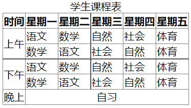
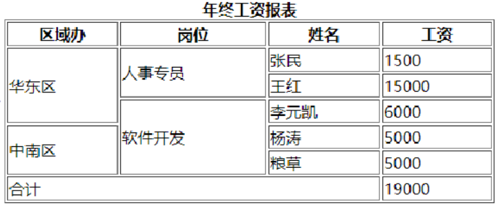
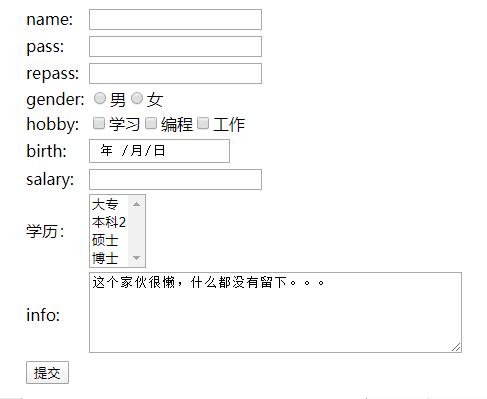

# HTML
## 一、HTML简介

> 网页，是网站中的一个页面，通常是网页是构成网站的基本元素，是承载各种网站应用的平台。通俗的说，网站就是由网页组成的。通常我们看到的网页都是以`htm`或`html`后缀结尾的文件，俗称`HTML`文件。

### 1.1、什么是HTML

> HTML全称：Hyper Text Markup Language(超文本标记语言)
>
> - 超文本：页面内可以包含图片、链接，甚至音乐、程序等非文字元素（超出文本的范畴）；
> - 标记：标签，不同的标签实现不同的功能
> - 语言：人与计算机的交互工具  

### 1.2、HTML基本结构


> 文件后缀`.htm`或`.html`；
>
> 完整的页面包含如下内容：
>
> * 文档声明，就按照图片中的写法写就可以，表明这是一个符合HTML5规范的网页；
> * 成对的HTML标签，HTML标签中包括如下内容：
>   * 成对的head标签，类似人的头部；
>   * 成对的body标签，类似人的躯干。
>
> head中可以设置一些相关信息（比如编码、标题）；
>
> body设置显示在页面上的内容。

#### 1.2.1、如何编辑 

>新建普通文件，修改后缀为`.htm`或`.html`，可以使用任何文本编辑器进行编辑
>
>* 记事本
>* **NotePad++**
>* Editplus
>* Sublime
>
>也可以使用IDE进行编辑
>
>* VS code
>* WebStorm
>* Hbuilder 或者 HbuilderX
>* Idea   (后面讲了vue的脚手架，会使用idea)

#### 1.2.2、第一个HTML

```html
<!DOCTYPE html>
<html>
<head>
    <meta charset="UTF-8">
    <title>第一个网页</title>
</head>
<body>
    <p style="color: blue; border: 1px solid black;">hello world</p>
</body>
</html>
```

> 上面的代码实现了字体变色，添加边框的效果，了解就可以。

#### 1.2.3、如何运行

> 右键选择常见的浏览器都可以运行，有些IDE内嵌了浏览器，也可以直接在IDE内运行；
>
> 建议使用新版本的Edge、Chrome、FireFox进行学习，不要使用偏门的国产浏览器。强烈建议使用**新版本的Edge或Chrome**。

#### 1.2.4、HTML书写规范

> * HTML元素标签用`<>`括起来，通常情况下`<>`表示开始，`</>`表示结束；
>
> * 部分标签不是成对存在，而是在标签内结束:`<br/>、<hr/>、` ； 单标签
>
> * 标签内部可以添加属性
>
>   ```html
>   <标签名 属性名1="属性值1" 属性名2="属性值2">
>       网页元素
>   </标签名>
>   ```
>
> * 标签不区分大小写；
>
> * 标签与标签之间可以嵌套；
>
> * 标签可以通过设置属性达到页面设计的要求；
>
> * HTML的主体标签是`<body></body>`，在浏览器中显示的文字内容编写在`<body>`标签中，这些内容包括普通的文字、空格符号和特殊符号以及页面的注释。

## 二、HTML头部

### 2.1、说明

> `<head>`开始标记，`</head>`结束标记，作用范围是整篇文档，且head中包含的内容不会显示在浏览器的窗口中。

### 2.2、内部常见元素

#### 2.2.1、title（掌握）

> 语法结构：`<title>...</title>`
>
> 说明页面的用途，显示在浏览器的标题栏中

#### 2.2.2、meta（掌握）

> 元信息元素，用来指定有关这个文档的相关信息，包括页面的文字编码，关键字，版权和作者等信息。
>
> 通常我们使用该标签设置编码，这个编码告诉浏览器以什么编码格式解析页面中的字符。
>
> ```html
> <meta charset="UTF-8">
> ```

#### 2.2.3、style（暂时了解）

> 创建当前页面中所使用的样式
>
> ```html
> <style type="text/css">
> 	...
>     ...
>     ...
> </style>
> ```

#### 2.2.4、link（暂时了解）

> 调用其他文档的内容，例如：引入外部css文件。

#### 2.2.5、script（暂时了解）

javascript

> 定义一段可执行脚本，完成相应的行为或引入外部脚本文件。注意：script不仅可以放在head中，还可以放到body中

## 三、HTML基本标签（掌握）

### 3.1、注释

```html
<!-- 这是一个单行注释 -->

<!-- 
	这是一个多行注释
-->
```

> 作用：
>
> * 解释说明；
> * 阻止代码运行。

### 3.2、排版标签

> 可用于实现简单的页面布局。
>
> 段落标签    ,独占一行

```html
<p>这是一个段落</p>
<p>这是另一个段落</p>
<!-- 
	align属性：
		left	左对齐
		center	居中
		right	右对齐
-->
<p align="left">这是一个段落</p>
<p align="center">这是一个段落</p>
<p align="right">这是一个段落</p>
```

>水平线标签

```html
<!-- 这是一个水平线 -->
<hr/>

<!-- 
	width属性：水平线的长度(两种:第一种:像素表示；第二种，百分比表示) 
	size属性：水平线的粗细 (像素表示，例如：10px)                             
	color属性：水平线的颜色         
	align属性：水平线的对齐方式
    颜色：1 单词   
         2 RGB  红绿蓝
https://www.w3school.com.cn/html/html_colors.asp
-->
<hr width="50%" size="5px" color="#0000FF" align="center"/>
```

### 3.3、标题标签

> 随着数字增大文字逐渐变小，字体是加粗的，内置字号，默认占据一行。

```html
<h1>这是一级标题</h1>
<h2>这是二级标题</h2>
<h3>这是三级标题</h3>
<h4>这是四级标题</h4>
<h5>这是五级标题</h5>
<h6>这是六级标题</h6>
```

> 一级标题字体最大，六级标题字体最小

### 3.4、基本文字标签

> font标签处理网页中文字的显示方式。    不独占一行

```html
<!-- 
	size属性：用于设置字体的大小，最小1号，最大7号
	color属性：用于设置字体的颜色
	face属性：用于设置字体
-->
<font size="7" color="yellow" face="微软雅黑">设置字体</font>
```

### 3.5、文本格式化标签

> 使用标签实现标签的样式处理

```html
<b>粗体标签</b><br/>    bold
<strong>加粗</strong><br/>
<em>强调字体</em><br/>
<i>斜体</i><br/> 
<small>小号字体</small><br/>
<big>大号字体</big><br/>
<p>上标标签<sup>2</sup></p>    
<p>下标标签<sub>2</sub></p>
<del>删除线</del>
```

### 3.6、列表标签

> 无序列表：使用一组无序的符号定义。

```html
<!--
	type属性用来定义符号的类型
		circle：空心圆
		disc：实心圆
		square：黑色方块
-->
<ul type="circle">
    <li>JavaSE</li>
    <li>JavaWeb</li>
    <li>SSM</li>
    <li>SpringBoot</li>
</ul>
```

> 有序列表：使用一组有序的符号定义。

```html
<!--
	type属性用来定义符号的类型
 		1：数字类型
 		A：大写字母类型
 		a：小写字母类型
 		I：大写古罗马
 		i：小写古罗马
	start用来定义起始值
-->
<ol type="1" start="1">
    <li>JavaSE</li>
    <li>JavaWeb</li>
    <li>SSM</li>
    <li>SpringBoot</li>
</ol>
```

> 列表可以相互嵌套

```html
<ol type="1" start="1">    
    <li>JavaSE
        <ul>
            <li>Java开发环境搭建</li>
            <li>变量</li>
            <li>程序结构</li>
        </ul>
    </li>
    <li>JavaWeb</li>
    <li>SSM</li>
    <li>SpringBoot</li>
</ol>
```

### 3.7、图形标签

> 在页面指定位置处中引入一幅图片。

```html
<!--
	src属性：规定显示图像的URL；
	width属性：设置图像的宽度；
	height属性：定义图像的高度；
	alt属性：规定图像的替代文本。
-->


<!-- 
	关于路径：
		./表示当前路径下
		../表示上一级路径下
		什么都不写表示当前路径下
-->
<!-- 当前路径下，和当前html同一级目录下 -->

<!-- 上一级路径下，当前html上一级目录下 -->

<!-- 当前路径下，和当前html同一级目录下 -->

```

### 3.8、链接标签

> 文档的任何部分（如文本、页面、表单、动画或图像等）都可用作超级链接，超级链接可用于指向网站的不同页面或页面的特定部分。

```html
<!--
	href属性：指定连接路径，既可以是本地的路径，也可以是网络中的路径
	title属性：指定连接提示文字
	target属性：连接目标窗口打开方式，target的取值如下
		_blank:在新窗口中打开链接文档
		_self:默认值 在相同框架中打开被链接文档
		_parent:在父框架集中打开被链接文档（了解）
		_top:在整个窗口中打开被链接文档（了解）
	title属性和target属性可以没有
-->
<a href="https://www.baidu.com" title="百度" target="_blank">百度</a>
```

> 当一个网页的主题较多或内容较长时，可以在网页内建立多个标记点，将超链接指向这些标记点，使浏览者能快速找到要阅读的内容。

```html
<!-- 创建锚点 -->
<a name="start"></a>

<!-- 创建能回到start位置的连接 -->
<a href="#start">回到顶部</a>
```

> 通过上述操作可以完成类似回到顶部的效果。

## 四、HTML表格标签（掌握）

### 4.1、表格的作用

> * 数据展示
> * 布局

### 4.2、表格组成


> 相关标签：
>
> * table：定义表格；
> * caption：定义表格标题；
> * th：定义列标题；
> * tr：定义表格行；
> * td：定义表格单元。

```html
<!-- 员工信息表 -->
<table border="1" style="border-collapse: collapse; width: 400px;">
    <!-- 表格标题 -->
    <caption>员工信息表</caption>
    <!-- 行 -->
    <tr>
        <!-- 列标题 -->
        <th>工号</th>
        <th>姓名</th>
        <th>性别</th>
        <th>年龄</th>
    </tr>
    <tr>
        <td>001</td>
        <td>马化腾</td>
        <td>男</td>
        <td>...</td>
    </tr>
    <tr>
        <td>002</td>
        <td>Tom</td>
        <td>男</td>
        <td>20</td>
    </tr>
    <tr>
        <td>003</td>
        <td>张三</td>
        <td>男</td>
        <td>15</td>
    </tr>
</table>
```

### 4.3、跨行跨列的表格

> 跨行跨列的表格实际就是合并单元格
>
> 跨行跨列属性全部在`td`标记中设置，属性如下：
>
> * rowspan：跨行属性     row行 span跨域
> * colspan：跨列属性       column列
>
> 在设计表格时首先设计行数，再观察跨行和跨列。
>
> 设计如下图所示的课程表



> 代码如下

```html
<!-- 课程表设计如下 -->
<table border="1" style="border-collapse: collapse;">
    <caption>学生课程表</caption>
    <tr>
        <th>时间</th>
        <th>星期一</th>
        <th>星期二</th>
        <th>星期三</th>
        <th>星期四</th>
        <th>星期五</th>
    </tr>
    <tr>
        <td rowspan="2">上午</td>
        <td>语文</td>
        <td>数学</td>
        <td>自然</td>
        <td>社会</td>
        <td>体育</td>
    </tr>
    <tr>
        <td>数学</td>
        <td>语文</td>
        <td>社会</td>
        <td>自然</td>
        <td>体育</td>
    </tr>
    <tr>
        <td rowspan="2">下午</td>
        <td>语文</td>
        <td>数学</td>
        <td>自然</td>
        <td>社会</td>
        <td>体育</td>
    </tr>
    <tr>
        <td>数学</td>
        <td>语文</td>
        <td>社会</td>
        <td>自然</td>
        <td>体育</td>
    </tr>
    <tr>
        <td>晚上</td>
        <td colspan="5" style="text-align: center;">自习</td>
    </tr>
</table>
```

> 作业：设计如下图所示的表格



## 五、HTML表单标签（掌握）

### 5.1、什么是表单

> 与网站有交互功能的网页，获取用户输入的数据，提交给后台。

### 5.2、基本框架

```html
<!--
	action：表示动作，值为服务器的地址，把表单的数据提交到该地址上处理
	method：提交表单的方式，值为get或post
		get：
			默认的一种传递数据的方法
            通过地址来传递表单中的数据
            不建议传递敏感的数据,如:密码
            不能传递大量的数据,每次只能传递1024字节 1kb
            不能上传附件 
		post：
			不是通过地址传递数据,相对安全
            可以传递海量的数据
            能上传附件
	enctype：表示是表单提交的类型
		默认值：application/x-www-form-urlencoded，普通表单
		multipart/form-data：多部分表单(一般用于文件上传)	
-->
<form action="服务器地址" method="请求方式" enctype="表单提交的类型">
	...
    ...
    ...
</form>

```

### 5.3、input元素

> 作为表单中的重要元素，可根据不同type属性值呈现为不同状态，value属性表示初始值，name属性表示当前表单元素对象，表单元素名称。
>
> 常见type值：
>
> * text：单行文本域，常用于较短信息的输入，用户名，联系方式等
>   * size:指定控件的宽度，以字符为单位
>   * maxlength:可以接收的最大字符数        
> * password：密码域，用来输入密码，**掩码**显示
>   * size指定控件的宽度
>   * maxlength:可以接收的最大字符数
> * radio：单选按钮，限制选择一项的操作，如性别
>   * 同组name值相同
>   * checked指定是否被选中
> * checkbox：复选按钮，允许选择多个的操作，如个人爱好
>   * 同组name值相同
>   * checked指定是否被选中
> * button：普通按钮       往往绑定js的单机事件
> * submit：提交表单按钮   提交表单
> * reset：重置表单按钮      
> * date：日期
> * time：时间
> * datetime：日期+时间     （datetime-local）
> * email：电子邮件
> * number：数值
>   * max规定允许的最大值
>   * min规定允许的最小值
>   * value默认值
> * file：文件域，用于文件上传操作
> * hidden：隐藏域     页面中不展示，但是源码中可以查看到
> * range：范围
>   * max规定允许的最大值
>   * min规定允许的最小值
>   * step规定合法的数字间隔
>   * value规定默认值
> * color：取色按钮
> * month：类型允许选择一个月份

```html
<form action="a.html" method="post">
    <!--
        type表示表单元素类型
        value表示初始值
        name表示表单元素名称，通常用于给服务器传递数据时使用
    -->
    账号:<input type="text" value="aaa" name="username" /><br/>
    密码:<input type="password" name="password" /><br/>
    <!--
        同组name相同
        checked表示选中
    -->
    性别:<input type="radio" name="gender" value="男" checked />男<br/>
    <input type="radio" name="gender" value="女" />女<br/>
    <!--
        同组name相同
        checked表示选中
    -->
	爱好:<input type="checkbox" name="hobby" value="sleep1" checked/>睡觉
    <input type="checkbox" name="hobby" value="sleep2"/>睡觉1
    <input type="checkbox" name="hobby" value="sleep3"/>睡觉2<br/>
    <!-- 按钮 -->
    <input type="submit" value="注册" />
    <input type="reset" value="重置" />
    
    
    <!-- 以下了解即可 -->
    <!-- 
        color 用于选取颜色
        RGB 十六进制数表示颜色
        R---Red红色
        G---Green绿色
        B---Blue蓝色
        六位十六进制的值
        白  #FFFFFF
        黑  #000000
   	-->
    <input type="color" name="color" /><br/>
    <!-- date 日期 -->
	<input type="date" name="date" /><br/>
	<!-- email @ -->
	<input type="email" name="email" /><br/>
	<!-- month 月份 -->
	<input type="month" name="month" /><br/>
	<!-- number 数字
			min最小值
			max最大值
			step每次变化的值
			value默认值
	-->
	<input type="number" name="number" min="1" max="10" step="2" value="5" /><br/>
	<!--
		range 滑动条
	-->
	<input type="range" name="range" min="1" max="100" step="1" value="1"/><br/>
	<!-- 
		time 时 分
	-->
	<input type="time" /><br/>
</form>
```

> 使用表单元素完成登录页面

```html
<!DOCTYPE html>
<html>
	<head>
		<meta charset="UTF-8">
		<title>登录</title>
	</head>
	<body>
		<form action="http://www.baidu.com" method="post">
			<!-- 设置宽度为300px -->
			<fieldset style="width: 300px;">
				<legend>用户登录</legend>
				<p>
					<label>账号</label>
					<!-- placeholder提示信息
						autofocus 自动获得焦点
					-->
					<input type="text" name="username" placeholder="请输入用户名" autofocus />
				</p>
				<p>
					<label>密码</label>
					<input type="password" name="password" placeholder="请输入密码" />
				</p>
				<!-- p中的内容居中 -->
				<p style="text-align: center;">
					<input type="submit" value="登录" />
					<input type="reset" value="重置" />
				</p>
			</fieldset>
		</form>
	</body>
</html>
```

### 5.4、select 元素(下拉列表)

> 单选下拉列表：`<select></select>`
>
> 列表项：`<option></option>`
>
> 默认选中属性：`selected="selected"`

```html
<!-- name:当前下拉列表的名称 -->
<select name="province">
    <option value="beijing">北京市</option>
    <option value="tianjin">天津市</option>
    <option value="chongqing" selected="selected" >重庆市</option>
</select>
```

> 多选列表：multiple="multiple"

```html
<select name="hobby" multiple="multiple">
    <option value="game">网游</option>
    <option value="swim">游泳</option>
    <option value="learn">学习</option>
    <option value="sleep">睡觉</option>
</select>
```

### 5.5、textarea元素(文本域)    

​            多行

> 行文本框：`< textarea cols="列" rows="行">< /textarea>`

```html
人生格言：<textarea rows="5" cols="5"></textarea><br/>
```

> 作业，设计如下图所示的页面



## 六、特殊字符

> `<   &lt;`            lt  --->  less than     小于
>
> `>   &gt;`           gt -----> greater then 大于
>
> `空格  &nbsp；`
>
> `&	&amp;`
>
> `© 	&copy;`

```html
<p>a&lt;b</p>
<p>a&gt;b</p>
<p>a&nbsp;&nbsp;&nbsp;</p>
<p>&copy;</p>
```

div 类似于p标签，块级元素 ，独占一行

span ，内联元素   


