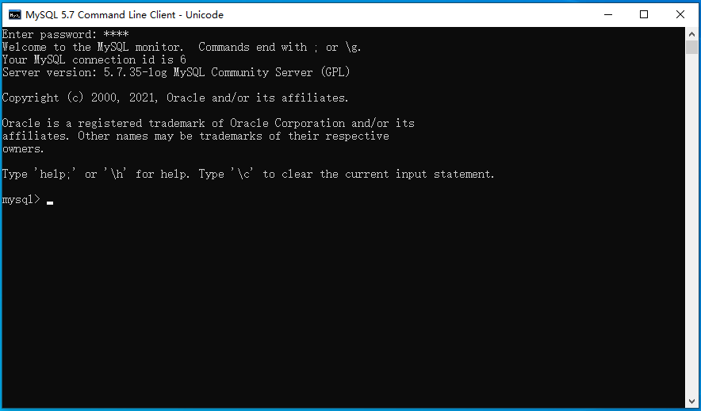

# MySQL安装以及配置
**mysql默认端口号:3306**

## 一、下载

>  **官网：**https://www.mysql.com/
>
> **下载地址：**https://dev.mysql.com/downloads/installer/
>
> 下载时注意MySQL版本，选择**体积大的离线安装包**下载。


> 单击Download后，提示注册账号，这里**我们不需要注册账号**，直接选择`No thanks, just start my download.`下载就可以了。


## 二、安装及配置

### 2.1、选择安装类型

> 选择`Server only`就可以，足够支撑我们的学习。


### 2.2、检查需要的依赖

> MySQL Server 5.7运行需要依赖MS C++ 2013的库，安装之前有必要安装MS C++ 2013，如果你的电脑之前安装过MS C++ 2013，那么会直接进入下一步。


### 2.3、安装


### 2.4、配置

#### 2.4.1、配置类型和网络

> Config Type选择Development Computer就可以，占用资源较少，完全能够支撑我们的学习。
>
> Port（端口）默认3306就可以，也可以写别的值，**这个值一定要牢记**，后续会反复用到。


#### 2.4.2、配置账户和角色

> 设置root用户的密码，由于我们在学习阶段，不需要设置过于复杂的密码


#### 2.4.3、配置Windows服务


#### 2.4.4、让配置生效

> 可能会花费一点时间，**一定要耐心等待**。


### 2.5、验证是否安装成功

> **开始-->MySQL-->MySQL 5.7 Commond Line Client - Unicode**


> 提示输入密码，输入密码后出现如下界面，说明MySQL安装并配置成功



## 三、卸载

### 3.1、运行MySQL安装工具

> **开始-->MySQL-->MySQL Installer - Community**


### 3.2、卸载及清理


> 这里直接勾选Product，会卸载安装的所有MySQL组件。


> 勾选Remove the data directory，卸载完成后会连同MySQL存放数据的文件夹一并删除。


> 选择Yes，uninstall MySQL Installer会同时卸载MySQL安装工具。


### 3.3、卸载之后的检查工作

> 按照上面的步骤卸载之后，应该能够完全卸载MySQL 5.7。为了保险起见，我们还是要检查一下，确保MySQL 5.7已经完全卸载，从而不会对下次安装产生影响。要确保满足下面三个条件：
>
> 1. 服务中没有MySQL57这个服务；
> 2. C盘下Program Files和Program Files(x86)两个文件夹下都没有MySQL文件夹；
> 3. C盘下ProgramData文件夹下没有MySQL文件夹。
>
> 如果MySQL57服务还在，**以管理员身份打开命令行窗口**，运行如下命令删除MySQL57服务：
>
> ```powershell
> > sc delete MySQL57
> ```

## 四、配置环境变量

> 目的：在任意文件夹都可以运行mysql命令。

### 4.1、配置

> 与安装JDK配置环境变量类型
>
> * 新建环境变量MYSQL_HOME，值C:\Program Files\MySQL\MySQL Server 5.7；
> * 在Path环境变量中新增%MYSQL_HOME%\bin。

### 4.2、验证

> 打开命令行窗口，运行如下命令：

```powershell
> mysql -u root -p
Enter password: ****
Welcome to the MySQL monitor.  Commands end with ; or \g.
Your MySQL connection id is 8
Server version: 5.7.35-log MySQL Community Server (GPL)

Copyright (c) 2000, 2021, Oracle and/or its affiliates.

Oracle is a registered trademark of Oracle Corporation and/or its
affiliates. Other names may be trademarks of their respective
owners.

Type 'help;' or '\h' for help. Type '\c' to clear the current input statement.

mysql>
```

> 这样我们就可以使用命令行在任意位置使用MySQL了。

## 五、目录结构

> 位置：C:\Program Files\MySQL\MySQL Server 5.7

| 文件夹名称 |        内容        |
| :--------: | :----------------: |
|    bin     |      命令文件      |
|    lib     |       库文件       |
|  include   |       头文件       |
|   share    | 字符集、语言等信息 |

## 六、MySQL配置文件

> 位置：C:\ProgramData\MySQL\MySQL Server 5.7\my.ini

|          参数          |           描述           |
| :--------------------: | :----------------------: |
| default-character-set  |     客户端默认字符集     |
|  character-set-server  |    服务器端默认字符集    |
|          port          | 客户端和服务器端的端口号 |
| default-storage-engine | MySQL默认存储引擎 INNODB |

### 6.1、MySQL字符编码设置

> 目前的MySQL对中文没有很好的支持，通过以下命令可以查看MySQL的字符集

```sql
mysql> show variables like 'character_set%';
+--------------------------+---------------------------------------------------------+
| Variable_name            | Value                                                   |
+--------------------------+---------------------------------------------------------+
| character_set_client     | utf8                                                    |
| character_set_connection | utf8                                                    |
| character_set_database   | latin1                                                  |
| character_set_filesystem | binary                                                  |
| character_set_results    | utf8                                                    |
| character_set_server     | latin1                                                  |
| character_set_system     | utf8                                                    |
| character_sets_dir       | C:\Program Files\MySQL\MySQL Server 5.7\share\charsets\ |
+--------------------------+---------------------------------------------------------+
8 rows in set, 1 warning (0.00 sec)
```

> 为了让 MySQL支持中文，**需要把字符集改成utf8mb4，为此我们需要修改my.ini文件**。

```properties
[mysql]
# 添加如下的内容
default-character-set=utf8mb4

[mysqld]
# 添加如下的内容
character-set-server=utf8mb4

```

> **注意：是在相应区域增加内容，而不是覆盖。**

### 6.2、重启MySQL服务

> 任务栏-->右键-->任务管理器-->服务-->MySQL57-->右键-->重新启动

### 6.3、查看当前字符编码

```sql
mysql> show variables like 'character_set%';

+--------------------------+---------------------------------------------------------+
| Variable_name            | Value                                                   |
+--------------------------+---------------------------------------------------------+
| character_set_client     | utf8mb4                                                 |
| character_set_connection | utf8mb4                                                 |
| character_set_database   | utf8mb4                                                 |
| character_set_filesystem | binary                                                  |
| character_set_results    | utf8mb4                                                 |
| character_set_server     | utf8mb4                                                 |
| character_set_system     | utf8                                                    |
| character_sets_dir       | C:\Program Files\MySQL\MySQL Server 5.7\share\charsets\ |
+--------------------------+---------------------------------------------------------+
8 rows in set, 1 warning (0.00 sec)

mysql>
```

> 出现上述内容证明修改MySQL字符编码成功。

