<LockArticle :highHeightPercent="0.05"/>

# 监控中心Zabbix进阶

## 一、Zabbix 基于SNMP监控

### 1、介绍

- SNMP：**简单**网络管理协议；（非常古老的协议）


- 三种通信方式：读（get, getnext）、写（set）、trap（陷阱）；


- 端口：


　　161/udp

　　162/udp

- SNMP协议：年代久远


　　v1: 1989

　　v2c 1993

　　v3: 1998

- 监控网络设备：交换机、路由器


- MIB：Management Information Base 信息管理基础


- OID：Object ID 对象ID 

### 2、Linux 启用 snmp

```shell
[root@node1 ~]# yum install net-snmp net-snmp-utils
```

配置文件：定义ACL

```shell
[root@node1 ~]# vim /etc/snmp/snmpd.conf
```

启动服务：

```shell
[root@node1 ~]# systemctl start snmpd  # 被监控端开启的服务
[root@node1 ~]# systemctl start snmptrapd    # 监控端开启的服务（如果允许被监控端启动主动监控时启用）
```

### 3、配置文件的介绍

开放数据：4步


1、定义认证符，将社区名称"public"映射为"安全名称"

2、将安全名称映射到一个组名

3、为我们创建一个视图，让我们的团队有权利

**掩码：**我列出一些注释，有很多，可以再网上查询

**.1.3.6.1.2.1.**

　　 1.1.0：系统描述信息，SysDesc

　　 1.3.0：监控时间， SysUptime

　　 1.5.0：主机名，SysName

　　 1.7.0：主机提供的服务，SysService

.1.3.6.1.2.2.

　　 2.1.0：网络接口数目

　　 2.2.1.2:网络接口的描述信息

　　 2.2.1.3:网络接口类型

　　 ……


4、授予对systemview视图的只读访问权

4、测试工具

```shell
[root@node1 ~]# snmpget -v 2c -c public HOST OID
[root@node1 ~]# snmpwalk -v 2c -c public HOST OID # 通过这个端口查询到的数据，全列出了
```


 

### 4、配置SNMP监控

#### 1、下载，修改配置文件

```shell
[root@node1 ~]# vim /etc/snmp/snmpd.conf
view    systemview    included   .1.3.6.1.2.1.1
view    systemview    included   .1.3.6.1.2.1.2      # 网络接口的相关数据
view    systemview    included   .1.3.6.1.4.1.2021   # 系统资源负载，memory, disk io, cpu load 
view    systemview    included   .1.3.6.1.2.1.25
```

#### 2、在 agent 上测试

```shell
[root@node1 ~]# snmpget -v 2c -c public 192.168.30.2 .1.3.6.1.2.1.1.3.0
[root@node1 ~]# snmpget -v 2c -c public 192.168.30.2 .1.3.6.1.2.1.1.5.0
```


 

#### 3、在监控页面，给node2加一个snmp的接口

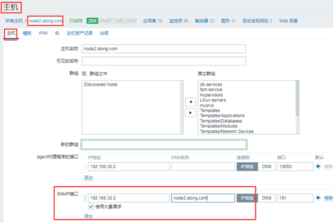

#### 4、在 node2 上加一个 Template OS Linux SNMPv2 模板


- 模板添加成功，生成一系列东西


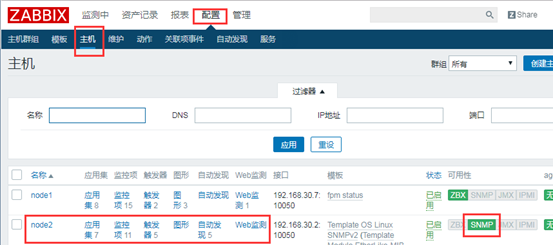

- 点开一个item 看一下


 

#### 5、生成一些最新数据的图形 graph了


 

### 5、设置入站出站packets 的SNMP监控

#### 1、监控网络设备：交换机、路由器的步骤：

-  把交换机、路由器的SNMP 把对应的OID的分支启用起来


- 了解这些分支下有哪些OID，他们分别表示什么意义


- 我们要监控的某一数据：如交换机的某一个接口流量、报文，发送、传入传出的报文数有多少个；传入传出的字节数有多少个，把OID取出来，保存


#### 2、定义入站出站的item监控项

```shell
interface traffic packets(in)
```

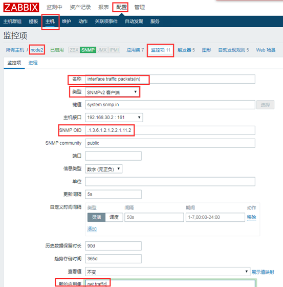

```shell
interface traffic packets(out)
```


 

## 二、Zabbix JMX接口


### 1、介绍

Java虚拟机(JVM)具有内置的插件，使您能够使用JMX监视和管理它。您还可以使用JMX监视工具化的应用程序。

#### 1、配置设置介绍

##### 1、zabbix-java-gateway主机设置

- 安装 zabbix-java-gateway程序包，启动服务；

```shell
[root@qfedu.com ~]# yum -y install zabbix-java-gateway
```

##### 2、zabbix-server端设置（需要重启服务）

```shell
JavaGateway=172.16.0.70                    #即 zabbix server IP地址
JavaGatewayPort=10052
StartJavaPollers=5  #监控项
```

##### 3、tomcat主机设置

- 监控tomcat：

```shell
[root@qfedu.com ~]# vim /etc/sysconfig/tomcat
CATALINA_OPTS="-Djava.rmi.server.hostname=TOMCAT_SERVER_IP -Djavax.management.builder.initial= -Dcom.sun.management.jmxremote=true -Dcom.sun.management.jmxremote.port=12345 -Dcom.sun.management.jmxremote.ssl=false -Dcom.sun.management.jmxremote.authenticate=false"   #启用JVM接口，默认没有启用

jmx[object_name,attribute_name]
object name      # 它代表MBean的对象名称
attribute name - # 一个MBean属性名称，可选的复合数据字段名称以点分隔
示例：
jmx["java.lang:type=Memory","HeapMemoryUsage.used"
```

4、 jmx的详细文档：https://docs.oracle.com/javase/1.5.0/docs/guide/management/agent.html

- **注意:**   如果是手动安装的tomcat  需要编辑  catalina.sh  文件 ，重启 tomcat

### 2、配置JVM接口监控

#### 1、安装配置 tomcat

##### 1、下载安装tomcat，主要是用JVM

```shell
[root@qfedu.com ~]# yum -y install java-1.8.0-openjdk-devel tomcat-admin-webapps tomcat-docs-webapp
```

##### 2、加CATALINA_OPTS= #启用JVM接口，默认没有启用

```shell
[root@qfedu.com ~]# vim /etc/sysconfig/tomcat
CATALINA_OPTS="-Djava.rmi.server.hostname=192.168.30.2 -Djavax.management.builder.initial= -Dcom.sun.management.jmxremote=true   -Dcom.sun.management.jmxremote.port=12345  -Dcom.sun.management.jmxremote.ssl=false  -Dcom.sun.management.jmxremote.authenticate=false"
```

3、开启服务

```shell
[root@qfedu.com ~]# systemctl start tomcat
```

#### 2、在 zabbix-server 端安装配置 java-gateway

##### 1、安装配置 java-gateway

```shell
[root@qfedu.com ~]# yum -y install zabbix-java-gateway
[root@qfedu.com ~]# vim /etc/zabbix/zabbix_java_gateway.conf   # 安装完后，会生成一个java_gateway 的配置文件
LISTEN_IP="0.0.0.0"                             #监听服务器地址
LISTEN_PORT=10052                               #监听zabbix_java进程的端口，默认是10052
PID_FILE="/tmp/zabbix_java.pid"                 #zabbix_java的pid路径
START_POLLERS=5                                 #zabbix_java的进程数
TIMEOUT=10                                      #zabbix_java的超时时间
[root@qfedu.com ~]# systemctl start zabbix-java-gateway.service # 可不用修改，直接开启服务 
```

##### 2、修改 server 配置开启 java-gateway 的配置

```shell
[root@qfedu.com ~]# vim /etc/zabbix/zabbix_server.conf
JavaGateway=192.168.30.107  
JavaGatewayPort=10052
StartJavaPollers=5    # 打开5个监控项
```

##### 3、  重启zabbix-server 服务

```shell
[root@qfedu.com ~]# systemctl restart zabbix-server 
```

#### 3、在node2 主机上添加JMX接口，实验模板

##### 1、添加JMX接口


##### 2、在 node2 上连接 tomcat JMX 模板


##### 3、随便查看一个监控项 item


 

#### 4、自己定义一个堆内存使用的监控项，基于JVM接口（没必要，使用模板就好）

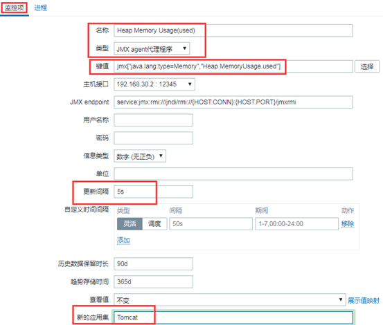

 

## 三、Zabbix 分布式监控


### 1、介绍

分布式监控概述：proxy and node 

#### 1、Zabbix 的三种架构

- Server-agent


- Server-Node-agent


- Server-Proxy-agent


#### 2、配置介绍

Zabbix Proxy的配置：

- server-node-agent


- server-proxy-agent


##### 1、配置proxy主机

###### 1、安装程序包

```shell
zabbix-proxy-mysql zabbix-get zabbix-agent zabbix-sender
```

###### 2、准备数据库

　　创建、授权用户、导入schema.sql；

###### 3、修改配置文件

```shell
Server= zabbix server  # 主机地址；
Hostname=              # 当前代理服务器的名称；在server添加proxy时，必须使用此处指定的名称；需要事先确保server能解析此名称；
DBHost=
DBName=
DBUser=
DBPassword=
ConfigFrequency=10    # proxy被动模式下，server多少秒同步配置文件至proxy。该参数仅用于被动模式下的代理。范围是1-3600*24*7
DataSenderFrequency=1 #代理将每N秒将收集的数据发送到服务器。 对于被动模式下的代理，该参数将被忽略。范围是1-3600
```

###### 4、在 server 端添加此 Porxy

​    Administration --> Proxies

###### 5、在Server端配置通过此Proxy监控的主机；

注意：zabbix agent 端要允许 zabbix proxy 主机执行数据采集操作：

### 2、实现分布式 zabbix proxy 监控

#### 1、实验前准备

- ntpdate 172.168.30.1 同步时间


- 关闭防火墙，selinux


- 设置主机名 hostnamectl set-hostname zbproxy.qfedu.com


- vim /etc/hosts 每个机器都设置hosts，以解析主机名；DNS也行


#### 2、环境配置（4台主机）

| 机器名称      | IP配置         | 服务角色  |
| ------------- | -------------- | --------- |
| zabbix-server | 192.168.30.107 | 监控      |
| agent-node1   | 192.168.30.7   | 被监控端  |
| agent-node2   | 192.168.30.2   | 被监控端  |
| node3         | 192.168.30.3   | 代理proxy |

zabbix-server 直接监控一台主机 node1

zabbix-server 通过代理 node3 监控 node2

#### 3、在 node3 上配置 mysql

##### 1、创建配置 mysql

###### 1、创建 mariadb.repo

```shell
[root@node3 ~]# vim /etc/yum.repos.d/mariadb.repo
写入以下内容：
[mariadb]
name = MariaDB 
baseurl = https://mirrors.ustc.edu.cn/mariadb/yum/10.4/centos7-amd64 
gpgkey=https://mirrors.ustc.edu.cn/mariadb/yum/RPM-GPG-KEY-MariaDB 
gpgcheck=1
```

###### 2、yum 安装最新版本 mariadb

```shell
[root@node3 ~]# yum install -y MariaDB-server MariaDB-clien
```

- 修改配置文件


```shell
[root@node3 ~]# vim /etc/my.cnf.d/server.cnf
    [mysqld]
    skip_name_resolve = ON          # 跳过主机名解析
    innodb_file_per_table = ON      # 开启独立表空间
    innodb_buffer_pool_size = 256M  # 缓存池大小
    max_connections = 2000          # 最大连接数
    log-bin = master-log            # 开启二进制日志
```

###### 3、重启我们的数据库服务

```shell
[root@node3 ~]#  systemctl restart mariadb
[root@node3 ~]#  mysql_secure_installation  # 初始化mariadb
```

###### 4、创建数据库 和 授权用户

```sql
MariaDB [(none)]> create database zbxproxydb character set 'utf8';
MariaDB [(none)]> grant all on zbxproxydb.* to 'zbxproxyuser'@'192.168.30.%' identified by 'zbxproxypass';
MariaDB [(none)]> flush privileges;
```

#### 3、在node3 上下载zabbix 相关的包，主要是代理proxy的包

```shell
[root@node3 ~]# yum -y install zabbix-proxy-mysql zabbix-get zabbix-agent zabbix-sender
```

##### 1、初始化数据库

zabbix-proxy-mysql 包里带有，导入数据的文件


```shell
[root@node3 ~]# cp /usr/share/doc/zabbix-proxy-mysql-3.4.4/schema.sql.gz ./ 复制
[root@node3 ~]# gzip -d schema.sql.gz 解包
[root@node3 ~]# mysql -root -p zbxproxydb < schema.sql 导入数据
```

##### 2、查看数据已经生成

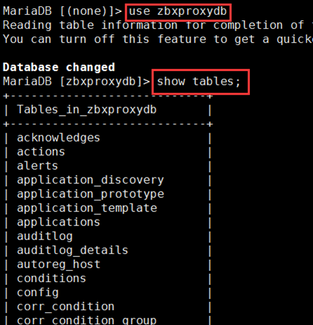

 

#### 4、配置 proxy 端

```shell
[root@node3 ~]# vim /etc/zabbix/zabbix_proxy.conf
```


```shell
Server=192.168.30.107        # server 的IP
ServerPort=10051             # server 的端口

Hostname=zbxproxy.qfedu.com  # 主机名
ListenPort=10051             # proxy自己的监听端口
EnableRemoteCommands=1       # 允许远程命令
LogRemoteCommands=1          # 记录远程命令的日志

# 数据的配置
DBHost=192.168.30.3
DBName=zbxproxydb  
DBUser=zbxproxyuser
DBPassword=zbxproxypass

ConfigFrequency=30      # 多长时间，去服务端拖一次有自己监控的操作配置；为了实验更快的生效，这里设置30秒，默认3600s
DataSenderFrequency=1   # 每一秒向server 端发一次数据，发送频度
```

2、开启服务 

```shell
[root@node3 ~]# systemctl start zabbix-proxy
```

#### 5、配置node2端允许proxy代理监控

```shell
[root@node3 ~]# vim /etc/zabbix/zabbix_agentd.conf
Server=192.168.30.107,192.168.30.3
ServerActive=192.168.30.107,192.168.30.3
[root@node3 ~]# systemctl restart zabbix-agent # 启动服务 
```

#### 6、把代理加入监控 server 创建配置agent 代理

##### 1、创建agent 代理


##### 2、配置


 

#### 7、创建node2 主机并采用代理监控


- 设置代理成功


 

#### 8、创建item监控项

##### 1、随便创一个监控项 CPU Switches


##### 2、进程里设置每秒更改


##### 3、成功graph 图形生成


 

## 四、


### 1、官方的 share 分享网站

https://share.zabbix.com/zabbix-tools-and-utilities

- 例如：我们要实现监控Nginx ，我们查找一个模板


- 就以这个模板为例


​                                          

### 2、在node1 上使用此模板

#### 1、安装配置 nginx

```shell
[root@node1 ~]# yum -y install nginx
[root@node1 ~]# vim /etc/nginx/nginx.conf  # 按照网页的操作指示
location /stub_status {
        stub_status on;
        access_log off;
    #    allow 127.0.0.1;   #为了操作方便，我取消的访问控制
    #    deny all;
}
```

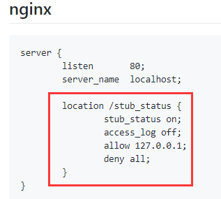

2、启动服务

```shell
[root@node1 ~]# systemctl restart nginx
```

#### 2、下载模板所依赖的脚本


```shell
[root@node1 ~]# mkdir -p /srv/zabbix/libexec/
[root@node1 ~]# cd /srv/zabbix/libexec/
[root@node1 ~]# wget https://raw.githubusercontent.com/oscm/zabbix/master/nginx/nginx.sh # 从网页上获取脚本
[root@node1 ~]# chmod +x nginx.sh # 加执行权限
```

#### 3、配置 agent 的用户参数 UserParameter

```shell
[root@node1 ~]# cd /etc/zabbix/zabbix_agentd.d/
[root@node1 ~]# wget https://raw.githubusercontent.com/oscm/zabbix/master/nginx/userparameter_nginx.conf # 很短自己写也行
```

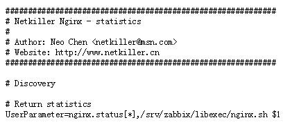

#### 4、在 windows 上下载模板并导入server 的模板中

```shell
[root@node1 ~]# wget https://raw.githubusercontent.com/oscm/zabbix/master/nginx/zbx_export_templates.xml
```

可以现在linux上下载，再sz 导出到 windows 上


##### 1、导入下载的模板


##### 2、主机 node1 链接这个模板


##### 3、模板生效


 

## 五、Zabbix-server 监控自己，数据库，nginx

### 1、下载安装配置agent

```shell
[root@qfedu.com ~]# vim /etc/zabbix/zabbix_agentd.conf
EnableRemoteCommands=1    允许远程命令
LogRemoteCommands=1    记录远程命令
Server=127.0.0.1   #建议真实ip地址
ServerActive=127.0.0.1
Hostname=server.qfedu.com
```

### 2、自动生成 Zabbix server 的主机


### 3、在主机中添加模板


### 4、启用Zabbix server


### 5、监控到数据

#### zabbix_agent 客户端操作

#### 1、mysql 创建 zabbix 账号连接本地mysql

```shell
mysql> GRANT ALL ON *.* TO 'zabbix'@'localhost' IDENTIFIED BY '123456';
mysql> FLUSH PRIVILEGES;
```

2、在 zabbix_agentd 创建 .my.cnf （用户名密码登录配置文件）

```shell
[root@qfedu.com ~]# cat  /etc/zabbix/zabbix_agentd.d/userparameter_mysql.conf  # 获取登录配置文件创建路径
[root@qfedu.com ~]# mkdir -p /var/lib/zabbix
# 在/var/lib/zabbix下创建(隐藏).my.cnf
[root@qfedu.com ~]# cat ./.my.cnf
 [client]
 user=zabbix
 password=123456
```

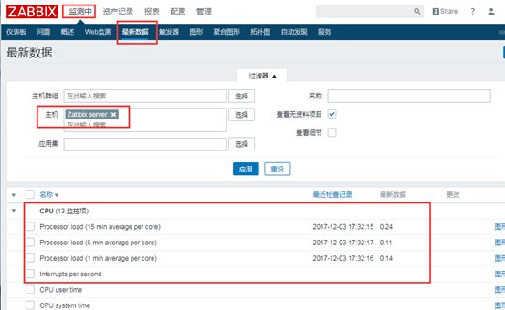

 

## 六、


### 1、申请企业微信

#### 1、填写注册信息


### 2、配置微信企业号

#### 1、创建告警组，然后把接受消息人加进来


#### 2、记录账号名称，等下填写接收人信息需要用到

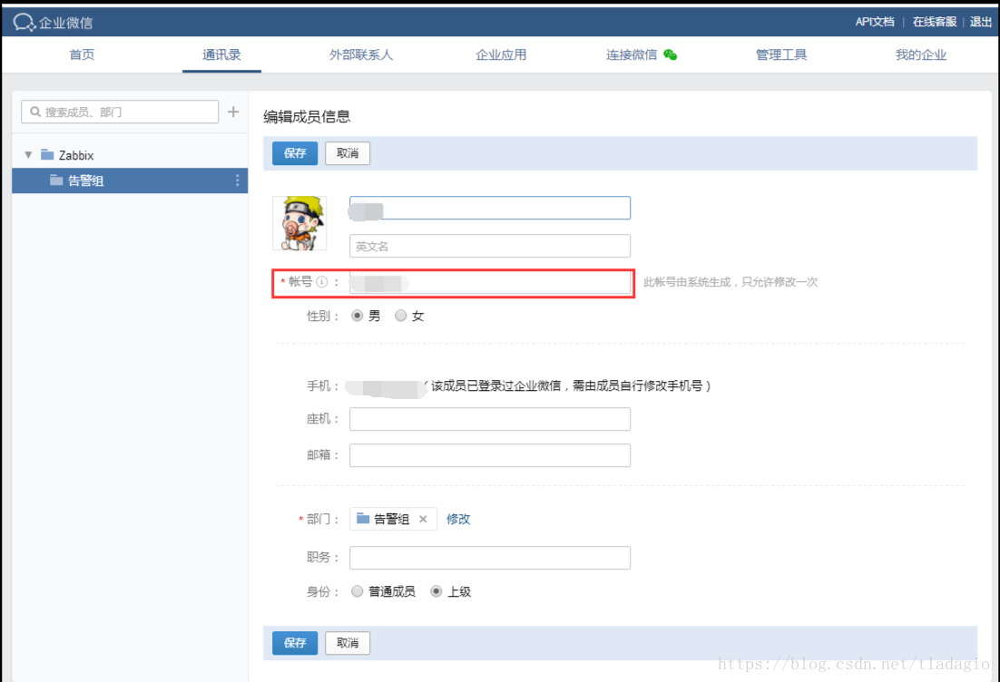

#### 3、点击我的企业，查看企业信息，要记录企业CorpID

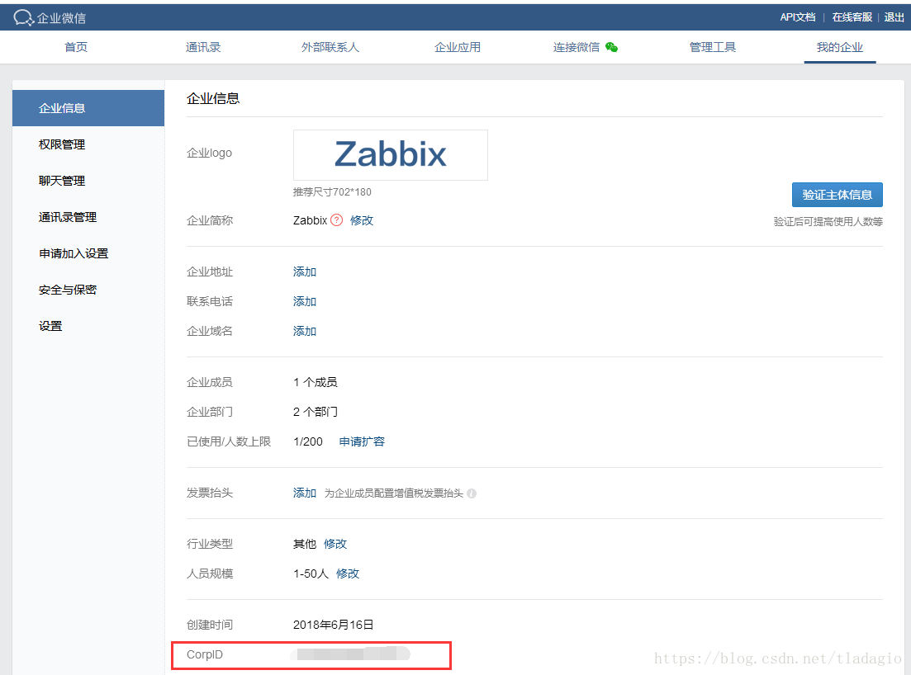

#### 4、点击企业应用，创建应用


#### 5、填写信息和通知用户组


#### 6、创建完，记录Agentld和Secret


### 3、配置zabbix服务器

#### 1、首先确认已经记录的信息

告警组用户的账号，企业CorpID和创建应用的Secret、Agentld

#### 2、修改zabbix.conf

```shell
[root@lqfedu.com ~]# grep alertscripts /etc/zabbix/zabbix_server.conf 
# AlertScriptsPath=${datadir}/zabbix/alertscripts
AlertScriptsPath=/usr/lib/zabbix/alertscripts
我们设置zabbix默认脚本路径，这样在web端就可以获取到脚本
```

#### 3、下载并设置脚本

```shell
[root@lqfedu.com ~]# cd /usr/lib/zabbix/alertscripts/
[root@lqfedu.com alertscripts]# wget https://raw.githubusercontent.com/OneOaaS/weixin-alert/master/weixin_linux_amd64
[root@lqfedu.com alertscripts]# mv weixin_linux_amd64 wechat
[root@lqfedu.com alertscripts]# chmod 755 wechat 
[root@lqfedu.com alertscripts]# chown zabbix:zabbix wechat 
```

#### 4、执行脚本进行测试

```shell
[root@lqfedu.com alertscripts]# ./wechat --corpid=xxx --corpsecret=xxx --msg="您好，告警测试" --user=用户账号 --agentid=xxx
{"errcode":0,"errmsg":"ok","invaliduser":""}
```


提示：

```shell
-corpid= 我们企业里面的id
--corpsecret= 这里就是我们Secret里面的id
-msg= 内容
-user=我们邀请用户的账号
```

因为脚本是编译过的，无法进行编辑，我们可以使用 ./wechat -h or --help 查看

### 4、zabbix web页面配置告警信息

#### 1、管理-报警媒介类型-创建告警媒介


#### 2、填写报警媒介信息


```shell
--corpid=我们企业里面的id
--corpsecret=这里就是我们Secret里面的id
--agentid= Agentld ID
--user={ALERT.SENDTO}
--msg={ALERT.MESSAGE}
```

#### 3、设置告警用户


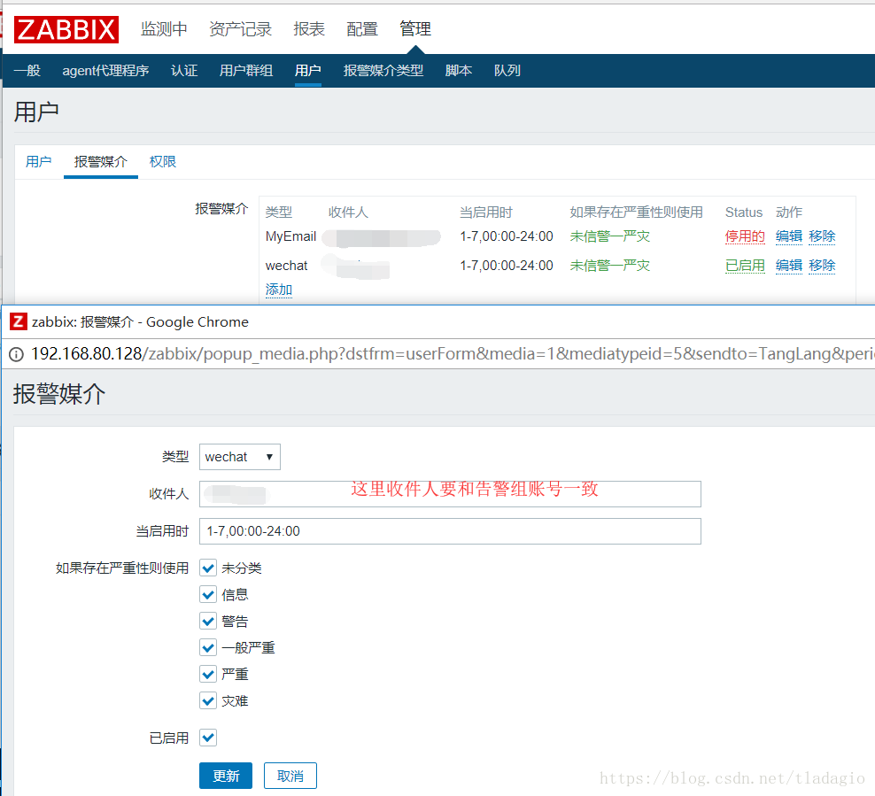

#### 4、设置告警动作


##### 1、动作信息


##### 2、填写告警时候操作信息


```shell
故障告警:{TRIGGER.STATUS}: {TRIGGER.NAME} 
告警主机:{HOST.NAME} 
主机地址:{HOST.IP} 
告警时间:{EVENT.DATE} {EVENT.TIME} 
告警等级:{TRIGGER.SEVERITY} 
告警信息:{TRIGGER.NAME} 
问题详情:{ITEM.NAME}:{ITEM.VALUE} 
事件代码:{EVENT.ID} 
```

##### 3、填写恢复操作信息

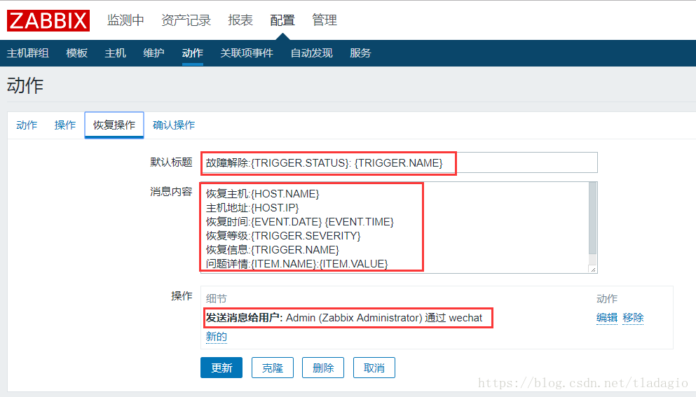

```shell
故障解除:{TRIGGER.STATUS}: {TRIGGER.NAME} 
恢复主机:{HOST.NAME} 
主机地址:{HOST.IP} 
恢复时间:{EVENT.DATE} {EVENT.TIME} 
恢复等级:{TRIGGER.SEVERITY} 
恢复信息:{TRIGGER.NAME} 
问题详情:{ITEM.NAME}:{ITEM.VALUE} 
事件代码:{EVENT.ID}
```

### 5、手动触发告警，测试微信接收信息

- 在agent端使用yum安装一下redis：


```shell
[root@node1 ~]# yum install redis -y
```

- 修改配置文件


```shell
[root@node1 ~]# vim /etc/redis.conf 
bind 0.0.0.0        #不做任何认证操作
```

- 修改完成以后启动服务并检查端口：


```shell
[root@node1 ~]# systemctl start redis
[root@node1 ~]# ss -nutlp | grep redis
tcp    LISTEN     0      128       *:6379                  *:*                   users:(("redis-server",pid=5250,fd=4))
```

#### 1、定义监控项

- 进入 配置 ---> 主机 ---> node1 ---> 监控项（items）---> 创建监控项


- 填写完毕以后点击下方的添加。


- 该监控项已成功添加。查看一下他的值：检测中 ---> 最新数据


#### 2、定义触发器

- 进入 配置 ---> 主机 ---> node1 ---> 触发器（trigger）---> 创建触发器


- 填写完毕以后点击下方的添加


- 该触发器已成功添加。查看：监测中 ---> 最新数据
                        

- 手动关闭 redis 服务来检测：

```shell
[root@node1 ~]# systemctl stop redis.service
```

- 进入监测中 ---> 问题

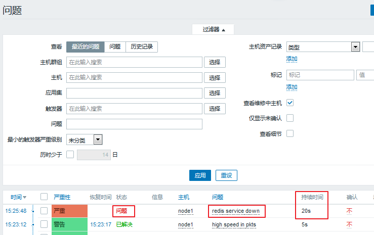

- 已经显示的是问题了。并且有持续的时间，当服务被打开，会转为已解决状态：

```shell
[root@node1 ~]# systemctl start redis.service 
```


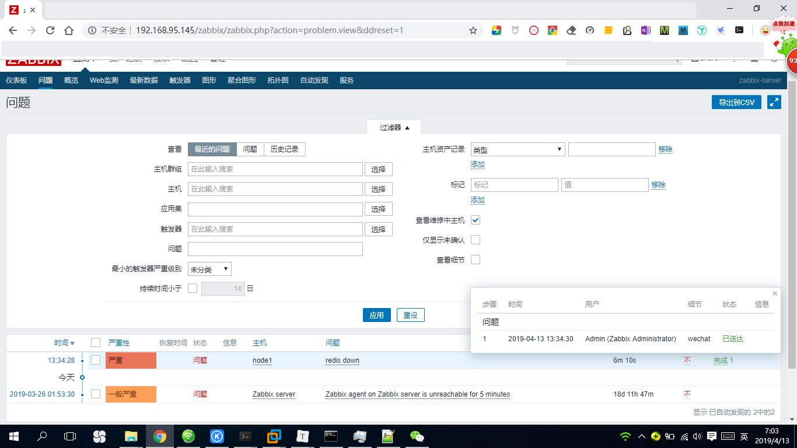

### 6、微信客户端检测

## 七、Zabbix 调优

### 1、调优

#### 1、Database：

- 历史数据不要保存太长时长；


- 尽量让数据缓存在数据库服务器的内存中；

2、触发器表达式：

- 减少使用聚合函数min(), max(), avg()；尽量使用last()，nodata()，因为聚合函数，要运算

- 数据收集：polling较慢(减少使用SNMP/agentless/agent）；**尽量使用trapping（agent(active）主动监控）；**


- 数据类型：文本型数据处理速度较慢；**尽量少**收集类型为**文本** text或string类型的数据；**多使用**类型为numeric **数值型数据** 的；


### 2、zabbix服务器的进程

#### 1、服务器组件的数量；

- alerter, discoverer, escalator, http poller, hourekeeper, icmp pinger, ipmi polller, poller, trapper, configration syncer, ...


- StartPollers=60


- StartPingers=10


　　...

- StartDBSyncer=5


　　...

#### 2、设定合理的缓存大小

- CacheSize=8M


- HistoryCacheSize=16M


- HistoryIndexCacheSize=4M


- TrendCacheSize=4M


- ValueCacheSize=4M


#### 3、数据库优化

　　分表：

　　　　history_*

　　　　trends*

　　　　events*

### 3、其它解决方案

- grafana：展示


- collectd：收集


- influxdb：存储


### 4、grafana+collectd+influxdb 

#### 5、prometheus：

- exporter：收集


- alertmanager:


- grafana：展示

## 八、Zabbix监控实战-Tomcat监控

### 1、方法一：开发java监控页面

```shell
[root@qfedu.com tomcat8_1]# cat /application/tomcat/webapps/memtest/meminfo.jsp 
<%
Runtime rtm = Runtime.getRuntime();
long mm = rtm.maxMemory()/1024/1024;
long tm = rtm.totalMemory()/1024/1024;
long fm = rtm.freeMemory()/1024/1024;

out.println("JVM memory detail info :<br>");
out.println("Max memory:"+mm+"MB"+"<br>");
out.println("Total memory:"+tm+"MB"+"<br>");
out.println("Free memory:"+fm+"MB"+"<br>");
out.println("Available memory can be used is :"+(mm+fm-tm)+"MB"+"<br>");
%>
```

### 2、方法二：使用jps命令进行监控

```shell
[root@qfedu.com ~]# jps -lvm

31906 org.apache.catalina.startup.Bootstrap start -Djava.util.logging.config.file=/application/tomcat8_1/conf/logging.properties -Djava.util.logging.manager=org.apache.juli.ClassLoaderLogManager -Djava.endorsed.dirs=/application/tomcat8_1/endorsed -Dcatalina.base=/application/tomcat8_1 -Dcatalina.home=/application/tomcat8_1 -Djava.io.tmpdir=/application/tomcat8_1/temp

31812 org.apache.catalina.startup.Bootstrap start -Djava.util.logging.config.file=/application/tomcat/conf/logging.properties -Djava.util.logging.manager=org.apache.juli.ClassLoaderLogManager -Djava.endorsed.dirs=/application/tomcat/endorsed -Dcatalina.base=/application/tomcat -Dcatalina.home=/application/tomcat -Djava.io.tmpdir=/application/tomcat/temp

31932 org.apache.catalina.startup.Bootstrap start -Djava.util.logging.config.file=/application/tomcat8_2/conf/logging.properties -Djava.util.logging.manager=org.apache.juli.ClassLoaderLogManager -Djava.endorsed.dirs=/application/tomcat8_2/endorsed -Dcatalina.base=/application/tomcat8_2 -Dcatalina.home=/application/tomcat8_2 -Djava.io.tmpdir=/application/tomcat8_2/temp

32079 sun.tools.jps.Jps -lvm -Denv.class.path=.:/application/jdk/lib:/application/jdk/jre/lib:/application/jdk/lib/tools.jar -Dapplication.home=/application/jdk1.8.0_60 -Xms8m
```

### 3、Tomcat 远程监控功能

#### 1、修改配置文件，开启远程监控

```shell
[root@qfedu.com ~]# vim /application/tomcat8_1/bin/catalina.sh +97
CATALINA_OPTS="$CATALINA_OPTS
-Dcom.sun.management.jmxremote 
-Dcom.sun.management.jmxremote.port=12345  
-Dcom.sun.management.jmxremote.authenticate=false 
-Dcom.sun.management.jmxremote.ssl=false 
-Djava.rmi.server.hostname=10.0.0.17"
```

#### 2、重启服务，检查12345端口是否开启

```shell
[root@qfedu.com ~]# /application/tomcat8_1/bin/shutdown.sh 
[root@qfedu.com ~]# /application/tomcat8_1/bin/startup.sh 
[root@qfedu.com ~]# netstat -tunlp|grep 12345
```

#### 3、 检查端口

```shell
[root@qfedu.com ~]# netstat -tunlp|grep 12345
tcp6       0      0 :::12345           :::*          LISTEN      33158/java  
```

4、在windows上监控tomcat

**注意：windwos需要安装jdk环境！**

查考：http://www.oracle.com/technetwork/java/javase/downloads/index.html

##### 1、软件路径

```cmd
C:\Program Files\Java\jdk1.8.0_31\bin
jconsole.exe   jvisualvm.exe
```

##### 2、jconsole.exe 使用说明


​         连接成功即可进行监控，连接的时候注意端口信息。

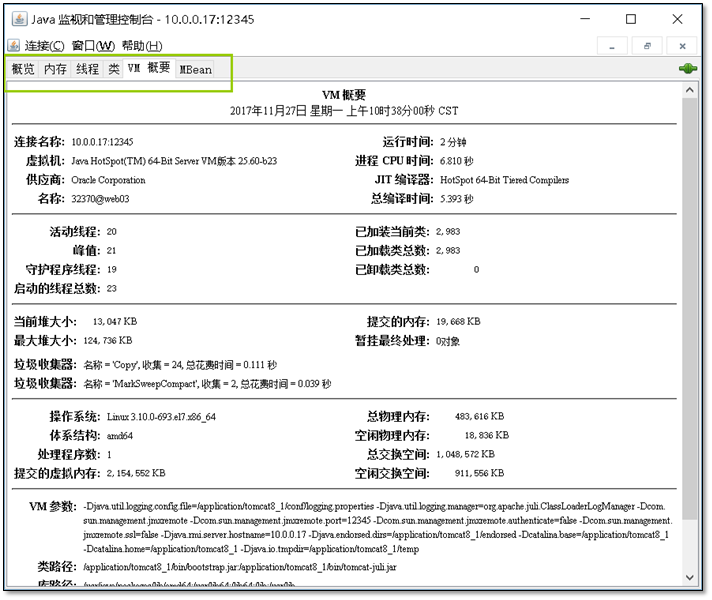

###### 3、jvisualvm.exe 使用说明


​         **输入ip地址**


​         **主机添加完成，添加JMX监控**


​            **注意添加的时候输入端口信息**

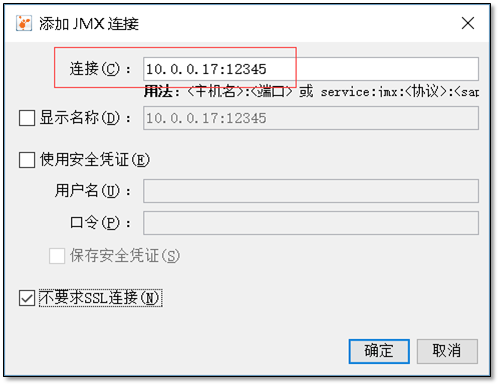

​         添加完成后就能够多tomcat程序进行监控。

### 4、zabbix 监控 tomcat 程序

##### 1、zabbix 服务端安装配置 java监控服务

```shell
[root@qfedu.com ~]# yum install zabbix-java-gateway -y
```

##### 2、查看配置文件

```shell
配置文件路径：/etc/zabbix/zabbix_java_gateway.conf
[root@qfedu.com ~]# sed -i -e '220a JavaGateway=127.0.0.1' -e '236a StartJavaPollers=5'  /etc/zabbix/zabbix_server.conf
```

##### 3、启动zabbix-java-gateway服务，与zabbix服务

```shell
[root@qfedu.com ~]# systemctl start zabbix-java-gateway.service
[root@qfedu.com ~]# systemctl restart zabbix-server.service
```

##### 4、检查java端口是否开启

```shell
[root@qfedu.com ~]# netstat -lntup |grep java
tcp6       0      0 :::10052   :::*    LISTEN      72971/java  
```

##### 5、检查java进程是否存在

```shell
[root@qfedu.com ~]# ps -ef |grep [j]ava
zabbix    72971      1  0 11:29 ?        00:00:00 java -server -Dlogback.configurationFile=/etc/zabbix/zabbix_java_gateway_logback.xml -classpath lib:lib/android-json-4.3_r3.1.jar:lib/logback-classic-0.9.27.jar:lib/logback-core-0.9.27.jar:lib/slf4j-api-1.6.1.jar:bin/zabbix-java-gateway-3.0.13.jar -Dzabbix.pidFile=/var/run/zabbix/zabbix_java.pid -Dzabbix.timeout=3 -Dsun.rmi.transport.tcp.responseTimeout=3000 com.zabbix.gateway.JavaGateway
zabbix    73255  73226  0 11:35 ?        00:00:00 /usr/sbin/zabbix_server: java poller #1 [got 0 values in 0.000002 sec, idle 5 sec]
zabbix    73256  73226  0 11:35 ?        00:00:00 /usr/sbin/zabbix_server: java poller #2 [got 0 values in 0.000002 sec, idle 5 sec]
zabbix    73257  73226  0 11:35 ?        00:00:00 /usr/sbin/zabbix_server: java poller #3 [got 0 values in 0.000002 sec, idle 5 sec]
zabbix    73258  73226  0 11:35 ?        00:00:00 /usr/sbin/zabbix_server: java poller #4 [got 0 values in 0.000002 sec, idle 5 sec]
zabbix    73259  73226  0 11:35 ?        00:00:00 /usr/sbin/zabbix_server: java poller #5 [got 0 values in 0.000004 sec, idle 5 sec]
```

##### 6、web界面添加

######  1、添加主机

 

######  2、主机管理模板，注意是JMX模板

 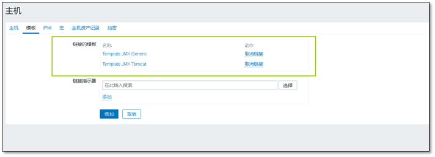

######   3、监控完成

 

### 5、排除 tomcat 故障步骤

###### 1、查看 catalina.out

###### 2、使用 sh show-busy-java-threads.sh 脚本进行检测

```shell
#!/bin/bash
# @Function
# Find out the highest cpu consumed threads of java, and print the stack of these threads.
#
# @Usage
#   $ ./show-busy-java-threads.sh
#
# @author Jerry Lee

readonly PROG=`basename $0`
readonly -a COMMAND_LINE=("$0" "$@")

usage() {
    cat <<EOF
Usage: ${PROG} [OPTION]...
Find out the highest cpu consumed threads of java, and print the stack of these threads.
Example: ${PROG} -c 10

Options:
    -p, --pid       find out the highest cpu consumed threads from the specifed java process,
                    default from all java process.
    -c, --count     set the thread count to show, default is 5
    -h, --help      display this help and exit
EOF
    exit $1
}

readonly ARGS=`getopt -n "$PROG" -a -o c:p:h -l count:,pid:,help -- "$@"`
[ $? -ne 0 ] && usage 1
eval set -- "${ARGS}"

while true; do
    case "$1" in
    -c|--count)
        count="$2"
        shift 2
        ;;
    -p|--pid)
        pid="$2"
        shift 2
        ;;
    -h|--help)
        usage
        ;;
    --)
        shift
        break
        ;;
    esac
done
count=${count:-5}

redEcho() {
    [ -c /dev/stdout ] && {
        # if stdout is console, turn on color output.
        echo -ne "\033[1;31m"
        echo -n "$@"
        echo -e "\033[0m"
    } || echo "$@"
}

yellowEcho() {
    [ -c /dev/stdout ] && {
        # if stdout is console, turn on color output.
        echo -ne "\033[1;33m"
        echo -n "$@"
        echo -e "\033[0m"
    } || echo "$@"
}

blueEcho() {
    [ -c /dev/stdout ] && {
        # if stdout is console, turn on color output.
        echo -ne "\033[1;36m"
        echo -n "$@"
        echo -e "\033[0m"
    } || echo "$@"
}

# Check the existence of jstack command!
if ! which jstack &> /dev/null; then
    [ -z "$JAVA_HOME" ] && {
        redEcho "Error: jstack not found on PATH!"
        exit 1
    }
    ! [ -f "$JAVA_HOME/bin/jstack" ] && {
        redEcho "Error: jstack not found on PATH and $JAVA_HOME/bin/jstack file does NOT exists!"
        exit 1
    }
    ! [ -x "$JAVA_HOME/bin/jstack" ] && {
        redEcho "Error: jstack not found on PATH and $JAVA_HOME/bin/jstack is NOT executalbe!"
        exit 1
    }
    export PATH="$JAVA_HOME/bin:$PATH"
fi

readonly uuid=`date +%s`_${RANDOM}_$$

cleanupWhenExit() {
    rm /tmp/${uuid}_* &> /dev/null
}
trap "cleanupWhenExit" EXIT

printStackOfThread() {
    local line
    local count=1
    while IFS=" " read -a line ; do
        local pid=${line[0]}
        local threadId=${line[1]}
        local threadId0x=`printf %x ${threadId}`
        local user=${line[2]}
        local pcpu=${line[4]}

        local jstackFile=/tmp/${uuid}_${pid}

        [ ! -f "${jstackFile}" ] && {
            {
                if [ "${user}" == "${USER}" ]; then
                    jstack ${pid} > ${jstackFile}
                else
                    if [ $UID == 0 ]; then
                        sudo -u ${user} jstack ${pid} > ${jstackFile}
                    else
                        redEcho "[$((count++))] Fail to jstack Busy(${pcpu}%) thread(${threadId}/0x${threadId0x}) stack of java process(${pid}) under user(${user})."
                        redEcho "User of java process($user) is not current user($USER), need sudo to run again:"
                        yellowEcho "    sudo ${COMMAND_LINE[@]}"
                        echo
                        continue
                    fi
                fi
            } || {
                redEcho "[$((count++))] Fail to jstack Busy(${pcpu}%) thread(${threadId}/0x${threadId0x}) stack of java process(${pid}) under user(${user})."
                echo
                rm ${jstackFile}
                continue
            }
        }
        blueEcho "[$((count++))] Busy(${pcpu}%) thread(${threadId}/0x${threadId0x}) stack of java process(${pid}) under user(${user}):"
        sed "/nid=0x${threadId0x} /,/^$/p" -n ${jstackFile}
    done
}


ps -Leo pid,lwp,user,comm,pcpu --no-headers | {
    [ -z "${pid}" ] &&
    awk '$4=="java"{print $0}' ||
    awk -v "pid=${pid}" '$1==pid,$4=="java"{print $0}'
} | sort -k5 -r -n | head --lines "${count}" | printStackOfThread
```

## 九、zabbix 监控 php-fpm

zabbix监控php-fpm主要是通过nginx配置php-fpm的状态输出页面，在正则取值.要nginx能输出php-fpm的状态首先要先修改php-fpm的配置，没有开启nginx是没有法输出php-fpm status。

### 1、修改文件php-fpm

vim /application/php-5.5.32/etc/php-fpm.conf文件

[//]: # (![img]&#40;/assets/1469203-20181021111145530-1093315619.png&#41;)

### 2、修改nginx配置文件

vim /application/nginx/conf/extra/www.conf，在server 区块下添加一行内容

[//]: # (![img]&#40;/assets/1469203-20181021111723825-434667199.png&#41;)

**重启nginx**

### 3、curl 127.0.0.1/php_status 我们可以看到php-fpm 的状态信息

[//]: # (![img]&#40;/assets/1469203-20181021111937582-1246959624.png&#41;)

| **字段**                 | **含义**                                                     |
| ------------------------ | ------------------------------------------------------------ |
| **pool**                 | **php-fpm pool的名称，大多数情况下为www**                    |
| **process manager**      | **进程管理方式，现今大多都为dynamic，不要使用static**        |
| **start time**           | **php-fpm上次启动的时间**                                    |
| **start since**          | **php-fpm已运行了多少秒**                                    |
| **accepted conn**        | **pool接收到的请求数**                                       |
| **listen queue**         | **处于等待状态中的连接数，如果不为0，需要增加php-fpm进程数** |
| **max listen queue**     | **php-fpm启动到现在处于等待连接的最大数量**                  |
| **listen queue len**     | **处于等待连接队列的套接字大小**                             |
| **idle processes**       | **处于空闲状态的进程数**                                     |
| **active processes**     | **处于活动状态的进程数**                                     |
| **total processess**     | **进程总数**                                                 |
| **max active process**   | **从php-fpm启动到现在最多有几个进程处于活动状态**            |
| **max children reached** | **当pm试图启动更多的children进程时，却达到了进程数的限制，达到一次记录一次，如果不为0，需要增加php-fpm pool进程的最大数** |
| **slow requests**        | **当启用了php-fpm slow-log功能时，如果出现php-fpm慢请求这个计数器会增加，一般不当的Mysql查询会触发这个值** |

 ### 4、编写监控脚本和监控文件

```
vim /server/scripts/php_fpm-status.sh

#!/bin/sh
#php-fpm status
case $1 in
ping) #检测php-fpm进程是否存在
/sbin/pidof php-fpm | wc -l
;;
start_since) #提取status中的start since数值
/usr/bin/curl 127.0.0.1/php_status 2>/dev/null | awk 'NR==4{print $3}'
;;
conn) #提取status中的accepted conn数值
/usr/bin/curl 127.0.0.1/php_status 2>/dev/null | awk 'NR==5{print $3}'
;;
listen_queue) #提取status中的listen queue数值
/usr/bin/curl 127.0.0.1/php_status 2>/dev/null | awk 'NR==6{print $3}'
;;
max_listen_queue) #提取status中的max listen queue数值
/usr/bin/curl 127.0.0.1/php_status 2>/dev/null | awk 'NR==7{print $4}'
;;
listen_queue_len) #提取status中的listen queue len
/usr/bin/curl 127.0.0.1/php_status 2>/dev/null | awk 'NR==8{print $4}'
;;
idle_processes) #提取status中的idle processes数值
/usr/bin/curl 127.0.0.1/php_status 2>/dev/null | awk 'NR==9{print $3}'
;;
active_processes) #提取status中的active processes数值
/usr/bin/curl 127.0.0.1/php_status 2>/dev/null | awk 'NR==10{print $3}'
;;
total_processes) #提取status中的total processess数值
/usr/bin/curl 127.0.0.1/php_status 2>/dev/null | awk 'NR==11{print $3}'
;;
max_active_processes) #提取status中的max active processes数值
/usr/bin/curl 127.0.0.1/php_status 2>/dev/null | awk 'NR==12{print $4}'
;;
max_children_reached) #提取status中的max children reached数值
/usr/bin/curl 127.0.0.1/php_status 2>/dev/null | awk 'NR==13{print $4}'
;;
slow_requests) #提取status中的slow requests数值
/usr/bin/curl 127.0.0.1/php_status 2>/dev/null | awk 'NR==14{print $3}'
;;
*)
echo "Usage: $0 {conn|listen_queue|max_listen_queue|listen_queue_len|idle_processes|active_processess|total_processes|max_active_processes|max_children_reached|slow_requests}"
exit 1
;;
esac

vim /etc/zabbix/zabbix_agentd.d/test.conf

UserParameter=php_status[*],/bin/sh /server/scripts/php_fpm-status.sh $1
```

### 5、重启服务

[//]: # (![img]&#40;/assets/1469203-20181021115709644-600951436.png&#41;)

 在服务端测试

[//]: # (![img]&#40;/assets/1469203-20181021120116630-1188327031.png&#41;)

### 6、在web端进行配置

[//]: # (![img]&#40;/assets/1469203-20181021120934677-1355519728.png&#41;)

[//]: # (![img]&#40;/assets/1469203-20181021121048666-960995697.png&#41;)

[//]: # (![img]&#40;/assets/1469203-20181021121417385-1782676060.png&#41;)

[//]: # ( ![img]&#40;/assets/1469203-20181021140310477-1768203390.png&#41;)

这时候我们再来看最新监控数据，就可以看到我们监控的内容了

[//]: # (![img]&#40;/assets/1469203-20181021143537786-1115883382.png&#41;)

 

配置到这，我们PHP状态监控基本完成，根据需求配置相应的触发器，即可。

你要的模板

链接: https://pan.baidu.com/s/1z0IU82uGId-LH1EryyuwCw 提取码: q6n9

## 十、zabbix 监控 mysql

### 1、监控规划

在创建监控项之前要尽量考虑清楚要监控什么，怎么监控，监控数据如何存储，监控数据如何展现，如何处理报警等。要进行监控的系统规划需要对Zabbix很了解，这里只是提出监控的需求。

需求一：监控MySQL的状态，当状态发生异常，发出报警；

需求二：监控MySQL的操作，并用图表展现；

### 2、自定义脚本监控扩展Agent

Zabbix Server与Agent之间监控数据的采集主要是通过Zabbix Server主动向Agent询问某个Key的值，Agent会根据Key去调用相应的函数去获取这个值并返回给Server端。Zabbix 2.4.7的Agent本并没有内置MySQL的监控功能（但是Server端提供了相应的Template配置），所以我们需要使用Zabbix的User Parameters功能，为MySQL添加监控脚本。

### 3、授权mysql登录用户（agent端）

```
mysql> grant usage on *.* to zabbix@127.0.0.1 identified by '123456';

mysql> flush privileges;
```

### 4、agent端配置

#### 存活检测

利用UserParameter参数自定义Agent Key。
对于需求一 ，我们采用mysqladmin这个工具来实现，命令如下：

```
# mysqladmin -h 127.0.0.1 -u zabbix -p123456 ping 
mysqld is alive


```

如果MySQL状态正常，会显示mysqld is alive，否则会提示连接不上。对于服务器端，mysqld is alive这样的句子不好理解，服务器端最好只接收1和0，1表示服务可用，0表示服务不可用。那么再改进一下这个命令，如下：

```
# mysqladmin -h 127.0.0.1 -u zabbix -p123456 ping |grep -c alive
1

```

用户名和密码放在命令中对于以后的维护不好，所以我们在/var/lib/zabbix/下创建一个包含MySQL用户名和密码的配置文件“.my.cnf”，如下：

```
user=zabbix
host=127.0.0.1
password='123456'

```

有了这个文件后的命令变更为

```
HOME=/var/lib/zabbix/ mysqladmin ping |grep -c alive
1
	
```

做完这一步后需要做的就是，将这个监控命令添加到Zabbix Agent中，并与一个Key对应，这样Zabbox Server就能通过这个Key获取MySQL的状态了。我们使用mysql.ping作为MySQL状态的Key。

首先在去除/etc/zabbix/zabbix_agentd.conf中

“Include=/etc/zabbix_agentd.d/” 这一行的注释符。

其次，在/etc/zabbix/zabbix_agentd.d/目录下创建userparameter_mysql.conf文件。在文件中添加如下命令：

```
UserParameter=mysql.ping,HOME=/var/lib/zabbix mysqladmin ping | grep -c alive
```

使用下面的命令测试是否正常工作。

```
# /usr/sbin/zabbix_agentd -t mysql.ping
mysql.ping                                    [t|1]
```

#### 其他性能指标

##### 1.添加userparameter_mysql

```
vim /etc/zabbix/zabbix_agentd.d/userparameter_mysql.conf

####监控mysql性能的脚本

UserParameter=mysql.status[*],/etc/zabbix/zabbix_agentd.d/check_mysql.sh $1

#####mysql版本

UserParameter=mysql.version,mysql -V
```

##### 2.check_mysql.sh

```
#!/bin/bash
# -------------------------------------------------------------------------------
# FileName: check_mysql.sh
# Revision: 1.0
# -------------------------------------------------------------------------------
# Copyright:
# License: GPL

# 用户名
MYSQL_USER='zabbix'

# 密码
MYSQL_PWD='zabbix@123'

# 主机地址/IP
MYSQL_HOST='ip'

# 端口
MYSQL_PORT='3306'

# 数据连接
MYSQL_CONN="/usr/bin/mysqladmin -u${MYSQL_USER} -p${MYSQL_PWD} -h${MYSQL_HOST} -P${MYSQL_PORT}"

# 参数是否正确
if [ $# -ne "1" ];then
echo "arg error!"
fi

# 获取数据
case $1 in
Uptime)
result=`${MYSQL_CONN} status 2>/dev/null |cut -f2 -d":"|cut -f1 -d"T"`
echo $result
;;
Com_update)
result=`${MYSQL_CONN} extended-status   2>/dev/null  |grep -w "Com_update"|cut -d"|" -f3`
echo $result
;;
Slow_queries)
result=`${MYSQL_CONN} status  2>/dev/null  |cut -f5 -d":"|cut -f1 -d"O"`
echo $result
;;
Com_select)
result=`${MYSQL_CONN} extended-status  2>/dev/null  |grep -w "Com_select"|cut -d"|" -f3`
echo $result
;;
Com_rollback)
result=`${MYSQL_CONN} extended-status  2>/dev/null   |grep -w "Com_rollback"|cut -d"|" -f3`
echo $result
;;
Questions)
result=`${MYSQL_CONN} status   2>/dev/null |cut -f4 -d":"|cut -f1 -d"S"`
echo $result
;;
Com_insert)
result=`${MYSQL_CONN} extended-status   2>/dev/null  |grep -w "Com_insert"|cut -d"|" -f3`
echo $result
;;
Com_delete)
result=`${MYSQL_CONN} extended-status   2>/dev/null  |grep -w "Com_delete"|cut -d"|" -f3`
echo $result
;;
Com_commit)
result=`${MYSQL_CONN} extended-status   2>/dev/null  |grep -w "Com_commit"|cut -d"|" -f3`
echo $result
;;
Bytes_sent)
result=`${MYSQL_CONN} extended-status  2>/dev/null  |grep -w "Bytes_sent" |cut -d"|" -f3`
echo $result
;;
Bytes_received)
result=`${MYSQL_CONN} extended-status  2>/dev/null  |grep -w "Bytes_received" |cut -d"|" -f3`
echo $result
;;
Com_begin)
result=`${MYSQL_CONN} extended-status  2>/dev/null  |grep -w "Com_begin"|cut -d"|" -f3`
echo $result
;;

*)
echo "Usage:$0(Uptime|Com_update|Slow_queries|Com_select|Com_rollback|Questions|Com_insert|Com_delete|Com_commit|Bytes_sent|Bytes_received|Com_begin)"
;;
esac

```

##### 3.授权：

```
chmod +x  /etc/zabbix/zabbix_agentd.d/check_mysql.sh

Chown zabbix.zabbix  /etc/zabbix/zabbix_agentd.d/check_mysql.sh
```

##### 4.   zabbix_agent上测试：

  zabbix_agentd -t mysql.ping

[//]: # (![image-20200408141921337]&#40;/assets/image-20200408141921337.png&#41;)

##### 5.Zabbix_server测试

 zabbix_get -s ip -P 端口  -k mysql.ping

[//]: # (![img]&#40;/assets/clip_image002.jpg&#41;)


### 5、在web端进行配置

**创建主机 **

[//]: # (![IMG_256]&#40;/assets/clip_image002.gif&#41;)

[//]: # (![IMG_257]&#40;/assets/clip_image004.gif&#41;)

 

**关联模板**

[//]: # (![IMG_258]&#40;/assets/clip_image006.gif&#41;)

 

**创建监控项**

[//]: # (![IMG_259]&#40;/assets/clip_image008.gif&#41;)

 

**创建图形**

[//]: # ( ![IMG_260]&#40;/assets/clip_image010.gif&#41;)

 

**查看监控图像**

[//]: # (![IMG_261]&#40;/assets/clip_image012.gif&#41;)

其他监控项以此配置完成

### 6、zabbix自带mysql监控项

```
version:数据库版本
key_buffer_size:myisam的索引buffer大小
sort_buffer_size:会话的排序空间（每个线程会申请一个）
join_buffer_size:这是为链接操作分配的最小缓存大小，这些连接使用普通索引扫描、范围扫描、或者连接不适用索引
max_connections:最大允许同时连接的数量
max_connect_errors：允许一个主机最多的错误链接次数，如果超过了就会拒绝之后链接（默认100）。可以使用flush hosts命令去解除拒绝
open_files_limits:操作系统允许mysql打开的文件数量，可以通过opened_tables状态确定是否需要增大table_open_cache,如果opened_tables比较大且一直还在增大说明需要增大table_open_cache
max-heap_tables_size:建立的内存表的最大大小（默认16M）这个参数和tmp_table_size一起限制内部临时表的最大值(取这两个参数的小的一个），如果超过限制，则表会变为innodb或myisam引擎，（5.7.5之前是默认是myisam，5.7.6开始是innodb，可以通过internal_tmp_disk_storage_engine参数调整）。
max_allowed_packet:一个包的最大大小
##########GET INNODB INFO
#INNODB variables
innodb_version:
innodb_buffer_pool_instances：将innodb缓冲池分为指定的多个（默认为1）
innodb_buffer_pool_size:innodb缓冲池大小、5.7.5引入了innodb_buffer_pool_chunk_size,
innodb_doublewrite：是否开启doublewrite（默认开启）
innodb_read_io_threads:IO读线程的数量
innodb_write_io_threads:IO写线程的数量
########innodb status
innodb_buffer_pool_pages_total:innodb缓冲池页的数量、大小等于innodb_buffer_pool_size/(16*1024)
innodb_buffer_pool_pages_data:innodb缓冲池中包含数据的页的数量
########## GET MYSQL HITRATE
1、查询缓存命中率
如果Qcache_hits+Com_select<>0则为 Qcache_hits/（Qcache_hits+Com_select），否则为0

2、线程缓存命中率
如果Connections<>0,则为1-Threads_created/Connections，否则为0

3、myisam键缓存命中率
如果Key_read_requests<>0,则为1-Key_reads/Key_read_requests，否则为0

4、myisam键缓存写命中率
如果Key_write_requests<>0,则为1-Key_writes/Key_write_requests，否则为0

5、键块使用率
如果Key_blocks_used+Key_blocks_unused<>0，则Key_blocks_used/（Key_blocks_used+Key_blocks_unused），否则为0

6、创建磁盘存储的临时表比率
如果Created_tmp_disk_tables+Created_tmp_tables<>0,则Created_tmp_disk_tables/（Created_tmp_disk_tables+Created_tmp_tables），否则为0

7、连接使用率
如果max_connections<>0，则threads_connected/max_connections，否则为0

8、打开文件比率
如果open_files_limit<>0，则open_files/open_files_limit，否则为0

9、表缓存使用率
如果table_open_cache<>0，则open_tables/table_open_cache，否则为0
```


## 十一、 zabbix其他常用自定义监控项

### redis相关的自定义项

```
vim /usr/local/zabbix/etc/zabbix_agentd.conf.d/redis.conf
UserParameter=Redis.Status,/usr/local/redis/bin/redis-cli -h 127.0.0.1 -p 6379 ping |grep -c PONG
UserParameter=Redis_conn[*],/usr/local/redis/bin/redis-cli -h $1 -p $2 info | grep -w "connected_clients" | awk -F':' '{print $2}'
UserParameter=Redis_rss_mem[*],/usr/local/redis/bin/redis-cli -h $1 -p $2 info | grep -w "used_memory_rss" | awk -F':' '{print $2}'
UserParameter=Redis_lua_mem[*],/usr/local/redis/bin/redis-cli -h $1 -p $2 info | grep -w "used_memory_lua" | awk -F':' '{print $2}'
UserParameter=Redis_cpu_sys[*],/usr/local/redis/bin/redis-cli -h $1 -p $2 info | grep -w "used_cpu_sys" | awk -F':' '{print $2}'
UserParameter=Redis_cpu_user[*],/usr/local/redis/bin/redis-cli -h $1 -p $2 info | grep -w "used_cpu_user" | awk -F':' '{print $2}'
UserParameter=Redis_cpu_sys_cline[*],/usr/local/redis/bin/redis-cli -h $1 -p $2 info | grep -w "used_cpu_sys_children" | awk -F':' '{print $2}'
UserParameter=Redis_cpu_user_cline[*],/usr/local/redis/bin/redis-cli -h $1 -p $2 info | grep -w "used_cpu_user_children" | awk -F':' '{print $2}'
UserParameter=Redis_keys_num[*],/usr/local/redis/bin/redis-cli -h $1 -p $2 info | grep -w "$$1" | grep -w "keys" | grep db$3 | awk -F'=' '{print $2}' | awk -F',' '{print $1}'
UserParameter=Redis_loading[*],/usr/local/redis/bin/redis-cli -h $1 -p $2 info | grep loading | awk -F':' '{print $$2}'

Redis.Status --检测Redis运行状态， 返回整数
Redis_conn  --检测Redis成功连接数，返回整数
Redis_rss_mem  --检测Redis系统分配内存，返回整数
Redis_lua_mem  --检测Redis引擎消耗内存，返回整数
Redis_cpu_sys --检测Redis主程序核心CPU消耗率，返回整数
Redis_cpu_user --检测Redis主程序用户CPU消耗率，返回整数
Redis_cpu_sys_cline --检测Redis后台核心CPU消耗率，返回整数
Redis_cpu_user_cline --检测Redis后台用户CPU消耗率，返回整数
Redis_keys_num --检测库键值数，返回整数
Redis_loding --检测Redis持久化文件状态，返回整数
```

### nginx相关的自定义项

```
vim /etc/nginx/conf.d/default.conf
    location /nginx-status
    {
        stub_status on;
        access_log off;
        allow 127.0.0.1;
        deny all;
    }

    
vim /usr/local/zabbix/etc/zabbix_agentd.conf.d/nginx.conf
UserParameter=Nginx.active,/usr/bin/curl -s "http://127.0.0.1:80/nginx-status" | awk '/Active/ {print $NF}'
UserParameter=Nginx.read,/usr/bin/curl -s "http://127.0.0.1:80/nginx-status" | grep 'Reading' | cut -d" " -f2
UserParameter=Nginx.wrie,/usr/bin/curl -s "http://127.0.0.1:80/nginx-status" | grep 'Writing' | cut -d" " -f4
UserParameter=Nginx.wait,/usr/bin/curl -s "http://127.0.0.1:80/nginx-status" | grep 'Waiting' | cut -d" " -f6
UserParameter=Nginx.accepted,/usr/bin/curl -s "http://127.0.0.1:80/nginx-status" | awk '/^[ \t]+[0-9]+[ \t]+[0-9]+[ \t]+[0-9]+/ {print $1}'
UserParameter=Nginx.handled,/usr/bin/curl -s "http://127.0.0.1:80/nginx-status" | awk '/^[ \t]+[0-9]+[ \t]+[0-9]+[ \t]+[0-9]+/ {print $2}'
UserParameter=Nginx.requests,/usr/bin/curl -s "http://127.0.0.1:80/nginx-status" | awk '/^[ \t]+[0-9]+[ \t]+[0-9]+[ \t]+[0-9]+/ {print $3}'
```

### TCP相关的自定义项

```
vim /usr/local/zabbix/share/zabbix/alertscripts/tcp_connection.sh
#!/bin/bash
function ESTAB { 
/usr/sbin/ss -ant |awk '{++s[$1]} END {for(k in s) print k,s[k]}' | grep 'ESTAB' | awk '{print $2}'
}
function TIMEWAIT {
/usr/sbin/ss -ant | awk '{++s[$1]} END {for(k in s) print k,s[k]}' | grep 'TIME-WAIT' | awk '{print $2}'
}
function LISTEN {
/usr/sbin/ss -ant | awk '{++s[$1]} END {for(k in s) print k,s[k]}' | grep 'LISTEN' | awk '{print $2}'
}
$1

vim /usr/local/zabbix/etc/zabbix_agentd.conf.d/cattcp.conf
UserParameter=tcp[*],/usr/local/zabbix/share/zabbix/alertscripts/tcp_connection.sh $1

tcp[TIMEWAIT] --检测TCP的驻留数，返回整数
tcp[ESTAB]  --检测tcp的连接数、返回整数
tcp[LISTEN] --检测TCP的监听数，返回整数
```

### 系统监控常用自带监控项

```
agent.ping 检测客户端可达性、返回nothing表示不可达。1表示可达
system.cpu.load --检测cpu负载。返回浮点数
system.cpu.util -- 检测cpu使用率。返回浮点数
vfs.dev.read -- 检测硬盘读取数据，返回是sps.ops.bps浮点类型，需要定义1024倍
vfs.dev.write -- 检测硬盘写入数据。返回是sps.ops.bps浮点类型，需要定义1024倍
net.if.out[br0] --检测网卡流速、流出方向，时间间隔为60S
net-if-in[br0] --检测网卡流速，流入方向（单位：字节） 时间间隔60S
proc.num[]  目前系统中的进程总数，时间间隔60s
proc.num[,,run] 目前正在运行的进程总数，时间间隔60S
###处理器信息
通过zabbix_get 获取负载值
合理的控制用户态、系统态、IO等待时间剋保证进程高效率的运行
系统态运行时间较高说明进程进行系统调用的次数比较多，一般的程序如果系统态运行时间占用过高就需要优化程序，减少系统调用
io等待时间过高则表明硬盘的io性能差，如果是读写文件比较频繁、读写效率要求比较高，可以考虑更换硬盘，或者使用多磁盘做raid的方案
system.cpu.swtiches --cpu的进程上下文切换，单位sps，表示每秒采样次数，api中参数history需指定为3
system.cpu.intr  --cpu中断数量、api中参数history需指定为3
system.cpu.load[percpu,avg1]  --cpu每分钟的负载值，按照核数做平均值(Processor load (1 min average per core))，api中参数history需指定为0
system.cpu.load[percpu,avg5]  --cpu每5分钟的负载值，按照核数做平均值(Processor load (5 min average per core))，api中参数history需指定为0
system.cpu.load[percpu,avg15]  --cpu每5分钟的负载值，按照核数做平均值(Processor load (15 min average per core))，api中参数history需指定为0
```

### 系统监控常用自定义监控项

```
####内存相关
vim /usr/local/zabbix/etc/zabbix_agentd.conf.d/catcarm.conf
UserParameter=ram.info[*],/bin/cat  /proc/meminfo  |awk '/^$1:{print $2}'
ram.info[Cached] --检测内存的缓存使用量、返回整数，需要定义1024倍
ram.info[MemFree] --检测内存的空余量，返回整数，需要定义1024倍
ram.info[Buffers] --检测内存的使用量，返回整数，需要定义1024倍

####TCP相关的自定义项
vim /usr/local/zabbix/share/zabbix/alertscripts/tcp_connection.sh
#!/bin/bash
function ESTAB { 
/usr/sbin/ss -ant |awk '{++s[$1]} END {for(k in s) print k,s[k]}' | grep 'ESTAB' | awk '{print $2}'
}
function TIMEWAIT {
/usr/sbin/ss -ant | awk '{++s[$1]} END {for(k in s) print k,s[k]}' | grep 'TIME-WAIT' | awk '{print $2}'
}
function LISTEN {
/usr/sbin/ss -ant | awk '{++s[$1]} END {for(k in s) print k,s[k]}' | grep 'LISTEN' | awk '{print $2}'
}
$1

vim /usr/local/zabbix/etc/zabbix_agentd.conf.d/cattcp.conf
UserParameter=tcp[*],/usr/local/zabbix/share/zabbix/alertscripts/tcp_connection.sh $1

tcp[TIMEWAIT] --检测TCP的驻留数，返回整数
tcp[ESTAB]  --检测tcp的连接数、返回整数
tcp[LISTEN] --检测TCP的监听数，返回整数
```


