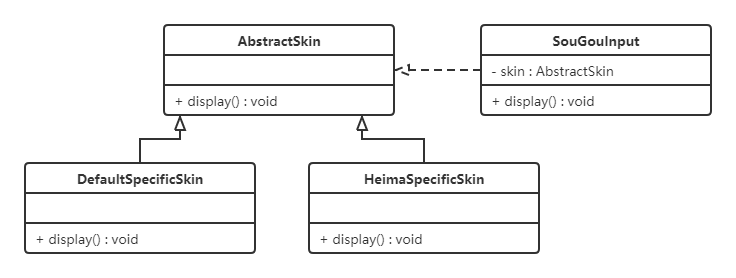

<LockArticle :highHeightPercent="0.3"/>

# 3.1 开闭原则

## 3.1.1 介绍
* 对扩展开放，对修改关闭

* 使用抽象进行构建，使用实现扩展细节

* 面向对象编程

* 提高软件系统的可复用性

  

**对扩展开放，对修改关闭**。在程序需要进行拓展的时候，不能去修改原有的代码，实现一个热插拔的效果。简言之，是为了使程序的扩展性好，易于维护和升级。

想要达到这样的效果，我们需要使用接口和抽象类。

因为抽象灵活性好，适应性广，只要抽象的合理，可以基本保持软件架构的稳定。而软件中易变的细节可以从抽象派生来的实现类来进行扩展，当软件需要发生变化时，只需要根据需求重新派生一个实现类来扩展就可以了。

下面以 `搜狗输入法` 的皮肤为例介绍开闭原则的应用。

【例】`搜狗输入法` 的皮肤设计。

分析：`搜狗输入法` 的皮肤是输入法背景图片、窗口颜色和声音等元素的组合。用户可以根据自己的喜爱更换自己的输入法的皮肤，也可以从网上下载新的皮肤。这些皮肤有共同的特点，可以为其定义一个抽象类（AbstractSkin），而每个具体的皮肤（DefaultSpecificSkin和HeimaSpecificSkin）是其子类。用户窗体可以根据需要选择或者增加新的主题，而不需要修改原代码，所以它是满足开闭原则的。




## 3.1.2 案例

* 创建人的行为
```java
public interface Human {
    void eat();

    void  sleep();
}
```
* 学生继承人的行为
```java
public class Student implements Human{
    @Override
    public void eat() {
        System.out.println("student eating ....");
    }

    @Override
    public void sleep() {
        System.out.println("student sleeping ....");
    }
}
```
* 此时如果想扩展学生分为高中生/中学生那么如果修改Student类，执行高中生/中学生特有的方法，则违反开闭原则
* 为了遵循开闭原则，创建高中生/中学生对象继承Student，实现特有的方法
```java
public class HignStudent extends Student{
    public void student(){
        System.out.println("highStudent studying ");
    }
}
```
```java
public class MIddleStudent extends Student{
    public void play(){
        System.out.println("mIddleStudent playing");
    }
}
```
* 测试
```java
public class Test {
    public static void main(String[] args) {
        Student student = new Student();
        student.sleep();
        student.eat();

        new HignStudent().student();
        new MIddleStudent().play();
    }
}
```
