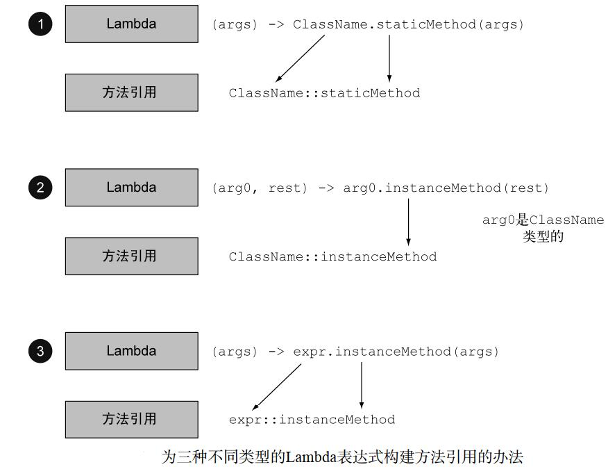
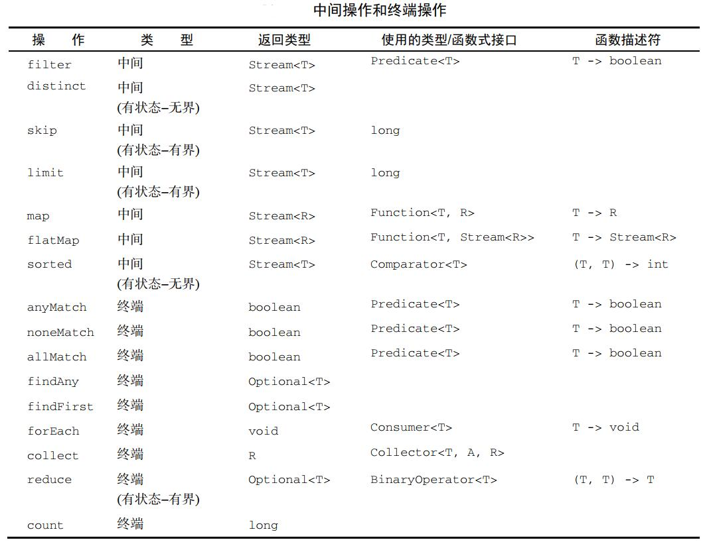

# java8新特性
## 一、简介

> `Java 8`是Java语言开发的一个主要版本。 `Java 8`是Oracle公司于2014年3月发布，可以看成是自`Java 5`以来最具革命性的版本。`Java 8`为`Java`语言、编译器、类库、开发 工具与`JVM`带来了大量新特性。
>
> * 速度更快
> * 代码更少(增加了新的语法：`Lambda`表达式)
> * 强大的`Stream API`
> * 便于并行
> * 最大化减少空指针异常：`Optional`
> * `Nashorn`引擎，允许在`JVM`上运行`JS`应用

## 二、`Lambda`表达式

### 2.1、为什么使用`Lambda`表达式

```java
import java.util.Arrays;
import java.util.Comparator;

public class MyTest1 {
    public static void main(String[] args) {
        Thread thread = new Thread(new Runnable() {
            @Override
            public void run() {
                System.out.println("hello world");
            }
        });
        thread.start();

        String[] arr = {"aaa", "AA", "Ad", "ee", "abcd"};
        Arrays.sort(arr, new Comparator<String>() {
            @Override
            public int compare(String o1, String o2) {
                return -o1.compareTo(o2);
            }
        });
        System.out.println(Arrays.toString(arr));
        
        ArrayList<String> list = new ArrayList<>();
        list.add("111");
        list.add("122");
        list.forEach(new Consumer<String>() {
            @Override
            public void accept(String s) {
                System.out.println(s);
            }
        });
    }
}
```

> `Lambda`是一个匿名函数，我们可以把`Lambda`表达式理解为是一段可以传递的代码（将代码像数据一样进行传递）。使用它可以写出更简洁、更灵活的代码。作为一种更紧凑的代码风格，使Java的语言表达能力得到了提升。
>
> 概括：`实现行为参数化`

```java
//使用Lambda表达式进行升级
public class MyTest2 {
    public static void main(String[] args) {
        Thread thread = new Thread(() -> {
            System.out.println("hello world");
        });

        thread.start();

        String[] arr = {"aaa", "AA", "Ad", "ee", "abcd"};
        Arrays.sort(arr, (o1, o2) -> -o1.compareTo(o2));
        System.out.println(Arrays.toString(arr));
        
        ArrayList<String> list = new ArrayList<>();
        list.add("111");
        list.add("122");
        list.forEach(s -> System.out.println(s));
    }
}
```

### 2.2、`Lambda`表达式语法

> `Lambda`表达式：在Java 8语言中引入的一种新的语法元素和操作符。这个操作符为`->` ， 该操作符被称为`Lambda`操作符或箭头操作符。它将`Lambda`分为两个部分：
>
> * 左侧：指定了`Lambda`表达式需要的参数列表(其实就是接口中的抽象方法的形参列表)；
> * 右侧：指定了`Lambda`体，是抽象方法的实现逻辑，也即`Lambda`表达式要执行的功能(其实就是重写的抽象方法的方法体)。
>
> 语法格式1：无参，无返回值
>
> ```java
> Runable r = () -> {System.out.println("hello world");}
> ```
>
> 语法格式2：`Lambda`需要一个参数，但是没有返回值
>
> ```java
> Consumer<String> con = (String str) -> {System.out.println(str);}
> ```
>
> 语法格式3：数据类型可以省略，因为可由编译器推断得出，称为**类型推断**
>
> ```java
> Consumer<String> con = (str) -> {System.out.println(str);}
> ```
>
> 语法格式4：`Lambda`若只需要一个参数时，参数的小括号可以省略
>
> ```java
> Consumer<String> con = str -> {System.out.println(str);}
> ```
>
> 语法格式5：`Lambda`需要两个或以上的参数，多条执行语句，并且可以有返回值
>
> ```java
> Comparator<String> con = (o1, o2) -> {
> 	System.out.println("实现函数式接口");
>     return Integer.compare(x, y);
> }
> ```
>
> 语法格式6：当`Lambda`体只有一条语句时，`return`与大括号若有，都可以省略
>
> ```java
> Comparator<String> con = (o1, o2) -> Integer.compare(x, y);
> ```

```java
public class MyTest3 {
    public static void main(String[] args) {
        Thread thread = new Thread(new Runnable() {
            @Override
            public void run() {
                System.out.println("hello world");
            }
        });
        thread.start();
        
        //语法格式1：无参，无返回值
        Thread thread1 = new Thread(() -> {
            System.out.println("hello world");
        });
        thread1.start();
    }
}

public class MyTest4 {
    public static void main(String[] args) {
        ArrayList<String> list = new ArrayList<>();
        list.add("111");
        list.add("122");
        list.forEach(new Consumer<String>() {
            @Override
            public void accept(String s) {
                System.out.println(s);
            }
        });
		
        //语法格式2：Lambda需要一个参数，但是没有返回值
        list.forEach((String s) -> {
           System.out.println(s); 
        });
    }
}

public class MyTest5 {
    public static void main(String[] args) {
        ArrayList<String> list = new ArrayList<>();
        list.add("111");
        list.add("122");
        list.forEach(new Consumer<String>() {
            @Override
            public void accept(String s) {
                System.out.println(s);
            }
        });
		
        //语法格式3：数据类型可以省略，因为可由编译器推断得出，称为类型推断
        list.forEach((s) -> {
           System.out.println(s); 
        });
    }
}

public class MyTest6 {
    public static void main(String[] args) {
        ArrayList<String> list = new ArrayList<>();
        list.add("111");
        list.add("122");
        list.forEach(new Consumer<String>() {
            @Override
            public void accept(String s) {
                System.out.println(s);
            }
        });
		
        //语法格式4：Lambda若只需要一个参数时，参数的小括号可以省略
        list.forEach(s -> {
           System.out.println(s); 
        });
    }
}

public class MyTest7 {
    public static void main(String[] args) {		
        //语法格式5：Lambda需要两个或以上的参数，多条执行语句，并且可以有返回值
		String[] arr = {"aaa", "AA", "Ad", "ee", "abcd"};
        Arrays.sort(arr, (o1, o2) -> {
            return -o1.compareTo(o2)
        });
        System.out.println(Arrays.toString(arr));
    }
}

public class MyTest8 {
    public static void main(String[] args) {		
		ArrayList<String> list = new ArrayList<>();
        list.add("111");
        list.add("122");
        list.forEach(new Consumer<String>() {
            @Override
            public void accept(String s) {
                System.out.println(s);
            }
        });
		
        //语法格式6：当Lambda体只有一条语句时，return与大括号若有，都可以省略
        list.forEach(s -> System.out.println(s));
    }
}
```

> 总结：
>
> * 左边：
>   * `Lambda`形参列表的参数类型可以省略(类型推断)；
>   * 如果`Lambda`形参列表只有一个参数，其一对`()`也可以省略。
> * 右边：
>   * `Lambda`体应该使用一对`{}`包裹；
>   * 如果`Lambda`体只有一条执行语句(可能是`return`语句)，省略这一对`{}`和`return`关键字。
> * 在哪里可以使用`Lambda`表达式？
>   * 在函数式接口上使用`Lambda`表达式。

## 三、函数式接口

### 3.1、是什么

>  只有一个抽象方法的接口，称为`函数式接口`(可以包含默认方法、静态方法、常量、抽象方法，但是**只能有一个**抽象方法)。
>
> 我们可以在一个接口上使用`@FunctionalInterface`注解，这样做可以检查它是否是一个函数式接口。
>
> 在`java.util.function`包下定义了`Java 8`的丰富的函数式接口。
>
> 简单的说，在`Java 8`中，`Lambda`表达式就是一个函数式接口的实例。这就是`Lambda`表达式和函数式接口的关系。也就是说，只要一个对象是函数式接口的实例，那么该对象就可以用`Lambda`表达式来表示。
>
> 所以以前用**匿名内部类**表示的现在多数都可以用`Lambda`表达式来写。
>
> 我们之前使用的`Runnable`接口、`Comparator`接口、`Consumer`接口都是函数式接口。

```java
//定义函数式接口
@FunctionalInterface
public interface MyFunc<T> {
    public T getVal(T t);
}

public class MyTest9 {
    //定义修改字符串的方法，使用函数式接口
    public static String updateString(String str, MyFunc<String> fun) {
        return fun.getVal(str);
    }
    
    public static void main(String[] args) {
        String str = "hello java";
        //使用Lambda表达式
        String newStr = updateString(str, (String s) -> {
            return str.toUpperCase();
        });
        System.out.println(newStr);

        String newStr2 = updateString(str, s -> "***" + s);
        System.out.println(newStr2);
    }
}
```

### 3.2、Java常用内置函数式接口

| 函数式接口                    | 参数类型 | 返回值类型 | 用途                              |
| ----------------------------- | -------- | ---------- | --------------------------------- |
| `Consumer<T>`消费型接口       | `T`      | `void`     | 接收一个参数，没有返回值          |
| `BiConsumer`消费型接口        | `T,U`    | `void`     | 接收两个参数，没有返回值          |
| `Supplier<T>`供给型接口       | 无       | `T`        | 没有参数，返回一个`T`             |
| `Function<T,R>`函数型接口     | `T`      | `R`        | 接收一个参数`T`，返回一个值`R`    |
| `BiFunction<T,U,R>`函数型接口 | `T,U`    | `R`        | 接收两个参数`T、U`，返回一个值`R` |
| `BinaryOperator`函数型接口    | `T,T`    | `T`        | 接收两个参数`T、T`，返回一个值`T` |
| `Predicate<T>`断定型接口      | `T`      | `boolean`  | 接口一个值`T`, 返回一个`boolean`  |
| `Comparator<T>`               | `T,T`    | `int`      | 接收两个值`T`, 返回一个整数       |

```java
import java.util.ArrayList;
import java.util.List;
import java.util.function.Consumer;
import java.util.function.Predicate;

public class MyTest10 {
    //消费型接口 - Consumer
    public static <T> void forEach(List<T> list, Consumer<T> c) {
        for (T item : list) {
            c.accept(item);
        }
    }

    //断定型接口 - Predicate
    public static List<String> filterString(List<String> list, Predicate<String> pre){
        ArrayList<String> filterList = new ArrayList<>();
        for(String s : list){
            if(pre.test(s)){
                filterList.add(s);
            }
        }
        return filterList;
    }
    
    //函数型接口 - Function
    public static <T, R> List<R> map(List<T> list, Function<T, R> f) {
        ArrayList<R> rList = new ArrayList<>();
        for (T item : list) {
            rList.add(f.apply(item));
        }
        return rList;
    }
    
    //供给型接口
    public static Integer[] genArray(Supplier<Integer[]> s) {
        return s.get();
    }
    
    //供给型接口
    public static Student genStudent(Supplier<Student> s) {
        return s.get();
    }
    
    class Student {
        private String id;
        private String name;
        private int age;

        public Student() {
        }

        public Student(String id) {
            this.id = id;
        }

        @Override
        public String toString() {
            return "Student{" +
                    "id='" + id + '\'' +
                    ", name='" + name + '\'' +
                    ", age=" + age +
                    '}';
        }
    }

    public static void main(String[] args) {
        ArrayList<String> list = new ArrayList<>();
        list.add("aaaa");
        list.add("aa");
        list.add("bbbb");
        list.add("ddd");
        //消费型接口
        forEach(list, s -> System.out.println(s));

        //断定型接口
        List<String> list1 = filterString(list, (s) -> s.length() == 4);
        System.out.println(list1);
        System.out.println("-------------------------------");
        //断定型接口
        list.removeIf(item -> item.length() > 3);
        System.out.println(list);
        
        //函数型接口
        System.out.println(map(list, s -> s.length()));
        System.out.println(map(list, s -> s.charAt(0)));
        
        //供给型接口
        Integer[] array = genArray(() -> new Integer[10]);
        System.out.println(array.length);
        Integer[] array1 = genArray(() -> {
            int len = (int) (Math.random() * 10) + 1;
            return new Integer[len];
        });
        System.out.println(array1.length);
        
        //供给型接口
        Student s = genStudent(() -> new Student());
        System.out.println(s);
    }
}
```

## 四、方法引用与构造器引用

### 4.1、方法引用

> 当要传递给`Lambda`体的操作，已经有实现的方法了，可以使用方法引用。
>
> 方法引用可以看做是`Lambda`表达式深层次的表达。换句话说，方法引用就是`Lambda`表达式，也就是函数式接口的一个实例，通过方法的名字来指向一个方法，可以认为是`Lambda`表达式的一个语法糖。
>
> **要求**：实现接口的抽象方法的参数列表和返回值类型，必须与方法引用的方法的参数列表和返回值类型保持一致。
>
> **格式**：使用操作符`::`将类(或对象)与方法名分隔开来。
>
> **三种使用情况**：
>
> * `对象::实例方法名`
> * `类::静态方法名`
> * `类::实例方法名`



```java
public class MyTest11 {
    public static void main(String[] args) {
        List<Integer> list = new ArrayList<Integer>();
        list.add(4);
        list.add(-1);
        list.add(3);
        list.add(5);
        list.add(2);
        //对象::实例方法名
        //list.stream().forEach(a -> System.out.println(a));
        list.stream().forEach(System.out::println);
        System.out.println("------------------------------");
        
        //类::静态方法名
        //Collections.sort(list, (o1, o2) -> Integer.compare(o1,o2));
        Collections.sort(list, Integer::compare);
        System.out.println(list);
        System.out.println("------------------------------");
        
        //类::实例方法名
        ArrayList<String> list1 = new ArrayList<>();
        list1.add("aaaa");
        list1.add("AAA");
        list1.add("bbbD");
        //Collections.sort(list1, (o1, o2) -> o1.compareTo(o2));
        Collections.sort(list1, String::compareTo);
        System.out.println(list1);
    }
}
```

### 4.2、构造器引用

>格式：`ClassName::new`
>
>与函数式接口相结合，自动与函数式接口中方法兼容。
>
>可以把构造器引用赋值给定义的方法，要求构造器参数列表要与接口中抽象方法的参数列表一致。且方法的返回值即为构造器对应类的对象。

```java
public class Student {
    private String id;
    private String name;
    private int age;

    public Student() {
    }

    public Student(String id) {
        this.id = id;
    }
 	//get和set
}    

public class MyTest12 {
    //供给型接口
    public static Student genStudent(Supplier<Student> s) {
        return s.get();
    }
    
    public static void main(String[] args) {
        //Student s = genStudent(() -> new Student());
        Student s = genStudent(Student::new);
        System.out.println(s);
    }
}
```

### 4.3、`Lambda`和方法引用实战  

> 综合上面的知识，我们完成一个案例，用不同的排序策略给一个`Apple`集合排序，并展示如何把一个原始粗暴的解决方案转变得更为简明。这会用到迄今讲到的所有概念和功能：行为参数化、匿名类、 `Lambda`表达式和方法引用。
>
> 最终效果：`list.sort(Comparator.comparing(Apple::getWeight));`

```java
public class Apple {
    private int weight;
    private String color;
    
    //无参构造方法
    //有参构造方法
    
    //get和set方法
    //toString方法
}

public class MyTest13 {
    public static void main(String[] args) {
        ArrayList<Apple> list = new ArrayList<>();

        list.add(new Apple(150,"red"));
        list.add(new Apple(210,"red"));
        list.add(new Apple(300,"yellow"));
        list.add(new Apple(90,"green"));
        list.add(new Apple(90,"yellow"));
        list.add(new Apple(100,"green"));
        list.add(new Apple(123,"red"));

        //排序的代码，见下面的步骤

        System.out.println(list);
    }
}
```

> 第一步：使用匿名类 

```java
list.sort(new Comparator<Apple>() {
    @Override
    public int compare(Apple o1, Apple o2) {
        return o1.getWeight().compareTo(o2.getWeight());
    }
});
```

> 第二步：使用`Lambda`表达式

```java
list.sort((Apple o1, Apple o2) -> {
    return o1.getWeight().compareTo(o2.getWeight());
});
```

> 第三步：简化`Lambda`表达式

```java
list.sort((o1, o2) -> o1.getWeight().compareTo(o2.getWeight()));
```

> 第四步：继续简化`Lambda`表达式
>
> `Comparator`具有一个叫作`comparing`的静态辅助方法，它可以接受一个`Function`来提取`Comparable`键值，并生成一个`Comparator`对象 

```java
list.sort(Comparator.comparing(o -> o.getWeight()));
```

> 第五步：使用方法引用

```java
list.sort(Comparator.comparing(Apple::getWeight));
```

> 上面就是最终答案，这比`Java 8`之前的代码好在哪儿呢？它比较简短；它的意思也很明显，并且代码读起来和问题描述差不多：`对库存进行排序，比较苹果的重量。`

### 4.4、复合`Lambda`表达式的有用方法

#### 4.4.1、比较器复合

> **逆序**  

```java
//按重量递减排序
list.sort(Comparator.comparing(Apple::getWeight).reversed());
```

> **比较器链**
>
> 如果发现有两个苹果一样重怎么办？哪个苹果应该排在前面呢？可能需要再提供一个`Comparator`来进一步定义这个比较 ，比如，在按重量比较两个苹果之后，你可能想要按颜色排序。`thenComparing`方法就是做这个用的。  它接受一个`Function`作为参数（就像`comparing`方法一样），如果两个对象用第一个`Comparator`比较之后是一样的，就提供第二个`Comparator`。  

```java
//根据重量的逆序排序，如果重量相同，根据颜色进行排序
list.sort(Comparator
		.comparing(Apple::getWeight)
		.reversed()
		.thenComparing(Apple::getColor));
```

#### 4.4.2、谓词符号

> 谓词接口包括三个方法： `negate`、`and`和`or`，让你可以重用已有的`Predicate`来创建更复杂的谓词。 

```java
//去除非红的苹果
Predicate<Apple> redApple = item -> item.getColor().equals("red");
list.removeIf(redApple.negate());

//去除红色并且重量大于150的苹果
list.removeIf(redApple.and(apple -> apple.getWeight() > 150));

//去除红色并且重量大于150的苹果或绿苹果
list.removeIf(redApple
              .and(apple -> apple.getWeight() > 150)
              .or(apple -> apple.getColor().equals("green")));
```

> `and`和`or`方法是按照在表达式链中的位置，从左向右确定优先级的。因此， `a.or(b).and(c)`可以看作`(a || b) && c`。  

## 五、`Stream API`

### 5.1、简介

> `Java 8`中有两大最为重要的改变。第一个是`Lambda`表达式；另外一个则是`Stream API`。 
>
> `Stream API`把真正的函数式编程风格引入到`Java`中。这是目前为止对`Java`类库最好的补充，因为`Stream API`可以极大提供`Java`程序员的生产力，让程序员写出高效率、干净、简洁的代码。
>
> `Stream`是`Java 8`中处理集合的关键抽象概念，它可以指定你希望对集合进行的操作，可以执行非常复杂的查找、过滤和映射数据等操作。
>
> `Stream`和`Collection`集合的区别：`Collection`是一种静态的内存数据结构，而`Stream`是有关计算的。前者是主要面向内存，存储在内存中， 后者主要是面向`CPU`，通过`CPU`实现计算。
>
> `Stream`到底是什么? 
>
> * 是数据渠道，用于操作数据源（集合、数组等）所生成的元素序列。 
> * 集合讲的是数据，`Stream`讲的是计算。
>
> 注意：
>
> * `Stream`自己不会存储元素；
> * `Stream`不会改变源对象。相反，他们会返回一个持有结果的新`Stream`；
> * `Stream`操作是延迟执行的。这意味着他们会等到需要结果的时候才执行。

### 5.2、`Stream`操作的三个步骤

> 1. 创建 `Stream`
>    * 一个数据源（如：集合、数组），获取一个流 
> 2. 中间操作
>    * 产生一个中间操作链，对数据源的数据进行处理
> 3. 终止操作(终端操作)
>    *  一旦执行终止操作，就执行中间操作链，并产生结果。之后，**不会再被使用**。

### 5.3、创建`Stream`

> 方式1，通过集合：
>
> * `Java 8`中的`Collection`接口被扩展，提供了两个获取流的方法：
>* `default Stream stream()`：返回一个顺序流
>   
>* `default Stream parallelStream()`：返回一个并行流
> 
>方式2，通过数组：
> 
>* `Java 8`中的`Arrays`的静态方法`stream()`可以获取数组流：
>   * ` static Stream stream(T[] array)`：返回一个流
>  
>   * `static IntStream stream(int[] array)` 
>  * `static LongStream stream(long[] array)`
>   * `static DoubleStream stream(double[] array)`
> 
> 方式3，通过`Stream`的`of()`：
>
> * 可以调用`Stream`类静态方法`of()`， 通过可变参数创建一个流。它可以接收任意数量的参数：
>
>   `static Stream of(T... values)`：返回一个流
>
> 方式4，创建无限流：
>
> * `static Stream iterate(final T seed, final UnaryOperator f)`
>*  `static Stream generate(Supplier s)` 

```java
public class MyTest14 {
    public static void main(String[] args) {
        //方式1，通过集合
        ArrayList<String> list = new ArrayList<>();
        list.add("aaaa");
        list.add("hello");
        list.add("123");

        Stream<String> stream = list.stream();
        stream.forEach(item -> System.out.println(item));

        //方式2，通过数组
        String[] arr = {"hello", "java", "web", "mysql"};
        Stream<String> stream1 = Arrays.stream(arr);
        stream1.forEach(item -> System.out.println(item));

        //方式3，通过Stream的of()
        Stream<String> stream2 = Stream.of(arr);
        stream2.forEach(item -> System.out.println(item));

        //方式4，创建无限流
        Stream<Integer> stream3 = Stream.iterate(0, i -> i + 2);
        stream3.limit(10).forEach(item -> System.out.println(item));
        Stream<Integer> stream4 = Stream.generate(() -> (int) (Math.random() * 10));
        stream4.limit(10).forEach(item -> System.out.println(item));
    }
}
```

### 5.4、使用流

#### 5.4.1、筛选与切片

| 方法                  | 描述                                                         |
| --------------------- | ------------------------------------------------------------ |
| `filter(Predicate p)` | 接收`Lambda`，从流中排除某些元素                             |
| `distinct()`          | 筛选，通过流所生成元素的`hashCode()`和`equals()`去除重复元素 |
| `limit(long maxSize)` | 截断流，使其元素不超过给定数量                               |
| `skip(long n)`        | 跳过元素，返回一个扔掉了前n个元素的流。若流中元素不足n个，则返回一个空流，与`limit(n)`互补 |

```java
public class MyTest15 {
    public static void main(String[] args) {
        ArrayList<String> list = new ArrayList<>();
        list.add("hello java");
        list.add("hello js");
        list.add("good bye");
        list.add("good bye");
        list.add("*****");
        list.add("00000000000");

        //筛选
        list.stream()
                .filter(item -> item.length() > 5)
                .forEach(item -> System.out.println(item));
        System.out.println("-----------------------------------");
        //截断
        list.stream()
                .limit(2)
                .forEach(item -> System.out.println(item));
        System.out.println("-----------------------------------");
        //跳过元素
        list.stream()
                .skip(2)
                .forEach(item -> System.out.println(item));
        //筛选，通过流所生成元素的 hashCode() 和 equals() 去除重复元素
        System.out.println("-----------------------------------");
        list.stream()
                .disyingtinct()
                .forEach(item -> System.out.println(item));
    }
}
```

#### 5.4.2、映射

| 方法                              | 描述                                                         |
| --------------------------------- | ------------------------------------------------------------ |
| `map(Function f)`                 | 接收一个函数作为参数，该函数会被应用到每个元素上，并将其映射成一个新的元素。 |
| `mapToDouble(ToDoubleFunction f)` | 接收一个函数作为参数，该函数会被应用到每个元素上，产生一个新的`DoubleStream`。 |
| `mapToInt(ToIntFunction f)`       | 接收一个函数作为参数，该函数会被应用到每个元素上，产生一个新的` IntStream`。 |
| `mapToLong(ToLongFunction f)`     | 接收一个函数作为参数，该函数会被应用到每个元素上，产生一个新的`LongStream`。 |
| `flatMap(Function f)`             | 接收一个函数作为参数，将流中的每个值都换成另一个流，然后把所有流连接成一个流 |

```java
public class MyTest16 {
    public static void main(String[] args) {
        ArrayList<String> list = new ArrayList<>();
        list.add("hello java");
        list.add("hello js");
        list.add("good bye");
        list.add("good bye");
        list.add("*****");
        list.add("00000000000");

        //映射
        list.stream().map(item -> item.length()).forEach(item -> System.out.println(item));
        
        String[] arr = {"hello", "world"};

        List<String> collect = Arrays.stream(arr)
                .map(item -> item.split("")) //String --- String[]
                .flatMap(Arrays::stream) //String --- Stream --- 合并
                .collect(Collectors.toList());
        System.out.println(collect);
    }
}
```

#### 5.4.3、查找和匹配

| 方法                                        | 描述                               |
| ------------------------------------------- | ---------------------------------- |
| `anyMatch(Predicate<? super T> predicate)`  | 流中是否有一个元素能匹配给定的谓词 |
| `allMatch(Predicate<? super T> predicate)`  | 流中的元素是否都能匹配给定的谓词   |
| `noneMatch(Predicate<? super T> predicate)` | 流中没有任何元素与给定的谓词匹配   |
| `findFirst()`                               | 返回当前流中的第一个元素           |
| `findAny()`                                 | 返回当前流中的任意元素             |

```java
public class MyTest17 {
    public static void main(String[] args) {
        ArrayList<String> list = new ArrayList<>();
        list.add("hello java");
        list.add("hello js");
        list.add("good bye");
        list.add("good bye");
        list.add("*****");
        list.add("00000000000");

        System.out.println(list.stream().anyMatch(item -> item.length() > 5));
        System.out.println(list.stream().anyMatch(item -> item.length() > 1));
        System.out.println(list.stream().noneMatch(item -> item.startsWith("a")));
        System.out.println(list.stream().findFirst().get());
        System.out.println(list.stream().findAny().get());
    }
}
```

> 以上操作都是终端操作。

#### 5.4.4、归约

> 之前见到过的终端操作都是返回一个`boolean`(`allMatch`之类的)、 `void`(`forEach`)或`Optional`对象(`findAny`等)。使用`reduce`操作来表达更复杂的查询，此类查询需要将流中所有元素反复结合起来，得到一个值，比如一个`Integer`。 这样的查询可以被归类为**归约操作**(将流归约成一个值)。

 ##### 5.4.4.1、元素求和

```java
public class MyTest18 {
    public static void main(String[] args) {
        ArrayList<Integer> list = new ArrayList<>();
        list.add(22);
        list.add(2);
        list.add(0);
        list.add(-1);

        //第一个参数表示初始值
        //Integer result = list.stream().reduce(0, (a, b) -> Integer.sum(a, b));
        Integer result = list.stream().reduce(0, Integer::sum);
        System.out.println(result);
        
        /*
        	为什么它返回一个Optional<Integer>呢？
        	考虑流中没有任何元素的情况。 reduce操作无法返回其和，因为它没有初始值。
        */
        Optional<Integer> r = list.stream().reduce(Integer::sum);
        System.out.println(r.get());
    }
}
```

##### 5.4.4.2、最大值和最小值

```java
//最大值
Integer max = list.stream().reduce(list.get(0), Integer::max);
System.out.println(max);

//最小值
Integer min = list.stream().reduce(list.get(0), Integer::min);
System.out.println(min);
```

##### 5.4.4.3、练习

> 怎样用`map`和`reduce`方法计算流中元素的数量  

```java
Integer count = list
    			.stream()
    			.map(item -> 1)
    			.reduce(0, Integer::sum);
System.out.println(count);
```

#### 5.4.5、排序

| 方法                     | 描述                               |
| ------------------------ | ---------------------------------- |
| `sorted()`               | 产生一个新流，其中按自然顺序排序   |
| `sorted(Comparator com)` | 产生一个新流，其中按比较器顺序排序 |

```java
import java.util.ArrayList;

public class MyTest14 {
    public static void main(String[] args) {
        ArrayList<String> list = new ArrayList<>();
        list.add("hello java");
        list.add("hello js");
        list.add("good bye");
        list.add("good bye");
        list.add("*****");
        list.add("00000000000");

        //自然排序
        list.stream()
            .sorted()
            .forEach(item -> System.out.println(item));
        System.out.println("----------");
        //定制
        list.stream()
            .sorted((s1, s2) -> s1.compareTo(s2))
            .forEach(item -> System.out.println(item));
    }
}
```

> 总结



#### 5.4.6、练习

> 1. 找出2011年发生的所有交易，并按交易额排序（从低到高）。
> 2. 交易员都在哪些不同的城市工作过？
> 3. 查找所有来自于剑桥的交易员，并按姓名排序。
> 4. 返回所有交易员的姓名字符串，按字母顺序排序。
> 5. 有没有交易员是在米兰工作的？
> 6. 打印生活在剑桥的交易员的所有交易额。
> 7. 所有交易中，最高的交易额是多少？
> 8. 找到交易额最小的交易。  

```java
//交易员
public class Trader {
    private final String name;
    private final String city;
    
    public Trader(String n, String c){
        this.name = n;
        this.city = c;
    }
    //get set toString
}

//交易
public class Transaction {
    private final Trader trader;
    private final int year;
    private final int value;
    
    public Transaction(Trader trader, int year, int value){
        this.trader = trader;
        this.year = year;
        this.value = value;
    }
    //get set toString
}

public class MyTest15 {
    public static void main(String[] args) {
        Trader raoul = new Trader("Raoul", "Cambridge");
        Trader mario = new Trader("Mario","Milan");
        Trader alan = new Trader("Alan","Cambridge");
        Trader brian = new Trader("Brian","Cambridge");
        List<Transaction> transactions = Arrays.asList(
                new Transaction(brian, 2011, 300),
                new Transaction(raoul, 2012, 1000),
                new Transaction(raoul, 2011, 400),
                new Transaction(mario, 2012, 710),
                new Transaction(mario, 2012, 700),
                new Transaction(alan, 2012, 950)
        );

        /**
         * (1) 找出2011年发生的所有交易，并按交易额排序（从低到高）。
         * (2) 交易员都在哪些不同的城市工作过？
         * (3) 查找所有来自于剑桥的交易员，并按姓名排序。
         * (4) 返回所有交易员的姓名字符串，按字母顺序排序。
         * (5) 有没有交易员是在米兰工作的？
         * (6) 打印生活在剑桥的交易员的所有交易额。
         * (7) 所有交易中，最高的交易额是多少？
         * (8) 找到交易额最小的交易。
         */
        //找出2011年发生的所有交易，并按交易额排序（从低到高）。
        transactions.stream()
                .filter(item -> item.getYear() == 2011)
                .sorted(Comparator.comparing(Transaction::getValue))
                .forEach(System.out::println);
        //交易员都在哪些不同的城市工作过
        transactions.stream()
                .map(item -> item.getTrader().getCity())
                .distinct()
                .forEach(System.out::println);
        //查找所有来自于剑桥的交易员，并按姓名排序。
        transactions.stream()
                .map(item -> item.getTrader())
                .filter(item -> item.getCity().equals("Cambridge"))
                .map(Trader::getName)
                .sorted()
                .distinct()
                .forEach(System.out::println);
        //返回所有交易员的姓名字符串，按字母顺序排序。
        System.out.println(transactions.stream()
                .map(Transaction::getTrader)
                .map(Trader::getName)
                .distinct()
                .sorted()
                .reduce("", (n1, n2) -> n1 + n2));
        //有没有交易员是在米兰工作的？
        System.out.println(transactions.stream()
                .anyMatch(item -> item.getTrader().getCity().equals("Milan")));

        //打印生活在剑桥的交易员的所有交易额
        transactions.stream()
                .filter(item -> item.getTrader().getCity().equals("Cambridge"))
                .map(Transaction::getValue)
                .forEach(System.out::println);

        //所有交易中，最高的交易额是多少
        System.out.println(transactions.stream()
                .map(Transaction::getValue)
                .reduce(Integer::max));

        //找到交易额最小的交易
        System.out.println(transactions.stream()
                .map(Transaction::getValue)
                .reduce(Integer::min));

    }
}
```

### 5.5、`Stream`的终止操作

>  终端操作会从流的流水线生成结果。其结果可以是任何不是流的值，例 如：`List`、`Integer`，甚至是`void`。
>
> **流进行了终止操作后，不能再次使用。**

#### 5.5.1、匹配与查找

| 方法                  | 描述             |
| --------------------- | ---------------- |
| `count()`             | 返回流中元素总数 |
| `max(Comparator c)`   | 返回流中最大值   |
| `min(Comparator c) `  | 返回流中最小值   |
| `forEach(Consumer c)` | 内部迭代         |

```java
public class MyTest15 {
    public static void main(String[] args) {
        ArrayList<String> list = new ArrayList<>();
        list.add("hello java");
        list.add("hello js");
        list.add("good bye");
        list.add("good bye");
        list.add("*****");
        list.add("00000000000");

        //返回流中元素个数
        System.out.println(list.stream().count());
        System.out.println("----------");
        //返回流中最大值
        System.out.println(list.stream().max((s1, s2) -> s1.compareTo(s2)).get());
        //返回流中最小值
        System.out.println(list.stream().min((s1, s2) -> s1.compareTo(s2)).get());
        //迭代
        list.stream().forEach(item -> System.out.println(item));
    }
}
```

#### 5.5.2、收集

| 方法                   | 描述                                                         |
| ---------------------- | ------------------------------------------------------------ |
| `collect(Collector c)` | 将流转换为其他形式。接收一个`Collector`接口的实现，用于给`Stream`中元素做汇总的方法 |

```java
public class MyTest17 {
    public static void main(String[] args) {
        ArrayList<String> list = new ArrayList<>();
        list.add("hello java");
        list.add("hello js");
        list.add("good bye");
        list.add("good bye");
        list.add("*****");
        list.add("00000000000");
        
        //获取字符串的最大长度
        Optional<Integer> max = list.stream()
                .map(String::length)
                .collect(maxBy(Integer::compare));
        System.out.println(max.get());
        
        //获取字符串的最小长度
        Optional<Integer> min = list.stream()
                .map(String::length)
                .collect(minBy(Integer::compare));
        System.out.println(min.get());
        
        //计算字符串长度总和
        long sum = list.stream().collect(summingInt(String::length));
        System.out.println(sum);
        
        //计算字符串长度的平均值
        Double avg = list.stream().collect(averagingDouble(String::length));
        System.out.println(avg);
        
        //获取统计信息
        IntSummaryStatistics all = list.stream().collect(summarizingInt(String::length));
        System.out.println(all.getSum()); //总长度
        System.out.println(all.getMax()); //最大长度
        System.out.println(all.getMin()); //最小长度
        System.out.println(all.getAverage()); //平均长度
        System.out.println(all.getCount()); //长度个数
        
        //将每个字符串的首字母拼接 joining() - 字符串拼接
        String str = list.stream().map(item -> item.substring(0, 1))
                .collect(joining());
        System.out.println(str);
        
        //将每个字符串的首字母拼接, 并使用分隔符分隔
        String str1 = list.stream().map(item -> item.substring(0, 1))
                .collect(joining("|"));
        System.out.println(str1);

        List<Integer> list1 = list
            .stream()
            .map(item -> item.length())
            .collect(Collectors.toList());
       
        list1.stream().forEach(item -> System.out.println(item));
    }
}
```

## 六、`Optional`类

> 空指针异常是导致Java应用程序失败的最常见原因。
>
> 为了解决空指针异常，Google公司著名的Guava项目引入了`Optional`类。Guava通过使用检查空值的方式来防止代码污染，它鼓励程序员写更干净的代码。受到Google Guava的启发，Optional类已经成为Java 8类库的一部分。
>
> `Optional<T>`类是一个容器类，它可以保存类型T的值，代表这个值存在。或者仅仅保存`null`，表示这个值不存在。原来用`null`表示一个值不存在，现在`Optional`可以更好的表达这个概念。并且可以避免空指针异常。
>
> 如果值存在则`isPresent()`方法会返回`true`，调用`get()`方法会返回该对象。
>
> 创建`Optional`类对象的方法：
>
> * `Optional.of(T t)`： 创建一个`Optional`实例，`t`必须非空；
> * `Optional.empty()`：创建一个空的`Optional`实例；
> * `Optional.ofNullable(T t)`：`t`可以为`null`。
>
> 判断`Optional`容器中是否包含对象：
>
> * `boolean isPresent()`：判断是否包含对象；
> * `void ifPresent(Consumer consumer)`：如果有值，就执行`Consumer`接口的实现代码，并且该值会作为参数传给它；
>
> 获取`Optional`容器的对象：
>
> *  `T get()`：如果调用对象包含值，返回该值，否则抛异常；
> * `T orElse(T other)`：如果有值则将其返回，否则返回指定的`other`对象；
> * `T orElseGet(Supplier other)`：如果有值则将其返回，否则返回由`Supplier`接口实现提供的对象；
> * ` T orElseThrow(Supplier exceptionSupplier) `：如果有值则将其返回，否则抛出由`Supplier`接口实现提供的异常。

```java
//地址
public class Address {
    private String province; //省
    private String cicy; //市
    private String county; //县 / 区
    private String street; //街
    private String number; //编号
    
    //构造方法
    //get set
    //toString
}

//学生
public class Student {
    private String id;
    private String name;
    private int age;
    private Address address;
    
    //构造方法
    //get set
    //toString
}

public class MyTest21 {
    public static void main(String[] args) {
        Student stu = null;
        //创建Optional
        //Optional<Student> stuOptional = Optional.of(stu);
        Optional<Student> stuOptional = Optional.ofNullable(stu);
        //如果有值则将其返回，否则返回指定的
        Student student = stuOptional.orElse(new Student("1111"));
        System.out.println(student.getId());
        
        System.out.println(getStuProvince(null));
        System.out.println(getStuProvince1(null));
    }
    
    //获取学生所在的省份
    public static String getStuProvince(Student student) {
        if(student != null) {
            Address addr = student.getAddr();
            if(addr != null) {
                String province = addr.getProvince();
                return province;
            }
        }

        return null;
    }

    //获取学生所在的省份
    public static String getStuProvince1(Student student) {
        Optional<Student> studentOptional = Optional.ofNullable(student);
        Student stu = studentOptional
            .orElse(new Student("111", "tom", 20, 
                                new Address("sd", "qd", "snq", "sdl", "111")));
        Address addr = stu.getAddr();
        Optional<Address> addrOptional = Optional.ofNullable(addr);
        Address address = addrOptional.orElse(new Address("sd", "qd", "snq", "sdl", "111"));
        return address.getProvince();
    }
}
```

