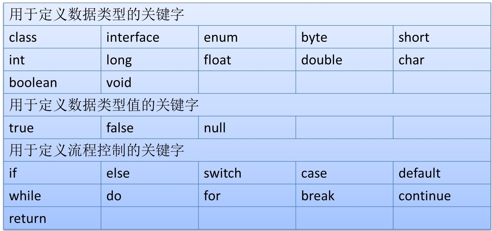
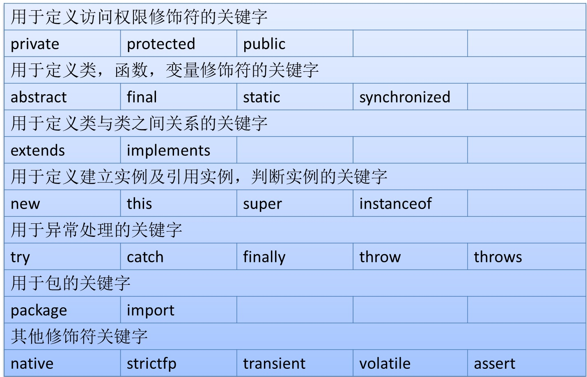
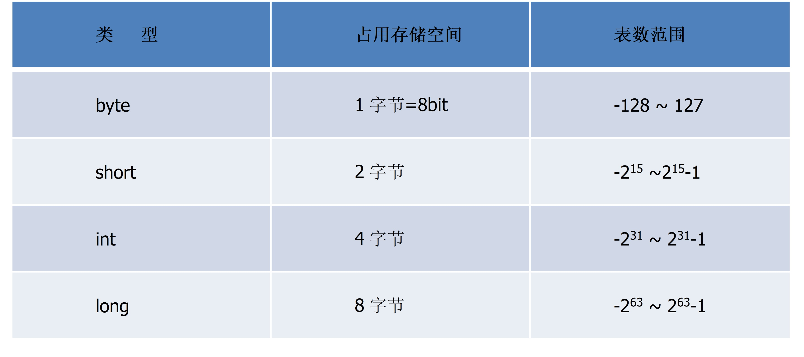
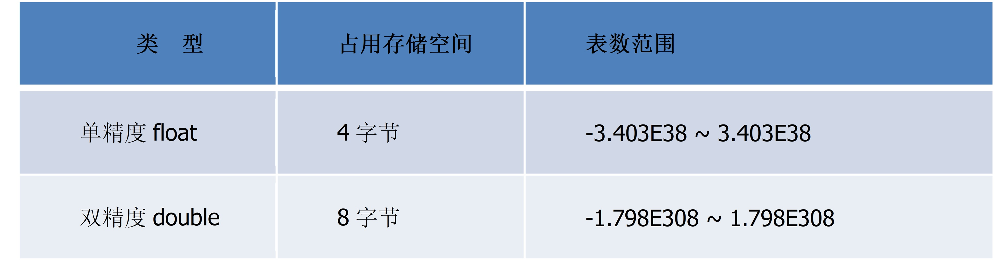
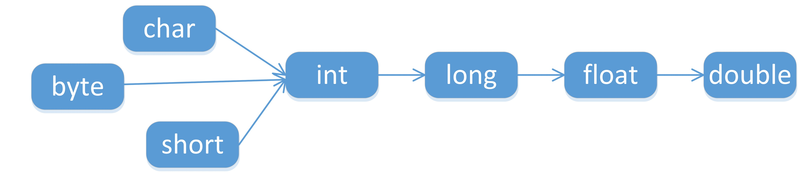
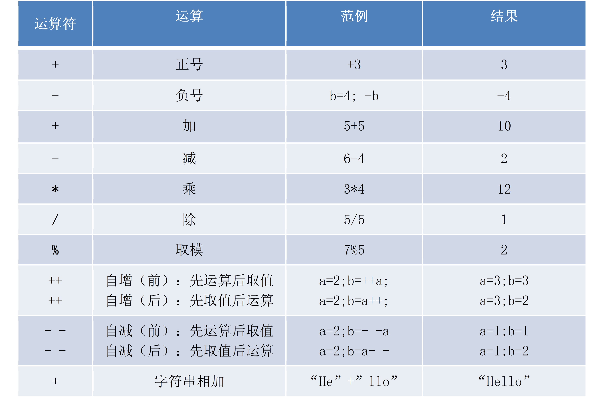
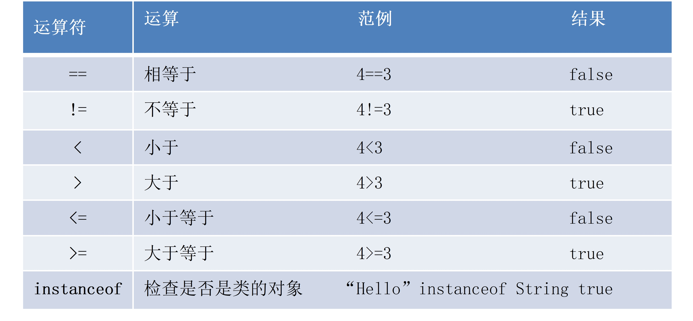
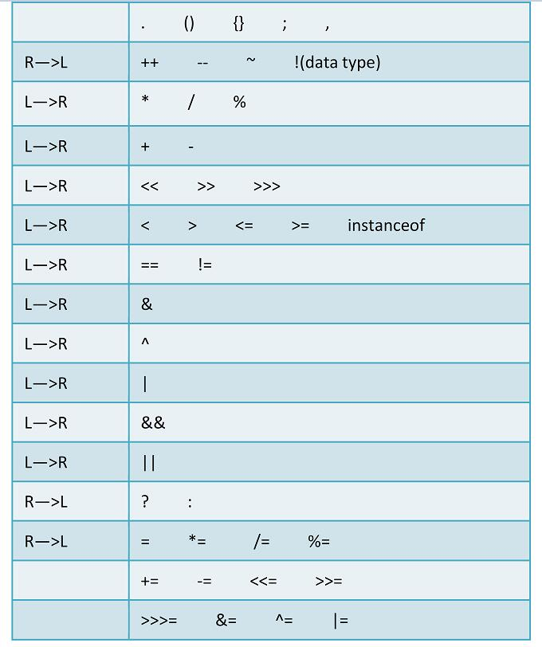

[//]: # (<LockArticle :highHeightPercent="0.04"/>)

# Java语言基础
## 一、关键字

### 1.1、是什么

> 定义：被Java语言赋予了特殊含义，用做专门用途的字符串（单词）
>
> 特点：关键字中所有的字母都是小写
>
> 常见关键字如下面两个表格所示。





> 注意：以上关键字了解就可以，不需要刻意去记忆，后续大部分都会学到。

### 1.2、保留字

> 定义：现有Java版本尚未使用，但以后版本可能会作为关键字使用。自己命名标识符时要避免使用这些保留字。
>
> Java中的保留字：
>
> * cast
> * future
> * generic
> * inner
> * operator
> * outer
> * rest
> * **goto**
> * const
>
> 问题：在Java中能否使用goto为变量命名。

## 二、标识符

### 2.1、是什么

> 定义：Java对各种变量、方法和类等要素**命名**时使用的字符序列。
>
> 凡是自己可以起名字的地方都叫标识符。

### 2.2、定义规则（重点）

> * 由26个英文字母大小写，0-9 ，_或 $组成（字母、数字、 _，$）
> * 数字不可以开头
> * **不可以使用关键字和保留字，但能包含关键字和保留字**
> * Java中严格区分大小写，长度无限制
> * 标识符不能包含空格
>
> 例：判断标识符是否合法`$1、abc、new、car.01、1test、test1`

### 2.3、Java命名规范（重点）

> **包名**：多单词组成时所有字母都小写：`xxxyyyzzz`
>
> **类名、接口名**：多单词组成时，所有单词的首字母大写：`XxxYyyZzz`
>
> **变量名、方法名**：多单词组成时，第一个单词首字母小写，第二个单词开始每个单词首字母大写：`xxxYyyZzz`
>
> **常量名**：所有字母都大写。多单词时每个单词用下划线连接：`XXX_YYY_ZZZ`
>
> 总原则：见名知意

## 三、注释

### 3.1、是什么

> 注释就是**对代码的解释和说明**，其目的是让人们能够更加轻松地了解代码。
>
> 注释是编写程序时，写程序的人给一个语句、程序段、函数等的解释或提示，能**提高程序代码的可读性**。
>
> 注释只是为了提高可读性，**不会被计算机编译**。
>
> 注释是一个程序员必须要具有的良好编程习惯。初学者编写程序应该养成习惯，先写注释再写代码。

### 3.2、作用

> * 对代码解释和说明；
> * 阻止代码运行。

### 3.3、分类

> **单行注释**：`//注释文字`
>
> **多行注释**：`/* 注释文字 */`
>
> 文档注释：用来生成文档（了解）

```java
/**
* 这是一个文档注释
* @version 1.0
* @since 1.8
*/
/*
	这里定义了一个类
*/
public class MyTest {
	//这是main方法
    public static void main(String[] args) {
        //在控制台输出内容
        System.out.println("Hello world");
        //通过注释阻止下面这段代码的运行
        //System.out.println("Hello Java");
    }
}
```

> 生成文档命令如下：

```sh
javadoc -d MyTest -encoding UTF-8 MyTest.java
```

## 四、变量

### 4.0、计算机进制转换

#### 4.0.1、什么是进制

> 在生活中，我们通常都是使用**阿拉伯数字**计数的，也就是10进制，以10为单位，逢10进一，数字由`0，1，2、3、4、5、6、7、8、9`组成；而在计算机中，计算机是无法识别10进制数的，它只能识别`0、1`代码，也就是**二进制**，由0、1两位数字组成，逢二进一。
>
> 那么什么是进制呢，进制就是**进位制**，是人们规定的一种数字进位方法；对于任何一种进制（X进制），都**表示某一位置上的数运算时是逢X进一位**，如：二进制就是逢二进一，八进制就是逢八进一， 十进制是逢十进一，十六进制是逢十六进一，以此类推。

#### 4.0.2、常见进制简介

> **二进制**：由`0，1`组成，运算规律是`逢二进一`，计算机只能识别二进制表示的数据；
>
> **八进制**：由`0、1、2、3、4、5、6、7`组成，运算规律是`逢八进一`；
>
> **十进制**：由`0，1，2、3、4、5、6、7、8、9`组成，运算规律是`逢十进一`；
>
> **十六进制**：由数字`0～9`以及字母`A、B、C、D、E、F`组成，运算规律是`逢十六进一`；

#### 4.0.3、进制转换

> 以十进制数13为例，实现各进制数的转换：

##### 4.0.3.1、十进制和二进制之间相互转换

**十进制 >>> 二进制**

> 对于整数部分，用被除数反复除以2，除第一次外，每次除以2均取前一次商的整数部分作被除数并依次记下每次的余数。
>
> 另外，所得到的商的最后一位余数是所求二进制数的最高位。


**二进制 >>> 十进制**

> 进制数第1位的权值是2的0次方，第2位的权值是2的1次方，第2位的权值是2的2次方，依次计算，公式：第N位 * 2的N-1次方，结果再相加便是最后结果。


##### 4.0.3.2、十进制和八进制之间转换

**十进制 >>> 八进制**

> 10进制数转换成8进制的方法，和转换为2进制的方法类似，唯一变化：将图中的基数由2变成8，然后依次计算。

**八进制 >>> 十进制**

> 可参考图中二进制的计算过程: 进制数第1位的权值为8的0次方，第2位权值为8的1次方，第3位权值为8的2次方，依次计算，公式：第N位 * 8的N-1次方，结果再相加便是最后结果。

##### 4.0.3.3、十进制和十六进制之间转换

**十进制 >>> 十六进制**

> 10进制数转换成16进制的方法，和转换为2进制的方法类似，唯一变化：将图中的基数由2变成16，然后依次计算。

**十六进制 >>> 十进制**

> 第0位的权值为16的0次方，第1位的权值为16的1次方，第2位的权值为16的2次方，依次计算，公式：第N位 * 16的N-1次方，结果再相加便是最后结果。

##### 4.0.3.4、其他转换

> * 二进制和八进制之间转换：可先转换为十进制再转换为二进制或者八进制；
> * 二进制和十六进制之间转换：可先转换为十进制再转换为二进制或者十六进制；
> * 八进制和十六进制之间转换：可先转换为十进制再转换为十六进制或者八进制。

#### 4.0.4、二进制数字存储单位

> 在计算机的二进制数系统中，位简记为`bit`，也称为`比特`，是**数据存储的最小单位**，每个二进制数字`0`或`1`就是一个位(bit)，也就是一比特。
>
> `8bit = 1B`，也就是一个字节(Byte)，然而`1KB`却不等于`1000B`，下面是详细的计算规则：
>
> 1B（byte，字节）= 8 bit；
>
> 1KB（Kibibyte，千字节）= 1024B = 2^10 B；
>
> 1MB（Mebibyte，兆字节，百万字节，简称“兆”）= 1024KB = 2^20 B；
>
> 1GB（Gigabyte，吉字节，十亿字节，又称“千兆”）= 1024MB = 2^30 B；
>
> 1TB（Terabyte，万亿字节，太字节）= 1024GB = 2^40 B；
>
> 1PB（Petabyte，千万亿字节，拍字节）= 1024TB = 2^50 B；
>
> 以上这些是二进制数的存储单位计算规则，而在硬盘容量也能看到类似的单位，但是硬盘的容量通常是以十进制标识的，所以显示有500G容量的硬盘实际容量却不足500G。

### 4.1、什么是变量

> 定义：在程序执行的过程中，在某个范围内其值可以发生改变的量。
>
> 本质：**是内存中的一个存储区域，是存储数据的单元**，该区域有自己的名称（变量名）和类型（数据类型）， Java中每个变量必须**先声明，后使用**，该区域的数据可以在同一类型范围内不断变化。
>
> * 整个内存就好像是酒店，当中包含了多个**房间**；
> * 房间的**容量**（大小）不同（单人间、两人间...）；
> * 每个房间都有一个唯一的**门牌号**；
> * 每个房间的**住客**也不同。
>
> 酒店的房间 -- 变量
>
> * 房间的类型 -- 数据类型
> * 房间的门牌号 -- 变量名
> * 房间的住客 -- 值

### 4.2、变量的定义和分类

> 格式：`数据类型 变量名 = 初始值;`
>
> 按照数据类型分类（掌握）：
>
> * 基本数据类型
>   * `byte`、`short`、`int`、`long`
>   * `float`、`double`
>   * `char`
>   * `boolean`
> * 引用数据类型
>   * 类`class`
>   * 接口`interface`
>   * 数组
>
> 按照声明的位置不同分类（了解）：
>
> * 成员变量（在方法体外，类体内声明的变量称为成员变量）
>   * 实例变量（不被static修饰）
>   * 类变量（被static修饰）
> * 局部变量（在方法体内部声明的变量称为局部变量）
>   * 形参（方法参数列表中定义的变量）
>   * 方法局部变量（在方法内定义）
>   * 代码块局部变量（在代码块内定义）

### 4.3、基本数据类型

#### 4.3.1、整数类型

> Java各整数类型有固定的表数范围和字段长度，不受具体操作系统的影响，以保证Java程序的可移植性。
>
> Java的整型常量默认为`int`型，声明`long`型常量须后加`l`或`L`。



```java
public class MyTest1 {
    public static void main(String[] args) {
        //定义一个int类型变量
        int a = 10;
        //输出这个变量
        System.out.println(a);
        //定义一个long类型变量, long类型后面通常添加L或l，建议大家使用L
        long b = 10L;
        System.out.println(b);
    }
}
```

#### 4.3.2、浮点类型

> 与整数类型类似，Java浮点类型也有固定的表数范围和字段长度，不受具体操作系统的影响
>
> Java的浮点型常量默认为`double`型，声明`float`型常量，须后加`f`或`F`。
>
> 浮点型常量有两种表示形式：
>
> * 十进制数形式，如：`5.12、512.0f、.512 （必须有小数点）`；
> * 科学计数法形式，如：`5.12e2、512E2、100E-2`。



```java
public class MyTest2 {
    public static void main(String[] args) {
        //定义一个double类型的变量
        double a = 10.5;
        System.out.println(a);
        //定义一份float类型的变量，末尾一定要加F或f
        float b = 10.5F;
        System.out.println(b);
        //使用科学计数法定义浮点类型数据
        double c = 10e-2;
        System.out.println(c);
        float d = 10e-2F;
        System.out.println(d);
    }
}
```

#### 4.3.3、字符类型

> `char`型数据用来表示通常意义上字符(2字节)
>
> 字符型常量的三种表现形式：
>
> * 字符常量是用单引号括起来的单个字符，涵盖世界上所有书面语的字符。例如：
>   * `char c1 = 'a';`
>   * `char c2 = '中';` 
>   * `char c3 = '9';`
> * 使用转义字符`\`来将其后的字符转变为特殊字符型常量。
>   * `char c4 = '\n'; //'\n'表示换行符  `
> * 直接使用Unicode值来表示字符型常量：`\uXXXX`。其中，`XXXX`代表一个**十六进制整数**。例如：
>   * `char c5 = '\u0041'; //表示A` 
>
> 注意：`char`类型是可以进行运算的。因为它都对应有Unicode码。

```java
public class MyTest3 {
    public static void main(String[] args) {
        //定义一个char型变量
        char c1 = 'a';
        System.out.println(c1);
        //使用转移符号定义char型变量
        char c2 = '\n';
        System.out.println(c2);
        //使用Unicode值定义char型变量
        char c3 = '\u0045'; //E
        System.out.println(c3);
        //char类型参与算数运算
        System.out.println(c3 + 1);
    }
}
```

#### 4.3.4、布尔类型

> `boolean`类型适于逻辑运算，一般用于程序流程控制，`if`条件控制语句、`while`循环控制语句、`do-while`循环控制语句、`for`循环控制语句；
>
> `boolean`类型数据只允许取值`true`和`false`，不可以0或非0的整数替代`false`和`true`，这点和C语言不同。

```java
public class MyTest4 {
    public static void main(String[] args) {
        //定义boolean类型变量
        boolean b = true;
        System.out.println(b);
    }
}
```

#### 4.3.5、基本数据类型转换

##### 4.3.5.1、自动类型转换

> 定义：容量小的类型自动转换为容量大的数据类型称为自动类型转换。
>
> 有多种类型的数据混合运算时，系统首先自动将所有数据转换成容量最大的那种数据类型，然后再进行计算。



> `byte、short、char`之间不会相互转换，他们三者在计算时首先转换为`int`类型。
>
> 当把任何基本类型的值和字符串值进行连接运算时(+)，基本类型的值将自动转化为字符串类型（基本数据类型转换成字符串）。

```java
public class MyTest5 {
    public static void main(String[] args) {
        char ch = 'a';
        //自动类型转换，char转换成int类型
        int i = ch;

        byte bt = 101;
        //自动类型转换，byte型转成short型
        short st = bt;
        //byte,short,char之间不会相互转换，他们三者在计算时首先转换为int类型。
        int a = ch + bt;//正确
        //short st1 = ch + bt; //错误
        //short st2 = st * 2; // 错误

        //基本数据类型数据和字符串进行"+"运算，会将基本数据类型转换成字符串类型，完成字符串拼接
        String str = "hello " + bt;
    }
}
```

##### 4.3.5.2、强制类型转换

> 自动类型转换的逆过程，将容量大的数据类型转换为容量小的数据类型。使用时要加上强制转换符`()`，但可能造成精度降低或溢出，格外要注意。
>
> 通常，字符串不能直接转换为基本数据类型，但通过基本类型对应的包装类则可以实现把字符串转换成基本类型（常用类那一章再讲）
>
> `boolean`类型不可以转换为其它的数据类型

```java
public class MyTest6 {
    public static void main(String[] args) {
        int a = 1000;
        //强制类型转换
        short s = (short) a;

        //String转换为基本数据类型，使用对应的包装类，后面会讲到
        String numStr = "100";
        int num = Integer.parseInt(numStr);
        System.out.println(num);
    }
}
```

## 五、运算符

### 5.1、算数运算符



> 如果对负数取模，可以把模数负号忽略不记，如：`5%-2=1`。 但被模数是负数则不可忽略。
>
> 对于除号`/`，它的整数除和小数除是有区别的：`整数之间做除法时，只保留整数部分而舍弃小数部分`。
>
> `+`除字符串相加功能外，还能把非字符串转换成字符串。

```java
public class MyTest7 {
    public static void main(String[] args) {
        //取余 求模 % 前面的是被模数 后面的是模数
        //除法 / 前面的是被除数 后面的是除数
        int a = 3;
        int b = 2;
        System.out.println(a % b);
        //如果对负数取模，可以把模数负号忽略不记
        System.out.println(3 % 2);
        System.out.println(-3 % 2);
        System.out.println(3 % -2);
        System.out.println(-3 % -2);
        //整数之间做除法时，只保留整数部分而舍弃小数部分
        System.out.println(3 / 2);
        System.out.println(3.0 / 2);

        //++在变量的基础上加1 前面：先加1，再赋值  后面：先赋值，再加1
        int i = 10;
        int t1 = ++i;
        System.out.println(i);
        System.out.println(t1);
		/*
		    ++i;
		    System.out.println(i);
		*/
    }
}
```

> 写出下面这段程序输出的内容

```java
public class MyTest8 {
    public static void main(String[] args) {
        int i1 = 10;
        int i2 = 20;
        int i = i1++;
        System.out.println("i = " + i);
        System.out.println("i1 = " + i1);

        i = ++i1;
        System.out.println("i = " + i);
        System.out.println("i1 = " + i1);

        i = i2--;
        System.out.println("i = " + i);
        System.out.println("i2 = " + i2);

        i = --i2;
        System.out.println("i = " + i);
        System.out.println("i2 = " + i2);
    }
}

```

> 输出如下：

```
i = 10
i1 = 11
i = 12
i1 = 12
i = 20
i2 = 19
i = 18
i2 = 18
```

> 交换两个变量的值

```java
//交换两个变量的值
a = a + b;
b = a - b;
a = a - b;
```

### 5.2、赋值运算符

> **赋**：赋予、给
>
> 符号`=`，不是我们通常说的等于，在Java中它的意思是把右侧的值`给`左侧
>
> 当`=`两侧数据类型不一致时，可以使用自动类型转换或使用强制类型转换原则进行处理
>
> 支持连续赋值：`x = y = 1`
>
> 扩展赋值运算符：`+=、-=、*=、/=、%=`

```java
public class MyTest9 {
    public static void main(String[] args) {
        //赋值运算
        int x = 10;
        int y;
        //连续赋值
        x = y = 1;
        //扩展赋值运算
        x += 2; //x = x + 2;
        System.out.println(x);
        System.out.println(y);
    }
}
```

> 交换两个变量的值

```java
int temp = a;
a = b;
b = temp;
System.out.println(a);
System.out.println(b);
```

### 5.3、关系运算符



> 关系运算符的结果都是`boolean`型，也就是要么是`true`，要么是`false`。
>
> 关系运算符`==`不能误写成`=`。

```java
public class MyTest10 {
    public static void main(String[] args) {
        //关系运算
        int a = 10;
        int b = 100;
        System.out.println(a > b); //false
        System.out.println(a >= b); //false
        System.out.println(a <= b); //true
        System.out.println(a < b); //true
        System.out.println(a == b); //false
        System.out.println(a != b); //true
    }
}
```

### 5.4、逻辑运算符

> **与（`&`或`&&`）**：两侧为真，则为真；一侧为假，则为假。
>
> **或（`|`或`||`）**：两侧为假，则为假；一侧为真，则为真。
>
> **非（`!`）**：取反，真的变成假，假的变成真。
>
> **异或（`^`）**：强调的是异，两侧相同则为假，两侧不同则为真，体现的是一个**异**。

```java
public class MyTest11 {
    public static void main(String[] args) {
        //逻辑运算 &逻辑与 两个都为真（true），则为真，一侧为假，则为假（false）
        System.out.println((5 > 5) & (4 > 3));
        //|逻辑或 一侧为真，则为真，两侧为假，则为假
        System.out.println((5 > 5) | (4 > 4));
        //!逻辑非 取反
        System.out.println(!(5 == 5));

        // ^异或 两边相同返回假，两边不同返回真
        System.out.println(true^true);
        System.out.println(true^false);
    }
}
```

> `&`和`&&`区别：
>
> * `&`左边无论真假，右边都进行运算
> * `&&`如果左边为真，右边参与运算，如果左边为假，那么右边不参与运算
>
> `|`和`||`区别：
>
> * `|`左边无论真假，右边都进行运算
> * `||`如果左边为假，右边参与运算，如果左边为真，那么右边不参与运算

```java
public class MyTest12 {
    public static void main(String[] args) {
        //&&短路与 两个都为真（true），则为真，一侧为假，则为假（false），左侧为假，右侧不进行运算
        int x1 = 10;
        int y1 = 100;
		if((x1 != 10) && (++y1 > 100)) {

		}
		System.out.println(y1);

        //||短路或 一侧为真，则为真，两侧为假，则为假，左侧为真，右侧不进行运算
        if((x1 >= 10) || (++y1 > 100)) {

        }
        System.out.println(y1);
    }
}
```

### 5.5、三元运算符

> 语法：`(条件表达式)? 表达式1：表达式2`
>
> 条件表达式为true，运算后的结果是表达式1
>
> 条件表达式为false，运算后的结果是表达式2
>
> 表达式1和表达式2为同种类型

```java
public class MyTest13 {
    public static void main(String[] args) {
        //三元运算符，判断最大值
        int x1 = 10;
        int x2 = 100;
        int max = (x1 >= x2) ? x1 : x2;
        System.out.println(max);
    }
}
```

### 5.6、运算符优先级



> 运算符有不同的优先级，所谓优先级就是表达式运算中的运算顺序，先算谁，再算谁。
>
> 如上表，上一行运算符总优先于下一行。
>
> 只有单目运算符、三元运算符、赋值运算符是从右向左运算的。
>
> **顺序记不住没有关系，先算乘除，后算加减，有括号先算括号里面的，在代码中通过括号限定运算顺序**
