# Web开发基础
**webapps是发版目录**

* **HTTP1.0版本是一个请求响应之后，直接就断开了。称为短连接。 面试题**

* **HTTP1.1版本不是响应后直接就断开了，而是等几秒钟,这几秒钟之内有新的请求，那么还是通过之前的连接通道来收发消息，如果过了这几秒钟用户没有发送新的请求，就会断开连接。称为长连接。 面试题**

  **Get类型的请求： 地址 ? key=value&key=value**

  * **GET** 

    * **可以在请求的URL地址后以?的形式带上交给服务器的数据，多个数据之间以&进行分隔,数据保密性不强；**
    * **在URL地址后附带的参数是有限制的，其数据容量通常不能超过1K；**
    * **GET请求没有请求体。**

  * **POST**

    * **传送的数据量无限制；**

    * **传输的数据在请求体内。**

      **状态码: 是tomcat产生的，**

       **200:请求成功**

      **404：请求资源不存在**

      **500:服务器内部错误**

      **302：重定向**

## 一、常见软件系统体系结构

> C/S和B/S是软件发展过程中出现的两种软件架构方式。

### 1.1、C/S架构

> C/S结构即客户端/服务器（Client/Server），例如QQ；
>
> 需要编写服务器端程序，以及客户端程序，例如我们安装的就是QQ的客户端程序；
>
> 缺点：软件更新时需要同时更新客户端和服务器端两端，比较麻烦；
>
> 优点：安全性比较好。

### 1.2、B/S架构

> B/S结构即浏览器/服务器（Browser/Server）；
>
> 优点：只需要编写服务器端程序，不需要安装专门的客户端软件，只需要浏览器就行；
>
> 缺点：安全性较差。

## 二、Web资源

> Web(World Wide Web) 称为万维网，简单理解就是网站，它用来表示Internet主机上供外界访问的资源。
>
> Internet上供外界访问的资源分为：
>
> * 静态资源
> * 动态资源

### 2.1、静态资源

> 供人们浏览的数据始终是不变；
>
> 浏览器能直接看懂
>
> 例如：HTML、CSS、JavaScript、各种图片

### 2.2、动态资源

> 供人们浏览的数据是由程序产生的，不同时间点访问WEB页面看到的内容各不相同。
>
> **客户端请求的页面如果是静态网页，那么服务器会直接把静态网页的内容响应给客户端。如果客户端请求的是动态网页，服务器需要先把动态网页转换成静态网页，然后再把转换后的静态网页响应给客户端。**
>
> 注：从广义上讲，用户看到的都是静态网页。
>
> 例如：Servlet、JSP、ASP、PHP，但是在Java里面只涉及JSP/Servlet
>
> **在Java中，动态web资源开发技术统称为JavaWeb**

## 三、Web服务器

  一个软件，应用服务器

> Web服务器是运行及发布Web应用的容器，只有将开发的Web项目放置到该容器中，才能使网络中的所有用户通过浏览器进行访问。

### 3.1、常见Web服务器   面试

> 开源：
>
> * Tomcat：主流Web服务器之一 ，主流的JavaWeb容器
>
> * Jetty：   运行效率比Tomcat高   （高并发）           spring-cloud-gateway（网关）        
>
>   ​                                                                                    xxl-job（分布式任务调用框架）
>
> * Resin：所有开源服务器软件中，运行效率最高的
>
> * 三者的用法从代码角度完全相同，只有在开启、关闭服务器软件时对应的命令稍有区别。掌握一个即掌握所有
>
> 收费：
>
> * WebLogic：Oracle     
> * WebSphere：IBM
> * 提供相应的服务与支持，软件大，耗资源

### 3.2、Tomcat服务器

> Tomcat是Apache 软件基金会（Apache Software Foundation）的Jakarta 项目中的一个核心项目，免费开源、并支持Servlet 和JSP 规范。目前Tomcat最新版本为9.0。
>
> Tomcat 技术先进、性能稳定，深受Java 爱好者喜爱并得到了部分软件开发商的认可，成为目前比较流行的Web 应用服务器。

#### 3.2.1、Tomcat安装   重点

##### 3.2.1.1、下载

> 官网：[Apache Tomcat® - Welcome!](https://tomcat.apache.org/index.html)
>
> Tomcat8下载地址：[Apache Tomcat® - Apache Tomcat 8 Software Downloads](https://tomcat.apache.org/download-80.cgi)


> 根据自己电脑情况，选择32位版本或64位版本下载。为了统一，一定要下载压缩版本。

##### 3.2.1.2、解压安装

> 将Tomcat解压到一个没有特殊符号的目录中，纯英文路径就可以。

##### 3.2.1.3、Tomcat目录结构

> | 文件夹      | 说明                                                         | 备注                                                         |
> | ----------- | :----------------------------------------------------------- | ------------------------------------------------------------ |
> | **bin**     | 该目录下存放的是二进制可执行文件                             | startup.bat启动Tomcat、shutdown.bat停止Tomcat                |
> | **conf**    | 这是一个非常重要的目录，这个目录下有两个最为重要的文件server.xml和web.xml | server.xml：配置整个服务器信息。例如修改端口号，编码格式等。web.xml：项目部署描述符文件，这个文件中注册了很多MIME类型，即文档类型。 |
> | lib         | Tomcat的类库，里面存放Tomcat运行所需要的jar文件。            |                                                              |
> | logs        | 存放日志文件，记录了Tomcat启动和关闭的信息，如果启动Tomcat时有错误，异常也会记录在日志文件中。 |                                                              |
> | temp        | Tomcat的临时文件，这个目录下的东西在停止Tomcat后删除。       |                                                              |
> | **webapps** | 存放web项目的目录，其中每个文件夹都是一个项目；其中ROOT是一个特殊的项目，在地址栏中没有给出项目目录时，对应的就是ROOT项目。 |                                                              |
> | work        | 运行时生成的文件，最终运行的文件都在这里。                   | 当客户端用户访问一个JSP文件时，Tomcat会通过JSP生成Java文件，然后再编译Java文件生成class文件，生成的java和class文件都会存放到这个目录下。 |

#### 3.2.2、启动和停止

##### 3.2.2.1、启动

> 进入Tomcat安装目录bin下，双击startup.bat启动程序，直到控制台出现xxxms，表示启动完成。

##### 3.2.2.2、验证

> 打开浏览器，在地址栏输入`http://localhost:8080`，出现如下界面表示启动成功。


##### 3.2.2.3、停止

> 双击shutdown.bat即可关闭Tomcat启动窗口。
>
> 注意：一定不要点击控制台的关闭按钮，可能导致停止失败。

#### 3.2.3、项目部署及访问

> 静态网站：
>
> * 在webapps目录下创建一个目录hello（命名必须不包含中文和空格），这个目录称之为项目目录；
> * 在项目目录下创建一个html文件，例如index.html；
> * 启动tomcat；
> * 打开浏览器访问：`http://localhost:8080/hello/index.html`
>
> 动态网站：
>
> * 在webapps目录下创建一个项目目录hello1；
> * 在项目目录下创建如下内容：
>   * WEB-INF目录；
>     * 在WEB-INF目录下创建web.xml文件（到ROOT项目下的WEB-INF复制即可）；
>     * 创建classes，用于存放.class文件；
>     * 创建lib，用于存放jar文件。
>   * 创建动态页面index.jsp和WEB-INF同级目录；
> * 打开浏览器访问：`http://localhost:8080/hello1/index.jsp`
>
> index.jsp内容如下

```jsp
<%@ page contentType="text/html;charset=UTF-8" language="java" %>
<html>
  <head>
    <title>Index</title>
  </head>
  <body>
      <%
		String name = "张三";
		out.print("<p>" + name + "</p>");
	  %>
      <p>Hello JavaWeb</p>
  </body>
</html>
```

> 关于访问路径：`协议://主机名:端口号/项目名/资源`
>
> * 协议：一般是http或https
> * 主机名：localhost或者一个其他的域名   localhost:当前主机  127.0.0.1 :当前
> * 端口号：Tomcat默认的是8080
> * 项目名：和webapps下项目所在目录的目录名一致
> * 资源：静态资源或动态资源位置，如果资源在某个目录中，此处也要包含目录的名字。
>
> 注意：WEB-INF目录中的资源无法直接访问。

#### 3.2.4、常见问题

> 1启动Tomcat控制台闪退，一般是由于没有配置`JAVA_HOME`。
>
> 之前在配置JDK的环境变量时，配置`JAVA_HOME`就是为了此处准备的。
>
> `JAVA_HOME`的值是JDK中bin的上一级目录。

   2 配jdk还闪退，定位到bin目录，cmd打开命令窗口，拖拽运行startup.bat

   3Tomcat启动乱码，定位到conf/logging.properties，修改java.util.logging.ConsoleHandler.encoding = GBK

### 3.3、IDEA集成Tomcat

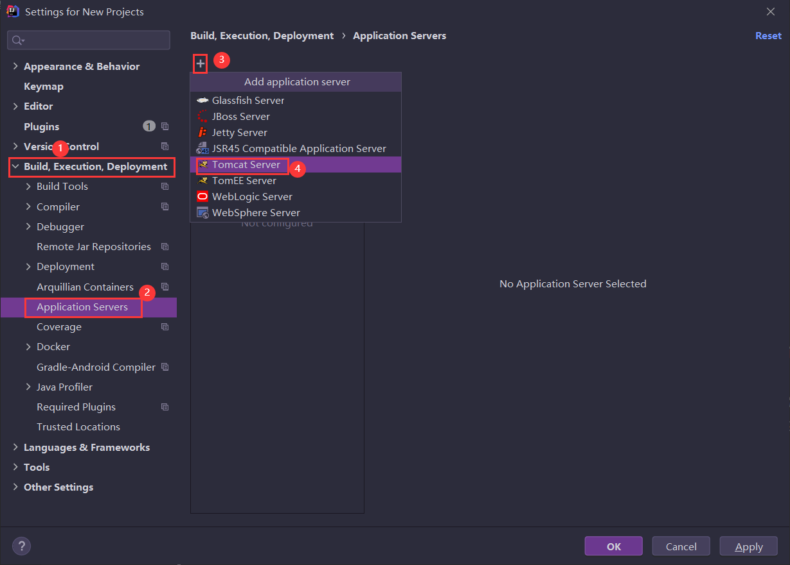

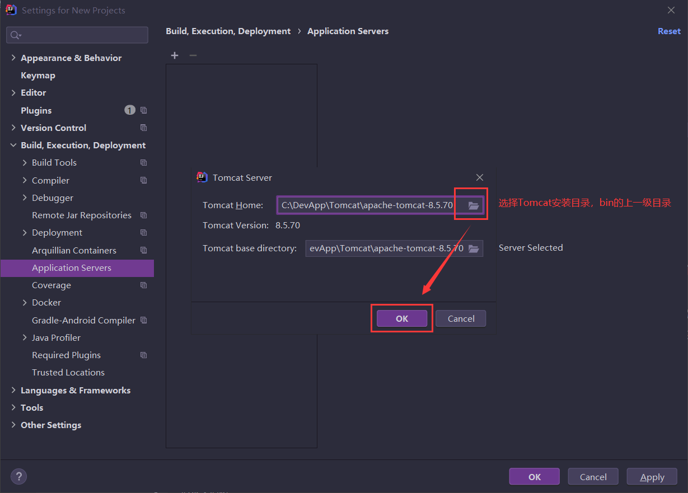

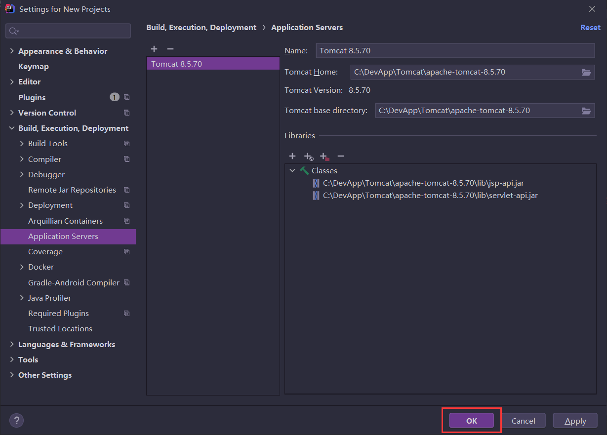

## 四、HTTP协议  面试

### 4.1、概述

> HTTP(hypertext transport protocol)，即超文本传输协议。这个协议详细规定了浏览器和万维网服务器之间互相通信的规则。
>
> HTTP就是一个通信规则，通信规则规定了客户端发送给服务器的内容格式，也规定了服务器发送给客户端的内容格式。我们要学习的就是这个两个格式。客户端发送给服务器的格式叫“请求协议”；服务器发送给客户端的格式叫“响应协议”。
>
> HTTP协议的特点：
>
> * 支持客户端（浏览器）/服务器模式。   
> * 简单快速：客户端只向服务器发送请求方法和路径，服务器即可响应数据，因而通信速度很快。请求方法常用的有**GET**、**POST**等。
> * 灵活：HTTP允许传输任意类型的数据，传输的数据类型由Content-Type标识。
> * 无连接：无连接指的是每次TCP连接只处理一个或多个请求，服务器处理完客户的请求后，即断开连接。采用这种方式可以节省传输时间。
>   * HTTP1.0版本是一个请求响应之后，直接就断开了。称为**短连接**。 **面试题**
>   * HTTP1.1版本不是响应后直接就断开了，而是等几秒钟,这几秒钟之内有新的请求，那么还是通过之前的连接通道来收发消息，如果过了这几秒钟用户没有发送新的请求，就会断开连接。称为**长连接**。 **面试题**
>
>
> - 无状态：HTTP协议是无状态协议。          WebSocket 
>
>   - 无状态是指协议对于事务处理没有记忆能力。

### 4.2、请求协议

> 请求协议或者请求报文
>
> 客户端发送给服务器的格式
>
> 格式：
>
> ```
> 请求首行
> 请求头信息
> 空行
> 请求体
> ```
>
> 分类： **面试** 
>
> * GET 
>   * 可以在请求的URL地址后以?的形式带上交给服务器的数据，多个数据之间以&进行分隔；
>   * 在URL地址后附带的参数是有限制的，其数据容量通常不能超过1K；
>   * GET请求没有请求体。
>   * 
> * POST
>   * 传送的数据量无限制；
>   * 传输的数据在请求体内。

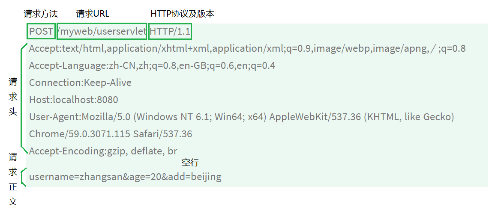

### 4.3、响应协议

> 服务器发送给客户端的格式
>
> 格式：
>
> ```
> 响应首行
> 响应头信息
> 空行
> 响应体
> ```
>
> 常见响应码   **面试**
>
> * **200：请求成功，浏览器会把响应体内容（通常是html）显示在浏览器中**
> * **404：请求的资源没有找到，说明客户端错误的请求了不存在的资源**
> * **500：请求资源找到了，但服务器内部出现了错误  （服务端的代码出错了）**
> * **302：重定向**
> * 304：如果再次访问的页面没有经过修改，返回304

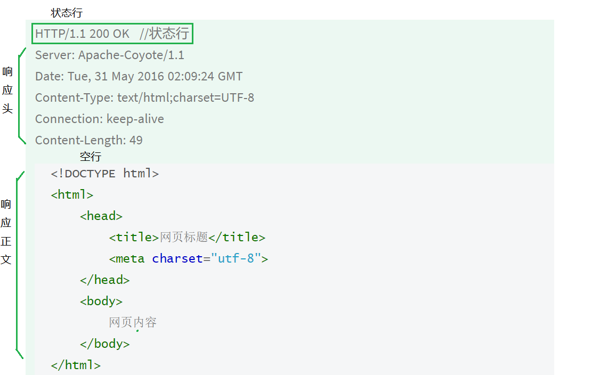

## 五、IDEA创建Web项目

> 此处以Idea 2020.3举例

### 5.1、新建普通Java项目


> 注意：Idea2020无法直接新建JavaWeb项目，只能通过新建普通Java项目的方式间接新建JavaWeb项目。
>
> 选择项目位置和普通Java项目相同，此处略过。

### 5.2、修改普通Java项目为JavaWeb项目

> 项目根目录->右键->Add Framework Support


> 选择JavaEE版本


> 勾选左侧的Web Application


> 完成之后，可以看到项目下新建了web目录，并包含如下内容。

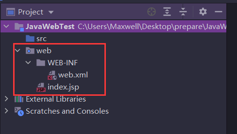

> 

### 5.3、项目部署

> 此处指的是将Idea中开发的Web项目在Tomcat中部署。

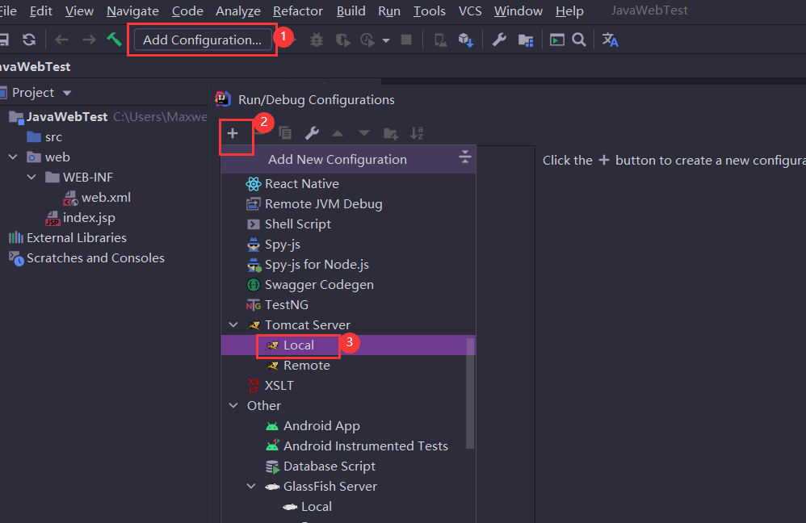

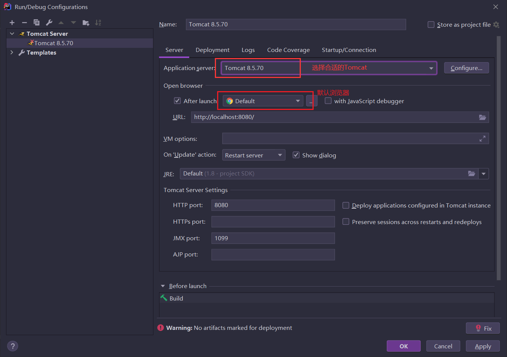

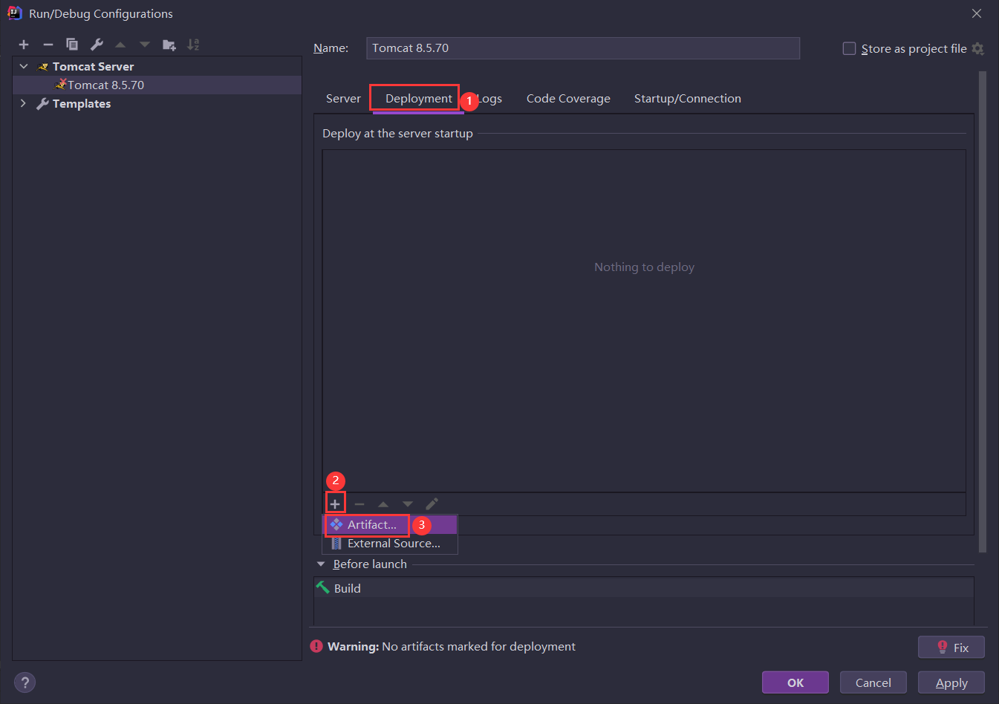

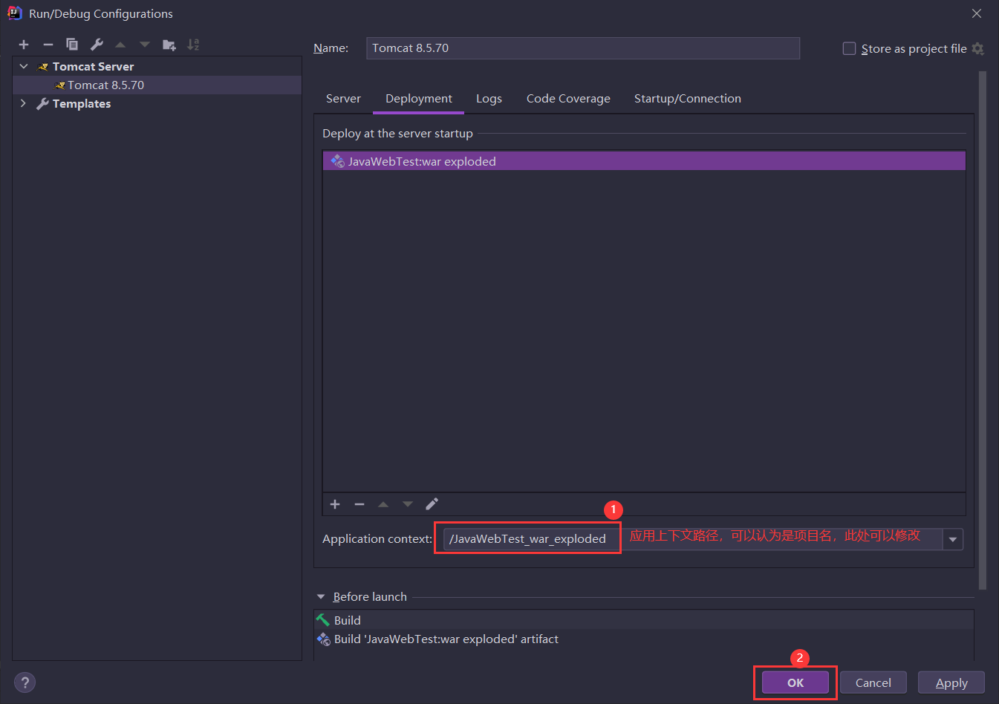

> 修改index.jsp的代码

```jsp
<%@ page contentType="text/html;charset=UTF-8" language="java" %>
<html>
  <head>
    <title>Index</title>
  </head>
  <body>
      <%
		String name = "张三";
		out.print("<p>" + name + "</p>");
	  %>
      <p>Hello JavaWeb</p>
  </body>
</html>
```

### 5.4、项目运行

> 单击运行按钮，运行项目，默认会在浏览器中打开index.jsp

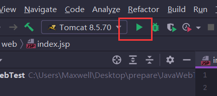

> **在以后的开发中，多数时候都是重复上述步骤进行JavaWeb项目的开发。**

### 5.5、其他操作   重点****

#### 5.5.1、关联第三方Jar包  

> 1. 在项目WEB-INF目录下新建lib目录；
> 2. 将第三方Jar包（例如：MySQL驱动Jar包，druid连接池Jar包）拷贝到lib目录下；
> 3. 在lib上右键`Add as Library`；
> 4. 选择Project Library，完成
>    * Global Library表示所有工程都可以使用
>    * **Project Library表示当前工程中所有模块都可以使用**
>    * Module Library表示当前模块可以使用
>

#### 5.5.2、导出war包

> 项目完成后，有时候需要打成war方便部署。war包可以直接放入Tomcat的webapps目录中，启动Tomcat后自动解压，即可访问。

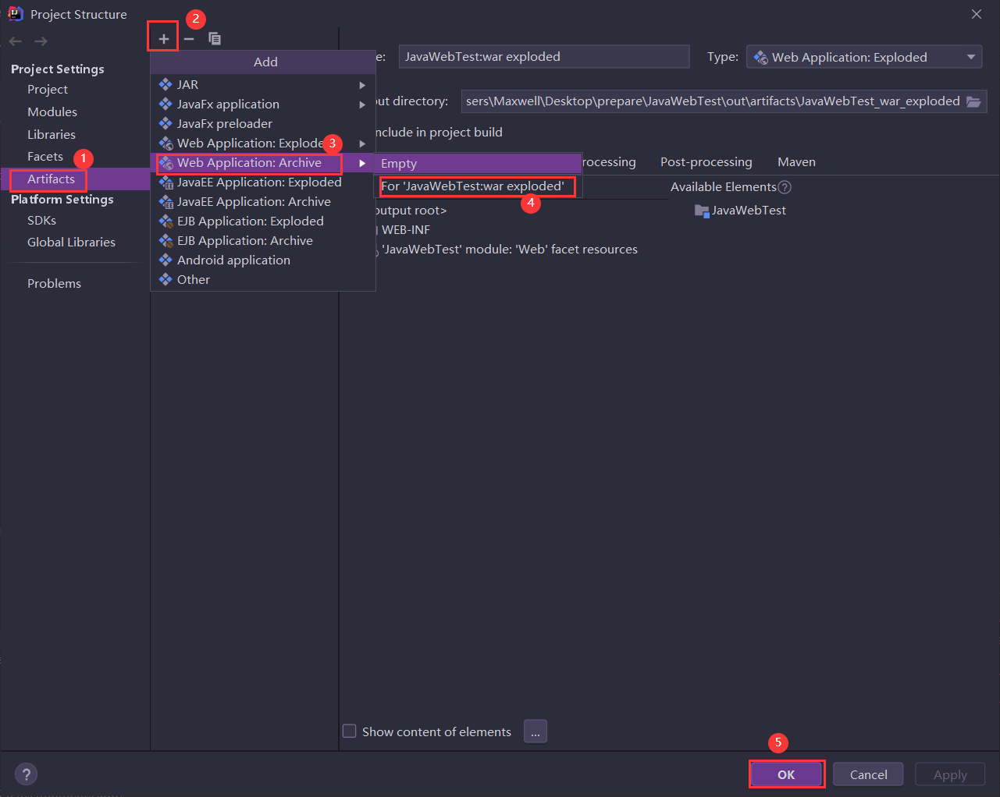

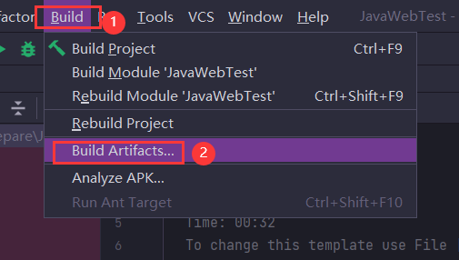

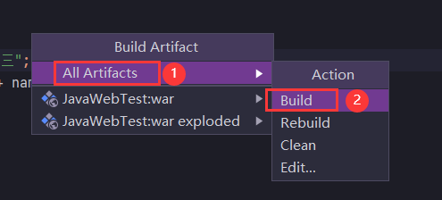

> 执行上述操作，后在项目根目录下生成out目录，内部包含的war包就是我们需要的war包。

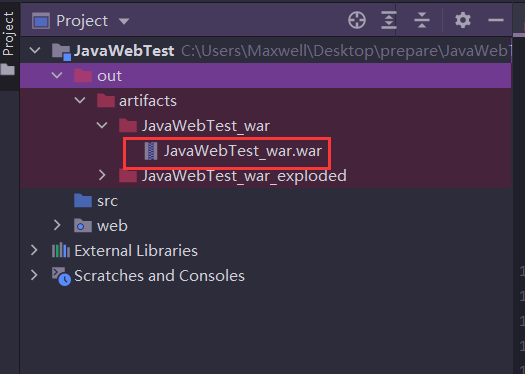

> 将该war包拷贝到tomcat的webapps目录下，双击运行startup.bat，tomcat会**自动解压**该war包并发布项目，发布之后我们就可以访问。

