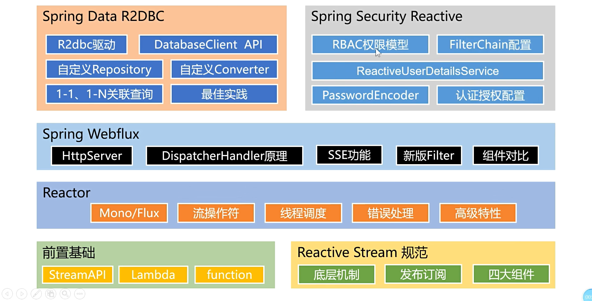

<LockArticle :highHeightPercent="0.1"/>

# 前置知识

## 学习内容



互联网有三高

高并发（有三宝）：缓存、异步、队排好

高可用：分片、复制、选领导


## 前置知识

### 1、lambda表达式

### 2、function函数

在java.util.function包下

#### 1、【消费者】有入参，无出参   function.accept()

```java
@FunctionalInterface
public interface BiConsumer<T, U> {
    void accept(T var1, U var2);
}

BiConsumer<String ,String> bi = (a1,a2)->{
	System.out.println(a1+a2);
};
bi.accept("hello","world");
```

#### 2、【多功能函数】有入参，有出参  function.apply()

```java
@FunctionalInterface
public interface Function<T, R> {
    R apply(T var1);
}

Function<String,String> function = a->a;
System.out.println(function.apply("zs"));
```

#### 3、【提供者】无入参，有出参 function.get()

```java
@FunctionalInterface
public interface Supplier<T> {
    T get();
}

Supplier<String> supplier = ()->UUID.randomUUID().toString();
System.out.println(supplier.get());
```

#### 4、【普通函数】无入参，无出参

```java
@FunctionalInterface
public interface Runnable {
    void run();
}

new Thread(()->{
    System.out.println("aaa");
}).start();
```

#### 5、【断言】有入参，返回布尔 function.test()

```java
@FunctionalInterface
public interface Predicate<T> {
    boolean test(T var1);
}

Predicate<Integer> predicate = a -> a > 10;
//正向判断
System.out.println(predicate.test(15));
//反向判断
System.out.println(predicate.negate().test(15));
```

#### 6、案例

```java
 public static void main(String[] args) {
        //1、定义一个提供者函数
        Supplier<String> supplier = () -> "46";
        //System.out.println(supplier.get());

        //2、定义一个断言验证是否是数字
        Predicate<String> isNumber = (a) -> a.matches("-?\\d+(\\.\\d+)?");

        //3、把字符串编程数字
        Function<String, Integer> change = Integer::parseInt;

        //4、打印数字是偶数还是基数
        Consumer<Integer> consumer = (number) ->{
            if(number % 2 ==0){
                System.out.println(number + "是偶数");
            }else {
                System.out.println(number + "是奇数");
            }
        };

        if(isNumber.test(supplier.get())){
            consumer.accept(change.apply(supplier.get()));
        }else {
            System.out.println("非法的数字");
        }
    }
```

### 3、streamAPI

#### 1、特点

流是lazy的，不拿到最终结果，流是不会被调用的

```java
public static void main(String[] args) {
  List<Integer> integers = Arrays.asList(1,2,3,4,5,6);
      integers.stream()
              .filter(els -> els % 2 == 0)
              .max(Integer::compareTo)
              .ifPresent(System.out::println);
}
```

#### 2、流是并发的还是不并发的？和for有啥区别

默认是不并发的，也可以支持并发，使用.parallel()


##### 1、默认是不并发的

```java
 public static void main(String[] args) {
        List<Integer> integers = Arrays.asList(1, 2, 3, 4, 5, 6);
        integers.stream()
                .filter(els -> {
                    System.out.println("filter的线程" + Thread.currentThread());
                    return els % 2 == 0;
                })
                .count();
    }

运行结果：
filter的线程Thread[main,5,main]
filter的线程Thread[main,5,main]
filter的线程Thread[main,5,main]
filter的线程Thread[main,5,main]
filter的线程Thread[main,5,main]
filter的线程Thread[main,5,main]
```


##### 2、支持并发 .parallel()   //并发流，但是要自行解决多线程安全问题

```java
 public static void main(String[] args) {
        List<Integer> integers = Arrays.asList(1, 2, 3, 4, 5, 6);
        integers.stream()
                .parallel()   //并发流
                .filter(els -> {
                    System.out.println("filter的线程" + Thread.currentThread());
                    return els % 2 == 0;
                })
                .count();
    }

运行结果：
filter的线程Thread[main,5,main]
filter的线程Thread[main,5,main]
filter的线程Thread[main,5,main]
filter的线程Thread[ForkJoinPool.commonPool-worker-1,5,main]
filter的线程Thread[main,5,main]
filter的线程Thread[ForkJoinPool.commonPool-worker-1,5,main]
```

##### 3、支持并发后可能带来的线程安全的问题

```java
public static void main(String[] args) {
        List<Integer> integers = Arrays.asList(1, 2, 3, 4, 5, 6);

        ArrayList<Integer> newArr = new ArrayList<>();
        
        integers.stream()
                .parallel()   //并发流
                .filter(els -> {
                    System.out.println("filter的线程" + Thread.currentThread());
                    
                    newArr.add(els);  //这会带来线程安全问题，这种数据称为有状态的数据
                    //有状态的数据都会产生线程安全问题
                    //流的所有操作都是无状态的，数据状态仅在此函数内有效，不溢出至函数外
                    
                    return els % 2 == 0;
                })
                .count();
}
```

如果要解决.parallel()   并发的问题 ，需要在里边使用锁                    /             或者不使用.parallel()   让流不并发

```java
 public static void main(String[] args) {
        List<Integer> integers = Arrays.asList(1, 2, 3, 4, 5, 6);

        ArrayList<Integer> newArr = new ArrayList<>();

        integers.stream()
                .parallel()   //并发流
                .filter(els -> {
                    
                    //加锁解决线程不安全问题
                    synchronized (Object.class){
                        System.out.println("filter的线程" + Thread.currentThread());
                        newArr.add(els);  //这会带来线程安全问题
                        return els % 2 == 0;
                    }
                    
                    
                })
                .count();
}
```


#### 3、中间操作

- filter： 过滤，无条件遍历流中的每一个元素
- map：映射：一一映射，a变成b
  - mapToInt、mapToLong、mapToDouble
- flatMap： 打散、散列、展开、扩维：一对多映射
- peek:中间操作，传入consumer，可以输出操作，soutc
- takewhile，与filter作用相同，不过当满足条件，拿到这个元素，不满足直接结束

```java
List<Persion> list = Arrays.asList(
    new Persion("张 三", "男", 19),
    new Persion("张 五", "女", 10),
    new Persion("张 六", "男", 18),
    new Persion("张 七", "男", 21),
    new Persion("张 八", "男", 22)
);
//挑出年龄大于18的人
list.stream()
    .filter(p -> p.getAge() > 18)
    .peek(System.out::println)
    .map(Persion::getName)
    .peek(System.out::println)
    .flatMap(els->Arrays.stream(els.split(" ")))
    .distinct()
    .limit(2)
    .sorted(String::compareTo)
    //.flatMap()
    .forEach(System.out::println);


List<Persion> collect = list.stream().filter(i -> i.getAge() > 2).collect(Collectors.toList());
//无条件遍历流中的每一个元素
System.out.println(collect);

List<Persion> collect1 = list.stream().takeWhile(i -> i.getAge() > 2).collect(Collectors.toList());
//当满足条件，拿到这个元素，不满足直接结束
System.out.println(collect1);
```

- collect(Collectors.groupingBy(e->e.getGender()))

```java
Map<String, List<Persion>> map = 
    list.stream()
        .filter(i -> i.getAge() > 2)
        .collect(Collectors.groupingBy(e -> e.getGender()));
System.out.println(map);
```


