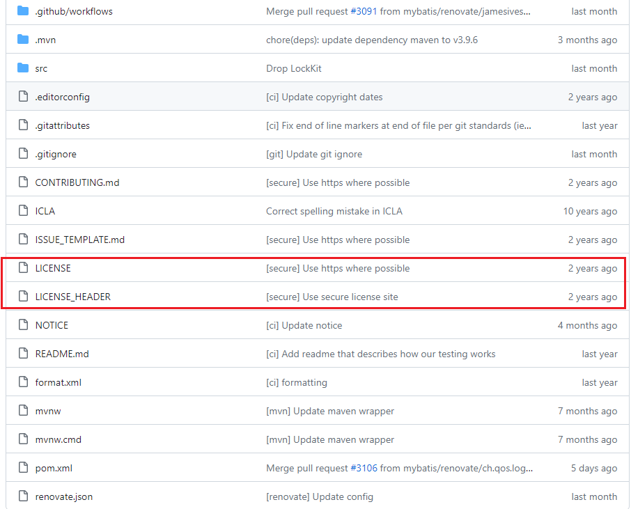
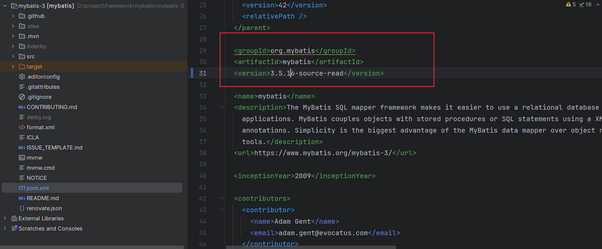
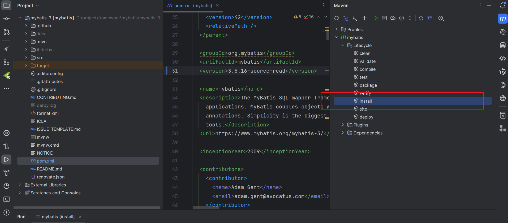
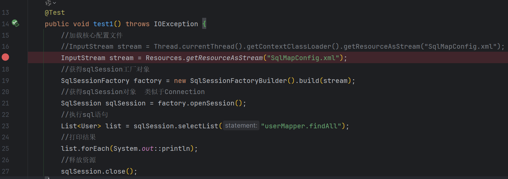

# Mybatis源码

## 1、ClassLoader类加载器

### 1.1、类加载器主要分为四类，按照父子顺序分别是

> 1、Boostrap ClassLoader  ->主要加载jre下lib下的jar，例如rt.jar
>
>  |
>
> 2、Extension ClassLoader(加载额外的jar包的加载器) -> 主要加载jre下的/lib/ext下的jar包
>
> |
>
> 3、AppClassLoader 系统类加载器(加载classPath下的jar包，也就是通过maven引入的依赖包)
>
> |
>
> 4、Custom ClassLoader(自定义的类加载器)

### 1.2、双亲委派机制

比如要加载spring.class文件，首先会通过appClassLoader向上传递信号，appClassLoader会让ExtClassLoader加载，ExtClassLoader接收到之后,ExtClassLoader不加载,会让Boostrap ClassLoader加载，如果Boostrap ClassLoader 加载到了，则不继续向下传递，如果没加载到，那么让ExtClassLoader加载，如果ExtClassLoader加载到了，则不向下传递，如果没加载到，则传递给AppClassLoader加载

双亲委派机制就是先由下级传递信号让父级的加载器先加载，加载不到在向下传递信号让下级类加载器加载，目的是为了保护基础的jre包下的class正常加载，加入自己写了一个String.class文件，在类加载的时候会一级一级向上传递，最后由Boostrap ClassLoader加载到jre里的String.class文件，而不会加载自己写的String.class,起到了保护作用

### 1.3、获取类加载器的方式

```java
A.getClass().getClassLoader();
Thread.currentThread().getContextClassLoader()
ClassLoader.getSystemClassLoader();
```

## 2、Mybatis源码解析

### 2.1、阅读源码指导原则

寻找入口-->断电跟踪-->先粗后细-->精略结合-->猜想验证

### 2.1、下载mybatis源码，地址[mybatis源码](https://github.com/mybatis/mybatis-3)

(下载mybatis源码是为了在读mybatis源码的时候标记注释)



#### 2.1.1、删除掉lincense文件，防止编译报错，编译之前需提前设置好jdk与maven，**mybatis-3.5.16支持jdk11+,maven3.9.6+**

#### 2.1.2、修改pom文件，防止maven引入的mybatis搞混



#### 2.1.3、执行maven install



### 2.2、入口程序编写

#### 详情请看[MyBatis快速入门](https://tec.hjcwzx.top/%E6%A1%86%E6%9E%B6/Mybatis/01_MyBatis%E5%BF%AB%E9%80%9F%E5%85%A5%E9%97%A8.html)

#### 2.3、断点跟踪




