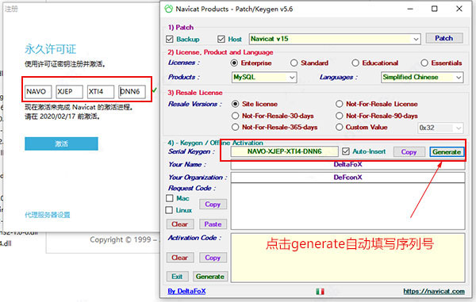
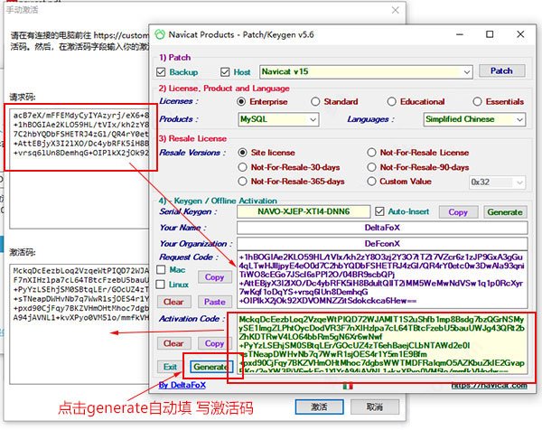

# MySQL客户端工具

> 多数时候使用SQL语句对数据库进行操作不是很方便，特别是在查询操作时，显示的内容不够直观，此时我们需要借助图形化工具对数据库进行操作。
>
> 操作MySQL常用的图形工具如下：
>
> * Navicat for MySQL；
> * SQLyog。

## 一、Navicat for MySQL

> Navicat是一套快速、可靠的数据库管理工具，专为简化数据库的管理及降低系统管理成本而设。它的设计符合数据库管理员、开发人员及中小企业的需要。Navicat 是以直觉化的图形用户界面而建的，让你可以以安全并且简单的方式创建、组织、访问并共用信息。
>
> 可以用来对本机或远程的MySQL、SQL Server、SQLite、Oracle数据库及PostgreSQL数据库进行管理及开发。
>
> Navicat for MySQL是一套专为MySQL设计的高性能数据库管理及开发工具。

### 1.1、安装

> 傻瓜式安装，下一步就可以。

### 1.2、激活

> 1. Navicat安装完毕后**先不要打开**，断开网络，将激活工具复制到Navicat安装路径下，**以管理员身份运行**；
> 2. 在弹出界面选择Navicat 15 Products选择MySQL，Languages选择Simplefied Chinese 点击Patch；


> 3. 打开Navicat，点击注册;

   

> 4. 返回到激活工具界面，点击Generate会自动填写注册码到软件输入框;

   

> 5. 再点击激活按钮，点击手动激活；

   

> 6. 将请求码复制到激活工具的文本框中，点击Generate激活码会自动填写到Navicat激活码文本框中，点击激活即可。

   

```properties

```

