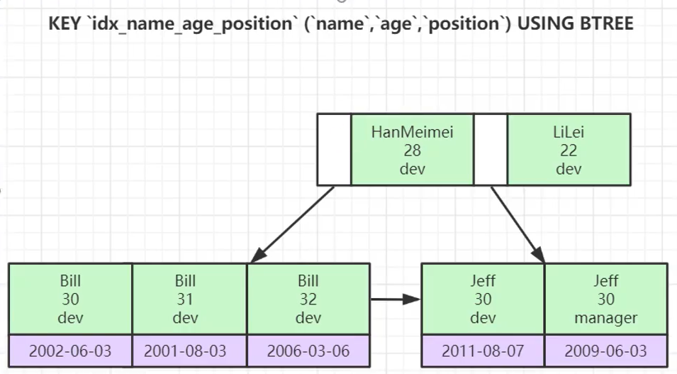
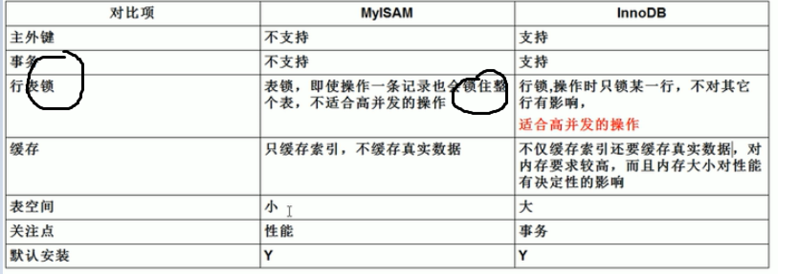
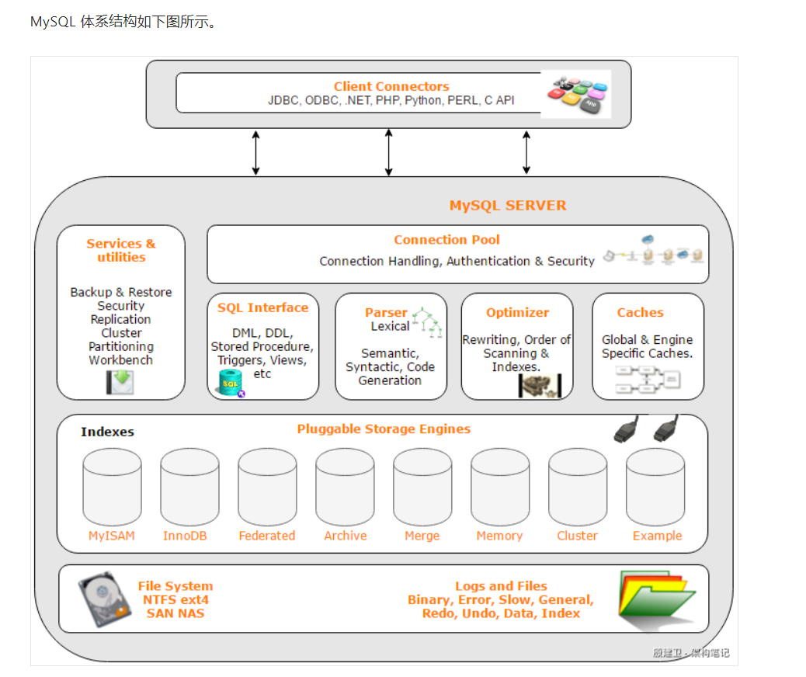

# Mysql高级篇-索引优化
**为什么用索引？数据量大时，索引可以提升查询速度**

**索引适用场景：**

**适合加索引的情况：表记录多，频繁作为查询条件的字段可以添加索引，且主键自动添加索引**
**不适合加索引的情况：表记录少、频繁更新的字段、区分度低的字段（age）**  

**数据库索引的结构默认是B+Tree**（二叉或红黑树，接近于链表，B-Tree存数据少,B+Tree 存储数据量多，叶子节点有顺序） ，Hash （等值查询快，范围查询慢） 

**辅助索引(普通索引)比聚集索引（主键索引）查询慢，原因是辅助索引有回表查询**

**mysql默认的慢查询时间10s**

**explain：查看sql执行计划,分析sql执行性能**

**创建索引： create index 索引名 on 表名 (列名)**

**执行计划中的type取值类型？**

**system>const>eq_ref>ref>range>index>all     ，range是最低要求**

**SQL优化的方式？**

​	**最左前缀法则   (建组合索引的时候，区分度最高的在最左边),order by /group by 遵循此法则**

​	**索引列不能运算**    

​	**索引列类型避免自动转换**

​	**!=查询，左模糊或全模糊查询，非空查询，or查询，少用此类查询，优化方案是用覆盖索引优化**

​	**其中模糊查询可以使用es，or查询可以使用union**          

**mysql默认的执行引擎是innodb**


## 一：索引

### 1.0：大表数据查询存在的问题


   select count(*) 和count(1),count(列名)区别

### 1.1：什么是mysql索引

> 索引：排序好的可以提供快速查询的数据结构
>
> 就像新华字典的目录，快速查找内容


### 1.2：创建索引语法

```sql
#创建单列索引
CREATE INDEX idx_name on user(name)
#创建多列索引
CREATE INDEX idx_name_age on user(name,age)

 # 创建索引
alter table user add index index_email (email) ;

#唯一索引(字段值可以为null)
CREATE UNIQUE INDEX index_phone ON user (phone) ;    # unique 唯一索引 
alter table user add unique (phone) ;
 
#主键索引(字段值不能为null)    只要设置了主键id，主键id就会自已生成  
CREATE PRIMARY KEY INDEX index_phone ON user (phone) ;      
alter table user add primary key (phone) ;


#查看索引
show index from user
#删除索引
DROP index index_name on user

#添加索引注意事项
适合加索引的情况：主键自动添加索引，频繁作为查询条件的字段
不适合加索引的情况：表记录少、频繁更新的字段、区分度低的字段  （age  男 女）
```

  


### 1.3：索引的数据结构

> 数据结构在线学习网站：https://www.cs.usfca.edu/~galles/visualization/Algorithms.html

#### 1.3.1：hash表

优点：等值查找块

缺点：不适合范围查询

**mysql默认的索引结构并不是hash而是btree**

#### 1.3.2：二叉搜索树(O(logn))   Binary Search

缺点：

1:极端情况下二叉查找树会退变成链表(	O(n)	)

2:大表会导致树的深度很深

#### 1.3.3：红黑树（平衡二叉树）        Red Black Tree

缺点：当数据量达到上千万级别的时候，树的深度太深，查询效率还是慢

#### 1.3.4：B(balance)-Tree

```txt
前置知识：B-Tree是为磁盘等外存储设备设计的一种平衡查找树。因此在讲B-Tree之前先了解下磁盘的相关知识。
系统从磁盘读取数据到内存时是以磁盘块（block）为基本单位的，位于同一个磁盘块中的数据会被一次性读取出来，而不是需要什么取什么。
InnoDB存储引擎中有页（Page）的概念，页是其磁盘管理的最小单位。InnoDB存储引擎中默认每个页的大小为16KB，可通过参数innodb_page_size将页的大小设置为4K、8K、16K，在MySQL中可通过如下命令查看页的大小：
mysql> show variables like 'innodb_page_size';

```


 ```txt
以根节点为例，关键字为17和35，P1指针指向的子树的数据范围为小于17，P2指针指向的子树的数据范围为17~35，P3指针指向的子树的数据范围为大于35。

模拟查找关键字29的过程：

根据根节点找到磁盘块1，读入内存。【磁盘I/O操作第1次】
比较关键字29在区间（17,35），找到磁盘块1的指针P2。
根据P2指针找到磁盘块3，读入内存。【磁盘I/O操作第2次】
比较关键字29在区间（26,30），找到磁盘块3的指针P2。
根据P2指针找到磁盘块8，读入内存。【磁盘I/O操作第3次】
在磁盘块8中的关键字列表中找到关键字29。

 ```

 

#### 1.3.5：B+Tree 

B+Tree是在B-Tree基础上的一种优化，使其更适合实现外存储索引结构，InnoDB存储引擎就是用B+Tree实现其索引结构。

```txt
B-Tree的缺点：每个节点中不仅包含key，还有data值。而每一个页的存储空间是有限的，如果data数据较大时将会导致每个节点（即一个页）能存储的key的数量很小，当存储的数据量很大时同样会导致B-Tree的深度较大，增大查询时的磁盘I/O次数，进而影响查询效率。

```


```txt
B+Tree相对于B-Tree有几点不同：
1:非叶子节点只存key信息。
2:所有叶子节点之间都有一个链指针。
3:数据记录都存放在叶子节点中。


可能上面例子中只有22条数据记录，看不出B+Tree的优点，下面做一个推算：
InnoDB存储引擎中页的大小为16KB，一般表的主键类型为INT（占用4个字节）或BIGINT（占用8个字节），指针类型也一般为4或8个字节，也就是说一个页（B+Tree中的一个节点）中大概存储16KB/(8B+8B)=1K个键值,一个深度为3的B+Tree索引可以维护1000*1000 * 1000 = 10亿条记录


```

### 1.4：索引分类

单列索引，多列索引

- **聚集索引(Clustered index)**      -- 主键索引

  > 聚集索引就是按照每张表的主键构造一棵B+树，同时叶子节点中存放的即为整张表的行记录数据。
  
  
  
- **辅助索引（Secondary index）**

  > 除了主键之外其他其他普通字段建立的索引都是辅助索引，辅助索引的特点是叶子节点不存储整条记录，只存储数据主键id，然后**通过主键id回表查询  （拖慢查询的效率）**

  > 辅助索引，也叫非聚集索引。和聚集索引相比，叶子节点中并不包含行记录的全部数据。叶子节点除了包含键值以外，每个叶子节点的索引行还包含了一个书签（bookmark），通过bookmark进行回表操作查询当前行记录
  
  
  
- **覆盖索引（Covering index）**

  > InnoDB存储引擎支持覆盖索引，即从辅助索引中就可以得到查询的记录，而不需要查询聚集索引中的记录。
  >
  > 如果一个索引包含了（或覆盖了）满足查询语句中字段与条件的数据就叫做覆盖索引。
  >
  > name,age
  >
  > select name form tbl  where age=18


```txt
【推荐】利用覆盖索引来进行查询操作，避免回表。
说明：如果一本书需要知道第 11 章是什么标题，会翻开第 11 章对应的那一页吗？目录浏览
一下就好，这个目录就是起到覆盖索引的作用。
正例：能够建立索引的种类：主键索引、唯一索引、普通索引，而覆盖索引是一种查询的一种
效果，用 explain 的结果，extra 列会出现：using index。
```


## 二：慢查询日志

**mysql默认的慢查询时间10s**

C:\ProgramData\MySQL\MySQL Server 5.7\Data 默认慢查询日志位置

```txt
MySQL的慢查询日志是记录在MySQL中响应时间超过long_query_time阀值的的SQL，并记录到慢查询日志中。long_query_time的默认值为10，意思是运行10S以上的语句。
默认情况下，Mysql数据库并不启动慢查询日志，需要我们手动来设置这个参数，当然，如果不是调优需要的话，一般不建议启动该参数，因为开启慢查询日志会或多或少带来一定的性能影响。慢查询日志支持将日志记录写入文件，也支持将日志记录写入数据库表。
```

```shell
#查看慢查询是否开启
mysql> show variables  like '%slow_query_log%';
+---------------------+-----------------------------------------------+
| Variable_name       | Value                                         |
+---------------------+-----------------------------------------------+
| slow_query_log      | OFF                                           |
| slow_query_log_file | /home/WDPM/MysqlData/mysql/DB-Server-slow.log |
+---------------------+-----------------------------------------------+
2 rows in set (0.00 sec)
 
#开启慢查询 
mysql> set global slow_query_log=1;
Query OK, 0 rows affected (0.09 sec)
 
mysql> show variables like '%slow_query_log%';
+---------------------+-----------------------------------------------+
| Variable_name       | Value                                         |
+---------------------+-----------------------------------------------+
| slow_query_log      | ON                                            |
| slow_query_log_file | /home/WDPM/MysqlData/mysql/DB-Server-slow.log |
+---------------------+-----------------------------------------------+
2 rows in set (0.00 sec)
 
mysql> 
```

 

使用set global slow_query_log=1开启了慢查询日志只对当前数据库生效，如果MySQL重启后则会失效。如果要永久生效，就必须修改配置文件my.cnf（其它系统变量也是如此）。例如如下所示：

/etc/my.cnf

```shell
#修改my.cnf文件，在[mysqld]下增加或修改参数slow_query_log 和slow_query_log_file后，然后重启MySQL服务器，如下所示
slow_query_log =1
slow_query_log_file=/tmp/mysql_slow.log 
```


那么开启了慢查询日志后，什么样的SQL才会记录到慢查询日志里面呢？  这个是由参数long_query_time控制，默认情况下long_query_time的值为10秒，可以使用命令修改，也可以在my.cnf参数里面修改。关于运行时间正好等于long_query_time的情况，并不会被记录下来。也就是说，在mysql源码里是判断大于long_query_time，而非大于等于

```
mysql> show variables like 'long_query_time%';
+-----------------+-----------+
| Variable_name   | Value     |
+-----------------+-----------+
| long_query_time | 10.000000 |
+-----------------+-----------+
1 row in set (0.00 sec)
 
mysql> set global long_query_time=4;
Query OK, 0 rows affected (0.00 sec)
 
mysql> show variables like 'long_query_time';
+-----------------+-----------+
| Variable_name   | Value     |
+-----------------+-----------+
| long_query_time | 10.000000 |
+-----------------+-----------+
1 row in set (0.00 sec)
如上所示，我修改了变量long_query_time，但是查询变量long_query_time的值还是10，难道没有修改到呢？注意：使用命令 set global long_query_time=4修改后，需要重新连接或新开一个会话才能看到修改值。你用show variables like 'long_query_time'查看是当前会话的变量值，你也可以不用重新连接会话，而是用show global variables like 'long_query_time';
```


log_output 默认值是'FILE',表示将日志存入文件。

log_output='TABLE'表示将日志存入数据库，这样日志信息就会被写入到mysql.slow_log表中。

建议默认

```
mysql> show variables like '%log_output%';
+---------------+-------+
| Variable_name | Value |
+---------------+-------+
| log_output    | FILE  |
+---------------+-------+
1 row in set (0.00 sec)
 
    mysql> set global log_output='TABLE';
Query OK, 0 rows affected (0.00 sec)
 
mysql> show variables like '%log_output%';
+---------------+-------+
| Variable_name | Value |
+---------------+-------+
| log_output    | TABLE |
+---------------+-------+
1 row in set (0.00 sec)
 
mysql> select sleep(5) ;
+----------+
| sleep(5) |
+----------+
|        0 |
+----------+
1 row in set (5.00 sec)
 
mysql> 
 
mysql> select * from mysql.slow_log;
+---------------------+---------------------------+------------+-----------+-----------+---------------+----+----------------+-----------+-----------+-----------------+-----------+
| start_time          | user_host                 | query_time | lock_time | rows_sent | rows_examined | db | last_insert_id | insert_id | server_id | sql_text        | thread_id |
+---------------------+---------------------------+------------+-----------+-----------+---------------+----+----------------+-----------+-----------+-----------------+-----------+
| 2016-06-16 17:37:53 | root[root] @ localhost [] | 00:00:03   | 00:00:00  |         1 |             0 |    |              0 |         0 |         1 | select sleep(3) |         5 |
| 2016-06-16 21:45:23 | root[root] @ localhost [] | 00:00:05   | 00:00:00  |         1 |             0 |    |              0 |         0 |         1 | select sleep(5) |         2 |
+---------------------+---------------------------+------------+-----------+-----------+---------------+----+----------------+-----------+-----------+-----------------+-----------+
2 rows in set (0.00 sec)
 
mysql> 
```


## 三：Sql执行计划

> explain：查看sql执行计划,分析sql执行性能
> 语法：explain+sql


### id

- id列结合table列，可以查看表的加载顺序
- **id相同，按table列从上到下顺序加载**
- **id列不同，id值越大越先被加载**

```sql
-- id相同
explain select * from sys_user u 
left join sys_user_role sur on sur.user_id = u.user_id
left join sys_role sr on sr.role_code = sur.role_id

-- id不同	
EXPLAIN SELECT *  FROM sys_user u
WHERE u.user_id = (
		SELECT DISTINCT sur.user_id
		FROM
			sys_user_role sur
		WHERE
			sur.user_id = '23946449'
);

```


### type[重要]

**一个查询如果达到range或者ref表示这条sql无需优化，需要优化的index,all**
**如果sql的type为all，表示全表扫描，没用到任何索引(没有建立索引、索引失效)，在数据量比较大的情况下，必须优化**

```sql
type:通过什么方式获取数据
效率从好到次：system>const>eq_ref>ref>range>index>all
一个查询如果达到range或者ref表示这条sql无需优化
如果sql的type为all，表示全表扫描，没用到任何索引(没有建立索引、索引失效)，在数据量比较大的情况下，必须优化

--system
explain SELECT * from mysql.proxies_priv
从系统库mysql的系统标proxies_priv里查询数据，这里的数据在Mysql服务启动时候已经加载在内存中，不需要进行磁盘IO。

-- const：主键查询，查出的结果为单条记录
EXPLAIN SELECT * from sys_user where user_id = '1'
建议：
1：一张表必须要有主键
2：尽量根据id等值查询

-- eq_ref 多表连接中被驱动表的连接列上有primary key或者unique index的检索
EXPLAIN SELECT * from sys_user_role sur 
LEFT JOIN sys_user u on u.user_id = sur.user_id
-- 讲解 left join 和 right join 的区别

前表sys_user_role表中的每一行（row），对应后sys_user表只有一行被扫描，这类扫描的速度也非常的快

--ref: 非主键非唯一索引等值扫描
DROP index index_username on sys_user
ALTER TABLE sys_user add INDEX index_username (user_name)
EXPLAIN SELECT * from sys_user where sys_user.user_name = '客服小薇'

--range 范围查询 between、in、>、>=、<、<=、or
explain SELECT * from sys_user where sys_user.user_name ='客服小薇' or sys_user.user_name ='财政部长' 

--index：全索引扫描
explain SELECT user_id from sys_user 

--all:全硬盘扫描、没用上索引
explain SELECT * from sys_user where password = '123'

```


```txt
【推荐】SQL 性能优化的目标：至少要达到 range 级别，要求是 ref 级别，如果可以是 consts
最好。
说明：
1）consts 单表中最多只有一个匹配行（主键或者唯一索引），在优化阶段即可读取到数据。
2）ref 指的是使用普通的索引（normal index）。
3）range 对索引进行范围检索。
反例：explain 表的结果，type=index，索引物理文件全扫描，速度非常慢，这个 index 级
别比较 range 还低，与全表扫描是小巫见大巫。
```


### possible_keys

> 理论上会用到哪些索引

### keys

> 实际上用到的索引

```sql
#理论上用到，实际也用到    意料之中
EXPLAIN select * from sys_user where sys_user.user_name ='xx'


#理论上用到，实际没用到【索引失效】  意料之外
EXPLAIN SELECT * FROM sys_user u where u.user_name !='xx'


#理论上不会用，实际用到了    意外收获 
drop  index idx_user_name_account on sys_user; 
create index idx_user_name_account on sys_user(user_name,account)
EXPLAIN select user_name from sys_user

```


### rows

当前查询，扫描了多少行数，也是性能评估的重要依据

```sql

-- 加索引和不加索引比较
-- explain select * from sys_user where user_name ='客服小薇' 

-- explain select * from sys_user where password ='客服小薇' 

rows值越大效率越低

```


### extra

> Using index、Using where 、Using filesort、Using temporary、

```sql
drop index index_username_account on sys_user;
create index index_username_account on sys_user(user_name,account);


-- 条件
Using where:没有加索引的字段进行过滤
explain select * from sys_user where `password` = 'admin' 
explain select user_name from sys_user    --Using-index
explain select user_name from sys_user where password='admin'  -- Using-where

Using index:查询列被索引覆盖
explain select user_name from sys_user where  user_name ='jack'
explain select user_name from sys_user                         -- 查询列被索引覆盖


-- 排序
Using filesort:Using filesort通常出现在order by，当试图对一个不是索引的字段进行排序时，mysql就会自动对该字段进行排序，这个过程就称为“文件排序”
explain select account from sys_user ORDER BY account desc     --Using filesort
explain select * from sys_user ORDER BY user_name desc         --Using filesort
explain select user_name from sys_user ORDER BY user_name desc --Using-index

-- 分组
Using temporary:表示在查询过程中产生了临时表用于保存中间结果。mysql在对查询结果进行排序时会使用临时表，常见于group by。

explain select user_type from sys_user group by user_type  --Using temporary
explain select user_name,count(1) from sys_user group by user_name --Using-index

```


## SQL优化

> 很多情况下，不是加了索引就可以高枕无忧，sql在很多情况下会导致索引失效

### 最左前缀法则   (建组合索引的时候，区分度最高的在最左边)

测试数据

```sql
DROP TABLE if EXISTS employee;

CREATE TABLE employee (
	id INT (11) NOT NULL auto_increment,
	NAME VARCHAR (24) NOT NULL DEFAULT '' COMMENT '姓名',
	age INT (11) NOT NULL DEFAULT 0 COMMENT '年龄',
	position VARCHAR (20) NOT NULL DEFAULT '' COMMENT '职位',
	hire_time TIMESTAMP NOT NULL DEFAULT CURRENT_TIMESTAMP COMMENT '入职时间',
	PRIMARY KEY (id),
	KEY idx_name_age_position (NAME, age, position) USING BTREE
) ENGINE = INNODB auto_increment = 4 DEFAULT charset = utf8 COMMENT = '员工表';

insert into employee(name,age,position,hire_time)values('LiLei',22,'manager',NOW());
insert into employee(name,age,position,hire_time)values('HanMeiMei',23,'dev',NOW());
insert into employee(name,age,position,hire_time)values('Lucy',23,'dev',NOW());
```


联合索引的底层数据结构




```sql

-- EXPLAIN SELECT * from employee where name='Lucy' and age=22 
-- EXPLAIN select * from employee where  position = 'dev'
-- EXPLAIN select * from employee where age=22 and position = 'dev'
-- EXPLAIN select * from employee where age=22 and position = 'dev' and name = 'Lucy'
-- EXPLAIN select * from employee where  position = 'dev' or name = 'Lucy'

```


```txt
 【推荐】建组合索引的时候，区分度最高的在最左边。
正例：如果 where a=? and b=? ，a 列的几乎接近于唯一值，那么只需要单建 idx_a 索引即
可。
说明：存在非等号和等号混合判断条件时，在建索引时，请把等号条件的列前置。如：where a>? 
and b=? 那么即使 a 的区分度更高，也必须把 b 放在索引的最前列。
```


### 索引列不能运算    

```sql
drop index idx_name_age_position on employee
create index idx_name on employee(name)

EXPLAIN SELECT * FROM employee e where left(e.name,4)='Lucy' 
优化
EXPLAIN SELECT * FROM employee e where e.name like 'Lucy%'   
覆盖索引
EXPLAIN SELECT e.name FROM employee e where left(e.name,3)='Luc'


EXPLAIN select * from employee where salary*12>120000
优化
EXPLAIN select * from employee where salary>120000/12

```


### 索引列类型自动转换   (避免出现)

```sql
varchar 类型不加单引号，索引失效
insert into employee(name,age,position,hire_time)values('250',22,'manager',NOW());
-- explain select * from employee where name='250'
-- explain select * from employee where name=250
```

```txt
10. 【推荐】防止因字段类型不同造成的隐式转换，导致索引失效。
```


### !=索引失效   （使用覆盖索引）

name值 ，给name建了索引   name!="a"

a ->ab-> b->  ba -> bc       排序完，不是连续的

```sql
EXPLAIN SELECT * FROM employee e where e.name!='Lucy' 
EXPLAIN SELECT * FROM employee e where e.name not in ('Lucy')

优化：使用覆盖索引  index
EXPLAIN SELECT e.name FROM employee e where e.name!='Lucy'  --覆盖索引能让效率稍微提高点
```


### 非空判断失效 (使用覆盖索引)

```sql
EXPLAIN SELECT * FROM employee e where e.name is  not NULL
EXPLAIN SELECT * FROM employee e where e.name is   NULL

-1 表示null 


优化：使用覆盖索引
EXPLAIN SELECT e.name FROM employee e where e.name is  not NULL


```


### 模糊查询   (少用全模糊或左模糊，优化方案覆盖索引，推荐的是es)

```sql
EXPLAIN SELECT * FROM employee e where e.name like 'Lu%'   -- 索引有效

EXPLAIN SELECT * FROM employee e where e.name like '%Lu%'   -- 索引无效，优化方案使用覆盖索引

优化：使用覆盖索引
EXPLAIN SELECT e.name FROM employee e where e.name like '%Lu%'  
```

```txt
【强制】页面搜索严禁左模糊或者全模糊，如果需要请走搜索引擎来解决。  （es）
说明：索引文件具有 B-Tree 的最左前缀匹配特性，如果左边的值未确定，那么无法使用此索
引。
```


### 少用or  （优化方案覆盖索引，更优的是union）

```sql
EXPLAIN SELECT * from employee where name ='Lucy' or name ='Bill'

优化1：使用覆盖索引
EXPLAIN SELECT name from employee where name ='Lucy' or name ='Bill'

EXPLAIN
SELECT * from employee where name ='Lucy'
UNION
SELECT * from employee where name ='Bill'

```


### order by，group by   （遵循最左前缀法则）

```sql
order by :遵循最左前缀法则

EXPLAIN SELECT name from employee ORDER BY age  --age并不是全局有序
EXPLAIN SELECT name from employee ORDER BY name 


```


name gender age phone    (唯一索引)   create unique index aaaa on table(name,gender,age,phone)

```txt
【强制】业务上具有唯一特性的字段，即使是多个字段的组合，也必须建成唯一索引。
说明：不要以为唯一索引影响了 insert 速度，这个速度损耗可以忽略，但提高查找速度是明
显的；另外，即使在应用层做了非常完善的校验控制，只要没有唯一索引，根据墨菲定律，必
然有脏数据产生。


11. 【参考】创建索引时避免有如下极端误解：
1）宁滥勿缺。误认为一个查询就需要建一个索引。
2）宁缺勿滥。误认为索引会消耗空间、严重拖慢更新和新增速度。
3）抵制惟一索引。误认为业务的惟一性一律需要在应用层通过“先查后插”方式解决。
```


## Myisam与innodb的区别

默认的执行引擎是innoDB

> Myisam与innodb是表级别的不是数据库级别的执行引擎





## Mysql的体系结构




