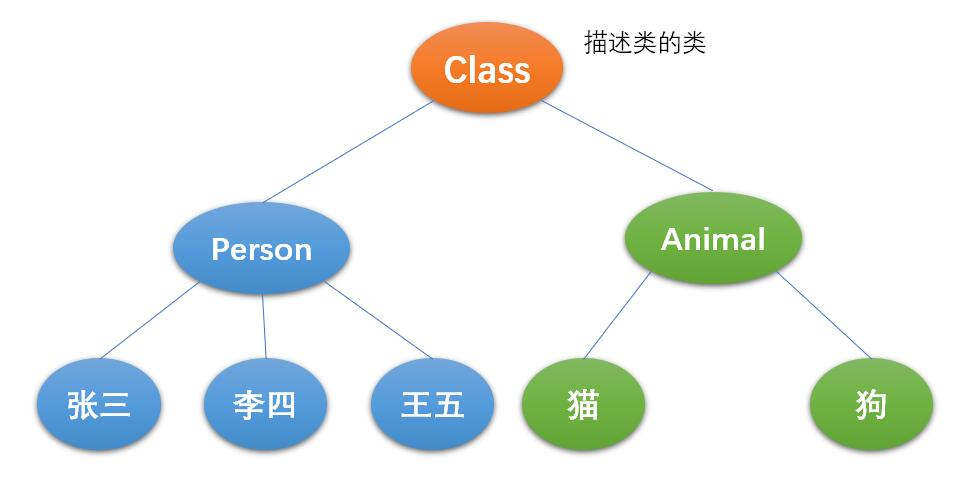

# 反射
## 一、Java反射机制概述

### 1.1、概述

> `Reflection`(反射)是被视为**动态语言**的关键，反射机制允许程序在执行期借助于`Reflection API`取得任何类的内部信息，并能直接操作任意对象的内 部属性及方法。
>
> 加载完类之后，在堆内存的方法区中就产生了一个`Class`类型的对象(一个类只有一个`Class`对象)，这个对象就包含了完整的类的结构信息。我们可以通过这个对象看到类的结构。这个对象就像一面镜子，透过这个镜子看 到类的结构，所以，我们形象的称之为：**反射**。
>
> * 正常的方式：引入需要的全类名 -> 通过`new`实例化 -> 取得实例化对象
> * 反射方式：实例化对象 -> 反射相关API -> 得到完整的全类名
>
> 关于动态语言和静态语言：
>
> * 动态语言，是一类在运行时可以改变其结构的语言。例如新的函数、对象、甚至代码可以被引进，已有的函数可以被删除或是其他结构上的变化。通俗点说就是在**运行时代码可以根据某些条件改变自身结构**。例如：Python、JavaScript、C#
> * 静态语言，与动态语言相对应的，运行时结构不可变的语言就是静态语言。如Java、C、 C++。
> * Java不是动态语言，但Java可以称之为**准动态语言**。即Java有一定的动态性，我们可以利用反射机制、字节码操作获得类似动态语言的特性。

### 1.2、反射的应用

> 在框架开发中，都是基于配置文件开发。
>
> 在配置文件中配置了类，可以通过反射得到**类中的所有内容**，可以通过这些内容实现对象的创建，属性的修改，方法的调用。
>
> 类中的所有内容：
>
> * 属性
> * 构造方法
>   * 无参构造方法
>   * 有参构造方法
> * 普通方法

```java
public class Person {
    private String name;
    private int age;
    private String addr;

    //默认构造方法
    //带参数的构造方法
	//get和set

    public void run() {
        System.out.println("run...");
    }
}

public class MyTest1 {
    public static void main(String[] args) {
        //创建对象
        Person person = new Person();
        //调用对象的方法
        person.run();
    }
}

public class MyTest2 {
    public static void main(String[] args) throws Exception {
        //获取Class类的对象
        Class c1 = Class.forName("com.qfedu.test17.Person");
        //通过默认方法创建Person对象
        Object o = c1.newInstance();
        //获取Method
        Method run = c1.getMethod("run", null);
        //执行run方法
        run.invoke(o, null);
    }
}
```

### 1.3、反射涉及的类

> `java.lang.Class`：代表一个类
>
> `java.lang.reflect.Method`：代表类的方法
>
> `java.lang.reflect.Field`：代表类的成员变量
>
> `java.lang.reflect.Constructor`：代表类的构造器

## 二、`Class`类及反射的原理



> `Class`本身也是一个类，一个加载的类在JVM中只会有一个`Class`对象，一个`Class`对象对应的是一个加载到JVM中的一个`.class`文件。
>
> 通过`Class`可以完整地得到一个类中的所有被加载的结构。`Class`类是反射的根源，针对任何你想动态加载、运行的类，唯有先获得相应的`Class`对象。

## 三、反射相关操作

### 3.1、获取`Class`类的实例(重点)

> * `类名.class`效率最高
> * `对象.getClass`
> * `Class.forName("全类名")`可能出现异常

```java
public class MyTest3 {
    public static void main(String[] args) throws ClassNotFoundException {
        //获取Class类对象的三种方式
        //类名.class
        Class<Person> c1 = Person.class;
        System.out.println(c1);

        //对象.getClass() getClass()是Object类中的方法
        Person p = new Person();
        Class<? extends Person> c2 = p.getClass();
        System.out.println(c2);

        //Class.forName(全类名)
        Class<?> c3 = Class.forName("com.qfedu.test17.Person");
        System.out.println(c3);

        System.out.println(c1 == c2);
        System.out.println(c2 == c3);
    }
}
```

> 哪些类型可以有`Class`对象：
>
> * `class`类
> * `interface`接口
> * `[]`数组
> * `enum`枚举
> * `annotation`注解
> * 基本数据类型
> * `void`

### 3.2、创建对象(重点)

> 要创建类的对象，可以`new`，不使用`new`，如何创建？

#### 3.2.1、操作无参数的构造方法

> `Object newInstance() `：调用默认构造函数，返回该`Class`对象的一个实例

```java
public class MyTest4 {
    public static void main(String[] args) throws Exception {
        //获取Class对象
        Class<?> c = Class.forName("com.qfedu.test17.Person");
        //操作默认的构造方法创建对象
        Object o = c.newInstance();
        //判断o是否是Person类的对象
        System.out.println(o instanceof Person);

        Person p = (Person)o;
        p.run();
    }
}
```

#### 3.2.2、操作有参数的构造方法

> `Constructor<T> getConstructor(Class<?>... parameterTypes)`：取得本类的指定形参类型的构造器

```java
public class MyTest5 {
    public static void main(String[] args) throws Exception {
        //获取Class对象
        Class<?> c = Class.forName("com.qfedu.test17.Person");
        //获取有参的构造方法
        Constructor<?> constructor = c.getConstructor(String.class, int.class, String.class);
        //调用有参的构造方法创建对象
        Object o = constructor.newInstance("zs", 12, "qd");
        //判断o是否是Person类的对象
        System.out.println(o instanceof Person);

        Person p = (Person)o;
        p.run();
    }
}
```

### 3.3、获取运行时类的指定结构(重点)

#### 3.3.1、获取属性

> 在反射机制中，可以直接通过`Field`类操作类中的属性，通过`Field`类提供的`set()`和`get()`方法就可以完成设置和取得属性内容的操作。
>
> 通过`Class`类的对象获取`Field`：
>
> * `public Field getField(String name)`：返回此`Class`对象表示的类或接口的指定的`public`的`Field`；
> * `public Field getDeclaredField(String name)`：返回此`Class`对象表示的类或接口的指定的`Field`。
>
> 在`Field`中：
>
> * `public Object get(Object obj)`：取得指定对象`obj`上此`Field`的属性内容；
> * `public void set(Object obj,Object value)`： 设置指定对象`obj`上此`Field`的属性内容。

```java
public class MyTest6 {
    public static void main(String[] args) throws Exception {
        //获取Class对象
        Class<?> c = Class.forName("com.qfedu.test17.Person");
        //操作默认的构造方法创建对象
        Object o = c.newInstance();
        //判断o是否是Person类的对象
        System.out.println(o instanceof Person);

        //获取属性Field
        Field name = c.getDeclaredField("name");
        //设置允许访问
        name.setAccessible(true);
        //设置属性
        name.set(o, "Tom");
        System.out.println(o);
    }
}
```

#### 3.3.2、获取方法

```java
public class MyTest7 {
    public static void main(String[] args) throws Exception {
        //获取Class对象
        Class<?> c = Class.forName("com.qfedu.test17.Person");
        //操作默认的构造方法创建对象
        Object o = c.newInstance();
        //判断o是否是Person类的对象
        System.out.println(o instanceof Person);

        Method method = c.getDeclaredMethod("run", null);
        //执行方法
        method.invoke(o,null);
    }
}
```

#### 3.3.3、综合案例

> 创建配置文件，设置类和要运行的方法，通过反射的方式运行配置文件中的方法

```java
import java.io.FileInputStream;
import java.lang.reflect.Method;
import java.util.Properties;

public class MyTest8 {
    public static void main(String[] args) throws Exception {
        //加载并解析配置文件
        Properties prop = new Properties();
        prop.load(new FileInputStream("a.properties"));

        String myclass = prop.getProperty("myclass");
        String mymethod = prop.getProperty("mymethod");

        //System.out.println(myclass);
        //System.out.println(mymethod);

        //获取Class类的对象
        Class<?> c = Class.forName(myclass);
        //创建Class类的对象的实例对象
        Object o = c.newInstance();
        //获取Method
        Method method = c.getMethod(mymethod, null);
        //执行method
        method.invoke(o,null);
    }
}
```

> 配置文件

```java
myclass=com.qfedu.test17.Person
mymethod=run
```

### 3.4、获取运行时类的完整结构

> 完整结构包括的内容：
>
> * 实现的全部接口
> * 所继承的父类
> * 全部的构造器
> * 全部的方法
> * 全部的`Field`
>
> 获取实现的全部接口：
>
> * `public Class[] getInterfaces()`：获取此对象所表示的类或接口实现的接口
>
> 获得所继承的父类：
>
> * ` public Class getSuperclass()`
>
> 获取全部的构造方法：
>
> * `public Constructor[] getConstructors()`
> * `public Constructor[] getDeclaredConstructors()`
>
> 获取全部的方法：
>
> * ` public Method[] getDeclaredMethods()`
> * `public Method[] getMethods() `
>
> 获取全部的`Field`：
>
> * `public Field[] getFields()`
> * `public Field[] getDeclaredFields()`


