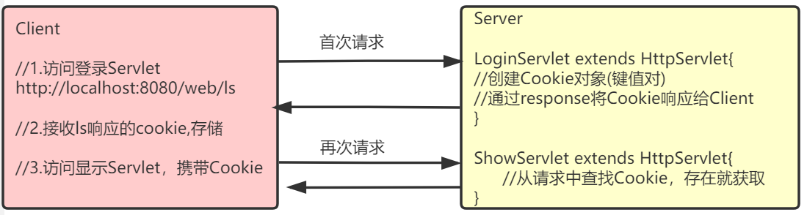

# JSP入门_Cookie_Session

**JSP本质上就是Servlet**

<%   %>  脚本

<%=   %>输出表达式

out  输出内容

Cookie

**1Cookie是服务端产生的**

**2Cookie是存在客户端的**

**3每次访问相同地址时，会携带cookie**

**4不同浏览器之间是不共享Cookie的**

**Session**

**Session是服务器端对象，保存在服务器端。**

**request 请求域**    

**session 会话域**    

**servletContext 应用域**

**Session底层依赖Cookie     sessionid是以cookie形式存在**

**Session常用方法:  setAttribute()   getAttribute()   invalidate()**    

## 一、JSP入门

**1 @WebServlet中加访问路径，要以 /开头**

**2 form中action的地址强烈建议要以"/"开头,后接项目的访问路径,后接资源访问名**

**3 重定向路径 强烈建议要以"/"开头,后接项目的访问路径,后接资源访问名**

**4 请求转发 强烈建议要以"/"开头，后接资源名**

### 1.1、概述

#### 1.1.1、什么是JSP

> JSP（Java Server Pages）是JavaWeb服务器端的**动态资源**。它与HTML页面的作用是相同的，显示数据和获取数据。

虽然JSP用来搭建页面，但是它是后端技术，模板引擎技术。

#### 1.1.2、JSP组成

> JSP=HTML+jsp脚本+JSP动作标签(包含EL表达式)

### 1.2、JSP脚本       重点

> 本质上就是Java代码片段
>
> 分类：
>
> * `  <%...%>`：Java语句      JSP脚本
> * `<%=…%>`：jsp表达式`out.print(...);`   输出表达式
> * `<%!...%>`：Java定义成员变量    
>
> 内置对象（无需创建就可以使用的对象）：
>
> * out对象在JSP页面中无需创建就可以使用，它的作用是用来向客户端输出；
> * `<%=…%>`与out.print()功能是相同的，它们都是向客户端输出

```jsp
<%@ page contentType="text/html;charset=UTF-8" language="java" %>
<html>
<head>
    <title>jsptest</title>
</head>
<body>
<h1>JSP演示</h1>
    <%
        // Java语句
        String s1 = "hello jsp";
        // 不会输出到客户端，而是在服务器端的控制台打印
        System.out.println(s1);
    %>
    <!-- 输出到客户端浏览器上 -->
    输出变量：<%=s1 %><br/>
    输出int类型常量：<%=100 %><br/>
    输出String类型常量：<%="你好" %><br/>
    使用HTML直接输出常量<span>100</span>
</body>
</html>
```

> 在一个JSP中多个<%...%>可以一起使用

```jsp
<%@ page contentType="text/html;charset=UTF-8" language="java" %>
<html>
<head>
    <title>jsp表格</title>
</head>
<body>
    <h1>表格</h1>
    <table border="1" width="50%">
        <tr>
            <th>序号</th>
            <th>用户名</th>
            <th>密码</th>
        </tr>
        <%
            for(int i = 0; i < 5; i++) {
        %>
            <tr>
                <td><%=i+1 %></td>
                <td>user<%=i %></td>
                <td><%=100+1 %></td>
            </tr>
        <%
        	}
        %>
    </table>
</body>
</html>
```

### 1.3、JSP原理      了解

   

> JSP是特殊的Servlet（查看编译后的JSP源码）类，当JSP页面首次被访问时，容器（Tomcat）会先把JSP编译成Servlet，然后再去执行Servlet。所以JSP其实就是一个Servlet。


> 
>
> 
>
> JSP生成的Servlet存放在tomcat的work目录下，它是JSP的“真身”。我们打开看看其中的内容，了解一下JSP的“真身”。
>
> 你会发现，在JSP中的静态信息（例如`<html>`等）在“真身”中都是使用out.write()完成打印！这些静态信息都是作为字符串输出给了客户端。

### 1.4、JSP注释

> `<%-- ... --%>`， 在JSP编译成`.java`时会被忽略的，即JSP注释。
> 可以在JSP页面中使用html注释：`<!-- … -->`，但这个注释在JSP编译成的.java中是存在的，它不会被忽略，而且会被发送到客户端浏览器。

## 二、Cookie  


### 2.1、什么是Cookie

**cookie存储在客户端**

> Cookie翻译成中文是小甜点，小饼干的意思。在HTTP中它表示服务器送给客户端浏览器的小甜点。
>
> Cookie是在浏览器访问Web服务器的某个资源时，由Web服务器在HTTP响应消息头中附带传送给浏览器的一小段数据。一旦Web浏览器保存了某个Cookie，那么它在以后每次访问该Web服务器时，都应在HTTP请求头中将这个Cookie回传给Web服务器。一个Cookie主要由标识该信息的名称（name）和值（value）组成。



### 2.2、Cookie规范   了解

>  单个Cookie大小上限为4KB；
>
> 一个服务器最多在客户端浏览器上保存20个Cookie；
>
> 一个浏览器最多保存300个Cookie；
>
> 上面的数据只是HTTP的Cookie规范，但在浏览器大战的今天，一些浏览器为了打败对手，为了展现自己的能力起见，可能对Cookie规范“扩展”了一些，例如每个Cookie的大小为8KB，最多可保存500个Cookie等！但也不会出现把你硬盘占满的可能！
>
> 注意，不同浏览器之间是不共享Cookie的。也就是说在你使用IE访问服务器时，服务器会把Cookie发给IE，然后由IE保存起来，当你在使用FireFox访问服务器时，不可能把IE保存的Cookie发送给服务器。

### 2.3、关于Cookie的操作      会写

#### 2.3.1、创建Cookie

```java
//创建Cookie
Cookie ck=new Cookie("name", "zs");
ck.setMaxAge(-1);//内存存储， 1
       取值有三种：>0有效期，单位秒
                 ；=0 失效，删除此cookie
                 <0 内存存储,默认-1 关闭浏览器cookie没了
response.addCookie(ck);//添加到response对象中，响应时发送给客户端
```

#### 2.3.2、获取Cookie

```java
//获取所有的Cookie
Cookie[] cks=request.getCookies();
//遍历Cookie
for(Cookie ck:cks){
    //检索出自己的Cookie
    if(ck.getName().equals("name")) {
        //记录Cookie的值
        code=ck.getValue();
        break;
    }
}
```

#### 2.3.3、修改Cookie

> 只需要保证Cookie的名和路径一致即可修改

```java
//修改Cookie
Cookie ck=new Cookie("name", "ls");
ck.setMaxAge(-1);//内存存储，取值有三种：>0有效期，单位秒；=0失效；<0内存存储 默认-1 关闭浏览器cookie没了
response.addCookie(ck);//让浏览器添加Cookie
```

#### 2.3.4、Cookie的生命  

> Cookie不只有name和value，Cookie还是生命。所谓生命就是Cookie在客户端的有效时间，可以通过`setMaxAge(int)`来设置Cookie的有效时间。
>
> * **`cookie.setMaxAge(-1)`：cookie的maxAge属性的默认值就是-1，表示只在浏览器内存中存活。一旦关闭浏览器窗口，那么cookie就会消失。 理解**  
> * **`cookie.setMaxAge(60*60)`：表示cookie对象可存活1小时。当生命大于0时，浏览器会把Cookie保存到硬盘上，就算关闭浏览器，就算重启客户端电脑，cookie也会存活1小时；理解** 
> * **`cookie.setMaxAge(0)`：cookie生命等于0是一个特殊的值，它表示cookie被作废！也就是说，如果原来浏览器已经保存了这个Cookie，那么可以通过Cookie的setMaxAge(0)来删除这个Cookie。无论是在浏览器内存中，还是在客户端硬盘上都会删除这个Cookie。理解**  
>
> 案例

```java
//设置Cookie
@WebServlet(name = "AServlet", value = "/AServlet")
public class AServlet extends HttpServlet {
    @Override
    protected void doGet(HttpServletRequest request, HttpServletResponse response) throws ServletException, IOException {
        //设置Cookie
        Cookie cookie = new Cookie("name", "zs");
        //设置Cookie的超时时间 -1表示一旦关闭浏览器窗口，那么cookie就会消失
        cookie.setMaxAge(-1);
        response.addCookie(cookie);
    }

    @Override
    protected void doPost(HttpServletRequest request, HttpServletResponse response) throws ServletException, IOException {

    }
}

//获取Cookie
@WebServlet(name = "BServlet", value = "/BServlet")
public class BServlet extends HttpServlet {
    @Override
    protected void doGet(HttpServletRequest request, HttpServletResponse response) throws ServletException, IOException {
        Cookie[] cks = request.getCookies();
        for (Cookie ck : cks) {
            if(ck.getName().equals("name")) {
                //获取Cookie的值
                System.out.println(ck.getValue());
                break;
            }
        }
    }

    @Override
    protected void doPost(HttpServletRequest request, HttpServletResponse response) throws ServletException, IOException {

    }
}
```

## 三、Session   重点

### 3.1、什么是Session

> 关于**会话**：
>
> * 会话范围是某个用户从首次访问服务器开始，到该用户关闭浏览器结束
> * 一个用户对服务器的多次连贯性请求！所谓连贯性请求，就是该用户多次请求中间没有关闭浏览器
> * 类似生活中的对话
>
> `javax.servlet.http.HttpSession`接口表示一个会话，是Java Web提供的。
>
> **Session是服务器端对象，保存在服务器端。**

### 3.2、获取Session

> `通过request.getSesssion()方法获取Session对象`：**如果当前会话已经有了session对象那么直接返回，如果当前会话还不存在会话，那么创建session并返回；**
>
> 
>
> **JSP中得到session对象：session是JSP内置对象之一，不用创建就可以直接使用**。

### 3.3、HttpSession域对象功能  重点

> 一个会话创建一个HttpSession对象，同一会话中的多个请求中可以共享session中的数据
>
> 目前为止已经学习了三个域对象，分别是request、session、servletContext，他们都有共同的方法：
>
> * **`void setAttribute(String name, Object value)`**
> * **`Object getAttribute(String name)`**
> * **`void removeAttribute(String name)`**
>
> 如果用户需要在会话范围之内共享数据，应该将数据保存在session中。
>
> 案例，演示session中会话的多次请求中共享数据

```java
@WebServlet(name = "CServlet", value = "/CServlet")
public class CServlet extends HttpServlet {
    @Override
    protected void doGet(HttpServletRequest request, HttpServletResponse response) throws ServletException, IOException {
        //获取Session
        HttpSession session = request.getSession();
        //在Session域中存放数据
        session.setAttribute("name", "zs");
    }

    @Override
    protected void doPost(HttpServletRequest request, HttpServletResponse response) throws ServletException, IOException {

    }
}

@WebServlet(name = "DServlet", value = "/DServlet")
public class DServlet extends HttpServlet {
    @Override
    protected void doGet(HttpServletRequest request, HttpServletResponse response) throws ServletException, IOException {
        //获取Session
        HttpSession session = request.getSession();
        //从Session域中获取数据
        String name = (String)session.getAttribute("name");
        System.out.println(name);
    }

    @Override
    protected void doPost(HttpServletRequest request, HttpServletResponse response) throws ServletException, IOException {

    }
}
```

### 3.4、登录案例

知识点提炼：

​                   1 输出错误信息,<%= request.getAttribute("errmsg")==null?"": request.getAttribute("errmsg")%>

​                     2 表单action里写项目的访问路径  <%=request.getContextPath()%>

​                    3  页面跳转可以用请求转发req.getRequestDispatcher("/success02.jsp").forward(req,resp);

​                    4 请求可以传数据，把错误信息放在request域中，并把request作为参数传递

​                    5 session存登录信息

> login.jsp：提供登录表单，提交表单请求到LoginServlet
>
> LoginServlet：获取请求参数，校验用户是否登录成功
>
> * 失败：跳转到登录页面，显示错误信息
> * 成功：跳转到成功页，显示“欢迎xxx”的提示信息
>
> success.jsp：登录成功页面，显示欢迎信息，关闭浏览器后，直接访问登录页会提示登录
>
> LoginServlet代码如下

```java
@WebServlet(name = "LoginServlet", value = "/LoginServlet")
public class LoginServlet extends HttpServlet {
    @Override
    protected void doGet(HttpServletRequest request, HttpServletResponse response) throws ServletException, IOException {
        //获取请求参数
        String username = request.getParameter("username");
        String password = request.getParameter("password");

        if(username.equals("admin") && password.equals("admin")) {
            //登录成功
            //保存数据到Session
            HttpSession session = request.getSession();
            session.setAttribute("username", username);
            request.getRequestDispatcher("/success.jsp").forward(request, response);
        } else {
            //登录失败信息
            String msg = "用户名或密码错误";
            request.setAttribute("msg", msg);
            request.getRequestDispatcher("/login.jsp").forward(request, response);
        }
    }

    @Override
    protected void doPost(HttpServletRequest request, HttpServletResponse response) throws ServletException, IOException {
        doGet(request, response);
    }
}

```

> login.jsp代码

```jsp
<%@ page contentType="text/html;charset=UTF-8" language="java" %>
<html>
<head>
    <title>Login</title>
</head>
<body>
<%
    String msg = (String)request.getAttribute("msg");
    if(msg != null) {
%>
    <p style="color: red;"><%=msg %></p>
<%
    }
%>
<form action="<%=request.getContextPath() %>/LoginServlet" method="post">
    <fieldset style="width: 300px;">
        <legend>用户登录</legend>
        <p>
            <label>账号</label>
            <input type="text" name="username" placeholder="请输入用户名" />
        </p>
        <p>
            <label>密码</label>
            <input type="password" name="password" placeholder="请输入密码" />
        </p>
        <p>
            <button type="submit">登录</button>
            <button type="reset">重置</button>
        </p>
    </fieldset>
</form>
</body>
</html>
```

> success.jsp代码

```jsp
<%@ page contentType="text/html;charset=UTF-8" language="java" %>
<html>
<head>
    <title>success</title>
</head>
<body>
<%
    String username = (String) session.getAttribute("username");
    if(username != null) {
%>
        <p>欢迎<%=username %></p>
<%
    } else {
%>
        <p>请先登录</p>
<%
    }
%>
</body>
</html>
```


### 3.5、Session原理   

> 
>
> 1. **当用户第一次使用session时**（表示第一次请求服务器），服务器会创建session，并创建一个Cookie(JESSIONID sessionid)， 在Cookie中保存了session的id，发送给客户端。这样客户端就有了自己session的id了。但这个Cookie只在浏览器内存中存在，也就是说，在关闭浏览器窗口后，Cookie就会丢失，也就丢失了sessionId；
>
> 2. **当用户第二次访问服务器时**，会在请求中把保存了sessionId的Cookie发送给服务器，服务器通过sessionId查找session对象，然后使用。也就是说，只要浏览器容器不关闭，无论访问服务器多少次，使用的都是同一个session对象。这样也就可以让多个请求共享同一个session了，前提是浏览器不能禁用cookie；
>
> 3. **当用户关闭了浏览器窗口后**，再打开浏览器访问服务器，这时请求中没有了sessionId，那么服务器会创建一个session，再把sessionId通过Cookie保存到浏览器中，也是一个新的会话开始了。原来的session会因为长时间无法访问而失效；
>
> 4. **当用户打开某个服务器页面长时间没动作时**，这样session会超时失效，当用户再有活动时，服务器通过用户提供的sessionId已经找不到session对象了，那么服务器还是会创建一个新的session对象，再把新的sessionId保存到客户端。这也是一个新的会话开始了。   
>
>     session是tomcat产生的 ，默认的session的有效时长是半个小时     

### 3.6、Session其他API

**invalidate()  重点**        销毁session        

> `String getId()`：获取sessionId     了解；
>
> `int getMaxInactiveInterval()`：获取session可以的最大不活动时间（秒），默认为30分钟。当session在30分钟内没有使用，那么Tomcat会在session池中移除这个session     了解；
>
> `void setMaxInactiveInterval(int interval)`：设置session允许的最大不活动时间（秒），如果设置为1秒，那么只要session在1秒内不被使用，那么session就会被移除；
>
> `long getCreationTime()`：返回session的创建时间，返回值为当前时间的毫秒值；
>
> `long getLastAccessedTime()`：返回session的最后活动时间，返回值为当前时间的毫秒值；
>
> `void invalidate()`：让session失效！调用这个方法会被session失效，当session失效后，客l 户端再次请求，服务器会给客户端创建一个新的session，并在响应中给客户端新session的sessionId；
>
> `boolean isNew()`：查看session是否为新。当客户端第一次请求时，服务器为客户端创建session，但这时服务器还没有响应客户端，也就是还没有把sessionId响应给客户端时，这时session的状态为新。 了解
>
> 修改LoginServlet，体会Session超时时间及Session失效

```java
import javax.servlet.ServletException;
import javax.servlet.annotation.WebServlet;
import javax.servlet.http.HttpServlet;
import javax.servlet.http.HttpServletRequest;
import javax.servlet.http.HttpServletResponse;
import javax.servlet.http.HttpSession;
import java.io.IOException;

@WebServlet(name = "LoginServlet", value = "/LoginServlet")
public class LoginServlet extends HttpServlet {
    @Override
    protected void doGet(HttpServletRequest request, HttpServletResponse response) throws ServletException, IOException {
        //获取请求参数
        String username = request.getParameter("username");
        String password = request.getParameter("password");

        if(username.equals("admin") && password.equals("admin")) {
            //登录成功
            //保存数据到Session
            HttpSession session = request.getSession();
            session.setAttribute("username", username);
            //设置Session超时时间为1s
            session.setMaxInactiveInterval(1);
            //延时2000ms,模拟Session超时
            try {
                Thread.sleep(2000);
            } catch (InterruptedException e) {
                e.printStackTrace();
            }
            //设置Session失效
            //session.invalidate();
            request.getRequestDispatcher("/success.jsp").forward(request, response);
        } else {
            //登录失败信息
            String msg = "用户名或密码错误";
            request.setAttribute("msg", msg);
            request.getRequestDispatcher("/login.jsp").forward(request, response);
        }
    }

    @Override
    protected void doPost(HttpServletRequest request, HttpServletResponse response) throws ServletException, IOException {
        doGet(request, response);
    }
}

```

> 修改登录案例，增加退出功能
>
> 用于退出登录的Servlet

```java
import javax.servlet.*;
import javax.servlet.http.*;
import javax.servlet.annotation.*;
import java.io.IOException;

@WebServlet(name = "LogoutServlet", value = "/LogoutServlet")
public class LogoutServlet extends HttpServlet {
    @Override
    protected void doGet(HttpServletRequest request, HttpServletResponse response) throws ServletException, IOException {
        //设置Session失效
        request.getSession().invalidate();
        //跳转到登录页
        request.getRequestDispatcher("/login.jsp").forward(request, response);
    }

    @Override
    protected void doPost(HttpServletRequest request, HttpServletResponse response) throws ServletException, IOException {

    }
}
```

> 修改success.jsp

```jsp
<%@ page contentType="text/html;charset=UTF-8" language="java" %>
<html>
<head>
    <title>success</title>
</head>
<body>
<%
    String username = (String) session.getAttribute("username");
    if(username != null) {
%>
        <p>欢迎<%=username %></p>
        <p><a href="<%=request.getContextPath()%>/LogoutServlet">退出</a></p>
<%
    } else {
%>
        <p>请先登录</p>
<%
    }
%>
</body>
</html>
```

### 3.7、Session实战保存验证码

> 在我们注册时，如果没有验证码的话，我们可以使用URLConnection来写一段代码发出注册请求。甚至可以使用while(true)来注册！那么服务器就废了！
>
> 验证码可以去识别发出请求的是人还是程序！当然，如果聪明的程序可以去分析验证码图片！但分析图片也不是一件容易的事，因为一般验证码图片都会带有干扰线，人都看不清，那么程序一定分析不出来。

#### 3.7.1、测试生成验证码

> 在项目中导入ValidateCode.jar  jar包     生成验证码           qrcode.js 生成二维码  

```java
import cn.dsna.util.images.ValidateCode;

import java.io.FileOutputStream;
import java.io.IOException;

public class MyTest {
    public static void main(String[] args) throws IOException {
        //生成验证码
        ValidateCode vc=new ValidateCode(200, 30, 4, 10);
        //获取验证码对应的文字
        String code=vc.getCode();
        System.out.println(code);
        // 保存图片
        FileOutputStream out = new FileOutputStream("D:/code_img.jpg");
        vc.write(out);
    }
}
```

> 运行完成后可以在D盘下看到验证码图片。

#### 3.7.2、修改登录案例

> 增加生成验证码的Servlet

 ```java
 import cn.dsna.util.images.ValidateCode;
 
 import javax.servlet.ServletException;
 import javax.servlet.annotation.WebServlet;
 import javax.servlet.http.HttpServlet;
 import javax.servlet.http.HttpServletRequest;
 import javax.servlet.http.HttpServletResponse;
 import java.io.IOException;
 
 @WebServlet(name = "CodeServlet", value = "/CodeServlet")
 public class CodeServlet extends HttpServlet {
     @Override
     protected void doGet(HttpServletRequest request, HttpServletResponse response) throws ServletException, IOException {
         //生成验证码
         ValidateCode vc = new ValidateCode(150, 30, 4, 5);
         String sysCode = vc.getCode();
         System.out.println(sysCode);
 
         //在Session中存储验证码
         request.getSession().setAttribute("sysCode", sysCode);
         //将验证码响应给用户
         vc.write(response.getOutputStream());
     }
 
     @Override
     protected void doPost(HttpServletRequest request, HttpServletResponse response) throws ServletException, IOException {
         doGet(request, response);
     }
 }
 ```

> 修改登录页面

```jsp
<%@ page contentType="text/html;charset=UTF-8" language="java" %>
<html>
<head>
    <title>Login</title>
</head>
<body>
<%
    String msg = (String)request.getAttribute("msg");
    if(msg != null) {
%>
    <p style="color: red;"><%=msg %></p>
<%
    }
%>
<form action="<%=request.getContextPath() %>/LoginServlet" method="post">
    <fieldset style="width: 300px;">
        <legend>用户登录</legend>
        <p>
            <label>账号</label>
            <input type="text" name="username" placeholder="请输入用户名" />
        </p>
        <p>
            <label>密码</label>
            <input type="password" name="password" placeholder="请输入密码" />
        </p>
        <p>
            <label>验证码</label>
            <input type="text" name="code" placeholder="请输入验证码" />
            /CodeServlet" alt="验证码">
        </p>
        <p>
            <button type="submit">登录</button>
            <button type="reset">重置</button>
        </p>
    </fieldset>
</form>
</body>
</html>
```

> 修改LoginServlet

```java
import javax.servlet.ServletException;
import javax.servlet.annotation.WebServlet;
import javax.servlet.http.HttpServlet;
import javax.servlet.http.HttpServletRequest;
import javax.servlet.http.HttpServletResponse;
import javax.servlet.http.HttpSession;
import java.io.IOException;

@WebServlet(name = "LoginServlet", value = "/LoginServlet")
public class LoginServlet extends HttpServlet {
    @Override
    protected void doGet(HttpServletRequest request, HttpServletResponse response) throws ServletException, IOException {
        //获取请求参数
        String username = request.getParameter("username");
        String password = request.getParameter("password");
        String code = request.getParameter("code");

        //获取Session中的Code
        HttpSession session = request.getSession();
        String sysCode = (String)session.getAttribute("sysCode");
        if(sysCode.equalsIgnoreCase(code)) {   //equalsIgnoreCase（）忽略大小写
            if(username.equals("admin") && password.equals("admin")) {
                session.setAttribute("username", username);
                request.getRequestDispatcher("/success.jsp").forward(request, response);
            } else {
                //登录失败信息
                String msg = "用户名或密码错误";
                request.setAttribute("msg", msg);
                request.getRequestDispatcher("/login.jsp").forward(request, response);
            }
        } else {
            String msg = "验证码输入错误";
            request.setAttribute("msg", msg);
            request.getRequestDispatcher("/login.jsp").forward(request, response);
        }
    }

    @Override
    protected void doPost(HttpServletRequest request, HttpServletResponse response) throws ServletException, IOException {
        doGet(request, response);
    }
}
```

#### 3.7.3、单击刷新验证码

> 在项目中引入jquery，修改登录页面

```jsp
<%@ page contentType="text/html;charset=UTF-8" language="java" %>
<html>
<head>
    <title>登录</title>
    <script src="<%=request.getContextPath() %>/js/jquery-3.4.1.min.js"></script>
    <script>
        $(function () {
            $("#codeImg").click(function () {
                var date = new Date();
                $("#codeImg").prop("src", "<%=request.getContextPath() %>/CodeServlet?timeStamp=" + date.getTime());
            });
        });
    </script>
</head>
<body>
<%
    String errorMsg = (String)request.getAttribute("errorMsg");
    if(errorMsg != null) {
%>
    <p style="color: red;"><%=errorMsg %></p>
<%
    }
%>
<form action="<%=request.getContextPath() %>/LoginServlet" method="post">
    <fieldset style="width: 300px;">
        <legend>用户登录</legend>
        <p>
            <label>账号</label>
            <input type="text" name="username" placeholder="请输入用户名" />
        </p>
        <p>
            <label>密码</label>
            <input type="password" name="password" placeholder="请输入密码" />
        </p>
        <p>
            <label>验证码</label>
            <input type="text" name="code" placeholder="请输入验证码" />
            /CodeServlet" alt="验证码" />
        </p>
        <p>
            <button type="submit">登录</button>
            <button type="reset">重置</button>
        </p>
    </fieldset>
</form>
</body>
</html>

```

