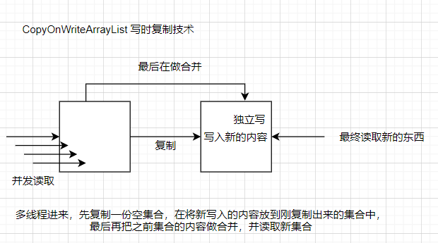

# 4、集合的线程安全问题

## 1、ArrayList线程不安全问题

### 1、演示

```java
 public static void main(String[] args) {
     //复现线程不安全问题
     List<Integer> noSale = new ArrayList<>();

     for (int i = 0; i < 30; i++) {
         int finalI = i;
         new Thread(() -> {
             noSale.add(finalI);
             System.out.println("noSale = " + noSale);
         },"A").start();
     }
 }
```

```java
并发修改异常
Exception in thread "main" java.util.ConcurrentModificationException
	at java.util.ArrayList$Itr.checkForComodification(ArrayList.java:911)
	at java.util.ArrayList$Itr.next(ArrayList.java:861)
	at java.util.AbstractCollection.toString(AbstractCollection.java:461)
	at java.lang.String.valueOf(String.java:2994)
	at java.lang.StringBuilder.append(StringBuilder.java:131)
	at com.hjc.demo4.ListTest.main(ListTest.java:18)
```

### 2、三种解决方案

#### 1、使用Vector线程安全的集合

```java
List<Integer> noSale = new Vector<>();
```

​      该解决方案自从jdk1.0出现，不常用

```java
 public static void main(String[] args) {
    
     List<Integer> noSale = new Vector<>();

     for (int i = 0; i < 30; i++) {
         int finalI = i;
         new Thread(() -> {
             noSale.add(finalI);
             System.out.println("noSale = " + noSale);
         },"A").start();
     } 
 }

Vector集合中的所有方法都使用synchronized修饰
```

#### 2、使用Collections工具类获取线程安全的集合

```java
Collections.synchronizedList(new ArrayList<>());
```

该解决方案也比较古老，使用较少

```java
 public static void main(String[] args) {
   
     List<Integer> noSale = Collections.synchronizedList(new ArrayList<>());

     for (int i = 0; i < 30; i++) {
         int finalI = i;
         new Thread(() -> {
             noSale.add(finalI);
             System.out.println("noSale = " + noSale);
         },"A").start();
     }  
 }
```

#### 3、使用juc中的CopyOnWriteArrayList解决

```java
public static void main(String[] args) {
    
     List<Integer> noSale = new CopyOnWriteArrayList<>();

     for (int i = 0; i < 30; i++) {
         int finalI = i;
         new Thread(() -> {
             noSale.add(finalI);
             System.out.println("noSale = " + noSale);
         },"A").start();
     }
 }
```

##### 1、写时复制技术 -- CopyOnWriteArrayList



##### 2、源码

```java
 public boolean add(E e) {
        final ReentrantLock lock = this.lock;
        lock.lock();
        try {
            Object[] elements = getArray();
            int len = elements.length;
            Object[] newElements = Arrays.copyOf(elements, len + 1);
            newElements[len] = e;
            setArray(newElements);
            return true;
        } finally {
            lock.unlock();
        }
    }
```

## 2、HashSet线程不安全问题

### 1、演示

```java
public static void main(String[] args) {
        //复现线程不安全问题
        Set<Integer> noSale = new HashSet<>();

        for (int i = 0; i < 30; i++) {
            int finalI = i;
            new Thread(() -> {
                noSale.add(finalI);
                System.out.println("noSale = " + noSale);
            },"A").start();
        }
    }
```

### 2、解决方案CopyOnWriteArraySet

使用JUC中的CopyOnWriteArraySet对象

```java
 public static void main(String[] args) {
        //复现线程不安全问题
        Set<Integer> noSale = new CopyOnWriteArraySet<>();

        for (int i = 0; i < 30; i++) {
            int finalI = i;
            new Thread(() -> {
                noSale.add(finalI);
                System.out.println("noSale = " + noSale);
            },"A").start();
        }
    }
```

## 3、HashMap线程不安全问题

### 1、演示

```java
  public static void main(String[] args) {
        //复现线程不安全问题
        Map<String,String> noSale = new HashMap<>();

        for (int i = 0; i < 30; i++) {
            String finalI = String.valueOf(i);
            new Thread(() -> {
                String substring = UUID.randomUUID().toString().substring(0, 8);
                System.out.println(substring);
                noSale.put(finalI, substring);
                System.out.println("noSale = " + noSale);
            }).start();
        }
    }
```

### 2、解决方案ConcurrentHashMap

使用JUC中的ConcurrentHashMap对象

```java
 public static void main(String[] args) {
        
        Map<String,String> noSale = new ConcurrentHashMap<>();

        for (int i = 0; i < 30; i++) {
            String finalI = String.valueOf(i);
            new Thread(() -> {
                String substring = UUID.randomUUID().toString().substring(0, 8);
                System.out.println(substring);
                noSale.put(finalI, substring);
                System.out.println("noSale = " + noSale);
            }).start();
        }
    }
```

