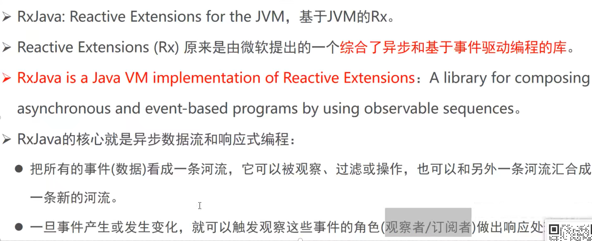
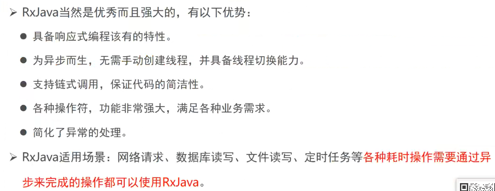
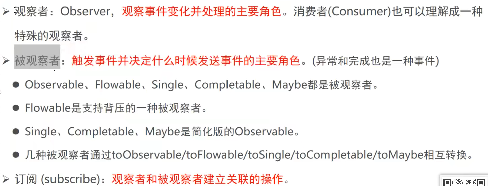
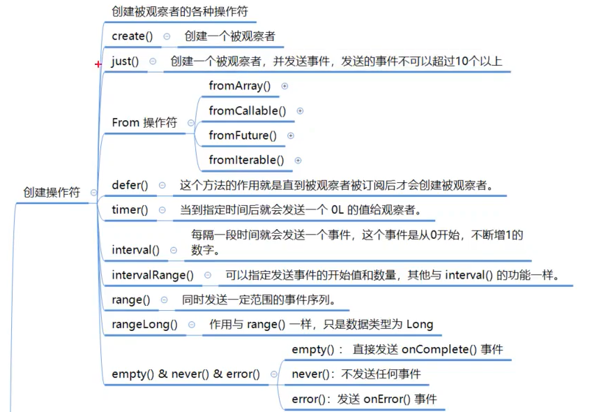
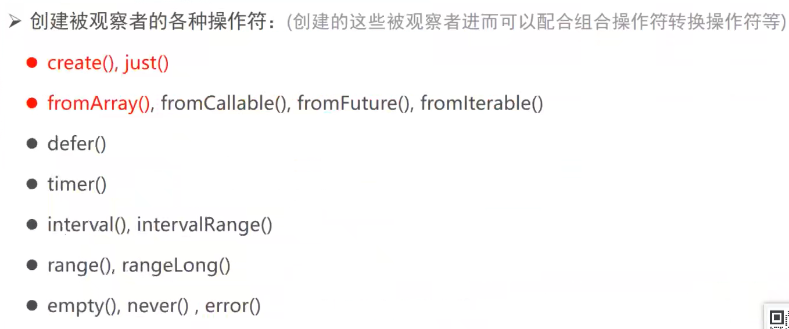
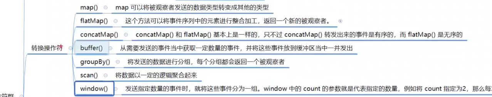
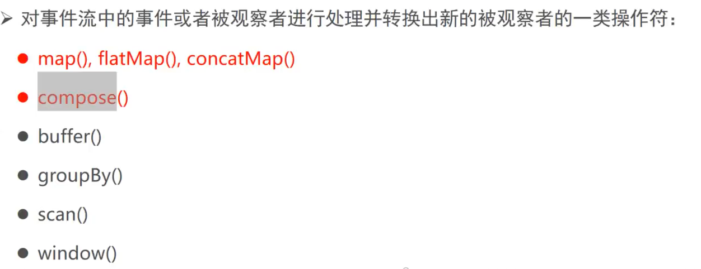
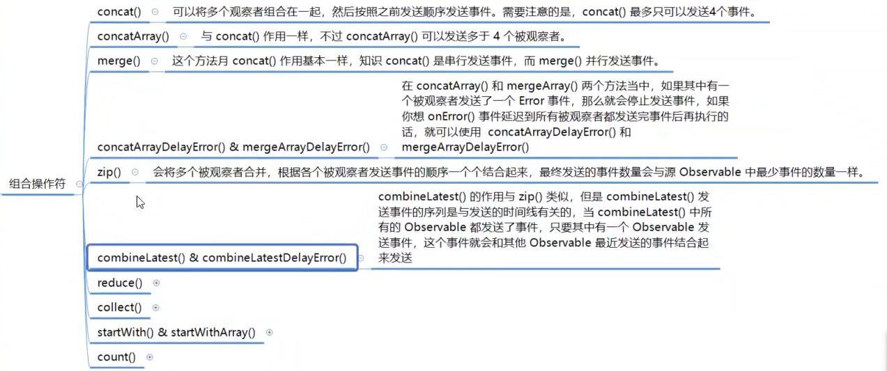
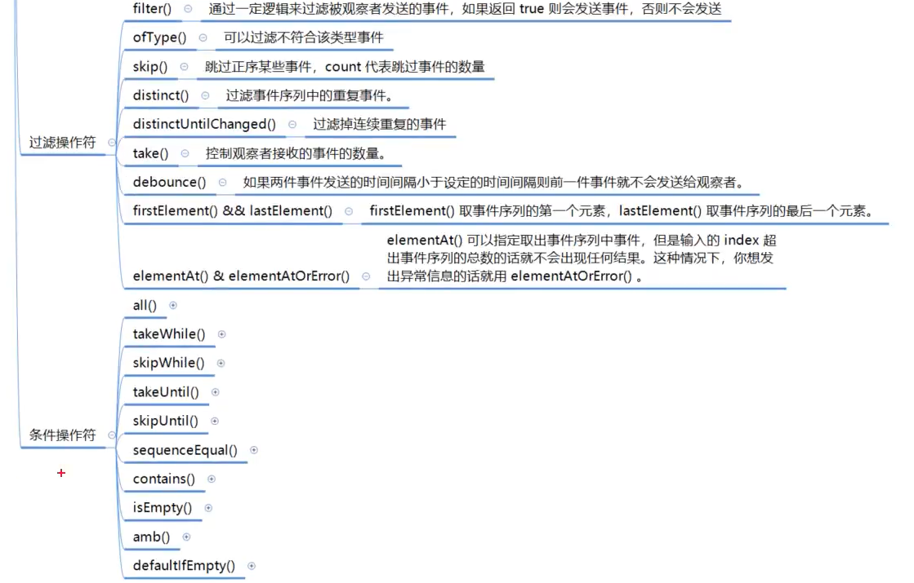
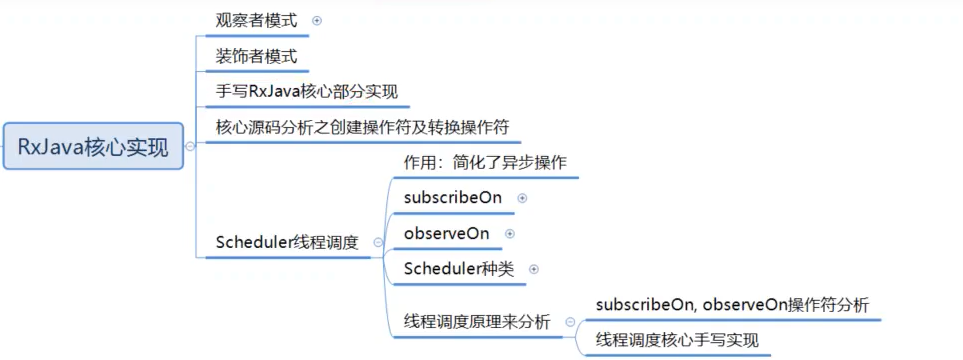

# RxJava

## 简介



## 优势



## 几个重要的概念



## 六大种类操作符

### 创建操作符





#### create操作符

##### 使用Observer处理结果

```java
            Observable.create(new ObservableOnSubscribe<Object>() {
            @Override
            public void subscribe(ObservableEmitter<Object> emitter) throws Exception {
                //建立订阅
                //事件产生的地方
                emitter.onNext("1");
                emitter.onNext("222");
                emitter.onNext("333");

                emitter.onError(new Throwable("发送一个异常"));

                //表示发送结束
                emitter.onComplete();
            }
        }).subscribe(new Observer<Object>(){

            @Override
            public void onSubscribe(Disposable d) {
                //观察者与被观察者订阅之后就会调用
                System.out.println("观察者与被观察者已经订阅.....");
            }

            @Override
            public void onNext(Object value) {
                System.out.println("onNext....."+value);
            }

            @Override
            public void onError(Throwable e) {
                System.out.println("onError....."+e.getMessage());
            }

            @Override
            public void onComplete() {
                System.out.println("onComplete.....");
            }
        });
    }


//结果
观察者与被观察者已经订阅.....
onNext.....1
onNext.....222
onNext.....333
onError.....发送一个异常
```

##### 使用消费者处理结果

```java
    @Test
    public void test2(){
        Observable.create(new ObservableOnSubscribe<Object>() {
            @Override
            public void subscribe(ObservableEmitter<Object> e) throws Exception {
                e.onNext("111");
                e.onError(new Throwable("手动抛出的异常"));

                e.onComplete();
            }
        }).subscribe(new Consumer<Object>() {
            @Override
            public void accept(Object o) throws Exception {
                System.out.println(o);
            }
        },
          //可以接受两个参数，第二个消费者可以处理异常
          new Consumer<Throwable>(){
            @Override
            public void accept(Throwable throwable) throws Exception {
                System.out.println(throwable.getMessage());
            }
        });
    }

//结果
111
手动抛出的异常
```

#### just操作符

相当于对上边create操作符中的ObservableOnSubscribe进行了封装

just操作符限制最多只能传10个参数

```java
    @Test
    public void test3(){
        Observable.just("123","asdsa","fadsfasf",new Throwable())
                .subscribe(System.out::println);
    }
//结果
123
asdsa
fadsfasf
java.lang.Throwable
```

#### fromArray操作符

fromArray操作符不限制参数个数

```java
    @Test
    public void test4(){
        Observable.fromArray("123","asdsa","fadsfasf",new Throwable())
                .subscribe(System.out::println);
    }
//结果
123
asdsa
fadsfasf
java.lang.Throwable
```

#### fromIterable操作符

```java
  @Test
    public void test5(){
        Observable.fromIterable(Arrays.asList("999","465","123"))
                .subscribe(System.out::println);
    }
```

#### fromFuture操作符

```java
 @Test
    public void test6(){
        Observable.fromFuture(new Future<Object>() {
                    @Override
                    public boolean cancel(boolean mayInterruptIfRunning) {
                        return false;
                    }

                    @Override
                    public boolean isCancelled() {
                        return false;
                    }

                    @Override
                    public boolean isDone() {
                        return false;
                    }

                    @Override
                    public Object get() throws InterruptedException, ExecutionException {
                        return "asdasd";
                    }

                    @Override
                    public Object get(long timeout, @NotNull TimeUnit unit) throws InterruptedException, ExecutionException, TimeoutException {
                        return null;
                    }
                })
                .subscribe(System.out::println);
    }
```

#### fromCallable操作符

```java
    @Test
    public void test7(){
        Observable.fromCallable(()->"asd")
                .subscribe(System.out::println);
    }
```


### 转换操作符






#### map操作符

```java
    @Test
    public void test8(){
        Observable.just("asdsad","asfdsf","fsdfsd")
            //对被观察者进行处理，把原来发射出来的事件进行处理并产生新的事件，再次创建新的被观察者，发射事件
                .map(d-> d.toUpperCase(Locale.ROOT))
                .subscribe(System.out::println);
    }
//结果
ASDSAD
ASFDSF
FSDFSD
```


#### flatMap操作符

输出的事件可能是无序的，数据量比较大的时候才可能是无序

```java
  @Test
    public void test9(){
        Observable.just("aa","vvv","bbb","aa","vvv","bbb","aa","vvv","bbb","asd")
                .flatMap(new Function<String, ObservableSource<?>>() {
                    @Override
                    public ObservableSource<?> apply(String s) throws Exception {
                        
                        //产生一个新的被观察者
                        return Observable.just(s.toUpperCase(Locale.ROOT));
                    }
                })
                .subscribe(System.out::println);
    }

    @Test
    public void test10(){
        Observable.just("aa","vvv","bbb","aa","vvv","bbb","aa","vvv","bbb","asd")
                .flatMap((a)->Observable.just(a))
                .subscribe(System.out::println);
    }
//结果
AA
VVV
BBB
AA
VVV
BBB
AA
VVV
BBB
ASD
```


#### concatMap操作符

输出的事件可能是有序的

```java
   @Test
    public void test11(){
        Observable.just("aa","vvv","bbb","aa","vvv","bbb","aa","vvv","bbb","asd")
                .concatMap(new Function<String, ObservableSource<?>>() {
                    @Override
                    public ObservableSource<?> apply(String s) throws Exception {
                        return Observable.just(s.toUpperCase(Locale.ROOT));
                    }
                })
                .subscribe(System.out::println);
    }

//结果
AA
VVV
BBB
AA
VVV
BBB
AA
VVV
BBB
ASD
```

#### compose操作符

```java

```


#### buffer操作符

```java
   @Test
    public void test12(){
        Observable.just("aa","vvv","bbb","aa","vvv","bbb","aa","vvv","bbb","asd")
                .buffer(3)
                .subscribe(System.out::println);
    }
//结果
[aa, vvv, bbb]
[aa, vvv, bbb]
[aa, vvv, bbb]
[asd]
```


### 组合操作符



#### concat操作符

最多只能传入4个Observable

```java
@Test
public void test13(){
    Observable.concat(Observable.just("aa","vvv","bbb"),Observable.just("123","456","789"))
            .subscribe(System.out::println);
}
```

#### concatArray操作符

可以传入多于4个Observable，并且是串行的，只能等第一个结合完在结合第二个

```java
@Test
public void test14(){
    Observable.concatArray(Observable.just("aa","vvv","bbb"),Observable.just("123","456","789"))
            .subscribe(System.out::println);
}
```

#### merge操作符

是并行的

```java
@Test
public void test15(){
    Observable.merge(Observable.just("aa","vvv","bbb"),Observable.just("123","456","789"))
            .subscribe(System.out::println);
}
```


### 功能操作符

#### subscribeOn操作符/obserceOn操作符

subscribeOn操作符主要决定执行subscribe方法所处的线程，也就是产生事件发射事件的所在的线程，subscribeOn在一次链路中只有第一次出现的时候起作用

obserceOn操作符主要来决定下游事件被处理时所处的线程

```java
    @Test
    public void test16() throws InterruptedException {

        Observable.create(new ObservableOnSubscribe<Object>() {
                    @Override
                    public void subscribe(ObservableEmitter<Object> e) throws Exception {
                        e.onNext("你好");
                        e.onNext("我好");
                        e.onNext("大家好");
                        System.out.println("subscribe-->"+Thread.currentThread());
                    }
                })
                .subscribeOn(Schedulers.io())
                .observeOn(Schedulers.newThread())

                .map(d->{
                    System.out.println("map-->"+Thread.currentThread());
                    return d+"...处理中";
                })
            
                 //.subscribeOn(Schedulers.io())  这个不起作用，subscribeOn在一次链路中只有第一次出现的时候起作用
                .observeOn(Schedulers.newThread())
                .subscribe(new Observer<Object>() {
                    @Override
                    public void onSubscribe(Disposable d) {
                        System.out.println("onSubscribe-->"+Thread.currentThread());
                    }

                    @Override
                    public void onNext(Object value) {
                        System.out.println("onNext-->"+Thread.currentThread());
                    }

                    @Override
                    public void onError(Throwable e) {
                        System.out.println("onError-->"+Thread.currentThread());
                    }

                    @Override
                    public void onComplete() {
                        System.out.println("onComplete-->"+Thread.currentThread());
                    }
                });

        TimeUnit.SECONDS.sleep(3000);
    }

//结果
onSubscribe-->Thread[main,5,main]
subscribe-->Thread[RxCachedThreadScheduler-1,5,main]
map-->Thread[RxNewThreadScheduler-1,5,main]
map-->Thread[RxNewThreadScheduler-1,5,main]
map-->Thread[RxNewThreadScheduler-1,5,main]
onNext-->Thread[RxNewThreadScheduler-2,5,main]
onNext-->Thread[RxNewThreadScheduler-2,5,main]
onNext-->Thread[RxNewThreadScheduler-2,5,main]
```

#### doOnNext操作符

在onNext方法调用之前会调用doOnNext方法

在消费者消费之前/onNext执行之前执行，但是不影响值改变，因此改变值需要用的转换操作符

```java
    @Test
    public void test17(){
        Observable.just("a","b","c","d")
                .doOnNext(s -> {
                    s = s + "cccc";
                    System.out.println("在消费者消费之前/onNext执行之前"+s);
                })
                .subscribe(System.out::println);
    }

//结果
在消费者消费之前/onNext执行之前acccc
a
在消费者消费之前/onNext执行之前bcccc
b
在消费者消费之前/onNext执行之前ccccc
c
在消费者消费之前/onNext执行之前dcccc
d


```


### 过滤操作符/条件操作符



#### filter操作符

```java
    @Test
    public void test18(){
        Observable.range(0,10)
                .filter(d->d%2==0)
                .subscribe(System.out::println);
    }

//结果
0
2
4
6
8
```

## RxJava核心实现




#### 观察者模式


#### rxJava中的观察者模式


#### 手写实现rxjava


