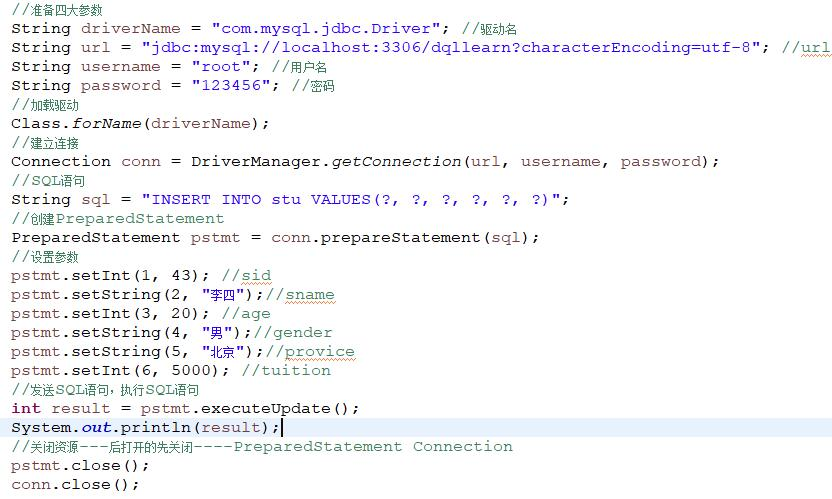
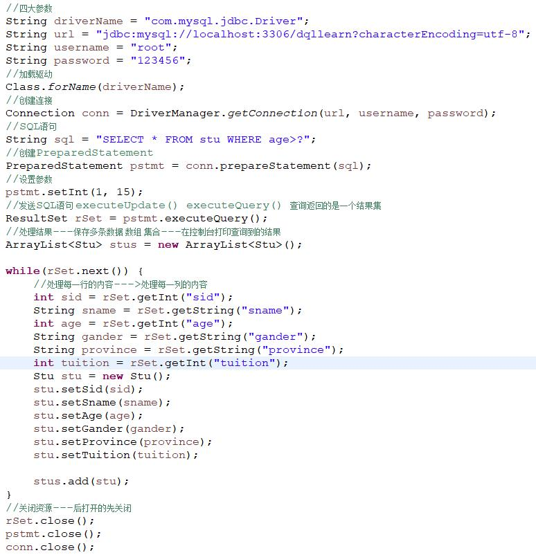
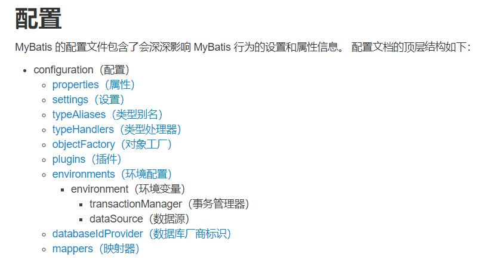

# MyBatis快速入门
## 一、MyBatis简介

### 1.1、JDBC操作（插入数据）

> 

### 1.2、JDBC操作（查询数据）

> 

### 1.3、JDBC操作的分析

> JDBC开发存在的问题：
>
> * 代码存在大量重复操作；
> * 数据库连接创建、释放频繁造成系统资源浪费从而影响系统性能；
> * SQL语句在代码中硬编码，造成代码不易维护，实际应用SQL变化的可能较大，SQL变动需要改变Java代码；
> * 查询操作时，需要手动将结果集中的数据手动封装到实体中。插入操作时，需要手动将实体的数据设置到sql语句的占位符位置。
>
> 解决方案：
>
> * 使用工具类对相同的操作进行抽取；
> * 使用数据库连接池初始化连接资源（C3P0、Druid）；
> * 将SQL语句抽取到XML配置文件中；
> * 使用反射、内省等底层技术，实现对象的属性和表的字段自动映射。
>
> 具体技术：
>
> * Hibernate  SSH (Spring  Structs Hibernate)   SSM(Spring SpringMVC  Mybatis)
> * MyBatis        

### 1.4、MyBatis是什么

​    MyBatis是和数据库交互的，持久层

​    框架，半成品

> MyBatis是一个优秀的基于java的**持久层框架**，它内部封装了JDBC，使开发者只需要关注SQL语句本身，而不需要花费精力去处理**加载驱动、创建连接、创建statement**等繁杂的过程。
>
> MyBatis通过XML或注解的方式将要执行的各种statement配置起来，并通过JAVA对象和statement中**SQL**的**动态参数**进行映射生成最终执行的SQL语句。
>
> 最后MyBatis框架执行SQL并将结果映射为Java对象并返回。**采用ORM思想**解决了实体和数据库映射的问题，对JDBC进行了封装，屏蔽了JDBC API底层访问细节，使我们不用与JDBC API打交道，就可以完成对数据库的持久化操作
>
> **简单说就是：有一种叫MyBatis的持久层技术，能够代替JDBC，简化JDBC开发。**

#### 1.4.1、ORM   对象关系映射  (Mybatis  Mybatis-plus   ) 面试题

> **对象关系映射**（英语：**Object Relational Mapping**，简称**ORM**，或**O/RM**，或**O/R mapping**），是一种程序设计技术，用于实现面向对象编程语言里不同类型系统的数据之间的转换。从效果上说，它其实是创建了一个可在编程语言里使用“虚拟对象数据库”。
>
> **简单的说：就是把数据库表和实体类及实体类的属性对应起来，让我们可以操作实体类就实现操作数据库表。**
>
> |   数据库   |    实体类    |
> | :--------: | :----------: |
> |   user表   |    User类    |
> |    id列    |    id属性    |
> | username列 | userName属性 |
> |   age列    |   age属性    |

## 二、MyBatis快速入门    重点

### 2.1、MyBatis开发步骤

> MyBatis官网地址：http://www.mybatis.org/mybatis-3/ 
>
> 步骤：
>
> ​	1)  新建Maven项目，导入相关依赖；
>
> ​	2) 创建user表；
>
> ​	3) 编写User实体类；
>
> ​	4) 编写映射文件UserMapper.xml；
>
> ​	5) 编写核心配置文件SqlMapConfig.xml；
>
> ​	6) 编写测试类；
>
> ​	7) 测试。

### 2.2、环境搭建

#### 2.2.1、新建项目，导入相关Jar包

> **MyBatis是一种持久化技术，在普通Java项目和JavaWeb项目中都可以使用**，这里我们新建一个普通Maven项目就可以。
>
> 新建Maven项目，导入相关依赖

```xml
<dependencies>
    <dependency>
        <groupId>mysql</groupId>
        <artifactId>mysql-connector-java</artifactId>
        <version>5.1.49</version>
    </dependency>
    <dependency>
        <groupId>org.mybatis</groupId>
        <artifactId>mybatis</artifactId>
        <version>3.4.6</version>
    </dependency>
    <dependency>
        <groupId>junit</groupId>
        <artifactId>junit</artifactId>
        <version>4.13</version>
        <scope>test</scope>
    </dependency>
    <!-- log4j依赖  log for java-->  
    <dependency>
        <groupId>log4j</groupId>
        <artifactId>log4j</artifactId>
        <version>1.2.17</version>
    </dependency>
</dependencies>
```

#### 2.2.2、创建user表

> **注意设置id自增**

```mysql
CREATE TABLE `user`  (
  `id` bigint(20) NOT NULL AUTO_INCREMENT,
  `username` varchar(30) CHARACTER SET utf8 COLLATE utf8_general_ci NULL DEFAULT NULL,
  `password` varchar(30) CHARACTER SET utf8 COLLATE utf8_general_ci NULL DEFAULT NULL,
  `age` int(11) NULL DEFAULT NULL,
  `gender` varchar(6) CHARACTER SET utf8 COLLATE utf8_general_ci NULL DEFAULT NULL,
  `addr` varchar(50) CHARACTER SET utf8 COLLATE utf8_general_ci NULL DEFAULT NULL,
  PRIMARY KEY (`id`) USING BTREE
) ENGINE = InnoDB AUTO_INCREMENT = 11 CHARACTER SET = utf8 COLLATE = utf8_general_ci ROW_FORMAT = COMPACT;

INSERT INTO `user` VALUES (1, 'zhangsan', '123', 20, 'male', 'qd');
INSERT INTO `user` VALUES (2, 'lisi', '123', 21, 'male', 'bj');
INSERT INTO `user` VALUES (4, 'tom', '123', 19, 'male', 'nj');
INSERT INTO `user` VALUES (5, 'wangwu', '123', 20, 'male', 'sh');
INSERT INTO `user` VALUES (6, 'weihua', '111', 21, 'female', 'sz');

```

#### 2.2.3、编写User实体类

```java
/**
 * 表示用户的实体类
 *
 * 属性名和数据库表名对应
 *
 * 符合JavaBean的规范
 */
public class User {
    private Long id;
    private String username;
    private String password;
    private Integer age;
    private String gender;
    private String addr;

    //set和get方法
    //toString方法
}
```

#### 2.2.4、编写映射文件UserMapper.xml   重点

> **该文件放在`resources`目录下的`mappers`文件夹下**

```xml
<?xml version="1.0" encoding="UTF-8" ?>
<!DOCTYPE mapper
        PUBLIC "-//mybatis.org//DTD Mapper 3.0//EN"
        "http://mybatis.org/dtd/mybatis-3-mapper.dtd">
<mapper namespace="userMapper">
    <select id="findAll" resultType="com.qfedu.bean.User">
        SELECT * FROM user
    </select>
</mapper>
```

#### 2.2.5、编写核心配置文件SqlMapConfig.xml

> 该文件放在`resources`目录下

```xml
<?xml version="1.0" encoding="UTF-8" ?>
<!DOCTYPE configuration
        PUBLIC "-//mybatis.org//DTD Config 3.0//EN"
        "http://mybatis.org/dtd/mybatis-3-config.dtd">
<configuration>
    <!-- 配置环境 -->
    <environments default="dev">
        <environment id="dev">
            <transactionManager type="JDBC"></transactionManager>
            <dataSource type="POOLED">
                <property name="driver" value="com.mysql.jdbc.Driver" />
                <property name="url" value="jdbc:mysql://localhost:3306/test?useSSL=false" />
                <property name="username" value="root" />
                <property name="password" value="root" />
            </dataSource>
        </environment>
    </environments>

    <!-- 加载映射配置文件  易错点：分隔使用/不是用.一定注意！！！-->
    <mappers>
        <mapper resource="mappers/UserMapper.xml" />
    </mappers>

</configuration>
```

#### 2.2.6、编写日志配置文件

> log4j.properties

```properties
#
# Hibernate, Relational Persistence for Idiomatic Java
#
# License: GNU Lesser General Public License (LGPL), version 2.1 or later.
# See the lgpl.txt file in the root directory or <http://www.gnu.org/licenses/lgpl-2.1.html>.
#

### direct log messages to stdout ###
log4j.appender.stdout=org.apache.log4j.ConsoleAppender
log4j.appender.stdout.Target=System.err
log4j.appender.stdout.layout=org.apache.log4j.PatternLayout
log4j.appender.stdout.layout.ConversionPattern=%d{ABSOLUTE} %5p %c{1}:%L - %m%n

### direct messages to file hibernate.log ###
#log4j.appender.file=org.apache.log4j.FileAppender
#log4j.appender.file.File=hibernate.log
#log4j.appender.file.layout=org.apache.log4j.PatternLayout
#log4j.appender.file.layout.ConversionPattern=%d{ABSOLUTE} %5p %c{1}:%L - %m%n

### set log levels - for more verbose logging change 'info' to 'debug' ###

log4j.rootLogger=debug, stdout
```

> 这个文件编写不需要掌握，用的时候直接拷贝即可。
>
> **从上往下，等级越来越高，日志量越来越少。**
>
> **工作中开发环境DEBUG模式**
>
> **生产环境下INFO**

|   级别    | 描述                                                         |
| :-------: | :----------------------------------------------------------- |
| ALL LEVEL | 打开所有日志记录开关；是最低等级的，用于打开所有日志记录     |
| [DEBUG]() | 输出调试信息；指出细粒度信息事件对调试应用程序是非常有帮助的 |
|   INFO    | 输出提示信息；消息在粗粒度级别上突出强调应用程序的运行过程   |
|   WARN    | 输出警告信息；表明会出现潜在错误的情形                       |
|   ERROR   | 输出错误信息；指出虽然发生错误事件，但仍然不影响系统的继续运行 |
|   FATAL   | 输出致命错误；指出每个严重的错误事件将会导致应用程序的退出   |
| OFF LEVEL | 关闭所有日志记录开关；是最高等级的，用于关闭所有日志记录     |

### 2.3、编写测试代码

```java
public class MyTest {
    @Test
    public void test1() throws IOException {
        //加载核心配置文件
        InputStream stream = Resources.getResourceAsStream("SqlMapConfig.xml");
		//获得sqlSession工厂对象
        SqlSessionFactory factory = new SqlSessionFactoryBuilder().build(stream);
        //获得sqlSession对象  类似于Connection
        SqlSession sqlSession = factory.openSession();
        //执行sql语句
        List<User> list = sqlSession.selectList("userMapper.findAll");
        //打印结果
        list.forEach(System.out::println);
		//释放资源
        sqlSession.close();
    }
}
```

> 运行测试方法，测试通过。

## 三、MyBatis映射文件概述

```xml
<?xml version="1.0" encoding="UTF-8" ?>
<!-- 映射文件DTD约束，用来约束XML中的标签，直接从素材中拷贝就可以，不需要去记。-->
<!DOCTYPE mapper
        PUBLIC "-//mybatis.org//DTD Mapper 3.0//EN"
        "http://mybatis.org/dtd/mybatis-3-mapper.dtd">
<!-- 映射文件的根标签，其他的内容都要写在该标签的内部
	namespace：命名空间，与下面语句的id一起组成查询的标识，唯一的确定要执行的SQL语句 
-->
<mapper namespace="userMapper">
    <!-- select标签表示这是一个查询操作，除了这个标签还可以有insert、delete、update
		id：语句的id，和上面的namespace一起组成查询的标识，唯一的确定要执行的SQL语句
		resultType：查询结果对应的实体类型，目前这里先写全类名（包名+类名）
	-->
    <select id="findAll" resultType="com.qfedu.bean.User">
        <!-- SQL语句 -->
        SELECT * FROM user
    </select>
</mapper>
```

> **关于映射文件，目前先了解这些就可以，还有其他的配置后面再讲解。**

## 四、MyBatis进行增删改查操作

### 4.1、插入数据

#### 4.1.1、编写UserMapper映射文件

```xml
<!--
	插入操作使用insert标签
	parameterType：指定要插入的数据类型，这里暂时写全类名
-->
<insert id="add" parameterType="com.qfedu.bean.User">
    <!-- #{xxx}：使用实体中的xxx属性值 -->
    insert into user(username, password, age, gender, addr) 
    values(#{username}, #{password}, #{age}, #{gender}, #{addr})
</insert>
```

#### 4.1.2、提取出测试类中的公共代码

```java
private SqlSession sqlSession;

@Before
public void init() throws IOException {
    //加载核心配置文件
    InputStream stream = Resources.getResourceAsStream("SqlMapConfig.xml");
    //获得sqlSession工厂对象
    SqlSessionFactory factory = new SqlSessionFactoryBuilder().build(stream);
    //获得sqlSession对象
    sqlSession = factory.openSession();
}

@After
public void destroy() {
    //释放资源
    sqlSession.close();
}
```

#### 4.1.3、编写插入实体User的代码

```java
@Test
public void testInsert() {
    //创建User实体
    user.setUsername("admin");
    user.setPassword("123456");
    user.setAge(22);
    user.setGender("male");
    user.setAddr("qd");
	//执行SQL语句
    sqlSession.insert("userMapper.add", user);
    //提交事务
    //插入操作涉及数据库的变化，要手动提交事务
    sqlSession.commit();
}
```

### 4.2、删除数据

#### 4.2.1、编写UserMapper映射文件

```xml
<!-- 删除操作使用delete标签
	#{任意字符串}方式引用传递的单个参数，如果传入的参数只有一个，大括号中的内容可以随意写，我们最好见名知意              
-->
<delete id="delete" parameterType="java.lang.Integer">
    DELETE FROM user WHERE id=#{id}
</delete>
```

#### 4.2.2、编写删除数据的代码

```java
@Test
public void testDelete() {
    sqlSession.delete("userMapper.delete", 3);
    sqlSession.commit();
}
```

### 4.3、修改数据

#### 4.3.1、编写UserMapper映射文件

```xml
<update id="chg" parameterType="com.qfedu.bean.User">
    UPDATE user SET username=#{username}, password=#{password} WHERE id=#{id}
</update>
```

#### 4.3.2、编写修改数据的代码

```java
@Test
public void testUpdate() {
    User user = new User();
    user.setId(2L);
    user.setUsername("peter");
    user.setPassword("123");
    sqlSession.update("userMapper.chg", user);
    sqlSession.commit();
}
```

### 4.4、总结

> **映射配置+API**实现增删改查。

## 五、MyBatis核心配置文件

### 5.1、MyBatis配置文件层次关系



> **配置相关标签必须按照上图中的顺序，不然程序无法正常运行**

### 5.2、核心配置文件常用配置解析

#### 5.2.1、environments标签

> **该标签用来配置数据库环境，支持多环境配置，支持多数据源（可以通过default指定生效的数据源）**

```xml
<!-- 配置环境
	 default：指定默认环境，如果下面配置了多个id，通过delfault属性的值指定使用哪个环境
-->
<environments default="dev">
    <!-- id：环境的id -->
    <environment id="dev">
        <!-- type：事务管理器类型，类型有如下两种。
			JDBC：这个配置就是直接使用了JDBC的提交和回滚设置，它依赖于从数据源得到的连接来管理事务作用域。
 			MANAGED：这个配置几乎没做什么。它从来不提交或回滚一个连接，而是让容器来管理事务的整个生命周期。 
					默认情况下它会关闭连接，然而一些容器并不希望这样，因此需要将closeConnection属性设置
					为false来阻止它默认的关闭行为。
		-->
        <transactionManager type="JDBC"></transactionManager>
        <!-- type：指定数据源类型，类型有如下三种。
			UNPOOLED：这个数据源的实现只是每次被请求时打开和关闭连接。
			POOLED：这种数据源的实现利用“池”的概念将 JDBC 连接对象组织起来。
			JNDI：这个数据源的实现是为了能在如EJB或应用服务器这类容器中使用，
				容器可以集中或在外部配置数据源，然后放置一个 JNDI 上下文的引用。
 		-->
        <dataSource type="POOLED">
            <!-- 配置数据源的基本参数 -->
            <property name="driver" value="com.mysql.jdbc.Driver" />
            <property name="url" value="jdbc:mysql://localhost:3306/test?useSSL=false&useUnicode=true&characterEncpding=utf8" />
            <property name="username" value="root" />
            <property name="password" value="root" />
        </dataSource>
    </environment>
</environments>
```

#### 5.2.2、mapper标签

> 该标签的作用是加载映射文件，加载方式有如下几种：
>
> 使用相对于类路径的资源引用，例如：

```xml
<mapper resource="org/mybatis/builder/AuthorMapper.xml"/>
```

>  使用完全限定资源定位符（URL），例如：

```xml
<mapper url="file:///var/mappers/AuthorMapper.xml"/>
```

> 使用映射器接口实现类的完全限定类名，例如：

```xml
<mapper class="org.mybatis.builder.AuthorMapper"/>
```

> 将包内的映射器接口实现全部注册为映射器，例如：

```xml
<package name="org.mybatis.builder"/>
```

#### 5.2.3、properties标签

> 实际开发中，习惯将数据源的配置信息单独抽取成一个properties文件，该标签可以加载额外配置的properties文件
>
> 创建配置数据源的配置文件jdbc.properties

```properties
jdbc.driver=com.mysql.jdbc.Driver
jdbc.url=jdbc:mysql://localhost:3306/test?useSSL=false
jdbc.username=root
jdbc.password=root
```

> 修改核心配置文件

```xml
<!-- 引入外部配置文件 -->
<properties resource="jdbc.properties" />

<!-- 配置环境 -->
<environments default="dev">
    <environment id="dev">
        <transactionManager type="JDBC"></transactionManager>
        <dataSource type="POOLED">
            <!-- 使用${key}引用properties文件中的值 -->
            <property name="driver" value="${jdbc.driver}" />
            <property name="url" value="${jdbc.url}" />
            <property name="username" value="${jdbc.username}" />
            <property name="password" value="${jdbc.password}" />
        </dataSource>
    </environment>
</environments>
```

#### 5.2.4、typeAliases标签

##### 5.2.4.1、如何设置别名

> 配置类型别名，为全类名设置一个短名字
>
> 写法1

```xml
<!-- 配置别名 -->
<typeAliases>
    <typeAlias type="com.qfedu.bean.User" alias="user" />
</typeAliases>
```

> 通过上面的配置为com.qfedu.bean包下的User类起了一个别名user。这种写法需要为每个类分别设置别名，如果类很多，这里的配置会很繁琐。
>
> **写法2   推荐**

```xml
<!-- 配置别名 -->
<typeAliases>
    <package name="com.qfedu.bean"/>
</typeAliases>
```

> 这种写法为com.qfedu.bean下的所有类设置别名，别名为类名的首字母小写。

##### 5.2.4.2、如何使用别名

```xml
<select id="findAll" resultType="user">
    SELECT * FROM user
</select>
<update id="chg" parameterType="user">
    UPDATE user SET username=#{username}, password=#{password} WHERE id=#{id}
</update>
```

##### 5.2.4.3、MyBatis预先设置好的别名

> |     数据类型      |  别名  |
> | :---------------: | :----: |
> | java.lang.String  | string |
> |  java.lang.Long   |  long  |
> | java.lang.Integer |  int   |
> | java.lang.Double  | double |
> |        ……         |   ……   |

```xml
<delete id="delete" parameterType="int">
    DELETE FROM user WHERE id=#{id}
</delete>
```
