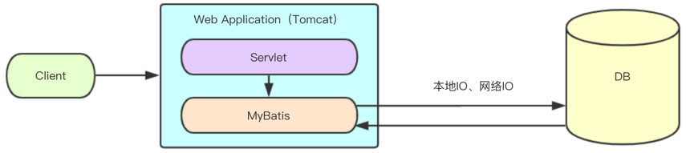
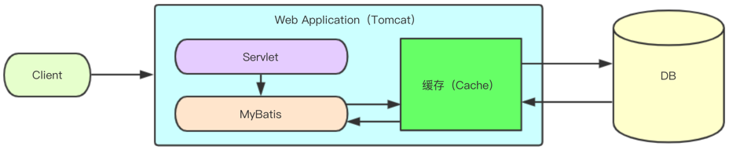

# MyBatis进阶
## 一、代理开发方式  重点！！！

### 1.1、代理开发方式介绍

> `MyBatis`代理开发方式实现`Dao`层的开发，这种方式是目前企业的主流。
>
> `Mapper`接口开发方法只需要程序员编写`Mapper`接口（相当于`Dao`接口），由`MyBatis`框架根据接口定义创建接口的动态代理对象，代理对象的方法体同上边`Dao`接口实现类方法。
>
> JDK动态代理，可以根据我们定义的接口，在运行时产生相应的实现类以及对象
>
> **需要遵循的规范： 重要  面试题**
>
> * `Mapper.xml`文件中的`namespace`与`mapper`接口的全限定名相同；
> * `Mapper`接口方法名和`Mapper.xml`中定义的每个`statement`的`id`相同；
> * `Mapper`接口方法的输入参数类型和`mapper.xml`中定义的每个`sql`的`parameterType`的类型相同；
> * `Mapper`接口方法的返回值类型和`mapper.xml`中定义的每个`sql`的`resultType`的类型相同。
>
> **约定大于配置  **

### 1.2、准备工作

> 创建表示用户的实体类`User`

```java
public class User {
    private Long id;
    private String username;
    private String password;
    private Integer age;
    private String gender;
    private String addr;
    
    //set、get
    //toString
}
```

> `SQL`脚本

```sql
CREATE TABLE `user`  (
  `id` bigint(20) NOT NULL AUTO_INCREMENT,
  `username` varchar(30) CHARACTER SET utf8 COLLATE utf8_general_ci NULL DEFAULT NULL,
  `password` varchar(30) CHARACTER SET utf8 COLLATE utf8_general_ci NULL DEFAULT NULL,
  `age` int(11) NULL DEFAULT NULL,
  `gender` varchar(6) CHARACTER SET utf8 COLLATE utf8_general_ci NULL DEFAULT NULL,
  `addr` varchar(50) CHARACTER SET utf8 COLLATE utf8_general_ci NULL DEFAULT NULL,
  PRIMARY KEY (`id`) USING BTREE
) ENGINE = InnoDB AUTO_INCREMENT = 11 CHARACTER SET = utf8 COLLATE = utf8_general_ci ROW_FORMAT = COMPACT;

INSERT INTO `user` VALUES (1, 'zhangsan', '123', 20, 'male', 'qd');
INSERT INTO `user` VALUES (2, 'lisi', '123', 21, 'male', 'bj');
INSERT INTO `user` VALUES (4, 'tom', '123', 19, 'male', 'nj');
INSERT INTO `user` VALUES (5, 'wangwu', '123', 20, 'male', 'sh');
INSERT INTO `user` VALUES (6, 'weihua', '111', 21, 'female', 'sz');
```

### 1.3、CRUD操作

#### 1.3.1、编写UserMapper接口 重点

> 接口的名字我们一般命名为`XxxMapper`，所在的包命名为`xxx.xxx.mapper`，这是一种习惯。
>
> 当然也可以命名为`XxxDao`。

```java
public interface UserMapper {
    void add(User user);
    void delete(int id);
    void chg(User user);
    User findById(int id);
    List<User> findAll();
}
```

#### 1.3.2、编写映射文件 重点

```xml
<?xml version="1.0" encoding="UTF-8" ?>
<!DOCTYPE mapper PUBLIC "-//mybatis.org//DTD Mapper 3.0//EN" "http://mybatis.org/dtd/mybatis-3-mapper.dtd">
<!-- namespace和接口的全限定类名相同 -->
<mapper namespace="com.qfedu.mapper.UserMapper">
    <!-- 
		id和接口中对应方法的方法名相同
		parameterType的类型和接口中对应方法的参数类型相同
	-->
    <insert id="add" parameterType="user">
		insert into user(username, password, age, gender, addr) values(#{username}, #{password}, #{age}, #{gender}, #{addr})
    </insert>

    <delete id="delete" parameterType="int">
        DELETE FROM user WHERE id=#{id}
    </delete>

    <update id="chg" parameterType="user">
        UPDATE user SET username=#{username}, password=#{password} WHERE id=#{id}
    </update>
	
    <!-- 
		resultType的类型和接口中对应方法的返回值类型相同
	-->
    <select id="findById" parameterType="int" resultType="user">
        SELECT * FROM user WHERE id=#{id}
    </select>

    <select id="findAll" resultType="user">
      SELECT * FROM user
    </select>
</mapper>
```

#### 1.3.3、编写核心配置文件SqlMapConfig.xml

> 该文件在resources目录下

```xml
<?xml version="1.0" encoding="UTF-8" ?>
<!DOCTYPE configuration
        PUBLIC "-//mybatis.org//DTD Config 3.0//EN"
        "http://mybatis.org/dtd/mybatis-3-config.dtd">
<configuration>
    <typeAliases>
        <package name="com.qfedu.bean"/>
    </typeAliases>
    
    <!-- 配置环境 -->
    <environments default="dev">
        <environment id="dev">
            <transactionManager type="JDBC"></transactionManager>
            <dataSource type="POOLED">
                <property name="driver" value="com.mysql.jdbc.Driver" />
                <property name="url" value="jdbc:mysql://localhost:3306/test?useSSL=false"/>
                <property name="username" value="root" />
                <property name="password" value="root" />
            </dataSource>
        </environment>
    </environments>

    <!-- 加载映射配置文件 -->
    <mappers>
        <mapper resource="com/qfedu/mapper/UserMapper.xml" />
    </mappers>
</configuration>
```

#### 1.3.4、编写测试类

```java
public class MyTest {
    private SqlSession sqlSession;
    private UserMapper userMapper;
    @Before
    public void init() throws IOException {
        //加载核心配置文件
        InputStream resourceAsStream = Resources.getResourceAsStream("SqlMapConfig.xml");
        //创建SqlSessionFactory
        SqlSessionFactory factory = new SqlSessionFactoryBuilder().build(resourceAsStream);
        //获取连接
        sqlSession = factory.openSession();
		//创建接口的代理对象
        userMapper = sqlSession.getMapper(UserMapper.class);
    }

    @After
    public void destroy() {
        //关闭连接
        sqlSession.close();
    }

    @Test
    public void testFindById() {
        User user = userMapper.findById(1);
        System.out.println(user);
    }

    @Test
    public void testFindAll() {
        List<User> users = userMapper.findAll();
        users.forEach(user -> System.out.println(user));
    }
}
```

> 运行测试方法，进行测试。

### 1.4、关于参数绑定

#### 1.4.1、序号参数绑定  了解

> 接口

```java
public interface UserMapper {
    User findByNameAndPwd(String username, String password);
}
```

> 映射文件

```xml
<select id="findByNameAndPwd" resultType="user">
    select * from user where username=#{arg0} and password=#{arg1}
</select>
或
<select id="findByNameAndPwd" resultType="user">
    select * from user where username=#{param1} and password=#{param2}
</select>
```

#### 1.4.2、**注解参数绑定（推荐）  @Param   重点**

> 接口

```java
public interface UserMapper {
    User findByNameAndPwd(@Param("name") String username, @Param("pwd") String password);
}
```

> 映射文件

```xml
<select id="findByNameAndPwd" resultType="user">
    select * from user where username=#{name} and password=#{pwd}
</select>
```

#### 1.4.3、Map参数绑定 了解

> 接口

```java
public interface UserMapper {
    User findByMap(Map map);
}
```

> 映射文件

```xml
<select id="findByMap" resultType="user">
    select * from user where username=#{name} and password=#{pwd}
</select>
```

> 测试方法

```java
@Test
public void testFindByMap2() {
    HashMap map = new HashMap();
    map.put("name", "admin");
    map.put("pwd", "123456");
    User admin = userMapper.findByMap(map);
    System.out.println(admin);
}
```

#### 1.4.4、对象参数绑定   重点

> 接口

```java
public interface UserMapper {
    User fingByObj(User user);
}
```

> 映射文件

```xml
<select id="fingByObj" resultType="user">
    <!-- 占位符的名字和参数实体类属性的名字相同 -->
    select * from user where username=#{username} and password=#{password}
</select>
```

> 测试方法

```java
@Test
public void testFindByObj() {
    User user = new User();
    user.setUsername("admin");
    user.setPassword("123456");

    User u = userMapper.fingByObj(user);
    System.out.println(u);
}
```

### 1.5、关于模糊查询 重点

> 接口

```java
public interface UserMapper {
    List<User> findByName(String name);
}
```

> 映射文件

```xml
<select id="findByName" resultType="user">
    select * from user where username like concat('%',#{username},'%')
</select>
```

> 测试方法

```java
@Test
public void testFindByName() {
    List<User> users = userMapper.findByName("zhang");
    users.forEach(System.out::println);
}
```

### 1.6、关于主键回填  

#### 1.6.1、通过`last_insert_id()`查询主键    重点

> 适用于整数类型自增主键
>
> 映射文件

```xml
<insert id="add" parameterType="user">
    <selectKey keyColumn="id" keyProperty="id" resultType="long" order="AFTER">
        <!-- 适用于整数类型自增主键 -->
        SELECT LAST_INSERT_ID()
    </selectKey>
    insert into user(username, password, age, gender, addr) values(#{username}, #{password}, #{age}, #{gender}, #{addr})
</insert>
```

> 测试方法

```java
@Test
public void testAdd() {
    User user = new User();
    user.setUsername("admin1");
    user.setPassword("123456");
    user.setAge(22);
    user.setGender("male");
    user.setAddr("qd");

    userMapper.add(user);

    //打印的信息中包含主键
    System.out.println(user);

    sqlSession.commit();
}
```

#### 1.6.2、通过uuid()查询主键  了解

> 建表语句

```sql
CREATE TABLE `product` (
  `id` varchar(32) NOT NULL,
  `name` varchar(30) DEFAULT NULL,
  PRIMARY KEY (`id`)
) ENGINE=InnoDB DEFAULT CHARSET=utf8;
```

> 实体类

```java
public class Product {
    private String id;
    private String name;

	//get、set
    //toString
}
```

> 接口

```java
public interface ProductMapper {
    int add(Product product);
}
```

> 接口映射文件

```xml
<?xml version="1.0" encoding="UTF-8" ?>
<!DOCTYPE mapper PUBLIC "-//mybatis.org//DTD Mapper 3.0//EN" "http://mybatis.org/dtd/mybatis-3-mapper.dtd" >
<mapper namespace="com.qfedu.mapper.ProductMapper">
    <insert id="add" parameterType="product">
        <selectKey keyProperty="id" keyColumn="id" resultType="string" order="BEFORE">
            <!-- 适用于字符类型主键 -->
            SELECT REPLACE(UUID(),'-','')
        </selectKey>
        insert into product(id, name) values(#{id}, #{name})
    </insert>
</mapper>
```

> 测试方法

```java
@Test
public void testAddProduct() {
    Product product = new Product();
    product.setName("AMD R7 4800H");

    productMapper.add(product);
    //打印的信息中包含主键
    System.out.println(product);

    sqlSession.commit();
}
```

## 二、MyBatis映射文件深入

### 2.1、动态SQL语句

#### 2.1.1、概述

> `Mybatis`的映射文件中，前面我们的`SQL`都是比较简单的，有些时候业务逻辑复杂时，我们的`SQL`是动态变化的，此时在前面的学习中我们的`SQL`就不能满足要求了。

```xml
<!-- 根据id查询 -->
<select id="findById" parameterType="long">
	select * from user where id=#{id}
</select>
<!-- 根据用户名和密码查询 -->
<select id="findByNameAndPwd" parameterType="user">
    select * from user where username=#{username} and password=#{password}
</select>
```

> 如果表的列数更多，条件的组合更多，我们需要写更多的SQL语句。

#### 2.1.2、动态SQL语句if   重要

> 我们根据实体类属性的不同取值，使用不同的`SQL`语句来进行查询。比如在`age`如果不为空时可以根据`age`查询，如果`gender`不同空时还要加入`gender`作为条件。这种情况在我们的多条件组合查询中经常会碰到。映射文件如下：
>
> 查询：1 只根据年龄查某人的信息
>
> ​            2只根据性别查某人的信息
>
> ​            3 什么也不传值，查所有人的信息
>
> ​            4 同时根据年龄和性别查某人的信息

```xml
<select id="findByCondition" resultType="user">
    <!-- 注意这里的where 1=1 -->
    select * from user where 1=1 
    <if test="age!=null">
        and age=#{age}
    </if>
    <if test="gender!=null">
        and gender=#{gender}
    </if>
</select>
```

> 如果不想写```where 1=1```，还有另外一种写法

```xml
<select id="findByCondition" resultType="user">
    SELECT * from user 
    <where>
        <if test="age!=null">
            and age=#{age}
        </if>
        <if test="gender!=null">
            and gender=#{gender}
        </if>
    </where>
</select>
```

> 对应的`Mapper`接口

```java
List<User> findByCondition(User user);
```

> 测试方法

```java
@Test
public void testFindByCondition() {
    User user = new User();
    user.setAge(20);
    user.setGender("male");
    List<User> users = userMapper.findByCondition(user);

    users.forEach(u -> System.out.println(u));
}
```

> 运行测试方法，控制台`log`输出

```log
22:19:52,043 DEBUG findByCondition:159 - ==>  Preparing: SELECT * from user WHERE age=? and gender=? 
22:19:52,067 DEBUG findByCondition:159 - ==> Parameters: 20(Integer), male(String)
22:19:52,079 DEBUG findByCondition:159 - <==      Total: 2
User{id=1, username='zhangsan', password='123', age=20, gender='male', addr='qd'}
User{id=5, username='wangwu', password='123', age=20, gender='male', addr='sh'}
```

> 修改测试方法

```java
@Test
public void testFindByCondition() {
    User user = new User();
    //user.setAge(20);
    user.setGender("male");
    List<User> users = userMapper.findByCondition(user);

    users.forEach(u -> System.out.println(u));
}
```

> 运行测试方法，控制台`log`输出

```log
22:21:21,740 DEBUG findByCondition:159 - ==>  Preparing: SELECT * from user WHERE gender=? 
22:21:21,764 DEBUG findByCondition:159 - ==> Parameters: male(String)
22:21:21,776 DEBUG findByCondition:159 - <==      Total: 4
User{id=1, username='zhangsan', password='123', age=20, gender='male', addr='qd'}
User{id=2, username='lisi', password='123', age=21, gender='male', addr='bj'}
User{id=4, username='tom', password='123', age=19, gender='male', addr='nj'}
User{id=5, username='wangwu', password='123', age=20, gender='male', addr='sh'}
```

> 通过上面的案例，我们发现通过实体类属性的不同取值，使用不同的`SQL`语句来进行查询。

#### 2.1.3、动态SQL语句set  重要

> 我们根据实体类属性的不同取值，使用不同的SQL语句来进行修改。比如在`age`不为空时对`age`进行修改，如果`gender`不为空时还要对`gender`进行修改。这种情况在我们的多条件组合查询中经常会碰到。映射文件如下：

```xml
<update id="chgByCondition">
    update user
    <set>
        <if test="age != null">
            age=#{age},
        </if>
        <if test="gender != null">
            gender=#{gender},
        </if>
    </set>
    where id=#{id}
</update>
```

> 对应的Mapper接口

```java
void chgByCondition(User user);
```

> 测试方法

```java
@Test
public void testFindByCondition() {
    User user = new User();
    user.setId(1L);
    user.setAge(24);
    user.setGender("male");

    userMapper.chgByCondition(user);

    sqlSession.commit();
}
```

> 运行测试方法，控制台log输出

```log
22:24:37,030 DEBUG chgByCondition:159 - ==>  Preparing: update user SET age=?, gender=? where id=? 
22:24:37,054 DEBUG chgByCondition:159 - ==> Parameters: 24(Integer), male(String), 1(Long)
22:24:37,059 DEBUG chgByCondition:159 - <==    Updates: 1
```

#### 2.1.4、动态SQL语句trim 了解

> `<trim prefix="" suffix="" prefixOverrides="" suffixOverrides="">`代替`<where>、<set>`

```xml
<!--
	prefix:自动加入前缀
	prefixOverrides：自动忽略第一个“and”或者“or”
-->
<select id="findByCondition1" resultType="user">
    select * from user  
    <trim prefix="where" prefixOverrides="and|or">
        <if test="age!=null">
            and age=#{age}
        </if>
        <if test="gender!=null">
            and gender=#{gender}
        </if>
    </trim>
</select>

<!--
	prefix:自动加入前缀
	suffixOverrides：自动忽略最后一个”,“
-->
<update id="chgByCondition1" parameterType="user">
    update t_users
    <trim prefix="set" suffixOverrides=",">
        <if test="age!=null">
            age=#{age},
        </if>
        <if test="gender!=null">
            gender=#{gender},
        </if>
    </trim>
    where id=#{id}
</update>
```

#### 2.1.5、动态SQL语句foreach  重要

> `foreach`用来循环执行`sql`的拼接操作，例如：`SELECT * FROM user WHERE id IN (1,2,3)`。
>
> 

```xml
<select id="findByIds" resultType="user">
    SELECT * from user 
    <where>
        <!--
			collection：代表要遍历的集合元素，注意编写时不要写#{}
			open：代表语句的开始部分
			close：代表结束部分
			item：代表遍历集合的每个元素，生成的变量名
			sperator：代表分隔符
		-->
        <foreach collection="list" open="id in ("  close=")" separator="," item="id">
            #{id}
        </foreach>
    </where>
</select>
```

> 对应的Mapper接口

```java
List<User> findByIds(List<Integer> ids);
```

> 测试方法

```java
@Test
public void testFindByIds() {    
    List<Integer> ids = Arrays.asList(1, 2);     
    List<User> list = userMapper.findByIds(ids);

    list.forEach(u -> System.out.println(u));
}
```

### 2.2、SQL片段抽取  重要

> 目的：将重复的SQL提取出来，使用时用include引用即可，最终达到SQL重用的目的，减少代码冗余。

```xml
<?xml version="1.0" encoding="UTF-8" ?>
<!DOCTYPE mapper PUBLIC "-//mybatis.org//DTD Mapper 3.0//EN" "http://mybatis.org/dtd/mybatis-3-mapper.dtd">
<mapper namespace="com.qfedu.mapper.UserMapper">
    <sql id="selectAll">
        SELECT * FROM user
    </sql>
        <select id="findAll" resultType="user">
      <include refid="selectAll" />
    </select>
    
    <select id="findByCondition" resultType="user">
        <include refid="selectAll" />
        <where>
            <if test="age!=null">
                and age=#{age}
            </if>
            <if test="gender!=null">
                and gender=#{gender}
            </if>
        </where>
    </select>

    <select id="findByIds" resultType="user">
        <include refid="selectAll" />
        <where>
            <foreach collection="list" open="id in (" close=")" separator="," item="id">
                #{id}
            </foreach>
        </where>
    </select>
</mapper>
```

## 三、MyBatis多表查询   重点

### 3.1、一对一查询 重点

> 用户表和订单表的关系为，一个用户有多个订单，一个订单只从属于一个用户
>
> 一对一查询的需求：查询一个订单，与此同时查询出该订单所属的用户。

#### 3.1.1、建库建表   

 一对多的关系，外键设置在多方

> 新建user表，表结构如下：

```sql
CREATE TABLE `user`  (
  `id` bigint(20) NOT NULL AUTO_INCREMENT,
  `username` varchar(30) CHARACTER SET utf8 COLLATE utf8_general_ci NULL DEFAULT NULL,
  `password` varchar(30) CHARACTER SET utf8 COLLATE utf8_general_ci NULL DEFAULT NULL,
  PRIMARY KEY (`id`) USING BTREE
) ENGINE = InnoDB AUTO_INCREMENT = 11 CHARACTER SET = utf8 COLLATE = utf8_general_ci ROW_FORMAT = Compact;

INSERT INTO `user` VALUES (1, 'tom', '123');
INSERT INTO `user` VALUES (2, 'zaaas', '123');
INSERT INTO `user` VALUES (4, 'ls', '123');
INSERT INTO `user` VALUES (5, 'herry', '123');
INSERT INTO `user` VALUES (6, 'jim', '1234');
```

> 新建order表，表结构如下：

```sql
CREATE TABLE `order`  (
  `id` int(11) NOT NULL AUTO_INCREMENT,
  `ordertime` datetime(0) NULL DEFAULT NULL,
  `total` double NULL DEFAULT NULL,
  `uid` int(11) NULL DEFAULT NULL,
  PRIMARY KEY (`id`) USING BTREE    
) ENGINE = InnoDB AUTO_INCREMENT = 6 CHARACTER SET = utf8 COLLATE = utf8_general_ci ROW_FORMAT = Compact;

INSERT INTO `order` VALUES (1, '2021-07-27 15:48:32', 30, 1);
INSERT INTO `order` VALUES (2, '2021-08-06 15:48:46', 50, 2);
INSERT INTO `order` VALUES (3, '2021-08-06 15:49:00', 10, 4);
INSERT INTO `order` VALUES (4, '2021-09-03 16:12:04', 15, 2);
INSERT INTO `order` VALUES (5, '2021-09-20 16:12:15', 33, 1);
```

> order表中的uid表示订单所属用户的id，通过该字段和用户进行关联。

#### 3.1.2、创建User和Order实体类

> User类

```java
public class User {
    private Integer id;
    private String username;
    private String password;
    
    //set和get方法
    //toString方法
}
```

> Order类

```java
public class MyOrder {
    private Integer id;
    private Date ordertime;
    private Double total;
    //代表当前订单从属于哪一个客户，注意这个属性
    private User user;
    
    //set和get方法
    //toString方法
}
```

#### 3.1.3、创建OrderMapper接口

```java
public interface OrderMapper {
    List<Order> findAll();
}
```

#### 3.1.4、配置Order表对应的映射文件

> OrderMapper.xml

```xml
<!--
	resultMap：完成结果映射，表的字段到对象属性的映射，在表的字段名和对象属性名不相同时通常会被用到
	id：设置主键列的对应关系
	result：设置普通列的对应关系
	column：表的字段名
	property：对象的属性名

	这种映射关系了解即可，通常不用这种方式
-->
<!--
    <resultMap id="orderMap" type="order">
        <id column="id" property="id" />
        <result column="ordertime" property="ordertime" />
        <result column="total" property="total" />
        <result column="uid" property="user.id" />
        <result column="username" property="user.username" />
        <result column="password" property="user.password" />
    </resultMap>
-->
 <resultMap id="orderMap" type="order">
     <id column="id" property="id" />
     <result column="ordertime" property="ordertime" />
     <result column="total" property="total" />
     <!-- 
	 	association：用于建立一对一的关系
  		javaType：指定属性的类型
	 -->
     <association property="user" javaType="user">
         <id column="uid" property="id" />
         <result column="username" property="username" />
         <result column="password" property="password" />
     </association>
</resultMap>

<!--
	 resultMap：用于指定要使用的resultMap
-->
<select id="findAll" resultMap="orderMap">   
    SELECT
    	o.*, u.id uid, u.username username, u.password password
    FROM
    	`order` o, user u
    WHERE
         o.uid=u.id;
</select>
```

#### 3.1.5、编写测试类

```java
public class Mytest {
    private OrderMapper orderMapper;
    private SqlSession sqlSession;
    @Before
    public void before() throws IOException {
        InputStream resourceAsStream = Resources.getResourceAsStream("SqlMapConfig.xml");
        SqlSessionFactory factory = new SqlSessionFactoryBuilder().build(resourceAsStream);
        sqlSession = factory.openSession();

        userMapper = sqlSession.getMapper(UserMapper.class);
        orderMapper = sqlSession.getMapper(OrderMapper.class);
    }

    @After
    public void after() {
        sqlSession.close();
    }

    @Test
    public void test1() {
        List<Order> orders = orderMapper.findAll();
        for (Order order : orders) {
            System.out.println(order);
        }
    }
}
```

#### 3.1.6、另一种方式   了解

> OrderMapper.xml

```xml
<?xml version="1.0" encoding="UTF-8" ?>
<!DOCTYPE mapper PUBLIC "-//mybatis.org//DTD Mapper 3.0//EN" "http://mybatis.org/dtd/mybatis-3-mapper.dtd">
<mapper namespace="com.qfedu.mapper.OrderMapper">
    <resultMap id="orderMap" type="order">
        <id column="id" property="id" />
        <result column="ordertime" property="ordertime" />
        <result column="total" property="total" />
        <!-- 
            association：用于建立一对一的关系
            javaType：指定属性的类型
			column:	数据库中的列名，或者是列的别名，被设置为对应嵌套Select语句的参数
			select：用于加载复杂类型属性的映射语句的 ID，
				它会从 column 属性指定的列中检索数据，作为参数传递给目标 select 语句。
			注意这里select中的写法，这里需要UserMapper.xml中相应ID处有对应的SQL语句
         -->
        <association property="user" column="uid" javaType="user" select="com.qfedu.mapper.UserMapper.findById" />
    </resultMap>

    <select id="findAll" resultMap="orderMap">
        SELECT * FROM `order`
    </select>
</mapper>
```

> UserMapper.xml

```xml
<?xml version="1.0" encoding="UTF-8" ?>
<!DOCTYPE mapper PUBLIC "-//mybatis.org//DTD Mapper 3.0//EN" "http://mybatis.org/dtd/mybatis-3-mapper.dtd">
<mapper namespace="com.qfedu.mapper.UserMapper">
    <select id="findById" resultType="user">
        SELECT * FROM user WHERE id=#{id}
    </select>
</mapper>
```

### 3.2、一对多查询 重点

> 用户表和订单表的关系为，一个用户有多个订单，一个订单只从属于一个用户。
>
> 一对多查询的需求：查询一个用户，与此同时查询出该用户具有的订单。

#### 3.2.1、修改User类

```java
public class User {
    private Integer id;
    private String username;
    private String password;
    //代表当前用户拥有的多个订单
    private List<Order> orders;
    
    //set和get方法
    //toString方法
}
```

#### 3.2.2、创建UserMapper接口

```java
public interface UserMapper {
    List<User> findAll();
}
```

#### 3.2.3、配置User表对应的映射文件

```xml
<mapper namespace="com.qfedu.mapper.UserMapper">
    <resultMap id="userMap" type="user">
        <id column="id" property="id" />
        <result column="username" property="username" />
        <result column="password" property="password" />
        <!--
 			collection：关联一个集合
		-->
        <collection property="orders" ofType="order">
            <id column="oid" property="id" />
            <result column="ordertime" property="ordertime" />
            <result column="total" property="total" />
        </collection>
    </resultMap>

    <select id="findAll" resultMap="userMap">
        SELECT
            u.*, o.id oid, o.ordertime , o.total 
        FROM
            user u, `order` o
        WHERE
            u.id=o.uid;
    </select>
</mapper>
```

#### 3.2.4、编写测试类

```java
@Test
public void test2() {
    List<User> users = userMapper.findAll();
    for (User user : users) {
        System.out.println(user);
    }
}
```

#### 3.2.5、另一种方式  了解

> UserMapper.xml

```xml
<?xml version="1.0" encoding="UTF-8" ?>
<!DOCTYPE mapper PUBLIC "-//mybatis.org//DTD Mapper 3.0//EN" "http://mybatis.org/dtd/mybatis-3-mapper.dtd">
<mapper namespace="com.qfedu.mapper.UserMapper">
    <resultMap id="userMap" type="user">
        <id column="id" property="id" />
        <result column="username" property="username" />
        <result column="password" property="password" />
        <!--
 			collection：关联一个集合
			column:	数据库中的列名，或者是列的别名，被设置为对应嵌套Select语句的参数
			select：用于加载复杂类型属性的映射语句的 ID，
				它会从 column 属性指定的列中检索数据，作为参数传递给目标 select 语句。
			注意这里select中的写法，这里需要UserMapper.xml中相应ID处有对应的SQL语句
		-->
        <collection property="orders" column="id" ofType="order" select="com.qfedu.mapper.OrderMapper.findByUid" />
    </resultMap>

    <select id="findAll" resultMap="userMap">
        SELECT * FROM user
    </select>
</mapper>
```

> OrderMapper.xml

```xml
<?xml version="1.0" encoding="UTF-8" ?>
<!DOCTYPE mapper PUBLIC "-//mybatis.org//DTD Mapper 3.0//EN" "http://mybatis.org/dtd/mybatis-3-mapper.dtd">
<mapper namespace="com.qfedu.mapper.OrderMapper">
    <select id="findByUid" resultType="order">
        SELECT * FROM `order` WHERE uid=#{id}
    </select>
</mapper>
```

### 3.3、多对多查询

> 用户表和角色表的关系为，一个用户有多个角色，一个角色被多个用户使用。
>
> 多对多关系通常需要有第三张表维护两个表之间的关系。
>
> 多对多查询的需求：查询用户同时查询出该用户的所有角色。
>
> 整个过程和“一对多”查询类似，我们可以把多对多查询理解为双向一对多查询。

#### 3.3.1、建库建表

> 新建sys_user表，表结构如下：

```sql
CREATE TABLE `sys_user`  (
  `id` bigint(20) NOT NULL AUTO_INCREMENT,
  `username` varchar(50) CHARACTER SET utf8 COLLATE utf8_general_ci NULL DEFAULT NULL,
  `email` varchar(50) CHARACTER SET utf8 COLLATE utf8_general_ci NULL DEFAULT NULL,
  `password` varchar(80) CHARACTER SET utf8 COLLATE utf8_general_ci NULL DEFAULT NULL,
  `phoneNum` varchar(20) CHARACTER SET utf8 COLLATE utf8_general_ci NULL DEFAULT NULL,
  PRIMARY KEY (`id`) USING BTREE
) ENGINE = InnoDB AUTO_INCREMENT = 4 CHARACTER SET = utf8 COLLATE = utf8_general_ci ROW_FORMAT = Compact;

INSERT INTO `sys_user` VALUES (1, '张三', 'zhangsan@126.com', '111', '18660701111');
INSERT INTO `sys_user` VALUES (2, '王五', 'wangwu@126.com', '222', '18660702222');
INSERT INTO `sys_user` VALUES (3, '李华', 'lihua@126.com', '333', '18660703333');
```

> 新建sys_role表，表结构如下：

```sql
CREATE TABLE `sys_role`  (
  `id` bigint(20) NOT NULL AUTO_INCREMENT,
  `roleName` varchar(50) CHARACTER SET utf8 COLLATE utf8_general_ci NULL DEFAULT NULL,
  `roleDesc` varchar(50) CHARACTER SET utf8 COLLATE utf8_general_ci NULL DEFAULT NULL,
  PRIMARY KEY (`id`) USING BTREE
) ENGINE = InnoDB AUTO_INCREMENT = 7 CHARACTER SET = utf8 COLLATE = utf8_general_ci ROW_FORMAT = Compact;

INSERT INTO `sys_role` VALUES (1, '校长', '负责全面工作');
INSERT INTO `sys_role` VALUES (2, '教研专员', '课程研发工作');
INSERT INTO `sys_role` VALUES (3, '讲师', '授课工作');
INSERT INTO `sys_role` VALUES (4, '助教', '协助解决学生的问题');
INSERT INTO `sys_role` VALUES (5, '就业专员', '负责学员就业工作');
INSERT INTO `sys_role` VALUES (6, '哈哈哈', '嘿嘿嘿');
```

> 新建sys_role表，表结构如下：

```sql
CREATE TABLE `sys_user_role`  (
  `userId` bigint(20) NOT NULL,
  `roleId` bigint(20) NOT NULL,
  PRIMARY KEY (`userId`, `roleId`) USING BTREE,
  INDEX `roleId`(`roleId`) USING BTREE,
  CONSTRAINT `sys_user_role_ibfk_1` FOREIGN KEY (`userId`) REFERENCES `sys_user` (`id`) ON DELETE RESTRICT ON UPDATE RESTRICT,
  CONSTRAINT `sys_user_role_ibfk_2` FOREIGN KEY (`roleId`) REFERENCES `sys_role` (`id`) ON DELETE RESTRICT ON UPDATE RESTRICT
) ENGINE = InnoDB CHARACTER SET = utf8 COLLATE = utf8_general_ci ROW_FORMAT = Compact;

INSERT INTO `sys_user_role` VALUES (1, 1);
INSERT INTO `sys_user_role` VALUES (1, 2);
INSERT INTO `sys_user_role` VALUES (2, 2);
INSERT INTO `sys_user_role` VALUES (2, 3);
INSERT INTO `sys_user_role` VALUES (3, 5);
```

#### 3.3.2、创建SysUser和SysRole实体类

```java
public class SysUser {
    private Long id;
    private String username;
    private String email;
    private String password;
    private String phoneNum;
    private List<SysRole> roles;
    
    //set和get方法
    //toString方法
}

public class SysRole {
    private Long id;
    private String roleName;
    private String roleDesc;
    private List<SysUser> users;
    
    //set和get方法
    //toString方法
}  
```

#### 3.3.3、创建接口

> SysUserMapper.java

```java
public interface SysUserMapper {
    List<SysUser> findAll();
}
```

> SysRoleMapper.java

```java
public interface SysRoleMapper {
    List<SysRole> findAll();
}
```

#### 3.3.4、创建接口映射文件

> SysUserMapper.xml

```xml
<?xml version="1.0" encoding="UTF-8" ?>
<!DOCTYPE mapper PUBLIC "-//mybatis.org//DTD Mapper 3.0//EN" "http://mybatis.org/dtd/mybatis-3-mapper.dtd">
<mapper namespace="com.qfedu.mapper.SysUserMapper">
    <resultMap id="userMap" type="sysuser">
        <id column="id" property="id" />
        <result column="username" property="username" />
        <result column="email" property="email" />
        <result column="password" property="password" />
        <result column="phoneNum" property="phoneNum" />
        <collection property="roles" ofType="sysrole">
            <id column="rid" property="id" />
            <result column="roleName" property="roleName" />
            <result column="roleDesc" property="roleDesc" />
        </collection>
    </resultMap>

    <select id="findAll" resultType="sysuser" resultMap="userMap">
        SELECT
            u.*, r.id rid, r.roleDesc roleDesc, r.roleName roleName
        FROM
            sys_user u, sys_user_role ur, sys_role r
        WHERE
            u.id=ur.userId AND r.id=ur.roleId
    </select>

</mapper>
```

> SysRoleMapper.xml

```xml
<?xml version="1.0" encoding="UTF-8" ?>
        <!DOCTYPE mapper PUBLIC "-//mybatis.org//DTD Mapper 3.0//EN" "http://mybatis.org/dtd/mybatis-3-mapper.dtd">
<mapper namespace="com.qfedu.mapper.SysRoleMapper">
    <resultMap id="roleMap" type="sysrole">
        <id column="id" property="id" />
        <result column="roleName" property="roleName" />
        <result column="roleDesc" property="roleDesc" />
        <collection property="users" ofType="sysuser">
            <id column="uid" property="id" />
            <result column="username" property="username" />
            <result column="email" property="email" />
            <result column="password" property="password" />
            <result column="phoneNum" property="phoneNum" />
        </collection>
    </resultMap>
    
    <select id="findAll" resultMap="roleMap">
        SELECT
        r.*, u.id uid, u.username username, u.`password` `password`, u.email email, u.phoneNum phoneNum
        FROM
        sys_user u, sys_user_role ur, sys_role r
        WHERE
        u.id=ur.userId AND r.id=ur.roleId
    </select>
</mapper>
```

#### 3.3.5、编写测试类

```java
@Test
public void test3() {
    List<SysUser> users = sysUserMapper.findAll();
    System.out.println(users);
}

@Test
public void test4() {
    List<SysRole> roles = sysRoleMapper.findAll();
    System.out.println(roles);
}
```

## 四、PageHelper 重点    

> `MyBatis`可以使用第三方的插件来对功能进行扩展，分页助手`PageHelper`是将分页的复杂操作进行封装，使用简单的方式即可获得分页的相关数据。
>
> 开发步骤：
>
> 1) 在`pom.xml`中添加相关依赖；
>
> 2) 在核心配置文件配置`PageHelper`插件;
>
> 3) 测试。

### 4.1、在pom.xml中添加相关依赖

```xml
<!-- 分页助手 -->
<dependency>
    <groupId>com.github.pagehelper</groupId>
    <artifactId>pagehelper</artifactId>
    <version>3.7.5</version>
</dependency>
<dependency>
    <groupId>com.github.jsqlparser</groupId>
    <artifactId>jsqlparser</artifactId>
    <version>0.9.1</version>
</dependency>
```

### 4.2、在核心配置文件配置PageHelper插件

```xml
<!-- 配置插件 -->
<plugins>
    <!-- 配置分页插件 -->
    <plugin interceptor="com.github.pagehelper.PageHelper">
        <!-- 配置分页插件方言 -->
        <property name="dialect" value="mysql" />
    </plugin>
</plugins>
```

### 4.3、测试

**重点：PageHelper.startPage(2, 2);要在查询之前执行**

```java
@Test
public void test3() {
    PageHelper.startPage(2, 2);
    List<User> users = userMapper.findAll();

    users.forEach(item -> System.out.println(item));

    PageInfo<Student> pageInfo = new PageInfo<>(users);
    System.out.println("总记录数：" + pageInfo.getTotal());
    System.out.println("当前页：" + pageInfo.getPageNum());
    System.out.println("总页数：" + pageInfo.getPages());
    System.out.println("上一页：" + pageInfo.getPrePage());
    System.out.println("下一页：" + pageInfo.getNextPage());
    System.out.println("是否是首页：" + pageInfo.isIsFirstPage());
    System.out.println("是否是尾页：" + pageInfo.isIsLastPage());
}
```

## 五、缓存（Cache） 了解

> 内存中的一块存储空间，服务于某个应用程序，旨在将频繁读取的数据临时保存在内存中，便于二次快速访问。
>
> 无缓存：用户在访问相同数据时，需要发起多次对数据库的直接访问，导致产生大量IO、读写硬盘的操作，效率低下。



> 有缓存：首次访问时，查询数据库，将数据存储到缓存中；
>
> 再次访问时，直接访问缓存，减少IO、硬盘读写次数、提高效率。



### 5.1、一级缓存

> `SqlSession`级别的缓存，同一个`SqlSession`的发起多次同构查询，会将数据保存在一级缓存中。
>
> 注意：无需任何配置，默认开启一级缓存。

```java
/**
     * 1、MyBatis一级缓存，一级缓存在SqlSession中
     * 2、如果不关闭Sqlsession，那么SqlSession中的内容会一直存在
     *
     * 如何验证
     *      1.多次查询相同的内容
     *      2.每次查询完成之后不关闭SqlSession
     *      3.通过日志查看发送了几次SQL
     *              |---如果是1次---SqlSession中的缓存是存在的
     */
@Test
public void testLevel1() throws IOException {
    //加载配置文件
    InputStream in = Resources.getResourceAsStream("mybatis_config.xml");
    //创建Session工厂
    SqlSessionFactory factory = new SqlSessionFactoryBuilder().build(in);
    //获取session
    SqlSession session = factory.openSession();

    UsersMapper usersMapper = session.getMapper(UserMapper.class);
    Users u1 = usersMapper.queryById(1);
    System.out.println("---------------------------" + u1);
    Users u2 = usersMapper.queryById(1);
    System.out.println("+++++++++++++++++++++++++++" + u2);

    session.close();
}
```

### 5.2、二级缓存    缓存对象要实现序列化接口

> `SqlSessionFactory`级别的缓存，同一个`SqlSessionFactory`构建的`SqlSession`发起的多次同构查询，会将数据保存在二级缓存中。
>
> 注意：在`sqlSession.commit()`或者`sqlSession.close()`之后生效。

#### 5.2.1、开启全局缓存

> `<settings>`是MyBatis中极为重要的调整设置，他们会改变MyBatis的运行行为，其他详细配置可参考官方文档。

```xml
<configuration>
	<properties .../>
  	<!-- 注意书写位置 -->
    <settings>
        <!-- mybaits-config.xml中开启全局缓存（默认开启） -->
        <setting name="cacheEnabled" value="true"/> 
    </settings>
    
  	<typeAliases></typeAliases>
</configuration>
```

#### 5.2.2、指定Mapper缓存

```xml
<mapper namespace="com.qfedu.mapper.UserMapper">
    <cache />
    ...
    ...
</mapper>
```

> 代码验证

```java
/**
     * SqlSessionFactory中的缓存是二级缓存，默认不开启
     *
     *  如果开启了二级缓存，如何将查询出的信息存放在二级缓存中？
     *      1、session.commit();
     *      2、session.close;
     *  如何验证二级缓存是否存在
     *      1.多次查询看是否发送了一个SQL语句
     *      2.进行一次查询之后就要commit()或者close连接
     *
     */
@Test
public void testLevel2() throws IOException {
    //加载配置文件
    InputStream in = Resources.getResourceAsStream("mybatis_config.xml");
    //创建Session工厂
    SqlSessionFactory factory = new SqlSessionFactoryBuilder().build(in);


    //获取session
    SqlSession session = factory.openSession();
    UsersMapper usersMapper = session.getMapper(UserMapper.class);
    Users u1 = usersMapper.queryById(1);
    System.out.println("------------------" + u1);
    //让二级缓存生效
    session.close();

    session = factory.openSession();
    usersMapper = session.getMapper(UsersMapper.class);
    Users u2 = usersMapper.queryById(1);
    System.out.println("++++++++++++++++++++" + u2);
    session.close();
}
```

## 六、封装工具类

### 6.1、封装工具类

> `Resource`：用于获得读取配置文件的IO对象，耗费资源，建议通过IO一次性读取所有所需要的数据；
>
> `SqlSessionFactory`：SqlSession工厂类，内存占用多，耗费资源，建议每个应用只创建一个对象；
>
> `SqlSession`：相当于Connection，可控制事务，应为线程私有，不被多线程共享；
>
> 将获得连接、关闭连接、提交事务、回滚事务、获得接口实现类等方法进行封装。

```java
import org.apache.ibatis.io.Resources;
import org.apache.ibatis.session.SqlSession;
import org.apache.ibatis.session.SqlSessionFactory;
import org.apache.ibatis.session.SqlSessionFactoryBuilder;

import java.io.InputStream;

public class MyBatisUtils {

  	//获得SqlSession工厂
    private static SqlSessionFactory factory;

  	//创建ThreadLocal绑定当前线程中的SqlSession对象
    private static final ThreadLocal<SqlSession> tl = new ThreadLocal<SqlSession>();
    
    static {
        try {
            InputStream is = Resources.getResourceAsStream("SqlMapConfig.xml");
            factory = new SqlSessionFactoryBuilder().build(is);
        } catch (Exception e) {
            e.printStackTrace();
        }
    }

    //获得连接（从tl中获得当前线程SqlSession）
    private static SqlSession openSession(){
        SqlSession session = tl.get();
        if(session == null){
            session = factory.openSession();
            tl.set(session);
        }
        return session;
    }

    //释放连接（释放当前线程中的SqlSession）
    private static void closeSession(){
        SqlSession session = tl.get();
        session.close();
        tl.remove();
    }

    //提交事务（提交当前线程中的SqlSession所管理的事务）
    public static void commit(){
        SqlSession session = openSession();
        session.commit();
        closeSession();
    }

    //回滚事务（回滚当前线程中的SqlSession所管理的事务）
    public static void rollback(){
        SqlSession session = openSession();
        session.rollback();
        closeSession();
    }

    //获得接口实现类对象
    public static <T extends Object> T getMapper(Class<T> clazz){
        SqlSession session = openSession();
        return session.getMapper(clazz);
    }
}
```

### 6.2、测试工具类

```java
@Test
public void testx() {
    try {
        UserMapper userMapper = MyBatisUtils.getMapper(UserMapper.class);
        List<User> userList = userMapper.findAll();
        userList.stream().forEach(item -> System.out.println(item));
    } catch (Exception e) {
        MyBatisUtils.rollback();
        e.printStackTrace();
	}
}
```

