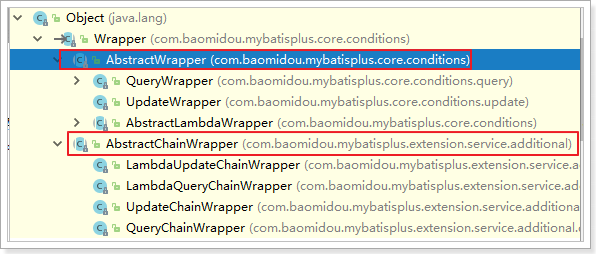

# MyBatis-Plus
## 一、了解Mybatis-Plus

### 1.1、Mybatis-Plus介绍

> MyBatis-Plus（简称 MP）是一个 MyBatis 的**增强**工具，在 MyBatis 的基础上**只做增强不做改变**，为简化开发、提高效率而生。
> 
> 官网：`https://baomidou.com/`


> **愿景**
> 
> 我们的愿景是成为 MyBatis 最好的搭档，就像 魂斗罗 中的 1P、2P，基友搭配，效率翻倍。


### 1.2、特性

> * **无侵入**：只做增强不做改变，引入它不会对现有工程产生影响，如丝般顺滑
> * **损耗小**：启动即会自动注入基本 CURD，性能基本无损耗，直接面向对象操作
> * **强大的 CRUD 操作**：内置通用 Mapper、通用 Service，仅仅通过少量配置即可实现单表大部分 CRUD 操作，更有强大的条件构造器，满足各类使用需求
> * **支持 Lambda 形式调用**：通过 Lambda 表达式，方便的编写各类查询条件，无需再担心字段写错
> * **支持多种数据库**：支持 MySQL、MariaDB、Oracle、DB2、H2、HSQL、SQLite、Postgre、SQLServer2005、SQLServer 等多种数据库
> * **支持主键自动生成**：支持多达 4 种主键策略（内含分布式唯一 ID 生成器 - Sequence），可自由配置，完美解决主键问题
> * **支持 XML 热加载**：Mapper 对应的 XML 支持热加载，对于简单的 CRUD 操作，甚至可以无 XML 启动
> * **支持 ActiveRecord 模式**：支持 ActiveRecord 形式调用，实体类只需继承 Model 类即可进行强大的 CRUD 操作
> * **支持自定义全局通用操作**：支持全局通用方法注入（ Write once, use anywhere ）
> * **支持关键词自动转义**：支持数据库关键词（order、key......）自动转义，还可自定义关键词
> * **内置代码生成器**：采用代码或者 Maven 插件可快速生成 Mapper 、 Model 、 Service 、 Controller 层代码，支持模板引擎，更有超多自定义配置等您来使用
> * **内置分页插件**：基于 MyBatis 物理分页，开发者无需关心具体操作，配置好插件之后，写分页等同于普通 List 查询
> * **内置性能分析插件**：可输出 Sql 语句以及其执行时间，建议开发测试时启用该功能，能快速揪出慢查询
> * **内置全局拦截插件**：提供全表 delete 、 update 操作智能分析阻断，也可自定义拦截规则，预防误操作
> * **内置 Sql 注入剥离器**：支持 Sql 注入剥离，有效预防 Sql 注入攻击

### 1.3、支持的数据库

> 任何能使用 `MyBatis` 进行 CRUD, 并且支持标准 SQL 的数据库，具体支持情况如下：
> 
> * `MySQL`，`Oracle`，`DB2`，`H2`，`HSQL`，`SQLite`，`PostgreSQL`，`SQLServer`，`Phoenix`，`Gauss`，`ClickHouse`，`Sybase`，`OceanBase`，`Firebird`，`Cubrid`，`Goldilocks`，`csiidb`；
> * 达梦数据库，虚谷数据库，人大金仓数据库，南大通用(华库)数据库，南大通用数据库，神通数据库，瀚高数据库

### 1.4、框架结构


## 二、入门案例

> `MyBatis-Plus`官方推荐使用`Spring Boot`，在此我们以`Spring`整合`MyBatis`为基础，再加入`MyBatis-plus`，以此来学习`MyBatis-Plus`相关内容。‘
> 
> 开发环境：
> 
> * JDK：JDK8+；
> * 构建工具：Maven 3.6.3；
> * MySQL：5.7+
> * Spring：5.2.6.RELEASE

### 2.1、创建数据库以及表

```sql
-- 创建测试表
DROP TABLE IF EXISTS user;

CREATE TABLE user (
    id BIGINT(20) NOT NULL COMMENT '主键ID',
    name VARCHAR(30) NULL DEFAULT NULL COMMENT '姓名',
    age INT(11) NULL DEFAULT NULL COMMENT '年龄',
    email VARCHAR(50) NULL DEFAULT NULL COMMENT '邮箱',
    PRIMARY KEY (id)
);

-- 插入测试数据
DELETE FROM user;

INSERT INTO user (id, name, age, email) VALUES
(1, 'Jone', 18, 'test1@baomidou.com'),
(2, 'Jack', 20, 'test2@baomidou.com'),
(3, 'Tom', 28, 'test3@baomidou.com'),
(4, 'Sandy', 21, 'test4@baomidou.com'),
(5, 'Billie', 24, 'test5@baomidou.com');
```

### 2.2、创建工程

> 新建普通`Maven`项目,  不要选择`Maven`骨架，引入`MyBatis-Plus`之后请不要再次引入`MyBatis`以及`MyBatis-Spring`，以避免因版本差异导致的问题。`pom.xml`配置如下：

```xml
<?xml version="1.0" encoding="UTF-8"?>
<project xmlns="http://maven.apache.org/POM/4.0.0"
         xmlns:xsi="http://www.w3.org/2001/XMLSchema-instance"
         xsi:schemaLocation="http://maven.apache.org/POM/4.0.0 http://maven.apache.org/xsd/maven-4.0.0.xsd">
    <modelVersion>4.0.0</modelVersion>

    <groupId>com.qfedu</groupId>
    <artifactId>mybatisplus_test</artifactId>
    <version>1.0.0</version>

    <properties>
        <maven.compiler.source>8</maven.compiler.source>
        <maven.compiler.target>8</maven.compiler.target>
        <spring.version>5.2.6.RELEASE</spring.version>
        <mybatis-plus.version>3.5.1</mybatis-plus.version>
    </properties>

    <dependencies>
        <dependency>
            <groupId>org.springframework</groupId>
            <artifactId>spring-context</artifactId>
            <version>${spring.version}</version>
        </dependency>
        <dependency>
            <groupId>org.springframework</groupId>
            <artifactId>spring-test</artifactId>
            <version>${spring.version}</version>
        </dependency>
        <dependency>
            <groupId>org.springframework</groupId>
            <artifactId>spring-jdbc</artifactId>
            <version>${spring.version}</version>
        </dependency>
        <dependency>
            <groupId>com.baomidou</groupId>
            <artifactId>mybatis-plus</artifactId>
            <version>${mybatis-plus.version}</version>
        </dependency>
        <dependency>
            <groupId>mysql</groupId>
            <artifactId>mysql-connector-java</artifactId>
            <version>5.1.49</version>
            <scope>runtime</scope>
        </dependency>
        <dependency>
            <groupId>com.alibaba</groupId>
            <artifactId>druid</artifactId>
            <version>1.2.4</version>
        </dependency>
        <dependency>
            <groupId>org.projectlombok</groupId>
            <artifactId>lombok</artifactId>
            <version>1.18.22</version>
        </dependency>
        <dependency>
            <groupId>log4j</groupId>
            <artifactId>log4j</artifactId>
            <version>1.2.17</version>
        </dependency>
        <dependency>
            <groupId>junit</groupId>
            <artifactId>junit</artifactId>
            <version>4.12</version>
            <scope>test</scope>
        </dependency>
    </dependencies>
</project>
```

### 2.3、`Spring`整合`MyBatis`

#### 2.3.1、创建实体

```java
@Data
@NoArgsConstructor
@AllArgsConstructor
public class User {
    private Long id;
    private String name;
    private Integer age;
    private String email;
}
```

#### 2.3.2、创建`jdbc.properties`

```properties
jdbc.driver=com.mysql.jdbc.Driver
jdbc.url=jdbc:mysql://localhost:3306/mybatisplus?useSSL=false&useUnicode=true&characterEncoding=UTF-8
jdbc.username=root
jdbc.password=root
```

#### 2.3.3、创建`Spring`核心配置文件

```xml
<?xml version="1.0" encoding="UTF-8"?>
<beans xmlns="http://www.springframework.org/schema/beans"
       xmlns:xsi="http://www.w3.org/2001/XMLSchema-instance"
       xmlns:context="http://www.springframework.org/schema/context"
       xsi:schemaLocation="http://www.springframework.org/schema/beans
            http://www.springframework.org/schema/beans/spring-beans.xsd
            http://www.springframework.org/schema/context
            http://www.springframework.org/schema/context/spring-context.xsd">
    <!-- 引入连接池配置文件 -->
    <context:property-placeholder location="classpath:jdbc.properties" />

    <!-- 包扫描 -->
    <context:component-scan base-package="com.qfedu.service.impl" />

    <!-- 配置连接池 -->
    <bean id="dataSource" class="com.alibaba.druid.pool.DruidDataSource">
        <property name="driverClassName" value="${jdbc.driver}" />
        <property name="url" value="${jdbc.url}" />
        <property name="username" value="${jdbc.username}" />
        <property name="password" value="${jdbc.password}" />
    </bean>
    <!--
        配置SqlSessionFactory
     -->
    <bean id="sqlSessionFactory" class="org.mybatis.spring.SqlSessionFactoryBean">
        <!-- 配置连接池 -->
        <property name="dataSource" ref="dataSource" />
        <!-- 配置别名 -->
        <property name="typeAliasesPackage" value="com.qfedu.bean" />
        <!-- 加载MyBatis的配置文件 -->
        <property name="configLocation" value="classpath:SqlMapConfig.xml" />
    </bean>
    <!--
        配置mapper接口的扫描配置
        由mybatis-spring提供，可以将指定包下所有的mapper接口创建动态代理
        并将这些动态代理作为IOC容器的bean管理
     -->
    <bean id="mapperScanner" class="org.mybatis.spring.mapper.MapperScannerConfigurer">
        <property name="basePackage" value="com.qfedu.mapper" />
    </bean>
</beans>
```

#### 2.3.4、创建`MyBatis`核心配置文件

```xml
<?xml version="1.0" encoding="UTF-8" ?>
<!DOCTYPE configuration
        PUBLIC "-//mybatis.org//DTD Config 3.0//EN"
        "http://mybatis.org/dtd/mybatis-3-config.dtd">
<configuration>
    <settings>
        <!-- 打印查询语句 -->
        <setting name="logImpl" value="LOG4J" />
    </settings>
</configuration>
```

#### 2.3.5、创建`Mapper`接口

```java
import com.qfedu.bean.User;
import java.util.List;

public interface UserMapper {
    List<User> findAll();
}

```

#### 2.3.6、创建`Mapper`映射文件

```xml
<?xml version="1.0" encoding="UTF-8" ?>
<!DOCTYPE mapper PUBLIC "-//mybatis.org//DTD Mapper 3.0//EN" "http://mybatis.org/dtd/mybatis-3-mapper.dtd" >
<mapper namespace="com.qfedu.mapper.UserMapper">
    <select id="findAll" resultType="user">
        select * from user
    </select>
</mapper>
```

#### 2.3.7、创建`Service`接口及其实现类

```java
public interface UserService {
    List<User> findAll();
}

@Service
public class UserServiceImpl implements UserService {
    @Autowired
    private UserMapper userMapper;

    @Override
    public List<User> findAll() {
        return userMapper.findAll();
    }
}
```

#### 2.3.8、增加`log4j`配置文件

```properties
#
# Hibernate, Relational Persistence for Idiomatic Java
#
# License: GNU Lesser General Public License (LGPL), version 2.1 or later.
# See the lgpl.txt file in the root directory or <http://www.gnu.org/licenses/lgpl-2.1.html>.
#

### direct log messages to stdout ###
log4j.appender.stdout=org.apache.log4j.ConsoleAppender
log4j.appender.stdout.Target=System.err
log4j.appender.stdout.layout=org.apache.log4j.PatternLayout
log4j.appender.stdout.layout.ConversionPattern=%d{ABSOLUTE} %5p %c{1}:%L - %m%n

### direct messages to file hibernate.log ###
#log4j.appender.file=org.apache.log4j.FileAppender
#log4j.appender.file.File=hibernate.log
#log4j.appender.file.layout=org.apache.log4j.PatternLayout
#log4j.appender.file.layout.ConversionPattern=%d{ABSOLUTE} %5p %c{1}:%L - %m%n

### set log levels - for more verbose logging change 'info' to 'debug' ###

log4j.rootLogger=debug, stdout
```

#### 2.3.9、测试

```java
//Spring整合Junit
@RunWith(SpringJUnit4ClassRunner.class)
@ContextConfiguration(locations = "classpath:beans.xml")
public class MyTest {
    @Autowired
    private UserMapper userMapper;

    @Autowired
    private UserService userService;

    @Test
    public void test1() {
        userMapper.findAll().forEach(System.out::println);
    }

    @Test
    public void test2() {
        userService.findAll().forEach(System.out::println);
    }
}
```

### 2.4、加入`MyBatis-Plus`    重要

#### 2.4.1、修改`Spring`核心配置文件

```xml
<?xml version="1.0" encoding="UTF-8"?>
<beans xmlns="http://www.springframework.org/schema/beans"
       xmlns:xsi="http://www.w3.org/2001/XMLSchema-instance"
       xmlns:context="http://www.springframework.org/schema/context"
       xsi:schemaLocation="http://www.springframework.org/schema/beans
            http://www.springframework.org/schema/beans/spring-beans.xsd
            http://www.springframework.org/schema/context
            http://www.springframework.org/schema/context/spring-context.xsd">
    <!-- 引入连接池配置文件 -->
    <context:property-placeholder location="classpath:jdbc.properties" />

    <!-- 包扫描 -->
    <context:component-scan base-package="com.qfedu.service.impl" />

    <!-- 配置连接池 -->
    <bean id="dataSource" class="com.alibaba.druid.pool.DruidDataSource">
        <property name="driverClassName" value="${jdbc.driver}" />
        <property name="url" value="${jdbc.url}" />
        <property name="username" value="${jdbc.username}" />
        <property name="password" value="${jdbc.password}" />
    </bean>
    <!--
        配置SqlSessionFactory
        调整SqlSessionFactory为MyBatis-Plus的SqlSessionFactory
     -->
    <bean id="sqlSessionFactory" class="com.baomidou.mybatisplus.extension.spring.MybatisSqlSessionFactoryBean">
        <!-- 配置连接池 -->
        <property name="dataSource" ref="dataSource" />
        <!-- 配置别名 -->
        <property name="typeAliasesPackage" value="com.qfedu.bean" />
        <!-- 加载MyBatis的配置文件 -->
        <property name="configLocation" value="classpath:SqlMapConfig.xml" />
<!--        <property name="globalConfig" ref="globalConfig" />-->
    </bean>
    <!--
        配置mapper接口的扫描配置
        由mybatis-spring提供，可以将指定包下所有的mapper接口创建动态代理
        并将这些动态代理作为IOC容器的bean管理
     -->
    <bean id="mapperScanner" class="org.mybatis.spring.mapper.MapperScannerConfigurer">
        <property name="basePackage" value="com.qfedu.mapper" />
    </bean>
```

#### 2.4.2、创建`Mapper`接口

```java
import com.baomidou.mybatisplus.core.mapper.BaseMapper;
import com.qfedu.bean.User;

public interface UserMapper extends BaseMapper<User> {
}
```

> `BaseMapper<T>`是`MyBatis-Plus`提供的基础`Mapper`接口，泛型为所操作的实体类型，其中包括CRUD的各种方法，我们的`mapper`继承了`BaseMapper`之后，就可以直接使用`BaseMapper`所提供的各种方法，而不需要编写映射文件以及`SQL`语句，大大的提高了开发效率。
> 
> 注：如果要完成`BaseMapper`没有的功能，还是要像之前一样定义接口，写`Mapper`映射文件。  

#### 2.4.3、测试

```java
@RunWith(SpringJUnit4ClassRunner.class)
@ContextConfiguration(locations = "classpath:beans.xml")
public class MyTest {
    @Autowired
    private UserMapper userMapper;

    @Test
    public void test1() {
        //查询所有
        List<User> userList = userMapper.selectList(null);
        userList.stream().forEach(System.out::println);
    }
}
```

> 总结：在`Spring`整合`MyBatis`中加入了`MyBatis-Plus`后，我们就可以使用`MyBatis-Plus`所提供的`BaseMapper`实现`CRUD`，并不需要编写映射文件以及`SQL`语句。但是若要自定义`SQL`语句，仍然可以编写映射文件而不造成任何影响，因为`MyBatis-Plus`只做增强，而不做改变。  

## 三、CRUD接口   重要    

### 3.1、`Mapper CRUD`接口  重要

#### 3.1.1、`Insert`

```java
// 插入一条记录
int insert(T entity);
```

**参数说明**

| 类型  | 参数名    | 描述   |
|:--- |:------ |:---- |
| T   | entity | 实体对象 |

**案例**

```java
@Test
public void testInsert() {
    User user = new User(null, "张三", 20, "zs@126.com");
    //INSERT INTO user ( id, name, age, email ) VALUES ( ?, ?, ?, ? )
    int result = userMapper.insert(user);

    System.out.println(user);
    System.out.println(result);
}
```

> 最终执行的结果，所获取的id为`1500813820996714498`，这是因为`MyBatis-Plus`在实现插入数据时，会默认基于雪花算法的策略生成`id`。 

#### 3.1.2、`Delete`

```java
// 根据 entity 条件，删除记录
int delete(@Param(Constants.WRAPPER) Wrapper<T> wrapper);
// 删除（根据ID 批量删除）
int deleteBatchIds(@Param(Constants.COLLECTION) Collection<? extends Serializable> idList);
// 根据 ID 删除
int deleteById(Serializable id);
// 根据 columnMap 条件，删除记录
int deleteByMap(@Param(Constants.COLUMN_MAP) Map<String, Object> columnMap);
```

**参数说明**

| 类型                                 | 参数名    | 描述                                 |
| :----------------------------------- | :-------- | :----------------------------------- |
| `Wrapper<T>`                         | wrapper   | 实体对象封装操作类（可以为 null）    |
| `Collection<? extends Serializable>` | idList    | 主键 ID 列表(不能为 null 以及 empty) |
| `Serializable`                       | id        | 主键 ID                              |
| `Map<String, Object>`                | columnMap | 表字段 map 对象                      |

**案例**

```java
@Test
public void testDeleteById() {
    //DELETE FROM user WHERE id=?
    int i = userMapper.deleteById(1500092790474260482L);
    System.out.println(i);
}

@Test
public void testDeleteBatchIds() {
    //DELETE FROM user WHERE id IN ( ? , ? , ? )
    Long[] ids = {1500093260177522689L, 1500093259107975169L, 1500093260244631554L};
    int i = userMapper.deleteBatchIds(Arrays.asList(ids));
    System.out.println(i);
}

@Test
public void testDeleteByMap() {
    //DELETE FROM user WHERE name = ? AND age = ?
    Map<String, Object> map = new HashMap<>();
    map.put("age", 60);
    map.put("name", "张三40");

    int i = userMapper.deleteByMap(map);
    System.out.println(i);
}
```

#### 3.1.3、`Update`

```java
// 根据 whereWrapper 条件，更新记录
int update(@Param(Constants.ENTITY) T updateEntity, @Param(Constants.WRAPPER) Wrapper<T> whereWrapper);
// 根据 ID 修改
int updateById(@Param(Constants.ENTITY) T entity);
```

**参数说明**

| 类型         | 参数名        | 描述                                                         |
| :----------- | :------------ | :----------------------------------------------------------- |
| `T`          | entity        | 实体对象 (set 条件值,可为 null)                              |
| `Wrapper<T>` | updateWrapper | 实体对象封装操作类（可以为 null,里面的 entity 用于生成 where 语句） |

**案例**

```java
@Test
public void testUpdateById() {
    //UPDATE user SET name=?, age=? WHERE id=?
    User user = new User(1500813820996714498L, "zs", 20, null);
    int i = userMapper.updateById(user);
    System.out.println(i);
}
```

#### 3.1.4、`Selete`

```java
// 根据 ID 查询
T selectById(Serializable id);
// 根据 entity 条件，查询一条记录
T selectOne(@Param(Constants.WRAPPER) Wrapper<T> queryWrapper);

// 查询（根据ID 批量查询）
List<T> selectBatchIds(@Param(Constants.COLLECTION) Collection<? extends Serializable> idList);
// 根据 entity 条件，查询全部记录
List<T> selectList(@Param(Constants.WRAPPER) Wrapper<T> queryWrapper);
// 查询（根据 columnMap 条件）
List<T> selectByMap(@Param(Constants.COLUMN_MAP) Map<String, Object> columnMap);
// 根据 Wrapper 条件，查询全部记录
List<Map<String, Object>> selectMaps(@Param(Constants.WRAPPER) Wrapper<T> queryWrapper);
// 根据 Wrapper 条件，查询全部记录。注意： 只返回第一个字段的值
List<Object> selectObjs(@Param(Constants.WRAPPER) Wrapper<T> queryWrapper);

// 根据 entity 条件，查询全部记录（并翻页）
IPage<T> selectPage(IPage<T> page, @Param(Constants.WRAPPER) Wrapper<T> queryWrapper);
// 根据 Wrapper 条件，查询全部记录（并翻页）
IPage<Map<String, Object>> selectMapsPage(IPage<T> page, @Param(Constants.WRAPPER) Wrapper<T> queryWrapper);
// 根据 Wrapper 条件，查询总记录数
Integer selectCount(@Param(Constants.WRAPPER) Wrapper<T> queryWrapper);
```

**参数说明**

| 类型                               | 参数名       | 描述                                     |
| :--------------------------------- | :----------- | :--------------------------------------- |
| Serializable                       | id           | 主键 ID                                  |
| `Wrapper<T>`                       | queryWrapper | 实体对象封装操作类（可以为 null）        |
| Collection<? extends Serializable> | idList       | 主键 ID 列表(不能为 null 以及 empty)     |
| Map<String, Object>                | columnMap    | 表字段 map 对象                          |
| `IPage<T>`                         | page         | 分页查询条件（可以为 RowBounds.DEFAULT） |

> 通过观察`BaseMapper`中的方法，大多方法中都有`Wrapper`类型的形参，此为条件构造器，可针对于`SQL`语句设置不同的条件，若没有条件，则可以为该形参赋值`null`，即查询（删除/修改）所有数据。 

**案例**

```java
@Test
public void testSelectById() {
    //SELECT id,name,age,email FROM user WHERE id=?
    User user = userMapper.selectById(1500813820996714498L);
    System.out.println(user);
}

@Test
public void testSelectBatchIds() {
    //SELECT id,name,age,email FROM user WHERE id IN ( ? , ? , ? )
    List<User> users = userMapper.selectBatchIds(Arrays.asList(1L, 2L, 3L));
    users.stream().forEach(System.out::println);
}

@Test
public void testSelectByMap() {
    Map<String, Object> map = new HashMap<>();
    map.put("age", 61);
    map.put("name", "张三41");
    //SELECT id,name,age,email FROM user WHERE name = ? AND age = ?
    List<User> users = userMapper.selectByMap(map);
    System.out.println(users);
}
```

### 3.2、`Service CRUD`接口     重要

> 1 使Servcie层的接口继承IService，并指明泛型类型

> 2 使Service层的实现类继承ServiceImpl<UserMapper, T>，传入自定义的Mapper，指明实体类类型，实现自定义的Service层接口

> 说明:
> 
> - 通用`Service CRUD`封装`IService`接口，进一步封装`CRUD`采用`get查询单行`、`remove删除`、 `list查询集合`、`page分页`，前缀命名方式区分`Mapper`层避免混淆；
> - 泛型`T`为任意实体对象；
> - 建议如果存在自定义通用`Service`方法的可能，请创建自己的`IBaseService`继承`Mybatis-Plus`提供的基类；
> - 对象`Wrapper` 为**条件构造器**。

#### 3.2.1、创建`Servie`接口和实现类

```java
//UserService继承IService模板提供的基础功能
public interface UserService extends IService<User> {
}

/**
 * ServiceImpl实现了IService，提供了IService中基础功能的实现
 * 若ServiceImpl无法满足业务需求，则可以使用自定的UserService定义方法，并在实现类中实现
 */
@Service
public class UserServiceImpl extends ServiceImpl<UserMapper, User> implements UserService {
}
```

#### 3.2.2、测试

```java
@RunWith(SpringJUnit4ClassRunner.class)
@ContextConfiguration(locations = "classpath:beans.xml")
public class MyTest1 {
    @Autowired
    private UserService userService;

    @Test
    public void testSave() {
        User user = new User(null, "ls", 21, "abcd@126.com");
        boolean save = userService.save(user);
        System.out.println(save);
    }

    @Test
    public void saveOrUpdate() {
        User user = new User(100L, "tom", 22, "zs22@126.com");
        boolean result = userService.saveOrUpdate(user);
        System.out.println(result);
    }

    //求总数
    @Test
    public void testCount() {
        long count = userService.count();   
        System.out.println(count);
    }

    @Test
    public void testSaveBatch(){
        ArrayList<User> users = new ArrayList<>();
        for (int i = 0; i < 5; i++) {
            User user = new User();
            user.setName("zs" + i);
            user.setAge(20 + i);
            users.add(user);
        }
        userService.saveBatch(users);
    }
}
```

## 四、常用注解   重要

### 4.1、`@TableName`

#### 4.1.1、如何使用

> 经过以上的测试，在使用`MyBatis-Plus`实现基本的`CRUD`时，我们并没有指定要操作的表，只是在`Mapper`接口继承`BaseMapper`时，设置了泛型`User`，而操作的表为`user`表。
> 
> 由此得出结论，`MyBatis-Plus`在确定操作的表时，由`BaseMapper`的泛型决定，即实体类型决定，且默认操作的表名和实体类型的类名一致。
> 
> **若实体类类型的类名和要操作的表的表名不一致，程序抛出异常。**
> 
> 为了解决上面的问题，在实体类类型上添加`@TableName("表名")`，标识实体类对应的表，即可成功执行`SQL`语句。

```java
@Data
@NoArgsConstructor
@AllArgsConstructor
@TableName("tb_user")
public class User {
    private Long id;
    private String name;
    private Integer age;
    private String email;
}
```

#### 4.1.2、通过`GlobalConfig`批量添加前缀 了解   

​       查资料！！！

> 在开发的过程中，我们经常遇到以上的问题，即实体类所对应的表都有固定的前缀，例如`t_`或`tb_`。
> 
> 此时，可以使用`MyBatis-Plus`提供的全局配置，为实体类所对应的表名设置默认的前缀，那么就不需要在每个实体类上通过`@TableName`标识实体类对应的表。

```xml
<bean id="sqlSessionFactory" class="com.baomidou.mybatisplus.extension.spring.MybatisSqlSessionFactoryBean">
    <!-- 配置连接池 -->
    <property name="dataSource" ref="dataSource" />
    <!-- 配置别名 -->
    <property name="typeAliasesPackage" value="com.qfedu.bean" />
    <!-- 加载MyBatis的配置文件 -->
    <property name="configLocation" value="classpath:SqlMapConfig.xml" />
    <!-- MyBatis-Plus 全局策略配置 -->
    <property name="globalConfig" ref="globalConfig" />
</bean>


<bean id="globalConfig" class="com.baomidou.mybatisplus.core.config.GlobalConfig">
    <property name="dbConfig" ref="dbConfig" />
</bean>

<bean id="dbConfig" class="com.baomidou.mybatisplus.core.config.GlobalConfig$DbConfig">
    <property name="tablePrefix" value="tb_" />  
</bean>
```

### 4.2、`@TableId`

#### 4.2.1、基本使用

> 经过以上的测试，`MyBatis-Plus`在实现`CRUD`时，会默认将`id`作为主键列，并在插入数据时，默认基于雪花算法的策略生成`id`。
> 
> 若实体类和表中表示主键的不是`id`，而是其他字段，我们将实体类中的属性`id`改为`uid`，将表中的字段`id`也改为`uid`，程序抛出异常。
> 
> 在实体类中`uid`属性上通过`@TableId`将其标识为主键，即可成功执行`SQL`语句。  

```java
@Data
@NoArgsConstructor
@AllArgsConstructor
@TableName("tb_user")
public class User {
    @TableId
    private Long uid;
    private String name;
    private Integer age;
    private String email;
}
```

#### 4.2.2、`value`属性

> 若实体类中主键对应的属性为`id`，而表中表示主键的字段为`uid`，此时若只在属性`id`上添加注解`@TableId`，则抛出异常`Unknown column 'id' in 'field list'`，即`MyBatis-Plus`仍然会将`id`作为表的主键操作，而表中表示主键的是字段`uid`
> 
> 此时需要通过`@TableId`注解的`value`属性，指定表中的主键字段，`@TableId("uid")`或`@TableId(value="uid")`  

```java
@Data
@NoArgsConstructor
@AllArgsConstructor
@TableName("tb_user")
public class User {
    @TableId(value = "uid", type=IdType.AUTO)
    private Long id;
    private String name;
    private Integer age;
    private String email;
}
```

#### 4.2.3、`type`属性   

**IdType.AUTO   最常用 ** 主键生成策略

> 作用：指定主键类型

| 值                 | 描述                                                         |
| :----------------- | :----------------------------------------------------------- |
| IdType.AUTO        | 数据库`ID`自增       常用！！！                              |
| IdType.NONE        | 无状态，该类型为未设置主键类型（注解里等于跟随全局，全局里约等于INPUT） |
| IdType.INPUT       | insert前自行set主键值                                        |
| IdType.ASSIGN_ID   | 分配ID(主键类型为Number(Long 和 Integer)或 String)(since 3.3.0),使用接口`IdentifierGenerator`的方法`nextId`(默认实现类为`DefaultIdentifierGenerator`雪花算法) |
| IdType.ASSIGN_UUID | 分配 UUID,主键类型为 String(since 3.3.0),使用接口`IdentifierGenerator`的方法`nextUUID`(默认 default 方法) |

> 关于雪花算法：
> 
> * [面试官：讲讲雪花算法，越详细越好](https://segmentfault.com/a/1190000040964518)

### 4.3、`@TableField`

> MyBatis-Plus在执行SQL语句时，要保证实体类中的属性名和表中的字段名一致，如果实体类中的属性名和字段名不一致的情况，会出现什么问题呢？  
> 
> **情况1：**若实体类中的属性使用的是驼峰命名风格，而表中的字段使用的是下划线命名风格，例如实体类属性`userName`，表中字段`user_name`，此时`MyBatis-Plus`会自动将下划线命名风格转化为驼峰命名风格。
> 
> **情况2：**若实体类中的属性和表中的字段不满足情况1，例如实体类属性`name`，表中字段`username`，此时需要在实体类属性上使用`@TableField("username")`设置属性所对应的列名。 

```java
@Data
@NoArgsConstructor
@AllArgsConstructor
@TableName("tb_user")
public class User {
    @TableId(value = "uid")
    private Long id;
    @TableField("username")
    private String name;
    private Integer age;
    private String email;
}
```

### 4.4、`@TableLogic`     （逻辑删除）

#### 4.4.1、关于删除

> * **物理删除：**真实删除，将对应数据从数据库中删除，之后查询不到此条被删除的数据；
> * **逻辑删除：**假删除，将对应数据中代表是否被删除字段的状态修改为`被删除状态`，之后在数据库
>   中仍旧能看到此条数据记录；      一列（标志位 ，is_deleted  :  0 未删除 1 已删除）
> * **使用场景：**可以进行数据恢复。  

#### 4.4.2、实现逻辑删除

> 步骤：
> 
> 1. 数据库中创建逻辑删除状态列(`is_deleted`)，设置默认值为0；
> 2. 实体类中添加逻辑删除属性，并在该属性上添加`@TableLogic`注解

```java
@Data
@NoArgsConstructor
@AllArgsConstructor
@TableName("tb_user")
public class User {
    @TableId(value = "uid")
    private Long id;
    private String name;
    private Integer age;
    private String email;
    @TableLogic
    private Integer isDeleted;      //0 :未删除  1：已删除
}

@Test
public void testDeleteById() {
    //测试删除功能，真正执行的是修改
    //UPDATE tb_user SET is_deleted=1 WHERE uid=? AND is_deleted=0
    int i = userMapper.deleteById(1500822918454702085L);
    System.out.println(i);
}

@Test
public void testFindAll() {
    //测试查询功能，被逻辑删除的数据默认不会被查询
    //SELECT uid AS id,name,age,email,is_deleted FROM tb_user WHERE is_deleted=0
    List<User> users = userMapper.selectList(null);
    users.forEach(System.out::println);
}
```

## 五、条件构造器  重点

在`MyBatis-Plus`中，`Wrapper`接口的实现类关系如下：



可以看到，`AbstractWrapper`和`AbstractChainWrapper`是重点实现，接下来我们重点学习`AbstractWrapper`以及其子类。

> **`QueryWrapper`：查询条件封装    项目中常用**
>
> `UpdateWrapper`：`Update`条件封装
>
> 

### 5.1、组装查询条件

大于gt   大于等于ge

小于lt    小于等于le

模糊查询 like   范围函数between 

空 isNull  非空isNotNull

等于 eq

```java
@Test
public void test1() {
    //查询用户名包含a，年龄在20到30之间，并且邮箱不为null的用户信息
    //SELECT uid AS id,name,age,email,is_deleted FROM tb_user WHERE is_deleted=0 AND (name LIKE ? AND age BETWEEN ? AND ? AND email IS NOT NULL)
    QueryWrapper<User> queryWrapper = new QueryWrapper<>();
    queryWrapper.like("name", "a")    // 链式写法    name like '%a%'
        .between("age", 20, 30)
        .isNotNull("email");  
    List<User> list = userMapper.selectList(queryWrapper);
    list.forEach(System.out::println);
}
```

### 5.2、组装排序条件

升序 orderByAsc

降序 orderByDesc

```java
@Test
public void test2() {
    //按年龄降序查询用户，如果年龄相同则按id升序排列
    //SELECT id,username AS name,age,email,is_deleted FROM t_user WHERE is_deleted=0 ORDER BY age DESC,id ASC
    QueryWrapper<User> queryWrapper = new QueryWrapper<>();
    queryWrapper
        .orderByDesc("age")
        .orderByAsc("id");
    List<User> users = userMapper.selectList(queryWrapper);
    users.forEach(System.out::println);
}
```

### 5.3、组装删除条件

```java
@Test
public void test3() {
    //删除email为空的用户
    //UPDATE tb_user SET is_deleted=1 WHERE is_deleted=0 AND (email IS NULL)
    QueryWrapper<User> queryWrapper = new QueryWrapper<>();
    queryWrapper.isNull("email");
    //条件构造器也可以构建删除语句的条件
    int result = userMapper.delete(queryWrapper);
    System.out.println("受影响的行数：" + result);
}
```

### 5.4、条件的优先级        难点 

 条件优先级1  总体是or的关系，   （用户名包含a 且年龄20到30之间） or  email 以test开头

 条件优先级2   总体是and的关系，某一个子条件是or的关系 ，需要用lambda表达式

```java
@Test
public void test4() {
    QueryWrapper<User> queryWrapper = new QueryWrapper<>();
    //将（年龄大于20并且用户名中包含有a）或邮箱为null的用户信息修改
     // where (age >20 and name like '%a%') or email is null
    //UPDATE tb_user SET age=?, email=? WHERE is_deleted=0 AND (name LIKE ? AND age > ? OR email IS NULL)
    queryWrapper
        .like("name", "a")
        .gt("age", 20)
        .or()
        .isNull("email");

    User user = new User();
    user.setAge(28);
    user.setEmail("aaa@ccc.com");
    int result = userMapper.update(user, queryWrapper);
    System.out.println("受影响的行数：" + result);
}

where (age >20 or email is null ) and name like '%a%'
     
@Test
public void test5() {
    QueryWrapper<User> queryWrapper = new QueryWrapper<>();
    //将（年龄大于20或邮箱为null）并且用户名中包含有a的用户信息修改
    //UPDATE tb_user SET age=?, email=? WHERE is_deleted=0 AND (name LIKE ? AND (age > ? OR email IS NULL))
    //lambda表达式内的逻辑优先运算
    queryWrapper
        .like("name", "a")
        .and(i -> i.gt("age", 20).or().isNull("email"));
    User user = new User();
    user.setAge(18);
    user.setEmail("user@ccc.com");
    int result = userMapper.update(user, queryWrapper);
    System.out.println("受影响的行数：" + result);
}
```

### 5.5、组装`select`语句

指明查哪几列

```java
查询 年龄大约等于18 的人，只查询name ,age

@Test
public void test6() {
    //查询用户信息的username和age字段
    //SELECT name,age FROM tb_user WHERE is_deleted=0
    QueryWrapper<User> queryWrapper = new QueryWrapper<>();
    queryWrapper.select("name", "age");
    //selectMaps()返回Map集合列表，通常配合select()使用，避免User对象中没有被查询到的列值为null
    List<Map<String, Object>> maps = userMapper.selectMaps(queryWrapper);
    maps.forEach(System.out::println);
}
```

### 5.6、实现子查询

inSql( )

```java
@Test
public void test7() {
    //查询年龄大于id为5的用户的年龄的所有用户信息
    //select * from tb_user where age>(select age from tb_user where id=5)
    QueryWrapper<User> wrapper = new QueryWrapper<>();
    wrapper.gtSql("age","select age from tb_user where id=5");

    List<User> userList = userMapper.selectList(wrapper);
    userList.forEach(System.out::println);
}
```

### 5.7、`UpdateWrapper           `

```java
@Test
public void test8() {
    //将（年龄大于20或邮箱为null）并且用户名中包含有a的用户信息修改
    //组装set子句以及修改条件
    UpdateWrapper<User> updateWrapper = new UpdateWrapper<>();
    //lambda表达式内的逻辑优先运算
    updateWrapper
        .set("age", 18)
        .set("email", "user@ccc.com")
        .like("name", "a")
        .and(i -> i.gt("age", 20).or().isNull("email"));
    //这里必须要创建User对象，否则无法应用自动填充。如果没有自动填充，可以设置为null
    //UPDATE tb_user SET name=?, age=?,email=? WHERE is_deleted=0 AND (name LIKE ? AND (age > ? OR email IS NULL))
    User user = new User();
    user.setName("张三");
    int result = userMapper.update(user, updateWrapper);
    //UPDATE tb_user SET age=?,email=? WHERE is_deleted=0 AND (name LIKE ? AND (age > ? OR email IS NULL))
    //int result = userMapper.update(null, updateWrapper);
    System.out.println(result);
}
```

### 5.8、组装条件

> 在真正开发的过程中，组装条件是常见的功能，而这些条件数据来源于用户输入，是可选的，因此我们在组装这些条件时，必须先判断用户是否选择了这些条件，若选择则需要组装该条件，若没有选择则一定不能组装，以免影响`SQL`执行的结果。 


```java


@Test
public void test9() {
    //定义查询条件，有可能为null（用户未输入或未选择）
    String name = null;
    Integer ageBegin = 10;
    Integer ageEnd = 24;
    QueryWrapper<User> queryWrapper = new QueryWrapper<>();
    //StringUtils.isNotBlank()判断某字符串是否不为空且长度不为0且不由空白符(whitespace)构成
    if(StringUtils.isNotBlank(name)){
        queryWrapper.like("name","a");
    }
    if(ageBegin != null){
        queryWrapper.ge("age", ageBegin);
    }
    if(ageEnd != null){
        queryWrapper.le("age", ageEnd);
    }
    //SELECT uid AS id,name,age,email,is_deleted FROM tb_user WHERE is_deleted=0 AND (age >= ? AND age <= ?)
    List<User> users = userMapper.selectList(queryWrapper);
    users.forEach(System.out::println);
}

@Test
public void test10() {
    //定义查询条件，有可能为null（用户未输入或未选择）
    String name = null;
    Integer ageBegin = 10;
    Integer ageEnd = 24;
    QueryWrapper<User> queryWrapper = new QueryWrapper<>();
    //StringUtils.isNotBlank()判断某字符串是否不为空且长度不为0且不由空白符(whitespace)构成
    queryWrapper
        .like(StringUtils.isNotBlank(name), "name", "a")
        .ge(ageBegin != null, "age", ageBegin)
        .le(ageEnd != null, "age", ageEnd);
    //SELECT uid AS id,name,age,email,is_deleted FROM tb_user WHERE is_deleted=0 AND (age >= ? AND age <= ?)
    List<User> users = userMapper.selectList(queryWrapper);
    users.forEach(System.out::println);
}
```

## 六、分页插件


> `MyBatis Plus`自带分页插件，只要简单的配置即可实现分页功能.  
>
> 1 配置，查文档（板书）
>
> 2 

### 6.1、添加配置

```xml
<!-- 配置SqlSessionFactory -->
<bean id="sqlSessionFactory" class="com.baomidou.mybatisplus.extension.spring.MybatisSqlSessionFactoryBean">
    <!-- 配置连接池 -->
    <property name="dataSource" ref="dataSource" />
    <!-- 配置别名 -->
    <property name="typeAliasesPackage" value="com.qfedu.bean" />
    <!-- 加载MyBatis的配置文件 -->
    <property name="configLocation" value="classpath:SqlMapConfig.xml" />
    <property name="globalConfig" ref="globalConfig" />
    <!--配置插件-->
    <property name="plugins">
        <array>
            <ref bean="mybatisPlusInterceptor"></ref>
        </array>
    </property>
</bean>

<!--配置MyBatis-Plus插件-->
<bean id="mybatisPlusInterceptor"
      class="com.baomidou.mybatisplus.extension.plugins.MybatisPlusInterceptor">
    <property name="interceptors">
        <list>
            <ref bean="paginationInnerInterceptor"></ref>
        </list>
    </property>
</bean>

<!--配置MyBatis-Plus分页插件的bean-->
<bean id="paginationInnerInterceptor"
      class="com.baomidou.mybatisplus.extension.plugins.inner.PaginationInnerInterceptor">
    <!--设置数据库类型-->
    <property name="dbType" value="MYSQL"></property>
</bean>
```

### 6.2、测试

```java
@Test
public void test11() {
    //设置分页参数
    Page<User> page = new Page<>(1, 5);
    //SELECT COUNT(*) AS total FROM tb_user WHERE is_deleted = 0
    //SELECT uid AS id,name,age,email,is_deleted FROM tb_user WHERE is_deleted=0 LIMIT ?,?
    userMapper.selectPage(page, null);
    //获取分页数据
    List<User> list = page.getRecords();
    list.forEach(System.out::println);
    System.out.println("当前页："+page.getCurrent());
    System.out.println("每页显示的条数："+page.getSize());
    System.out.println("总记录数："+page.getTotal());
    System.out.println("总页数："+page.getPages());
    System.out.println("是否有上一页："+page.hasPrevious());
    System.out.println("是否有下一页："+page.hasNext());
}

@Test
public void test12() {
    //设置分页参数
    Page<User> page = new Page<>(2, 5);
    //SELECT COUNT(*) AS total FROM tb_user WHERE is_deleted = 0
    //SELECT uid AS id,name,age,email,is_deleted FROM tb_user WHERE is_deleted=0 LIMIT ?,?
    userService.page(page);
    //获取分页数据
    List<User> list = page.getRecords();
    list.forEach(System.out::println);
    System.out.println("当前页："+page.getCurrent());
    System.out.println("每页显示的条数："+page.getSize());
    System.out.println("总记录数："+page.getTotal());
    System.out.println("总页数："+page.getPages());
    System.out.println("是否有上一页："+page.hasPrevious());
    System.out.println("是否有下一页："+page.hasNext());
}
```

### 6.3、`xml`自定义分页

#### 6.3.1、`UserMapper`中定义接口方法

```java
public interface UserMapper extends BaseMapper<User> {
    /**
     * 根据年龄查询用户列表，分页显示
     * @param page page分页对象, xml中可以从里面进行取值, 传递参数Page即自动分页,必须放在第一位
     * @param age 年龄
     * @return
     */
    IPage<User> selectPageVo(@Param("page") Page<User> page, @Param("age") Integer age);
}
```

#### 6.3.2、`UserMapper.xml`中编写`SQL`

```xml
<?xml version="1.0" encoding="UTF-8" ?>
<!DOCTYPE mapper PUBLIC "-//mybatis.org//DTD Mapper 3.0//EN" "http://mybatis.org/dtd/mybatis-3-mapper.dtd" >
<mapper namespace="com.qfedu.mapper.UserMapper">
    <select id="selectPageVo" resultType="com.qfedu.bean.User">
        SELECT
            uid AS id,name,age,email,is_deleted
        FROM
            tb_user
        WHERE
            is_deleted=0 and age > #{age}
    </select>
</mapper>
```

#### 6.3.3、测试

```java
@Test
public void test13(){
    //设置分页参数
    Page<User> page = new Page<>(2, 5);
    //SELECT COUNT(*) AS total FROM tb_user WHERE is_deleted = 0 AND age > ?
    //SELECT uid AS id,name,age,email,is_deleted FROM tb_user WHERE is_deleted=0 and age > ? LIMIT ?,?
    userMapper.selectPageVo(page, 20);
    //获取分页数据
    List<User> list = page.getRecords();
    list.forEach(System.out::println);
    System.out.println("当前页："+page.getCurrent());
    System.out.println("每页显示的条数："+page.getSize());
    System.out.println("总记录数："+page.getTotal());
    System.out.println("总页数："+page.getPages());
    System.out.println("是否有上一页："+page.hasPrevious());
    System.out.println("是否有下一页："+page.hasNext());
}
```

## 七、代码生成器   重要

> AutoGenerator 是 MyBatis-Plus 的代码生成器，通过 AutoGenerator 可以快速生成 Entity（Bean）、Mapper、Mapper XML、Service、Controller 等各个模块的代码，极大的提升了开发效率。

### 7.1、添加依赖

```xml
 <dependency>
        <groupId>mysql</groupId>
        <artifactId>mysql-connector-java</artifactId>
        <version>5.1.49</version>
    </dependency>
    <dependency>
        <groupId>com.baomidou</groupId>
        <artifactId>mybatis-plus</artifactId>
        <version>3.5.1</version>
    </dependency>
    <dependency>
        <groupId>com.baomidou</groupId>
        <artifactId>mybatis-plus-generator</artifactId>
        <version>3.5.1</version>
    </dependency>
    <dependency>
        <groupId>org.freemarker</groupId>
        <artifactId>freemarker</artifactId>
        <version>2.3.31</version>
    </dependency>
    <dependency>
        <groupId>org.slf4j</groupId>
        <artifactId>slf4j-api</artifactId>
        <version>1.7.30</version>
    </dependency>

```

### 7.2、编写配置

> 配置写在main方法中就可以

```java
import com.baomidou.mybatisplus.generator.FastAutoGenerator;
import com.baomidou.mybatisplus.generator.config.OutputFile;
import com.baomidou.mybatisplus.generator.engine.FreemarkerTemplateEngine;

import java.util.Collections;

public class GenCode {
    public static void main(String[] args) {
        FastAutoGenerator.create("jdbc:mysql://localhost:3306/mybatisplus?useSSL=false&useUnicode=true&characterEncoding=UTF-8",
                "root",
                "root")
                .globalConfig(builder -> {
                    builder.author("rx") // 设置作者
                            .fileOverride() // 覆盖已生成文件
                            .outputDir("C://Users//Maxwell//Desktop//mycode"); // 指定输出目录
                })
                .packageConfig(builder -> {
                    builder.parent("com.qfedu") // 设置父包名
                            .pathInfo(Collections.singletonMap(OutputFile.mapperXml, "C://Users//Maxwell//Desktop//mycode//mapper//com//qfedu//mapper")); // 设置mapperXml生成路径
                })
                .strategyConfig(builder -> {
                    builder.addInclude("tb_user") // 设置需要生成的表名
                            .addTablePrefix("tb_", "t_"); // 设置过滤表前缀
                })
                .templateEngine(new FreemarkerTemplateEngine()) // 使用Freemarker引擎模板，默认的是Velocity引擎模板
                .execute();
    }
}
```

### 7.3、生成代码

> 运行6.2中的`main`方法，可以看到生成的代码。
