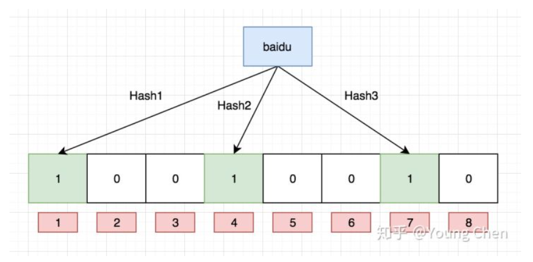
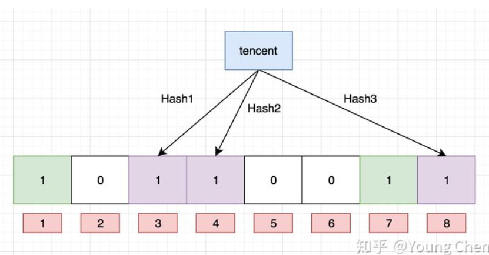

# 布隆过滤器
**如何判断存在不存在这种问题？布隆过滤器**

### 1.布隆过滤器简介

> 布隆过滤器（Bloom Filter）是1970年由布隆提出的。
>
> 它实际上是一个很长的[二进制](https://baike.baidu.com/item/二进制/361457)向量和一系列随机映射(hash)[函数](https://baike.baidu.com/item/函数/301912)。
>
> **布隆过滤器可以用于[检索](https://baike.baidu.com/item/检索/11003896)一个元素是否在一个[集合](https://baike.baidu.com/item/集合/2908117)中。**
>
> set    sismember    时间复杂度O(n)   空间复杂度O(n)
>
> 本质上布隆过滤器是一种数据结构，比较巧妙的概率型数据结构（probabilistic data structure），特点是高效地插入和查询，可以用来告诉你 **“某样东西一定不存在或者可能存在”**。
>
> 相比于传统的 List、Set(O(n))、Map 等数据结构，它更高效、占用空间更少，但是缺点是其返回的结果是概率性的，而不是确切的。


### **2.存入过程**

布隆过滤器上面说了，就是一个二进制数据的集合。当一个数据加入这个集合时：

- 通过K个哈希函数计算该数据，返回K个计算出的hash值
- 返回K个二进制的数组下标
- 将K个下标对应的二进制数据改成1。

如下图：O(K)



hash(baidu)%8 =4     把第4个位置由0变为1     意味把数已经存到布隆过滤器中了

hash(baidu)%8  =4     看第4个位置是否为1，存在，0 不存在

hash(baidu) 12%8 =4   0

hash(tencent) 4 %8 =4      

  长度 12

延长数组长度  

多重hash



### **3.查询判断过程**

布隆过滤器主要作用就是查询一个数据，在不在这个二进制的集合中，查询过程如下：

- 通过K个哈希函数计算该数据，对应计算出的K个hash值
- 返回K个二进制的数组下标
- 判断：如果存在一处位置的二进制数据是0，那么该数据不存在。如果都是1，则存在。


### 4.布隆过滤器优缺点   


**优点：**

- 由于存储的是二进制数据，所以占用的空间很小
- 它的插入和查询速度是非常快的，时间复杂度是O（k），可以联想一下HashMap的过程
- 保密性很好，因为本身不存储任何原始数据，只有二进制数据

​      **查询速度快** 

**缺点：**

**存在误判**，**但是可以通过加到二进制数组的长度以及增加hash的次数来降低误判率**

### 5.使用场景

- 字处理软件中，需要检查一个英语单词是否拼写正确

- 在 FBI，一个嫌疑人的名字是否已经在嫌疑名单上

- 在网络爬虫里，一个网址是否被访问过

- yahoo, gmail等邮箱垃圾邮件过滤功能

- **解决Redis缓存穿透**   

  ​     (  把要做缓存的数据，存到布隆过滤器中，保证布隆过滤器中的数据和数据库中的数据一致，查库前先看

  ​       布隆过滤器中有没有，如果有再查库，如果没有就不要查库，减少数据库压力) 

- 以上只是简单的用途举例，大家可以举一反三，灵活运用在工作中

### 6.布隆过滤器实现

#### google实现

pom依赖

```xml
<dependency>
  <groupId>com.google.guava</groupId>
  <artifactId>guava</artifactId>
  <version>29.0-jre</version>
</dependency>
```


```java
package com.wxb.bloom;

import com.google.common.hash.BloomFilter;
import com.google.common.hash.Funnels;

public class BloomFilterCase {

  /**
   * 预计要插入多少数据
   */
  private static int size = 1000000;

  /**
   * 期望的误判率
   */
  private static double fpp = 0.01;    

  /**
   * 布隆过滤器
   */
  private static BloomFilter<Integer> bloomFilter = BloomFilter.create(Funnels.integerFunnel(),size,fpp);


  public static void main(String[] args) {
    // 插入10万样本数据
    for (int i = 0; i < size; i++) {
      bloomFilter.put(i);
    }

    // 用另外十万测试数据，测试误判率
    int count = 0;
    for (int i = size; i < size + 100000; i++) {
      if (bloomFilter.mightContain(i)) {
        count++;
        System.out.println(i + "误判了");
      }
    }
    System.out.println("总共的误判数:" + count);
  }
}
```


#### redis实现

> 上面使用Guava实现的布隆过滤器是把数据放在了本地内存中。分布式的场景中就不合适了，无法共享内存。
>
> 我们还可以用Redis来实现布隆过滤器，这里使用Redis封装好的客户端工具Redisson。
>
> 其底层是使用数据结构bitMap，大家就把它理解成上面说的二进制结构。


```shell
# 设置值，其中value只能是 0 和 1   二进制数组
setbit key offset value

# 获取值
getbit key offset

# 获取指定范围内值为 1 的个数
# start 和 end 以字节为单位
bitcount key start end

```


pom依赖

```xml
<dependency>
    <groupId>org.redisson</groupId>
    <artifactId>redisson</artifactId>
    <version>3.12.0</version>
</dependency>
```


```java
 @Test
    public void test7 (){
        Config config = new Config();
        //        config.useClusterServers()
        //            .setScanInterval(2000)
        //            .addNodeAddress("redis://10.0.29.30:6379", "redis://10.0.29.95:6379")
        //            .addNodeAddress("redis://10.0.29.205:6379");

        config.useSingleServer().setAddress("redis://127.0.0.1:6379");
        //              .setPassword().setDatabase()

        RedissonClient redisson = Redisson.create(config);

        //初始化布隆顾虑器
        RBloomFilter<Object> bloomFilter = redisson.getBloomFilter("nums");
        bloomFilter.tryInit(100000000L,0.03);


        bloomFilter.add("baidu");
        bloomFilter.add("tencent");


        System.out.println(bloomFilter.contains("baidu1"));


    }
```


