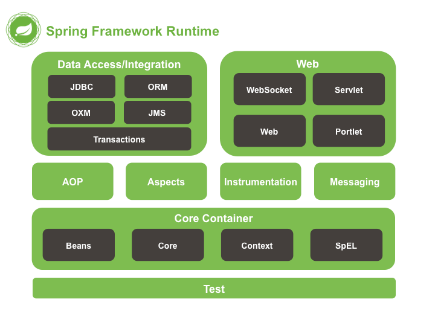

# SpringIOC和DI
## 一、Spring概述

### 1.1、Spring是什么

> Spring是分层的 Java SE/EE应用full-stack轻量级开源框架，以**IOC（**Inverse Of Control：**反转控制**）和 **AOP**（Aspect Oriented Programming：**面向切面编程**）为内核。    
>
> 
>
> 提供了表现层SpringMVC和持久层Spring JDBCTemplate以及业务层事务管理等众多的企业级应用技术，还能整合开源世界众多著名的第三方框架和类库，逐渐成为使用最多的Java EE 企业应用开源框架。

### 1.2、Spring发展历程（了解）

> 1997 年， IBM提出了EJB 的思想
>
> 1998 年，SUN制定开发标准规范 EJB1.0
>
> 1999 年，EJB1.1 发布
>
> 2001 年，EJB2.0 发布
>
> 2003 年，EJB2.1 发布
>
> 2006 年，EJB3.0 发布

***Rod Johnson(Spring 之父)***

> Expert One-to-One J2EE Design and Development(2002)
>
> * 阐述了 J2EE 使用EJB 开发设计的优点及解决方案
>
> Expert One-to-One J2EE Development without EJB(2004)
>
> * 阐述了 J2EE 开发不使用 EJB的解决方式（Spring 雏形）


### 1.3、Spring的优势

> **1) 方便解耦，简化开发**   **(IOC)**
>
> 通过Spring提供的IOC容器，可以将对象间的依赖关系交由Spring进行控制，避免硬编码所造成的过度耦合。
>
> 用户也不必再为单例模式类、属性文件解析等这些很底层的需求编写代码，可以更专注于上层的应用。
>
> **2) AOP 编程的支持**
>
> 通过Spring的AOP功能，方便进行面向切面编程，许多不容易用传统OOP实现的功能可以通过AOP轻松实现。
>
> **3) 声明式事务的支持**     @Tranctional  Serice层的实现类中的方法   
>
> 可以将我们从单调烦闷的事务管理代码中解脱出来，通过声明式方式灵活的进行事务管理，提高开发效率和质量
>
> **4) 方便程序的测试**
>
> 可以用非容器依赖的编程方式进行几乎所有的测试工作，测试不再是昂贵的操作，而是随手可做的事情。

### 1.4、Spring的体系结构



核心模块

Beans / Core /  Context /SpEL

## 二、Spring快速入门  5.2.6.RELEASE

### 2.1、Spring程序开发步骤

> 1) 新建Maven工程并添加相关依赖；
>
> 2) 编写接口和实现类；
>
> 3) 编写Spring核心配置文件；
>
> 4) 编写测试类进行测试。

### 2.2、新建Maven工程并添加相关依赖

pom.xml中依赖如下：

```xml
<dependencies>
    <dependency>
        <groupId>org.springframework</groupId>
        <artifactId>spring-context</artifactId>
        <version>5.2.6.RELEASE</version>
    </dependency>
    <dependency>
        <groupId>org.springframework</groupId>
        <artifactId>spring-core</artifactId>
        <version>5.2.6.RELEASE</version>
    </dependency>

    <dependency>
        <groupId>org.springframework</groupId>
        <artifactId>spring-beans</artifactId>
        <version>5.2.6.RELEASE</version>
    </dependency>
    <dependency>
        <groupId>org.springframework</groupId>
        <artifactId>spring-expression</artifactId>
        <version>5.2.6.RELEASE</version>
    </dependency>
    <dependency>
        <groupId>junit</groupId>
        <artifactId>junit</artifactId>
        <version>4.13</version>
        <scope>test</scope>
    </dependency>
</dependencies>
```

### 2.3、编写接口和实现类

> UserDao.java

```java
public interface UserDao {
    void save();
}
```

> UserDaoImpl.java

```java
public class UserDaoImpl implements UserDao {
    @Override
    public void save() {
		System.out.println("save...");
    }
}
```

### 2.4、编写Spring核心配置文件

> applicationContext.xml

```xml
<?xml version="1.0" encoding="UTF-8"?>
<beans xmlns="http://www.springframework.org/schema/beans"
       xmlns:xsi="http://www.w3.org/2001/XMLSchema-instance"
       xsi:schemaLocation="http://www.springframework.org/schema/beans
       http://www.springframework.org/schema/beans/spring-beans.xsd">
    <!-- 
		通过bean标签，创建相应类型的对象，并将创建的对象交给Spring容器进行管理
	-->
    <bean id="userDao" class="com.qfedu.dao.impl.UserDaoImpl" ></bean>
    
</beans>
```

### 2.5、编写测试类进行测试

```java
public class MyTest {
    
    @Test
    public void test() {
        //加载配置文件，创建应用上下文对象
        ApplicationContext context = new ClassPathXmlApplicationContext("applicationContext.xml");
        //获取对象
        UserDao userDao = (UserDao) context.getBean("userDao");
        userDao.save();
    }
}
```

> 运行测试方法测试

## 三、Spring配置文件

### 3.1、Bean标签基本配置

> 作用：通过配置将对象的创建交给Spring容器进行管理。
>
> **默认情况下它调用的是类中的无参构造函数，如果没有无参构造函数则不能创建成功**。
>
> 相关属性
>
> * id：Bean实例在Spring容器中的唯一标识；
> * class：Bean的全限定名称。

### 3.2、Bean标签范围配置  重要 面试

> scope，指对象的作用范围，取值如下： 

| 取值范围       | 说明                                                         |
| -------------- | ------------------------------------------------------------ |
| **singleton**  | **默认值，单例的**   ,                                       |
| **prototype**  | **多例的**                                                   |
| request        | WEB项目中，Spring创建一个Bean的对象，将对象存入到request域中 |
| session        | WEB项目中，Spring创建一个Bean的对象，将对象存入到session域中 |
| global session | WEB项目中，应用在Portlet环境，如果没有Portlet环境那么globalSession相当于session |

> 当scope的取值为singleton时  
>
> * Bean的实例化个数：1个
> * **Bean的实例化时机：当Spring核心文件被加载时，实例化配置的Bean实例    面试**
> * Bean的生命周期：
>   * 对象创建：当应用加载，创建容器时，对象就被创建了；
>   * 对象运行：只要容器在，对象一直活着；
>   * 对象销毁：当应用卸载，销毁容器时，对象就被销毁了。
>
> 当scope的取值为prototype时
>
> * Bean的实例化个数：多个
> * **Bean的实例化时机：当调用getBean()方法时实例化Bean**
> * Bean的生命周期：
>     * 对象创建：当使用对象时，创建新的对象实例；
>     * 对象运行：只要对象在使用中，就一直活着；
>     * 对象销毁：当对象长时间不用时，被 Java 的垃圾回收器回收了。

### 3.3、Bean生命周期配置  了解

实例化：调用构造方法，创建一个对象

初始化：init

> init-method：指定类中的初始化方法名称
>
> destroy-method：指定类中销毁方法名称

### 3.4、Bean实例化三种方式    面试


#### 3.4.1、使用无参构造方法实例化   常用 重点

> 根据默认无参构造方法来创建类对象，如果bean中没有默认无参构造函数，将会创建失败。

```java
<bean id="userDao" class="com.qfedu.dao.impl.UserDaoImpl">
```

#### 3.4.2、工厂静态方法实例化   面试  了解

> 创建静态工厂

```java
public class StaticBeanFactory {
    public static UserDao getUserDaoImpl() {
        return new UserDaoImpl();
    }
}
```

> 在Spring配置文件中配置

```xml
<!-- 静态工厂初始化 -->
<bean id="userDao" class="com.qfedu.factory.StaticBeanFactory" factory-method="getUserDaoImpl"></bean>
```

> 测试

```java
//演示通过静态工厂创建Bean
@Test
public void test1() {
    ApplicationContext context = new ClassPathXmlApplicationContext("applicationContext.xml");
    UserDao userDao = (UserDao) context.getBean("userDao");
    userDao.save();
}
```

#### 3.4.3、工厂实例方法实例化  面试   了解

> 创建动态工厂

```java
public class DynamicBeanFactory {
    public UserDao getUserDao() {
        return new UserDaoImpl();
    }
}
```

> 在Spring配置文件中配置

```java
<bean id="factory" class="com.qfedu.factory.DynamicBeanFactory"></bean>
<bean id="userDao" factory-bean="factory" factory-method="getUserDao"></bean>
```

> 测试 

```java
//演示通过静态工厂创建Bean
@Test
public void test2() {
    ApplicationContext context = new ClassPathXmlApplicationContext("applicationContext.xml");
    UserDao userDao = (UserDao) context.getBean("userDao");
    userDao.save();
}
```

### 3.5、什么是依赖注入   DI

> 依赖注入：Dependency Injection ，指容器负责创建和维护对象之间的依赖关系，而不是通过对象本身负责自己的创建和解决自己的依赖。在当前类需要用到其他类的对象，由Spring为我们提供，我们只需要在配置中说明。
>
> 业务层和持久层的依赖关系，在使用 Spring 之后，就让 Spring 来维护了。
>
> 简单的说，就是坐等框架把持久层对象传入业务层，而不用我们自己去获取。

### 3.6、依赖注入方式 

#### 3.6.1、构造方法注入   面试 了解

> 1) 创建接口UserService和实现类UserServiceImpl

```java
public interface UserService {
    void save();
}

public class UserServiceImpl implements UserService {
    //这里一定要有该属性，我们最终的目的是让该属性关联一个UserDaoImpl的对象
    private UserDao userDao;

    public UserServiceImpl() {
    }
	
    //一定要有该有参的构造方法，通过该方法完成依赖注入
    public UserServiceImpl(UserDao userDao) {
        this.userDao = userDao;
    }
}
```

> 2) 在Spring配置文件中配置

```xml
<bean id="userDao" class="com.qfedu.dao.impl.UserDaoImpl"></bean>

<bean id="userService" class="com.qfedu.service.impl.UserServiceImpl">
    <!-- 构造方法注入，通过ref将id为“userDao”的bean传递给了UserServiceImpl构造方法的userDao形参 -->
    <constructor-arg name="userDao" ref="userDao" />
</bean>
```

> 3) 测试

```java
@Test
public void test3() {
    ApplicationContext context = new ClassPathXmlApplicationContext("classpath:applicationContext.xml");
    UserService userService = (UserService)context.getBean("userService");
    userService.save();
}
```

#### 3.6.2、set方法注入（重点）

> 1) 在UserServiceImpl中添加set方法

```java
public class UserServiceImpl implements UserService {
    private UserDao userDao;

    public void setUserDao(UserDao userDao) {
        this.userDao = userDao;
    }
}
```

> 2) 在Spring配置文件中配置

```xml
<bean id="userService" class="UserServiceImpl">
    <!-- set方法注入 -->
    <property name="userDao" ref="userDao"></property>
</bean>
```

> 3) 测试方法同上

#### 3.6.3、p名称空间注入 面试 了解

> p命名空间注入本质也是set方法注入，但比起上述的set方法注入更加方便，主要体现在配置文件中
>
> 1) 引入P命名空间

```xml
xmlns:p="http://www.springframework.org/schema/p"
```

> 2) 在Spring配置文件中配置

```xml
<!-- p名称空间注入 -->
<bean id="userService" class="com.qfedu.service.impl.UserServiceImpl" p:userDao-ref="userDao"/>
```

### 3.7、依赖注入其他类型  

> 上面的案例，我们学习了如何注入引用类型的数据，除了引用数据类型，普通数据类型，集合数据类型也可以注入。

#### 3.7.1、普通数据类型注入  了解

> 1) 创建Department实体类

```java
//表示部门的实体类
public class Department {
    private Integer id;//部门编号
    private String name;//部门名称
    private String desc;//部门描述
    
    //set、get方法
    //toString方法
}
```

> 2) 在Spring配置文件中配置

```xml
<!--
	通过Spring的IOC容器创建Department类的对象，并为其属性注入值
	无参构造方法实例化
-->
<bean id="department" class="com.qfedu.entity.Department">
    <!-- set方法注入
		value：简单类型
	-->
    <property name="id" value="1" />
    <property name="name" value="研发部" />
    <property name="desc" value="项目研发" />
</bean>
```

> 3) 测试

```java
@Test
public void test6() {
    //解析配置文件 -- 创建对象 -- 对象交给Spring的IOC容器进行管理
    ApplicationContext context = new ClassPathXmlApplicationContext("applicationContext.xml");
    //获取Department的对象
    Department department = (Department)context.getBean("department");
    //打印对象
    System.out.println(department);
}
```

#### 3.7.2、引用类型注入  了解

> 1) 创建实体类Address

```java
//表示地址的实体类
public class Address {
    private String province;//省
    private String city;//市
    private String county;//县
    private String street;//街道
    private String no;//门牌号
    
    //set、get
    //toString
}
```

> 2) 在Department中增加Address类型的属性

```java
//表示部门的实体类
public class Department {
    private Integer id;//部门编号
    private String name;//部门名称
    private String desc;//部门描述
    private Address address;//部门地址
    
    //set、get
    //toString
}
```

> 3) 在Spring配置文件中配置

```xml
<bean id="address" class="com.qfedu.entity.Address">
    <property name="province" value="山东省" />
    <property name="city" value="青岛市" />
    <property name="county" value="市北区" />
    <property name="street" value="龙城路" />
    <property name="no" value="31号" />
</bean>

<!--
	通过Spring的IOC容器创建Department类的对象，并为其属性注入值
	无参构造方法实例化
-->
<bean id="department" class="com.qfedu.entity.Department">
    <!-- set方法注入
		value：简单类型
	-->
    <property name="id" value="1" />
    <property name="name" value="研发部" />
    <property name="desc" value="项目研发" />
    <!-- set方法注入
		ref：引用类型
	-->
    <property name="address" ref="address" />
</bean>
```

> 4) 测试同上

#### 3.7.3、集合数据类型（`List<String>`）的注入   了解

> 1) 创建Employee实体类

```java
//表示员工的实体类
public class Employee {
    private Integer id;//员工编号
    private String name;//姓名
    private Integer age;//年龄
    private String gender;//性别
    private List<String> hobby;//爱好
        
    //set、get方法
    //toString方法
}
```

> 2) 在Spring配置文件中配置

```xml
<!--
	通过Spring的IOC容器创建Employee类的对象，并为其属性注入值
	无参构造方法实例化
-->
<bean id="e1" class="com.qfedu.entity.Employee">
    <property name="id" value="1" />
    <property name="name" value="zs" />
    <property name="age" value="30" />
    <property name="gender" value="男" />
    <!--
		集合类型注入
	-->
    <property name="hobby">
        <list>
            <value>学习1</value>
            <value>学习2</value>
            <value>学习3</value>
        </list>
    </property>
</bean>
```

> 3) 测试

```java
@Test
public void test7() {
    //解析配置文件 -- 创建对象 -- 对象交给Spring的IOC容器进行管理
    ApplicationContext context = new ClassPathXmlApplicationContext("applicationContext.xml");
    //获取Employee的对象
    Employee employee = (Employee)context.getBean("e1");
    //打印对象
    System.out.println(employee);
}
```

#### 3.7.4、集合数据类型（`List<Employee>`）的注入  了解

> 1) 修改Department实体类

```java
//表示部门的实体类
public class Department {
    private Integer id;//部门编号
    private String name;//部门名称
    private String desc;//部门描述
    private Address address;//部门地址
    private List<Employee> emps;//普通员工
    
    //set、get方法
    //toString方法
}
```

> 2) 在Spring配置文件中配置

```xml
<bean id="e1" class="com.qfedu.entity.Employee">
    <property name="id" value="1" />
    <property name="name" value="zs" />
    <property name="age" value="30" />
    <property name="gender" value="男" />
    <!--
            集合类型注入
         -->
    <property name="hobby">
        <list>
            <value>学习1</value>
            <value>学习2</value>
            <value>学习3</value>
        </list>
    </property>
</bean>

<bean id="e2" class="com.qfedu.entity.Employee">
    <property name="id" value="1" />
    <property name="name" value="ls" />
    <property name="age" value="31" />
    <property name="gender" value="男" />
    <!--
            集合类型注入
         -->
    <property name="hobby">
        <list>
            <value>爬山</value>
            <value>游泳</value>
            <value>网游</value>
        </list>
    </property>
</bean>
<bean id="department" class="com.qfedu.entity.Department">
    <!-- set方法注入
            value：简单类型
        -->
    <property name="id" value="1" />
    <property name="name" value="研发部" />
    <property name="desc" value="项目研发" />
    <!-- set方法注入
            ref：引用类型
         -->
    <property name="address" ref="address" />
    <property name="emps">
        <list>
            <ref bean="e1" />
            <ref bean="e2" />
        </list>
    </property>
</bean>
```

> 3) 测试同3.7.1。

#### 3.7.5、集合数据类型（Map<String, User>）的注入  了解

1) 修改Department，添加属性

```java
//表示部门的实体类
public class Department {
    private Integer id;//部门编号
    private String name;//部门名称
    private String desc;//部门描述
    private Address address;//部门地址
    private Map<String, Employee> leader;//部门主管
    private List<Employee> emps;//普通员工
    //set、get
    //toString
}
```

2) 在Spring配置文件中配置

```xml
<bean id="e1" class="com.qfedu.entity.Employee">
    <property name="id" value="1" />
    <property name="name" value="zs" />
    <property name="age" value="30" />
    <property name="gender" value="男" />
    <!--
            集合类型注入
         -->
    <property name="hobby">
        <list>
            <value>学习1</value>
            <value>学习2</value>
            <value>学习3</value>
        </list>
    </property>
</bean>

<bean id="e2" class="com.qfedu.entity.Employee">
    <property name="id" value="1" />
    <property name="name" value="ls" />
    <property name="age" value="31" />
    <property name="gender" value="男" />
    <!--
            集合类型注入
         -->
    <property name="hobby">
        <list>
            <value>爬山</value>
            <value>游泳</value>
            <value>网游</value>
        </list>
    </property>
</bean>

<bean id="e3" class="com.qfedu.entity.Employee">
    <property name="id" value="1" />
    <property name="name" value="ww" />
    <property name="age" value="40" />
    <property name="gender" value="男" />
    <!--
            集合类型注入
         -->
    <property name="hobby">
        <list>
            <value>爬山</value>
            <value>游泳</value>
            <value>网游</value>
        </list>
    </property>
</bean>

<bean id="e4" class="com.qfedu.entity.Employee">
    <property name="id" value="1" />
    <property name="name" value="zl" />
    <property name="age" value="41" />
    <property name="gender" value="男" />
    <!--
            集合类型注入
         -->
    <property name="hobby">
        <list>
            <value>爬山</value>
            <value>游泳</value>
            <value>网游</value>
        </list>
    </property>
</bean>

<bean id="department" class="com.qfedu.entity.Department">
    <!-- set方法注入
            value：简单类型
        -->
    <property name="id" value="1" />
    <property name="name" value="研发部" />
    <property name="desc" value="项目研发" />
    <!-- set方法注入
            ref：引用类型
         -->
    <property name="address" ref="address" />
    <property name="emps">
        <list>
            <ref bean="e1" />
            <ref bean="e2" />
        </list>
    </property>
    <property name="leader">
        <map>
            <entry key="CEO" value-ref="e3" />
            <entry key="CTO" value-ref="e4" />
        </map>
    </property>
</bean>
```

> 3) 测试同上

#### 3.7.6、集合数据类型（Properties）的注入   重要

> 1) 创建实体类JdbcConfig，添加Properties

```java
package com.qfedu.entity;

import java.util.Properties;

public class JdbcConfig {
    private Properties config;

    public Properties getConfig() {
        return config;
    }

    public void setConfig(Properties config) {
        this.config = config;
    }

    @Override
    public String toString() {
        return "JdbcConfig{" +
                "config=" + config +
                '}';
    }
}
```

> 2) 在Spring配置文件中配置

```xml
<bean id="jdbcConfig" class="com.qfedu.entity.JdbcConfig">
    <!-- Properties类型的注入 -->
    <property name="config">
        <props>
            <prop key="driverName">com.mysql.jdbc.Driver</prop>
            <prop key="url">jdbc:mysql://localhost:3306/test</prop>
            <prop key="username">root</prop>
            <prop key="password">root</prop>
        </props>
    </property>
</bean>
```

> 3) 测试

```java
@Test
public void test8() {
    //解析配置文件 -- 创建对象 -- 对象交给Spring的IOC容器进行管理
    ApplicationContext context = new ClassPathXmlApplicationContext("applicationContext.xml");
    //获取Employee的对象
    JdbcConfig config = (JdbcConfig)context.getBean("jdbcConfig");
    //打印对象
    System.out.println(config);
}
```

### 3.8、引入其他配置文件

> 实际开发中，Spring的配置内容非常多，这就导致Spring配置很繁杂且体积很大，所以，可以将部分配置拆解到其他配置文件中，而在Spring主配置文件通过import标签进行加载。

```xml
<import resource="applicationContext-xxx.xml"/>
```

## 四、案例-Spring配置数据源    重点

### 4.1、数据源（连接池）的作用

> 提高程序性能，事先在连接池中创建连接，使用连接资源时从数据源中获取，使用完毕后将连接归还到连接池。
>
> 常见的数据源：C3P0，DBCP，Druid等。
>
> 案例目的：通过Spring管理连接池对象，并为连接池设置参数

### 4.2、数据源的手动创建

#### 4.2.1、使用步骤

> 1)  创建Maven工程并导入依赖
>
> 2) 新建数据源对象
>
> 3) 设置数据源的基本参数
>
> 4) 使用数据源获取连接和归还资源

#### 4.2.2、**创建Maven工程并导入依赖**

> pom.xml

```xml
<?xml version="1.0" encoding="UTF-8"?>
<project xmlns="http://maven.apache.org/POM/4.0.0"
         xmlns:xsi="http://www.w3.org/2001/XMLSchema-instance"
         xsi:schemaLocation="http://maven.apache.org/POM/4.0.0 http://maven.apache.org/xsd/maven-4.0.0.xsd">
    <modelVersion>4.0.0</modelVersion>

    <groupId>com.qfedu</groupId>
    <artifactId>01_spring_ioc_di_demo</artifactId>
    <version>1.0.0</version>

    <dependencies>
        <dependency>
            <groupId>org.springframework</groupId>
            <artifactId>spring-context</artifactId>
            <version>5.2.6.RELEASE</version>
        </dependency>
        <dependency>
          <groupId>org.springframework</groupId>
          <artifactId>spring-core</artifactId>
          <version>5.2.6.RELEASE</version>
        </dependency>
        <dependency>
          <groupId>org.springframework</groupId>
          <artifactId>spring-beans</artifactId>
          <version>5.2.6.RELEASE</version>
        </dependency>
        <dependency>
          <groupId>org.springframework</groupId>
          <artifactId>spring-expression</artifactId>
          <version>5.2.6.RELEASE</version>
        </dependency>
        <dependency>
            <groupId>junit</groupId>
            <artifactId>junit</artifactId>
            <version>4.13</version>
            <scope>test</scope>
        </dependency>
        <dependency>
            <groupId>mysql</groupId>
            <artifactId>mysql-connector-java</artifactId>
            <version>5.1.47</version>
        </dependency>
        <dependency>
            <groupId>com.alibaba</groupId>
            <artifactId>druid</artifactId>
            <version>1.2.4</version>
        </dependency>
    </dependencies>
</project>
```

#### 4.2.3、创建数据源相关代码

```java
@Test
public void test1() throws PropertyVetoException, SQLException {
    //创建数据源
    DruidDataSource dataSource = new DruidDataSource();

    //设置连接参数
    dataSource.setDriverClassName("com.mysql.jdbc.Driver");
    dataSource.setUrl("jdbc:mysql://localhost:3306/test?useSSL=false");
    dataSource.setUsername("root");
    dataSource.setPassword("root");

    //获取连接
    Connection connection = dataSource.getConnection();
    System.out.println(connection.getClass().getName());
    //关闭连接
    connection.close();
}
```

> 存在的问题：
>
> 1) 使用new的方式创建连接池对象，真正使用时耦合度太大；
>
> 2) 连接池相关参数在代码中写死，硬编码，如果需要修改时，修改完需要重新编译，不利于后期维护。
>
> 如何解决：
>
> 1) 使用Spring管理连接池对象的创建；
>
> 2) 在Spring配置文件中配置连接池相关参数。

### 4.3、Spring配置数据源   重要

> DataSource有无参构造方法，而Spring默认就是通过无参构造方法实例化对象的；
>
> DataSource要想使用需要通过set方法设置数据库连接信息，而Spring可以通过Set方法进行字符串注入。

#### 4.3.1、在Spring配置文件中配置

```xml
<?xml version="1.0" encoding="UTF-8"?>
<beans xmlns="http://www.springframework.org/schema/beans"
       xmlns:xsi="http://www.w3.org/2001/XMLSchema-instance"
       xsi:schemaLocation="http://www.springframework.org/schema/beans http://www.springframework.org/schema/beans/spring-beans.xsd">
    <!-- 通过bean标签，创建相应类型的对象，并将创建的对象交给Spring容器进行管理 -->
    <bean id="dataSource" class="com.alibaba.druid.pool.DruidDataSource">
        <!-- set方法注入 -->
        <property name="driverClassName" value="com.mysql.jdbc.Driver" />
        <property name="Url" value="jdbc:mysql://localhost:3306/mybatistest?useSSL=false&useUnicode=true&characterEncoding=utf-8" />
        <property name="username" value="root" />
        <property name="password" value="root" />
    </bean>
</beans>
```

#### 4.3.2、测试

```java
    /**
     * 从Spring IOC容器中获取连接池对象并进行测试
     */
    @Test
    public void test2() throws SQLException {
        ClassPathXmlApplicationContext context = new ClassPathXmlApplicationContext("applicationContext.xml");
        DataSource dataSource = (DataSource)context.getBean("dataSource");
        System.out.println(dataSource);
        Connection connection = dataSource.getConnection();
        System.out.println(connection);
        
        connection.close();
    }
```

### 4.4、抽取JDBC配置文件

> 一般在项目中，我们把jdbc的配置单独放在一个properties配置文件当中，然后在Spring配置文件中引入这个配置。

#### 4.4.1、编写jdbc.properties

```properties
jdbc.driver=com.mysql.jdbc.Driver
jdbc.url=jdbc:mysql://localhost:3306/mybatistest?useSSL=false&useUnicode=true&characterEncoding=utf-8
jdbc.username=root
jdbc.password=root
```

#### 4.4.2、在Spring配置文件中配置

> 这里需要注意文件开始的约束。

```xml
<?xml version="1.0" encoding="UTF-8"?>
<beans xmlns="http://www.springframework.org/schema/beans"
       xmlns:context="http://www.springframework.org/schema/context"
       xmlns:xsi="http://www.w3.org/2001/XMLSchema-instance"
       xsi:schemaLocation="http://www.springframework.org/schema/beans
            http://www.springframework.org/schema/beans/spring-beans.xsd
            http://www.springframework.org/schema/context
            http://www.springframework.org/schema/context/spring-context.xsd">
    <!-- 加载jdbc配置文件
        使用context标签，一定要引用相关约束
    -->
    <context:property-placeholder location="classpath:jdbc.properties" />

    <!--
        通过bean标签让Spring IOC容器创建对象
     -->
    <bean id="dataSource" class="com.alibaba.druid.pool.DruidDataSource">
        <!-- 设置四大参数
            set方法的方式注入
         -->
        <property name="driverClassName" value="${jdbc.driver}" />
        <property name="url" value="${jdbc.url}" />
        <property name="username" value="${jdbc.username}" />
        <property name="password" value="${jdbc.password}" />
    </bean>
</beans>
```
