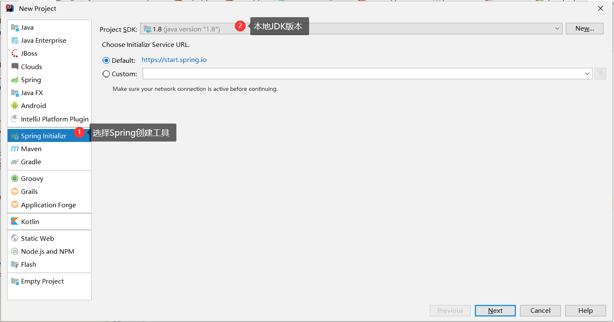
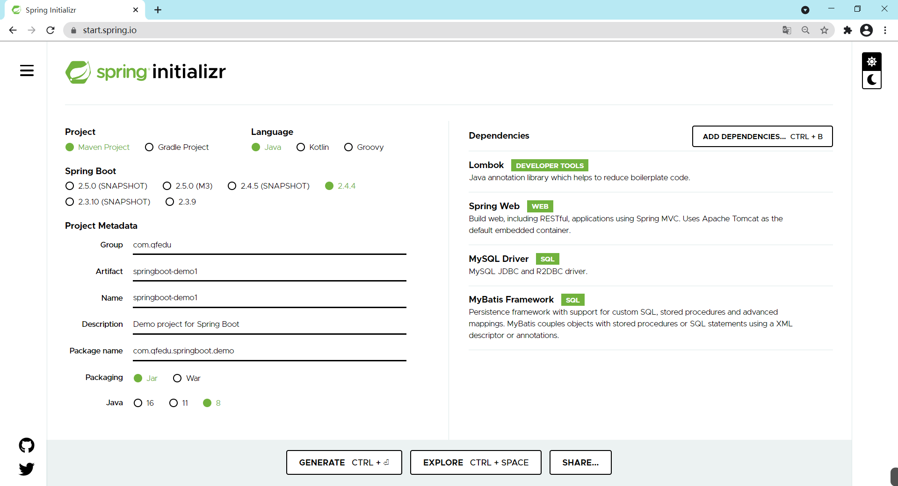

# SpringBoot入门
**SSM(spring springmvc mybatis)**

**spring:管理bean**

**springmvc:接收请求做出响应**

**mybatis：orm框架，操作数据库**

**SpringBoot本质上也是Maven项目（前提使用Maven管理jar包）**

**一 SSM 和SpringBoot 区别？**

​    **(1)SSM依赖导入繁琐、配置繁琐容易出错、运行需要外置tomcat**

   **(2)SpringBoot提倡约定大于配置、自动装配机制、Starters一组依赖、内置tomcat**

**二 自动装配的原理**

**启动类的@SpringBootApplication注解由@SpringBootConfiguration，@EnableAutoConfiguration，@ComponentScan三个注解组成，三个注解共同完成自动装配；**

**@SpringBootConfiguration 注解标记启动类为配置类**
**@ComponentScan 注解实现启动时扫描启动类所在的包以及子包下所有标记的类** 

**@EnableAutoConfiguration会读取组件下的META-INF目录下的spring.factories文件配置中以EnableAutoConfiguration全类名作为key的配置的类，过滤掉不符合要求的类，将剩余的类返回给IOC容器并初始化这些bean**

**三  简述如何自定义starter？**

  **1 新建maven项目**
**2 在resources目录下新建META-INF，新建spring.factories ，做自动装配配置要以EnableAutoConfiguration全类名作为key值，装配类的全类名作为value**      

**3 把这个starter安装到本地仓库**
**4 在其他项目中引用注入即可使用** 

**四 SpringBoot启动类的核心注解   @SpringBootApplication**

**五  Controller要放在启动类的同级或子级目录下，才能被扫描到**

**六 改端口和改项目的访问路径   在springboot配置文件中， server.port  /server.servlet.context-path**

**七 springboot默认的日志框架logback**

## 一、项目整合与部署存在的问题

### 1.1、SSM手动整合存在的问题

> SSM整合步骤多、配置繁琐
>
> - 导入依赖
> - 创建实体类
> - 创建mapper接口
> - 创建mapper接口映射配置文件
> - spring整合mybatis（管理mybatis中的bean）
> - 验证mapper中的方法是否能够正常运行
> - 将普通的maven项目修改成web项目
> - 创建Controller
> - 创建SpringMVC的配置文件
> - 在web.xml中配置前端控制器
> - 在web.xml中配置监听器及初始化参数
> - 验证
>
> 项目进行服务器部署步骤繁琐
>
> - 安装JDK
> - 安装Tomcat
> - 安装MySQL
> - .........

### 1.2、如何简化这些繁琐的配置和部署步骤？

> SpringBoot就是一个可以简化整合过程中复杂配置的框架

## 二、SpringBoot简介

### 2.1、概念

> 随着动态语言(Python、Node.js)的流行，Java语言的开发就显得格外笨重：配置繁琐、开发效率低、项目的部署变得复杂、集成第三方技术难度大；
>
> 在这种情况下，SpringBoot就应运而生；
>
> SpringBoot采用了**约定大于配置**的理念快速的搭建项目的开发环境，我们无需或者进行很少的相关spring配置就能够快速的将项目运行起来。

​    SpringBoot  单体项目    + 。。。=   微服务项目  （并发量）

​       springcloud netfilx   springcloud alibaba

​       dubbo 

### 2.2、优点

> - 能够快速的搭建项目；
> - 对主流的开发框架都提供了无配置集成（**SpringBoot内置了配置**）；
> - 项目可以独立运行、无需单独配置Servlet容器（**内置了Tomcat**）；  
> - 极大提高了开发、部署效率；
> - 提供了运行时监控系统（日志等） logback；
> - 与SpringCloud有天然的集成。 

### 2.3、缺点

> - 由于配置都是内置的，报错时定位比较困难
> - 版本迭代速度比较快、有些版本改动还是比较大（增加学习成本）1.x.x 2.x.x 

## 三、第一个SpringBoot应用

**面试题:SpringBoot启动类的核心注解[@SpringBootApplication]**

> 根据我们现在学习的知识，创建的SpringBoot的项目都是Maven项目。
>
> 体验：基于SpringBoot整合SpringMVC --- 最终能够请求一个Controller。
>
> SpringBoot应用需要依赖远程服务器进行创建。
>
> 远程服务器：
>
> - Spring官方：`https://start.spring.io /`  https://start.springboot.io
> - Alibaba：`https://start.aliyun.com`
>
> 注意：有时Spring官方服务器由于网络原因访问失败，可以使用`https://start.springboot.io`代替。


### 3.1、创建项目

#### 3.1.1、方式1  (Idea结合官网创建)  重要

> 使用Idea创建

##### 3.1.1.1、选择新建项目

> 注意选择JDK版本



##### 3.1.1.2、填写项目信息


##### 3.1.1.3、选择项目依赖

> 注意选择SpringBoot版本和选择相关依赖


##### 3.1.1.4、选择项目存储目录


> **注意：首次新建SpringBoot项目花费时间可能很长，因为要下载各种依赖，请耐心等待。**
>
> **SpringBoot项目本质上就是Maven项目。**

#### 3.1.2、方式2

> 如果基于IDEA创建无法下载，可以基于网页版进行创建



> 使用网页方式创建会生成一个压缩文件（本质上就是一个压缩的Maven项目），使用浏览器下载到本地，解压后使用Idea打开。

#### 3.1.3  方式3       

​     通过maven改造  ,目前不太可取【微服务会这样去做】 

#### 3.1.4 方式4     重要

​     用IDEA结合阿里云创建

### 3.2、编写Controller

```java
package com.qfedu.controller;

import org.springframework.web.bind.annotation.RequestMapping;
import org.springframework.web.bind.annotation.RestController;

//这里的注解和SpringMVC学习的相关注解是相同的
@RestController
@RequestMapping("/hello")
public class HelloController {
    @RequestMapping("/test1")
    public String test1() {
        return "hello springboot...";
    }
}
```

### 3.3、配置项目

#### 3.3.1、应用项目结构


#### 3.3.2、自定义配置

> SpringBoot帮助我们完成通用性配置，但是像端口号、数据库连接地址、账号、密码等还是需要手动完成配置。

```properties
# 服务器端口号
server.port=80
# 应用名
server.servlet.context-path=/start
```

### 3.4、启动项目

#### 3.4.1、启动

> SpringBoot应用自带Servlet容器（Tomcat）,因此无需进行额外的服务器配置，运行启动类即可启动一个SpringBoot应用。
>
> **从`main`方法启动，就像运行一个JavaSE项目一样。**

#### 3.4.2、测试

> 访问`http://localhost/start/hello/test1`

## 四、SpringBoot原理

### 4.1、starter

> 一个starter就是一个开发场景的支持（ **依赖(jar包) + 配置**）。
>
> SpringBoot为我们提供了简化企业级开发绝大多数场景的支持（提供了多个starter），我们在进行项目开发的过程中只需引入对应的starter（创建SpringBoot应用时可选择），相关的**依赖和配置**就会被内置到项目中（消除人工配置）。

#### 4.1.1、starter依赖

> 一个starter依赖表示的不是一个依赖，而是某种开发环境所需的一组依赖
>
> - Spring Web ---  `spring-boot-starter-web`
> - MyBatis Framework --- `mybatis-spring-boot-starter`
>
> 依赖：


#### 4.1.2、starter配置

> pom文件中引入的starter除了导入依赖，还引入了配置
>
> * 配置用被@Configuration标注的配置类表示，配置在配置类中进行配置
> * 配置类中有被@Bean标注的方法，用来生成特定的对象并让SpringIOC容器进行管理
>
> 通过以上的操作，大部分配置用户就不用自己进行配置了。
>
> 以后的开发中，如果需要用到哪个模块，就去导入对应的starter。
>
> 配置：


### 4.2、SpringBoot应用的POM文件

#### 4.2.1、基于Spring官方服务器创建的SpringBoot应用

> 继承spring-boot-starter-parent.pom

```xml
<?xml version="1.0" encoding="UTF-8"?>
<project xmlns="http://maven.apache.org/POM/4.0.0" xmlns:xsi="http://www.w3.org/2001/XMLSchema-instance"
	xsi:schemaLocation="http://maven.apache.org/POM/4.0.0 https://maven.apache.org/xsd/maven-4.0.0.xsd">
	<modelVersion>4.0.0</modelVersion>
    
    <!-- SpringBoot应用中的pom 继承了spring-boot-starter-parent.pom -->
    <!-- spring-boot-starter-parent.pom又继承了spring-boot-dependencies.pom-->
    <!-- 在spring-boot-dependencies.pom已经对主流的框架的版本进行了声明 -->
	<parent>
		<groupId>org.springframework.boot</groupId>
		<artifactId>spring-boot-starter-parent</artifactId>
		<version>2.4.4</version>
		<relativePath/> 
	</parent>
	
</project>
```

> 引入了maven对springboot应用支持的插件 spring-boot

```xml
<build>
    <plugins>
        <plugin>
            <groupId>org.springframework.boot</groupId>
            <artifactId>spring-boot-maven-plugin</artifactId>
            <configuration>
                <mainClass>com.qfedu.springboot.demo.SpringbootDemo1Application</mainClass>
                <excludes>
                    <exclude>
                        <groupId>org.projectlombok</groupId>
                        <artifactId>lombok</artifactId>
                    </exclude>
                </excludes>
            </configuration>
        </plugin>
    </plugins>
</build>
```

> 分析
>
> 1. pom工程继承，继承了父工程之后就能够使用父工程中的“配置”；
> 2. 我们自己创建的SpringBoot工程继承自spring-boot-starter-parent这个父工程；
> 3. spring-boot-starter-parent继承的spring-boot-dependencies；
> 4. spring-boot-dependencies里面有dependencyManagement。
>
> dependencyManagement的作用？
>
> 1. 用来规定项目引入的依赖的版本；
> 2. 如果项目的dependency标签中没有指定版本，那么就使用dependencyManagement中规定的版本；
> 3. dependencyManagement只是规定依赖的版本，并没有引入依赖；
> 4. 如果dependencyManagement中定义的版本不合适，就需要自己在依赖中指定版本。

#### 4.2.2、基于aliyun服务器创建的SpringBoot应用  


```xml
<?xml version="1.0" encoding="UTF-8"?>
<project xmlns="http://maven.apache.org/POM/4.0.0" xmlns:xsi="http://www.w3.org/2001/XMLSchema-instance"
         xsi:schemaLocation="http://maven.apache.org/POM/4.0.0 https://maven.apache.org/xsd/maven-4.0.0.xsd">
    <modelVersion>4.0.0</modelVersion>
    <groupId>com.qfedu</groupId>
    <artifactId>01_springboot_start_aliyun</artifactId>
    <version>1.0.0</version>
    <name>01_springboot_start_aliyun</name>
    <description>Demo project for Spring Boot</description>

    <properties>
        <java.version>1.8</java.version>
        <project.build.sourceEncoding>UTF-8</project.build.sourceEncoding>
        <project.reporting.outputEncoding>UTF-8</project.reporting.outputEncoding>
        <spring-boot.version>2.4.1</spring-boot.version>
    </properties>

    <dependencies>
        <dependency>
            <groupId>org.springframework.boot</groupId>
            <artifactId>spring-boot-starter-web</artifactId>
        </dependency>

        <dependency>
            <groupId>mysql</groupId>
            <artifactId>mysql-connector-java</artifactId>
            <scope>runtime</scope>
        </dependency>
        <dependency>
            <groupId>org.springframework.boot</groupId>
            <artifactId>spring-boot-starter-test</artifactId>
            <scope>test</scope>
        </dependency>
    </dependencies>

    <dependencyManagement>
        <dependencies>
            <dependency>
                <groupId>org.springframework.boot</groupId>
                <artifactId>spring-boot-dependencies</artifactId>
                <version>${spring-boot.version}</version>
                <type>pom</type>
                <scope>import</scope>
            </dependency>
        </dependencies>
    </dependencyManagement>
```

> 分析：
>
> 1. 没有继承父工程；
> 2. 直接定义dependencyManagement。

### 4.3、Java配置方式    

> 如果我们需要在SpringBoot应用中整合一种新的开发场景，只需在pom.xml引入对应的starter即可
>
> 一个starter不仅包含依赖，还包含相应的配置，starter中包含的配置都是通过Java类实现的——Java配置方式

#### 4.3.1、Spring版本发展

> 随着Spring版本的迭代，配置方式也在发生变化
>
> - Spring 1.x
>   - 所有的bean的配置只能通过xml完成
>   
> - Spring 2.x
>   - 基于JDK1.5对注解的支持，Spring 2.x开始支持注解
>   - 企业开发中到底是用xml配置还是用注解？
>     - 对基础配置、引用的第三方依赖中的配置使用xml完成：例如数据源配置
>     - 业务开发使用注解：例如controller、service
>   
> - Spring 3.x
>   - Spring 开始提供基于Java的配置方式
>   
> - Spring 4.x
>   - xml、注解、Java          5.2.6
>   
>     

#### 4.3.2、xml配置 

```xml
<!--applicationContext.xml-->
<bean id="stu" class="com.qfedu.beans.Student"></bean>   
<bean id="date" class="java.util.Date"></bean>
```

#### 4.3.3、注解配置

```java
@Component
public class Student{
    
}
```

#### 4.3.4、Java配置方式

- 创建配置类

```java
@Configuration
public class SpringConfig{
    
    @Bean
    public Date getDate(){
        return new Date();
    }
}
```

### 4.4、SpringBoot自动装置     （面试题）   


### 4.5、全局配置文件

> SpringBoot针对不同的开发场景提供默认的属性配置，如果默认的配置不能满足开发的需要，我们需要对属性配置进行修改
>
> - SpringBoot应用提供了一个全局配置文件`application.properties`用于进行自定义配置
>
> - 全局配置文件支持2中语法配置：
>   - properties 键值对配置
>   - yml 语法的配置

#### 4.5.1、基于properties配置

```properties
# 配置数据源  （key必须按照SpringBoot的要求）
spring.datasource.driver-class-name=com.mysql.jdbc.Driver
spring.datasource.url=jdbc:mysql://localhost:3306/mybatis?characterEncoding=utf-8
spring.datasource.username=root
spring.datasource.password=admin123

# 配置映射文件路径及实体类的包名
mybatis.mapper-locations=classpath:mappers/*Mapper.xml
mybatis.type-aliases-package=com.qfedu.springboot.demo.entity
```

#### 4.5.2、基于yml配置 

```

```

####   配置项要以换行+两个空格分隔，值要加一个空格

```yaml
spring:
  datasource:
    url: jdbc:mysql://localhost:3306/db_2mybatis?characterEncoding=utf-8
    driver-class-name: com.mysql.jdbc.Driver
    username: root
    password: admin123

mybatis:
  mapper-locations: classpath:mappers/*Mapper.xml
  type-aliases-package: com.qfedu.springboot.demo.entity
```

#### 4.5.3、常用的全局配置   面试题（server.port     server.servlet.context-path）

```yaml
server:
  port: 9999
  servlet:
    context-path: /demo1
```

如果没提示，resources目录没设置为Source Root，或者是设置了省电模式！


### 4.6、自定义Banner

关闭：spring.main.banner-mode=off

> 在SpringBoot应用启动的时候是有一个默认启动图案的。
>
> 这个默认图案支持自定义配置
>
> - 在resources目录创建一个banner.txt
>
> - 在banner.txt文件中定义图案`http://patorjk.com/software/taag/`
>
>   若依: springboot+thymeleaf 不分离
>
>   ​          springboot+vue 分离

```
////////////////////////////////////////////////////////////////////
//                          _ooOoo_                               //
//                         o8888888o                              //
//                         88" . "88                              //
//                         (| ^_^ |)                              //
//                         O\  =  /O                              //
//                      ____/`---'\____                           //
//                    .'  \\|     |//  `.                         //
//                   /  \\|||  :  |||//  \                        //
//                  /  _||||| -:- |||||-  \                       //
//                  |   | \\\  -  /// |   |                       //
//                  | \_|  ''\---/''  |   |                       //
//                  \  .-\__  `-`  ___/-. /                       //
//                ___`. .'  /--.--\  `. . ___                     //
//              ."" '<  `.___\_<|>_/___.'  >'"".                  //
//            | | :  `- \`.;`\ _ /`;.`/ - ` : | |                 //
//            \  \ `-.   \_ __\ /__ _/   .-` /  /                 //
//      ========`-.____`-.___\_____/___.-`____.-'========         //
//                           `=---='                              //
//      ^^^^^^^^^^^^^^^^^^^^^^^^^^^^^^^^^^^^^^^^^^^^^^^^^^        //
//            佛祖保佑       永不宕机     永无BUG                   //
////////////////////////////////////////////////////////////////////
```

### 4.7 面试题 SpringBoot自动装配原理是什么？

**启动类的@SpringBootApplication注解由@SpringBootConfiguration，@EnableAutoConfiguration，@ComponentScan三个注解组成，三个注解共同完成自动装配；**

**@SpringBootConfiguration 注解标记启动类为配置类**
**@ComponentScan 注解实现启动时扫描启动类所在的包以及子包下所有标记的类** 

**简版：@EnableAutoConfiguration会读取到组件下的spring.factories文件配置的全类名，过滤掉不符合要求的全类名，将剩余的类返回给IOC容器并初始化这些bean**

全版：@EnableAutoConfiguration通过 @Import 注解导入 AutoConfigurationImportSelector类，然后通过AutoConfigurationImportSelector 类的 selectImports 方法去读取需要被自动装配的组件依赖下的spring.factories文件配置的全类名，并按照一定的规则过滤掉不符合要求的组件的全类名，将剩余读取到的各个组件的类全名集合返回给IOC容器并初始化这些bean


### 4.8 简述如何自定义starter？

   org.springframework.boot.autoconfigure.EnableAutoConfiguration=com.qfedu.MyTest

场景：自己定义的一个starter，并且能直接注入，即认为自动装配
1 新建maven
2 在Resources目录下新建META-INF，新建spring.factories ，做自动装配配置EnableAutoConfiguration      3 把这个starter安装到本地仓库
4 在其他项目中引用注入即可使用 

### **4.9 Logback打日志**

**springboot推荐的日志框架Logback**

一、日志六个级别
1、TRACE
TRACE 在线调试： 该级别日志，默认情况下，既不打印到终端也不输出到文件。此时，对程序运行效率几乎不产生影响。

**2、DEBUG**
DEBUG 终端查看、在线调试： 该级别日志，默认情况下会打印到终端输出，但是不会归档到日志文件。因此，一般用于开发者在程序当前启动窗口上，查看日志流水信息。

**3、INFO**
INFO 报告程序进度和状态信息： 一般这种信息都是一过性的，不会大量反复输出。
例如：连接商用库成功后，可以打印一条连库成功的信息，便于跟踪程序进展信息。

**4、WARN**
WARN 警告信息： 程序处理中遇到非法数据或者某种可能的错误。该错误是一过性的、可恢复的，不会影响程序继续运行，程序仍处在正常状态。

**5、ERROR**
ERROR 状态错误： 该错误发生后程序仍然可以运行，但是极有可能运行在某种非正常的状态下，导致无法完成全部既定的功能。

6、FATAL
FATAL 致命的错误： 表明程序遇到了致命的错误，必须马上终止运行。

Log4j建议只使用四个级别，优先级从高到低分别是 ERROR、WARN、**INFO、DEBUG**。

**INFO默认并常用，DEBUG往往用在开发时；**

**等级的高与低能决定日志量多与少**

如何使用Logback打日志

1 引入lombok依赖

2 建logback的日志文件logback-spring.xml,

```
<?xml version="1.0" encoding="UTF-8"?>
<configuration debug="false">
    <!--日志存储路径-->
    <property name="log" value="D:/test/log" />
    <!-- 控制台输出 -->
    <appender name="console" class="ch.qos.logback.core.ConsoleAppender">
        <encoder class="ch.qos.logback.classic.encoder.PatternLayoutEncoder">
            <!--输出格式化-->
            <pattern>%d{yyyy-MM-dd HH:mm:ss.SSS} [%thread] %-5level %logger{50} - %msg%n</pattern>
        </encoder>
    </appender>
    <!-- 按天生成日志文件 -->
    <appender name="file" class="ch.qos.logback.core.rolling.RollingFileAppender">
        <rollingPolicy class="ch.qos.logback.core.rolling.TimeBasedRollingPolicy">
            <!--日志文件名-->
            <FileNamePattern>${log}/%d{yyyy-MM-dd}.log</FileNamePattern>
            <!--保留天数-->
            <MaxHistory>30</MaxHistory>
        </rollingPolicy>
        <encoder class="ch.qos.logback.classic.encoder.PatternLayoutEncoder">
            <pattern>%d{yyyy-MM-dd HH:mm:ss.SSS} [%thread] %-5level %logger{50} - %msg%n</pattern>
        </encoder>
        <!--日志文件最大的大小-->
        <triggeringPolicy class="ch.qos.logback.core.rolling.SizeBasedTriggeringPolicy">
            <MaxFileSize>10MB</MaxFileSize>
        </triggeringPolicy>
    </appender>

    <!-- 日志输出级别 -->
    <root level="DEBUG">
        <appender-ref ref="console" />
        <appender-ref ref="file" />
    </root>
</configuration>
```


3在springboot的配置文件中指明日志文件的路径及名字

​      如：logging.config=classpath:logback-spring.xml

4 在Controller类上加@Slf4j注解

​    使用如 log.info("info方法打日志");


