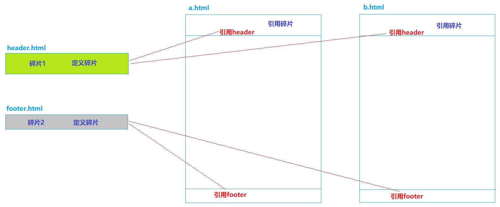
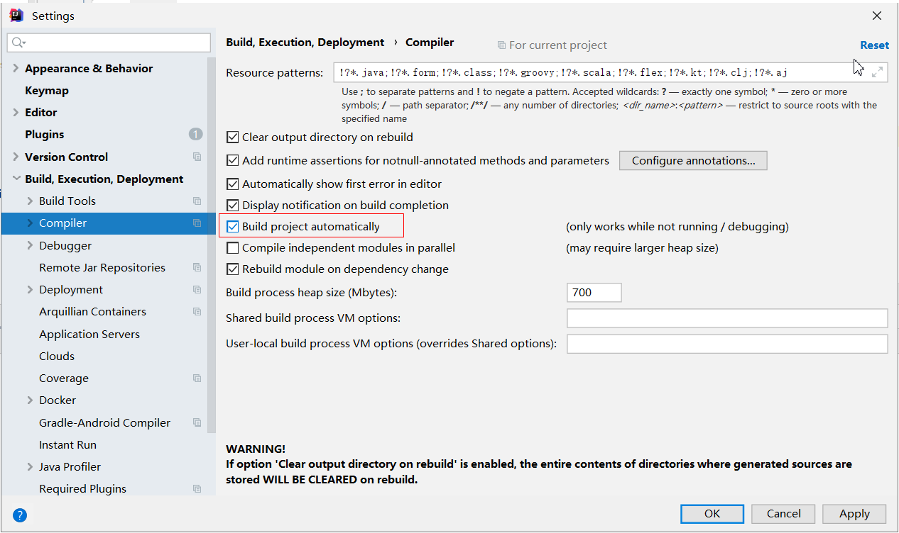
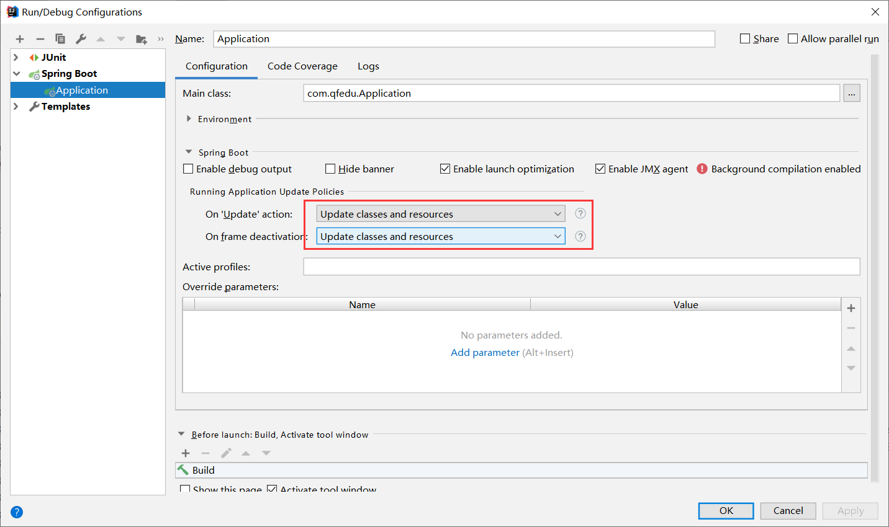

# SpringBoot进阶
1springboot整合jsp 

  (1)导入tomcat-embed-jasper依赖

（2）打包方式war，main下新建webapp目录,jsp文件放在这个目录下

（3）全局配置文件中配置前缀和后缀

2springboot整合ssm[本质上就是整合mybatis]

（1）导入mybatis-spring-boot-starter依赖 (2.2.2)、数据源、驱动

（2）全局配置文件中配置数据库连接、别名、mapper层日志等级

   (3)代码编写同ssm中一样了

  补充:springboot整合spring security [如果用到了ss的标签，需要另外导]类似于ssm整合spring security

**@Mapper** 

@MapperScan

**环境切换： spring.profiles.active=dev**

thymeleaf模板引擎：

  (1)先导入依赖 (打包war)

  (2)页面放到templates中，引入thymeleaf的命名空间

（3)常用语法： th:text  取数据    @{/}返回当前项目访问名称   th:each 循环  th:if 流程控制

热启 : devtools                  

## 一、SpringBoot整合JSP

> SpringBoot应用默认支持的动态网页技术是Thymeleaf，同时也支持JSP；因此在SpringBoot应用想要使用JSP需要通过手动整合来实现

### 1.1、添加依赖

```xml
<dependency>
    <groupId>org.apache.tomcat.embed</groupId>
    <artifactId>tomcat-embed-jasper</artifactId>
    <version>9.0.45</version>
</dependency>
<!--按需导-->
<dependency>
    <groupId>javax.servlet</groupId>
    <artifactId>jstl</artifactId>
    <version>1.2</version>
</dependency>
```

### 1.2、创建JSP页面

> 修改pom文件打包方式为war； (通常来说，springboot适用于前后端分离模式下的开发情景，)
>
> 在`src/main`下新建`webapp`目录；
>
> 在webapp创建.jsp页面。

### 1.3、将JSP页面放在webapp中的访问

> 将JSP文件存放到`webapp`目录；
>
> 在`application.yml`文件配置`SpringMVC`视图解析方式：

```yaml
spring:
  mvc:
    view:
      prefix: /
      suffix: .jsp
```

> 创建`TestController`

```java
@Controller
public class TestController {

    @RequestMapping("/test")
    public String test() {
        return "test";
    }
}
```

> 如果使用静态资源，静态资源需要放在`resource/static`目录下。

## 二、基于SpringBoot的SSM整合（重点）

student 表 

（id ,name ,a）


### 2.1、创建Springboot项目

> 创建项目时添加依赖
>
> - lombok
> - spring web
> - mysql driver  ，druid数据源
> - mybatis framework
> - PageHelper
>
> 修改mysql驱动的版本（可选）

```xml
<dependencies>
    <dependency>
        <groupId>org.springframework.boot</groupId>
        <artifactId>spring-boot-starter-web</artifactId>
    </dependency>
    <dependency>
        <groupId>org.projectlombok</groupId>
        <artifactId>lombok</artifactId>
        <optional>true</optional>
    </dependency>
    <dependency>
        <groupId>org.springframework.boot</groupId>
        <artifactId>spring-boot-starter-test</artifactId>
        <scope>test</scope>
    </dependency>
    <dependency>
        <groupId>org.apache.tomcat.embed</groupId>
        <artifactId>tomcat-embed-jasper</artifactId>
        <version>9.0.45</version>
    </dependency>
    <dependency>
        <groupId>javax.servlet</groupId>
        <artifactId>jstl</artifactId>
        <version>1.2</version>
    </dependency>
    <dependency>
        <groupId>mysql</groupId>
        <artifactId>mysql-connector-java</artifactId>
        <version>5.1.49</version>
        <scope>runtime</scope>
    </dependency>
    <dependency>
        <groupId>com.alibaba</groupId>
        <artifactId>druid-spring-boot-starter</artifactId>
        <version>1.2.8</version>
    </dependency>
    <dependency>
        <groupId>org.mybatis.spring.boot</groupId>
        <artifactId>mybatis-spring-boot-starter</artifactId>
        <version>2.2.2</version>   版本不要乱写，容易出会话工厂的问题
    </dependency>
    <dependency>
        <groupId>com.github.pagehelper</groupId>
        <artifactId>pagehelper-spring-boot-starter</artifactId>
        <version>1.4.1</version>
    </dependency>
```

### 2.2、整合MyBatis所需的配置

> 完成MyBatis的自定义配置

```properties
server.port=8099
server.servlet.context-path=/test

# 配置前缀后缀
spring.mvc.view.prefix=/
spring.mvc.view.suffix=.jsp

# 配置连接池
spring.datasource.driver-class-name=com.mysql.jdbc.Driver
spring.datasource.url=jdbc:mysql://localhost:3306/ssm_demo?useSSL=false
spring.datasource.username=root
spring.datasource.password=root

# mybatis配置
mybatis.type-aliases-package=com.qfedu.bean
# mybatis.mapper-locations=classpath:mapper/*Mapper.xml

# 日志   打印sql语句
logging.level.com.qfedu.mapper=DEBUG
```

### 2.3、创建实体类

> Student.java

```java
@Data
public class Student {
    private Long id;
    private String name;
    private String gender;
    private Integer age;
    private String addr;
}
```

### 2.4、创建Mapper接口及映射配置文件

> StudentMapper.java

```java
public interface StudentMapper {
    //添加
    int add(Student student);
    //根据ID删除
    int del(Long id);
    //修改
    int update(Student student);
    //查询所有
    List<Student> findAll();
    //根据ID查询
    Student findById(Long id);
}
```

> StudentMapper.xml

```xml
<?xml version="1.0" encoding="UTF-8" ?>
<!DOCTYPE mapper PUBLIC "-//mybatis.org//DTD Mapper 3.0//EN" "http://mybatis.org/dtd/mybatis-3-mapper.dtd" >
<mapper namespace="com.qfedu.mapper.StudentMapper">
    <insert id="add" parameterType="student">
        INSERT INTO `student`(`name`, `gender`, `age`, `addr`) 
        VALUES (#{name}, #{gender}, #{age}, #{addr})
    </insert>
    <update id="update" parameterType="student">
        UPDATE `student` SET `name`=#{name}, 
        `gender`=#{gender}, `age`=#{age}, `addr`=#{addr} WHERE `id`=#{id}
    </update>
    <delete id="del" parameterType="long">
        delete from `student` where `id`=#{id}
    </delete>
    <select id="findAll" resultType="student">
        select * from `student`
    </select>
    <select id="findById" resultType="student">
        select * from `student` where `id`=#{id}
    </select>
</mapper>
```

### 2.5、在启动类配置Mapper扫描

> `@MapperScan`

```java
@SpringBootApplication
@MapperScan("com.qfedu.mapper")
public class Application {
    public static void main(String[] args) {
        SpringApplication.run(SpringbootSsmApplication.class, args);
    }
}
```

### 2.6、在测试类中测试

```java
package com.qfedu;

import com.qfedu.entity.User;
import com.qfedu.mapper.UserMapper;
import org.junit.jupiter.api.Test;
import org.springframework.beans.factory.annotation.Autowired;
import org.springframework.boot.test.context.SpringBootTest;

import java.util.List;

@SpringBootTest
public class ApplicationTests {
    @Autowired
    private StudentMapper studentMapper;

    @Test
    public void test1() {
        studentMapper.findAll().stream().forEach(System.out::println);
    }
}
```

### 2.8、完成学生管理系统SpringBoot版

> 将之前学生管理系统，相关文件拷贝到项目中，测试。
>
> **补充**：druid并非是必须导入**	
>          ：可以在Mapper接口中用@Mapper标记，就不用在启动类@MapperScan**  

## 三、Thymeleaf

> Thymeleaf是一种类似于JSP的动态网页技术     jsp   thymeleaf 
>
> 动态web技术
>
> 模板引擎：JSP、Thymeleaf、Freemarker...【前后端不分离】  

### 3.1、Thymeleaf简介

> JSP 必须依赖Tomcat运行，不能直接运行在浏览器中      
>
> HTML可以直接运行在浏览器中，但是不能接收控制器传递的数据
>
> Thymeleaf是一种既保留了HTML的后缀能够直接在浏览器运行的能力、又实现了JSP显示动态数据的功能——静能查看页面效果、动则可以显示数据

### 3.2、Thymeleaf的使用

> SpringBoot应用对Thymeleaf提供了良好的支持

#### 3.2.1、添加thymeleaf的starter

```xml
<dependency>
    <groupId>org.springframework.boot</groupId>
    <artifactId>spring-boot-starter-thymeleaf</artifactId>
</dependency>
```

#### 3.2.2、创建Thymeleaf模板

> Thymeleaf模板就是HTML文件；
>
> SpringBoot应用中 `resources\templates`目录就是用来存放页面模板的
>
> 重要说明：
>
> - static目录下的资源被定义静态资源，SpringBoot应用默认放行，如果将HTML页面创建static目录是可以直接访问的
>
> - templates 目录下的文件会被定义为动态网页模板，SpringBoot应用会拦截templates中定义的资源；如果将HTML文件定义在templates目录，则必须通过控制器跳转访问。
>
> - 在templates创建HTML页面模板
>
> - 创建PageController，用于转发允许"直接访问"的页面请求

- ```java
  @Controller
  @RequestMapping("/page")
  public class PageController {
  
      @RequestMapping("/index")
      public String index(){
          return "index";
      }
  
  }
  ```

### 3.3、Thymeleaf基本语法      ---->代替jsp

> 如果要在thymeleaf模板中获取从控制传递的数据，需要使用th标签

#### 3.3.1、在thymeleaf模板页面引入th标签的命名空间

```html
<!DOCTYPE html>
<html lang="en" xmlns:th="http://www.thymeleaf.org">
    <head>
        <meta charset="UTF-8">
        <title>Title</title>
    </head>
    <body>
		<p>这是thymeleaf页面</p>
    </body>
</html>
```

#### 3.3.2、`th:text`       

  类似于el表达式

> 在几乎所有的HTML双标签都可以使用`th:text`属性，将接收到的数据显示在标签的内容中；
>
> 标准变量表达式用于访问容器上下文环境中的变量，功能和`EL`中的`${}`相同。Thymeleaf中的变量表达式使用 `${变量名}` 的方式获取Controller中model其中的数据。
>
> el是jsp中的技术！

```html
<label th:text="${price}"></label>
<div th:text="${str}"></div>
<p th:text="${user.username}"></p>
```

#### 3.3.3、`th:object `和` *`

> 选择变量表达式，也叫星号变量表达式，使用`th:object`属性来绑定对象。
>
> 选择表达式首先使用`th:object`来绑定后台传来的 User对象，然后使用`*`来代表这个对象，后面`{}`中的值是此对象中的属性。
> 选择变量表达式`*{...}`是另一种类似于标准变量表达式`${...}`表示变量的方法，选择变量表达式在执行时是在选择的对象上求解，而`${...}`是在上下文的变量 Model 上求解，这种写法比标准变量表达式繁琐，只需要大家了解即可。

```html
<div th:object="${user}">
    <p th:text="*{id}"></p>
    <p th:text="*{username}"></p>
    <p th:text="*{addr}"></p>
</div>
```

#### 3.3.4、`@{...}`    

 类似于jsp中 ${pageContext.request.contextPath}

> 主要用于链接、地址的展示，可用于:\
>
> * `<script src="...">`;
> * `<link href="...">`;
> * `<a href="...">`;
> * `<form action="...">`;
> * ``.
>
> 可以在 URL 路径中动态获取数据。
>
> 配置项目的上下文路径：

```properties
server.servlet.context-path=/statics
```

> 使用路径表达式：

```html
<script th:src="@{/test.js}"></script>
<link rel="stylesheet" th:href="@{/test.css}"/>

<p>
    <a th:href="@{/hello/test}">test</a>
</p>

<!-- 传递参数 -->
<p>
    <a th:href="@{/hello/test1(id=1, username='zs')}">test</a>
    
   
    
</p>
```

### 3.4、流程控制

#### 3.4.1、`th:each`循环

```html
<table style="width: 600px" border="1" cellspacing="0">
    <caption>图书信息列表</caption>
    <thead>
        <tr>
            <th>id</th>
            <th>name</th>
            <th>addr</th>
        </tr>
    </thead>
    <tbody>
        <tr th:each="user:${userList}">
            <td th:text="${user.id}"></td>
            <td th:text="${user.username}"></td>
            <td th:text="${user.addr}"></td>
        </tr>
    </tbody>
</table>
```

#### 3.4.2、分支

> `th:if`如果条件不成立，则不显示此标签

```html
<td th:if="${b.bookPrice}>40" style="color:red">太贵！！！</td>
<td th:unless="${b.bookPrice}>40" style="color:red">太贵！！！</td>

<td th:if="${b.bookPrice}<=40" style="color:green">推荐购买</td>
```

> `th:switch`和`th:case`

```html
<td th:switch="${b.bookPrice}/10">
    <label th:case="3">建议购买</label>
    <label th:case="4">价格合理</label>
    <label th:case="*">价格不合理</label>
</td>
```

```html
<td th:switch="${user.gender}">
    <label th:case="M">男</label>
    <label th:case="F">女</label>
    <label th:case="*">性别不详</label>
</td>
```


**切换： spring.profiles.active=sit**


### 3.5、碎片使用

#### 3.5.1、碎片的概念

> 碎片，就是HTML片段，我们可以将多个页面中使用的相同的HTML标签部分单独定义，然后通过th:include可以在HTML网页中引入定义的碎片



#### 3.5.2、碎片使用案例

> 定义碎片  th:fragment
>
> header.html

```html
<!DOCTYPE html>
<html lang="en" xmlns:th="http://www.thymeleaf.org">
<head>
    <meta charset="UTF-8">
    <title>Title</title>
</head>
<body>

<div th:fragment="fragment1" style="width: 100%; height: 80px;background: deepskyblue; color:white; font-size: 25px; font-family:文鼎霹雳体">
    千锋，六六六！！！
</div>

</body>
</html>
```

> footer.html

```html
<!DOCTYPE html>
<html lang="en"  xmlns:th="http://www.thymeleaf.org">
<head>
    <meta charset="UTF-8">
    <title>Title</title>
</head>
<body>

<div th:fragment="fragment2" style="width: 100%; height: 30px;background: lightgray; color:white; font-size: 16px;">
    千锋教育
</div>

</body>
</html>
```

> 引用碎片  th:include 和 th:replace
>
> a.html

```html
<!DOCTYPE html>
<html lang="en"  xmlns:th="http://www.thymeleaf.org">
<head>
    <meta charset="UTF-8">
    <title>Title</title>
</head>
<body>

<!--    <div th:include="header::fragment1"></div>-->
    <div th:replace="header::fragment1"></div>

    <div style="width: 100%; height: 500px">
        定义内容
    </div>

<!--    <div th:include="footer::fragment2"></div>-->
    <div th:replace="footer::fragment2"></div>
</body>
</html>
```

## 四、SpringBoot应用的热部署配置

> "热" --- 不用停掉现有操作就可以进行“修改”的一种技术。
>
> USB --- 热插拔
>
> PS2 --- 不支持热插拔

### 4.1、热部署

> 项目首次部署、服务启动之后，如果应用发生了变化、而且IDEA感知到了应用的变化，就自动的完成jar的更新，无需手动再次启动服务器，就可以访问应用的更新。
>
> 目的：提高效率

### 4.2、热部署配置        

###     热部署: devtools   jrebel

#### 4.2 .1、IDEA配置

> File---settings



#### 4.2.2、SpringBoot项目配置

> 在需要进行热部署的SpringBoot应用中添加依赖

```xml
<dependency>
    <groupId>org.springframework.boot</groupId>
    <artifactId>spring-boot-devtools</artifactId>
</dependency>
```

> 配置SpringBoot应用的变化更新策略


