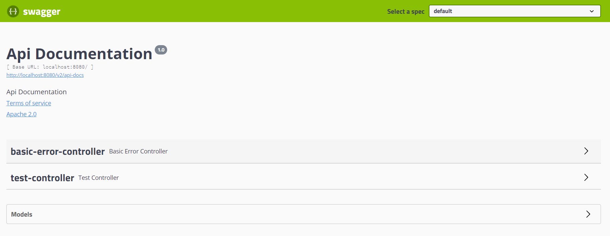

# SpringBoot_Swagger2
**上生产前的准备工作：修改路径 日志路径(logback)** 

​                                       **数据库的连接-->环境切换**

​                                       **swagger2禁用-->环境切换**

 **Swagger2  (1)生成在线的接口文档     (2)支持在线测试       **    

**springboot 下如何进行多环境切换?**

**(1)创建三套环境的配置文件文件(applicatio-dev.properteis /-sit/-prod )**

**(2)在全局配置文件中，spring.profiles.active=dev**

**通常情况下，swagger2会在dev或者是sit环境下启用，prod环境下禁用**

**常用的注解：**

​      **(1)用在实体类上的 : @ApiModel 对实体类进行描述 、@ApiModelProperty 对属性进行描述**

​       **(2)用在Controller上的： @Api 对Controller类描述、@ApiOperation 对接口方法描述、**

​                                                 **@ApiImplicitParams -@ApiImplicitParam 对方法入参描述** 

​                                 

配置扫描的接口：

   常用的方法：apis()         

​                               (1)包路径RequestHandlerSelectors.basePackage

​                               (2)类注解RequestHandlerSelectors.withClassAnnotation

​                               (3)方法的注解RequestHandlerSelectors.withMethodAnnotation

​                            paths()

​                                (1)路径的过滤PathSelectors.ant("/test2/**")

​                                (2)正则表达式PathSelectors.regex("(/test2/.* )|(/test4/.*  )")

## 一、目前存在的问题

### 1.1、关于前后端分离

> 后端时代：
>
> * 前端只管理静态页面，然后将静态页面提供给后端，后端使用模板引擎（JSP）显示页面，后端是主力。
>
> 前后端分离：
>
> * 前端负责页面的开发；
> * 后端 负责服务器的开发；
> * 前后端通过API进行交互，使用Ajax通过JSON传递数据；
> * 前后端相对独立且松耦合。

### 1.2、产生的问题

> 如果后端接口出现的更新（接口名，参数列表），前端无法及时获得更新；
>
> 前后端集成，前端或者后端无法做到“及时协商，尽早解决”，最终导致问题集中爆发。

### 1.3、如何解决

> 首先定义**计划的提纲**，并实时跟踪最新的API，降低集成风险，早期使用word文档。
>
> 目前企业中主流使用Swagger。

## 二、什么是Swagger2

> - 号称世界上最流行的API框架
> - Restful Api 文档在线自动生成器 => **API 文档 与API 定义同步更新**
> - 直接运行，在线测试API
> - 支持多种语言 （如：Java，PHP等）
> - 官网：https://swagger.io/
>
> 总结：Swagger2可以想象成一个实时生成在线文档的工具。
>
> 

## 三、Swagger2入门案例

### 3.1、创建工程

> 创建一个SpringBoot项目       spring-web

### 3.2、导入依赖

> 添加Swagger2依赖

```xml
<!-- https://mvnrepository.com/artifact/io.springfox/springfox-swagger2 -->
<dependency>
    <groupId>io.springfox</groupId>
    <artifactId>springfox-swagger2</artifactId>
    <version>2.9.2</version>
</dependency>
<!-- https://mvnrepository.com/artifact/io.springfox/springfox-swagger-ui -->
<dependency>
    <groupId>io.springfox</groupId>
    <artifactId>springfox-swagger-ui</artifactId>
    <version>2.9.2</version>
</dependency>
```

### 3.3、创建Controller

```java
import org.springframework.web.bind.annotation.RequestMapping;
import org.springframework.web.bind.annotation.RestController;

@RestController
@RequestMapping("/test")
public class TestController {
    @RequestMapping("/hello")
    public String hello() {
        return "test...";
    }
}
```

> 编写完Controller后，要确保其运行成功。

### 3.4、配置Swagger2

> 编写Swagger2配置类，后续还要在该类中添加很多内容

```java
import org.springframework.context.annotation.Configuration;
import springfox.documentation.swagger2.annotations.EnableSwagger2;

@Configuration
//启用swagger2
@EnableSwagger2
public class Swagger2Config {
}

```

> 访问：`http://localhost:8080/swagger-ui.html`，可以看到Swagger2的界面如下。



## 四、Swagger2配置

### 4.1、配置文档信息

> Swagger2实例Bean是Docket，所以通过配置Docket实例来配置Swaggger2。

```java
@Bean //配置docket以配置Swagger具体参数
public Docket docket() {
   return new Docket(DocumentationType.SWAGGER_2);
}
```

> 可以通过apiInfo()属性配置文档信息。

```java
//配置文档信息
private ApiInfo apiInfo() {
   Contact contact = new Contact("联系人名字", "http://xxx.xxx.com/联系人访问链接", "联系人邮箱");
   return new ApiInfo(
           "Swagger学习", // 标题
           "学习演示如何配置Swagger", // 描述
           "v1.0", // 版本
           "http://terms.service.url/组织链接", // 组织链接
           contact, // 联系人信息
           "Apach 2.0 许可", // 许可
           "许可链接", // 许可连接
           new ArrayList<>()// 扩展
  );
}
```

> Docket 实例关联上apiInfo()

```java
@Bean
public Docket docket() {
   return new Docket(DocumentationType.SWAGGER_2).apiInfo(apiInfo());
}
```

> 重启项目，访问测试`http://localhost:8080/swagger-ui.html`

### 4.2、配置扫描接口

> 构建Docket时通过select()方法配置怎么扫描接口

```java
@Bean
public Docket docket() {
   return new Docket(DocumentationType.SWAGGER_2)
      .apiInfo(apiInfo())
      .select()// 通过.select()方法，去配置扫描接口,RequestHandlerSelectors配置如何扫描接口
                                                //模糊匹配的
      .apis(RequestHandlerSelectors.basePackage("com.qfedu.controller"))                   
      .build();
}
```

> 重启项目测试，由于我们配置根据包的路径扫描接口，所以我们只能看到一个类。
>
> 除了通过包路径配置扫描接口外，还可以通过配置其他方式扫描接口，这里注释一下所有的配置方式。

```java
// 扫描所有，项目中的所有接口都会被扫描到
any() 
// 不扫描接口
none() 
// 通过方法上的注解扫描，如withMethodAnnotation(GetMapping.class)只扫描get请求
withMethodAnnotation(final Class<? extends Annotation> annotation)   //   ~~~
// 通过类上的注解扫描，如.withClassAnnotation(Controller.class)只扫描有controller注解的类中的接口
withClassAnnotation(final Class<? extends Annotation> annotation)   //  ~~~
// 根据包路径扫描接口(最常用)
basePackage(final String basePackage)   // ~~~
    
    
@Bean
public Docket docket() {
	return new Docket(DocumentationType.SWAGGER_2)
        .apiInfo(apiInfo())
        .select()// 通过.select()方法，去配置扫描接口,RequestHandlerSelectors配置如何扫描接口
        .apis(RequestHandlerSelectors.withMethodAnnotation(PostMapping.class))
        .build();
}
```

> 除此之外，我们还可以配置接口扫描过滤

```java
@Bean
public Docket docket() {
   return new Docket(DocumentationType.SWAGGER_2)
      .apiInfo(apiInfo())
      .select()// 通过.select()方法，去配置扫描接口,RequestHandlerSelectors配置如何扫描接口
      .apis(RequestHandlerSelectors.basePackage("com.qfedu.controller"))
       // 配置如何通过path过滤,即这里只扫描请求以/test开头的接口
      .paths(PathSelectors.ant("/test/**"))   // ~~~
      .build();
}

//这里的可选值还有
any() // 任何请求都扫描
none() // 任何请求都不扫描
regex(final String pathRegex) // 通过正则表达式控制  ~~~~
paths(PathSelectors.regex("(/hello/.*)|(/hello4/.*)"))       
ant(final String antPattern) // 通过ant()控制
```

### 4.3、配置Swagger2开关

#### 4.3.1、配置Swagger2是否启用

> 通过enable()方法配置是否启用Swagger2，如果是false，Swagger2将不能在浏览器中访问了

```java
//配置docket以配置Swagger具体参数
@Bean
public Docket docket() {
    return new Docket(DocumentationType.SWAGGER_2)
        .apiInfo(apiInfo())
        .enable(false) //禁用Swagger,配置是否启用Swagger，如果是false，在浏览器将无法访问
        .select()
        .apis(RequestHandlerSelectors.basePackage("com.qfedu.controller"))
        .build();
}
```

> 再次访问页面如下


#### 4.3.2、配置多环境下Swagger2是否启用

> application-dev.properties

```properties
server.port=8080
```

> application-test.properties

```properties
server.port=8081
```

> Swagger2相关配置

```java
//配置docket以配置Swagger具体参数
@Bean
public Docket docket(Environment environment) {
   //设置要显示swagger的环境
   Profiles of = Profiles.of("dev");
   //判断当前是否处于该环境
   //通过enable()接收此参数判断是否要显示
   boolean flag = environment.acceptsProfiles(of);
    
    return new Docket(DocumentationType.SWAGGER_2)
        .apiInfo(apiInfo())
        .enable(flag) //禁用Swagger,配置是否启用Swagger，如果是false，在浏览器将无法访问
        .select()
        .apis(RequestHandlerSelectors.basePackage("com.qfedu.controller"))
        .build();
}
```

> application.properties

```properties
# 配置环境为测试环境
spring.profiles.active=test
```

> 访问：`http://localhost:8081/swagger-ui.html`
>
> 此时无法访问到Swagger2界面

### 4.4、配置API分组

#### 4.4.1、配置组名

> 如果没有配置分组，默认是default。


> 配置分组名

```java
@Bean
public Docket docket(Environment environment) {
   return new Docket(DocumentationType.SWAGGER_2).apiInfo(apiInfo())
      .groupName("hello") // 配置分组
       // 省略配置....
}
```

> 重启查看分组信息

#### 4.4.2、配置多个分组

> 配置多个分组只需要配置多个docket即可

```java
  @Bean
    public  Docket getDocketTest(){
        return  new Docket(DocumentationType.SWAGGER_2).groupName("测试功能").
                select().
                paths(PathSelectors.ant("/test/**")).build();
    }
    @Bean
    public  Docket getDocketLogin(){
        return  new Docket(DocumentationType.SWAGGER_2).groupName("登录功能").
                select().
                paths(PathSelectors.ant("/login/**")).build();
    }
    @Bean
    public  Docket getDocketUser(){
        return  new Docket(DocumentationType.SWAGGER_2).groupName("用户功能").
                select().
                paths(PathSelectors.ant("/user/**")).build();
    }
```

> 重启项目查看即可。

## 五、实体类配置

### 5.1、创建实体类

```java
@ApiModel("用户实体")
public class User {
   @ApiModelProperty("用户名")
   public String username;
   @ApiModelProperty("密码")
   public String password;
}
```

### 5.2、修改Controller

> 只要这个实体在**请求接口**的返回值上（即使是泛型），都能映射到实体项中

```java
@RequestMapping("/getUser")
public User getUser(){
   return new User();
}
```

> 并不是因为`@ApiModel`这个注解让实体显示在这里了，而是只要出现在接口方法的返回值上的实体都会显示在这里，而`@ApiModel`和`@ApiModelProperty`这两个注解只是为实体添加注释的。
>
> `@ApiModel`为类添加注释
>
> `@ApiModelProperty`为类属性添加注释

## **六、常见注解**

> Swagger的所有注解定义在`io.swagger.annotations`包下
>
> 下面列一些经常用到的，未列举出来的可以另行查阅说明：

| Swagger注解                                            | 说明                                                 |
| ------------------------------------------------------ | ---------------------------------------------------- |
| @Api(tags = "xxx模块说明")                             | 作用在控制器类上                                     |
| @ApiOperation("xxx接口说明")                           | 作用在接口方法上                                     |
| @ApiModel("xxxPOJO说明")                               | 作用在模型类上：如VO、BO                             |
| @ApiModelProperty(value = "xxx属性说明",hidden = true) | 作用在类方法和属性上，hidden设置为true可以隐藏该属性 |
| @ApiImplicitParams()和@ApiImplicitParam("xxx参数说明") | 作用在参数、方法和字段上，类似@ApiModelProperty      |

```java
@ApiOperation("用户登录接口")
@ApiImplicitParams({
    @ApiImplicitParam(dataType = "string",name = "username", value = "用户登录账号",required = true),
    @ApiImplicitParam(dataType = "string",name = "password", value = "用户登录密码",required = false,defaultValue = "111111")
})
@RequestMapping(value = "/login",method = RequestMethod.GET)
public String login(@RequestParam("username") String name,
                      @RequestParam(value = "password",defaultValue = "111111") String pwd){
    return "";
}
```

> 这样的话，可以给一些比较难理解的属性或者接口，增加一些配置信息，让人更容易阅读！
>
> 相较于传统的Postman测试接口，使用swagger简直就是傻瓜式操作，不需要额外说明文档(写得好本身就是文档)而且更不容易出错，只需要录入数据然后点击Execute，如果再配合自动化框架，可以说基本就不需要人为操作了。
>
> Swagger是个优秀的工具，现在国内已经有很多的中小型互联网公司都在使用它，相较于传统的要先出Word接口文档再测试的方式，显然这样也更符合现在的快速迭代开发行情。
>
> 在正式环境要一定要关闭Swagger，一来出于安全考虑二来也可以节省运行时内存。

