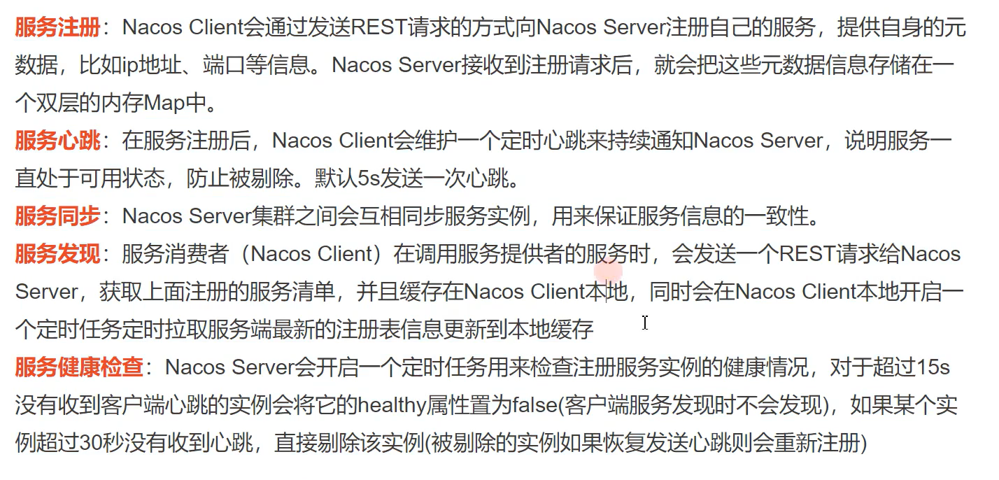

# Nacos
**CAP原则又称CAP定理，指的是在一个分布式系统中Consistency（一致性）、 Availability（可用性）、Partition tolerance（分区容错性），要么是AP，要么是CP**

**nacos工作流程:**

**服务注册:微服务模块启动起来后会向nacos注册信息（实例名，ip，端口） ，双层Map存**

**服务心跳:微服务模块5秒发送心跳，告诉nacos可以提供服务**  

**服务发现:微服务模块本地会开启定时任务，从nacos拉取最新的注册信息，缓存到本地   (35秒) ** 

**服务健康检查：nacos开启定时任务， 15秒后收不到某服务的心跳后，会将healthy置位false,30秒后收不到，剔除**


**Ribbon工作流程 **

**1拦截远程调用**

**2获取serviceId**          

**3 查看本地缓存中有无该服务实例列表，如果没有，根据serviceId从nacos中找到相应的服务实例缓存到本地,且每隔35秒更新本地缓存**

**4 根据负载均衡策略确定一个实例**   

**5 将实例的地址信息交给RestTemplat，发http请求**


**Ribbon的负载均衡策略**

**1 最可用策略    （并发最小）**

**2可用过滤策略  （把不可用的过滤掉，可用的进行轮询）** 

**3权重响应时间策略  （根据平均响应时间）**

**4重试策略**       

**5轮询策略     轮询**

**6随机策略**    

**7zone回避策略     轮询      默认**


**nacos: 注册中心/配置中心       (工作流程)**      

**ribbon：[客户端]负载均衡器  (工作流程)**

**feign:远程调用 (声明式http客户端)**


# 一：微服务架构

## 1.0：单体架构

> 将项目所有模块（功能）打成jar或者war，然后部署一个进程


   	

```txt
优点：
1：部署简单: 由于是完整的结构体，可以直接部署在一个服务器上即可。
2：技术单一: 项目不需要复杂的技术栈，往往一套熟悉的技术栈就可以完成开发。
3：用人成本低: 单个程序员可以完成业务接口到数据库的整个流程。

缺点：
1：系统启动慢， 一个进程包含了所有的业务逻辑，涉及到的启动模块过多，导致系统的启动、重启时间周期过长;
2：系统错误隔离性差、可用性差，任何一个模块的错误均可能造成整个系统的宕机;
3：可伸缩性差：系统的扩容只能只对这个应用进行扩容，无法结合业务模块的特点进行伸缩。
4：线上问题修复周期长：任何一个线上问题修复需要对整个应用系统进行全面升级。
5. 跨语言程度差
6. 不利于安全管理，所有开发人员都拥有全量代码

运营平台，传统项目，访问量不大  采用单体架构

```


## 1.1：微服务架构

微服务架构论文：https://martinfowler.com/articles/microservices.html

译文：https://mp.weixin.qq.com/s?__biz=MjM5MjEwNTEzOQ==&mid=401500724&idx=1&sn=4e42fa2ffcd5732ae044fe6a387a1cc3#rd

```txt
In short, the microservice architectural style [1] is an approach to developing a single application as a suite of small services, each running in its own process and communicating with lightweight mechanisms（ 美 ['mekə,nɪzəm]  机制）, often an HTTP resource API. These services are built around business capabilities and independently deployable by fully automated deployment machinery. There is a bare minimum of centralized management of these services, which may be written in different programming languages and use different data storage technologies.

简而言之，微服务架构风格[1]这种开发方法，是以开发一组小型服务的方式来开发一个独立的应用系统的。其中每个小型服务都运行在自己的进程中，并经常采用HTTP资源API这样轻量的机制来相互通信。这些服务围绕业务功能进行构建，并能通过全自动的部署机制来进行独立部署。这些微服务可以使用不同的语言来编写，并且可以使用不同的数据存储技术。对这些微服务我们仅做最低限度的集中管理。
```

**解读微服务特点:**

1:微服务是一种项目架构思想(风格)    （微服务是一种架构设计思想）

2:微服务架构是一系列小服务的组合（组件化与多服务）

3:任何一个微服务，都是一个独立的进程（独立开发、独立维护、独立部署）

4:轻量级通信http协议(跨语言,跨平台)

5:服务粒度(围绕业务功能拆分)

6:去中心化管理(去中心化”地治理技术、去中心化地管理数据)

## 1.2：微服务架构的优势

**1.易于开发和维护**
 一个微服务只关注一个特定的业务功能，所以它的业务清晰、代码量较少。开发和维护单个微服务相对比较简单，整个应用是由若干个微服务构建而成，所以整个应用也会维持在可控状态；

**2.单个微服务启动较快**
 单个微服务代码量较少，所以启动会比较快；

**3.局部修改容易部署**
 单体应用只要有修改，就要重新部署整个应用，微服务解决了这样的问题。一般来说，对某个微服务进行修改，只需要重新部署这个服务即可；

**4.技术栈不受限**
 在微服务中，我们可以结合项目业务及团队的特点，合理地选择技术栈

**5.按需伸缩**

## 1.3：微服务架构的缺点(挑战)

1、服务太多，导致服务间的依赖错综复杂，运维难度大

2、微服务放大了分布式架构的系列问题

- 分布式事务（seata）、     @Transactional    （不是同一个连接，）
- 分布式锁怎么处理（redisson）， synchronized 
- 服务注册与发现（nacos）、    
- 依赖服务不稳定（sentinel）导致服务雪崩怎么办？

3、运维复杂度陡增，部署数量多、监控进程多导致整体运维复杂度提升。

> 微服务架构适用于互联网项目（58、电商、视频点播）

## 1.4：SpringCloud与微服务关系

  微服务： 

   dubbo       zookper

   springcloud      (  netflix 一代  eureka 

​                                alibaba 新一代  nacos      )

- Springcloud为微服务思想提供了完美的解决方案

- Springcloud是一些列框架的集合体（服务的注册与发现【注册中心】、服务间远程调用、服务降级、服务熔断、服务限流、分布式事务 等）

  ```txt
  一般我们说springcloud 其实指的是Springcloud-netflix，Springcloud并不是造轮子，只是把Netflix公司的组件做二次开发
  Springcloud第二代  Springcloud-alibaba
  ```

  netflix:eureka , ribbon ,hytrix,spring cloud config,zull  
  
  alibaba :nacos   ribbon sentinel  nacos  spring cloud gateway   


## 1.5：SpringBoot和SpringCloud关系

- SpringBoot专注于快速方便的开发单个个体微服务。

- SpringCloud是关注全局的微服务协调、整理、治理的框架，它将SpringBoot开发的单体整合并管理起来。
- SpringBoot可以离开SpringCloud独立使用开发项目，但是SpringCloud离不开SpringBoot，属于依赖关系。

**注意点：1 spring  cloud alibaba 需要导入 spring cloud 依赖**

​                **2 每个单体项目都是一个SpringBoot项目**

# 二：服务注册与发现    (nacos)

## 2.1：服务注册与发现

> **服务注册**，就是将提供某个服务的模块信息(通常是这个服务的ip和端口)注册到1个公共的组件上去（比如: zookeeper\consul\eureka\nacos）。
>
> **服务发现**，就是新注册的这个服务模块能够及时的被其他调用者发现。不管是服务新增和服务删减都能实现自动发现。


## 2.2：注册中心对比


| 对比组件        | Nacos                | Eureka      | Consul        | Zookeeper  |
| --------------- | -------------------- | ----------- | ------------- | ---------- |
| 一致性对比      | 支持AP和CP模型       | AP模型      | CP模型        | CP模型     |
| 健康检查        | tcp/http/client Beat | client Beat | TCP/HTTP/gRPC | keep Alive |
| 负载均衡策略    | Ribbon               | Ribbon      | Fabio         | -          |
| 雪崩保护        | 有                   | 有          | 无            | 无         |
| 自动注销实例    | 支持                 | 支持        | 不支持        | 支持       |
| 访问协议        | HTTP                 | HTTP        | HTTP          | TCP        |
| 监听支持        | 支持                 | 支持        | 支持          | 支持       |
| 多数据中心      | 支持                 | 支持        | 支持          | 不支持     |
| 跨注册中心同步  | 支持                 | 不支持      | 支持          | 不支持     |
| Springcloud集成 | 支持                 | 支持        | 支持          | 不支持     |
| Dubbo集成       | 支持                 | 不支持      | 不支持        | 支持       |
| K8s集成         | 支持                 | 不支持      | 支持          | 不支持     |


# 三：nacos简介与安装

官网：https://nacos.io/zh-cn/docs/what-is-nacos.html

## 3.1：nacos功能与架构

**nacos架构：**


**nacos功能：**

- 名字服务 (Naming Service)

	```txt
	命名服务是指通过指定的名字来获取资源或者服务的地址，提供者的信息

​	       

- 配置服务 (Configuration Service)

	```txt
	动态配置服务让您能够以中心化、外部化和动态化的方式管理所有环境的配置。动态配置消除了配置变更时重新部署应用和服务的需要。配置中心化管理让实现无状态服务更简单，也让按需弹性扩展服务更容易。
	```


## 3.2：nacos安装

下载地址:https://github.com/alibaba/nacos/tags


1：解压安装


2：配置


3：创建数据库以及表（conf>nacos-mysql.sql）


4：配置startup.cmd，以standalone方式启动


5：启动


## 3.2：nacos注册中心工作流程




# 四：微服务入门案例

## 4.1：boot与cloud版本

```txt
springboot:提供了快速开发微服务的能力
springcloud提供了微服务治理的能力（服务注册与发现、服务降级、限流、熔断、网关、负载均衡、配置中心...），为微服务开发提供了全家桶服务
```


springboot的版本查看地址：https://spring.io/projects/spring-boot#learn

springcloud的版本查看地址：https://spring.io/projects/spring-cloud#overview

详细版本对应信息查看：https://start.spring.io/actuator/info


```txt
注意：
如果采用springboot和springcloud（springcloud netflix）那么使用以上版本对应就ok了，
但是如果要使用alibaba的组件（nacos、sentinel、RocketMQ、Seata）必须使用springcloud alibaba
```


## 4.2：SpringCloud-alibaba

Springcloud与springcloud-alibaba关系

```txt
◆ 我们通常说的SpringCloud，泛指Spring Cloud Netflix，也是springcloud第一代
◆ SpringCloud Alibaba是SpringCloud的子项目，是阿里巴巴结合自身微服务实践，
◆ SpringCloud Alibaba符合SpringCloud标准，依赖于springcloud
```


## 4.3：确定版本

确定方式：通过查看springcloud alibaba 官网确定

https://github.com/alibaba/spring-cloud-alibaba/wiki/版本说明

| Spring Cloud Version        | Spring Cloud Alibaba Version      | Spring Boot Version |
| --------------------------- | --------------------------------- | ------------------- |
| Spring Cloud Hoxton.SR8     | 2.2.4.RELEASE                     | 2.3.2.RELEASE       |
| Spring Cloud Greenwich.SR6  | 2.1.3.RELEASE                     | 2.1.13.RELEASE      |
| Spring Cloud Hoxton.SR3     | 2.2.1.RELEASE                     | 2.2.5.RELEASE       |
| Spring Cloud Hoxton.RELEASE | 2.2.0.RELEASE                     | 2.2.X.RELEASE       |
| Spring Cloud Greenwich      | 2.1.2.RELEASE                     | 2.1.X.RELEASE       |
| Spring Cloud Finchley       | 2.0.3.RELEASE                     | 2.0.X.RELEASE       |
| Spring Cloud Edgware        | 1.5.1.RELEASE(停止维护，建议升级) | 1.5.X.RELEASE       |

**面试题**

**最终决定（版本号记忆）：**

**springcloud-alibaba:     2.2.6.RELEASE**

**springcloud:                   Hoxton.SR9**

**springboot:                     2.3.2.RELEASE**


## 4.4：创建父工程


父工程锁定springboot、springcloud、springcloud-alibaba版本


```xml
<?xml version="1.0" encoding="UTF-8"?>
<project xmlns="http://maven.apache.org/POM/4.0.0"
         xmlns:xsi="http://www.w3.org/2001/XMLSchema-instance"
         xsi:schemaLocation="http://maven.apache.org/POM/4.0.0 http://maven.apache.org/xsd/maven-4.0.0.xsd">
    <modelVersion>4.0.0</modelVersion>

    <groupId>com.qf</groupId>
    <artifactId>cloud-parent</artifactId>
    <packaging>pom</packaging>
    <version>1.0-SNAPSHOT</version>
    <modules>
        <module>cloud-goods</module>    <!--   初次搭建不需要-->
    </modules>


    <!--    父工程的职责：锁定版本    springboot、springcloud、springcloud-alibaba-->

    <parent>
        <groupId>org.springframework.boot</groupId>
        <artifactId>spring-boot-starter-parent</artifactId>
        <version>2.3.2.RELEASE</version>
        <relativePath/> <!-- lookup parent from repository -->
    </parent>


    <dependencyManagement>
        <dependencies>
            <dependency>
                <groupId>com.alibaba.cloud</groupId>
                <artifactId>spring-cloud-alibaba-dependencies</artifactId>
                <version>2.2.6.RELEASE</version>
                <type>pom</type>
                <scope>import</scope>
            </dependency>
            <dependency>
                <groupId>org.springframework.cloud</groupId>
                <artifactId>spring-cloud-dependencies</artifactId>
                <version>Hoxton.SR9</version>
                <type>pom</type>
                <scope>import</scope>
            </dependency>

        </dependencies>
    </dependencyManagement>

</project>
```


## 4.5：服务提供者

nacos学习文档：https://github.com/alibaba/spring-cloud-alibaba/blob/master/spring-cloud-alibaba-docs/src/main/asciidoc-zh/nacos-discovery.adoc

### 4.5.1：pom.xml

```xml
 <!--  微服务基础依赖  -->
    <dependencies>
        <!--   web的场景依赖     -->
        <dependency>
            <groupId>org.springframework.boot</groupId>
            <artifactId>spring-boot-starter-web</artifactId>
        </dependency>

       <!--   服务注册与发现的场景依赖     -->
        <dependency>
            <groupId>com.alibaba.cloud</groupId>
            <artifactId>spring-cloud-starter-alibaba-nacos-discovery</artifactId>
        </dependency>
    </dependencies>
```


### 4.5.2：application.yml

```properties
spring:
  application:
    name: cloud-goods #服务名称，必须，保证唯一
  cloud:
    nacos:
      discovery:
        server-addr: localhost:8848 #指定nacos-server的地址
        username: nacos
        password: nacos
server:
  port: 9001
```


### 4.5.3：启动类加注解   

```java
package com.qf;

import org.springframework.boot.SpringApplication;
import org.springframework.boot.autoconfigure.SpringBootApplication;
import org.springframework.cloud.client.discovery.EnableDiscoveryClient;


@SpringBootApplication
@EnableDiscoveryClient  //开关，开启服务的注册与发现功能重点！！！客户端上加@EnableDiscoveryClient
public class GoodsApp {

    public static void main(String[] args) {
        SpringApplication.run(GoodsApp.class, args);
    }
}
```


### 4.5.4：查询商品接口

```java
@RestController
@RequestMapping("goods")
public class GoodsController {


    @RequestMapping("findById/{id}")
    public Goods findById(@PathVariable String id){

        System.out.println("id"+id);
        return  new Goods("小米", 99);
    }


}
```


## 4.6：服务消费者

### 4.6.1：pom.xml

```xml
<?xml version="1.0" encoding="UTF-8"?>
<project xmlns="http://maven.apache.org/POM/4.0.0"
         xmlns:xsi="http://www.w3.org/2001/XMLSchema-instance"
         xsi:schemaLocation="http://maven.apache.org/POM/4.0.0 http://maven.apache.org/xsd/maven-4.0.0.xsd">
    <parent>
        <artifactId>cloud-parent</artifactId>
        <groupId>com.qf</groupId>
        <version>1.0-SNAPSHOT</version>
    </parent>
    <modelVersion>4.0.0</modelVersion>

    <artifactId>cloud-orders</artifactId>

    <dependencies>
        <!--  web的场景依赖      -->
        <dependency>
            <groupId>org.springframework.boot</groupId>
            <artifactId>spring-boot-starter-web</artifactId>
        </dependency>

        <!-- 健康检查的场景依赖-->
        <dependency>
            <groupId>org.springframework.boot</groupId>
            <artifactId>spring-boot-starter-actuator</artifactId>
        </dependency>
        <!-- nacos服务注册与发现的场景依赖-->
        <dependency>
            <groupId>com.alibaba.cloud</groupId>
            <artifactId>spring-cloud-starter-alibaba-nacos-discovery</artifactId>
        </dependency>

        <dependency>
            <groupId>org.projectlombok</groupId>
            <artifactId>lombok</artifactId>
        </dependency>

        <dependency>
            <groupId>com.qf</groupId>
            <artifactId>cloud-entity</artifactId>
            <version>1.0-SNAPSHOT</version>
        </dependency>
    </dependencies>

</project>
```


### 4.6.2：application.yml

```properties
spring:
  application:
    name: cloud-orders  #服务的应用名称
  cloud:
    nacos:
      discovery: #nacos配置
        server-addr: localhost:8848
        username: nacos
        password: nacos
        #ip: 127.0.0.1  #服务注册的ip，可以不写，nacos自动检测到ip
        #port: 9002     #服务注册的端口，可以不写，nacos自动检测到port

server:
  port: 9001

```


### 4.6.3：启动类加注解

```java
package com.qf;

import org.springframework.boot.SpringApplication;
import org.springframework.boot.autoconfigure.SpringBootApplication;
import org.springframework.cloud.client.discovery.EnableDiscoveryClient;
import org.springframework.cloud.client.loadbalancer.LoadBalanced;
import org.springframework.context.annotation.Bean;
import org.springframework.web.client.RestTemplate;

/**
 * <p>title: com.qf</p>
 * <p>Company: wendao</p>
 * author zhuximing
 * date 2021/7/16
 * description:
 */
@SpringBootApplication
@EnableDiscoveryClient
public class OrdersApp {

    public static void main(String[] args) {
        SpringApplication.run(OrdersApp.class, args);
    }


    @Bean
    //让ribbon拦截RestTemplate发出的所有的请求
    //ribbon获取url中的service name
    //从nacos注册中心获取实例列表
    //负责从实例列表中通过相应的负载均衡算法，获取一个实例
    //RestTemplate请求实例
    @LoadBalanced
    public RestTemplate  initRestTemplate(){
        return new RestTemplate();
    }

}
```


### 4.6.4：保存订单接口

```java
package com.qf.controller;

import com.qf.entity.Goods;
import org.springframework.beans.factory.annotation.Autowired;
import org.springframework.web.bind.annotation.RequestMapping;
import org.springframework.web.bind.annotation.RestController;
import org.springframework.web.client.RestTemplate;

import java.util.HashMap;
import java.util.Map;

/**
 * <p>title: com.qf.controller</p>
 * <p>Company: wendao</p>
 * author zhuximing
 * date 2021/7/16
 * description:
 */
@RestController
@RequestMapping("order")
public class OrderController {


    @Autowired
    private RestTemplate restTemplate;

    @RequestMapping("save")
    public Map save(){

        //获取购买的商品信息（远程调用商品微服务去获取商品信息） 发送http请求
        //java 发送http请求，使用apache httpclient
        // spring resttemplate  简洁
        //String url = "http://localhost:9002/goods/findById/1";  //硬编码ip和端口
        String url = "http://xx-goods/goods/findById/1" ;  //硬编码服务名
        Goods goods = restTemplate.getForObject(url, Goods.class);

        System.out.println(goods);


        //保存订单(本地调用)
        System.out.println("保存订单成功!!!");


        //todo: 扣库存


        return  new HashMap(){{
            put("code", 200);
            put("msg", "success");
        }};

    }


}
```


## 4.7：微服务集群演示

```properties
以good模块为例，做集群
   1 实例名一样
   2 端口号不一样
   3 注册到同一个nacos
```


## 4.8：nacos领域模型    ()

```txt
nacos的服务由三元组唯一确定   (namespace、group、servicename)
nacos的配置由三元组唯一确定     (namespace、group、dataId)

不同的namespace是相互隔离的，相同namespace但是不同的group也是相互隔离的

默认的namespace是public ，不能删除
默认的group是DEFAULT-GROUP

使用领域模型实现多环境的服务隔离（多环境公用一个nacos）
```

开发：dev  测试:sit    生产 :prod

1：创建namespace


2：发布服务到指定的namespace


# 五：RestTemplate

> 实现服务间远程调用

## 5.1：RestTemplate简介

```txt
1:RestTemplate是java模拟浏览器发送http请求的工具类
2:RestTemplate基于`Apache`的`HttpClient`实现。HttpClient使用起来太过繁琐。spring提供了一种简单便捷的模板类来进行操作，这就是`RestTemplate`。

Openfeign
```


## 5.2：ForObject

> 返回的是响应结果

get请求

```java
Map goods = restTemplate.getForObject(BaseURL+"findGoodsById?goodsId=12", Map.class);
System.out.println(goods.get("goodsName"));
```


post请求（发送的是json串）

```java
Map goods = restTemplate.postForObject(BaseURL + "/save", new Goods("huawei", 99.99), Map.class);
System.out.println(goods.get("code"));
```

提示：

```xml
1:微服务之间数据传输格式统一为json
2：entity的空构造方法要提供
@Data
@AllArgsConstructor
@NoArgsConstructor
public class Goods  {

      private String goodsName;
      private double price;

}
```


## 5.3：ForEntity

> 返回的是响应体

get请求

```java
ResponseEntity<Goods> forEntity = restTemplate.getForEntity(BaseURL + "findGoodsById?goodsId=12", Goods.class);

System.out.println("http status:"+forEntity.getStatusCode());
System.out.println("http response body:"+forEntity.getBody());
```


post请求

```java
ResponseEntity<Map> responseEntity = restTemplate.postForEntity(BaseURL + "/save", new Goods("huawei", 99.99), Map.class);

System.out.println("http status:"+responseEntity.getStatusCode());
System.out.println("http response body:"+responseEntity.getBody());
```


# 六：负载均衡器Ribbon

```txt
nacos:注册中心，解决服务的注册与发现
Ribbon：客户端的负载均衡器，解决的是服务实例列表的负载均衡的问题
```


## 6.1：Ribbon简介

```txt
Ribbon是Netflix公司开源的一个负载均衡的项目，是一个"客户端"负载均衡器，运行在客户端上
```

  Ribbon运行在客户端上  （谁调的服务谁是客户端）

## 6.2：Ribbon在项目中怎么使用

第一步：pom依赖

> springcloud alibaba 对Ribbon做了兼容


第二步：@LoadBalanced注解

```java

@Bean
@LoadBalanced
public RestTemplate restTemplate(){

    return new RestTemplate();
}
```


## 6.3：Ribbon的工作流程   （重点）


  


## 6.4：Ribbon源码追踪


```
LoadBalancerInterceptor
```


```
RibbonLoadBalancerClient
```


负载均衡


```txt
Ribbon核心组件IRule：根据特定算法从服务列表中选取一个需要访问的服务；
其中IRule是一个接口，有七个自带的落地实现类，可以实现不同的负载均衡算法规则：
```


**1 最可用策略    （并发最小）**

**2可用过滤策略  （把不可用的过滤掉，可用的进行轮询）** 

**3权重响应时间策略  （根据平均响应时间）**

**4重试策略**       

**5轮询策略     轮询**

**6随机策略**    

**7zone回避策略  【区域回避策略】   轮询    **           


## 6.5：切换Ribbon负载均衡策略


## 6.6：服务实例列表同步更新


```
DynamicServerListLoadBalancer.updateListOfServers
//从nacos server获取最新的实例列表
NacosServerList.getServers
```

问题：服务消费者一旦成功调用一次，nacos server关闭后还能继续访问？

定时任务每隔35秒更新覆盖本地缓存

# 七：nacos集群搭建

## 7.1：nacos集群架构


 

## 7.2：nacos集群搭建

> 伪集群：一台服务器搭建3台nacos 通过端口进行区分
>

### 7.2.1：集群规划

| 服务名     | ip             | 端口 | 备注                 |
| ---------- | -------------- | ---- | -------------------- |
| nacos实例1 | 192.168.25.101 | 8848 |                      |
| nacos实例2 | 192.168.25.101 | 8858 |                      |
| nacos实例3 | 192.168.25.101 | 8868 |                      |
| nginx      | 192.168.25.101 | 80   | 反向代理nacos3个实例 |
| mysql      | 192.168.25.101 | 3306 | 存储nacos数据        |

### 7.2.2：详细步骤

第一步：上传nacos包到linux服务器并解压

```she
tar -zxvf nacos-server-1.4.1.tar.gz -C /export/server/
```


第二步：修改nacos数据源


```shell
cd /export/server/nacos/conf/
vim application.properties
```


创建数据库及表


第三步：修改/export/server/nacos/bin/startup.sh 的JAVA_OPT


> 虚拟机内存调大到2G

```sh
原设置：
JAVA_OPT="${JAVA_OPT} -server -Xms2g -Xmx2g -Xmn1g -XX:MetaspaceSize=128m -XX:MaxMetaspaceSize=320m"
修改后：
JAVA_OPT="${JAVA_OPT} -server -Xms256m -Xmx256m -Xmn128m -XX:MetaspaceSize=128m -XX:MaxMetaspaceSize=160m"
```


第四步：配置/export/server/nacos/conf/cluster.conf配置文件

修改集群配置文件的文件名

 cp cluster.conf.example cluster.conf

```properties
192.168.25.101:8848
192.168.25.101:8858
192.168.25.101:8868
```


第五步：复制三份，同时修改监听端口

```shell
[root@zhuxm01 server]# cp nacos/   nacos8848 -r
[root@zhuxm01 server]# cp nacos/   nacos8858 -r
[root@zhuxm01 server]# cp nacos/   nacos8868 -r
```

第六步：分别启动nacos实例

创建nacos-cluster-startup.sh

```shell
sh /export/server/nacos8848/bin/startup.sh
sh /export/server/nacos8858/bin/startup.sh
sh /export/server/nacos8868/bin/startup.sh
```

第七步：测试

```pro
spring.cloud.nacos.discovery.server-addr=192.168.234.122:8848,192.168.234.122:8858,192.168.234.122:8868
```


第八步：配置nginx反向代理（可选）

```json
upstream  nacos-cluster {
       server    192.168.25.101:8848;
       server    192.168.25.101:8858;
       server    192.168.25.101:8868;
     }

server {
        listen       80;
        server_name  www.nacos.com;
        #charset koi8-r;
        #access_log  logs/host.access.log  main;
        location / {
           proxy_pass http://nacos-cluster/;
        }
}
```


# 八：Spring Cloud OpenFeign

> 作为Spring Cloud的子项目之一，Spring Cloud OpenFeign 是一种声明式、模板化的 HTTP 客户端，在 Spring Cloud 中使用 OpenFeign，可以做到使用 HTTP请求远程服务时能与调用本地方法一样的编码体验，开发者完全感知不到这是远程方法，更感知不到这是个 HTTP 请求。同时OpenFeign通过集成Ribbon实现客户端的负载均衡


> **nacos: 注册中心**，解决是服务的注册与发现
>
> **Ribbon：客户端负载均衡器**，解决的是服务集群负载均衡的问题
>
>  **OpenFeign：实现远程调用**，声明式 HTTP 客户端 、代替Resttemplate组件


## 8.1：演示案例说明

> cloud-order为服务消费者、cloud-jifen为服务提供者
>
> 功能1：添加订单，生成一条积分记录
>
> 功能2：修改订单，修改积分记录
>
> 功能3：删除订单，删除积分记录
>
> 功能4：查询订单，获取积分记录


## 8.2：新建积分微服务

### 8.2.1：pom依赖

```xml
 <dependencies>
        <dependency>
            <groupId>org.springframework.boot</groupId>
            <artifactId>spring-boot-starter-web</artifactId>
        </dependency>

        <dependency>
            <groupId>org.springframework.boot</groupId>
            <artifactId>spring-boot-starter-actuator</artifactId>
        </dependency>

        <dependency>
            <groupId>com.alibaba.cloud</groupId>
            <artifactId>spring-cloud-starter-alibaba-nacos-discovery</artifactId>
        </dependency>
    </dependencies>

 
```


### 8.2.2：application.properties

```yml
spring:
  application:
    name: cloud-jifen #服务名称，必须，保证唯一
  cloud:
    nacos:
      discovery:
        server-addr: www.nacos.com #指定nacos-server的地址
        username: nacos
        password: nacos
        namespace: sit
        group: my-group
server:
  port: 9004
```


### 8.2.3：启动类

```java
@SpringBootApplication
@EnableDiscoveryClient
public class JifenApplication {

    public static void main(String[] args) {
        SpringApplication.run(JifenApplication.class,args);
    }

}
```


### 8.2.4：暴露接口

```java


@RestController
@RequestMapping("/jifen")
public class JifenController {

    @PostMapping(value = "/save")
    public Map save(@RequestBody Jifen jifen) {

        System.out.println("调用了积分保存接口");
        System.out.println(jifen);
        return new HashMap(){{
            put("isSuccess",true);
            put("msg","save success");
        }};

    }
 
    @PostMapping(value = "/update")
    public Map update(@RequestBody Jifen jifen) {

        System.out.println(jifen);
        return new HashMap(){{
            put("isSuccess",true);
            put("msg","update success");
        }};
 
    }
 
 
 
    @GetMapping(value = "/delete")
    public Map deleteById(Integer jifenId) {
        System.out.println("删除id为"+jifenId+"的积分信息");
        return new HashMap(){{
            put("isSuccess",true);
            put("msg","delete success");
        }};

    }
 
 
 
 
    @GetMapping(value = "/{jifenId}")
    public Jifen findJifenById(@PathVariable Integer jifenId) {
        System.out.println("已经查询到"+jifenId+"积分数据");
        return new Jifen(jifenId, 12,jifenId+"号积分");
    }
 
 
    @GetMapping(value = "/search")
    public Jifen search(Integer uid,String type) {
        System.out.println("uid:"+uid+"type:"+type);
        return new Jifen(uid, 12,type);
    }
 
    @PostMapping(value = "/searchByEntity")
    public List<Jifen> searchMap(@RequestBody  Jifen jifen) {
 
        System.out.println(jifen);
 
        List<Jifen> jifens = new ArrayList<Jifen>();
        jifens.add(new Jifen(110,12,"下单积分"));
        jifens.add(new Jifen(111,18,"支付积分"));
        return  jifens;
    }
 
}
```


```java
@Data
@AllArgsConstructor
@NoArgsConstructor
public class Jifen {
    
    private Integer jifenId;
    
    private Integer count;
    
    private String type;

}
```

```java
@Data
@AllArgsConstructor
@NoArgsConstructor
public class Goods {

    private Integer id;
    private String goodsName;

}
```

```java
@Data
@AllArgsConstructor
@NoArgsConstructor
public class ResultVo {
    

    private boolean success;
    
    private String msg;
    
}
```

```java
@Data
@AllArgsConstructor
@NoArgsConstructor
public class Order {
    
    private Integer uid;
    private Integer num;
    private String type;
    
}
```


## 8.3：Openfeign使用

远程调用，order会用，其它的微服务也会用

### 8.3.1：openfeign依赖

```xml
<dependency>
    <groupId>org.springframework.cloud</groupId>
    <artifactId>spring-cloud-starter-openfeign</artifactId>
</dependency>
```


### 8.3.2：开启openfeign


### 8.3.3：接口声明


### 8.3.4：接口调用

扫描openfeign接口


```java
  @Autowired
    private JifenApi iifenApi;


    @RequestMapping("test1")
    public Map test1(){

        //通过openfeign远程调用 cloud-jifen服务的/jifen/save接口
        Jifen jifen = new Jifen(1, 10, "2");

        //url:http://cloud-jifen/jifen/save
        Map save = iifenApi.save(jifen);

        return  save;
    }

```


## 8.4：Openfeign常用配置   （内部集成了Ribbon）

```properties
spring:
  application:
    name: cloud-order #服务名称，必须，保证唯一
  cloud:
    nacos:
      discovery:
        server-addr: www.nacos.com #指定nacos-server的地址
        username: nacos
        password: nacos
        namespace: sit
        group: my-group
server:
  port: 9002
ribbon:
  eager-load:        #饥饿加载         
    enabled: true
    clients:
      - cloud-jifen
      - cloud-goods
feign:
  client:
    config:
      cloud-jifen:
        connect-timeout: 1000
        read-timeout: 1  #设置ali-jifen相应的超时时间为1毫秒
      default: #设置默认的超时时间
        connect-timeout: 1000
        read-timeout: 1
```


# 九：Nacos配置中心

> 小结：
>
> naocs：注册中心，服务的注册与发现         
>
> Ribbon：客户端负载均衡器，服务集群的负载均衡
>
> Openfeign：发起远程调用，声明式的HTTP客户端，解决服务间的远程调用
>
> naocs：配置中心


## 9.1：为什么使用配置中心

配置中心：统一的管理入口


## 9.2：主流配置中心对比


**目前市面上用的比较多的配置中心有：Spring Cloud Config、Apollo、Nacos**和Disconf等。
由于Disconf不再维护，下面主要对比一下Spring Cloud Config、Apollo和Nacos。

| 对比项目     | Spring Cloud Config      | Apollo                   | Nacos                    |
| ------------ | ------------------------ | ------------------------ | ------------------------ |
| 配置实时推送 | 支持（Spring Cloud Bus） | 支持(HTTP长轮询1s内)     | 支持(HTTP长轮询1s内)     |
| 版本管理     | 支持（Git）              | 支持                     | 支持                     |
| 配置回滚     | （Git）支持              | 支持                     | 支持                     |
| 灰度发布     | 支持                     | 支持                     | 支持                     |
| 权限管理     | 支持（依赖Git）          | 支持                     | 支持                     |
| 多集群       | 支持                     | 支持                     | 支持                     |
| 多环境       | 支持                     | 支持                     | 支持                     |
| 监听查询     | 支持                     | 支持                     | 支持                     |
| 多语言       | 只支持Java               | 主流语言，提供了Open API | 主流语言，提供了Open API |
| 配置格式校验 | 不支持                   | 支持                     | 支持                     |
| 单机读(QPS)  | 7（限流所致）            | 9000                     | 15000                    |
| 单机写(QPS)  | 5（限流所致）            | 1100                     | 1800                     |
| 3节点读(QPS) | 21（限流所致）           | 27000                    | 45000                    |
| 3节点写(QPS) | 5（限流所致）            | 3300                     | 5600                     |


```txt
从配置中心角度来看，性能方面Nacos的读写性能最高，Apollo次之，Spring Cloud Config依赖Git场景不适合开放的大规模自动化运维API。
功能方面Apollo最为完善，nacos具有Apollo大部分配置管理功能，而Spring CloudConfig不带运维管理界面，需要自行开发。
Nacos的一大优势是整合了注册中心、配置中心功能，部署和操作相比Apollo都要直观简单，因此它简化了架构复杂度，并减轻运维及部署工作。
```


nacos config 官网：https://github.com/alibaba/spring-cloud-alibaba/wiki/Nacos-config


## 9.3：配置管理领域模型


## 9.4：配置中心入门使用

1：创建文件


2：服务端加载配置信息

```xml
<dependency>
    <groupId>com.alibaba.cloud</groupId>
    <artifactId>spring-cloud-starter-alibaba-nacos-config</artifactId>
</dependency>
```


```yml
#从配置中心加载配置文件
#文件名是通过公式来拼接${prefix}-${spring.profiles.active}.${file-extension}
spring:
  cloud:
    nacos:
      config:
        server-addr: localhost:8848
        namespace: sit
        group: DEFAULT_GROUP
        prefix: cloud-jifen
        file-extension: yml
  profiles:
    active: sit


```


## 9.5：多环境切换

测试环境

cloud-jifen-sit.yml

```yml
spring:
  application:
    name: cloud-jifen #服务名称，必须，保证唯一
  cloud:
    nacos:
      discovery:
        server-addr: localhost:8848 #指定nacos-server的地址
        username: nacos
        password: nacos
        namespace: sit
        group: my-group
server:
  port: 9004


```


生产环境cloud-jifen-pro.yml

```yml
spring:
  application:
    name: cloud-jifen #服务名称，必须，保证唯一
  cloud:
    nacos:
      discovery:
        server-addr: localhost:8848 #指定nacos-server的地址
        username: nacos
        password: nacos
        namespace: pro
        group: my-group
server:
  port: 9008


```


环境切换


### 全局环境切换     （常用）

父工程中定义环境变量


在各个微服务中引用变量


## 9.6：nacos配置动态刷新

> 动态刷新：不停机动态修改配置,立即生效


## 9.7：动态刷新连接池大小

cloud-jifen整合mybatis

```xml

<!-- mybatis的起步依赖-->
<dependency>
    <groupId>org.mybatis.spring.boot</groupId>
    <artifactId>mybatis-spring-boot-starter</artifactId>
    <version>2.1.3</version>
</dependency>
<!--    mysql驱动    -->
<dependency>
    <groupId>mysql</groupId>
    <artifactId>mysql-connector-java</artifactId>
</dependency>
<!--   druid     -->
<dependency>
    <groupId>com.alibaba</groupId>
    <artifactId>druid-spring-boot-starter</artifactId>
    <version>1.1.10</version>
</dependency>
```


```properties
spring:
  datasource:
    druid:
      driver-class-name: com.mysql.jdbc.Driver
      username: root
      password: 123456
      url: jdbc:mysql://127.0.0.1:3306/fengmi_mall?useUnicode=true&characterEncoding=utf8&useSSL=false
      max-active: 60 #连接池配置
      

#配置mybatis相关信息
mybatis.mapper-locations=/mappers/*.xml
mybatis.configuration.map-underscore-to-camel-case=true
mybatis.type-aliases-package=com.qf.entity
```


## 9.8：nacos共享配置

1.新建共享配置

common.yml

```yml
spring:
  datasource:
    druid:
      driver-class-name: com.mysql.jdbc.Driver
      username: root
      password: 123456
      url: jdbc:mysql://127.0.0.1:3306/fengmi_mall?useUnicode=true&characterEncoding=utf8&useSSL=false
      max-active: 100 #连接池配置
  cloud:
    nacos:
      discovery:
        server-addr: localhost:8848 #指定nacos-server的地址
        username: nacos
        password: nacos
        namespace: pro
        group: my-group
```


cloud-jifen个性配置

```yml
spring:
  application:
    name: cloud-jifen #服务名称，必须，保证唯一
server:
  port: 9008
pic:
  url: http://www.baidu.com

```


2.加载共享配置


## 9.9：配置文件版本管理


nacos:注册中心和配置中心-->工作流程

ribbon:客户端负载均衡器  -->ribbon工作流程   ip:port   双层Map

feign:远程调用(声明式http客户端)

RestTemplate：Spring提供的发送http请求的工具类  @LoadBalance


