# Sentinel    

> **面试题**
>
> **1断路器的工作流程：**
>
> **一旦熔断，断路器的状态是Open（所有的请求都不能进来）**
>
> **当熔断时长结束，断路器的状态是half-Open（可以允许一个请求进来）**
>
> **如果接下来的请求正常，断路器的状态是close（资源就此恢复）**
>
> **如果接下来的请求不正常，断路器的状态是open**
>
> **2 常用服务哨兵： sentinel 和 hyxtrix**
>
> **3 常用功能** 
>
>    **服务流控**
>
>    **熔断降级**
>
>   **热点key      热销商品的流控 **
>
>   **权限规则     黑名单**
>
> **4  全局异常处理      **   
>
> ​    **本质上还是springmvc 的全局异常处理 ,@ControllerAdvice  @ExceptionHandler**

# 一：Sentinel服务哨兵简介

小结：

> 1：注册中心（nacos），实现服务的注册与发现
>
> 2：Ribbon，客户端的负载均衡器，解决服务集群的负载均衡
>
> 3：Openfeign，声明式的http客户端，服务间远程调用，并通过ribbon实现负载均衡
>
> 4：配置中心（nacos），配置信息中心化管理，共享配置，支持动态刷新
>
> 5：Sentinel

中文文档：https://github.com/alibaba/Sentinel/wiki

下载地址：https://github.com/alibaba/Sentinel/releases

## 1.0：服务雪崩效应

> 级联失效、级联故障、cascading failure

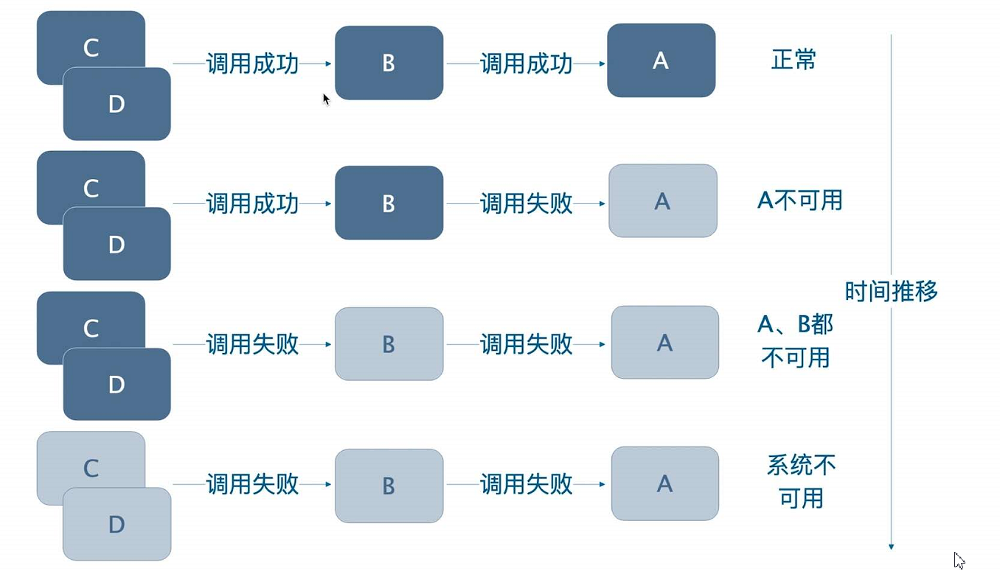


解决办法

1：限流

2：仓壁模式


3：断路器

## 1.1：Sentinel是什么

> 随着微服务的流行，服务和服务之间的稳定性变得越来越重要。Sentinel 以流量为切入点，从流量控制、熔断降级、系统负载保护等多个维度保护服务的稳定性。

### 1.1.1：Sentinel 具有以下特征

- **丰富的应用场景**：Sentinel 承接了阿里巴巴近 10 年的双十一大促流量的核心场景，例如秒杀（即突发流量控制在系统容量可以承受的范围）、消息削峰填谷、集群流量控制、实时熔断下游不可用应用等。

	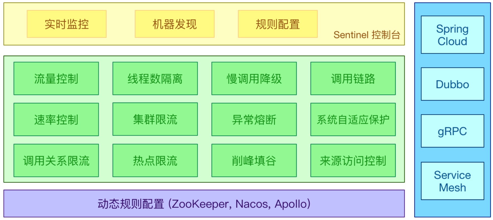

- **完备的实时监控**：Sentinel 同时提供实时的监控功能。您可以在控制台中看到接入应用的单台机器秒级数据，甚至 500 台以下规模的集群的汇总运行情况。

- **广泛的开源生态**：Sentinel 提供开箱即用的与其它开源框架/库的整合模块，例如与 Spring Cloud、Dubbo、gRPC 的整合。您只需要引入相应的依赖并进行简单的配置即可快速地接入 Sentinel。

- **完善的 SPI 扩展点**：Sentinel 提供简单易用、完善的 SPI 扩展接口。您可以通过实现扩展接口来快速地定制逻辑。例如定制规则管理、适配动态数据源等。

### 1.1.2：Sentinel 分为两个部分:

- **核心库（Java 客户端）**不依赖任何框架/库，能够运行于所有 Java 运行时环境，同时对 Dubbo / Spring Cloud 等框架也有较好的支持。
- **控制台（Dashboard）**基于 Spring Boot 开发，打包后可以直接运行，不需要额外的 Tomcat 等应用容器。


## 1.2：Sentinel与Hystrix对比

> **Sentinel 还有 hystrix** 
>
> Sentinel是阿里对hystrix的替换

|                           | Sentinel                                       | Hystrix                       |
| :------------------------ | :--------------------------------------------- | ----------------------------- |
| 隔离策略                  | 信号量隔离(并发线程数)                         | 线程池隔离/信号量隔离         |
| 熔断降级策略              | 慢调用比例、异常比率、异常数                   | 异常比率                      |
| 实时指标实现              | 滑动窗口                                       | 滑动窗口（基于 RxJava）       |
| 规则配置(rule)            | 支持多种数据源                                 | 支持多种数据源                |
| 扩展性                    | 多个扩展点                                     | 插件的形式                    |
| 基于注解的支持            | 支持                                           | 支持                          |
| 调用链路信息              | 支持同步调用                                   | 不支持                        |
| 限流QPS(query per second) | 基于 QPS / 并发数，支持基于调用关系的限流      | 不支持                        |
| 流量整形                  | 支持慢启动、匀速器模式                         | 不支持                        |
| 系统负载保护              | 支持                                           | 不支持                        |
| 实时监控 API              | 各式各样                                       | 较为简单                      |
| 控制台                    | 开箱即用，可配置规则、查看秒级监控、机器发现等 | 不完善                        |
| 常见框架的适配            | Servlet、Spring Cloud、Dubbo、gRPC 等          | Servlet、Spring Cloud Netflix |


**Hystrix已经停更说明**

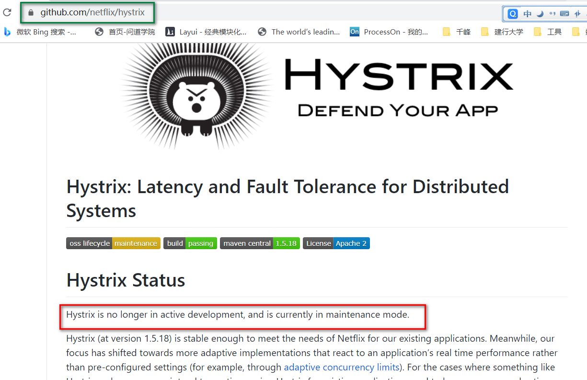


## 1.3：Sentinel架构

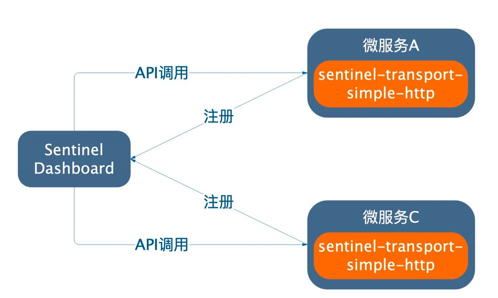

```properties
#接口概览
http://127.0.0.1:8720/api
#获取资源的metrics信息
http://127.0.0.1:8720/cnode?id=/jifen/{jifenId}
#获取流控规则接口
http://127.0.0.1:8720/getRules?type=flow
#设置规则接口
http://127.0.0.1:8720/setRules
```


## 1.4：Sentinel控制台安装

>  **注意**：启动 Sentinel 控制台需要 JDK 版本为 1.8 及以上版本。
>
>  功能
>
>  1：实时观看每个资源的访问情况（qps）
>
>  2：通过控制台，设置流控规则（qps、线程数）、还可以设置熔断降级的规则（慢调用比例、异常比例、异常数）

```shell
java  -jar sentinel-dashboard-1.8.0.jar --server.port=8888
pause
```


## 1.5：微服务整合Sentinel

第一步：添加依赖

```xml
<dependency>
    <groupId>com.alibaba.cloud</groupId>
    <artifactId>spring-cloud-starter-alibaba-sentinel</artifactId>
</dependency>
```


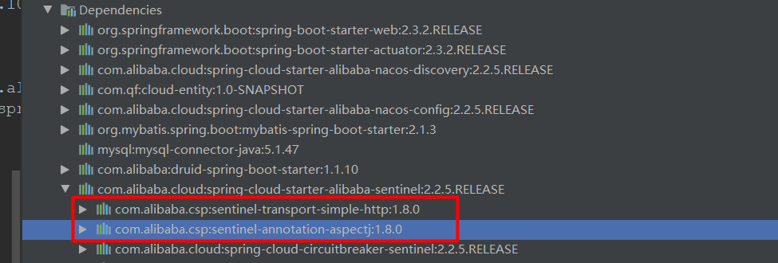


第二步：配置           ( netty  tomcat )

```properties
#默认是8719，如果8719被占用 +1，一直到没有被占用
spring.cloud.sentinel.transport.port=8719
spring.cloud.sentinel.transport.dashboard=127.0.0.1:8888

```

```properties
#开启饥额加载，当项目启动立即完成初始化，默认是懒加载
spring.cloud.sentinel.eager=true
```

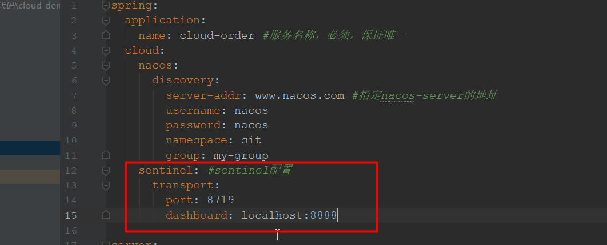


# 二：Sentinel服务流控

> Sentinel通过**流量控制**（flow control）以及**熔断降级**来保护系统资源


## 2.1：QPS超过阈值直接失败

> **流量控制**（flow control），其原理是监控应用流量的 QPS 或并发线程数等指标，当达到指定的阈值时对流量进行控制，以避免被瞬时的流量高峰冲垮，从而保障应用的高可用性。

```txt
QPS:Queries-per-second,每秒资源被访问的次数
当被访问资源的QPS超过阈值，直接进行限流（限制访问），从而保护资源，
```


> 触发条件：/order/test5当qps>1时，会触发流控


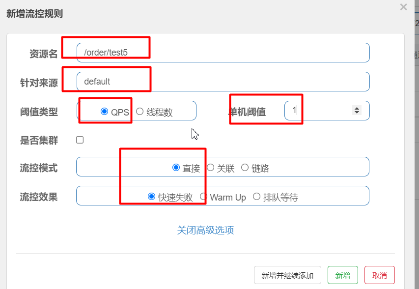


## 2.2：线程数超过阈值直接失败

> 触发条件：当/order/test5 正在工作的线程数>1

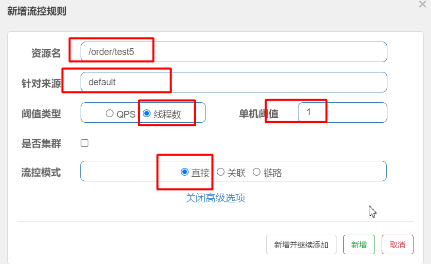


Jemeter使用步骤

1：新建测试计划


2：添加线程组


3：添加http请求


4：添加结果观察


5：发送请求


## 2.3：QPS超过阈值关联失败

> 触发条件：当关联资源(/order/test6)访问qps>1  ,那么/order/test5 就会被流控


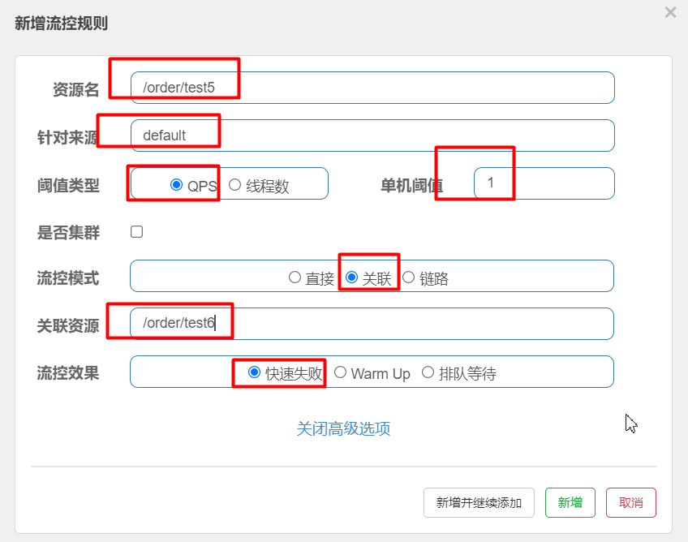


## 2.4：线程超过阈值关联失败

> 触发条件：当关联资源(/order/test6)正在工作的线程数（并发数）>1  ,那么/order/test5 就会被流控

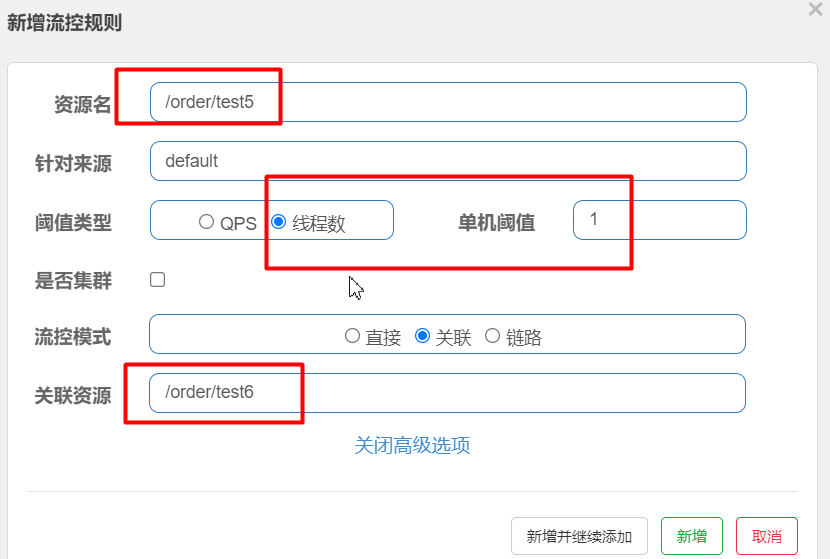


## 2.5：QPS超过阈值链路失败

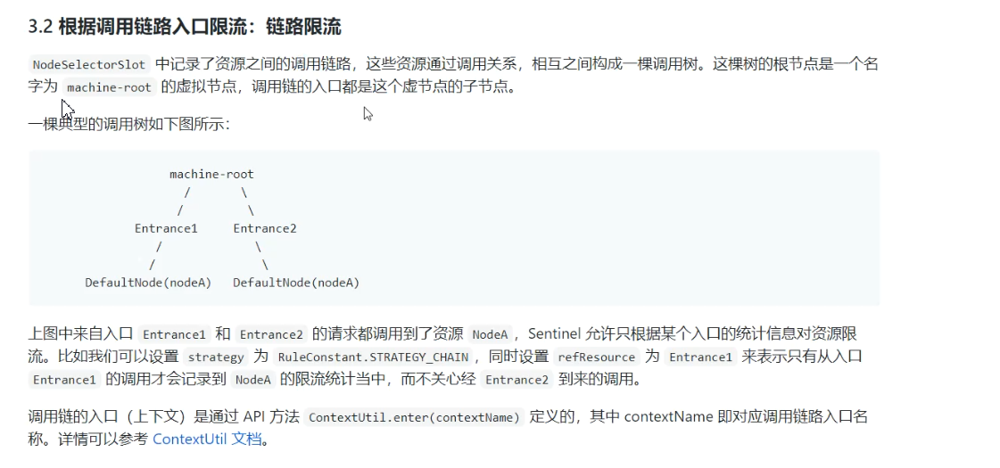

```properties
feign.sentinel.enabled=true
spring.cloud.sentinel.web-context-unify=false
```


> 触发条件：saveOrder[jifen save]有两个入口，分别为/order/test5和/order/test6
>
> 当/order/test5访问qps>1  那么/order/test5就不能访问受保护资源,其他入口照常访问

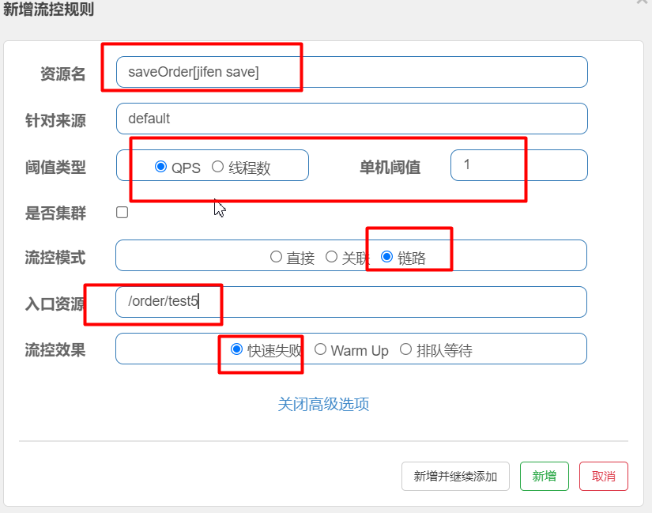


## 2.6：流控效果-Warm-up

> 讲解
>
> Warm Up（`RuleConstant.CONTROL_BEHAVIOR_WARM_UP`）方式，即预热/冷启动方式。当系统长期处于低水位的情况下，当流量突然增加时，直接把系统拉升到高水位可能瞬间把系统压垮。通过"冷启动"，让通过的流量缓慢增加，在一定时间内逐渐增加到阈值上限，给冷系统一个预热的时间，避免冷系统被压垮


> 默认 `coldFactor` 为 3，即请求 QPS 从 `threshold / 3` 开始，经预热时长逐渐升至设定的 QPS 阈值。


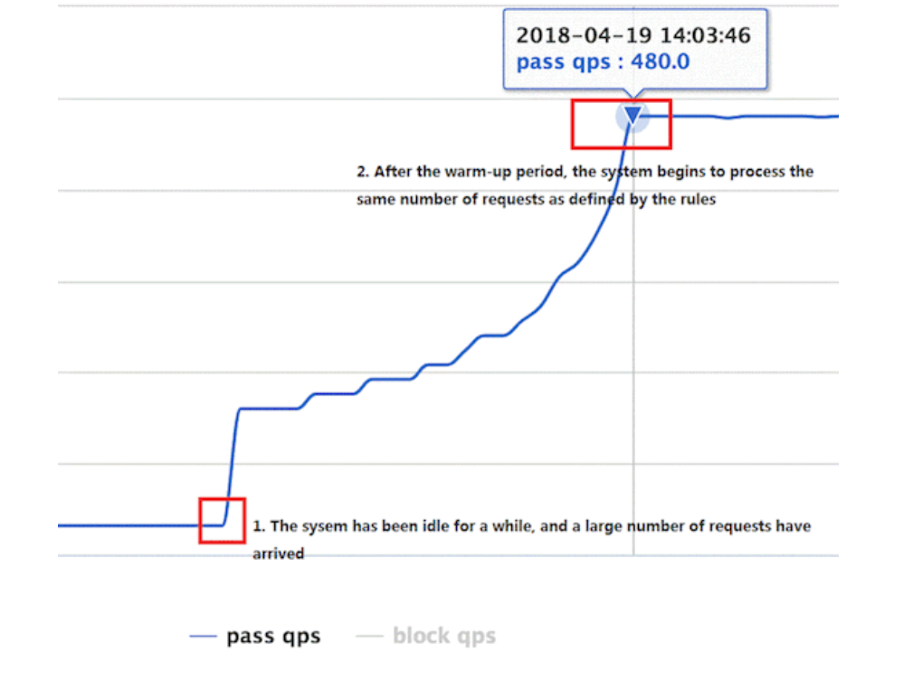


场景：

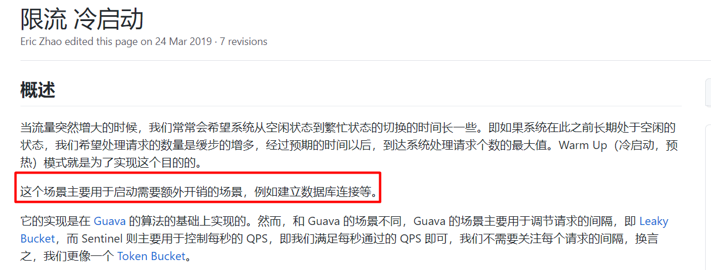

## 2.7：流控效果-匀速排队

匀速排队（`RuleConstant.CONTROL_BEHAVIOR_RATE_LIMITER`）方式会严格控制请求通过的间隔时间，也即是让请求以均匀的速度通过，对应的是漏桶算法。详细文档可以参考 [流量控制 - 匀速器模式](https://github.com/alibaba/Sentinel/wiki/流量控制-匀速排队模式)，具体的例子可以参见 [PaceFlowDemo](https://github.com/alibaba/Sentinel/blob/master/sentinel-demo/sentinel-demo-basic/src/main/java/com/alibaba/csp/sentinel/demo/flow/PaceFlowDemo.java)。


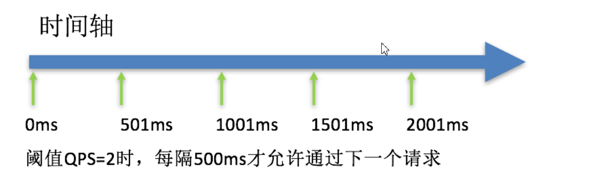


这种方式主要用于处理间隔性突发的流量，例如消息队列。想象一下这样的场景，在某一秒有大量的请求到来，而接下来的几秒则处于空闲状态，我们希望系统能够在接下来的空闲期间逐渐处理这些请求，而不是在第一秒直接拒绝多余的请求。


> 注意：匀速排队模式暂时不支持 QPS > 1000 的场景。


# 三：Sentinel服务熔断降级

> 除了流量控制以外，对调用链路中不稳定的资源进行熔断降级也是保障高可用的重要措施之一。一个服务常常会调用别的模块，可能是另外的一个远程服务、数据库，或者第三方 API 等。例如，支付的时候，可能需要远程调用银联提供的 API；查询某个商品的价格，可能需要进行数据库查询。然而，这个被依赖服务的稳定性是不能保证的。如果依赖的服务出现了不稳定的情况，请求的响应时间变长，那么调用服务的方法的响应时间也会变长，线程会产生堆积，最终可能耗尽业务自身的线程池，服务本身也变得不可用。


## 3.1：熔断降级- 慢调用比例

> 慢调用比例 (`SLOW_REQUEST_RATIO`)：选择以慢调用比例作为阈值，需要设置允许的慢调用 RT（即最大的响应时间），请求的响应时间大于该值则统计为慢调用。当单位统计时长（`statIntervalMs`）内请求数目大于设置的最小请求数目，并且慢调用的比例大于阈值，则接下来的熔断时长内请求会自动被熔断。经过熔断时长后熔断器会进入探测恢复状态（HALF-OPEN 状态），若接下来的一个请求响应时间小于设置的慢调用 RT 则结束熔断，若大于设置的慢调用 RT 则会再次被熔断。

​    **面试**

> **断路器的工作流程：**
>
> **一旦熔断，断路器的状态是Open（所有的请求都不能进来）**
>
> **当熔断时长结束，断路器的状态是half-Open（可以允许一个请求进来）**
>
> **如果接下来的请求正常，断路器的状态是close（资源就此恢复）**
>
> **如果接下来的请求不正常，断路器的状态是open**


> 触发条件
>
> 1：1s内最小请求数必须大于5
>
> 2：慢请求/总请求  > 0.6


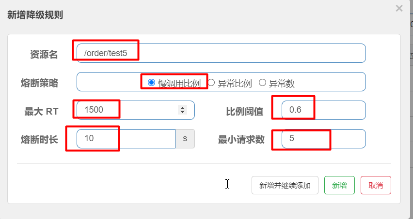


演示代码：

```java

    @RequestMapping("test5")
    public String test5(String flag)throws  Exception{

        if (flag == null) {

            Thread.sleep(1800);

        }

        return "test5";

    }
```


## 3.2：熔断降级-异常比例

> 异常比例 (`ERROR_RATIO`)：当单位统计时长（`statIntervalMs`）内请求数目大于设置的最小请求数目，并且异常的比例大于阈值，则接下来的熔断时长内请求会自动被熔断。经过熔断时长后熔断器会进入探测恢复状态（HALF-OPEN 状态），若接下来的一个请求成功完成（没有错误）则结束熔断，否则会再次被熔断。异常比率的阈值范围是 `[0.0, 1.0]`，代表 0% - 100%。

> 
>
> 断路器的工作流程：
>
> 一旦熔断，断路器的状态是Open（所有的请求都不能进来）
>
> 当熔断时长结束，断路器的状态是half-Open（可以允许一个请求进来）
>
> 如果接下来的请求正常，断路器的状态是close（资源就自恢复）
>
> 如果接下来的请求不正常，断路器的状态是open


> 触发条件
>
> 1：1s内最小请求数大于5
>
> 2：1s内  异常数/总请求数  > 0.6

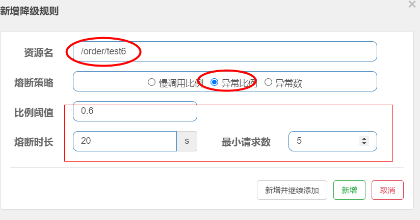

演示代码

```java

    @RequestMapping("test6")
    public String test6(String flag)throws  Exception{

        if (flag == null) {

            throw  new IllegalArgumentException("参数异常");

        }

        return "test6";

    }
```


## 3.3：熔断降级-异常数

> 异常数 (`ERROR_COUNT`)：当单位统计时长内的异常数目超过阈值之后会自动进行熔断。经过熔断时长后熔断器会进入探测恢复状态（HALF-OPEN 状态），若接下来的一个请求成功完成（没有错误）则结束熔断，否则会再次被熔断。
>
> 触发条件
>
> 1：每秒请求数必须大于5
>
> 2：每秒的异常数必须大于10【我们设置的阈值】


# 四：Sentinel-热点key规则

> **适用如：电商项目的热销商品的限流**
>
> 触发条件
>
> 1：必须有一个参数，参数的值可以任意 例如：http://localhost:9002/order/test7?name=jack
>
> 2：接口访问qps>1

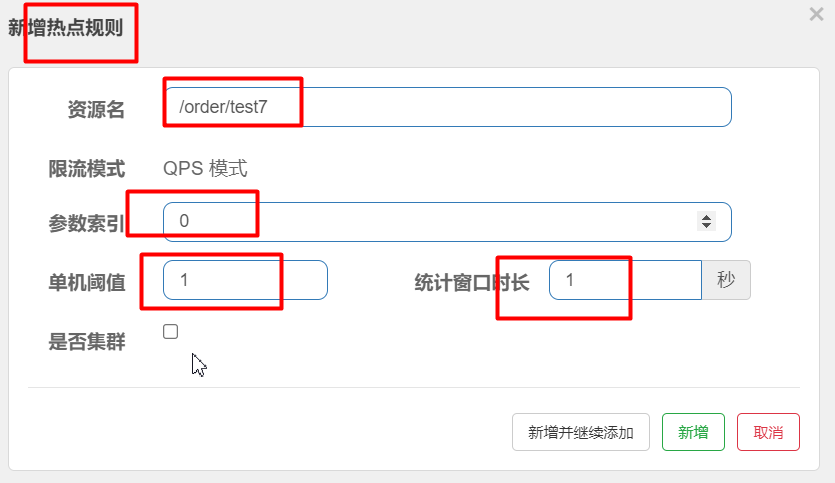


> 触发条件
>
> 1：第一个参数的值如果为jack，那么qps阈值为1
>
> 2：第一个参数的值如果为rose，那么qps阈值为5
>
> 3：第一个参数的值如果为其他，那么qps阈值为1


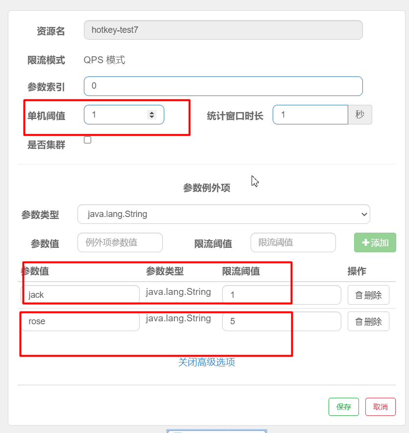


注意事项：

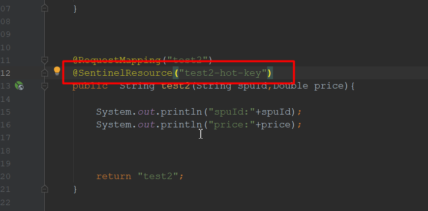


# 五：Sentinel-权限规则


> /goods/findById/{id} 对于cloud-order不能调用

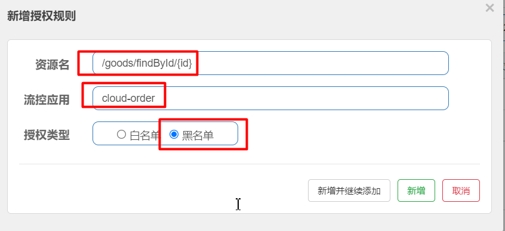


从请求头获取source

```java
package com.wfx.web;

import com.alibaba.csp.sentinel.adapter.spring.webmvc.callback.RequestOriginParser;
import org.springframework.stereotype.Component;

import javax.servlet.http.HttpServletRequest;


@Component
public class CustomerRequestOriginParser implements RequestOriginParser {


    public String parseOrigin(HttpServletRequest request) {

        System.out.println("come in");

        //获取请求头的source        
        String source1 = request.getHeader("source");
        System.out.println(source1);
        return source1;
    }
}
```


openFeign指定请求头，发送请求

```java
//接口声明(根据id获取积分)
@GetMapping(value = "/jifen/{jifenId}")
public Jifen findJifenById(@PathVariable("jifenId") Integer jifenId,@RequestHeader("source") String source);
```


openfeign拦截器统一设置请求头

```java
package com.wfx.feign;

import feign.RequestInterceptor;
import feign.RequestTemplate;
import org.springframework.stereotype.Component;

/**
 * <p>title: com.wfx.feign</p>
 * author zhuximing
 * description:
 */
@Component
public class CustomerRequestInterceptor implements RequestInterceptor {


    public void apply(RequestTemplate requestTemplate) {

        //统一设置请求头
        requestTemplate.header("source","wfx-order1");


    }
}
```


# 六：Sentinel-针对来源

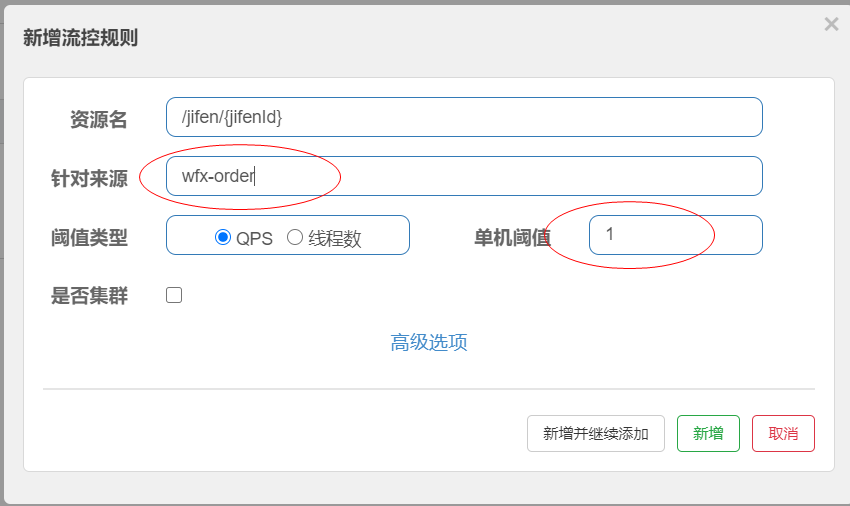


```java
package com.wfx.sentinel;

import com.alibaba.csp.sentinel.adapter.spring.webmvc.callback.RequestOriginParser;
import org.springframework.stereotype.Component;

import javax.servlet.http.HttpServletRequest;

/**
 * <p>title: com.wfx.sentinel</p>
 * author zhuximing
 * description:
 */
@Component
public class CustomerRequestOriginParser  implements RequestOriginParser {
    public String parseOrigin(HttpServletRequest httpServletRequest) {

        String source = httpServletRequest.getHeader("source");
        System.out.println("come in");
        System.out.println("source"+source);
        if (source != null) {

            return  source;
        }


        return null;
    }
}
```


# 七：系统规则

> - **Load 自适应**（仅对 Linux/Unix-like 机器生效）：系统的 load1 作为启发指标，进行自适应系统保护。当系统 load1 超过设定的启发值，且系统当前的并发线程数超过估算的系统容量时才会触发系统保护（BBR 阶段）。系统容量由系统的 `maxQps * minRt` 估算得出。设定参考值一般是 `CPU cores * 2.5`。
> - **CPU usage**（1.5.0+ 版本）：当系统 CPU 使用率超过阈值即触发系统保护（取值范围 0.0-1.0），比较灵敏。
> - **平均 RT**：当单台机器上所有入口流量的平均 RT 达到阈值即触发系统保护，单位是毫秒。
> - **并发线程数**：当单台机器上所有入口流量的并发线程数达到阈值即触发系统保护。
> - **入口 QPS**：当单台机器上所有入口流量的 QPS 达到阈值即触发系统保护。


# 八：@SentinelResource注解

## 8.1：流控自定义异常处理

```java
  //主逻辑
    @RequestMapping("test9")
    @SentinelResource(value="test9",blockHandler="test9Handler")
    public String test9(String name){


        //todo ...

        return "test9";
    }


    //备选逻辑
    public String test9Handler(String name,BlockException exception){


        return "系统繁忙，请稍后重试!!!";
    }
```


## 8.2：流控自定义异常优化

自定义

```java
//核心主逻辑
@GetMapping("test-d")
@SentinelResource(value = "test-d",blockHandlerClass= CustomBlockHandler.class,blockHandler="testblockHandler")
public Map  test(String name){

    return new HashMap(){{
        put("code","200");
        put("msg","success");
    }};
}
```


```java
package com.wfx.blockHandler;

import com.alibaba.csp.sentinel.slots.block.BlockException;

import java.util.HashMap;
import java.util.Map;


public class CustomBlockHandler {


    //降级逻辑(备选逻辑),BlockException参数必须写
    //方法定义为静态方法
    public static Map testblockHandler(String name, BlockException exception){

        System.out.println(name);

        return new HashMap(){{
            put("code","200");
            put("msg","系统繁忙，请稍后重试!!!!");
        }};
    }


}
```


## 8.3：熔断降级自定义处理

```java
  //主逻辑
    @RequestMapping("test6")
    @SentinelResource(value = "test6",fallback = "test6Handler")
    public String test6(String flag)throws  Exception{

        if (flag == null) {

            throw  new IllegalArgumentException("参数异常");

        }

        return "test6";

    }

    //备选
    public String test6Handler(String flag,Throwable throwable)throws  Exception{


        if(throwable instanceof DegradeException){
            return "系统开小差，一会重试!!!";
        }else{
            return "非sentinel异常";
        }

    }
```


## 8.4：熔断降级自定义处理优化


主逻辑

```java
  //主逻辑
    @RequestMapping("test")
    @SentinelResource(value = "test",fallback="testFallback",fallbackClass= HandleFallback.class)
    public String test(Integer flag){

        System.out.println(">>>>>>>>>>>>>>>>>>");

        if (flag == 0) {
            throw  new IllegalArgumentException("参数异常");
        }


        return "test" ;
    }
```


降级逻辑

```java
package com.wfx.sentinel;

import com.alibaba.csp.sentinel.slots.block.degrade.DegradeException;

/**
 * <p>title: com.wfx.sentinel</p>
 * author zhuximing
 * description:
 */
public class HandleFallback {

    //降级逻辑
    public static String testFallback(Integer flag, Throwable throwable){

        if (throwable instanceof DegradeException){
            return "触发了熔断系统开了个玩笑！！！" ;
        }else{
            return "其他异常系统开了个玩笑！！！" ;
        }

    }
}
```


## 8.5：全局异常处理   重点  

> springboot全局异常处理

```java
package com.qf.exception;

import com.alibaba.csp.sentinel.slots.block.authority.AuthorityException;
import com.alibaba.csp.sentinel.slots.block.degrade.DegradeException;
import com.alibaba.csp.sentinel.slots.block.flow.FlowException;
import org.springframework.web.bind.annotation.ControllerAdvice;
import org.springframework.web.bind.annotation.ExceptionHandler;
import org.springframework.web.bind.annotation.ResponseBody;

import java.util.HashMap;
import java.util.Map;

/**
 * <p>title: com.qf.exception</p>
 * <p>Company: wendao</p>
 * author zhuximing
 * date 2021/8/19
 * description:
 */
@ControllerAdvice
public class CustomerExceptionHandler {


    //流控规则，全局异常处理
    @ExceptionHandler(FlowException.class)
    @ResponseBody
    public Map handlerFlowExcetoption(){
        return  new HashMap(){{
            put("code", "5xx");
            put("msg", "系統繁忙，稍后重试！！");
        }};

    }


    //熔断降级规则，全局异常处理
    @ExceptionHandler(DegradeException.class)
    @ResponseBody
    public Map handlerDegradeException(){
        return  new HashMap(){{
            put("code", "5xx");
            put("msg", "系统开小差，稍后重试！！");
        }};

    }


    //权限规则，全局异常处理
    @ExceptionHandler(AuthorityException.class)
    @ResponseBody
    public Map handlerAuthorityException(){
        return  new HashMap(){{
            put("code", "5xx");
            put("msg", "，没有权限访问！！");
        }};

    }

}
```


# 九：Sentinel规则持久化

## 9.1：原始模式

如果不做任何修改，Dashboard 的推送规则方式是通过 API 将规则推送至客户端并直接更新到内存中：

这种做法的好处是简单，无依赖；坏处是应用重启规则就会消失，仅用于简单测试，不能用于生产环境。


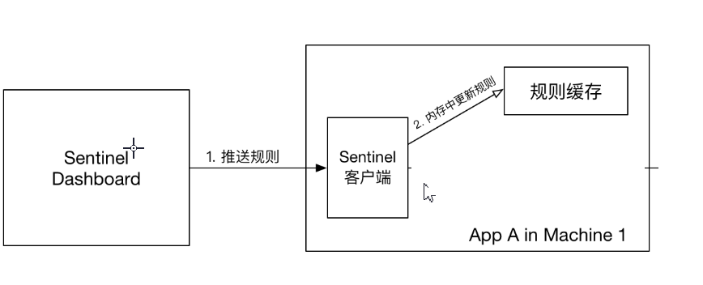


## 9.2：Pull模式

FileRefreshableDataSource **定时**从指定文件中读取规则JSON文件【图中的本地文件】，如果发现文件发生变化，就更新规则缓存。

FileWritableDataSource 接收控制台规则推送，并根据配置，修改规则JSON文件【图中的本地文件】。


### 9.2.1：pom依赖

```xml
<dependency>
  <groupId>com.alibaba.csp</groupId>
  <artifactId>sentinel-datasource-extension</artifactId>
</dependency>
```


### 9.2.2：核心代码

```java
package com.qf.sentinel;

import com.alibaba.csp.sentinel.command.handler.ModifyParamFlowRulesCommandHandler;
import com.alibaba.csp.sentinel.datasource.*;
import com.alibaba.csp.sentinel.init.InitFunc;
import com.alibaba.csp.sentinel.slots.block.authority.AuthorityRule;
import com.alibaba.csp.sentinel.slots.block.authority.AuthorityRuleManager;
import com.alibaba.csp.sentinel.slots.block.degrade.DegradeRule;
import com.alibaba.csp.sentinel.slots.block.degrade.DegradeRuleManager;
import com.alibaba.csp.sentinel.slots.block.flow.FlowRule;
import com.alibaba.csp.sentinel.slots.block.flow.FlowRuleManager;
import com.alibaba.csp.sentinel.slots.block.flow.param.ParamFlowRule;
import com.alibaba.csp.sentinel.slots.block.flow.param.ParamFlowRuleManager;
import com.alibaba.csp.sentinel.slots.system.SystemRule;
import com.alibaba.csp.sentinel.slots.system.SystemRuleManager;
import com.alibaba.csp.sentinel.transport.util.WritableDataSourceRegistry;
import com.alibaba.fastjson.JSON;
import com.alibaba.fastjson.TypeReference;

import java.io.File;
import java.io.IOException;
import java.util.List;

/**
 * 拉模式规则持久化
 */
public class FileDataSourceInit implements InitFunc {
    @Override
    public void init() throws Exception {
        // TIPS: 如果你对这个路径不喜欢，可修改为你喜欢的路径
        String ruleDir = System.getProperty("user.dir") + "/sentinel/rules";
        String flowRulePath = ruleDir + "/flow-rule.json";
        String degradeRulePath = ruleDir + "/degrade-rule.json";
        String systemRulePath = ruleDir + "/system-rule.json";
        String authorityRulePath = ruleDir + "/authority-rule.json";
        String paramFlowRulePath = ruleDir + "/param-flow-rule.json";

        this.mkdirIfNotExits(ruleDir);
        this.createFileIfNotExits(flowRulePath);
        this.createFileIfNotExits(degradeRulePath);
        this.createFileIfNotExits(systemRulePath);
        this.createFileIfNotExits(authorityRulePath);
        this.createFileIfNotExits(paramFlowRulePath);

        // 流控规则
        ReadableDataSource<String, List<FlowRule>> flowRuleRDS = new FileRefreshableDataSource<>(
            flowRulePath,
            flowRuleListParser
        );
        // 将可读数据源注册至FlowRuleManager
        // 这样当规则文件发生变化时，就会更新规则到内存
        FlowRuleManager.register2Property(flowRuleRDS.getProperty());
        WritableDataSource<List<FlowRule>> flowRuleWDS = new FileWritableDataSource<>(
            flowRulePath,
            this::encodeJson
        );
        // 将可写数据源注册至transport模块的WritableDataSourceRegistry中
        // 这样收到控制台推送的规则时，Sentinel会先更新到内存，然后将规则写入到文件中
        WritableDataSourceRegistry.registerFlowDataSource(flowRuleWDS);

        // 降级规则
        ReadableDataSource<String, List<DegradeRule>> degradeRuleRDS = new FileRefreshableDataSource<>(
            degradeRulePath,
            degradeRuleListParser
        );
        DegradeRuleManager.register2Property(degradeRuleRDS.getProperty());
        WritableDataSource<List<DegradeRule>> degradeRuleWDS = new FileWritableDataSource<>(
            degradeRulePath,
            this::encodeJson
        );
        WritableDataSourceRegistry.registerDegradeDataSource(degradeRuleWDS);

        // 系统规则
        ReadableDataSource<String, List<SystemRule>> systemRuleRDS = new FileRefreshableDataSource<>(
            systemRulePath,
            systemRuleListParser
        );
        SystemRuleManager.register2Property(systemRuleRDS.getProperty());
        WritableDataSource<List<SystemRule>> systemRuleWDS = new FileWritableDataSource<>(
            systemRulePath,
            this::encodeJson
        );
        WritableDataSourceRegistry.registerSystemDataSource(systemRuleWDS);

        // 授权规则
        ReadableDataSource<String, List<AuthorityRule>> authorityRuleRDS = new FileRefreshableDataSource<>(
            authorityRulePath,
            authorityRuleListParser
        );
        AuthorityRuleManager.register2Property(authorityRuleRDS.getProperty());
        WritableDataSource<List<AuthorityRule>> authorityRuleWDS = new FileWritableDataSource<>(
            authorityRulePath,
            this::encodeJson
        );
        WritableDataSourceRegistry.registerAuthorityDataSource(authorityRuleWDS);

        // 热点参数规则
        ReadableDataSource<String, List<ParamFlowRule>> paramFlowRuleRDS = new FileRefreshableDataSource<>(
            paramFlowRulePath,
            paramFlowRuleListParser
        );
        ParamFlowRuleManager.register2Property(paramFlowRuleRDS.getProperty());
        WritableDataSource<List<ParamFlowRule>> paramFlowRuleWDS = new FileWritableDataSource<>(
            paramFlowRulePath,
            this::encodeJson
        );
        ModifyParamFlowRulesCommandHandler.setWritableDataSource(paramFlowRuleWDS);
    }

    private Converter<String, List<FlowRule>> flowRuleListParser = source -> JSON.parseObject(
        source,
        new TypeReference<List<FlowRule>>() {
        }
    );
    private Converter<String, List<DegradeRule>> degradeRuleListParser = source -> JSON.parseObject(
        source,
        new TypeReference<List<DegradeRule>>() {
        }
    );
    private Converter<String, List<SystemRule>> systemRuleListParser = source -> JSON.parseObject(
        source,
        new TypeReference<List<SystemRule>>() {
        }
    );

    private Converter<String, List<AuthorityRule>> authorityRuleListParser = source -> JSON.parseObject(
        source,
        new TypeReference<List<AuthorityRule>>() {
        }
    );

    private Converter<String, List<ParamFlowRule>> paramFlowRuleListParser = source -> JSON.parseObject(
        source,
        new TypeReference<List<ParamFlowRule>>() {
        }
    );

    private void mkdirIfNotExits(String filePath) throws IOException {
        File file = new File(filePath);
        if (!file.exists()) {
            file.mkdirs();
        }
    }

    private void createFileIfNotExits(String filePath) throws IOException {
        File file = new File(filePath);
        if (!file.exists()) {
            file.createNewFile();
        }
    }

    private <T> String encodeJson(T t) {
        return JSON.toJSONString(t);
    }


}
```


### 9.2.3：配置

在项目的 `resources/META-INF/services` 目录下创建文件，

文件名： com.alibaba.csp.sentinel.init.InitFunc

内容为如下：

```
# 改成上面FileDataSourceInit的包名类名全路径即可。
com.wfx.config.FileDataSourceInit
```


### 9.2.4：优缺点分析

- 优点
	- 简单易懂
	- 没有多余依赖（比如配置中心、缓存等）
- 缺点
	- 由于规则是用 FileRefreshableDataSource 定时更新的，所以规则更新会有延迟。如果FileRefreshableDataSource定时时间过大，可能长时间延迟；如果FileRefreshableDataSource过小，又会影响性能；
	- 规则存储在本地文件，如果有一天需要迁移微服务，那么需要把规则文件一起迁移，否则规则会丢失。


## 9.3：Push模式

生产环境下一般更常用的是 push 模式的数据源。对于 push 模式的数据源,如远程配置中心（ZooKeeper, Nacos,  Apollo等等），推送的操作不应由 Sentinel  客户端进行，而应该经控制台统一进行管理，直接进行推送，数据源仅负责获取配置中心推送的配置并更新到本地。因此推送规则正确做法应该是 **配置中心控制台/Sentinel 控制台 → 配置中心 → Sentinel 数据源 → Sentinel**，而不是经 Sentinel 数据源推送至配置中心。这样的流程就非常清晰了：

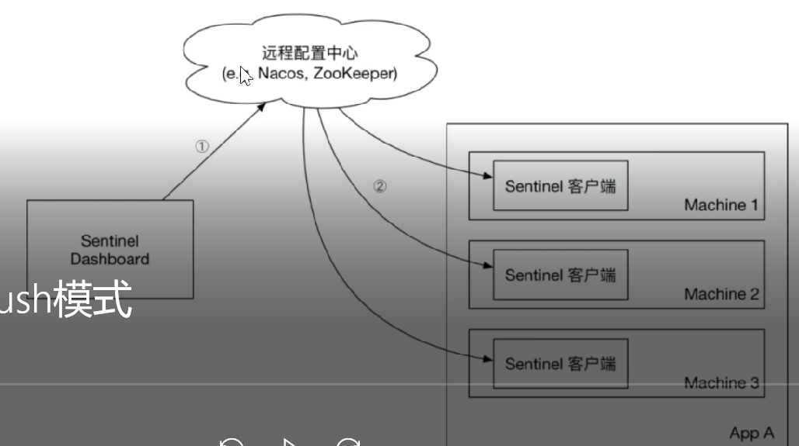

### 9.3.1：控制台改造

懒人包


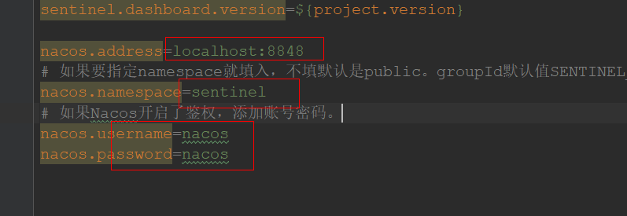

### 9.3.2：微服务端

```xml
<!-- sentinel -->
<dependency>
    <groupId>com.alibaba.cloud</groupId>
    <artifactId>spring-cloud-starter-alibaba-sentinel</artifactId>
</dependency>
<!-- sentinel的nacos持久化 -->
<dependency>
    <groupId>com.alibaba.csp</groupId>
    <artifactId>sentinel-datasource-nacos</artifactId>
</dependency>
```


### 9.3.3：添加配置   (先在nacos添加sentinel命名空间)

```properties
spring:
  cloud:
    sentinel:
      transport:
        port: 8721
        dashboard: localhost:8888
      eager: true #饥饿加载
      web-context-unify: false
      datasource:
        degrade:
          nacos:
            server-addr: ${nacos.server-addr}
            username: ${nacos.username}
            password: ${nacos.password}
            namespace: ${nacos.namespace}
            groupId: SENTINEL_GROUP
            dataId: ${spring.application.name}-degrade-rules
            rule-type: degrade
nacos:
  server-addr: localhost:8848
  username: nacos
  password: nacos
  namespace: sentinel
```


