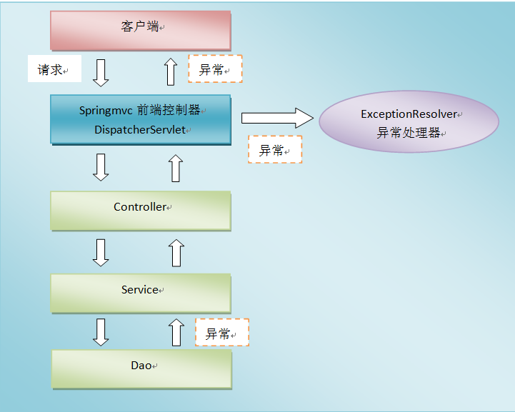

# SpringMVC文件上传下载及异常处理
**面试：**

**文件上传的类MultipartFile     transferTo() 存文件**

 **全局异常处理： @ControllerAdvice 和 @ExceptionHandler**

## 一、`SpringMVC`文件上传

> 文件上传客户端表单需要满足：
>
> * 表单项type=“file”
> * 表单的提交方式是POST
> * 表单的enctype属性是多部分表单形式，及enctype=“multipart/form-data”

### 1.1、环境搭建

> 1) 创建Maven Web工程
>
> 2) 导入坐标

```xml
<?xml version="1.0" encoding="UTF-8"?>

<project xmlns="http://maven.apache.org/POM/4.0.0" xmlns:xsi="http://www.w3.org/2001/XMLSchema-instance"
         xsi:schemaLocation="http://maven.apache.org/POM/4.0.0 http://maven.apache.org/xsd/maven-4.0.0.xsd">
    <modelVersion>4.0.0</modelVersion>

    <groupId>com.qfedu</groupId>
    <artifactId>01_springmvc_fileupload</artifactId>
    <version>1.0.0</version>
    <packaging>war</packaging>

    <properties>
        <project.build.sourceEncoding>UTF-8</project.build.sourceEncoding>
        <maven.compiler.source>1.8</maven.compiler.source>
        <maven.compiler.target>1.8</maven.compiler.target>
    </properties>

    <dependencies>
        <dependency>
            <groupId>org.springframework</groupId>
            <artifactId>spring-context</artifactId>
            <version>5.2.6.RELEASE</version>
        </dependency>
        <dependency>
            <groupId>org.springframework</groupId>
            <artifactId>spring-web</artifactId>
            <version>5.2.6.RELEASE</version>
        </dependency>
        <dependency>
            <groupId>org.springframework</groupId>
            <artifactId>spring-webmvc</artifactId>
            <version>5.2.6.RELEASE</version>
        </dependency>
        <dependency>
            <groupId>javax.servlet</groupId>
            <artifactId>javax.servlet-api</artifactId>
            <version>3.0.1</version>
        </dependency>
        <dependency>
            <groupId>javax.servlet.jsp</groupId>
            <artifactId>javax.servlet.jsp-api</artifactId>
            <version>2.3.3</version>
        </dependency>
        <dependency>
            <groupId>commons-io</groupId>
            <artifactId>commons-io</artifactId>
            <version>2.6</version>
        </dependency>
        <dependency>
            <groupId>commons-fileupload</groupId>
            <artifactId>commons-fileupload</artifactId>
            <version>1.4</version>
        </dependency>
        <dependency>
            <groupId>junit</groupId>
            <artifactId>junit</artifactId>
            <version>4.11</version>
            <scope>test</scope>
        </dependency>
    </dependencies>
</project>
```

> 3) springmvc配置文件

```xml
<?xml version="1.0" encoding="UTF-8"?>
<beans xmlns="http://www.springframework.org/schema/beans"
       xmlns:context="http://www.springframework.org/schema/context"
       xmlns:mvc="http://www.springframework.org/schema/mvc"
       xmlns:xsi="http://www.w3.org/2001/XMLSchema-instance"
       xsi:schemaLocation="
        http://www.springframework.org/schema/beans
        http://www.springframework.org/schema/beans/spring-beans.xsd
        http://www.springframework.org/schema/context
        http://www.springframework.org/schema/context/spring-context.xsd
        http://www.springframework.org/schema/mvc
        http://www.springframework.org/schema/mvc/spring-mvc.xsd">
    <context:component-scan base-package="com.qfedu.controller" />
    <mvc:annotation-driven />

    <mvc:resources mapping="/js/**" location="/js/" />
    <mvc:resources mapping="/css/**" location="/css/" />
    <mvc:resources mapping="/img/**" location="/img/" />

    <bean id="viewResolver" class="org.springframework.web.servlet.view.InternalResourceViewResolver" >
        <property name="prefix" value="/jsp/" />
        <property name="suffix" value=".jsp" />
    </bean>

    <!-- 配置文件上传解析器
 		这里的id一定要写，而且写法固定
	-->
    <bean id="multipartResolver" class="org.springframework.web.multipart.commons.CommonsMultipartResolver" >
        <property name="defaultEncoding" value="utf-8" />
        <property name="maxUploadSize" value="90000000000" />
    </bean>
</beans>
```

> 注意这里的文件上传解析器。
>
> 4) 用于文件上传的页面

```jsp
<%@ page contentType="text/html;charset=UTF-8" language="java" %>
<html>
<body>
    <h2>单文件上传</h2>
    <form action="${pageContext.request.contextPath}/test/test1" method="post" enctype="multipart/form-data">
        姓名<input type="text" name="username" /><br/>
        文件<input type="file" name="upload" /><br/>
        <button type="submit">提交</button>
    </form>

    <h2>多文件上传</h2>
    <form action="${pageContext.request.contextPath}/test/test2" method="post" enctype="multipart/form-data">
        姓名<input type="text" name="username" /><br/>
        文件1<input type="file" name="upload" /><br/>
        文件2<input type="file" name="upload" /><br/>
        文件3<input type="file" name="upload" /><br/>
        <button type="submit">提交</button>
    </form>
</body>
</html>
```

> 5) success.jsp

```jsp
<%@ page contentType="text/html;charset=UTF-8" language="java" %>
<html>
<head>
    <title>success</title>
</head>
<body>
    <p>success</p>
</body>
</html>
```

### 1.2、单文件上传

```java
/**
  * 单文件上传
  */
@RequestMapping("/test1")
public String test1(String username, MultipartFile upload) throws IOException {
    System.out.println(username);
    String filename = upload.getOriginalFilename();
    upload.transferTo(new File("D:/" + filename));
    return "success";
}
```

### 1.3、多文件上传

```java
/**
  * 多文件上传
  */
@RequestMapping("/test2")
public String test2(String username, MultipartFile[] upload) throws IOException {
    System.out.println();
    for (MultipartFile file : upload) {
        String filename = file.getOriginalFilename();
        file.transferTo(new File("D:/" + filename));
    }
    return "success";
}
```

## 二、`SpringMVC`文件下载

### 2.1、直接向`response`的输出流中写入对应的文件流

```java
@RequestMapping("/download1")
public void download1(HttpServletResponse response) throws IOException {
    //获取响应流
    ServletOutputStream outputStream = response.getOutputStream();
    //读取文件
    byte[] arr = FileUtils.readFileToByteArray(new File("D:\\图片1.jpg"));
    //设置响应头 URLEncoder.encode()用来设置文件名编码，防止文件名乱码
    response.setHeader("Content-Disposition","attachment;filename=" + URLEncoder.encode("图片111.jpg", "UTF-8"));
    outputStream.write(arr);
    outputStream.flush();
    outputStream.close();
}
```

### 2.2、使用`ResponseEntity<byte[]>`来向前端返回文件

```java
@RequestMapping("/download2")
public ResponseEntity<byte[]> download2() throws IOException {
    //获取文件对象
    byte[] bytes = FileUtils.readFileToByteArray(new File("D:\\图片1.jpg"));
    HttpHeaders headers=new HttpHeaders();
    headers.set("Content-Disposition","attachment;filename=" + URLEncoder.encode("图片111.jpg", "UTF-8"));
    ResponseEntity<byte[]> entity = new ResponseEntity<>(bytes,headers, HttpStatus.OK);
    return entity;
}
```

## 三、`SpringMVC`异常处理

### 3.1、异常处理思路

> 系统的`dao`、`service`、`controller`出现都通过`throws Exception`向上抛出，最后由`springmvc`前端控制器交由**异常处理器**进行异常处理。



### 3.2、控制器异常处理方式   了解，重要性低

> 配置控制器异常处理，使用`@Controller+@ExceptionHandler`。

编写控制器类

```java
@Data
@AllArgsConstructor
@NoArgsConstructor
public class ResultVO {
    private String code;  //状态码  1000 成功  1001失败
    private String msg;   //提示信息
    private Object obj;   //后端给前端返回的数据
}
@Controller
@RequestMapping("/test")
public class TestController {
	/**
	 	@ExceptionHandler用来定义异常处理，这个异常处理在控制器内部，只能处理控制器内部方法出现的异常;
	 	@ExceptionHandler的参数是Throwable实现类的Class数组，可以填多个值，但是要加大括号
	 */
      /**
     * 处理本Controller中发生的异常，返回数据给前端
     * @param e
     * @return
     */
    @ExceptionHandler(Exception.class)
    @ResponseBody
    public ResultVO hanlderException(Exception e){
        System.out.println(e.getMessage());
        return  new ResultVO("1001","系统繁忙稍后再试",null);
    }

    @RequestMapping("index1")
    @ResponseBody
    public String index1(String username){

         int i=1/0;
        return "success";
    }
}
```

### 3.3、全局异常处理   面试，非常重要

> 控制器的异常处理只能处理控制器内部的异常，如果希望处理控制器抛出的所有异常而不希望在控制器内部处理，这就需要配置全局异常处理。配置全局异常处理，使用`@ControllerAdvice+@ExceptionHandler`。

#### 3.3.1、在控制器中添加方法

```java
@RequestMapping("/test2")
public String test2(int a) throws Exception {
    if(a == 100) {
        throw new Exception("出错了");
    }
    return "success";
}
```

#### 3.3.2、编写全局异常处理类

```java
@ControllerAdvice   
public class WebExceptionHandler {
    /**
     * 全局异常处理，处理Exception
     */
     @ExceptionHandler(Exception.class)
   public String hanlderException(Exception e){
        System.out.println(e.getMessage());
        return  "error";
   }
}
定义一个错误页面---->error.jsp
<%--
  Created by IntelliJ IDEA.
  User: Administrator
  Date: 2022/12/30
  Time: 16:40
  To change this template use File | Settings | File Templates.
--%>
<%@ page contentType="text/html;charset=UTF-8" language="java" %>
<html>
<head>
    <title>Title</title>
</head>
<body>
  系统繁忙，稍后再试
</body>
</html>

```

### 3.4、异常处理返回JSON数据

#### 3.4.1、修改全局异常处理类

```java
@Data
@AllArgsConstructor
@NoArgsConstructor
public class ResultVO {
    private String code;  //状态码  1000 成功  1001失败
    private String msg;   //提示信息
    private Object obj;   //后端给前端返回的数据
}


@ControllerAdvice
public class WebExceptionHandler {
    /**
     * 全局异常处理，处理Exception
     * 返回JSON
     */
    @ExceptionHandler(Exception.class)
    @ResponseBody
    public ResultVO hanlderException(Exception e){
        System.out.println(e.getMessage());
        return  new ResultVO("1001","系统繁忙稍后再试",null);
    }
}
```

#### 3.4.2、发送请求的页面

```jsp
<%@ page contentType="text/html;charset=UTF-8" language="java" %>
<html>
<head>
    <title>Index</title>
    <script src="${pageContext.request.contextPath}/js/jquery-3.3.1.js"></script>
    <script>
        $(function () {
            $("#btn").click(function () {
                //发送ajax请求
                $.ajax({
                    url: "${pageContext.request.contextPath}/test/test2",
                    data: {a:100},
                    dataType: "JSON",
                    type: "POST",
                    success: function(data) {
                        console.log(data);
                    }
                });
            });
        });
    </script>
</head>
<body>
    <p>
        <a href="${pageContext.request.contextPath}/test/test1">测试控制器异常处理</a>
    </p>
    <p>
        <a href="${pageContext.request.contextPath}/test/test2?a=100">测试控制器全局处理</a>
    </p>
    <p>
        <button id="btn" type="button">测试全局异常处理，返回JSON</button>
    </p>
</body>
</html>

```

