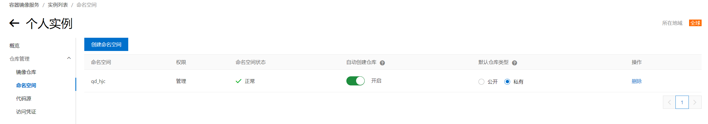
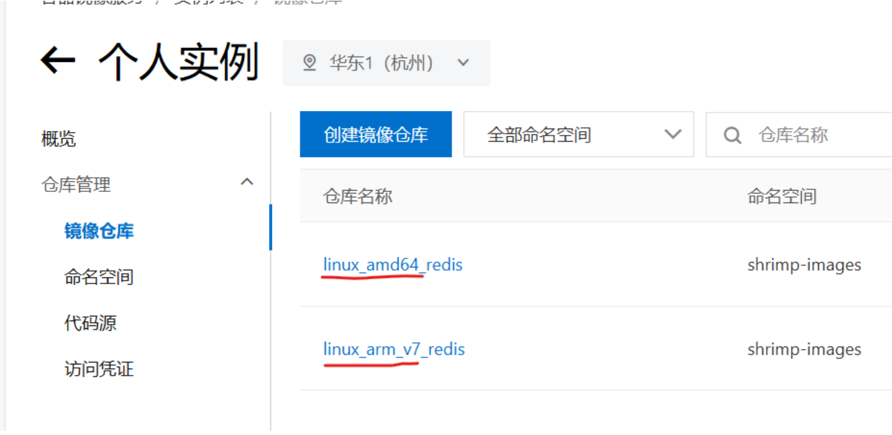
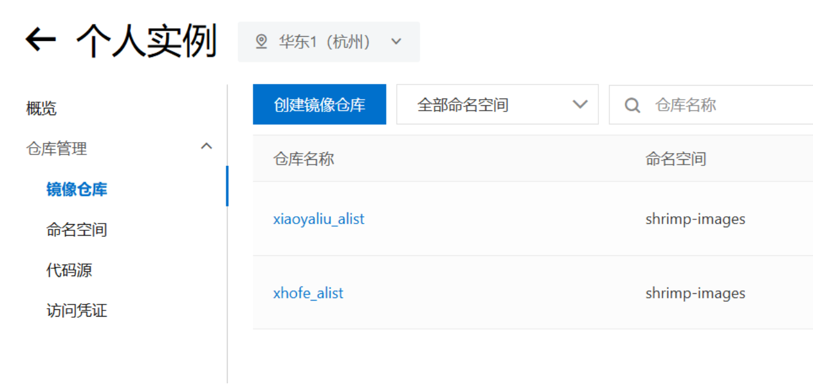
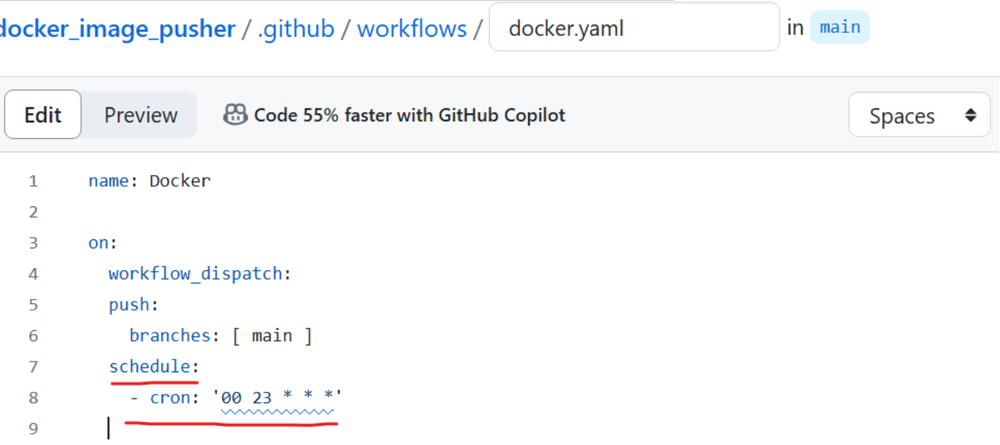

# 使用阿里云本地镜像库拉取镜像

## 搭建阿里云本地docker镜像库环境

登录阿里云容器镜像服务
https://cr.console.aliyun.com/

```
启用个人实例，创建一个命名空间（ALIYUN_NAME_SPACE）
```



访问凭证–>获取环境变量

```
用户名(ALIYUN_REGISTRY_USER)
密码(AIYUN_REGISTRY_PASSWORD)
仓库地址(ALIYUN_REGISTRY)
命名空间(ALIYUN_NAME_SPACE)
```


### Fork本项目


Fork本项目

#### 启动Action

进入您自己的项目，点击Action，启用Github Action功能

#### 配置环境变量

```
进入Settings->Secret and variables->Actions->New Repository secret
```


### 添加镜像


```
打开images.txt文件，添加你想要的镜像，可以带tag，也可以不用(默认latest)
也可添加 --platform=xxxxx 的参数指定镜像架构

 文件提交后，自动进入Github Action构建
```


### 使用镜像

回到阿里云，镜像仓库，点击任意镜像，可查看镜像状态。(可以改成公开，拉取镜像免登录)

在国内服务器pull镜像：

```
docker pull registry.cn-hangzhou.aliyuncs.com/shrimp-images/alpine

registry.cn-hangzhou.aliyuncs.com 即 ALIYUN_REGISTRY
qd_hjc 即 ALIYUN_NAME_SPACE
alpine 即阿里云中显示的镜像名
```


### 多架构

需要在images.txt中用 --platform=xxxxx手动指定镜像架构 指定后的架构会以前缀的形式放在镜像名字前面



### 镜像重名


程序自动判断是否存在名称相同, 但是属于不同命名空间的情况。 如果存在，会把命名空间作为前缀加在镜像名称前。 例如:

```
xhofe/alist
xiaoyaliu/alist
```



### 定时执行


```
修改/.github/workflows/docker.yaml文件 添加 schedule即可定时执行(此处cron使用UTC时区)
```



