# Git
**1 git init           初始化git**

**2 git status     看工作区文件状态**

**3 git add        将游离态的文件提交到暂存区**

**4 git commit -m "提交说明"      将暂存区的文件提交到本地仓库**

**5 git log --oneline                      显示提交版本**  

**6 git checkout  版本编号         切换版本**

**7 git push 将本地仓库的文件提交到远程仓库**

**8 git clone 首次拉取**

**9 git pull 更新本地代码**

**10 git branch  查看本地分支   -r 查看远程分支  ,**

**11 git branch 分支名   新建本地分支**

**12  git checkout    分支名  切换本地分支**

**13 git merge   分支名  分支合并 **

**与提交有关： git add   | git commit    |  git  push** 

**与拉取有关: git clone |  git pull** 

**分支 ：  git  branch     | git checkout 分支名  |   git merge   合并分支**

**代码冲突后: 用merge解决**

## 一：Git简介

官网：https://git-scm.com/


​    **面试题**

> **git是项目版本管理与多人协同开发一个工具**

### 1.1：项目版本管理

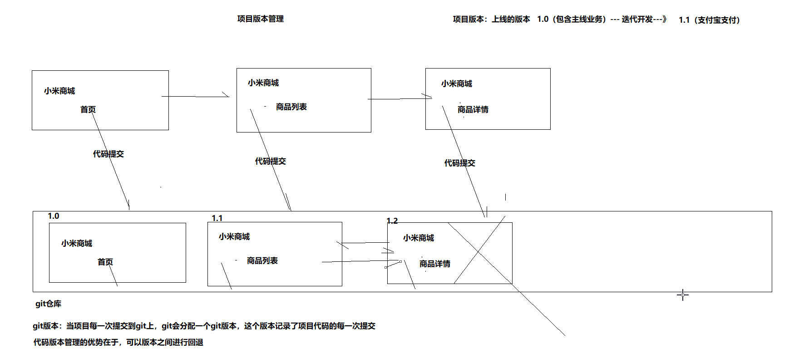


### 1.2：多人协同开发

> 一个团队开发一个项目

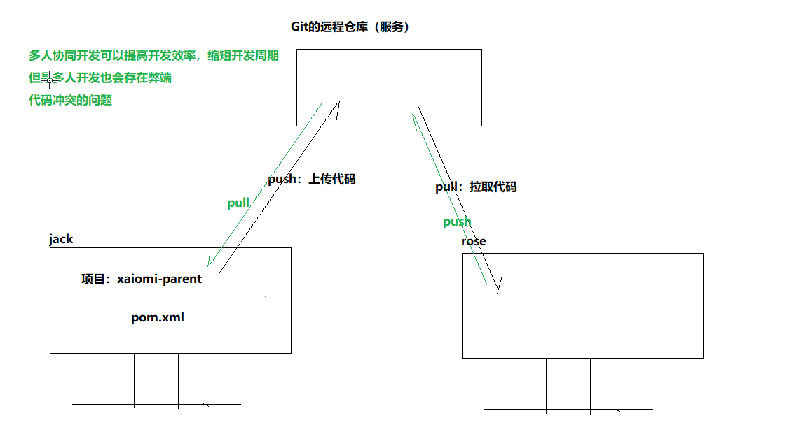


## 二：Git安装

### 3.1：下载

下载地址：<https://git-scm.com/downloads>

### 3.2：安装

> 指定一个安装目录，然后一路Next即可


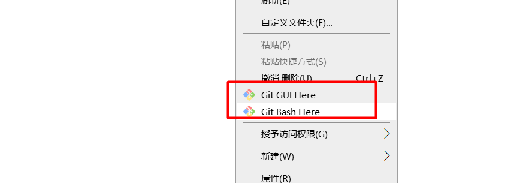


### 3.3：全局配置

> 自报家门

```shell
git config --global user.name "Your Name"  #用户名
git config --global user.email "email@example.com"  #邮箱
# 查看信息
git config -l
```


## 三：Git架构

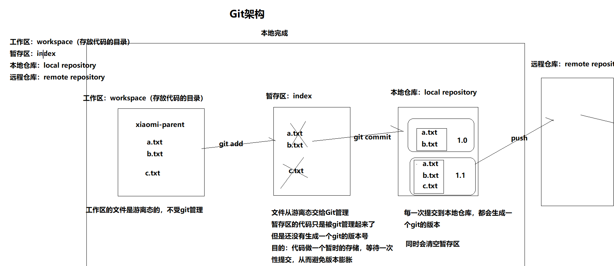


## 四：Git基本操作

>  第一步：创建工作区

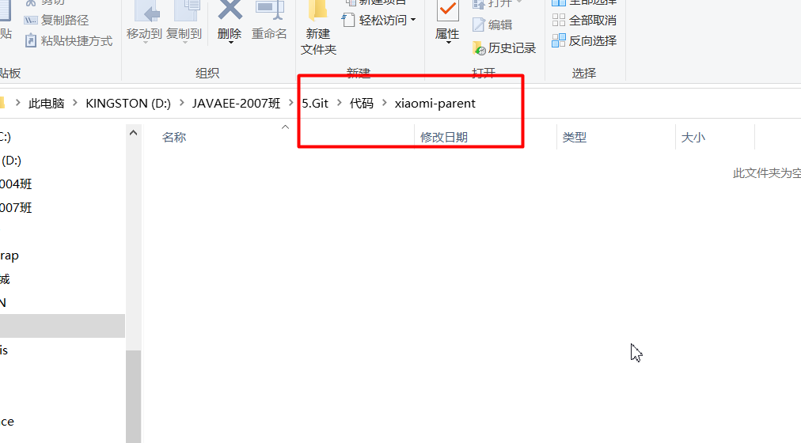


> 第二步：初始化git，生成本地仓库和暂存区


> 第三步：代码编写


> 第四步：将文件提交到暂存区，暂时存储

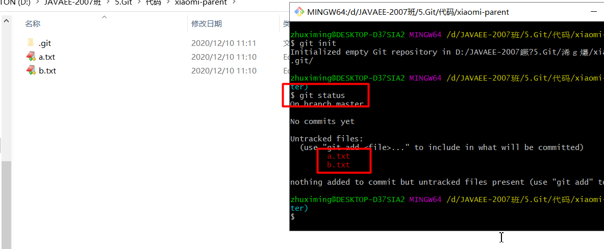

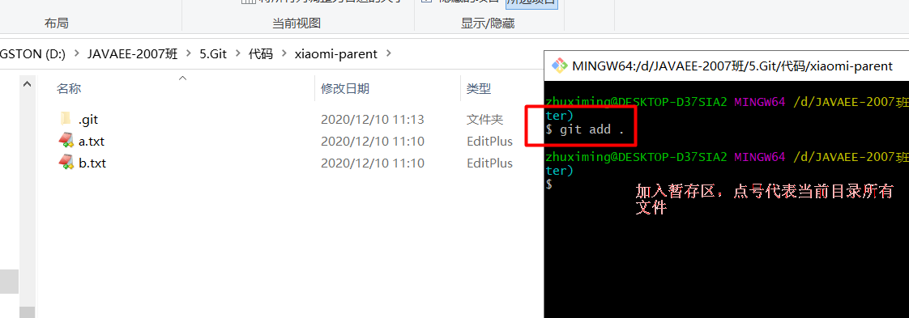


> 第五步：将暂存区的代码提交到本地仓库，生成一个git版本

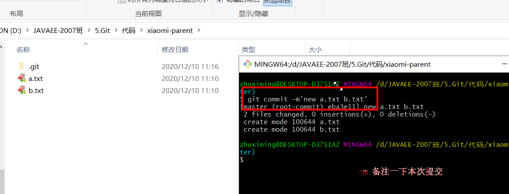


>看提交日志
>
>git log


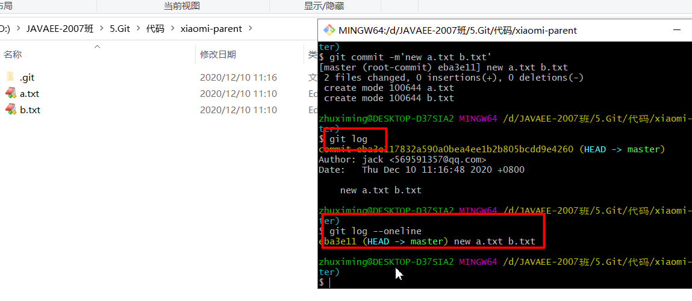

> 版本的切换
>
> git checkout 版本号


## 五：Git远程仓库

### 5.1：远程仓库选择

选择一：github(<https://github.com/>)  pass

选择二：码云(<https://gitee.com/>)  【优选】

选择三：使用GitLab搭建自己的远程仓库，企业开发首选（运维篇）


### 5.2：在码云上创建远程仓库


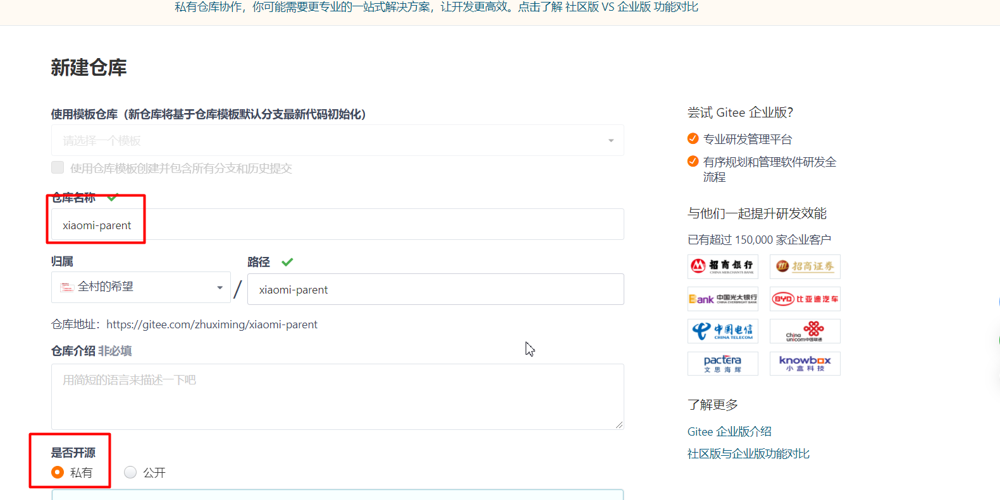

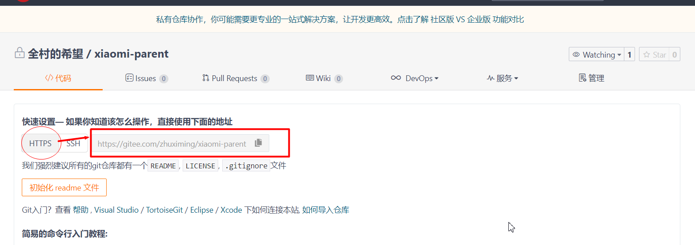


### 5.3：远程仓库操作

> push本地仓库代码到远程仓库
>
> git push  https://gitee.com/zhuximing/xiaomi-parent.git   master:master
>
> 第一个master就是本地仓库的master分支
>
> 第二个master是远程仓库的master分支
>
> 


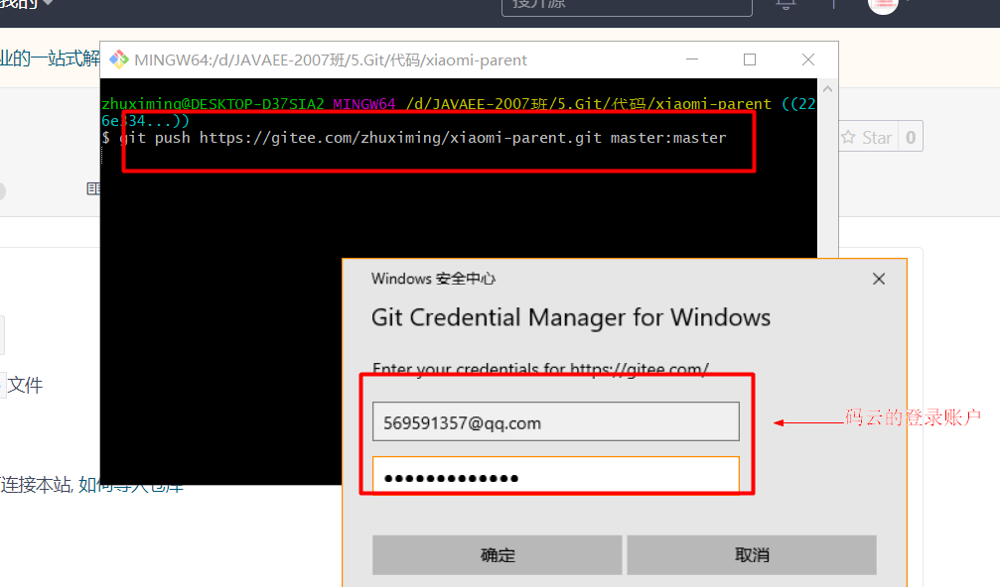


#### 5.3.1：关联远程仓库

|                  git remote add origin url                   |
| :----------------------------------------------------------: |
|  |


#### 5.3.2 ：推送文件到远程仓库

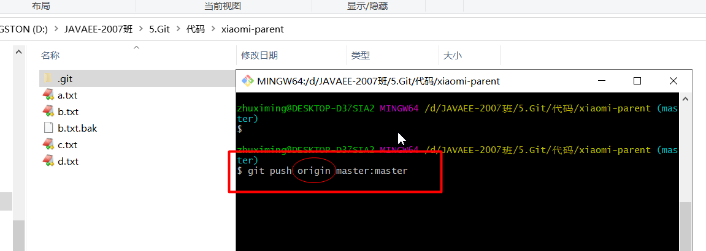


#### 5.3.3：克隆远程仓库

> 将远程仓库的代码clone到本地
>
> git clone https://gitee.com/zhuximing/xiaomi-parent.git -b master
>
> -b 表示指定远程仓库的某个分支进行克隆
>
> clone 只做一遍


#### 5.3.4：拉取远程仓库代码

> git pull origin【url】master:master
>
> 第一个master是远程仓库的master分支
>
> 第二个master是本地仓库的分支


window缓存gitee的账户

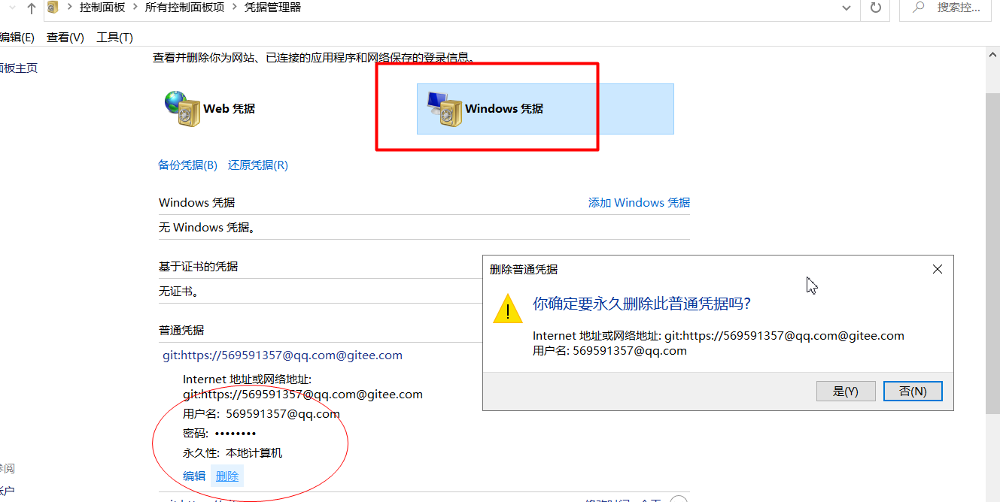


#### 5.3.5：多人协作代码冲突   (企业中用idea处理)

演示冲突：

jack前进一步

rose也前进一步

jack   push 代码到远程仓库

rose push  代码到远程仓库

rose提示你需要先pull

rose pull代码  报错【reject】

涉及到三方合并【jack本地、rose本地、jack和rose前一个共同的版本】

三方合并的思路

第一步：git fetch origin   ======>将远程的.git信息下载到本地

第二步：git merge origin/master   ==>将远程的master手动合并到本地的master

第三步：合并报错，【conflit  合并冲突】

第四步：人工解决【协商最终的结果】

第五步：将合并的结果push到远程仓库

第六步：另一方将解决的结果pull下来

到此  冲突解决完毕！！！！！


## 六：Git分支


#### 6.1：为什么要有分支


#### 6.2：查看分支

> git branch 查看本地的分支
>
> git branch -r 查看远程的分支

#### 6.3：基于master创建分支（bankpay）

> 创建分支
>
> git branch 分支名称


#### 6.4：分支切换命令

> git checkout  分支名称


#### 6.5：将master1分支推到远程协同开发

> git push origin master1:master1
>
> 第一个master1是本地仓库分支
>
> 第二个master1是远程仓库的分支，如果远程仓库没有该分支，会自动创建改分支


#### 6.6：master1分支合并到master

> 第一步：切换到master分支
>
> git checkout master
>
> 第二步：合并（master1->master）
>
> 在本地完成合并
>
> git merge master1
>
> 第三步：push到远程仓库master分支
>
> git push origin master:master


#### 


## 七：Idea中使用Git


#### 7.1 关联Git

> [File > Settings]()  关联过程是自动的


#### 7.2 创建本地仓库

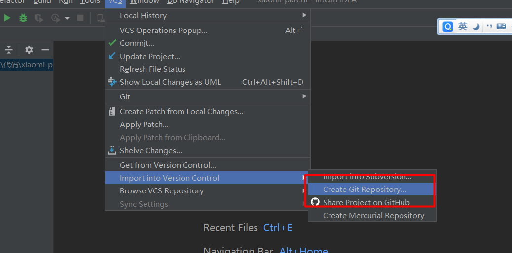


或者 


> * 新建项目后，在项目目录下创建为git仓库
>
> * 注意： 要在建仓库前，设置[忽略文件 ".gitignore"]()
>
> 	作用：被忽略的文件会被版本记录忽略，版本中不包含它们。比如.idea目录 、*.iml 、target
>
> 	范围：不需要和其他开发共享的文件，具体见下图。


忽略文件或目录【如果文件或者目录加入了忽略列表，那么在add的时候以及在commit的时候该文件或目录直接忽略掉】

第一步：下载插件


第二步：使用插件，协助创建.gitignore文件

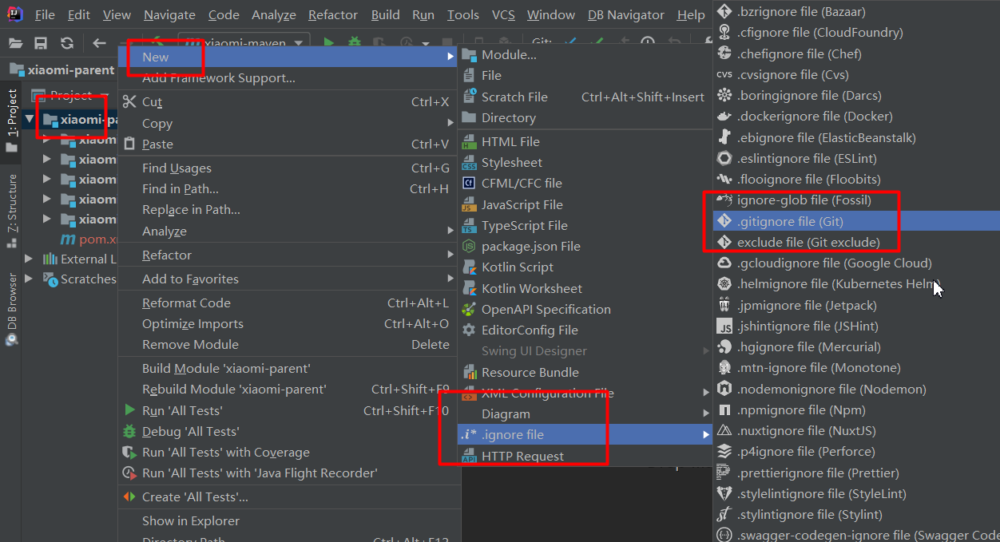


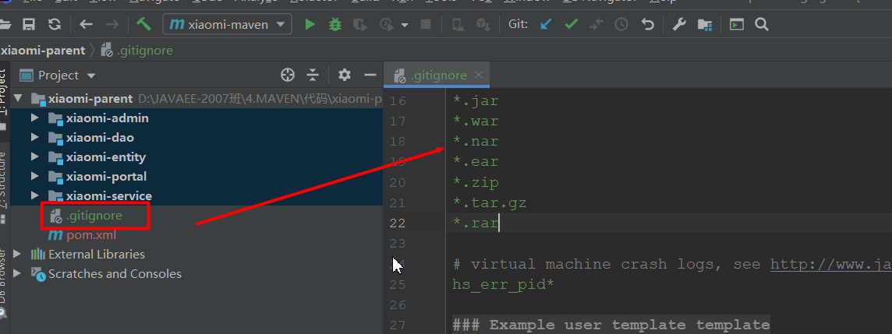

忽略java 

gen下写target

#### 7.3 提交到本地仓库

> 创建好仓库后，做第一次提交。

#### 7.4：push到远程仓库


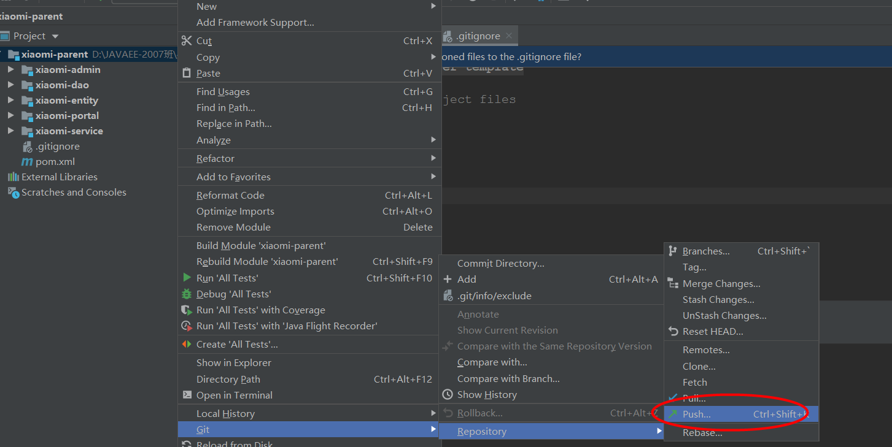


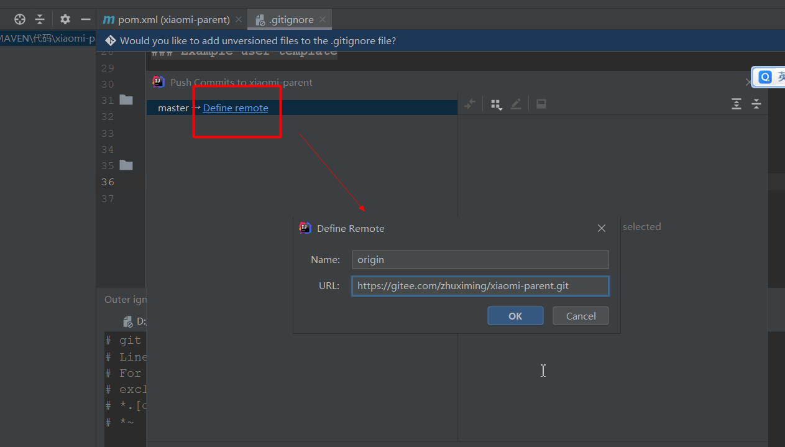


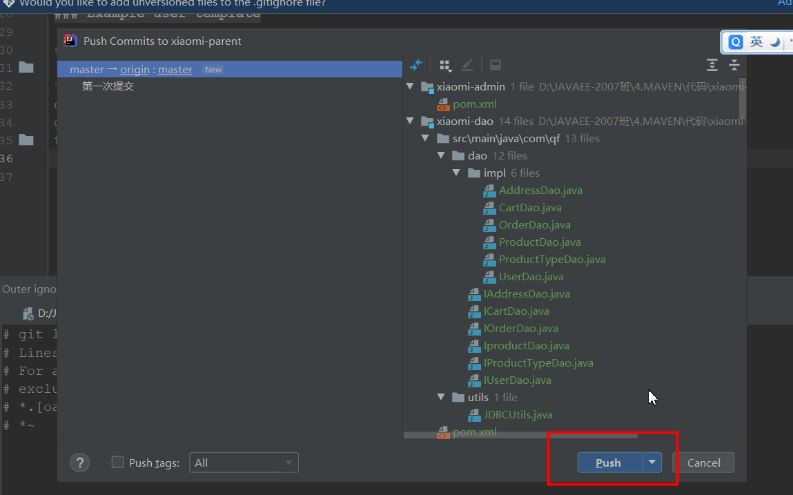


#### 7.5：克隆


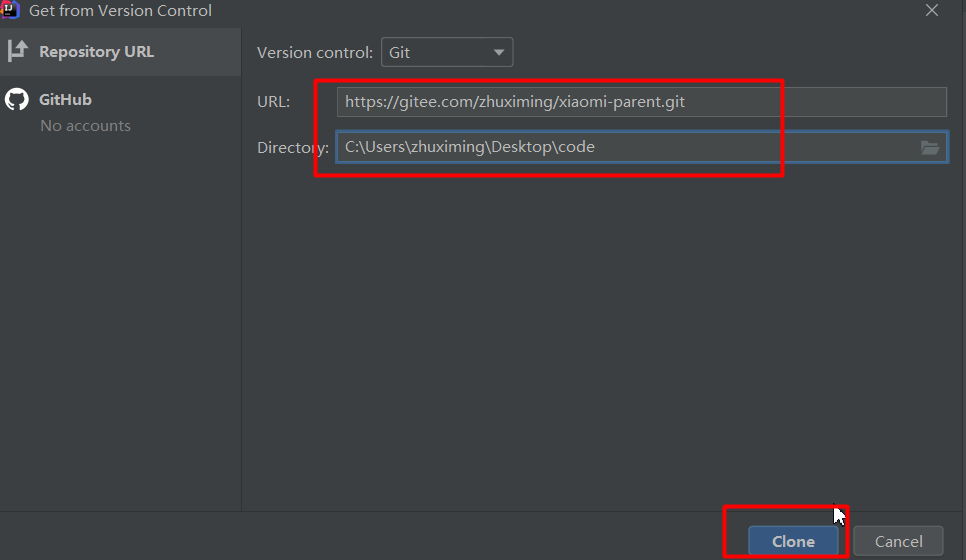


#### 7.6：协同开发

A commit and push , B pull

#### 7.7：冲突演示和解决

A commit and push , B 没有 pull ,在 旧版本上修改，push的时候发生冲突

解决方案: merge  


#### 7.8分支操作

##### 7.8.0：查看分支

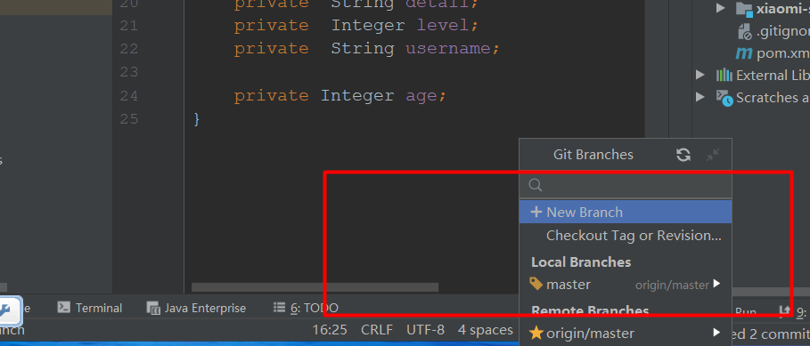

##### 7.8.1：新建分支


##### 7.8.2 上传分支到远程仓库

右键，push即可

##### 7.8.3：分支合并    

先切换到master分支, 光标移到 master1 右键 ----merge into current

##### 7.8.4：合并结果push到远程


第一天上班，怎么用git ？

领导告诉你的，远程仓库git地址 http://xxxxxxx ，账号是zzzz , 密码是xxxxx

1 配置 git插件

2 clone 代码   

3 提交 commit Directory  

4 拉取  pull  


​	
