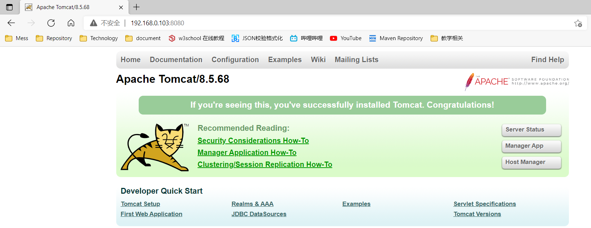

# Linux_软件安装及Java开发环境搭建
**ps -ef | grep tomcat 查看tomcat 是否启动**

## 一、安装JDK

> 在Linux下安装JDK，并配置JAVA_HOME环境变量……
>
> 卸载openjdk
> 1执行  rpm -qa | grep java
> 2把看到的内容依次执行 如：
>
> ​                           rpm -e --nodeps java-1.8.0-openjdk-1.8.0.191.b12-0.el7_5.x86_64
> ​						  rpm -e --nodeps java-1.8.0-openjdk-1.8.0.131-11.b12.el7.x86_64
> ​                          rpm -e --nodeps java-1.8.0-openjdk-headless-1.8.0.131-11.b12.el7.x86_64 
> ​						  rpm -e --nodeps tzdata-java-2017b-1.el7.noarch
> ​						全删
> ​	直到再次执行1，看不到任何内容	

### 1.1、下载JDK的压缩包

> 去官网下载压缩包，由于oracle官网更新，需要登录并同意协议才允许下载
>
> [https://www.oracle.com/java/technologies/javase-jdk8-downloads.html]()

### 1.2、将jdk压缩包拉取到Linux系统中

> 需要使用图形化界面的xftp拖拽到Linux操作系统

### 1.3、将jdk的压缩包解压

> 后期大多软件都安装在/usr/local下，直接使用tar解压

```sh
# 在/usr/local/新建目录jdk
$ mkdir jdk
# 解压到新建的jdk目录
$ tar -zxvf jdk-8u281-linux-x64.tar.gz -C /usr/local/jdk
```

### 1.4、配置环境变量

> Linux提供了两种环境变量的文件
>
> - 第一个是用户级别的环境变量，存放在：~/.bashrc
> - **第二个是系统级别的环境变量，存放在：/etc/profile**
>
> 修改哪个文件都可以（建议采用第二种方式），毕竟虚拟机就我们自己使用

```sh
# 编辑/etc/profile
$ vim /etc/profile
# 在环境变量文件中，添加如下内容     不要直接复制版本，版本可能不同
export JAVA_HOME=/usr/local/jdk/jdk1.8.0_144
export PATH=$JAVA_HOME/bin:$PATH
# 重新加载环境变量文件
$ source /etc/profile
# 最终测试
$ java -version
javac 1.8.0_144
$ javac -version
java version "1.8.0_144"
Java(TM) SE Runtime Environment (build 1.8.0_144-b09)
Java HotSpot(TM) 64-Bit Server VM (build 25.144-b09, mixed mode)
```

## 二、安装Tomcat

> 在Linux下安装Tomcat，以便部署工程到Linux操作系统

### 2.1、下载Tomcat的压缩包

> Tomcat8.x下载地址：https://tomcat.apache.org/download-80.cgi

### 2.2、解压压缩包

> 一样解压到/usr/local目录下

```sh
# 在/usr/local/新建目录tomcat
$ mkdir tomcat
# 解压到新建的tomcat目录
tar -zxvf apache-tomcat-8.5.68.tar.gz -C /usr/local/tomcat/
```

### 2.3、启动Tomcat并监听日志

> 通过./执行可运行文件，并使用tail监控日志信息
>
>  ps -ef | grep tomcat 查看tomcat 是否启动

```sh
# 跳转到tomcat的bin目录
cd /usr/local/tomcat/apache-tomcat-8.5.68/bin
# 启动
./startup.sh
# 监控日志
cd ../logs
tail -f catalina.out
# 启动成功如下，看到xxx ms就是成功了
23-Jun-2021 06:08:07.620 INFO [localhost-startStop-1] org.apache.catalina.startup.HostConfig.deployDirectory Deployment of web application directory [/usr/local/tomcat/apache-tomcat-8.5.68/webapps/manager] has finished in [18] ms
23-Jun-2021 06:08:07.623 INFO [main] org.apache.coyote.AbstractProtocol.start Starting ProtocolHandler ["http-nio-8080"]
23-Jun-2021 06:08:07.636 INFO [main] org.apache.catalina.startup.Catalina.start Server startup in 541 ms
```

### 2.4、关闭防火墙并访问tomcat

> 由于Linux防火墙的限制限制我们还不能访问Linux中的Tomcat

```sh
# 关闭防火墙
$ systemctl stop firewalld
# 禁止firewall开机启动
$ systemctl disable firewalld
```

> 在Windows浏览器地址栏输入`http://Linux虚拟机的IP地址:8080`，能够看到如下页面，证明tomcat配置成功



## 三、安装MySQL

> 在MySQL下用yum的方式安装MySQL

### 3.1、准备工作

先在/usr/local下新建mysql目录，cd到这个目录下，再执行以下命令

```sh
# 查看系统自带的Mariadb 
$ rpm -qa | grep mariadb
# 卸载系统自带的Mariadb
$ rpm -e --nodeps 刚才查询到的mariadb版本信息
# 关闭防火墙
$ systemctl stop firewalld.service
# 禁止firewall开机启动
$ systemctl disable firewalld.service 
```

### 3.2、安装MySQL的YUM存储库 

> 使用wget下载即可，不过需要先下载wget，再通过wget下载rpm包

```sh
# 首先通过yum下载wget命令
$ yum -y install wget
# 通过wget下载MySQL存储库 z
$ wget https://dev.mysql.com/get/mysql57-community-release-el7-11.noarch.rpm
      #https://dev.mysql.com/get/mysql80-community-release-el7-7.noarch.rpm     8.0版本
```

### 3.3、安装下载好的rpm包

> 使用rpm包的命令直接安装

```sh
# 安装Yum Repository
$ yum localinstall mysql57-community-release-el7-11.noarch.rpm
# 检查 mysql 源是否安装成功
$ yum repolist enabled | grep "mysql.*-community.*"
```

### 3.4、安装MySQL服务器

> 开始安装，这一步需要下载一段时间

```sh
$ yum -y install mysql-community-server --nogpgcheck
```

### 3.5、启动MySQL服务，并连接

> 安装成功后，手动启动，并使用日志中的密码登陆，而且第一个操作必须是修改密码，才可后续正常操作

```sh
# 启动MySQL服务
$ systemctl start mysqld
# 查看MySQL运行状态，如果显示running说明运行成功
$ systemctl status mysqld   (running dead)
# 查看初始化密码
$ grep 'temporary password' /var/log/mysqld.log
# 连接MySQL服务，使用初始化密码登录
$ mysql -u root -p
Enter password:刚才查询到的密码
# 修改密码校验策略
$ mysql> set global validate_password_policy=0;
# 修改密码最小长度
$ mysql> set global validate_password_length=4;
# 如果没有进行上面两个设置，修改密码，要求密码，必须携带大写字母，小写字母，数字，特殊符号
$ mysql> ALTER USER 'root'@'localhost' IDENTIFIED BY 'root';
```

### 3.6、开启远程连接

> 默认MySQL禁止远程链接，需要单独创建一个用户开启远程链接，这样就可以在windows下使用图形化工具连接

```sh
# 任何库和表使用root用户在任意主机上都可以访问
$ mysql> GRANT ALL PRIVILEGES ON *.* TO 'root'@'%' IDENTIFIED BY 'root' WITH GRANT OPTION;
$ mysql> FLUSH PRIVILEGES;
```

### 3.7、MySQL字符编码设置

> 客户端提供MYSQL的环境，但是不支持中文,通过以下命令可以查看mysql的字符集

```sh
# 查看mysql的字符集
$ mysql> show variables like 'character_set%';
+--------------------------+----------------------------+
| Variable_name            | Value                      |
+--------------------------+----------------------------+
| character_set_client     | utf8                       |
| character_set_connection | utf8                       |
| character_set_database   | latin1                     |
| character_set_filesystem | binary                     |
| character_set_results    | utf8                       |
| character_set_server     | latin1                     |
| character_set_system     | utf8                       |
| character_sets_dir       | /usr/share/mysql/charsets/ |
+--------------------------+----------------------------+
8 rows in set (0.01 sec)
```

> 为了让 MySQL支持中文，需要把字符集改成UTF-8

```sh
$ vim /etc/my.cnf
```

> 将文件内容修改如下

```properties
[client]
port=3306
socket=/var/lib/mysql/mysql.sock
default-character-set=utf8mb4

[mysqld]
datadir=/var/lib/mysql
socket=/var/lib/mysql/mysql.sock
user=mysql

symbolic-links=0
character-set-server=utf8mb4

[mysql]
no-auto-rehash
default-character-set=utf8mb4

[mysqld_safe]
log-error=/var/log/mysqld.log
pid-file=/var/run/mysqld/mysqld.pid
```

> 重启mysql服务

```sh
$ systemctl restart mysqld
```

> 登录mysql，重新查看数据库编码

```sh
$ mysql> show variables like 'character_set%';
+--------------------------+----------------------------+
| Variable_name            | Value                      |
+--------------------------+----------------------------+
| character_set_client     | utf8mb4                    |
| character_set_connection | utf8mb4                    |
| character_set_database   | utf8mb4                    |
| character_set_filesystem | binary                     |
| character_set_results    | utf8mb4                    |
| character_set_server     | utf8mb4                    |
| character_set_system     | utf8                       |
| character_sets_dir       | /usr/share/mysql/charsets/ |
+--------------------------+----------------------------+
8 rows in set (0.01 sec)
```

### 3.8、使用Windows下的客户端工具连接MySQL

> 在Navicat或SQLyog中输入用户名和密码连接MySQL。

## 四、部署SSM工程

 如果要想让发布之后的项目的访问路径为/，把war的名字设置为ROOT

> 部署项目到Linux中需要注意一下内容：
>
> - **项目要保证在Windows下是没有问题的，再考虑部署到Linux。**
> - 将开发环境中的内容更改为测试环境。
>    - 连接数据库的信息。
>    - 存放文件的路径。
>    - 日志文件存放的位置。
>    - 项目路径问题。
> - 将Maven项目打包。
> - 根据项目路径的不同，将项目部署到Tomcat中。
> - 在部署到Linux操作系统中后，一定要查看日志。

