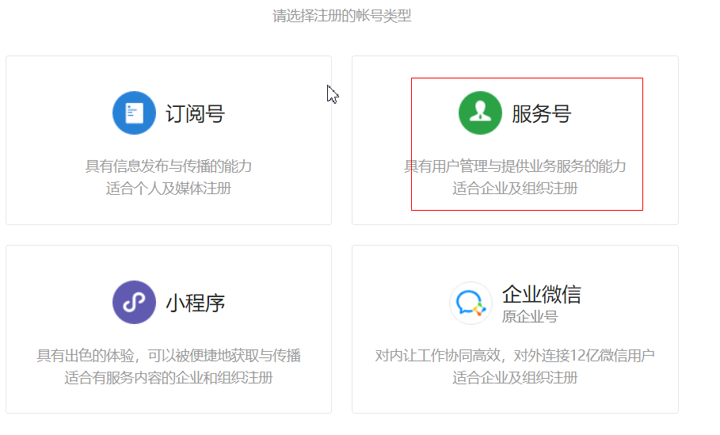
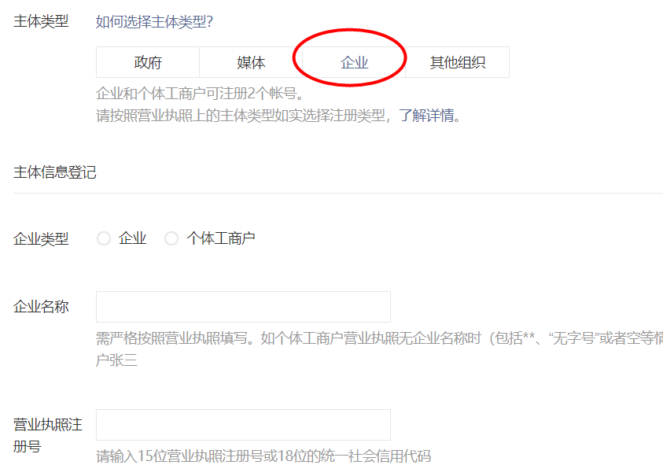

# 微信支付

# 一：微信支付简介

## 1.1：微信支付申请

**第一步：注册公众号（类型须为：服务号）**

注册地址：https://mp.weixin.qq.com/cgi-bin/registermidpage?action=index&lang=zh_CN&token=




**第二步：认证公众号**

> 公众号认证后才可申请微信支付，认证费：300元/次。




**第三步：提交资料申请微信支付**

```txt
登录公众平台，点击左侧菜单【微信支付】，开始填写资料等待审核，审核时间为1-5个
工作日内。
```


**第四步：开户成功，登录商户平台进行验证**

```txt
资料审核通过后，请登录联系人邮箱查收商户号和密码，并登录商户平台填写财付通备
付金打的小额资金数额，完成账户验证。


```

**第五步：在线签署协议**

```txt
本协议为线上电子协议，签署后方可进行交易及资金结算，签署完立即生效。
```

**第六步：申请成功获取秘钥**

```txt
千锋
- 商户编号mch_id：1497984412
- 商户账号AppID：wx632c8f211f8122c6
- 商户Key：sbNCm1JnevqI36LrEaxFwcaT0hkGxFnC
```


## 1.2： 微信支付开发文档

在线微信支付开发文档：https://pay.weixin.qq.com/wiki/doc/api/index.html


## 1.3：调用统一下单接口  (支付订单)

第一步：pom依赖

```xml
<dependency>
    <groupId>com.github.tedzhdz</groupId>
    <artifactId>wxpay-sdk</artifactId>
    <version>3.0.10</version>
</dependency>
<dependency>
    <groupId>commons-logging</groupId>
    <artifactId>commons-logging</artifactId>
    <version>1.2</version>
</dependency>
```


第二步：微信配置

```java
package com.freemarker.demo;

import com.github.wxpay.sdk.IWXPayDomain;
import com.github.wxpay.sdk.WXPayConfig;

import java.io.InputStream;

public class WXConfig extends WXPayConfig {

    public String getAppID() {
        return "wx632c8f211f8122c6";
    }

    public String getMchID() {
        return "1497984412";
    }

    public String getKey() {
        return "sbNCm1JnevqI36LrEaxFwcaT0hkGxFnC";
    }

    public InputStream getCertStream() {
        return null;
    }

    public IWXPayDomain getWXPayDomain() {
        return new IWXPayDomain() {
            public void report(String s, long l, Exception e) {

            }

            public DomainInfo getDomain(WXPayConfig wxPayConfig) {
                return new DomainInfo("api.mch.weixin.qq.com",true);
            }
        };
    }
}              
```


第三步：测试统一下单接口

```txt
步骤：
1:构建配置对象
2:封装请求参数
3:map转xml
4:发送请求WXPayRequest request = new WXPayRequest(config);
5:响应结果转map集合
6:获取支付地址
```


```java

        //测试统一下单接口
        //1:构建配置对象
        WXConfig config = new WXConfig();
        //2:封装请求参数   网页静态化技术
        Map params = new HashMap();
        params.put("appid",config.getAppID());
        params.put("mch_id",config.getMchID());
        params.put("nonce_str", WXPayUtil.generateNonceStr());
        params.put("body","锋迷商城订单");
        params.put("out_trade_no","2020121212");  
        params.put("total_fee",1+"");
        params.put("spbill_create_ip","127.0.0.1");
        params.put("notify_url","http://192.168.234.122:8080/notify");
        params.put("trade_type","NATIVE");
        //3:map转xml
        String requestXml = WXPayUtil.generateSignedXml(params, config.getKey());
        //4:发送请求WXPayRequest request = new WXPayRequest(config);
        WXPayRequest request = new WXPayRequest(config);

        String resXML = request.requestWithoutCert("/pay/unifiedorder", UUID.randomUUID().toString(),
            requestXml, false);

        System.out.println(resXML);


        //5:响应XML结果转map集合
        Map<String, String> resMap = WXPayUtil.xmlToMap(resXML);
        //6:获取支付地址
        String code_url = resMap.get("code_url");
        System.out.println(code_url);

```


## 1.4： 二维码插件QRcode.js


```html
<div id="qrcode"></div>


<script>
var qrcode = new QRCode("qrcode", {
    text: "http://www.runoob.com",
    width: 128,
    height: 128,
    colorDark : "#000000",
    colorLight : "#ffffff",
    correctLevel : QRCode.CorrectLevel.H
});
</script> 
```


## 1.5：查询订单状态接口

```txt
步骤：
1:构建配置对象
2:封装请求参数
3:map转xml
4:发送请求WXPayRequest request = new WXPayRequest(config);
5:响应结果转map集合
6:获取支付状态
```


```java
  //1:构建配置对象
        WXConfig config = new WXConfig();
        //2:封装请求参数
        Map params = new HashMap();
        params.put("appid",config.getAppID());
        params.put("mch_id",config.getMchID());
        params.put("out_trade_no","2020121212");
        params.put("nonce_str",WXPayUtil.generateNonceStr());
        //3:map转xml
        String requestXML = WXPayUtil.generateSignedXml(params, config.getKey());
        //4:发送请求WXPayRequest request = new WXPayRequest(config);
        WXPayRequest request = new WXPayRequest(config);
        String resXml = request.requestWithoutCert("/pay/orderquery", UUID.randomUUID().toString(),
            requestXML, false);

        System.out.println(resXml);

        //5:响应结果转map集合
        Map<String, String> resMap = WXPayUtil.xmlToMap(resXml);
        //6:获取支付状态
        System.out.println(resMap.get("trade_state"));
```


## 1.6：关闭订单接口

```txt
步骤：
1:构建配置对象
2:封装请求参数
3:map转xml
4:发送请求WXPayRequest request = new WXPayRequest(config);
5:响应结果转map集合
6:获取关闭结果
```


```java
//1:构建配置对象
WXConfig config = new WXConfig();
//2:封装请求参数
Map params = new HashMap();
params.put("appid",config.getAppID());
params.put("mch_id",config.getMchID());
params.put("out_trade_no", "20201212121");
params.put("nonce_str",WXPayUtil.generateNonceStr());
//3:map转xml
String reqeustXML = WXPayUtil.generateSignedXml(params, config.getKey());
//4:发送请求WXPayRequest request = new WXPayRequest(config);
WXPayRequest request = new WXPayRequest(config);
String resXML = request.requestWithoutCert("/pay/closeorder", UUID.randomUUID().toString(),
                                           reqeustXML, false);
//5:响应结果转map集合
Map<String, String> resMap = WXPayUtil.xmlToMap(resXML);
//6:获取关闭结果
System.out.println(resMap.get("result_code"));
System.out.println(resMap.get("result_msg"));

```


# 二：应用

## 2.1：统一下单

> 调用微信支付系统的统一下单接口，返回支付url，url返回给前端，前端生成支付二维码


```java

    @Autowired
    private OrderClient orderClient;

    @Value("${pay.notify_url}")
    private String notifyUrl;


    @Override
    public Result pay(String orderId) {
       try {
           //查询订单信息
           WxbOrder orderInfo = orderClient.findOrderInfo(orderId);

           //计算总金额
           Integer totalFee = 0;
           for (WxbOrderItems item : orderInfo.getOrderItems()) {
               Integer buyNum = item.getBuyNum();
               String skuPrice = item.getSkuPrice();
               double buyPrice = Double.parseDouble(skuPrice);
               //1  2.88
               int itemPrice = (int)(buyNum*buyPrice*100);
               totalFee +=itemPrice;
           }
           //调用微信的统一下单接口，下单
           String payUrl = weixinPay(orderId, totalFee, notifyUrl);

           Map data = new HashMap();
           data.put("payUrl",payUrl);
           data.put("totalFee",totalFee);
           data.put("orderId",orderId);

           return new Result(true,"下单成功",data);

       }catch (Exception e){
            return  new Result(false,"下单失败");
       }
    }

    private String weixinPay(String orderId,Integer fee,String notifyUrl) throws  Exception{
        //1.构建配置
        MyConfig config = new MyConfig();
        //2.封装请求数据
        Map<String,String> requestParams = new HashMap<String, String>();
        requestParams.put("appid",config.getAppID());
        requestParams.put("mch_id",config.getMchID());
        requestParams.put("nonce_str", WXPayUtil.generateNonceStr());
        requestParams.put("body","微分销");
        requestParams.put("out_trade_no",orderId);//业务系统订单号
        requestParams.put("total_fee",fee+"");//订单金额，单位为分
        requestParams.put("spbill_create_ip","127.0.0.1");
        requestParams.put("notify_url",notifyUrl);
        requestParams.put("trade_type","NATIVE");//扫码支付

        //3.将map转xml串
        String reqeuestParamsXml = WXPayUtil.generateSignedXml(requestParams, config.getKey());

        //4.发请求
        WXPayRequest request = new WXPayRequest(config);
        String resultXml = request.requestWithoutCert("/pay/unifiedorder", UUID.randomUUID().toString(), reqeuestParamsXml, false);
        System.out.println(resultXml);

        //5.将resultXml转map集合
        final Map<String, String> resultMap = WXPayUtil.xmlToMap(resultXml);

        System.out.println(resultMap.get("code_url"));


        return resultMap.get("code_url");

    }
```


#### 二维码插件的使用

```js
//生成支付二维码
var qrcode = new QRCode("qrImage", {
    text: res.data.payUrl,
    width: 256,
    height: 256,
    colorDark : "#000000",
    colorLight : "#ffffff",
    correctLevel : QRCode.CorrectLevel.H
});
```


回调


### 

```java

```


#### 


```xml

```


```java

```


```java


```


#### 

```html

```


#### 

```java

```


```java


```


## 


```java


```


监听延时消息

```java
package com.fengmi.listener;

import com.api.goods.GoodsClient;
import com.fengmi.service.PayService;
import com.fengmi.vo.Result;
import org.apache.rocketmq.spring.annotation.ConsumeMode;
import org.apache.rocketmq.spring.annotation.MessageModel;
import org.apache.rocketmq.spring.annotation.RocketMQMessageListener;
import org.apache.rocketmq.spring.core.RocketMQListener;
import org.springframework.beans.factory.annotation.Autowired;
import org.springframework.stereotype.Component;

@Component
@RocketMQMessageListener(consumerGroup = "fengmi-pay-consumer-group",
    topic = "order-delay",selectorExpression = "order-delay-tag",
    consumeMode = ConsumeMode.CONCURRENTLY,
    messageModel = MessageModel.CLUSTERING)
public class ConsumerListener implements RocketMQListener<String> {

    @Autowired
    private PayService payService;

    @Autowired
    private GoodsClient goodsClient;


    public void onMessage(String orderId) {

        System.out.println(orderId);

        //判断订单的支付状态
        Result result = payService.findOrderStatus(orderId);

        if (result != null && result.getSuccess() && "NOTPAY".equals(result.getData())) {

            //关闭订单
            Result result1 = payService.closeOrder(orderId);
            if("SUCCESS".equals(result1.getData())){
                 //释放库存
                Result result2 = goodsClient.releaseStore(orderId);

            }

        }

    }
}
```


关闭订单

```java
 //关闭订单
    public String  closeOrder(String orderId) throws  Exception{
        //1.构建配置
        MyConfig config = new MyConfig();
        //2.封装请求数据
        Map<String,String> requestParams = new HashMap<String, String>();
        requestParams.put("appid",config.getAppID());
        requestParams.put("mch_id",config.getMchID());
        requestParams.put("out_trade_no",orderId );
        requestParams.put("nonce_str",WXPayUtil.generateNonceStr());
        //3.将map转xml串
        String reqeuestParamsXml = WXPayUtil.generateSignedXml(requestParams, config.getKey());

        //4.发请求
        WXPayRequest request = new WXPayRequest(config);
        String resultXml = request.requestWithoutCert("/pay/closeorder", UUID.randomUUID().toString(), reqeuestParamsXml, false);
        System.out.println(resultXml);

        //5.将resultXml转map集合
        final Map<String, String> resultMap = WXPayUtil.xmlToMap(resultXml);


        return resultMap.get("result_code");

    }

```


