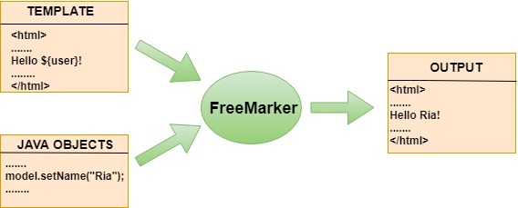
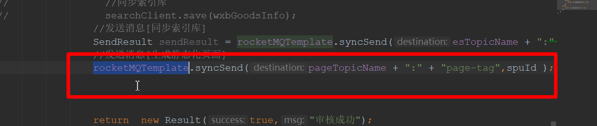
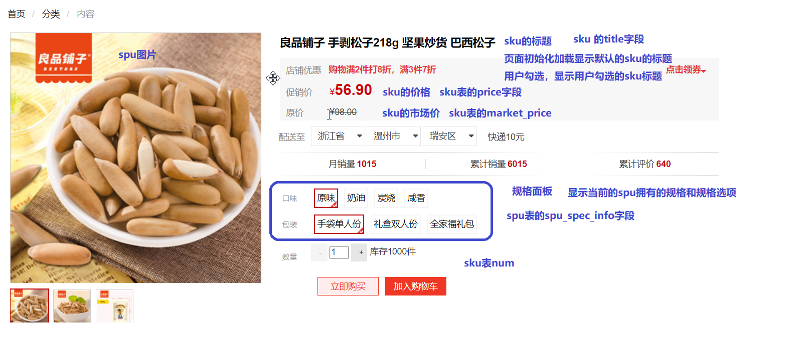

# 网页静态化技术

# 一：网页静态化技术简介

```txt
商品详情页实现方案？
方案一：从数据库中获取数据，然后渲染到前端
弊端：
1：数据库访问压力大
2：数据库效率低（磁盘io），导致商品详情服务不稳定

方案二：使用Redis缓存
弊端：数据量太大，存在Redis的内存瓶颈


方案三： 网页静态化技术
静态化是指把动态生成的HTML页面变为静态内容保存【磁盘】，然后使用nginx作为静态资源的服务器，以后用户的请求到来，直接访问静态页面，不再经过服务的渲染。


```


## 1.1：什么是网页静态化技术

> 静态化是指把动态生成的HTML页面变为静态内容保存【磁盘】，然后使用nginx作为静态资源的服务器，以后用户的请求到来，直接访问静态页面，不再经过服务的渲染。


## 1.2：网页静态化技术优点


1：减轻数据库访问压力

2：空间换时间访问效率更高

3：可以使用nginx作为静态资源服务器，并发量更高

4：静态页面更有利于网站SEO


## 1.3：网页静态化适合场景

1：商品详情页

2：旅游网站详情页

3：新闻详情页


## 1.4：网页静态化技术方案

目前，静态化页面都是通过模板引擎来生成，而后保存到nginx服务器来部署。常用的模板引擎比如：

- Freemarker
- Velocity
- Thymeleaf


# 二：Freemarker静态化技术

## 2.1：什么是Freemarker

> Freemarker是java编写的模板引擎，它可以将模板页面+动态数据渲染成静态html页面




## 2.2：入门demo

第一步：pom依赖

```xml
<dependency>
    <groupId>org.freemarker</groupId>
    <artifactId>freemarker</artifactId>
    <version>2.3.30</version>
</dependency>
```


第二步：代码


生成静态页面思路

```txt
1.构建Configuration对象
2.设置模板文件目录(Directory)
3.设置字符集
4.获取模板对象
5.创建模型数据
6.创建输出流(FileWriter)对象
7.输出
8.关闭
```


```java
  //1.构建Configuration对象
        Configuration configuration = new Configuration(Configuration.getVersion());
        //2.设置模板文件目录(Directory)
        configuration.setDirectoryForTemplateLoading(new File("D:\\JAVAEE-2201班\\门户系统微服务架构代码\\wfx-parent\\study-freemarker\\src\\main\\resources"));
        //3.设置字符集
        configuration.setDefaultEncoding("utf-8");
        //4.获取模板对象
        Template template = configuration.getTemplate("demo.ftl");
        //5.创建模型数据
        Map data = new HashMap(){{
            put("name","张三丰");
        }};
        //6.创建输出流(Writer)对象
        Writer out = new FileWriter("e:\\demo.html");
        //7.输出
        template.process(data,out);
        //8.关闭
        out.close();
```


## 2.3：Freemarker常用指令

模板页语法识别命名空间  xmlns="http://www.w3.org/1999/xhtml"

指令学习手册：http://freemarker.foofun.cn/ref_directive_if.html


if指令

```html
<#if goodsPrice gt 99 >
    <p>太贵了 买不起!!</p>
</#if>
```


for循环

```html
<#list goodsList as goods>
    <p>${goods.goodsName}</p>
</#list>
```


内建函数

参考文档：http://freemarker.foofun.cn/ref_directive_if.html

# 三：Springboot整合Freemarker

## 3.1：pom依赖

```xml
<dependency>
    <groupId>org.springframework.boot</groupId>
    <artifactId>spring-boot-starter-web</artifactId>
</dependency>

<!--freemarker-->
<dependency>
    <groupId>org.springframework.boot</groupId>
    <artifactId>spring-boot-starter-freemarker</artifactId>
</dependency>

<dependency>
    <groupId>org.springframework.boot</groupId>
    <artifactId>spring-boot-starter-test</artifactId>
</dependency>

```


## 3.2：配置

```
#指定模板文件的目录
spring.freemarker.template-loader-path=classpath:/templates/
#在freemarker中的空值的处理，默认情况以${xxx}的方式取值会报错，我们一般都采用${xxx?if_exists} 的方式去处理，烦死人了。经过查资料，很多人都建议使用classic_compatible=true的方式来处理
spring.freemarker.settings.classic_compatible = true

```


## 3.3：测试

```java

import freemarker.template.Configuration;
import freemarker.template.Template;
import org.junit.Test;
import org.junit.runner.RunWith;
import org.springframework.beans.factory.annotation.Autowired;
import org.springframework.boot.test.context.SpringBootTest;
import org.springframework.test.context.junit4.SpringRunner;
import org.springframework.web.servlet.view.freemarker.FreeMarkerConfig;

import java.io.FileWriter;
import java.io.Writer;
import java.util.ArrayList;
import java.util.HashMap;
import java.util.List;
import java.util.Map;

/**
 * <p>title: com.qf</p>
 * author zhuximing
 * description:
 */
@SpringBootTest
@RunWith(SpringRunner.class)
public class FreemarkerTest {

    @Autowired
    private FreeMarkerConfig freeMarkerConfig;

    
    @Test
    public void test1 ()throws  Exception{

        Configuration configuration = freeMarkerConfig.getConfiguration();

        //1.获取模板对象
        Template template = configuration.getTemplate("demo.ftl");
        //2.创建模型数据
        Student jack = new Student(12, "jack");
        Student rose = new Student(12, "rose");
        Student maoden = new Student(120, "毛邓");

        List stus = new ArrayList(){{
            add(jack);
            add(rose);
            add(maoden);
        }};

        Map data = new HashMap(){{
            put("age",19);
            put("stus",stus);
        }};

        //3.创建输出流(Writer)对象
        Writer out = new FileWriter("e:\\demo1.html");
        //7.输出
        template.process(data,out);
        //8.关闭
        out.close();


    }
}
```


# 四：商品详情页静态化实现


## 4.1：实现思路【流程】


## 4.2：商品审核发送消息




## 4.3：搭建静态化微服务

pom依赖

```xml
 <dependency>
            <groupId>org.springframework.boot</groupId>
            <artifactId>spring-boot-starter-web</artifactId>
        </dependency>
        <!--端点监控、暴露了一些http接口，可以让注册中心监控本服务的健康状态-->
        <dependency>
            <groupId>org.springframework.boot</groupId>
            <artifactId>spring-boot-starter-actuator</artifactId>
        </dependency>
        <!--nacos服务注册与发现场景依赖-->
        <dependency>
            <groupId>com.alibaba.cloud</groupId>
            <artifactId>spring-cloud-starter-alibaba-nacos-discovery</artifactId>
        </dependency>
        <dependency>
            <groupId>com.wfx</groupId>
            <artifactId>wfx-entity</artifactId>
            <version>1.0-SNAPSHOT</version>
        </dependency>
        <dependency>
            <groupId>com.wfx</groupId>
            <artifactId>wfx-api</artifactId>
            <version>1.0-SNAPSHOT</version>
        </dependency>
        <dependency>
            <groupId>org.apache.rocketmq</groupId>
            <artifactId>rocketmq-spring-boot-starter</artifactId>
            <!--2.1.0对应的mq是4.6.x-->
            <version>2.1.0</version>
        </dependency>

        <!--freemarker-->
        <dependency>
            <groupId>org.springframework.boot</groupId>
            <artifactId>spring-boot-starter-freemarker</artifactId>
        </dependency>
```


配置信息

```properties
#服务注册与发现
server.port=8203
spring.application.name=wfx-page
spring.cloud.nacos.server-addr=localhost:8848
spring.cloud.nacos.discovery.namespace=sit
spring.cloud.nacos.discovery.group=DEFAULT_GROUP

#mq的配置
#指定nameServer
rocketmq.name-server=127.0.0.1:9876

#freemarker的配置
#指定模板文件的目录
spring.freemarker.template-loader-path=classpath:/templates/
#在freemarker中的空值的处理，默认情况以${xxx}的方式取值会报错，我们一般都采用${xxx?if_exists} 的方式去处理，烦死人了。经过查资料，很多人都建议使用classic_compatible=true的方式来处理
spring.freemarker.settings.classic_compatible = true
```


监听器

```java
package com.wfx.listener;

import com.wfx.entity.WxbGoods;
import freemarker.template.Configuration;
import freemarker.template.Template;
import org.apache.rocketmq.spring.annotation.ConsumeMode;
import org.apache.rocketmq.spring.annotation.MessageModel;
import org.apache.rocketmq.spring.annotation.RocketMQMessageListener;
import org.apache.rocketmq.spring.core.RocketMQListener;
import org.springframework.beans.factory.annotation.Autowired;
import org.springframework.stereotype.Service;
import org.springframework.web.servlet.view.freemarker.FreeMarkerConfig;

import java.io.FileWriter;
import java.io.Writer;
import java.util.HashMap;
import java.util.Map;

@Service
@RocketMQMessageListener(consumerGroup = "wfx-page-consumer",
    topic = "goods-2-page",selectorExpression = "page-tag",
    consumeMode = ConsumeMode.CONCURRENTLY,
    messageModel = MessageModel.BROADCASTING)
public class PageListener implements RocketMQListener<String> {

    @Autowired
    private FreeMarkerConfig freeMarkerConfig;


    public void onMessage(String spuId) {


        try {
            //生成静态化页面
            Configuration configuration = freeMarkerConfig.getConfiguration();
            Template template = configuration.getTemplate("introduction.ftl");

            Map data = new HashMap();

            //创建输出流(Writer)对象
            Writer out = new FileWriter("E:\\nginx-1.18.0\\nginx-1.18.0\\goods-page\\1.html");
            //输出
            template.process(data,out);
            //关闭
            out.close();


        }catch (Exception e){

        }


    }


}
```


## 4.4：生成静态化页面

### 4.5.0：nginx代理静态化页面

```json
   server {
        listen       80;
        server_name  item.wfx.com;
        location / {
            root   goods-page;
            index  index.html index.htm;
        }
      
    }

```





### 4.5.1：显示规格面板

> spu（fengmi-goods）  spu_spec_info
>
> [{"name":"口味","opts":["原味","咸香"]},{"name":"包装","opts":["情侣装","全家福"]}]


### 4.5.2：规格面板选择


```js
chosespec(spec,opt){
    this.chooseSpecInfo[spec] = opt	;
}
```


生成sku列表变量

```js
<script>
		var skuInfos=[
				<#list skus as sku>
					    {
					   id:"${sku.skuId?c}",
					   title:"${sku.skuTitle}",
					   price:${sku.skuPrice?c},
					   spec:${sku.skuSpec},
					   marketPrice:${sku.skuMarketPrice?c},
					   num:${sku.skuStock?c}
				   },

				</#list>
		]


</script>

```


### 4.5.3：动态展示sku信息


```js
//判断两个json对象是否完全相等
matchJsonObj(json1,json2){
    if(Object.keys(json1).length != Object.keys(json2).length){
       	return false;
     }
    
    for(var k in json1){
        if(json1[k] != json2[k]){
           return false;
        }
    }
    return true;
}
```


