<LockArticle :highHeightPercent="0.1"/>


# ELK搭建(Docker版本)

## 1、安装Docker

### 1.1、确定Linux版本

新版本的Docker对Linux系统版本有一定的要求。如果Linux的发行版系统是centOS，安装最新版的docker需要centOS 7以上的系统。

* 在Docker安装帮助页面查看支持的系统版本。

> Docker帮助页面:https://docs.docker.com/engine/install/centos/


* 打开terminal，输入cat /etc/os-release查看系统信息。

* 确保自己的系统满足安装要求。

```yml
[root@myfirstECS-linux ~]# cat /etc/os-release
NAME="CentOS Stream"
VERSION="8"
ID="centos"
ID_LIKE="rhel fedora"
VERSION_ID="8"
PLATFORM_ID="platform:el8"
PRETTY_NAME="CentOS Stream 8"
ANSI_COLOR="0;31"
CPE_NAME="cpe:/o:centos:centos:8"
HOME_URL="https://centos.org/"
BUG_REPORT_URL="https://bugzilla.redhat.com/"
REDHAT_SUPPORT_PRODUCT="Red Hat Enterprise Linux 8"
REDHAT_SUPPORT_PRODUCT_VERSION="CentOS Stream"

```


### 1.2、安装Docker

官网提供的软件源速度比较慢，这里使用阿里云的软件源。

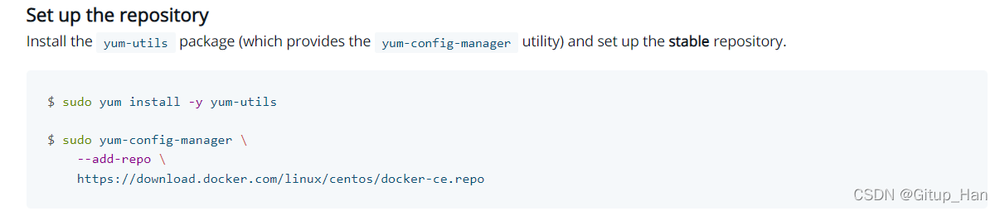

* step 1: 安装必要的一些系统工具

```
sudo yum install -y yum-utils device-mapper-persistent-data lvm2
```


* Step 2: 添加软件源信息

```
sudo yum-config-manager --add-repo http://mirrors.aliyun.com/docker-ce/linux/centos/docker-ce.repo
```


* Step 3: 更新yum索引列表并安装Docker引擎

```
sudo yum makecache fast
```

yum索引列表没有更新可以直接使用yum makecache

```
sudo yum install docker-ce
```

安装过程中会提示确认，输入y以确认。

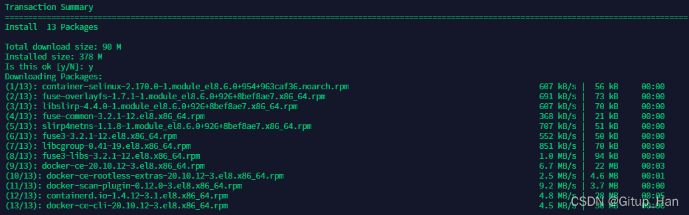

- Step 4: 开启Docker服务

  ```
  sudo service docker start
  ```


### 1.3、测试是否安装成功

在Terminal中输入`docker version`，安装成功会提示以下信息。

```
[root@myfirstECS-linux ~]# docker version
Client: Docker Engine - Community
 Version:           20.10.12
 API version:       1.41
 Go version:        go1.16.12
 Git commit:        e91ed57
 Built:             Mon Dec 13 11:45:22 2021
 OS/Arch:           linux/amd64
 Context:           default
 Experimental:      true

Server: Docker Engine - Community
 Engine:
  Version:          20.10.12
  API version:      1.41 (minimum version 1.12)
  Go version:       go1.16.12
  Git commit:       459d0df
  Built:            Mon Dec 13 11:43:44 2021
  OS/Arch:          linux/amd64
  Experimental:     false
 containerd:
  Version:          1.4.12
  GitCommit:        7b11cfaabd73bb80907dd23182b9347b4245eb5d
 runc:
  Version:          1.0.2
  GitCommit:        v1.0.2-0-g52b36a2
 docker-init:
  Version:          0.19.0
  GitCommit:        de40ad0

```


### 1.4、配置下载Docker镜像的仓库

docker的默认仓库Docker Hub下载速度在国内是很慢的，需要我们替换为阿里云的仓库。

* 打开阿里云的官网，搜索**容器**，找到**容器与镜像服务**。

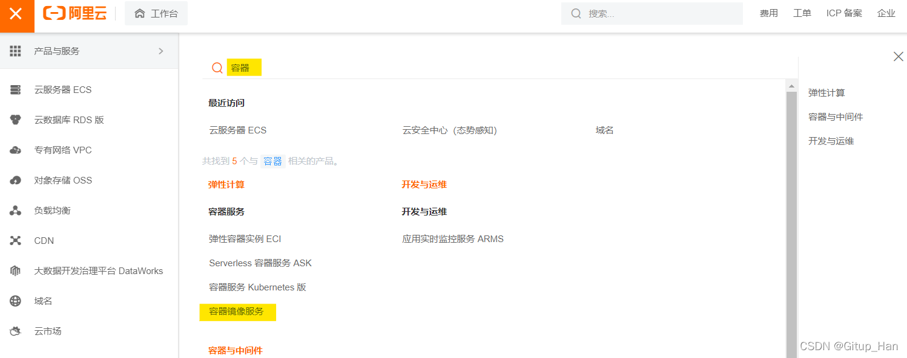


* 进入**容器与镜像服务**页面，点击**镜像加速器**。

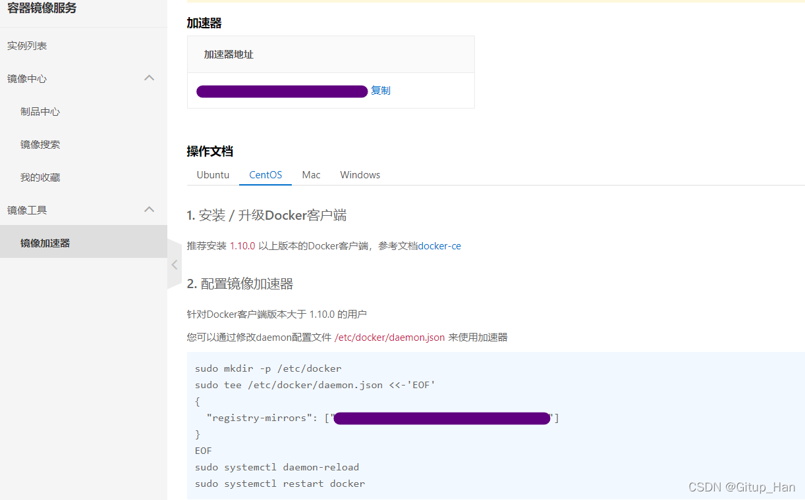


* 依据页面的提示，在Terminal中输入以下指令：

这里注意registry-mirrors的地址每个人都是不一样的，要查看页面上显示的地址。

```
sudo mkdir -p /etc/docker

sudo tee /etc/docker/daemon.json <<-'EOF'
{
"registry-mirrors": ["https://xxxxxx.mirror.aliyuncs.com"]
}
EOF

sudo systemctl daemon-reload

sudo systemctl restart docker
```

### 1.5、测试HelloWorld镜像

在Terminal中输入`docker run hello-world`

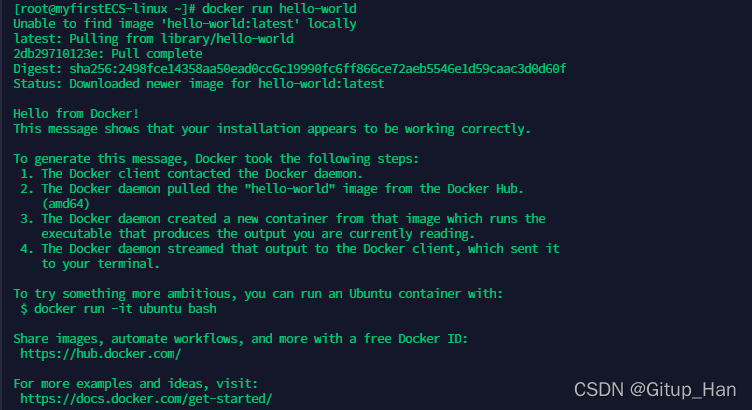

看到 `Hello from Docker！` 字段说明我们的安装步骤没有问题，Docker已经成功安装~


## 2、Docker 安装 Elasticsearch

官网镜像地址：https://hub.docker.com/_/elasticsearch

### 2.1、下载镜像 查看镜像

```
docker pull logstash:7.9.3

docker images
```


### 2.2、在工作目录建立一个 Docker 目录 并在里面创建了 logstash 目录，用来存放所有配置


### 2.3、创建自定义的网络(用于连接到连接到同一网络的其他服务(例如Kibana))

```
docker network create somenetwork
```

### 2.4、运行 elasticsearch
```
docker run -d --name elasticsearch --net somenetwork -p 9200:9200 -p 9300:9300 -e "discovery.type=single-node" elasticsearch:7.9.3
```

### 2.5、查看容器状态
```
docker ps
```


### 2.6、 检测 elasticsearch 是否启动成功

```
curl 127.0.0.1:9200
```

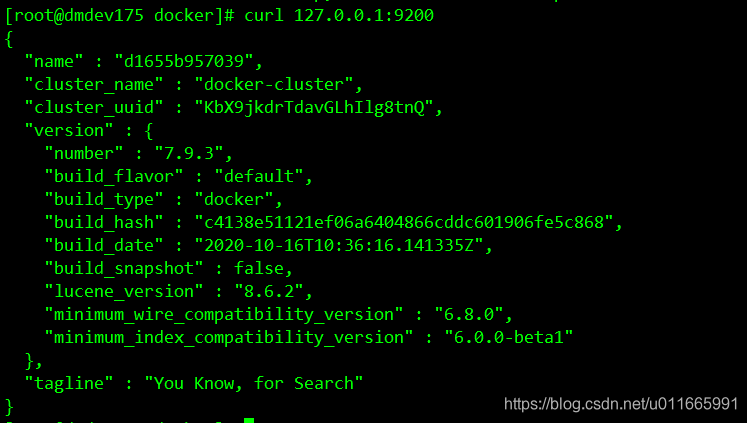


### 2.7、Elasticsearch 安装启动完成


## 3、Docker 安装 Kibana

官网镜像地址：https://hub.docker.com/_/kibana

使用和 elasticsearch 相同版本镜像 7.9.3 （不一样可能会出现问题）

### 3.1、下载镜像 查看镜像

```
docker pull kibana:7.9.3

docker images
```

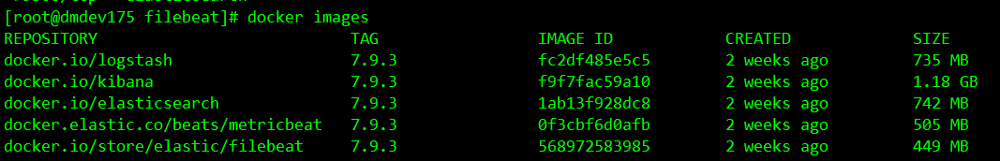

注意:在本例中，Kibana使用默认配置，并希望连接到正在运行的Elasticsearch实例http://localhost:9200 (建议将localhost替换为本机IP)

### 3.2、运行 kibana
```
docker run -d --name kibana --net somenetwork -p 5601:5601 kibana:7.9.3
```


### 3.3、查看容器启动状态
```
docker ps
```

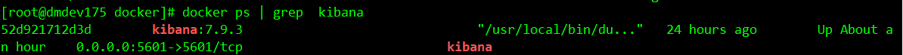

访问 http://服务器IP:5601 （启动可能会较慢，如失败等几秒再尝试刷新一下）

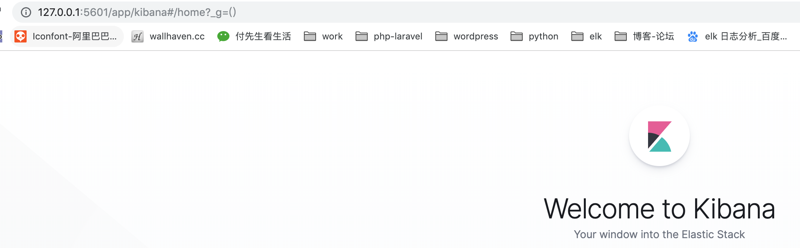


### 3.4、Kibana 安装启动完成

```
PS：默认 kibana的界面是英文，设置过程也比较简单：

 修改kibana的配置文件（config/kibana.yml），在最下方将原先的

 i18n.locale: "en" 改为 i18n.locale: "zh-CN"

 设置好后重启kibana的docker。
```

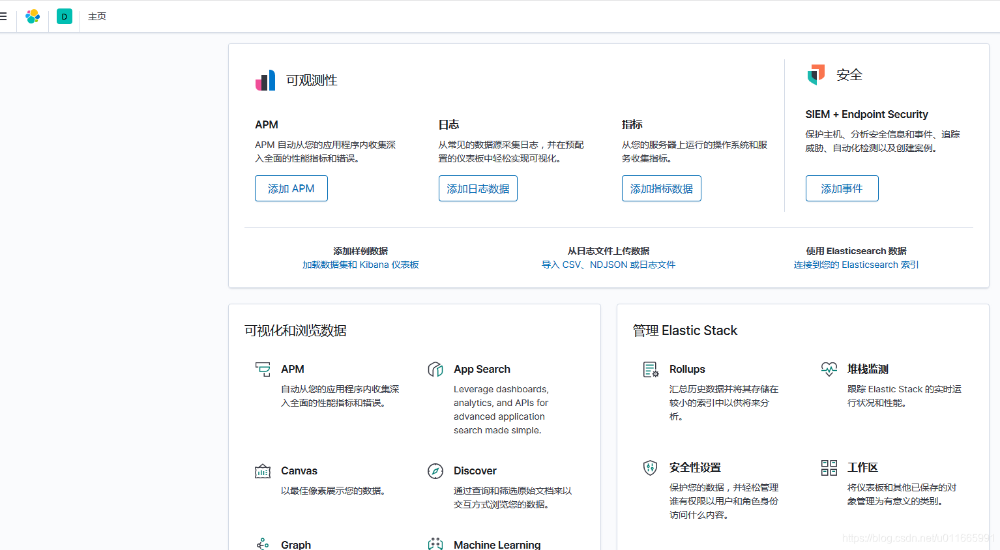


## 4、Docker 安装 Logstash

官网镜像地址：https://hub.docker.com/_/logstash

使用同版本镜像 7.9.3

### 4.1、下载镜像 查看镜像

```
docker pull logstash:7.9.3

docker images
```

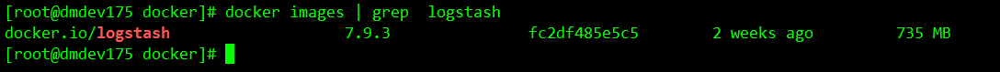

### 4.2、在工作目录建立一个 docker 目录 并在里面创建了 logstash 目录，用来存放所有配置

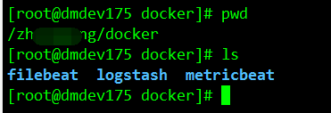

### 4.3、里面放了 logstash 的配置文件

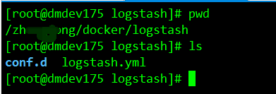

### 4.4、logstash.yml (文件内容)

```
path.config: /docker/logstash/conf.d/*.conf
path.logs: /dokcer/log/logstash
pipeline.ordered: auto
```

### 4.5、conf.d/test.conf (文件内容)

```
input {
   gelf {
    port => 9200
  }
}
output {
  stdout{codec =>rubydebug}
  elasticsearch {
    hosts => ["192.168.197.161:9200"]
    index => "logstash-log4j2-%{+YYYY.MM.dd}"
#    user => "elastic"
#    password => "elastic"
  }
}
```

### 4.6、启动 Logstash

```
docker run -it -d -p 5044:5044 --name logstash --privileged=true  --net somenetwork -v /docker/logstash/logstash.yml:/usr/share/logstash/config/logstash.yml -v /docker/logstash/conf.d/:/usr/share/logstash/conf.d/ logstash:7.9.3 bash
```

### 4.7、查看容器运行状态

```
docker ps
```

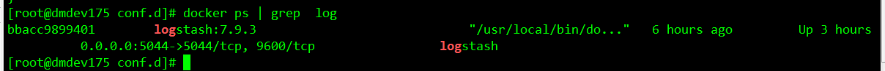

### 4.8、启动成功

> **PS:**此处有个注意点，启动会提示找不到 **/usr/share/logstash/config/logstash.yml** 文件，注意需要添加-**-privileged=true**参数

## 5、Docker 安装Metricbeat

官网镜像地址：https://hub.docker.com/_/metricbeat

使用同版本镜像 7.9.3

### 5.1、下载镜像 查看镜像

```
docker pull docker.elastic.co/beats/metricbeat:7.9.3

docker images
```

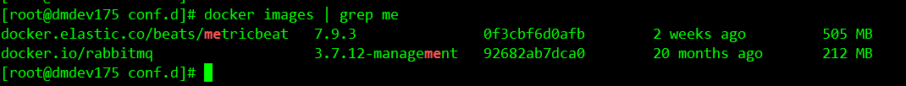

### 5.2、下载默认官方配置文件 (暂时在当前目录创建一个 filebeat 目录 用来放 filebeat 配置文件)

```
curl -L -O https://raw.githubusercontent.com/elastic/beats/7.9/deploy/docker/metricbeat.docker.yml
```

```
PS: 这里有时这个配置文件下载不下来，这里提供下配置文件内容

vim metricbeat.docker.yml
```

```
metricbeat.modules:
- module: system
  period: 10s
  metricsets:
    - cpu
    - load
    - memory
    - network
    - process
    - process_summary
    #- core
    #- diskio
    #- socket
  processes: ['.*']
  process.include_top_n:
    by_cpu: 5      # include top 5 processes by CPU
    by_memory: 5   # include top 5 processes by memory
- module: system
  period: 1m
  metricsets:
    - filesystem
    - fsstat
  processors:
  - drop_event.when.regexp:
      system.filesystem.mount_point: '^/(sys|cgroup|proc|dev|etc|host|lib)($|/)'
- module: system
  period: 15m
  metricsets:
    - uptime
 
# 直接发送elasticsearch
output.elasticsearch:
  hosts: ["192.168.197.161:9200"]
 
# 要加载仪表板，可以在metricbeat设置中启用仪表板加载。当仪表板加载被启用时，Metricbeat使用Kibana API来加载样本仪表板。只有当Metricbeat启动时，才会尝试仪表板加载。
# 设置kibana服务地址
setup.kibana.host: "192.168.197.161:5601"
# 加载默认的仪表盘样式
setup.dashboards.enabled: true
# 设置如果存在模板，则不覆盖原有模板
setup.template.overwrite: false
```

### 5.3、启动metricBeat

进入到 **metricbeat.docker.yml** 所在路径，执行如下命令

```
docker run -d --privileged=true  \
 --net somenetwork \
  --name=metricbeat \
  --user=root \
  --volume="$(pwd)/metricbeat.docker.yml:/usr/share/metricbeat/metricbeat.yml:ro" \
  --volume="/var/run/docker.sock:/var/run/docker.sock:ro" \
  --volume="/sys/fs/cgroup:/hostfs/sys/fs/cgroup:ro" \
  --volume="/proc:/hostfs/proc:ro" \
  --volume="/:/hostfs:ro" \
  docker.elastic.co/beats/metricbeat:7.9.3
```

### 5.4、查看容器运行状态

```
docker ps | grep me
```

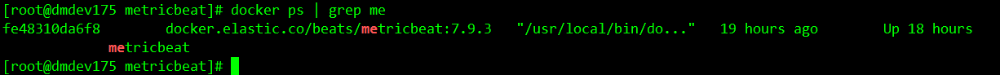

### 5.5、启动成功

- 检查metricbeat是否正常运行

  ```
  curl -XGET ‘http://192.168.100.175:9200/metricbeat-*/_search?pretty’（返回索引对应内容）
  ```

  

- 配置仪表盘


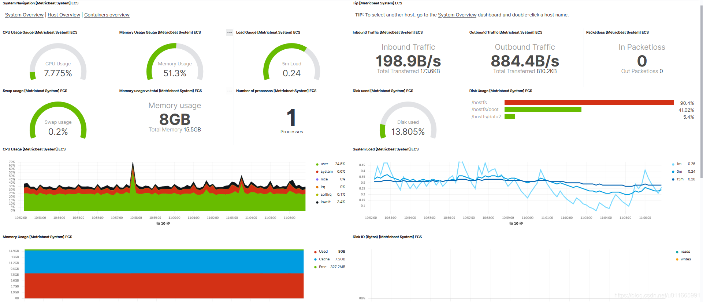


# 6、Docker 安装 Filebeat 

PS: filebeat采集了所在服务的日志情况，单独部署在另外一台服务器上面

官网镜像地址：https://hub.docker.com/_/filebeat

使用同版本镜像 7.9.3

### 6.1、下载镜像 查看镜像

```
docker pull store/elastic/filebeat:7.9.3

docker images
```

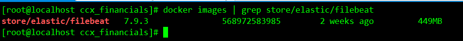

### 6.2、下载默认官方配置文件 (暂时在当前目录创建一个 filebeat 目录 用来放 filebeat 配置文件)

```
curl -L -O https://raw.githubusercontent.com/elastic/beats/7.1/deploy/docker/filebeat.docker.yml
```

打开配置文件 vim filebeat.docker.yml

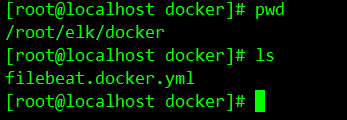

### 6.3、增加下面的配置 (收集 .log 数据 把数据发送到当前网络5044端口 (logstash 端口) )

\# 这个地方的 .log 要保证有几条测试数据

```
filebeat.config:
  modules:
    path: ${path.config}/modules.d/*.yml
    reload.enabled: false
 
filebeat.autodiscover:
  providers:
    - type: docker
      hints.enabled: true
 
processors:
- add_cloud_metadata: ~
 
#output.elasticsearch:
#  hosts: ['192.168.197.161:9200']
#  username: '${ELASTICSEARCH_USERNAME:}'
#  password: '${ELASTICSEARCH_PASSWORD:}'
#
filebeat.inputs:
- type: log
  enabled: true
  paths:
  - /opt/financials/logs/financials.log #项目服务的日志
 
output.logstash:
  hosts: ['192.168.197.161:5044']
```

### 6.4、运行Filebeat

```
docker run 
--name filebeat 
--user=root -d  --volume="/opt/financials/logs/:/var/log/financials/" 
--volume="/root/elk/docker/filebeat.docker.yml:/usr/share/filebeat/filebeat.yml:ro" --volume="/var/lib/docker/containers:/var/lib/docker/containers:ro" 
--volume="/var/run/docker.sock:/var/run/docker.sock:ro" store/elastic/filebeat:7.9.3
```


### 6.5、查看容器启动状态docker ps


### 6.6、启动成功 

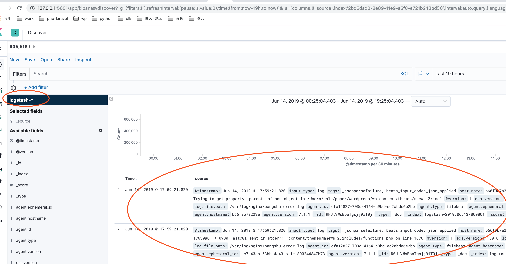


