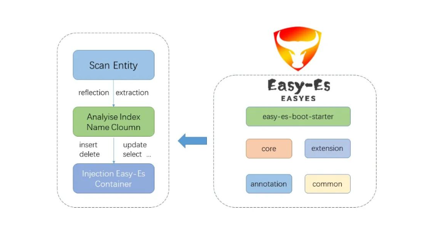
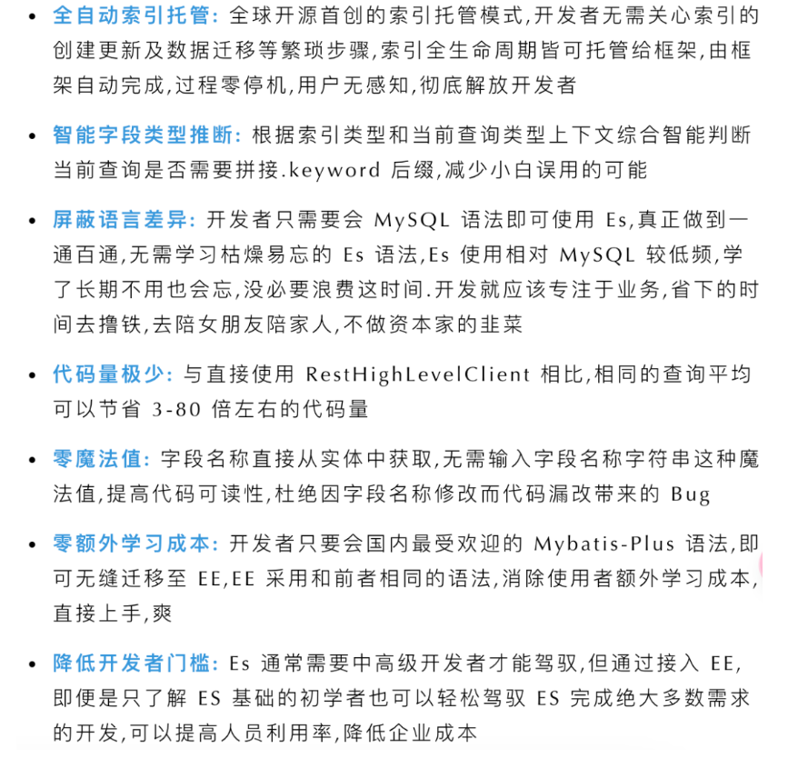

# Easy-Es

Elasticsearch 是一个分布式、高扩展、高实时的搜索与数据分析引擎。其功能的强大无需质疑，但其官方客户端 API 的使用却难倒了众多新手。为了解决使用门槛高的问题，今天给大家推荐一个开源的傻瓜级别的 Elasticsearch 搜索引擎 ORM 开发框架：**Easy-Es**。

## 项目介绍
Easy-Es 是 MyBatis-Plus 同款 ES ORM 框架
Easy-Es（简称 EE）是一款基于 ElasticSearch(简称 Es)官方提供的 `RestHighLevelClient` 打造的 ORM 开发框架，在 `RestHighLevelClient` 的基础上,只做增强不做改变，为简化开发、提高效率而生。

如果您曾经使用过 Mybatis-Plus 的话，那可以很容易就上手 EE，几乎没有学习成本。您可以将 EE 可以看作是 MP 的 ElasticSearch 版本，同时还融入了 Es 特有的功能，帮助您快速实现各种开发场景。

Easy-Es 的适用场景：

- 检索类服务：搜索文库、电商商品检索、海量系统日志检索
- 问答类服务(本质上也是检索类)：在线智能客服、机器人
- 地图类服务：打车 app、外卖 app、社区团购配送、陌生人社交
- ......

Easy-Es 的理念：

- 把简单,易用,方便留给用户,把复杂留给框架
- 让天下没有难用的 Es, 致力于成为全球最受欢迎的 ElasticSearch 搜索引擎开发框架

## 项目架构



## 优势



## 快速入门

如果您用过 Mybatis-Plus 的话,您基本上可以无需多看此文档即可直接上手使用 Easy-Es 是 Mybatis-Plus 在 Elastic Search 的平替版。

推荐您参考这篇Springboot 集成 demo（https://www.easy-es.cn/pages/e12389/）,可帮助您节省您更多时间.


### 引入依赖

Maven:

```xml

<!-- 引入easy-es最新版本的依赖-->
<dependency>
    <groupId>org.dromara.easy-es</groupId>
    <artifactId>easy-es-boot-starter</artifactId>
    <!--这里Latest Version是指最新版本的依赖,比如2.0.0,可以通过下面的图片获取-->
    <version>Latest Version</version>
</dependency>
<!-- 排除springboot中内置的es依赖,以防和easy-es中的依赖冲突-->
<dependency>
    <groupId>org.springframework.boot</groupId>
    <artifactId>spring-boot-starter-web</artifactId>
    <exclusions>
        <exclusion>
            <groupId>org.elasticsearch.client</groupId>
            <artifactId>elasticsearch-rest-high-level-client</artifactId>
        </exclusion>
        <exclusion>
            <groupId>org.elasticsearch</groupId>
            <artifactId>elasticsearch</artifactId>
        </exclusion>
    </exclusions>
</dependency>
<dependency>
    <groupId>org.elasticsearch.client</groupId>
    <artifactId>elasticsearch-rest-high-level-client</artifactId>
    <version>7.14.0</version>
</dependency>
<dependency>
    <groupId>org.elasticsearch</groupId>
    <artifactId>elasticsearch</artifactId>
    <version>7.14.0</version>
</dependency>
```

Gradle:

```xml
compile group: 'org.dromara.easy-es', name: 'easy-es-boot-starter', version: 'Latest Version'
```

### 配置

在 `application.yml` 配置文件中添加 EasyEs 必须的相关配置

```yaml
easy-es:
  enable: true #默认为true,若为false则认为不启用本框架
  address : 127.0.0.1:9200 # es的连接地址,必须含端口 若为集群,则可以用逗号隔开 例如:127.0.0.1:9200,127.0.0.2:9200
  username: elastic #若无 则可省略此行配置
  password: WG7WVmuNMtM4GwNYkyWH #若无 则可省略此行配置
```

在 Spring Boot 启动类中添加 `@EsMapperScan` 注解，扫描 `Mapper` 文件夹：

```java
@SpringBootApplication
@EsMapperScan("com.xpc.easyes.sample.mapper")
public class Application {

    public static void main(String[] args) {
        SpringApplication.run(Application.class, args);
    }

}
```


### 开始使用

现有一张 Document 文档表，随着数据量膨胀,其查询效率已经无法满足产品需求,其表结构如下,我们打算将此表内容迁移至 Es 搜索引擎,提高查询效率。

| id   | title | content |
| :--- | :---- | :------ |
| 主键 | 标题  | 内容    |

1、编写实体类 `Document.java`（此处使用了 Lombok 简化代码）

```java
@Data
@IndexName
public class Document {
    /**
     * es中的唯一id
     */
    private String id;
    /**
     * 文档标题
     */
    private String title;
    /**
     * 文档内容
     */
    private String content;
}

```

2、编写 `Mapper` 类 `DocumentMapper.java`

```java
public interface DocumentMapper extends BaseEsMapper<Document> {
}
```

3、手动创建索引(相当于 MySQL 等数据库中的表),有了索引才能进行后续 CRUD 操作.

```java
 	@Test
    public void testCreateIndex() {
        // 测试创建索引,框架会根据实体类及字段上加的自定义注解一键帮您生成索引 需确保索引托管模式处于manual手动挡(默认处于此模式),若为自动挡则会冲突
        boolean success = documentMapper.createIndex();
        Assertions.assertTrue(success);
    }
```

4、添加测试类，进行 CRUD 测试。

```java
 // 测试新增: 新增一条数据(相当于MySQL中的Insert操作)
    @Test
    public void testInsert() {
        // 测试插入数据
        Document document = new Document();
        document.setTitle("老汉");
        document.setContent("技术过硬");
        int successCount = documentMapper.insert(document);
        System.out.println(successCount);
    }

    // 测试查询:根据条件查询指定数据(相当于MySQL中的Select操作)
    @Test
    public void testSelect() {
        // 测试查询 写法和MP一样 可以用链式,也可以非链式 根据使用习惯灵活选择即可
        String title = "老汉";
        Document document = EsWrappers.lambdaChainQuery(documentMapper)
                 .eq(Document::getTitle, title)
                 .one();
        System.out.println(document);
        Assert.assertEquals(title,document.getTitle());
    }

    // 测试更新:更新数据(相当于MySQL中的Update操作)
    @Test
    public void testUpdate() {
        LambdaEsUpdateWrapper<Document> wrapper = new LambdaEsUpdateWrapper<>();
        wrapper.eq(Document::getTitle,title1);
        Document document2 = new Document();
        document2.setTitle("隔壁老李");
        document2.setContent("技术过软");
        documentMapper.update(document2,wrapper);

        // 关于case2 还有另一种省略实体的简单写法,这里不演示,后面章节有介绍,语法与MP一致
    }

    // 测试删除:删除数据(相当于MySQL中的Delete操作)
    @Test
    public void testDelete() {
        // 测试删除数据 删除有两种情况:根据id删或根据条件删
        // 鉴于根据id删过于简单,这里仅演示根据条件删,以老李的名义删,让老李心理平衡些
        LambdaEsQueryWrapper<Document> wrapper = new LambdaEsQueryWrapper<>();
        String title = "隔壁老李";
        wrapper.eq(Document::getTitle,title);
        int successCount = documentMapper.delete(wrapper);
        System.out.println(successCount);
    }
```

其他复杂使用就不一一展示了，可以直接去官网查看。

## 相关地址

- 项目地址：[https://gitee.com/dromara/easy-es](https://gitee.com/dromara/easy-es)

- 官网：[https://www.easy-es.cn/](https://www.easy-es.cn/)


