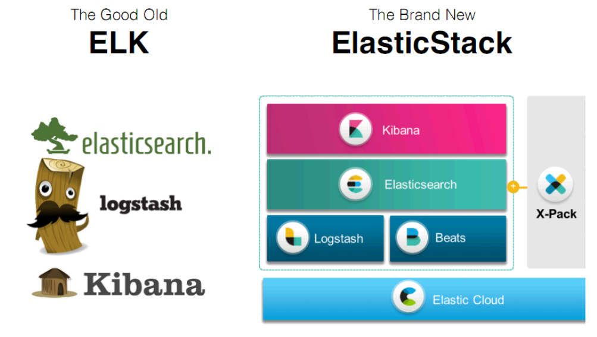

# Elasticsearch
# 一：Elasticsearch简介    

  EcmaScript  : es 

 Elasticsearch ：es

## 1.1：es简介

> [elasticsearch官方网址](https://www.elastic.co/cn/products/elasticsearch)
> [elasticsearch Github地址](https://github.com/elastic/elasticsearch)
>
> ElasticSearch是一个基于Lucene的搜索引擎。它提供了一个分布式多用户能力的全文搜索引擎，基于**RESTful web接口**。Elasticsearch是用Java开发的，并作为Apache许可条款下的开放源码发布，是当前流行的企业级搜索引擎。设计用于云计算中，能够达到实时搜索，稳定，可靠，快速，安装使用方便。
>
> ElasticSearch是非关系型数据库，存储 (json) 和 搜索  
>
> 同类产品  solr


## 1.2：elasticsearch stack




es 存储和搜索 

logstash搜集数据            

kibana 生成图形界面       


# 二：倒排索引

>  **面试题**

​    **ElasticSearch是什么？**

​     **分布式搜索引擎，提供数据存储和搜索的服务**

>  **es 能够实现实时搜索（搜索速度快）原因是？**
>
>  **搜索方式是： 倒排索引**    
>
>   **根据关键词找文档列表：先将文档拆分成关键字存储起来，以查找关键字的方式，查找文档列表**
>
>  正向索引（forward index），反向索引【倒排索引】（inverted index）。
>
>  正向索引结构   文档id->关键字列表


> 倒排索引结构 “关键词1”：“文档1”的ID------->“文档2”的ID


# 三：es安裝

下载地址：https://www.elastic.co/cn/downloads/past-releases#elasticsearch


# 四：安装Kibana

下载地址：https://www.elastic.co/cn/downloads/past-releases/kibana-7-8-0

> kibanna版本必须和elasticsearch的版本强一致

注意：当elasticsearch和kibana不在一台服务器上，那么需要修改kibana的配置，正确指定elasticsearch的url

```properties
# The URLs of the Elasticsearch instances to use for all your queries.
#elasticsearch.hosts: ["http://localhost:9200"]
```

访问地址：http://localhost:5601/app/kibana#/dev_tools/console


   es非关系型数据库

# 五：ES相关概念

### 相关概念

ES中有几个基本概念：**索引库(index)**、**映射(mapping)、文档(document)、域（field）**等。我们将这几个概念与传统的关系型数据库中的库、表、行、列等概念进行对比，如下表：

es存数据是以json的方式存储   ！！！


| **RDBS**                       | **ES(NOSQL)**                                                |
| ------------------------------ | ------------------------------------------------------------ |
| 数据库（database）             | index（索引库）                                              |
| 表（table）                    | *类型（type）（ES6.0之后被废弃，es7中完全删除）*，变为数据直接存在索引库 |
| 表结构（schema）字段和字段类型 | 映射（mapping）                                              |
| 行（row）                      | 文档（document）以json方式存储数据  ！！！                   |
| 列（column）                   | 域（field）                                                  |
| 索引（b+tree）                 | 倒排索引(根据关键词找文档列表)                               |
| SQL                            | 查询DSL                                                      |
| SELECT * FROM table            | GET http://.....                                             |
| UPDATE table SET               | PUT http://......                                            |
| DELETE                         | DELETE http://......                                         |

  ES分布式搜索引擎

### ES索引分片存储


# 六：IK分词器

**ik_smart:最少切分    **

**ik_max_word:最细粒度切分【常用】  !!!**

默认分词器（standard），对英文友好，对中文不友好

```json
GET _analyze
{
  "analyzer": "standard"
  , "text": "千锋教育"
}
```


下载地址：https://github.com/medcl/elasticsearch-analysis-ik/releases

> ik分词器的版本必须和elasticsearch的版本强一致

​     

>**ik_smart:最少切分    **
>
>**ik_max_word:最细粒度切分【常用】  !!!**

​     测试：我在千锋教育学习

解压ik压缩包到elasticsearch的plugins目录即可

重启elasticsearch服务


```json
GET _analyze
{
  "analyzer": "ik_smart",
  "text": "中华人民共和国"
  
}

GET _analyze
{
  "analyzer": "ik_max_word",    #常用
  "text": "中华人民共和国"
  
}

```


扩展词典和停用词词典


重启elasticsearch服务


# 七：ES-RestfulAPI


## 7.1：索引库操作

创建 PUT

查看 GET

删除DELETE

> fieldType详见：https://www.elastic.co/guide/en/elasticsearch/reference/current/mapping-types.html

```json
#创建索引库     PUT创建索引库
PUT person
{
  "settings": {
     "number_of_shards": 5,     #分几片
     "number_of_replicas": 2    #几个备份  info replication
  }, 
  "mappings": {
    "properties": {
      "name":{
        "type": "text"      #对应的是java中的String
      },
      "age":{
        "type": "integer"   #对应java整数
      },
      "sex":{
        "type": "integer" 
      },
      "birth":{
        "type": "date"      #java中的date  
      }
    }
  }
}

#查看索引库的信息
GET person


#删除索引
DELETE person
```


## 7.2：(document)文档操作

添加：    自己指定  id   put  people/__doc/id              es分配id   post     people/_doc

修改 :   post people/_update/id    域要用doc包裹

删除 ： delete people/_doc/id

### 7.2.1：添加操作

```json
#添加文档     和mysql的强约束有区别
PUT person/_doc/1           重要
{
  "name":"jack",
  "age":18,
  "birth":"2018-11-11",  #注意日期格式 ，每次插入保持一致
  "address":"美国"
}

#不指定id自动生成id             #需用POST而非PUT     重要
POST person/_doc
{
  "name":"rose",
  "age":18,
  "birth":"2018-11-11",   
  "address":"美国"
}

#批量添加
#注意：json不要换行
PUT _bulk
{"index":{"_index":"person1","_id":"4"}}
{"doc":{"name":"jack2"}}
{"index":{"_index":"person2","_id":"3"}}
{"doc":{"name":"jack3"}}


GET  person/_search
{
  "query": {
    "match_all": {}
  }
}


```

可以不创建索引库，直接添加文档也可以，默认会创建索引库

 

### 7.2.2：修改文档

 ```properties

#根据id直接覆盖修改      ，不推荐用
POST person/_doc/3
{
  "email":"11@qq.com"
}


#指定修改某个field   使用doc包裹    ，推荐使用
POST person/_update/1   
{
  "doc":{   
    "name":"rose"
  }
}

#批量修改  可以同时修改多个索引库
POST _bulk
{"update":{"_index":"person","_id":"1"}}
{"doc":{"name":"张三"}}
{"update":{"_index":"person","_id":"2"}}
{"doc":{"name":"张三1"}}
{"update":{"_index":"person","_id":"3"}}
{"doc":{"name":"张三2"}}

 ```


### 7.2.3：删除操作

```json
#删除文档
DELETE person/_doc/4   !!!

#批量删除
PUT _bulk
{"delete":{"_index":"person","_id":"1"}}
{"delete":{"_index":"person","_id":"2"}}


```


# 八：查询操作

官方提供的测试数据地址：https://github.com/elastic/elasticsearch/blob/master/docs/src/test/resources/accounts.json

```json
#一定要指定索引默认使用ik，要不然默认使用standard
#ik分词器  两种分词效果 ik_max_word、ik_smart
DELETE es_user

PUT es_user
{
    "settings" : {
        "index" : {
            "analysis.analyzer.default.type": "ik_max_word"
        }
    }
}


PUT es_user/_bulk
{"index":{"_id":"1"}}
{"account_number":1,"balance":39225,"firstname":"Amber","lastname":"Duke","age":32,"gender":0,"address":"湖北省武汉市千锋教育，武汉金融港","job":"开发工程师","email":"amberduke@pyrami.com","city":"Brogan","state":"IL"}
{"index":{"_id":"6"}}
{"account_number":6,"balance":5686,"firstname":"Hattie","lastname":"Bond","age":36,"gender":1,"address":"湖北省武汉市千锋教育","job":"工程师","email":"hattiebond@netagy.com","city":"Dante","state":"TN"}
{"index":{"_id":"13"}}
{"account_number":13,"balance":32838,"firstname":"Nanette","lastname":"Bates","age":28,"gender":1,"address":"教育","job":"JAVA开发工程师","email":"nanettebates@quility.com","city":"Nogal","state":"VA"}
{"index":{"_id":"18"}}
{"account_number":18,"balance":4180,"firstname":"Dale","lastname":"Adams","age":33,"gender":1,"address":"中华人名共和国","job":"JAVA开发","email":"湖北省武汉市@boink.com","city":"Orick","state":"MD"}
{"index":{"_id":"20"}}
{"account_number":20,"balance":16418,"firstname":"Elinor","lastname":"Ratliff","age":36,"gender":1,"address":"山东省济南市","job":"产品经理","email":"高富帅@scentric.com","city":"Ribera","state":"WA"}
{"index":{"_id":"25"}}
{"account_number":25,"balance":40540,"firstname":"Virginia","lastname":"Ayala","age":19,"gender":0,"address":"湖南省常德市","job":"产品经理","email":"白富美@filodyne.com","city":"Nicholson","state":"PA"}
{"index":{"_id":"32"}}
{"account_number":32,"balance":48086,"firstname":"Dillard","lastname":"Mcpherson","age":34,"gender":0,"address":"河南省洛阳市","job":"产品经理","email":"北京@quailcom.com","city":"Veguita","state":"IN"}
{"index":{"_id":"37"}}
{"account_number":37,"balance":18612,"firstname":"Mcgee","lastname":"Mooney","age":18,"gender":0,"address":"河南省郑州市","job":"产品经理","email":"mcgeemooney@reversus.com","city":"Tooleville","state":"OK"}
{"index":{"_id":"44"}}
{"account_number":44,"balance":34487,"firstname":"Aurelia","lastname":"Harding","age":17,"gender":0,"address":"山东省青岛市","job":"项目经理","email":"aureliaharding@orbalix.com","city":"Yardville","state":"DE"}
{"index":{"_id":"49"}}
{"account_number":49,"balance":29104,"firstname":"Fulton","lastname":"Holt","age":23,"gender":0,"address":"山东省威海市","job":"项目经理","email":"千锋教育@anocha.com","city":"Sunriver","state":"RI"}
{"index":{"_id":"51"}}
{"account_number":51,"balance":14097,"firstname":"Burton","lastname":"Meyers","age":31,"gender":1,"address":"河南省开封市","job":"前端工程师","email":"burtonmeyers@bezal.com","city":"Jacksonburg","state":"MO"}
{"index":{"_id":"56"}}
{"account_number":56,"balance":14992,"firstname":"Josie","lastname":"Nelson","age":32,"gender":1,"address":"陕西省西安市","job":"前端工程师","email":"josienelson@emtrac.com","city":"Sunnyside","state":"UT"}
{"index":{"_id":"63"}}
{"account_number":63,"balance":6077,"firstname":"Hughes","lastname":"Owens","age":30,"gender":0,"address":"中国香港","job":"前端工程师","email":"hughesowens@valpreal.com","city":"Guilford","state":"KS"}
{"index":{"_id":"68"}}
{"account_number":68,"balance":44214,"firstname":"Hall","lastname":"Key","age":25,"gender":1,"address":"中国台湾","job":"前端工程师","email":"hallkey@eventex.com","city":"Shawmut","state":"CA"}

```


## 8.1：id和ids

```properties

GET es_user/_doc/1

GET es_user/_search
{
  "query": {
    "ids":  {"values": [1,2,13]}
  }
}
```


## 8.2：match查询【重要】


```json
#match_all,查询所有      ！！！
GET emp/_search
{
  "query": {
    "match_all": {}
  }
}


GET _analyze
{
  "analyzer": "ik_max_word",
  "text": "湖北省武汉市千锋教育"
  
}


#match     查找前先分词，再查找
#1:将《湖北省》进行中文分词《湖北》《湖北省》《省》
#2：将分词结果逐一匹配词条
GET emp/_search       ！！！！
{
  "query": {
    "match": {
      "address": "湖北省"
    }
  }
}


#bool match   布尔查询
#query的值是不会被分词的，直接匹配词条
GET emp/_search
{
  "query": {
    "match": {
      "address": {
        "query": "湖北 我爱武汉",   # address 包含湖北  以及 包含我爱武汉
        "operator": "and"
      }
    }
  }
}

#query的值是先分词，再匹配词条
GET emp/_search
{
  "query": {
    "match": {
      "address": {
        "query": "湖北 我爱武汉",
        "operator": "or"
      }
    }
  }
}


#multi_match多域查询
#query的值会分词，然后在多个域中匹配词条，只要其中一个域能匹配即可
GET emp/_search       !!!     
{
  "query": {
    "multi_match": {
      "query": "我爱湖北",
      "fields": ["address","email"]
    }
  }
}


```

```txt
关键字检索，可以使用match进行检索，因为match是先分词再匹配词条
```

match查询中只有bool 查询为and时，不分词


## 8.3：term查询【重要】

```json

#term
#不分词直接匹配词条
GET emp/_search        ！！！
{
  "query": {
    "term": {
      "address": "武汉好地方"
      
    }
  }
}

```

> 按商品分类或者品牌这类检索，可以使用term检索


## 8.4：prefix查询

```json
#prefix
#词条以指定的value为前缀的 ,词条而非话本身
GET emp/_search
{
  "query": {
    "prefix": {
      "address":  "武"      !!!
    }
  }
}


```


## 8.5：wildcard查询

> 不分词通配符的方式匹配词条
>
> *星号代表所有 ,?代表一个

```json

#wildcard

GET emp/_search
{
  "query": {
    "wildcard": {
      "address":  "武汉*"     !!!   
    }
  }
}

    GET emp/_search       !!!
    {
      "query": {
        "wildcard": {
          "address": "武汉??"
          
        }
      }
    }
```


## 8.6：range查询【重要】


```json
POST z/_search
{
  "query": {
    "range": {
      "age": {
        "gte": 32,      #great than and equal   >= 32
        "lte": 36      #less than and equal    <=36
      }
    }
  }
}
```


## 8.7：分页查询【重要】

from+size     

from  从哪一页开始查，第一页是0

```json
POST z/_search
{
  "from": 2,
  "size": 2, 
  "query": {
    "match_all": {
      
    }
  }
}
```


## 8.8：复合查询【重要】

> must:求交集
>
> must not：取反
>
> should：并集

must 多个查询单元必须同时匹配

```json
GET z/_search
{
  "query": {
    "bool": {
      "must": [
        {
          "term": {
            "address": {
              "value": "湖北省"
            }
          }
        },
        {
          "range": {
            "balance": {
              "gte": 5600,
              "lte": 6000
            }
          }
        }
      ]
    }
  }
}
```


must not 多个查询单元必须都不匹配

```json
GET z/_search
{
  "query": {
    "bool": {
      "must_not": [
        {
          "match": {
            "address": "湖北湖南"
          }
        },
        {
          "range": {
            "age": {
              "gte": 30,
              "lte": 36
            }
          }
        }
        
      ]
    }
  }
}
```


should:多个查询单元满足其中一个条件即可

```json
GET z/_search
{
  "query": {
    "bool": {
      "should": [
        {
          "term": {
            "address": "湖北湖南"
          }
        },
        {
          "range": {
            "age": {
              "gte": 30,
              "lte": 36
            }
          }
        }
        
      ]
    }
  }
}
```


## 8.9：高亮查询

单个域的高亮   ----   了解

```json
GET z/_search
{
  "query": {
    "match": {
      "address": "湖北教育"
    }
  },
  "highlight": {
    "fields": {
      "address": {}
    },
    "pre_tags": "<font color='red'>",
    "post_tags": "</font>"
   
  }
  
}

```


多个域的高亮

```json

GET z/_search
{
  "query": {
    "bool": {
      "should": [
        {
          "match": {
            "address": "湖北"
          }
        },
        {
          "match": {
            "email": "hattiebond"
          }
        }
      ]
    }
  },
  "highlight": {
    "fields": {
      "address": {},
      "email": {}
    },
    "pre_tags": "<font color='red'>",
    "post_tags": "</font>"
   
  }
  
}

```


## 8.10：boosting查询     重要

> 影响文档分数的因素:
>
> 1.当查询的关键字在文档出现的频次越高，分数越高
>
> 2.指定的文档内容越短，分数越高,如查找的是高富帅，指定文档内容就是高富帅


```json
GET es_user/_search
{
  "query": {
    "boosting": {
      "positive": {
        "match": {
          "address": "湖北省"
        }
      },
      "negative": {
        "match": {       
          "job": "前端"
        }
      },
      "negative_boost": 10
    }
  }
}
```


## 8.11：过滤【重要】    用在复合查询

> 查询会影响分数， 过滤不会影响分数
>

```json

GET /es_user/_search
{
  "_source": ["age","gender"], 
  "query": {
    "match_all": {}
  }
}

```

> 查询结果过滤掉不想要的文档
>
> 过滤和查询都能起到对结果集的过滤效果，但是查询会影响到文档的评分及排名，而过滤不会。
>
> 如果我们需要在查询结果中进行过滤，并且不希望过滤条件影响评分，那么就不要把过滤条件作为查询条件来用。而是使用`filter`方式


影响分数演示

> 需求：address中有湖北词条         must         job中有工程师词条

```json
复合查询
GET es_user/_search
{
  "query": {
    "bool": {
      "must": [
        {
          "match": {
            "address": "湖北"
          }
        },
        {
          "term": {
            "job.keyword": "开发工程师"         job.keyword: 不分词 查询
          }
        }     
               
      ]
    }
  }
}


```


过滤

```json
GET es_user/_search
{
  "query": {
    "bool": {
      "must": [
        {
           "match": {
            "address": "湖北"
          }
        }
      ],
      "filter": [
        {
          "term": {
            "job.keyword": "开发工程师"        #只要job.keyword全词是"开发工程师"
          }
        }
      ]
    }
  }
}
```


## 8.12：排序【重要】

```json
GET /es_user/_search
{
  "query": {
    "bool": {
      "must": [
        {
          "match": {
            "address": "武汉人"
          }
        }
        
      ],
      "filter": [
        {
          "term": {
            "job": "工程师"
          }
        }
      ]
    }
  },
  "sort": [
    {
      "age": {
        "order": "desc"
      }
    }
  ]
  
}
```


## 8.13：聚合【重要】

Elasticsearch中的聚合，包含多种类型，最常用的两种，一个叫`桶`，一个叫`度量`：

> **度量（metrics）**     

分组完成以后，我们一般会对组中的数据进行聚合运算，例如求平均值、最大、最小、求和等，这些在ES中称为`度量`

比较常用的一些度量聚合方式：

- Avg Aggregation：求平均值
- Max Aggregation：求最大值
- Min Aggregation：求最小值
- Percentiles Aggregation：求百分比
- Stats Aggregation：同时返回avg、max、min、sum、count等
- Sum Aggregation：求和
- Top hits Aggregation：求前几
- Value Count Aggregation：求总数
- ……

```json

GET /es_user/_search
{
  "query": {
    "match": {
      "address": "武汉"
    }
  },
  "aggs": {
    "age_avg": {
      "avg": {
        "field": "age"
      }
    },
    "max_age":{
      "max": {
        "field": "age"
      }
    }
  }
}
```


> **桶（bucket）**   group by 

桶的作用，是按照某种方式对数据进行分组，每一组数据在ES中称为一个`桶`  比如：职位


```json
GET /es_user/_search
{
  "query": {
    "match": {
      "address": "武汉市"
    }
  },
  "aggs": {
    "job_group": {
      "terms": {
        "field": "job.keyword",
        "size": 10

      }
    }
  }
}
```


# 九：Spring Data Elasticsearch

> ```
> 注解
>  类上 @Document() 指明对应哪个索引库
>  属性上@Id  指明是主键
>      @Field 普通域，store=true 存储  type = FiledType.keyword 不分词
>                                   type = FiledType.Text 分词， analyzer= "ik_max_word"
> ```
>
> 
>
> 
>
> Spring Data Redis
>
> 1.Elasticsearch Clients
>
> 文档地址：https://www.elastic.co/guide/en/elasticsearch/client/index.html
>
> 官方维护
>
> 版本随es的升级并行升级


> 2.Spring Data Elasticsearch
>
> Spring Data Elasticsearch是spring对JAVA High Level REST Client的封装

​     Spring Data Redis


## 9.1：pom依赖

```xml
<dependency>
    <groupId>org.springframework.boot</groupId>
    <artifactId>spring-boot-starter-data-elasticsearch</artifactId>
</dependency>
```


es高级api版本纠正

```xml
<parent>
    <groupId>org.springframework.boot</groupId>
    <artifactId>spring-boot-starter-parent</artifactId>
    <version>2.3.2.RELEASE</version>
    <relativePath/> <!-- lookup parent from repository -->
</parent>

<properties>
    <elasticsearch.version>7.8.0</elasticsearch.version>
</properties>
```


## 9.2：Elasticsearch Object Mapping

详细见：https://docs.spring.io/spring-data/elasticsearch/docs/4.1.3/reference/html/#elasticsearch.mapping

```java
package com.fengmi.entity;

import lombok.Data;
import org.springframework.data.annotation.Id;
import org.springframework.data.elasticsearch.annotations.Document;
import org.springframework.data.elasticsearch.annotations.Field;
import org.springframework.data.elasticsearch.annotations.FieldType;

@Data
@Document(indexName = "es_user_3",shards = 2,replicas = 1)
public class ESUser {    //=>一个entity对应一个索引库

    @Id
    private Integer id;
    /**
     * 类型是什么，如果类型是Text，是要分词的，其他的不要分词？
     * 使用哪种分词器？
     * 要不要存储？
     * 要不要建立索引？
     *
     * type:指定域在es中的类型
     * Integer=>FieldType.Integer
     * 如果类型为Integer、Double、Date 对应的域是不会进行分词的
     * 如果类型为String（FieldType.Text），对应的域一定会分词 比如商品名称
     * 如果类型为String（FieldType.Keyword），对应的域不会分词，比如品牌名称，商品分类，email，city
     *
     *
     * index:指定该域要不要建立倒排索引，默认值是true
     * index:false不建立倒排索引，如果不根据该域进行（查询、过滤、排序...）比如:图片地址
     *
     *
     * store:指定该域需不需存储，默认值为false
     * 一般大文本可以将store设置为false，比如：商品的介绍（可以建立倒排索引，不用存储）
     *
     *analyzer:指定分词器（默认：standard、ik_max_word、ik_smart）
     *当type=FieldType.Text  必须指定分词器
     */
    @Field(store = true,type = FieldType.Integer)
    private Integer account_number;
    @Field(store = true,type = FieldType.Double)
    private Double balance;
    @Field(store = true,type = FieldType.Keyword)        
    private String firstname;
    @Field(store = true,type = FieldType.Keyword)
    private String lastname;
    @Field(store = true,type = FieldType.Integer)
    private Integer age;
    @Field(store = true,type = FieldType.Integer)
    private Integer gender;
    @Field(store = true,type = FieldType.Text,analyzer = "ik_max_word")
    private String address;
    @Field(store = true,type = FieldType.Keyword)
    private String job;
    @Field(store = true,type = FieldType.Keyword)
    private String email;
    @Field(store = true,type = FieldType.Keyword)
    private String city;
    @Field(store = true,type = FieldType.Keyword)
    private String state;
    
 

}
```


如果是日期类型要指定日期格式

如：@Field(type = FieldType.Date, format = DateFormat.year_month_day)


```
Spring Data通过注解来声明字段的映射属性，有下面的三个注解：
```

```
- `@Document` 作用在类，标记实体类为文档对象，一般有四个属性
 ``- indexName：对应索引库名称
 ``- type：对应在索引库中的类型  在ElasticSearch7.x中取消了type的概念
 ``- shards：分片数量，默认5
 ``- replicas：副本数量，默认1
- `@Id` 作用在成员变量，标记一个字段作为id主键
- `@Field` 作用在成员变量，标记为文档的字段，并指定字段映射属性：
 ``- type：字段类型，取值是枚举：FieldType
 ``- index：是否索引，布尔类型，默认是``true
 ``- store：是否存储，布尔类型，默认是``false
 ``- analyzer：分词器名称：ik_max_word 
  
```

配置文件：

```
spring:
  elasticsearch:
    rest:
      uris: http://localhost:9200
```


## 9.3：单元测试

### 9.3.1：建立索引库

```java
@SpringBootTest
@RunWith(SpringRunner.class)
public class ESAppTest {


    @Autowired
    private ElasticsearchRestTemplate template;
     

    //创建索引
    @Test
    public void testIndex (){
        //创建索引
        template.createIndex(ESUser.class);
        //mapping设置（设置域的类型）
        template.putMapping(ESUser.class);

    }

}
```


### 9.3.2：保存文档   

```java
  //保存文档
    @Test
    public void testSave (){

        ESUser doc = new ESUser();
        doc.setId(1);
        doc.setAddress("武汉千锋");
        doc.setCity("武汉市");
        doc.setAge(12);

        ESUser save = template.save(doc);
    }
```


### 9.3.3：刪除文档

```java
  //删除文档
    @Test
    public void testDelete (){

        template.delete("1",ESUser.class);

    }

```


### 9.3.4：查询（match_all）

```java
 //match_all
    @Test
    public void  test3(){

        MatchAllQueryBuilder matchAllQueryBuilder = QueryBuilders.matchAllQuery();


        NativeSearchQuery build = new NativeSearchQueryBuilder()
            //指定查询方式
            .withQuery(matchAllQueryBuilder)

            .build();


        SearchHits<ESUser> search = template.search(build, ESUser.class);

        //获取总记录数
        long totalHits = search.getTotalHits();
        System.out.println(totalHits);


        //获取文档列表  SearchHit引自org.springframework.data.elasticsearch.core;
        List<SearchHit<ESUser>> searchHits = search.getSearchHits();

        List<ESUser> list =
        searchHits.stream().map(hit->hit.getContent()).collect(Collectors.toList());

        list.forEach(System.out::println);


    }
```

Java8引入[lambda](https://so.csdn.net/so/search?q=lambda&spm=1001.2101.3001.7020)表达式后我们可以使用stream流链式处理的方式如：
```java
  List<People> peoples = Arrays.asList(
                new People("zs", 25, "cs"),
                new People("ls", 28, "bj"),
                new People("ww", 23, "nj")
        );

    List<String> names = peoples.stream().map(p -> p.getName()).collect(Collectors.toList());
```

### 9.3.5：查询（match）

```java
//match
    @Test
    public void  test4(){

        MatchQueryBuilder matchQueryBuilder = QueryBuilders.matchQuery("address", "我喜欢湖北");


        NativeSearchQuery build = new NativeSearchQueryBuilder()
            //指定查询方式
            .withQuery(matchQueryBuilder)

            .build();


        SearchHits<ESUser> search = template.search(build, ESUser.class);

        //获取总记录数
        long totalHits = search.getTotalHits();
        System.out.println(totalHits);


        //获取文档列表
        List<SearchHit<ESUser>> searchHits = search.getSearchHits();

        List<ESUser> list =
            searchHits.stream().map(hit->hit.getContent()).collect(Collectors.toList());

        list.forEach(System.out::println);


    }


```


### 9.3.6：查询（term）

```java
 //term
    @Test
    public void  test5(){

        TermQueryBuilder termQueryBuilder = QueryBuilders.termQuery("address", "湖北");

        NativeSearchQuery build = new NativeSearchQueryBuilder()
            //指定查询方式
            .withQuery(termQueryBuilder)

            .build();


        SearchHits<ESUser> search = template.search(build, ESUser.class);

        //获取总记录数
        long totalHits = search.getTotalHits();
        System.out.println(totalHits);


        //获取文档列表
        List<SearchHit<ESUser>> searchHits = search.getSearchHits();

        List<ESUser> list =
            searchHits.stream().map(hit->hit.getContent()).collect(Collectors.toList());

        list.forEach(System.out::println);


    }


```


### 9.3.7：查询(range)

```java
  //range
    @Test
    public void  test6(){


        RangeQueryBuilder age = QueryBuilders.rangeQuery("age").lte(36).gte(30);


        NativeSearchQuery build = new NativeSearchQueryBuilder()
            //指定查询方式
            .withQuery(age)

            .build();


        SearchHits<ESUser> search = template.search(build, ESUser.class);

        //获取总记录数
        long totalHits = search.getTotalHits();
        System.out.println(totalHits);


        //获取文档列表
        List<SearchHit<ESUser>> searchHits = search.getSearchHits();

        List<ESUser> list =
            searchHits.stream().map(hit->hit.getContent()).collect(Collectors.toList());

        list.forEach(System.out::println);


    }

```


### 9.3.8：查询（page）

```java
//page
    @Test
    public void  test7(){


        RangeQueryBuilder age = QueryBuilders.rangeQuery("age").lte(36).gte(0);


        PageRequest pageRequest = PageRequest.of(0, 2);//0代表第一页


        NativeSearchQuery build = new NativeSearchQueryBuilder()
            //指定查询方式
            .withQuery(age)

            //设置分页信息
            .withPageable(pageRequest)

            .build();


        SearchHits<ESUser> search = template.search(build, ESUser.class);

        //获取总记录数
        long totalHits = search.getTotalHits();
        System.out.println(totalHits);


        //获取文档列表
        List<SearchHit<ESUser>> searchHits = search.getSearchHits();

        List<ESUser> list =
            searchHits.stream().map(hit->hit.getContent()).collect(Collectors.toList());

        list.forEach(System.out::println);


    }
```


### 9.3.9：查询(bool)  复合查询

```java

    /**
     * address 我喜欢湖北  match
     * should
     * 30>age>10    range
     */
    @Test
    public void  test8(){

        BoolQueryBuilder boolQueryBuilder = QueryBuilders.boolQuery();

        MatchQueryBuilder matchQueryBuilder = QueryBuilders.matchQuery("address", "我喜欢湖北");
        RangeQueryBuilder age = QueryBuilders.rangeQuery("age").gte(10).lte(30);

        boolQueryBuilder.should(matchQueryBuilder).should(age);


        NativeSearchQuery build = new NativeSearchQueryBuilder()
            //指定查询方式
            .withQuery(boolQueryBuilder)

            .build();


        SearchHits<ESUser> search = template.search(build, ESUser.class);

        //获取总记录数
        long totalHits = search.getTotalHits();
        System.out.println(totalHits);


        //获取文档列表
        List<SearchHit<ESUser>> searchHits = search.getSearchHits();

        List<ESUser> list =
            searchHits.stream().map(hit->hit.getContent()).collect(Collectors.toList());

        list.forEach(System.out::println);


    }
```


### 9.3.10：查询(high light)

```java
//单域highlight
    @Test
    public void  test9(){

        MatchQueryBuilder matchQueryBuilder = QueryBuilders.matchQuery("address", "我喜欢湖北");


        NativeSearchQuery build = new NativeSearchQueryBuilder()
            //指定查询方式
            .withQuery(matchQueryBuilder)
            //设置高亮
            .withHighlightBuilder(getHighlightBuilder("address"))
            .build();


        SearchHits<ESUser> search = template.search(build, ESUser.class);

        //获取总记录数
        long totalHits = search.getTotalHits();
        System.out.println(totalHits);


        //获取文档列表
        List<SearchHit<ESUser>> searchHits = search.getSearchHits();

        List<ESUser> list =
//            searchHits.stream().map(hit->hit.getContent()).collect(Collectors.toList());

            searchHits.stream().map(hit->{

                ESUser esUser = hit.getContent();
                //取高亮
                Map<String, List<String>> highlightFields = hit.getHighlightFields();

                highlightFields.forEach((k,v)->{
                    String highlightVal = v.get(0);
                    if("address".equals(k)){
                        esUser.setAddress(highlightVal);
                    }
                });


                return  esUser;

            }).collect(Collectors.toList());


        list.forEach(System.out::println);


    }

    //多域highlight
    @Test
    public void  test10(){

        MatchQueryBuilder addressmatchQueryBuilder = QueryBuilders.matchQuery("address", "我喜欢湖北");
        MatchQueryBuilder jobmatchQueryBuilder = QueryBuilders.matchQuery("job", "工程师");

        BoolQueryBuilder boolQueryBuilder = QueryBuilders.boolQuery();
        boolQueryBuilder.should(addressmatchQueryBuilder).should(jobmatchQueryBuilder);

        NativeSearchQuery build = new NativeSearchQueryBuilder()
            //指定查询方式
            .withQuery(boolQueryBuilder)
            //设置高亮
            .withHighlightBuilder(getHighlightBuilder("address","job"))
            .build();


        SearchHits<ESUser> search = template.search(build, ESUser.class);

        //获取总记录数
        long totalHits = search.getTotalHits();
        System.out.println(totalHits);


        //获取文档列表
        List<SearchHit<ESUser>> searchHits = search.getSearchHits();

        List<ESUser> list =
//            searchHits.stream().map(hit->hit.getContent()).collect(Collectors.toList());

            searchHits.stream().map(hit->{

                ESUser esUser = hit.getContent();
                //取高亮
                Map<String, List<String>> highlightFields = hit.getHighlightFields();

                highlightFields.forEach((k,v)->{
                    String highlightVal = v.get(0);
                    if("address".equals(k)){
                        esUser.setAddress(highlightVal);
                    }
                    if("job".equals(k)){
                        esUser.setJob(highlightVal);
                    }
                });


                return  esUser;

            }).collect(Collectors.toList());


        list.forEach(System.out::println);


    }


    // 设置高亮字段
    private HighlightBuilder getHighlightBuilder(String... fields) {
        // 高亮条件
        HighlightBuilder highlightBuilder = new HighlightBuilder(); //生成高亮查询器
        for (String field : fields) {
            highlightBuilder.field(field);//高亮查询字段
        }
        highlightBuilder.requireFieldMatch(false);     //如果要多个字段高亮,这项要为false
        highlightBuilder.preTags("<span style=\"color:red\">");   //高亮设置
        highlightBuilder.postTags("</span>");
        //下面这两项,如果你要高亮如文字内容等有很多字的字段,必须配置,不然会导致高亮不全,文章内容缺失等
        highlightBuilder.fragmentSize(800000); //最大高亮分片数
        highlightBuilder.numOfFragments(0); //从第一个分片获取高亮片段

        return highlightBuilder;
    }


```


```json
GET es_user_3/_search
{
  "query": {
    "bool": {
      "should": [
        {
          "match": {
            "address": "我喜欢湖北"
          }
        },
        {
          "match": {
            "job": "工程师"
          }
        }
        
      ]
    }
  },
  "highlight": {
    "fields": {
      "address": {},
      "job": {}
    },
    "pre_tags": "<font style='color:red'>",
    "post_tags": "</font>"
  }
}
```


 


