# Maven基础
## 一、传统项目开发存在的问题

**(1) 下载jar包，管理jar包（把jar包添加到项目中）**

**(2)基于maven，创建多模块项目**

> * 项目中需要的数量众多的`jar`包，需要手动下载并引入，并且多个项目需要的`jar`包存在重复的问题；
> * 项目中需要的`jar`包有版本兼容的问题， 需要手动解决；
> * 项目中需要的`jar`包又依赖其它的`jar`包，需要手动解决； A--->B
> * 一个项目做成一个工程，造成工程比较庞大，需要使用多模块来划分项目。
>
> 为了解决上述问题，我们引入`Maven`（读音['meɪv(ə)n]或['mevn] ）。

## 二、Maven简介

​    下载jar包，把jar包引入到项目。

> `Maven`是`Apache`软件基金会组织维护的一款自动化构建(`build`)工具，专注服务于`Java`平台的**项目构建和依赖管理**。`Maven`这个单词的本意是：**专家，内行**。
>
> `Maven`是目前最流行的自动化构建工具，对于生产环境下多框架、多模块整合开发有重要作用，`Maven`是一款在大型项目开发过程中不可或缺的重要工具 。（spring cloud alibaba 会用到maven）
>
> `Maven`的主要功能： 订单模块，登录模块(jwt技术颁发token)，商品模块
>
> * `Maven`可以整合多个项目（模块）之间的引用关系， 我们可以根据业务和分层需要任意拆分一个项目 ；
> * `Maven`提供规范的管理各个常用`jar`包及其各个版本， 并且可以自动下载和引入项目中；
> * `Maven`可以根据指定版本自动解决`jar`包版本兼容问题；
> * `Maven`可以把`jar`包所依赖的其它`jar`包自动下载并引入项目。（依赖下载)通过maven 下载A
>
> 类似的构建工具还有：`Ant`、`Gradle`。--->竞品
>
> `构建`，从开始到结束有多个步骤，涉及到多个环节的协同工作。
>
> 1. 清理：删除以前的编译结果，为重新编译做好准备；
> 2. 编译：将`Java`源程序编译为字节码文件；
> 3. 测试：针对项目中的关键点进行测试，确保项目在迭代开发过程中关键点的正确性；
> 4. 报告：在每一次测试后以标准的格式记录和展示测试结果；
> 5. 打包：将一个包含诸多文件的工程封装为一个压缩文件用于安装或部署。`Java`工程对应`jar`包，`Web`工程对应`war`包；
> 6. 安装：在`Maven`环境下特指将打包的结果（`jar`包或`war`包）安装到本地仓库中；
> 7. 部署：将打包的结果部署到远程仓库或将`war`包部署到服务器上运行。

## 三、搭建Maven环境

### 3.1、准备工作

> 由于`Maven`本身是基于`Java`开发的，所以要求必须安装`JDK`。`Maven3.3+`需要`JDK1.7`或以上版本才能运行。
>
> 验证`JDK`是否安装并且能正常运行，在`DOS`窗口中运行下面的命令：

```shell
$ javac -version
$ java -version
```

### 3.2、下载Maven

> 下载地址：`https://maven.apache.org/download.cgi`
>
> 选择`apache-maven-3.6.3-bin.zip`下载。

### 3.3、解压安装包

> 使用解压软件将下载的安装包并放置到一个`没有中文和空格`的目录下。
>
> 目录说明：
>
> * `bin`：存放了`Maven`中的可执行程序，后续我们会使用这些程序；
> * `boot`：含有`plexus-classworlds`类加载器框架，`Maven`使用该框架加载自己的类库；
> * **`conf`：存放了`Maven`的配置文件，后续我们会对里面的`settings.xml`进行配置；**
> * `lib`：含有`Maven`运行时所需要的`Java`类库。

### 3.4、配置环境变量

> 参考`JDK`环境变量的配置，这里我们需要进行如下操作：
>
> 1. 新建环境变量`MAVEN_HOME`，值：`Maven`中`bin`的上一级目录的全路径；
> 2. 修改`Path`环境变量，添加：`%MAVEN_HOME%\bin`。

### 3.5、验证

> 在命令行窗口中运行下面的命令:

```shell
$ mvn -version
```

> 如果出现了版本相关内容的输出，说明`Maven`配置成功。

```shell
Apache Maven 3.6.3 (cecedd343002696d0abb50b32b541b8a6ba2883f)
Maven home: C:\DevApp\Maven\apache-maven-3.6.3\bin\..
Java version: 1.8.0_261, vendor: Oracle Corporation, runtime: C:\DevApp\Java\jdk1.8.0_261\jre
Default locale: zh_CN, platform encoding: GBK
OS name: "windows 10", version: "10.0", arch: "amd64", family: "windows"
```

### 3.6、配置Maven

> 上面的安装过程并不能满足我们的需求，我们还要对`Maven`进行配置。**以下的配置均在`conf`目录下的`settings.xml`文件中进行**。
>
> **这些都不需要记，用到的时候直接拷贝就可以。**

#### 3.6.1、配置本地仓库位置  面试题

> 在生活中，仓库是用来存放东西的，在`Maven`中，仓库是用来存放`jar`包的，配置本地仓库是用来配置`jar`包在本地的存放位置。
>
> 配置方式：

```xml
<localRepository>本地仓库位置，没有中文和空格的目录</localRepository>
```

> 案例：

```xml
<localRepository>C:/DevApp/Maven/repository</localRepository>
```

#### 3.6.2、配置远程仓库位置    必须要配  面试题

​    （http://repo1.maven.org/maven2/）

> 本地仓库不可能存放所有的`jar`包，对于本地没有的`jar`包，需要从远程仓库镜像下载。
>
> 默认的远程仓库，在国内下载十分缓慢，我们有必要配置一个速度更快的仓库。
>
> 在国内，我们一般使用阿里云的镜像，配置如下：

 ```xml
<!-- 阿里云仓库 -->
<mirror>
    <id>alimaven</id>
    <name>aliyun maven</name>
    <url>http://maven.aliyun.com/nexus/content/groups/public/</url>
    <mirrorOf>central</mirrorOf>
</mirror>
 ```

#### 3.6.3、配置Maven默认的JDK

> `Maven`默认的`JDK`是`1.5`版本的，我们需要将`JDK`版本修改成`1.8`版本的，配置如下：

```xml
<profiles>
    <profile>
        <id>jdk-1.8</id>
        <activation>
            <activeByDefault>true</activeByDefault>
            <jdk>1.8</jdk>
        </activation>
        
        <properties>
            <maven.compiler.source>1.8</maven.compiler.source>
            <maven.compiler.target>1.8</maven.compiler.target>
			<maven.compiler.compilerVersion>1.8</maven.compiler.compilerVersion>
        </properties>
    </profile>
</profiles>

<!-- 让增加的 profile生效 -->
<activeProfiles>
    <activeProfile>jdk-1.8</activeProfile>
</activeProfiles>
```

## 四、Maven的核心概念

**pom.xml 重要**

### 4.1、Maven工程约定目录结构

```
demo(Maven工程的根目录，目录名可以自定义)
|-- pom.xml(Maven工程的核心配置文件)
|-- src(存放源码的目录)
    |-- main(主程序，简单来说就是我们写的非测试代码)  重要
    |   |-- java(主程序的Java代码)
    |   |-- resources(主程序的配置文件，xml文件，properties文件等)
    |-- test(测试程序) 次要
        |-- java(测试程序的Java代码)
        |-- resources(测试程序的配置文件，xml文件，properties文件等)
```

> 下面我们通过案例体会一下`Maven`的使用（了解就可以，真正用的时候我们还是用`IDEA`），步骤如下：
>
> 1. 按照上面的目录结构将所有的文件夹都创建好，pom.xml中的内容如下：

```xml
<?xml version="1.0" encoding="UTF-8"?>

<project xmlns="http://maven.apache.org/POM/4.0.0" xmlns:xsi="http://www.w3.org/2001/XMLSchema-instance"
  xsi:schemaLocation="http://maven.apache.org/POM/4.0.0 http://maven.apache.org/xsd/maven-4.0.0.xsd">
	<modelVersion>4.0.0</modelVersion>

	<groupId>com.qfedu</groupId>
	<artifactId>demo</artifactId>
	<version>1.0.0</version>

	<properties>
		<java.version>1.8</java.version>
		<resource.delimiter>@</resource.delimiter>
		<maven.compiler.source>${java.version}</maven.compiler.source>
		<maven.compiler.target>${java.version}</maven.compiler.target>
		<project.build.sourceEncoding>UTF-8</project.build.sourceEncoding>
		<project.reporting.outputEncoding>UTF-8</project.reporting.outputEncoding>
	</properties>
</project>
```

> 2. 在`main/java`目录下新建包`com.qfedu.demo`，并在包下新建文件`MyApp.java`，代码如下：

```java
package com.qfedu.demo;

public class MyApp {
    public int add(int a, int b) {
        return a + b;
    }
}
```

> 3. 在`main/resources`目录下创建配置文件`conf.properties`，里面不需要有内容；
> 4. 进入`pom.xml`所在的目录，也就是`demo`目录，打开`dos`窗口，执行`mvn compile`，这个命令目的是编译程序;
> 5. 执行完成命令后，`demo`目录下生成了`target`目录，`main/java`下的`java`文件编译后生成的`class`文件在`target/classes`目录中，`main/resources`目录下的配置文件，也出现在了`target/classes`目录中。

### 4.2、POM文件

> `Project Object Model`，项目对象模型。`Maven`把一个项目的结构和内容抽象成一个模型，在`xml`文件中进行声明，以方便进行构建和描述，`pom.xml`是`Maven`的灵魂。所以，`Maven`环境搭建好之后，所有的学习和操作都是关于`pom.xml`的。
>
> https://mvnrepository.com/
>
> **groupId artifactId  version   唯一确定一个项目或jar包**
>
> **packaging (jar war pom，默认是jar)  dependencies  dependency**`
>
> `pom`文件中的常用标签：
>
> * `modelVersion`：`Maven`模型的版本，对于`Maven2`和`Maven3`来说，它只能是`4.0.0`；
> * `groupId`：组织`id`，一般是公司域名的倒写；     
> * `artifactId`：项目名称，也是模块名称，对应 `groupId` 中项目中的子项目；
> * `version`：项目的版本号；  GAV(groupId,artifactId,version)   
> * **groupId、artifactId、version三**个元素生成了一个`Maven`项目的基本坐标，在众多的`Maven`项目中可以唯一定位到某一个项目。坐标也决定着将来项目在仓库中的路径及名称；
> * **packaging：项目打包的类型**，可以是**jar**、 **war**、 rar、 ear、 **pom**，默认是jar；
> * **dependencies和dependency：**`Maven`的一个重要作用就是管理`jar`包，为了一个项目可以构建或运行，项目中不可避免的，会依赖很多其他的`jar`包，在`Maven`中，这些`jar`就被称为**依赖**，使用标签`dependency`来配置。 而这种依赖的配置正是通过坐标来定位的，由此我们也不难看出，`Maven`把所有的`jar`包也都视为项目存在了；
> * `properties`：定义属性；
> * `build`：表示与构建相关的配置；
> * `parent`：在`Maven`中，如果多个模块都需要声明相同的配置，例如： `groupId`、`version`、有相同的依赖、或者相同的组件配置等， 也有`类似Java的继承机制`，用`parent`声明要继承的父工程的`pom`配置；
> * `modules`：在`Maven`的多模块开发中，为了统一构建整个项目的所有模块，可以提供一个额外的模块，该模块打包方式为`pom`，并且在其中使用`modules`聚合的其它模块，这样通过本模块就可以一键自动识别模块间的依赖关系来构建所有模块，叫`Maven`的聚合；
> * `parent、modules`在多模块项目中使用，暂时可以不用了解。

### 4.3、仓库

#### 4.3.1、仓库是什么

> 仓库是存放东西的，`Maven`中的仓库是用来存放`jar`包的，`Maven`的仓库可以存放：
>
> * `Maven`的插件，本质上也是一些`jar`，这些`jar`可以完成一定的功能；
> * 自己开发的项目的模块，最终也可以打成`jar`包放在仓库中；
> * **第三方框架或工具的`jar`包，比如：`MySQL`、`Spring`的`jar`包**。

#### 4.3.2、分类

> **本地仓库**，存在于当前电脑上，默认存放在`用户目录/.m2/repository`，为本机上所有的`Maven`工程服务，我们也可以通过`Maven`的配置文件`conf/setting.xml`修改本地仓库所在的目录，在之前我们已经修改了本地仓库的位置。
>
> **远程仓库**，不在本机上，通过网路才能使用，多台电脑可以通过网络使用。分类：
>
> * 中央仓库： 通过`Internet`访问，为全世界所有`Maven`工程服务；http://repo1.maven.org/maven2/
> * 中央仓库的镜像：架设在不同位置，欧洲，美洲，亚洲等每个洲都有若干的服务器，为中央仓库分担流量。减轻中央仓库的访问，下载的压力。所在洲的用户首先访问的是本洲的镜像服务器；
> * 私服：在局域网环境中部署的服务器，为当前局域网范围内的所有`Maven`工程服务。 公司中常常使用这种方式。  （jar包）
>
> 在之前我们已经修改了远程仓库的配置，将远程仓库修改成了阿里云的镜像。

#### 4.3.3、Maven对仓库的使用

  **如果本地有jar包，就不会再下了**     

> 首先查找本地仓库--->自己配置的镜像仓库（私服）--->中央仓库（http://repo1.maven.org/maven2/)--- 中央仓库的镜像
>
> 如果所有的仓库都没有，那么构建失败。

### 4.4、Maven的生命周期及相关命令 (mvn clean  \ mvn compile  \mvn package\   mvn install )

> `Maven`的生命周期就是`Maven`构建项目的过程，包括：清理，编译，测试，报告，打包，安装，部署。
>
> `Maven`提供一个项目构建的模型，把编译、测试、打包、部署等都对应成一个个的生命周期阶段， 并对每一个阶段提供相应的命令，开发人员只需要掌握一小堆命令，就可以完成项目的构建过程。 
>
> * **`mvn clean`：清理（会删除原来编译和测试的目录，即`target`目录，但是已经`install`到仓库里的包不会删除）；**
> * **`mvn compile`：编译主程序 （会在当前目录下生成一个`target`，里边存放编译主程序之后生成的字节码文件）**；
> * `mvn test-compile`：编译测试程序（会在当前目录下生成一个`target`，里边存放编译测试程序之后生成的字节码文件）；  org.junit.Test
> * `mvn test`： 测试（会生成一个目录`surefire-reports`，保存测试结果）；
> * **`mvn package`：打包主程序（会编译、编译测试、测试、并且按照`pom.xml`配置把主程序打包生成`jar`包或者`war`包）**；
> * **`mvn install`：安装主程序（会把本工程打包，并且按照本工程的坐标保存到本地仓库中）**；
> * `mvn deploy`：部署主程序（会把本工程打包，按照本工程的坐标保存到本地库中，并且还会保存到私服仓库中，还会自动把项目部署到`web`容器中)。  

## 五、Maven在IDEA中的使用

### 5.1、Idea关联Maven

>在全局设置中进行如下操作：
>
>* 选择本地`Maven`版本；
>* 选择本地`Maven`的配置文件；
>* 选择本地仓储的位置。


### 5.2、创建普通Maven项目  

#### 5.2.1、新建项目

> 在新建项目界面，选择`Maven`并选择`SDK`的版本。


> 为项目命名，选择项目存放位置，设置项目的`GAV`坐标

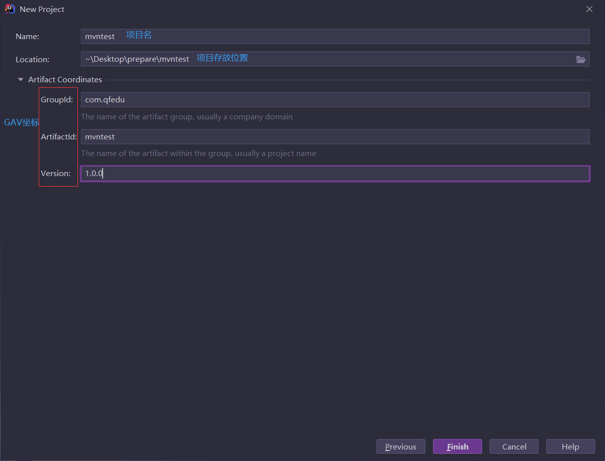

#### 5.2.2、导入依赖

> 这里以导入`MySQL`驱动举例

##### 5.2.2.1、查找依赖

> 网址：`https://mvnrepository.com/`
>
> 进入网站后，搜索`mysql`

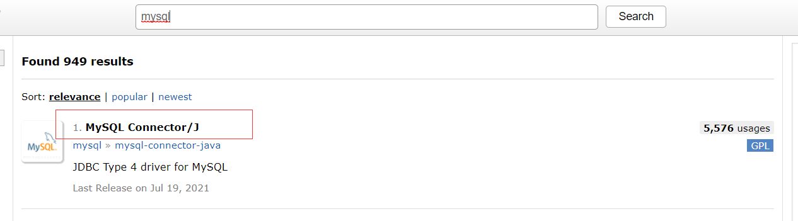

> 进入上图中的链接，出现线图所示的界面，该界面罗列了MySQL驱动所有版本

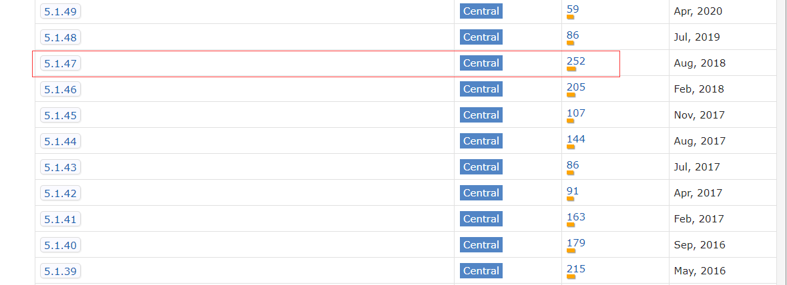

> 按照上图的示例，选择`5.1.49`，出现如下图所示界面

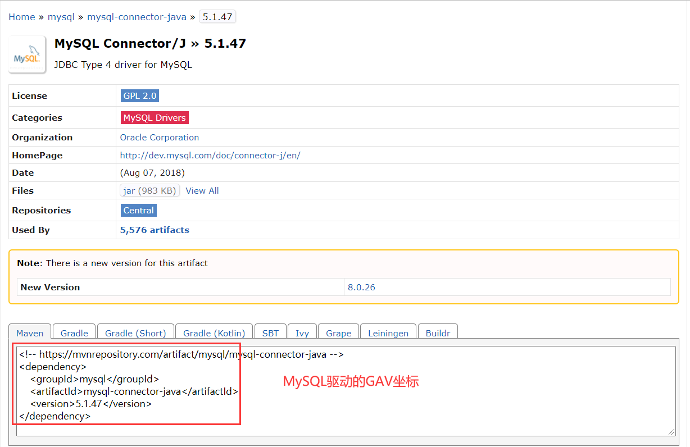

##### 5.2.2.2、导入依赖到项目中

> 将上面查到的`MySQL`驱动的`GAV`坐标拷贝到项目的`pom.xml`文件中。

```xml
<?xml version="1.0" encoding="UTF-8"?>
<project xmlns="http://maven.apache.org/POM/4.0.0"
         xmlns:xsi="http://www.w3.org/2001/XMLSchema-instance"
         xsi:schemaLocation="http://maven.apache.org/POM/4.0.0 http://maven.apache.org/xsd/maven-4.0.0.xsd">
    <modelVersion>4.0.0</modelVersion>

    <groupId>com.qfedu</groupId>
    <artifactId>mvntest</artifactId>
    <version>1.0.0</version>

    <properties>
        <maven.compiler.source>8</maven.compiler.source>
        <maven.compiler.target>8</maven.compiler.target>
    </properties>

    <dependencies>
        <!-- MySQL驱动坐标 -->
        <dependency>
            <groupId>mysql</groupId>
            <artifactId>mysql-connector-java</artifactId>
            <version>5.1.49</version>
            <!-- 关于scope后续会讲到 -->
            <scope>runtime</scope>
        </dependency>
    </dependencies>
</project>
```

##### 5.2.2.3、同步依赖

> 引入坐标后，同步依赖，确认导入。
>
> 单击`pom.xml`右上角的图标，同步依赖，`Idea2020`无法自动同步，只能**手动同步**依赖。
>
> 手动同步依赖之后，右上角的图标消失。

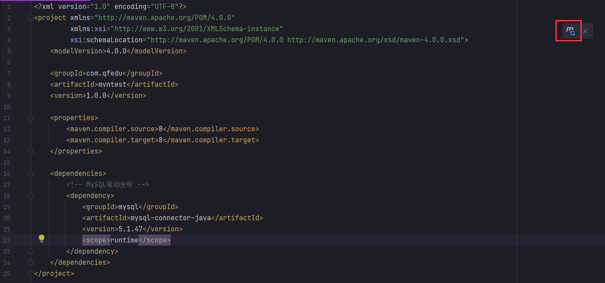

#### 5.2.3、测试

> 在`src/main`下新建`Java`类，运行`main`方法测试。

```java
package com.qfedu.test;

import java.sql.Connection;
import java.sql.DriverManager;
import java.sql.PreparedStatement;
import java.sql.ResultSet;

public class MyTest {
    public static void main(String[] args) throws Exception {
        //四大参数             com.mysql.jc.jdbc.Driver
        String driverName = "com.mysql.jdbc.Driver";    
        String url = "jdbc:mysql://localhost:3306/mydbjdbc?useSSL=false";
        String username = "root";
        String password = "root";

        //SQL语句
        String sql = "select * from user";

        //加载驱动
        Class.forName(driverName);
        //获取连接
        Connection connection = DriverManager.getConnection(url, username, password);
        //获取PreparedStatement
        PreparedStatement statement = connection.prepareStatement(sql);
        //发送SQL
        ResultSet rSet = statement.executeQuery();

        //处理结果
        while(rSet.next()) {
            String u = rSet.getString("username");
            String p = rSet.getString("password");
            System.out.println(u + ":" + p);
        }

        //释放资源
        rSet.close();
        statement.close();
        connection.close();
    }
}
```

### 5.3、创建及部署Web项目  重点

> 创建`Maven`版本的`web`项目，可以基于普通`Maven`项目进行。

#### 5.3.1、修改打包方式

> 在pom.xml中设置`packaging`

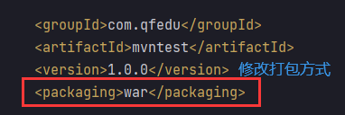

#### 5.3.2、引入web开发相关依赖

> 这里需要引入`JSP`和`Servlet`依赖

```xml
<!-- servlet -->
<dependency>
    <groupId>javax.servlet</groupId>
    <artifactId>javax.servlet-api</artifactId>
    <version>3.1.0</version>
    <scope>provided</scope>
</dependency>
<!-- jsp -->
<dependency>
    <groupId>javax.servlet.jsp</groupId>
    <artifactId>javax.servlet.jsp-api</artifactId>
    <version>2.3.3</version>
    <scope>provided</scope>
</dependency>
<!-- jstl -->
<dependency>
    <groupId>jstl</groupId>
    <artifactId>jstl</artifactId>
    <version>1.2</version>
</dependency>
```

#### 5.3.3、修改项目结构   重点

> 创建存放`web`资源的目录，这里按照图示操作，不需要修改任何内容，最后单击`OK`就可以了。

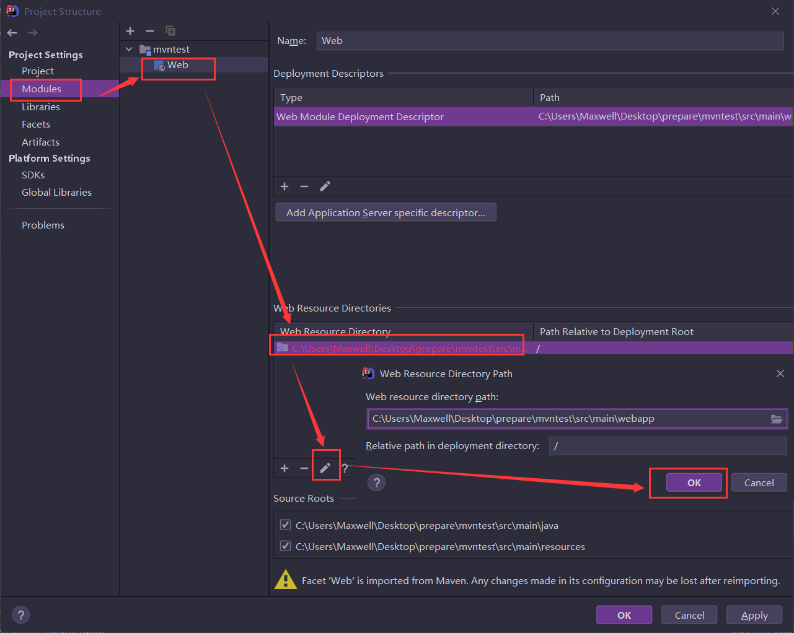

> 此时项目中没有存放`web`资源及配置文件的目录，按照下图的操作创建`web.xml`，注意路径的写法（需要补全相关内容）。

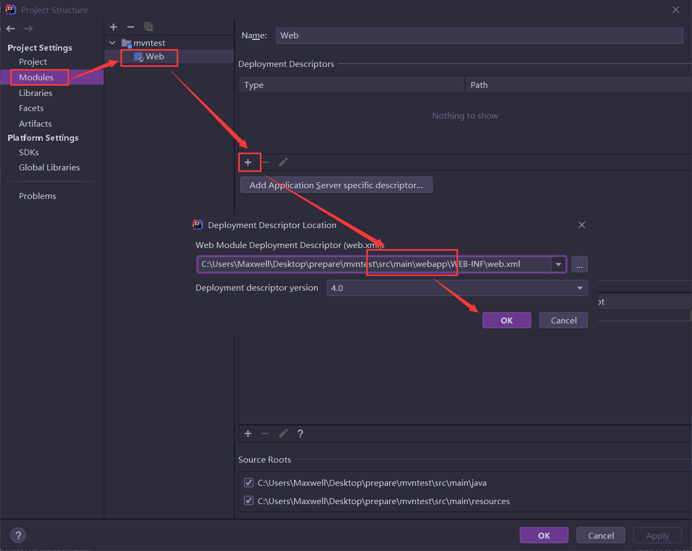

> 

> 完成上述操作，项目`src/main`目录下会产生`webapp`目录，这个目录和之前`JavaWeb`阶段的`web`目录作用和地位是一样的。这个目录中包括`WEB-INF`目录，`WEB-INF`中包括`web.xml`文件。后续开发过程中的`JSP`文件都放在这个目录下。
>
> 之前我们在这个目录下创建`lib`目录，用来存放`jar`包，由于我们现在创建的是`Maven`工程，导入`jar`包直接在`pom.xml`中导入就可以了。

#### 5.3.4、编写代码

> 新建`Servlet`代码如下

```java
package com.qfedu.servlet;

import javax.servlet.*;
import javax.servlet.http.*;
import javax.servlet.annotation.*;
import java.io.IOException;

@WebServlet(name = "TestServlet", value = "/TestServlet")
public class TestServlet extends HttpServlet {
    @Override
    protected void doGet(HttpServletRequest request, HttpServletResponse response) throws ServletException, IOException {
        response.getWriter().println("<p>Hello World</p>");
    }

    @Override
    protected void doPost(HttpServletRequest request, HttpServletResponse response) throws ServletException, IOException {

    }
}
```

#### 5.3.5、部署Web项目

> 在`Tomcat`中部署项目，整个过程和`JavaWeb`阶段中部署项目过程完全相同。

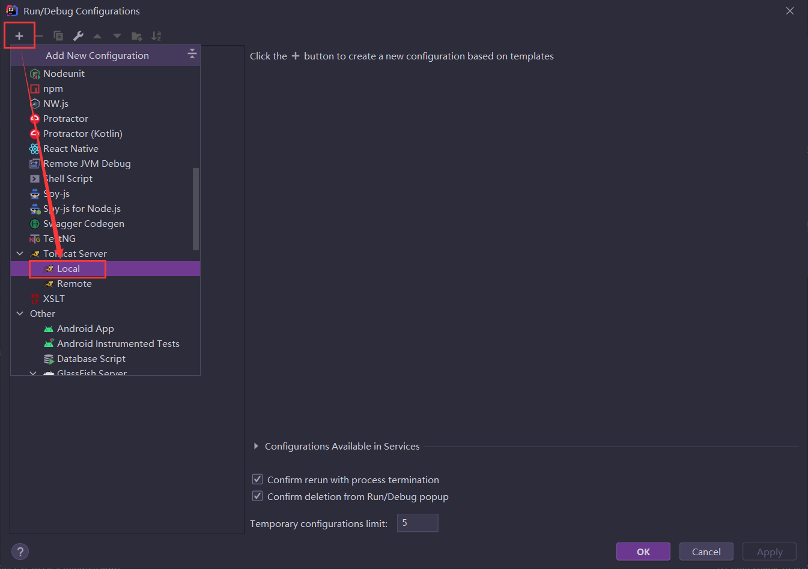

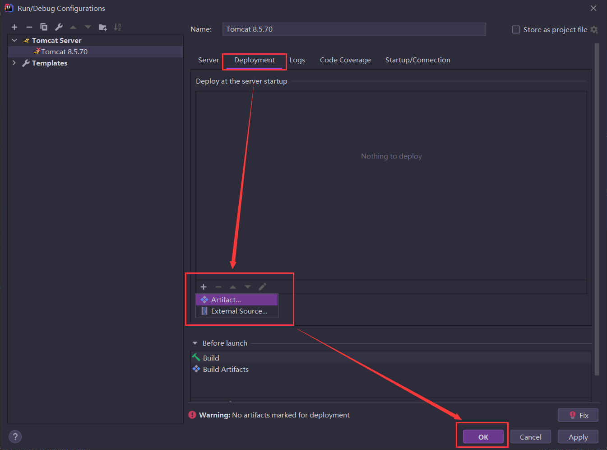

#### 5.3.6、测试

> 启动`Tomcat`，访问`Servlet`测试。

## 六、依赖作用范围

### 6.1、什么是依赖作用范围   重点

> `jar`包生效的时间段，即`jar`的生命周期

### 6.2、如何设置

> 在`pom.xml`中设置依赖时使用`scope`设置

```xml
<!-- MySQL驱动坐标 -->
<dependency>
    <groupId>mysql</groupId>
    <artifactId>mysql-connector-java</artifactId>
    <version>5.1.49</version>
    <scope>runtime</scope>
</dependency>
<!-- servlet -->
<dependency>
    <groupId>javax.servlet</groupId>
    <artifactId>javax.servlet-api</artifactId>
    <version>3.1.0</version>
    <scope>provided</scope>
</dependency>
<!-- jsp -->
<dependency>
    <groupId>javax.servlet.jsp</groupId>
    <artifactId>javax.servlet.jsp-api</artifactId>
    <version>2.3.3</version>
    <scope>provided</scope>
</dependency>

```


### 6.3、依赖作用范围详解

> **`compile` ：为默认的依赖有效范围。如果在定义依赖关系的时候，没有明确指定依赖有效范围的话，则默认采用该依赖有效范围。此种依赖，在编译、运行、测试时均有效。**
>
> **`provided` ：在编译、测试时有效，但是在运行时无效。`provided`意味着打包的时候可以不用包进去，别的设施(Web Container)会提供。事实上该依赖理论上可以参与编译，测试，运行等周期。例如：`servlet-api`，运行项目时，容器已经提供，就不需要`Maven`重复地引入一遍了。**
>
> **`runtime` ：在运行、测试时有效，但是在编译代码时无效。说实话在终端的项目（非开源，企业内部系统）中，和`compile`区别不是很大。例如：`JDBC`驱动实现，项目代码编译只需要`JDK`提供的`JDBC`接口，只有在测试或运行项目时才需要实现上述接口的具体`JDBC`驱动。**
>
> `test` ：只在测试时有效，包括测试代码的编译，执行。例如：`Junit`。
>
> `system` ：在编译、测试时有效，但是在**运行时无效**。和`provided`的区别是，使用`system`范围的依赖时必须通过`systemPath`元素显式地指定依赖文件的路径。由于此类依赖不是通过`Maven`仓库解析的，而且往往与本机系统绑定，可能造成构建的不可移植，因此应该谨慎使用。

## 七、常见问题

> `Idea`中`Maven`项目依赖出现红色波浪线。


> 原因：网络原因导致下载资源到一半没成功
>
> 先检查pom.xml标签拼写是否正确。
>
> 如何解决：单击`Idea Maven`窗口上方的刷新按钮

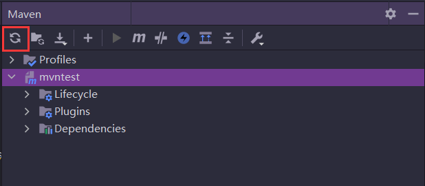

> 按照gav坐标找到jar包
>
> 如果还不能解决，可以在`Windows`下新建如下内容的`.bat`文件，运行，再单击刷新按钮。
>
> 注意`REPOSITORY_PATH`的值。

```powershell
set REPOSITORY_PATH=D:\Devapp\Maven\repository
rem 正在搜索...
for /f "delims=" %%i in ('dir /b /s "%REPOSITORY_PATH%\*lastUpdated*"') do (
    del /s /q %%i
)
rem 搜索完毕
pause
```

## 八、面试总结

**mvn clean  mvn compile  mvn package    mvn install **

**maven的作用？下载jar包，管理jar,创建多模块项目**

**1 如何配置本地仓库**
 
**找到settings.xml文件，配置localRepository**

**2如何配置远程仓库**

**找到settings.xml文件，配置mirror**

**3 如何配置依赖(jar包)**

**配置项目的pom.xml，配置dependency**

**4 通过GAV可以唯一确定一个项目或一个jar包**

**5 packaging打包方式:jar ,war ,pom，默认是jar**

**6 jar包的作用域范围**

**compile  编译运行时有效，默认**

**provided 编译有效，运行无效  （servlet-api.jar  jsp-api.jar）**
**runtime 编译无效，运行有效   (mysql驱动)**

**依赖爆红：**

**1检查pom.xml拼写问题**

**2排除网络原因，点击右上角Reload All maven projects**

**3清缓存重启idea**

**4拷贝别人的jar包到自己的本地仓库，清缓存重启idea**

**张三导入李四的maven项目，首要的是确认张三本地的maven配置是否正确。**


