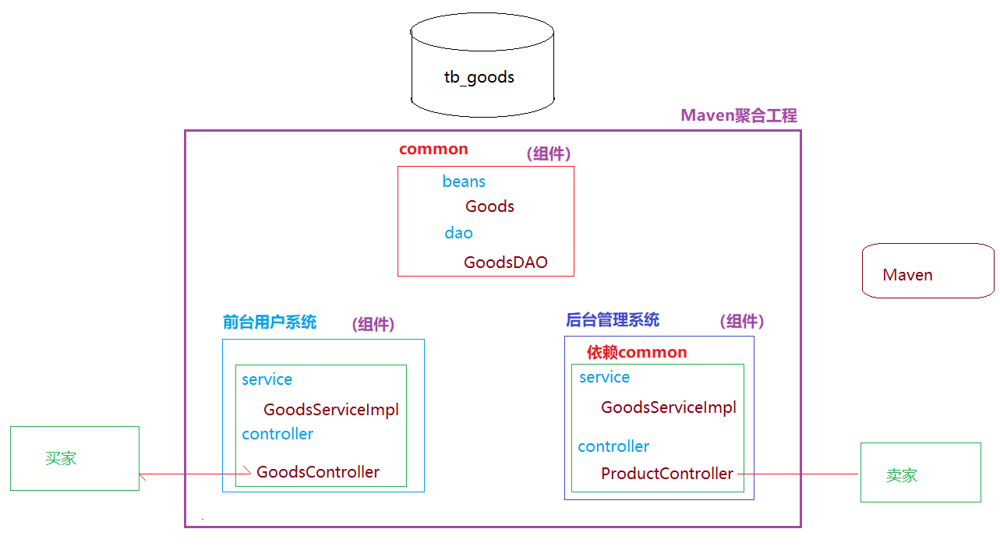
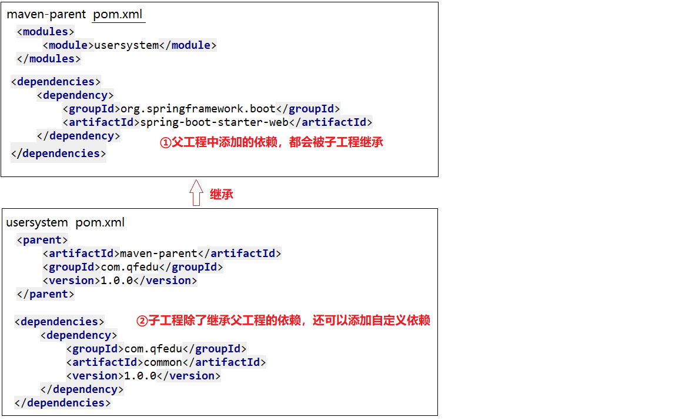

# Maven聚合工程
**聚合工程体现的依赖关系：**

**1 子级模块会继承父级项目的g 和 v坐标**

**2 子级模块会继承父级项目的依赖**   

**3 子级模块会继承父级项目的依赖配置 （dependencyManagement）**

## 一、Maven聚合工程概念

> spring cloud alibaba :微服务
>
> 
>
> Maven聚合工程：就是可以在一个Maven父工程中创建多个组件(模块-项目)，这个多个组件之间可以相互依赖，实现组件的复用



## 二、创建Maven聚合工程

### 2.1、创建Maven父工程

> Maven聚合工程的父工程 packging必须为 pom
>
> - 创建一个Maven工程
>
> - 修改父工程的pom.xml，设置打包方式为pom

```xml
<?xml version="1.0" encoding="UTF-8"?>
<project xmlns="http://maven.apache.org/POM/4.0.0"
         xmlns:xsi="http://www.w3.org/2001/XMLSchema-instance"
         xsi:schemaLocation="http://maven.apache.org/POM/4.0.0 http://maven.apache.org/xsd/maven-4.0.0.xsd">
    <modelVersion>4.0.0</modelVersion>

    <groupId>com.qfedu</groupId>
    <artifactId>maven-parent</artifactId>
    <version>1.0.0</version>
    <packaging>pom</packaging>
</project>
```

> * 父工程用于管理子工程，不进行业务实现，因此src目录可以选择性删除

### 2.2、创建Module

> - 选择父工程---右键---New---Module
>
> - 输入子工程名称（g和v都从父工程继承）
>
> - 子工程的pom文件：

```xml
<?xml version="1.0" encoding="UTF-8"?>
<project xmlns="http://maven.apache.org/POM/4.0.0"
         xmlns:xsi="http://www.w3.org/2001/XMLSchema-instance"
         xsi:schemaLocation="http://maven.apache.org/POM/4.0.0 http://maven.apache.org/xsd/maven-4.0.0.xsd">
    <!--module的pom继承 父工程的pom-->
    <parent>
        <artifactId>maven-parent</artifactId>
        <groupId>com.qfedu</groupId>
        <version>1.0.0</version>
    </parent>

    <modelVersion>4.0.0</modelVersion>
    <artifactId>common</artifactId>

</project>
```

> * 父工程的pom文件：

```xml
<?xml version="1.0" encoding="UTF-8"?>
<project xmlns="http://maven.apache.org/POM/4.0.0"
         xmlns:xsi="http://www.w3.org/2001/XMLSchema-instance"
         xsi:schemaLocation="http://maven.apache.org/POM/4.0.0 http://maven.apache.org/xsd/maven-4.0.0.xsd">
    <modelVersion>4.0.0</modelVersion>

    <groupId>com.qfedu</groupId>
    <artifactId>maven-parent</artifactId>
    <version>1.0.0</version>

    <!--  声明当前父工程的子module  -->
    <modules>
        <module>common</module>
    </modules>

    <packaging>pom</packaging>

</project>
```

## 三、Maven聚合工程依赖继承

### 3.1、依赖继承

> 在父工程的pom文件添加的依赖，会被子工程继承



### 3.2、依赖版本管理

> 在父工程的pom.xml的dependencyManagement中添加依赖，表示定义子工程中此依赖的默认版本（此定义并不会让子工程中添加当前依赖）

```xml
<!--  依赖管理：在dependencyManagement中添加依赖，表示定义子工程中此依赖的默认版本  -->
<dependencyManagement>
    <dependencies>
        <dependency>
            <groupId>com.google.code.gson</groupId>
            <artifactId>gson</artifactId>
            <version>2.6.1</version>
        </dependency>
    </dependencies>
</dependencyManagement>

dependencyManagement 是配置依赖的版本，而不是下载依赖
```


