# RocketMQ入门

# 一：什么是MQ

## 1.1：什么是MQ     (Message Queue 消息队列)

mq：是生产者消费者的设计模式

生产者：往queue存放消息

消息队列：存储消息

消费者：消费消息

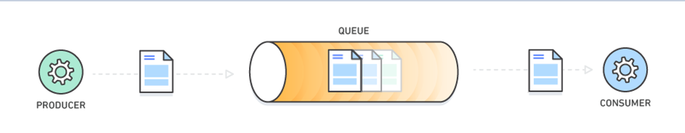

​     生成者发送消息到mq，消息有一个主题（消费者可以通过主题取到特定是消息），

​    消费者会去mq中主动取特定主题的消息

和原始的http请求的不同在于？ 在于异步性


## 1.2：MQ的优势


优势一：异步处理   

> 服务之间的调用同步调用，如果下游服务是一个耗时操作，那么会阻塞线程(http)，最终导致触发熔断降级
>
> 解决办法：使用mq，mq可以实现异步操作

优势二：应用解耦      A （支付模块）和 B （物流模块）

> 系统的耦合性越高，容错性就越低，使用MQ可以达到完全解耦

优势三：流量削峰

> 消息队列可以将大量请求缓存起来，分散到很长一段时间处理，避免请求丢失或者系统被压垮

## 1.3：主流MQ对比

**面试题**

**常见的MQ产品包括Kafka、ActiveMQ、RabbitMQ、RocketMQ。**

 

| 特性           | ActiveMQ | RabbitMQ | RocketMQ(阿里) | kafka(大数据) |
| -------------- | -------- | -------- | -------------- | ------------- |
| 开发语言       | java     | erlang   | java           | scala         |
| 单机吞吐量qps  | 万级     | 万级     | 10万级         | 10万级        |
| 时效性rt       | ms级     | us级     | ms级           | ms级          |
| 可用性(高可用) | 主从架构 | 主从架构 | 分布式架构     | 分布式架构    |

​                                                                           

优劣势总结

```txt
ActiveMQ
非常成熟，功能强大，在业内大量的公司以及项目中都有应用,偶尔会有较低概率丢失消息,而且现在社区以及国内应用都越来越少，官方社区现在对ActiveMQ 5.x维护越来越少，几个月才发布一个版本而且确实主要是基于解耦和异步来用的，较少在大规模吞吐的场景中使用

RabbitMQ
erlang语言开发，性能极其好，延时很低；
吞吐量到万级，MQ功能比较完备
而且开源提供的管理界面非常棒，用起来很好用
社区相对比较活跃，几乎每个月都发布几个版本分
在国内一些互联网公司近几年用rabbitmq也比较多一些
但是问题也是显而易见的，RabbitMQ确实吞吐量会低一些，这是因为他做的实现机制比较重。
而且erlang开发，国内有几个公司有实力做erlang源码级别的研究和定制？如果说你没这个实力的话，确实偶尔会有一些问题，你很难去看懂源码，你公司对这个东西的掌控很弱，基本职能依赖于开源社区的快速维护和修复bug。
而且rabbitmq集群动态扩展会很麻烦，不过这个我觉得还好。其实主要是erlang语言本身带来的问题。很难读源码，很难定制和掌控。


RocketMQ
接口简单易用，而且毕竟在阿里大规模应用过，有阿里品牌保障
日处理消息上百亿之多，可以做到大规模吞吐，性能也非常好，分布式扩展也很方便，社区维护还可以，可靠性和可用性都是ok的，还可以支撑大规模的topic数量，支持复杂MQ业务场景
而且一个很大的优势在于，阿里出品都是java系的，我们可以自己阅读源码，定制自己公司的MQ，可以掌控
有很多业务特性，如瞬时消息，延迟消息，事务消息等

kafka   (缺少业务相关功能，如延迟消息没有)
kafka的特点其实很明显，就是仅仅提供较少的核心功能，但是提供超高的吞吐量，ms级的延迟，极高的可用性以及可靠性，而且分布式可以任意扩展同时kafka最好是支撑较少的topic数量即可，保证其超高吞吐量
而且kafka唯一的一点劣势是有可能消息重复消费，那么对数据准确性会造成极其轻微的影响，在大数据领域中以及日志采集中，这点轻微影响可以忽略这个特性天然适合大数据实时计算以及日志收集
```


## 1.4：Apache RocketMQ简介

> RocketMQ是阿里巴巴2016年MQ中间件，使用Java语言开发，在阿里内部，RocketMQ承接了例如“双11”等高并发场景的消息流转，能够处理万亿级别的消息。


官网：http://rocketmq.apache.org/

中文文档：https://github.com/apache/rocketmq/tree/master/docs/cn

不同版本下载地址：http://rocketmq.apache.org/dowloading/releases/


# 二：RocketMQ安装与启动

> 解压即安装

配置ROCKETMQ_HOME环境变量

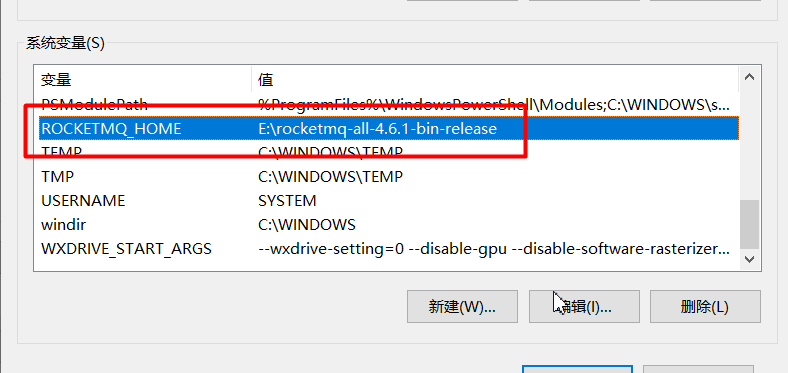


## 2.1：配置并启动nameserver进程

> Rocketmq：有两类进程分别是 nameserv、broker进程

### 2.1.1：配置nameserver


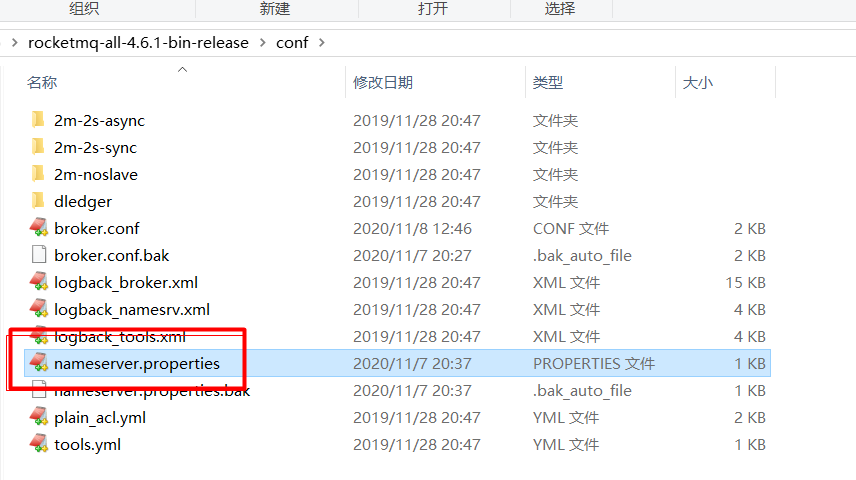

没有该文件，则新建

```properties
listenPort=9876
listenIp=127.0.0.1


```

### 2.1.2：启动nameserver


```shell
start  mqnamesrv.cmd -c  ../conf/nameserver.properties
```

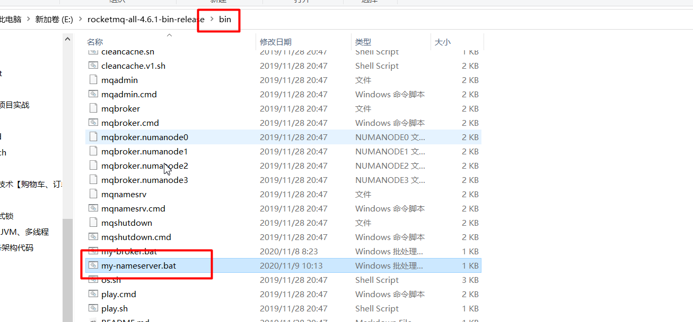

常见问题：   

1当windows 下 Rocketmq Broker异常关闭后，会出现无法启动broker的情况，只需要将C盘 C:\Users\用户 的    store文件夹删除，再进行启动

2 maybe your broker machine memory too small        清理一下C盘  


> 如果服务器性能不够，修改runserver.cmd里面jvm配置   （一般不需要）


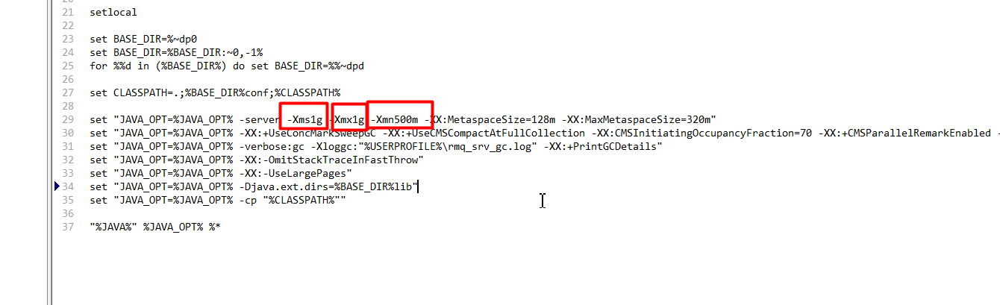


nameserver进程启动成功

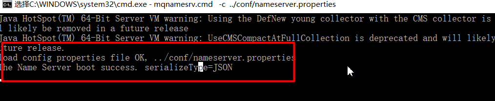


## 2.2：配置并启动broker进程

### 2.2.1：配置broker

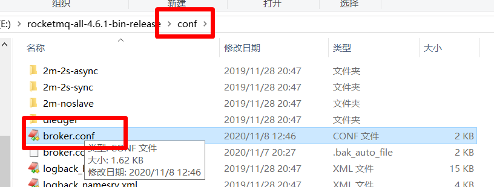


```properties

#所属集群名字
brokerClusterName=rocketmq-cluster
#broker名字，注意此处不同的配置文件填写的不一样
brokerName=broker-a
#0 表示 Master，>0 表示 Slave
brokerId=0
#nameServer地址，分号分割【重点】
namesrvAddr=127.0.0.1:9876
#Broker 对外服务的监听端口
listenPort=10911
#Broker监听的ip【重点】
brokerIP1=127.0.0.1

#在发送消息时，自动创建服务器不存在的topic，默认创建的队列数
defaultTopicQueueNums=4
#是否允许 Broker 自动创建Topic，建议线下开启，线上关闭
autoCreateTopicEnable=true
#是否允许 Broker 自动创建订阅组，建议线下开启，线上关闭
autoCreateSubscriptionGroup=true
#删除文件时间点，默认凌晨 4点
deleteWhen=04
#文件保留时间，默认 48 小时
fileReservedTime=120
#commitLog每个文件的大小默认1G
mapedFileSizeCommitLog=1073741824
#ConsumeQueue每个文件默认存30W条，根据业务情况调整
mapedFileSizeConsumeQueue=300000
```


### 2.2.2：启动broker

在bin目录下，新建my-broker.cmd文件，启动内容如下:

```shell
start mqbroker.cmd -c  ../conf/broker.conf
```


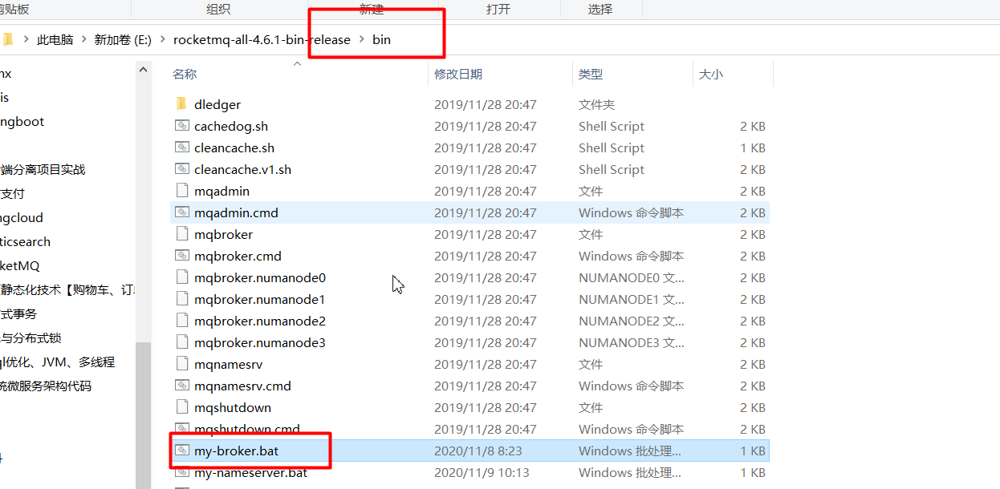


broker进程jvm堆内存设置


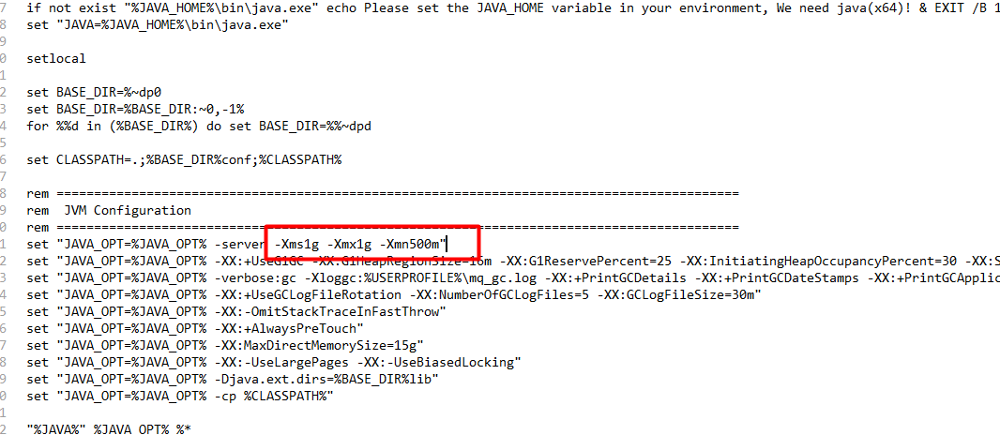


broker启动成功

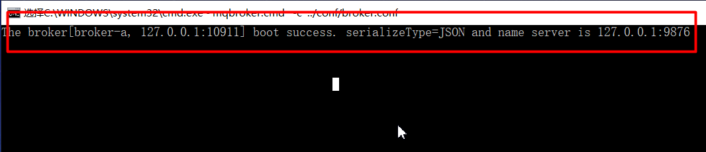


# 三：RocketMQ 进程角色

## 3.1：进程角色说明

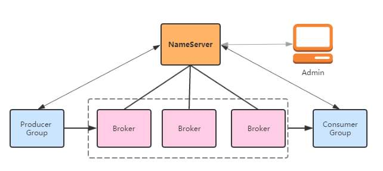


- Name Server：在消息队列RocketMQ版中提供命名服务，**更新和发现Broker服务**，**保存broker和topic**

   **的路由信息**，Name Server通过集群保证高可用

- Broker： 集群最核心模块，主要负责**Topic消息存储、消费者的消费位点管理**（消费进度）。

  broker通过主备保证分片数据高可用。


## 3.2：相关概念

**消息（Message）**

消息系统所传输信息的物理载体，生产和消费数据的最小单位，每条消息必须属于一个主题。RocketMQ中每个消息拥有唯一的**Message ID**，且可以携带具有业务标识的Key。系统提供了通过Message ID和Key查询消息的功能。

  String  K,V    Hash K,k,v

**主题（Topic）**

每条消息只能属于一个主题，是RocketMQ进行消息订阅的基本单位。

**标签（Tag）**

为消息设置的标志，用于同一主题下区分不同类型的消息。来自同一业务单元的消息，可以根据不同业务目的在同一主题下设置不同标签。标签能够有效地保持代码的清晰度和连贯性，并优化RocketMQ提供的查询系统。消费者可以根据Tag实现对不同子主题的不同消费逻辑，实现更好的扩展性。


**生产者组（Producer Group）**

同一类Producer的集合，这类Producer发送同一类消息且发送逻辑一致。如果发送的是事务消息且原始生产者在发送之后崩溃，则Broker服务器会联系同一生产者组的其他生产者实例以提交或回溯消费。


**消费者组（Consumer Group）**

同一类Consumer的集合，这类Consumer通常消费同一类消息且消费逻辑一致。消费者组使得在消息消费方面，实现负载均衡和容错的目标变得非常容易。要注意的是，消费者组的消费者实例必须订阅完全相同的Topic。RocketMQ 支持两种消息模式：集群消费（Clustering）和广播消费（Broadcasting）。


# 四：RocketMQ控制台

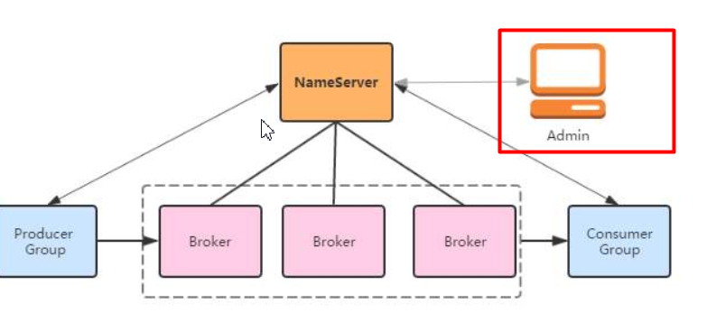


> `RocketMQ`有一个对其扩展的开源项目[incubator-rocketmq-externals](https://github.com/apache/rocketmq-externals)，这个项目中有一个子模块叫`rocketmq-console`，这个便是管理控制台项目了，先将[incubator-rocketmq-externals](https://github.com/apache/rocketmq-externals)拉到本地，因为我们需要自己对`rocketmq-console`进行编译打包运行。


## 4.1：下载控制台源码

```shell
# 方式一、git下载，执行如下命令
git clone https://github.com/apache/rocketmq-externals.git

# 方式二、直接下载，访问如下地址即可
https://github.com/apache/rocketmq-externals/archive/master.zip

```


## 4.2：切换rocketmq-console模块

修改端口（rocketmq-console>src>resource>application.properties）

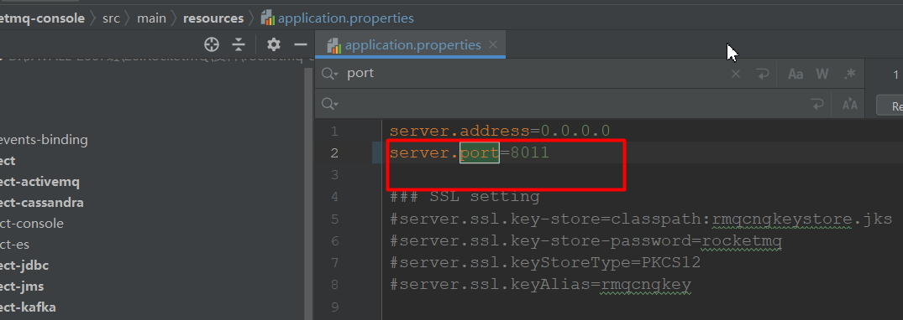

修改nameserver的地址（rocketmq-console>src>resource>application.properties）

```properties
rocketmq.config.namesrvAddr=localhost:9876
```


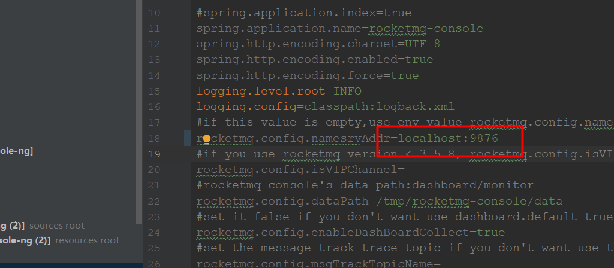


修改Rocketmq的api版本（rocketmq-console>pom.xml）

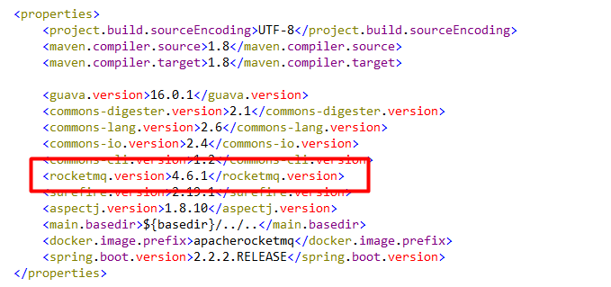

添加依赖

```xml
<dependency>
    <groupId>commons-io</groupId>
    <artifactId>commons-io</artifactId>
    <version>2.4</version>
</dependency>
```


## 4.3：使用maven编译构建

```shell
mvn clean package -Dmaven.test.skip=true
```


## 4.4：懒人包

> 如果你不想做上面操作，直接使用资料里面已经打包好的懒人包，启动即可


RocketMQ     rocketmq-client  

redis   jedis             Spring Data Redis  StringRedisTemplate

es     rest client       Spring Data ElaticSerach  ElaticSearchRestTemplate


# 五：消息收发


pom依赖

```xml
<!-- mq java客户端       -->
<dependency>
    <groupId>org.apache.rocketmq</groupId>
    <artifactId>rocketmq-client</artifactId>
    <version>4.6.1</version>
</dependency>
```


## 5.1：生产者-同步消息

生产者和Broker直接的同步，生产者发送了消息后，如果没有收到Broker的响应，就一直等到超时

```txt
同步：发送网络请求后会同步等待 Broker 服务器返回结果，支持发送失败重试，适用于比较重要的消息通知场景。

异步：异步发送网络请求，不会阻塞当前线程，支持失败重试，适用于对响应时间要求更高的场景。

单向：单向发送原理和异步一致，但不支持回调。适用于响应时间非常短，对可靠性要求不高的场景，例如日志收集。
```

> 这种可靠性同步地发送方式使用的比较广泛，比如：重要的消息通知，短信通知。
>
> send方法阻塞线程

```txt
发送消息的步骤
1.创建消息生产者producer(DefaultMQProducer)，并制定生产者group
2.指定Nameserver地址
3.启动producer
4.创建Message对象，指定主题Topic、标签、消息体
5.发送消息
6.关闭生产者producer
```

```java
//发送消息的步骤
//1.创建消息生产者producer(DefaultMQProducer)，并指定生产者group
DefaultMQProducer producer =
    new DefaultMQProducer("test-group");
//2.指定Nameserver地址
producer.setNamesrvAddr("127.0.0.1:9876");
//3.启动producer
 producer.setSendMsgTimeout(10000); //超时时间
producer.start();
//4.创建Message对象，指定主题Topic、消息体
Message message =
    new Message("test-topic","test0tag","你好 MQ!!".getBytes());

//5.发送消息【同步消息：阻塞线程】
SendResult send = producer.send(message);
System.out.println(send);
//6.关闭生产者producer
producer.shutdown();
```


## 5.2：生产者-发异步消息

> 异步消息通常用在对响应时间敏感的业务场景，即发送端不能容忍长时间地等待Broker的响应。
>
> send方法不阻塞线程，同时还可以异步处理发送结果

可以设置重试次数 producer.retryTimesWhenSendAsyncFailed(3);   (同步：retryTimesWhenSendFailed)

```java
     @RequestMapping("sendYiBu")
    public String sendYiBu() throws MQClientException, RemotingException, InterruptedException, MQBrokerException {
//        发送消息的步骤
//        1.创建消息生产者producer(DefaultMQProducer)，并制定生产者group
        DefaultMQProducer defaultMQProducer = new DefaultMQProducer("yibusend-group");
//        2.指定Nameserver地址
        defaultMQProducer.setNamesrvAddr("127.0.0.1:9876");
//        3.启动producer
         defaultMQProducer.setSendMsgTimeout(10000); //超时时间
        defaultMQProducer.start();
//        4.创建Message对象，指定主题Topic、消息体
        Message message = new Message("yibu","tag1","hello,异步消息".getBytes());
//        5.发送消息
        defaultMQProducer.send(message, new SendCallback() {
            @Override
            public void onSuccess(SendResult sendResult) {
                System.out.println(sendResult);
                defaultMQProducer.shutdown();
            }
            @Override
            public void onException(Throwable throwable) {
                System.out.println(throwable);
            }
        });
        Thread.sleep(3000);
        return "success";
    }
```


## 5.3：生产者-发单向消息

> 这种方式主要用在不特别关心发送结果的场景，不关心消息的发送结果，例如日志发送。
>
> send方法不会阻塞线程

```java
  //发送消息的步骤
        //1.创建消息生产者producer(DefaultMQProducer)，并指定生产者group名称
        DefaultMQProducer producer = new DefaultMQProducer("group");
        //2.指定Nameserver地址
        producer.setNamesrvAddr("127.0.0.1:9876");
        //3.启动producer
       defaultMQProducer.setSendMsgTimeout(10000); //超时时间
        producer.start();
        //4.创建Message对象，指定主题Topic、消息体
        Message message = new Message("test-topic1","test-tag1","你好  MQ  单向".getBytes());
        //5.发送消息【单向消息】
        //设置mq消息发送的重试次数
        producer.setRetryTimesWhenSendFailed(5);
        producer.sendOneway(message);
```


## 5.4：消费者-集群模式

> 当有多个消费者同时监听某个topic时，集群模式只允许消息被消费一次，一条具体的消息不会被重复消费,默认行为

```xml
1.创建消费者Consumer(DefaultMQPushConsumer)，指定消费者组名
2.指定Nameserver地址
3.订阅(subscribe)主题Topic  和 标签
4.设置消费模式(MessageModel),默认集群模式
5.注册（register）回调函数，处理消息
6.启动消费者
```


```java
 public static void main(String[] args) throws  Exception{
        //1.创建消费者Consumer(DefaultMQPushConsumer)，指定消费者组名
        DefaultMQPushConsumer consumer = new DefaultMQPushConsumer("consumer-group1");
        //2.指定Nameserver地址
        consumer.setNamesrvAddr("localhost:9876");
        //3.订阅(subscribe)主题Topic
        consumer.subscribe("test-topic1","test-tag1");
        //4.设置消费模式(MessageModel),默认集群模式
        consumer.setMessageModel(MessageModel.CLUSTERING);
        //5.注册（register）回调函数，处理消息   ，一次取几条消息
        consumer.setConsumeMessageBatchMaxSize(2);
        consumer.registerMessageListener(new MessageListenerConcurrently() {
            public ConsumeConcurrentlyStatus consumeMessage(List<MessageExt> list, ConsumeConcurrentlyContext consumeConcurrentlyContext) {

                try {
                    for (MessageExt messageExt : list) {
                        //获取消息的topic
                        String topic = messageExt.getTopic();
                        //获取消息的标签
                        String tags = messageExt.getTags();
                        //获取消息内容
                        String content = new String(messageExt.getBody());
                        System.out.println("topic"+topic+"==tags"+tags+"==content"+content);
                    }
                }catch (Exception e){
                    return ConsumeConcurrentlyStatus.RECONSUME_LATER;
                }


                return ConsumeConcurrentlyStatus.CONSUME_SUCCESS;
            }
        });
        //6.启动消费者
        consumer.start();
    }
```


## 5.5：消费者-广播模式

> 当有多个消费者同时监听某个topic时，广播模式 消息会被每个消费者同时消费

```java
  public static void main(String[] args) throws  Exception{
        //1.创建消费者Consumer(DefaultMQPushConsumer)，指定消费者组名
        DefaultMQPushConsumer consumer = new DefaultMQPushConsumer("consumer-group1");
        //2.指定Nameserver地址
        consumer.setNamesrvAddr("localhost:9876");
        //3.订阅(subscribe)主题Topic
        consumer.subscribe("test-topic1","test-tag1");
        //4.设置消费模式(MessageModel),默认集群模式
        consumer.setMessageModel(MessageModel.BROADCASTING);
        //5.注册（register）回调函数，处理消息
        consumer.setConsumeMessageBatchMaxSize(2);
        consumer.registerMessageListener(new MessageListenerConcurrently() {
            public ConsumeConcurrentlyStatus consumeMessage(List<MessageExt> list, ConsumeConcurrentlyContext consumeConcurrentlyContext) {

                try {
                    for (MessageExt messageExt : list) {
                        //获取消息的topic
                        String topic = messageExt.getTopic();
                        //获取消息的标签
                        String tags = messageExt.getTags();
                        //获取消息内容
                        String content = new String(messageExt.getBody());
                        System.out.println("topic"+topic+"==tags"+tags+"==content"+content);
                    }
                }catch (Exception e){
                    return ConsumeConcurrentlyStatus.RECONSUME_LATER;
                }


                return ConsumeConcurrentlyStatus.CONSUME_SUCCESS;
            }
        });
        //6.启动消费者
        consumer.start();
    }

```


# 六：特殊场景

## 6.1： 顺序消息

> 默认情况下：RocketMQ是没法做到全局有序的，因为一个topic有可能存到多个queue，如下图

​    

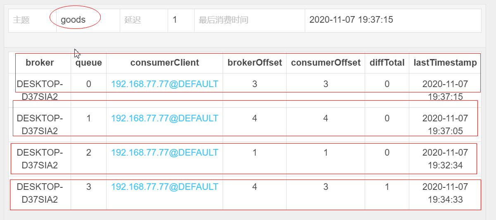


### 6.1.1：演示topic全局无序

producer

```java
public static void main(String[] args) throws Exception {

        //1.创建消息生产者DefaultMQProducer，并制定生产者group
        DefaultMQProducer producer = new DefaultMQProducer("producer-group-3");

        //2.指定Nameserver地址
        producer.setNamesrvAddr("localhost:9876");
        //3.启动producer
        producer.start();
        for (int i = 0; i < 100; i++) {
            //4.构造消息对象
            Message message = new Message("test-topic3", "test-tag3",("message" + i).getBytes());
            //5.发送消息
            SendResult send = producer.send(message);
            System.out.println(send);
        }
        producer.shutdown();
    }
```


consumer

```java
public static void main(String[] args) throws  Exception{
        //1.创建消费者Consumer(DefaultMQPushConsumer)，指定消费者组名
        DefaultMQPushConsumer consumer = new DefaultMQPushConsumer("consumer-group3");
        //2.指定Nameserver地址
        consumer.setNamesrvAddr("localhost:9876");
        //3.订阅(subscribe)主题Topic
        consumer.subscribe("test-topic3","test-tag3");
        //4.设置消费模式(MessageModel),默认负载均衡模式
        consumer.setMessageModel(MessageModel.CLUSTERING);
        //5.注册（register）回调函数，处理消息
        consumer.registerMessageListener(new MessageListenerConcurrently() {
            public ConsumeConcurrentlyStatus consumeMessage(List<MessageExt> list, ConsumeConcurrentlyContext consumeConcurrentlyContext) {

                 try {
                    for (MessageExt messageExt : list) {
                        //获取消息的topic
                        String topic = messageExt.getTopic();
                        //获取消息的标签
                        String tags = messageExt.getTags();
                        //获取消息内容
                        String content = new String(messageExt.getBody());
                        System.out.println("topic"+topic+"==tags"+tags+"==content"+content);
                    }
                }catch (Exception e){
                    return ConsumeConcurrentlyStatus.RECONSUME_LATER;
                }


                return ConsumeConcurrentlyStatus.CONSUME_SUCCESS;

            }
        });
        //6.启动消费者consumer
        consumer.start();
    }
```


### 6.1.2：实现全局有序

场景：适用于先到先得的情况


> 代码实现思路：保证一个topic存到同一个queue即可，消息往一个queue发送

  

producer

> MessageQueueSelector

```java
 public static void main(String[] args) throws Exception {

        //1.创建消息生产者DefaultMQProducer，并制定生产者group
        DefaultMQProducer producer = new DefaultMQProducer("producer-group-4");

        //2.指定Nameserver地址
        producer.setNamesrvAddr("localhost:9876");
        //3.启动producer
        producer.start();
        for (int i = 0; i < 100; i++) {
            //4.构造消息对象
            Message message = new Message("test-topic4", "test-tag4",("message" + i).getBytes());
            //5.发送消息
            SendResult send = producer.send(message, new MessageQueueSelector() {
                public MessageQueue select(List<MessageQueue> list, Message message, Object o) {

                    int index = (Integer) o;
                    return list.get(index);
                }
            }, 0);
            System.out.println(send);
        }
        producer.shutdown();
    }
```


consumer

> MessageListenerOrderly

```java
public static void main(String[] args) throws  Exception{
        //1.创建消费者Consumer(DefaultMQPushConsumer)，指定消费者组名
        DefaultMQPushConsumer consumer = new DefaultMQPushConsumer("consumer-group4");
        //2.指定Nameserver地址
        consumer.setNamesrvAddr("localhost:9876");
        //3.订阅(subscribe)主题Topic
        consumer.subscribe("test-topic4","test-tag4");
        //4.设置消费模式(MessageModel),默认负载均衡模式
        consumer.setMessageModel(MessageModel.CLUSTERING);
        //5.注册（register）回调函数，处理消息
        consumer.registerMessageListener(new MessageListenerOrderly() {

            public ConsumeOrderlyStatus consumeMessage(List<MessageExt> list, ConsumeOrderlyContext consumeOrderlyContext) {
                try {
                    for (MessageExt messageExt : list) {
                        //获取消息的topic
                        String topic = messageExt.getTopic();
                        //获取消息的标签
                        String tags = messageExt.getTags();
                        //获取消息内容
                        String content = new String(messageExt.getBody());
                        System.out.println("topic"+topic+"==tags"+tags+"==content"+content);
                    }
                }catch (Exception e){
                    return ConsumeOrderlyStatus.SUSPEND_CURRENT_QUEUE_A_MOMENT;
                }


                return ConsumeOrderlyStatus.SUCCESS;
            }
        });
        //6.启动消费者consumer
        consumer.start();
    }

```


### 6.1.3：分区有序


如奇数放在一个队列0，偶数放在另外队列1

```
  public static void main(String[] args) throws MQClientException, RemotingException, InterruptedException, MQBrokerException {
  //        发送消息的步骤
  //        1.创建消息生产者producer(DefaultMQProducer)，并制定生产者group
        DefaultMQProducer producer = new DefaultMQProducer("myproducer");
  //        2.指定Nameserver地址
        producer.setNamesrvAddr("127.0.0.1:9876");
  //        3.启动producer
        producer.start();
        for(int i=1;i<101;i++){
       //   4.创建Message对象，指定主题Topic、消息体
            Message m = new Message("mytopic4","mytag1",("hello consumer!"+i).getBytes());
         // 5.发送消息
            producer.send(m, new MessageQueueSelector() {
                @Override
                public MessageQueue select(List<MessageQueue> list, Message message, Object o) {
                    int queue=0;
                    Integer index = (Integer) o;
                    if(index % 2==0){  // 偶数
                        queue=1;
                    }
                    return list.get(queue);
                }
            },i);
        }
//
//        6.关闭生产者producer
        producer.shutdown();

    }
```


## 6.2： 延时消息

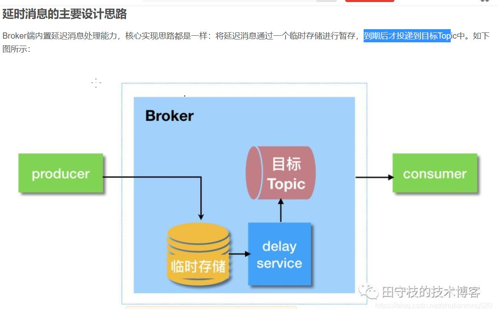


> 应用场景：
>
> 比如电商里，提交了一个订单就可以发送一个延时消息，1h后去检查这个订单的状态，如果还是未付款就取消订单释放库存。
>

​    

producer

>  message.setDelayTimeLevel(3);

```java
    public static void main(String[] args) throws Exception {
        //1.创建消息生产者producer(DefaultMQProducer)，并制定生产者group
        DefaultMQProducer producer = new DefaultMQProducer("producer-group-5");
        //2.指定Nameserver地址
        producer.setNamesrvAddr("localhost:9876");
        //3.启动producer
        producer.start();
        //4.创建Message对象，指定主题Topic、消息体
        Message message = new Message("test-topic5", "test-tag5"/*用于消息过滤*/, "你好 mq".getBytes());
        //messageDelayLevel=1s 5s 10s 30s 1m 2m 3m 4m 5m 6m 7m 8m 9m 10m 20m 30m 1h 2h
        message.setDelayTimeLevel(3);   //延时等级   (10S后存，不是16秒)
        //5.发送消息
        SendResult send = producer.send(message);
        System.out.println(send);
        //6.关闭生产者producer
        producer.shutdown();
}
```


consumer

> 消费时间 >消息的发送时间+延时级别

```java
  public static void main(String[] args) throws Exception {
       //1.创建消费者Consumer(DefaultMQPushConsumer)，指定消费者组名
       DefaultMQPushConsumer consumer = new DefaultMQPushConsumer("consumer-group5");
       //2.指定Nameserver地址
       consumer.setNamesrvAddr("localhost:9876");
       //3.订阅(subscribe)主题Topic
       consumer.subscribe("test-topic5","test-tag5");
       //4.设置消费模式(MessageModel),默认集群模式
       consumer.setMessageModel(MessageModel.BROADCASTING);
       //5.注册（register）回调函数，处理消息
       consumer.setConsumeMessageBatchMaxSize(2);
       consumer.registerMessageListener(new MessageListenerConcurrently() {
           public ConsumeConcurrentlyStatus consumeMessage(List<MessageExt> list, ConsumeConcurrentlyContext consumeConcurrentlyContext) {

               try {
                   for (MessageExt messageExt : list) {
                       //获取消息的topic
                       String topic = messageExt.getTopic();
                       //获取消息的标签
                       String tags = messageExt.getTags();
                       //获取消息内容
                       String content = new String(messageExt.getBody());
                       System.out.println("topic"+topic+"==tags"+tags+"==content"+content);
                       //打印演示消费的时间
                       System.out.println(System.currentTimeMillis() - messageExt.getStoreTimestamp());
                   }
               }catch (Exception e){
                   return ConsumeConcurrentlyStatus.RECONSUME_LATER;
               }


               return ConsumeConcurrentlyStatus.CONSUME_SUCCESS;
           }
       });
       //6.启动消费者
       consumer.start();
  }
```


# 七：重试队列

> RocketMQ消费端默认有重试机制
>
> **面试题**
>
> **重试队列产生的情况： 1异常重试   2 超时重试  **
>
> **重试队列名称为**：**%RETRY%+consumergroup**
>
> **默认重试16次**
>
> **重试队列只在集群模式下有效**

消费端重试分为两种情况

1. 异常重试：由于Consumer端逻辑出现了异常，导致返回了RECONSUME_LATER状态，那么Broker就会在一段时间后尝试重试。
2. 超时重试：如果Consumer端处理时间过长，或者由于某些原因线程挂起，导致迟迟没有返回消费状态，Broker就会认为Consumer消费超时，此时会发起超时重试。

**重试队列名称为**：%RETRY%+consumergroup   

**设置重试时间与次数：**

可在broker.conf文件中配置Consumer端的重试次数和重试时间间隔

messageDelayLevel=1s 5s 10s 30s 1m 2m 3m 4m 5m 6m 7m 8m 9m 10m 20m 30m 1h 2h

默认重试**16**次，默认级别为**level3**,时间间隔为:


**异常重试演示：**

```java
public static void main(String[] args) throws  Exception{
    //1.创建消费者Consumer(DefaultMQPushConsumer)，指定消费者组名
    DefaultMQPushConsumer consumer = new DefaultMQPushConsumer("consumer-group1");
    //2.指定Nameserver地址
    consumer.setNamesrvAddr("localhost:9876");
    //3.订阅(subscribe)主题Topic
    consumer.subscribe("test-topic1","test-tag1");
    //4.设置消费模式(MessageModel),默认集群模式
    consumer.setMessageModel(MessageModel.CLUSTERING);
    //5.注册（register）回调函数，处理消息
    consumer.setConsumeMessageBatchMaxSize(2);
    consumer.registerMessageListener(new MessageListenerConcurrently() {
        public ConsumeConcurrentlyStatus consumeMessage(List<MessageExt> list, ConsumeConcurrentlyContext consumeConcurrentlyContext) {

            try {
                int i =10/0;
                for (MessageExt messageExt : list) {
                    //获取消息的topic
                    String topic = messageExt.getTopic();
                    //获取消息的标签
                    String tags = messageExt.getTags();
                    //获取消息内容
                    String content = new String(messageExt.getBody());
                    System.out.println("topic"+topic+"==tags"+tags+"==content"+content);
                }
                return ConsumeConcurrentlyStatus.CONSUME_SUCCESS;
            }catch (Exception e){
                e.printStackTrace();
                return ConsumeConcurrentlyStatus.RECONSUME_LATER;
            }


        }
    });
    //6.启动消费者
    consumer.start();
}
```


> 注意1：只有在消息模式为MessageModel.CLUSTERING集群模式时，Broker才会自动进行重试，广播消息是不会重试的。
>
> 注意2：由于MQ的重试机制，难免会引起消息的重复消费问题。比如一个ConsumerGroup中有两个，Consumer1和Consumer2，以集群方式消费。假设一条消息发往ConsumerGroup，由Consumer1消费，但是由于Consumer1消费过慢导致超时，如果Broker将消息发送给Consumer2去消费，这样就产生了重复消费问题。因此，使用MQ时应该对一些关键消息进行幂等去重的处理。


# 八：死信队列

```txt
当一条消息初次消费失败，消息队列 RocketMQ 版会自动进行消息重试，达到最大重试次数后，若消费依然失败，则表明消费者在正常情况下无法正确地消费该消息。此时，消息队列 RocketMQ 版不会立刻将消息丢弃，而是将其发送到该消费者对应的特殊队列中。

在消息队列 RocketMQ 版中，这种正常情况下无法被消费的消息称为死信消息（Dead-Letter Message），存储死信消息的特殊队列称为死信队列（Dead-Letter Queue）。


死信消息具有以下特性：
1:不会再被消费者正常消费。
2:有效期与正常消息相同，均为 3 天，3 天后会被自动删除。因此，请在死信消息产生后的 3 天内及时处理。


死信队列具有以下特性：
1:一个死信队列对应一个 Group ID， 而不是对应单个消费者实例。
2:如果一个 Group ID 未产生死信消息，消息队列 RocketMQ 版不会为其创建相应的死信队列。
3:一个死信队列包含了对应 Group ID 产生的所有死信消息，不论该消息属于哪个 Topic。
4:消息队列 RocketMQ 版控制台提供对死信消息的查询、重发的功能。
```

StringRedisTemplate          

ElasticSearchRestTemplate      


# 九：Springboot整合RocketMQ

## 9.1：起步依赖

```xml
<dependency>
    <groupId>org.apache.rocketmq</groupId>
    <artifactId>rocketmq-spring-boot-starter</artifactId>
    <!--2.1.0对应的mq是4.6.x-->
    <version>2.1.0</version>
</dependency>
```


## 9.2：配置

在application.properties里面配置

```properties
#必须配置
#指定nameServer
rocketmq.name-server=127.0.0.1:9876
#指定发送者组名
rocketmq.producer.group=wfx-goods-producer

#其他可选配置
#发送消息超时时间，单位：毫秒。默认为 3000 。
rocketmq.producer.send-message-timeout=3000
# 消息压缩阀值，当消息体的大小超过该阀值后，进行消息压缩。默认为 4 * 1024B
rocketmq.producer.compress-message-body-threshold=4096
## 消息体的最大允许大小。。默认为 4 * 1024 * 1024B
rocketmq.producer.max-message-size=4194304
#发送消息给 Broker 时，如果发送失败，是否重试另外一台 Broker 。默认为 false
rocketmq.producer.retry-next-server=false
# 同步发送消息时，失败重试次数。默认为 2 次。
rocketmq.producer.retry-times-when-send-failed=2
# 异步发送消息时，失败重试次数。默认为 2 次。
rocketmq.producer.retry-times-when-send-async-failed=2
```


## 9.3：发布消息

```java
package com.mq;

import com.mq.order.IdWorker;
import org.apache.rocketmq.client.producer.SendCallback;
import org.apache.rocketmq.client.producer.SendResult;
import org.apache.rocketmq.spring.core.RocketMQTemplate;
import org.springframework.beans.factory.annotation.Autowired;
import org.springframework.messaging.support.MessageBuilder;
import org.springframework.util.StringUtils;
import org.springframework.web.bind.annotation.GetMapping;
import org.springframework.web.bind.annotation.RequestMapping;
import org.springframework.web.bind.annotation.RestController;

import java.util.ArrayList;
import java.util.List;

/**
 * <p>title: com.mq</p>
 * author zhuximing
 * description:
 */
@RestController
public class IndexController {
     

    @Autowired
    private RocketMQTemplate rocketMQTemplate;
  

    @RequestMapping("syncSend")
    public SendResult syncSend() {
        // 同步发送消息
        return rocketMQTemplate.syncSend("test-topic1:test-tag1","你好mq");
    }

    @RequestMapping("asyncSend")
    public void asyncSend() {

        // 异步发送消息
        rocketMQTemplate.asyncSend("test-topic2:test-tag2", "asyncSend", new SendCallback() {
            public void onSuccess(SendResult sendResult) {
                System.out.println(sendResult);
            }

            public void onException(Throwable throwable) {
                  throwable.printStackTrace();
            }
        });
    }

    @RequestMapping("onewaySend")
    public void onewaySend() {
        // oneway 发送消息
        rocketMQTemplate.sendOneWay("test-topic3:test-tag3", "oneway");
    }

    @GetMapping("delay")
    public String delay(){
        //延时消息
        rocketMQTemplate.syncSend("test-topic4:test-tag4", MessageBuilder.withPayload("delay").build(),2000,2);

        return "delay";
    }


}
```


## 9.4：监听消息

```java
package com.qf.listener;

import org.apache.rocketmq.spring.annotation.ConsumeMode;
import org.apache.rocketmq.spring.annotation.MessageModel;
import org.apache.rocketmq.spring.annotation.RocketMQMessageListener;
import org.apache.rocketmq.spring.core.RocketMQListener;
import org.springframework.stereotype.Component;
import org.springframework.stereotype.Service;

@Component
@RocketMQMessageListener(consumerGroup = "test-consumer-group-8",
    topic = "test-topic8",selectorExpression = "test-tag8",
    consumeMode = ConsumeMode.CONCURRENTLY,
    messageModel = MessageModel.CLUSTERING)
public class ConsumerListener implements RocketMQListener<String> {


    public void onMessage(String msg) {

        System.out.println(msg);

    }
}
```


# 十：面试题

**面试题:**

**异步处理   应用解耦     流量削峰**

**NameServe**: **更新和发现Broker服务**，**保存broker和topic的路由信息**

**Broker:Topic消息存储、消费者的消费位点管理**

**集群模式：一个消息只有一个消费者**

**广播模式:一个消息可以有多个消费者**

**RocketMQ消息：全局无序 （队列个数默认是4，消息是分发到不同队列中）**

**MQ:消息队列**

**常见的MQ： ActiveMQ,RocketMQ,RabbitMQ,Kafka**

**优势:异步处理，应用解耦 ，流量削峰**

**Name Server和Broker的关系?**

**Name Server：更新和发现Broker服务，保存broker和topic的路由关系**

**Broker:Topic消息存储、消费者的消费位点管理**

**集群模式和广播模式的区别?**

**集群模式下：消息只能被一个消费者消费一次**

**广播模式下：消息可以被多个消费者消费**

**为什么全局无序？**

**消息默认会发送不同的队列中，所以是全局无序**

**如何做到全局有序？**

**发送消息时指定特定队列**

**重试队列产生的情况： 1异常重试   2 超时重试  **

**重试队列名称为**：**%RETRY%+consumergroup**

**默认重试16次 ,默认等级是3**

**重试队列只在集群模式下有效**

**消息超过重试次数后，不会立即被删除，而是进入到死信队列中，3天后被删除，可以通过控制台重发**


**面试题：消息发送怎么解决0丢失的问题？**    ！！！重点

答：生产者在发送消息的时候，可以设置重试次数，发送失败默认重试2次

```java
 producer.setRetryTimesWhenSendFailed(2); // 同步发送
 producer.setRetryTimesWhenSendAsyncFailed(2); //异步发送
同步消息重发会选择其它的broker，异步消息不会选择其它broker重发，存在消息丢失的问题
单向消息不会进行重发  
```


**面试题：怎么保证消息消费的时候0丢失？**   ! ! !重点

答：Rocketmq默认就有重试队列机制，如果第一次消费的时候，broker收到的回应是（ConsumeConcurrentlyStatus.RECONSUME_LATER），那么这条消息不会丢失，会进入重试队列，重试的次数与重试的时间可以配置(broker的配置文件中)，如果重试的次数超过配置的次数，那么这条消息没有丢失，但是放入死信队列


**面试题：怎么解决消费幂等问题？** ！！！重点

什么是消息的消费幂等

同一个消息被成功地处理多次 

答：处理办法，幂等令牌以及唯一性处理

- 幂等令牌：通常指具备唯一业务标识的字符串。例如，订单号、流水号。一般由Producer随着消息一同发送来的。

- 唯一性处理：保证同一个业务逻辑不会被重复执行成功多次。例如，对同一笔订单的多次支付操作，只会成功一次。

  解决方案如：用Redis分布式锁 setIfAbsent       setnx  name zhangsan

   


