# RocketMQ深入理解

## 主要内容

1.  RocketMQ简介

2.  RocketMQ概念

3.  RocketMQ安装

4.  RocketMQ快速入门

5.  RocketMQ消息模式

6.  RocketMQ重试机制

7.  RocketMQ重复消费问题

8.  RocketMQ集成SpringBoot


## 1 RocketMQ简介

MQ====Message Queue

官网：[http://rocketmq.apache.org/](http://rocketmq.apache.org/)

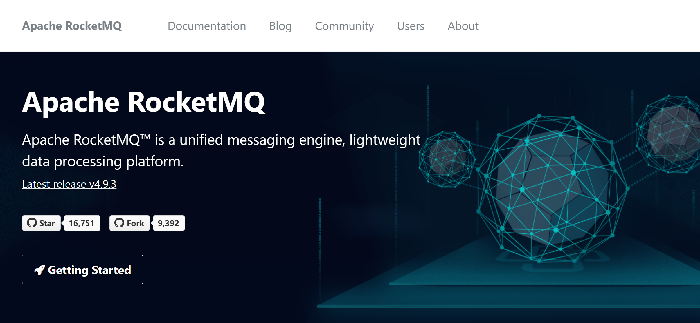

RocketMQ是阿里巴巴2016年MQ中间件，使用Java语言开发，RocketMQ
是一款开源的**分布式消息系统**，基于高可用分布式集群技术，提供低延时的、高可靠的消息发布与订阅服务。同时，广泛应用于多个领域，包括异步通信解耦、企业解决方案、金融支付、电信、电子商务、快递物流、广告营销、社交、即时通信、移动应用、手游、视频、物联网、车联网等。

具有以下特点：

1.  能够保证严格的消息顺序

2.  提供丰富的消息拉取模式

3.  高效的订阅者水平扩展能力

4.  实时的消息订阅机制

5.  亿级消息堆积能力

## 2 为什么要使用MQ

1，要做到系统解耦，当新的模块进来时，可以做到代码改动最小;  **能够解耦**

2，设置流程缓冲池，可以让后端系统按自身**吞吐**能力进行消费，不被冲垮; **能够削峰，限流**

3，强弱依赖梳理能把非关键调用链路的操作异步化并提升整体系统的吞吐能力;**能够异步**

**[Mq的作用 削峰限流 异步 解耦合]{.mark}**

### 2.1 定义

中间件（缓存中间件 redis memcache 数据库中间件 mycat canal 消息中间件mq）

面向消息的**中间件**(message-oriented middleware)
MOM能够很好的解决以上的问题。

是指利用**高效可靠的消息传递机制进行与平台无关（跨平台）的数据交流**，并基于数据通信来进行分布式系统的集成。

通过提供**消息传递和消息排队模型**在分布式环境下提供应用解耦，弹性伸缩，冗余存储，流量削峰，异步通信，数据同步等

大致流程

发送者把消息发给消息服务器\[MQ\]，消息服务器把消息存放在若干**队列**/**主题**中，在合适的时候，消息服务器会把消息转发给接受者。在这个过程中，发送和接受是异步的,也就是发送无需等待，发送者和接受者的生命周期也没有必然关系在发布pub/订阅sub模式下，也可以完成一对多的通信，可以让一个消息有多个接受者\[微信订阅号就是这样的\]


### 2.2 特点

#### 2.2.1 异步处理模式

消息发送者可以发送一个消息而无需等待响应。消息发送者把消息发送到一条虚拟的通道(主题或队列)上;

消息接收者则订阅或监听该通道。一条信息可能最终转发给一个或多个消息接收者，这些接收者都无需对消息发送者做出回应。整个过程都是异步的。

案例：

也就是说，一个系统和另一个系统间进行通信的时候，假如系统A希望发送一个消息给系统B，让它去处理，但是系统A不关注系统B到底怎么处理或者有没有处理好，所以系统A把消息发送给MQ，然后就不管这条消息的"死活"
了，接着系统B从MQ里面消费出来处理即可。至于怎么处理，是否处理完毕，什么时候处理，都是系统B的事，与系统A无关。

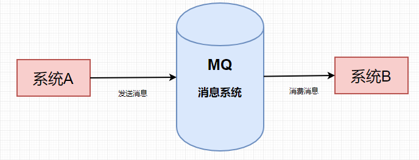

这样的一种通信方式，就是所谓的"异步"通信方式，对于系统A来说，只要把消息发给MQ,然后系统B就会异步处去进行处理了，系统A不能"同步"的等待系统B处理完。这样的好处是什么呢？解耦

#### 2.2.2 应用系统的解耦

  **发送者和接收者不必了解对方，只需要确认消息**

  **发送者和接收者不必同时在线**

#### 2.2.3 现实中的业务

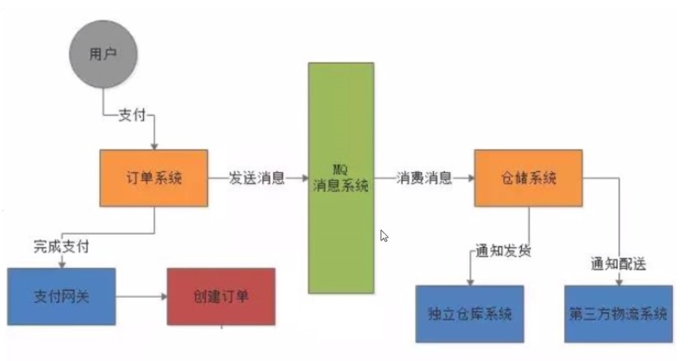

## 3 各个MQ产品的比较


## 4 RocketMQ重要概念【重点】

**Producer：消息的发送者，生产者；举例：发件人**

**Consumer：消息接收者，消费者；举例：收件人**

**Broker：暂存和传输消息的通道；举例：快递**

**NameServer：管理Broker；举例：各个快递公司的管理机构
相当于broker的注册中心，保留了broker的信息**

**Queue：队列，消息存放的位置，一个Broker中可以有多个队列**

**Topic：主题，消息的分类**

ProducerGroup：生产者组

ConsumerGroup：消费者组，多个消费者组可以同时消费一个主题的消息

**消息发送的流程**是，Producer询问NameServer，NameServer分配一个broker
然后Consumer也要询问NameServer，得到一个具体的broker，然后消费消息

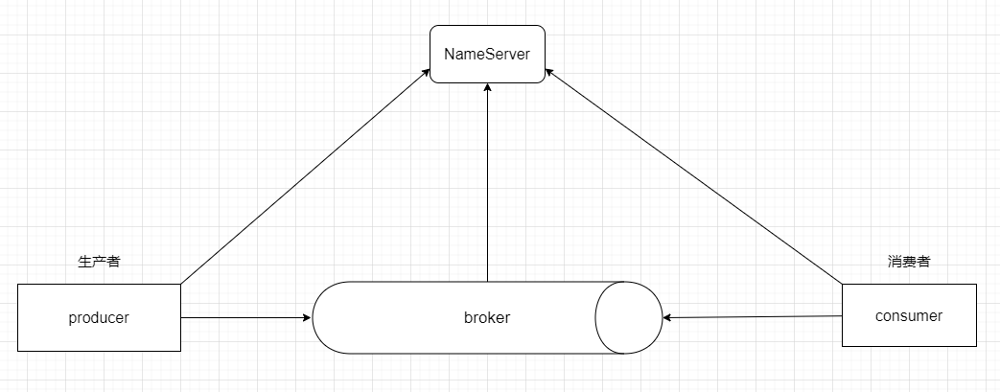

## 5 生产和消费理解【重点】

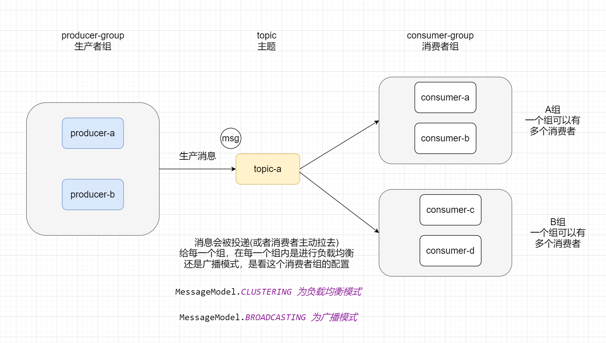

## 6 RocketMQ安装

了解了mq的基本概念和角色以后，我们开始安装rocketmq，建议在linux上

### 6.1 下载RocketMQ

下载地址：[[https://rocketmq.apache.org/dowloading/releases/]{.underline}](https://rocketmq.apache.org/dowloading/releases/)

注意选择版本，这里我们选择4.9.2的版本，后面使用alibaba时对应

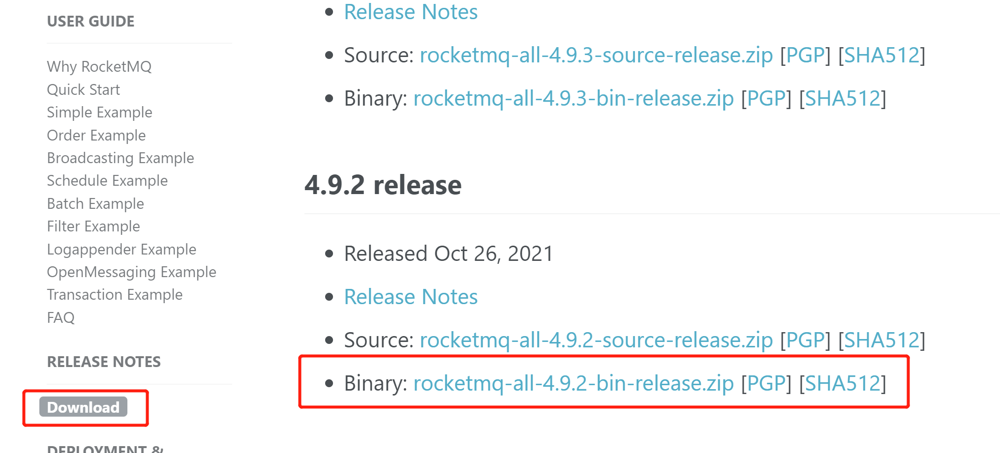

下载地址：https://archive.apache.org/dist/rocketmq/4.9.2/rocketmq-all-4.9.2-bin-release.zip

### 6.2 上传服务器

在root目录下创建文件夹

```
mkdir rocketmq
```

将下载后的压缩包上传到阿里云服务器或者虚拟机中去

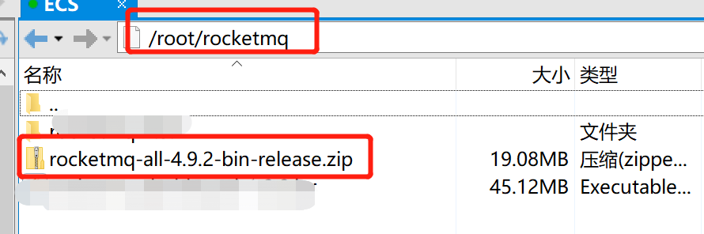

### 6.3 解压

```
unzip rocketmq-all-4.9.2-bin-release.zip
```

如果你的服务器没有unzip命令，则下载安装一个

```
yum install unzip
```

目录分析


```
Benchmark：包含一些性能测试的脚本；
Bin：可执行文件目录；
Conf：配置文件目录；
Lib：第三方依赖；
LICENSE：授权信息;
NOTICE：版本公告；
```


### 6.4 配置环境变量

```
  vim /etc/profile
```

在文件末尾添加

```
 export NAMESRV_ADDR=阿里云公网IP:9876
```

### 6.5 修改nameServer的运行脚本

```
  进入bin目录下，修改runserver.sh文件,将71行和76行的Xms和Xmx等改小一点
  
  vim runserver.sh
```


保存退出

### 修改broker的运行脚本

进入bin目录下，修改runbroker.sh文件,修改67行


保存退出

### 6.6 修改broker的配置文件

进入conf目录下，修改broker.conf文件

```
brokerClusterName = DefaultCluster
brokerName = broker-a
brokerId = 0
deleteWhen = 04
fileReservedTime = 48
brokerRole = ASYNC_MASTER
flushDiskType = ASYNC_FLUSH
namesrvAddr=localhost:9876
autoCreateTopicEnable=true
brokerIP1=阿里云公网IP(写公网ip,外网可以访问到的)
```

添加参数解释

namesrvAddr：nameSrv地址，可以写localhost因为nameSrv和broker在一个服务器

autoCreateTopicEnable：自动创建主题，不然需要手动创建出来

brokerIP1：broker也需要一个公网ip，如果不指定，那么是阿里云的内网地址，我们在本地无法连接使用

### 6.7 启动

首先在安装目录下创建一个logs文件夹，用于存放日志

```
mkdir logs
```


一次运行两条命令

启动nameSrv

```
nohup sh bin/mqnamesrv > ./logs/namesrv.log &
 
nohup  ./mqnamesrv  -c  ../conf/nameserver.properties  > /home/rocket_mq/nameserver_log/nohup.log 2>&1 &

```

启动broker 这里的-c是指定使用的配置文件

```
nohup sh bin/mqbroker -c conf/broker.conf > ./logs/broker.log &
 
nohup  ./mqbroker  -c  ../conf/broker.conf  > /home/rocket_mq/broker_log/nohup.log 2>&1 &
```

查看启动结果


### 6.8 RocketMQ控制台的安装RocketMQ-Console

Rocketmq 控制台可以可视化MQ的消息发送！

旧版本源码是在rocketmq-external里的rocketmq-console，新版本已经单独拆分成dashboard

网址：https://github.com/apache/rocketmq-dashboard

下载地址：https://github.com/apache/rocketmq-dashboard/archive/refs/tags/rocketmq-dashboard-1.0.0.zip

下载后解压出来，在跟目录下执行

```
mvn clean package -Dmaven.test.skip=true
```


将jar包上传到服务器上去


然后运行

```
nohup java -jar ./rocketmq-dashboard-1.0.0.jar  --rocketmq.config.namesrvAddr=127.0.0.1:9876 > ./rocketmq-4.9.3/logs/dashboard.log &

nohup java -jar rocketmq-console-ng-2.0.0.jar &
```

```
命令拓展:--server.port指定运行的端口
--rocketmq.config.namesrvAddr=127.0.0.1:9876 指定namesrv地址
```

访问： [http://localhost:8001](http://localhost:8081)

运行访问端口是8001，如果从官网拉下来打包的话，默认端口是8080


###  6.9  阿里云放行  nameServer 9876    broker 10100 - 11000


## 7 RocketMQ安装之docker

### 7.1 下载RockerMQ需要的镜像

```
docker pull rocketmqinc/rocketmq

docker pull styletang/rocketmq-console-ng
```

### 7.2 启动NameServer服务

#### 7.2.1 创建NameServer数据存储路径

```
mkdir -p /home/rocketmq/data/namesrv/logs /home/rocketmq/data/namesrv/store
```

#### 7.2.2 启动NameServer容器

```
docker run -d --name rmqnamesrv -p 9876:9876 -v /home/rocketmq/data/namesrv/logs:/root/logs -v /home/rocketmq/data/namesrv/store:/root/store -e "MAX_POSSIBLE_HEAP=100000000" rocketmqinc/rocketmq sh mqnamesrv
```


### 7.3 启动Broker服务

#### 7.3.1 创建Broker数据存储路径 

```
mkdir -p /home/rocketmq/data/broker/logs /home/rocketmq/data/broker/store
```

#### 7.3.2 创建conf配置文件目录

```
mkdir /home/rocketmq/conf
```

#### 7.3.3 在配置文件目录下创建broker.conf配置文件 

```
# 所属集群名称，如果节点较多可以配置多个
brokerClusterName = DefaultCluster
#broker名称，master和slave使用相同的名称，表明他们的主从关系
brokerName = broker-a
#0表示Master，大于0表示不同的slave
brokerId = 0
#表示几点做消息删除动作，默认是凌晨4点
deleteWhen = 04
#在磁盘上保留消息的时长，单位是小时
fileReservedTime = 48
#有三个值：SYNC_MASTER，ASYNC_MASTER，SLAVE；同步和异步表示Master和Slave之间同步数据的机制；
brokerRole = ASYNC_MASTER
#刷盘策略，取值为：ASYNC_FLUSH，SYNC_FLUSH表示同步刷盘和异步刷盘；SYNC_FLUSH消息写入磁盘后才返回成功状态，ASYNC_FLUSH不需要；
flushDiskType = ASYNC_FLUSH
# 设置broker节点所在服务器的ip地址
brokerIP1 = 你服务器外网ip
```


#### 7.3.4 启动Broker容器

```
docker run -d  --name rmqbroker --link rmqnamesrv:namesrv -p 10911:10911 -p 10909:10909 -v  /home/rocketmq/data/broker/logs:/root/logs -v /home/rocketmq/data/broker/store:/root/store -v /home/rocketmq/conf/broker.conf:/opt/rocketmq-4.4.0/conf/broker.conf --privileged=true -e "NAMESRV_ADDR=namesrv:9876" -e "MAX_POSSIBLE_HEAP=200000000" rocketmqinc/rocketmq sh mqbroker -c /opt/rocketmq-4.4.0/conf/broker.conf
```

### 7.4 启动控制台

```
docker run -d --name rmqadmin -e "JAVA_OPTS=-Drocketmq.namesrv.addr=你的外网地址:9876 \
-Dcom.rocketmq.sendMessageWithVIPChannel=false \
-Duser.timezone='Asia/Shanghai'" -v /etc/localtime:/etc/localtime -p 9999:8080 styletang/rocketmq-console-ng
```


### 7.5 正常启动后的docker ps 


### 7.6 访问控制台

```
http://你的服务器外网ip:9999/
```


## 8 RocketMQ快速入门

RocketMQ提供了发送多种发送消息的模式，例如同步消息，异步消息，顺序消息，延迟消息，事务消息等，我们一一学习

### 8.1 消息发送和监听的流程

我们先搞清楚消息发送和监听的流程，然后我们在开始敲代码

#### 8.1.1 消息生产者

```
1.创建消息生产者producer，并制定生产者组名
2.指定Nameserver地址
3.启动producer
4.创建消息对象，指定主题Topic、Tag和消息体等
5.发送消息
6.关闭生产者producer
```

#### 8.1.2 消息消费者

```
1.创建消费者consumer，制定消费者组名
2.指定Nameserver地址
3.创建监听订阅主题Topic和Tag等
4.处理消息
5.启动消费者consumer
```


### 8.2 搭建Rocketmq-demo

#### 8.2.1 加入依赖

```
<dependencies>
    <dependency>
        <groupId>org.apache.rocketmq</groupId>
        <artifactId>rocketmq-client</artifactId>
        <version>4.9.2</version>
        <!--docker的用下面这个版本-->
<version>4.4.0</version>
    </dependency>
    <dependency>
        <groupId>junit</groupId>
        <artifactId>junit</artifactId>
        <version>4.12</version>
    </dependency>
    <dependency>
        <groupId>org.projectlombok</groupId>
        <artifactId>lombok</artifactId>
        <version>1.18.22</version>
    </dependency>
</dependencies>
```


#### 8.2.2 编写生产者

```
/**
 * 测试生产者
 *
 * @throws Exception
 */
@Test
public void testProducer() throws Exception {
    // 创建默认的生产者
    DefaultMQProducer producer = new DefaultMQProducer("test-group");
    // 设置nameServer地址
    producer.setNamesrvAddr("localhost:9876");
    // 启动实例
    producer.start();
    for (int i = 0; i < 10; i++) {
        // 创建消息
        // 第一个参数：主题的名字
        // 第二个参数：消息内容
        Message msg = new Message("TopicTest", ("Hello RocketMQ " + i).getBytes());
        SendResult send = producer.send(msg);
        System.out.println(send);
    }
    // 关闭实例
    producer.shutdown();
}
```


#### 8.2.3 编写消费者

```
   /**
     * 测试消费者
     *
     * @throws Exception
     */
    @Test
    public void testConsumer() throws Exception {
        // 创建默认消费者组
        DefaultMQPushConsumer consumer = new DefaultMQPushConsumer("consumer-group");
        // 设置nameServer地址
        consumer.setNamesrvAddr("localhost:9876");
        // 订阅一个主题来消费   *表示没有过滤参数 表示这个主题的任何消息
        consumer.subscribe("TopicTest", "*");
        // 注册一个消费监听 MessageListenerConcurrently 是多线程消费，默认20个线程，可以参看consumer.setConsumeThreadMax()
        consumer.registerMessageListener(new MessageListenerConcurrently() {
            @Override
            public ConsumeConcurrentlyStatus consumeMessage(List<MessageExt> msgs,
                                                            ConsumeConcurrentlyContext context) {
                System.out.println(Thread.currentThread().getName() + "----" + msgs);
                // 返回消费的状态 如果是CONSUME_SUCCESS 则成功，若为RECONSUME_LATER则该条消息会被重回队列，重新被投递
                // 重试的时间为messageDelayLevel = "1s 5s 10s 30s 1m 2m 3m 4m 5m 6m 7m 8m 9m 10m 20m 30m 1h 2h
                // 也就是第一次1s 第二次5s 第三次10s  ....  如果重试了18次 那么这个消息就会被终止发送给消费者
//                return ConsumeConcurrentlyStatus.CONSUME_SUCCESS;
                return ConsumeConcurrentlyStatus.RECONSUME_LATER;
            }
        });
        // 这个start一定要写在registerMessageListener下面
        consumer.start();
        System.in.read();
    }
```


#### 8.2.4 测试

启动生产者和消费者进行测试

## 9 消费模式

MQ的消费模式可以大致分为两种，一种是推Push，一种是拉Pull。

Push是服务端【MQ】主动推送消息给客户端，优点是及时性较好，但如果客户端没有做好流控，一旦服务端推送大量消息到客户端时，就会导致客户端消息堆积甚至崩溃。

Pull是客户端需要主动到服务端取数据，优点是客户端可以依据自己的消费能力进行消费，但拉取的频率也需要用户自己控制，拉取频繁容易造成服务端和客户端的压力，拉取间隔长又容易造成消费不及时。

Push模式也是基于pull模式的，只能客户端内部封装了api，一般场景下，上游消息生产量小或者均速的时候，选择push模式。在特殊场景下，例如电商大促，抢优惠券等场景可以选择pull模式

## 10 RocketMQ发送同步消息

上面的快速入门就是发送同步消息，发送过后会有一个返回值，也就是mq服务器接收到消息后返回的一个确认，这种方式非常安全，但是性能上并没有这么高，而且在mq集群中，也是要等到所有的从机都复制了消息以后才会返回，所以针对重要的消息可以选择这种方式

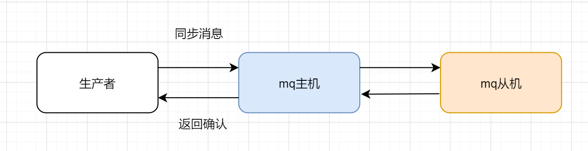

## 11 RocketMQ发送异步消息

异步消息通常用在对响应时间敏感的业务场景，即发送端不能容忍长时间地等待Broker的响应。发送完以后会有一个异步消息通知

### 11.1 异步消息生产者

```java
@Test
public void testAsyncProducer() throws Exception {
    // 创建默认的生产者
    DefaultMQProducer producer = new DefaultMQProducer("test-group");
    // 设置nameServer地址
    producer.setNamesrvAddr("localhost:9876");
    // 启动实例
    producer.start();
    Message msg = new Message("TopicTest", ("异步消息").getBytes());
    producer.send(msg, new SendCallback() {
        @Override
        public void onSuccess(SendResult sendResult) {
            System.out.println("发送成功");
        }
        @Override
        public void onException(Throwable e) {
            System.out.println("发送失败");
        }
    });
    System.out.println("看看谁先执行");
    // 挂起jvm 因为回调是异步的不然测试不出来
    System.in.read();
    // 关闭实例
    producer.shutdown();
}
```


### 11.2 异步消息消费者

```java
@Test
public void testAsyncConsumer() throws Exception {
    // 创建默认消费者组
    DefaultMQPushConsumer consumer = new DefaultMQPushConsumer("consumer-group");
    // 设置nameServer地址
    consumer.setNamesrvAddr("localhost:9876");
    // 订阅一个主题来消费   *表示没有过滤参数 表示这个主题的任何消息
    consumer.subscribe("TopicTest", "*");
    // 注册一个消费监听 MessageListenerConcurrently是并发消费
    // 默认是20个线程一起消费，可以参看 consumer.setConsumeThreadMax()
    consumer.registerMessageListener(new MessageListenerConcurrently() {
        @Override
        public ConsumeConcurrentlyStatus consumeMessage(List<MessageExt> msgs,
                                                        ConsumeConcurrentlyContext context) {
            // 这里执行消费的代码 默认是多线程消费
            System.out.println(Thread.currentThread().getName() + "----" + msgs);
            return ConsumeConcurrentlyStatus.CONSUME_SUCCESS;
        }
    });
    consumer.start();
    System.in.read();
}
```


## 12 RocketMQ发送单向消息

这种方式主要用在不关心发送结果的场景，这种方式吞吐量很大，但是存在消息丢失的风险，例如日志信息的发送

### 12.1 单向消息生产者

```
@Test
public void testOnewayProducer() throws Exception {
    // 创建默认的生产者
    DefaultMQProducer producer = new DefaultMQProducer("test-group");
    // 设置nameServer地址
    producer.setNamesrvAddr("localhost:9876");
    // 启动实例
    producer.start();
    Message msg = new Message("TopicTest", ("单向消息").getBytes());
    // 发送单向消息
    producer.sendOneway(msg);
    // 关闭实例
    producer.shutdown();
}
```


### 12.2 单向消息消费者

消费者和上面一样

## 13 RocketMQ发送延迟消息

消息放入mq后，过一段时间，才会被监听到，然后消费

比如下订单业务，提交了一个订单就可以发送一个延时消息，30min后去检查这个订单的状态，如果还是未付款就取消订单释放库存。

### 13.1 延迟消息生产者

```java
@Test
public void testDelayProducer() throws Exception {
    // 创建默认的生产者
    DefaultMQProducer producer = new DefaultMQProducer("test-group");
    // 设置nameServer地址
    producer.setNamesrvAddr("localhost:9876");
    // 启动实例
    producer.start();
    Message msg = new Message("TopicTest", ("延迟消息").getBytes());
    // 给这个消息设定一个延迟等级
    // messageDelayLevel = "1s 5s 10s 30s 1m 2m 3m 4m 5m 6m 7m 8m 9m 10m 20m 30m 1h 2h
    msg.setDelayTimeLevel(3);
    // 发送单向消息
    producer.send(msg);
    // 打印时间
    System.out.println(new Date());
    // 关闭实例
    producer.shutdown();
}
```


### 13.2 延迟消息消费者

消费者和上面一样

这里注意的是RocketMQ不支持任意时间的延时

只支持以下几个固定的延时等级，等级1就对应1s，以此类推，最高支持2h延迟

```
private String messageDelayLevel = "1s 5s 10s 30s 1m 2m 3m 4m 5m 6m 7m 8m 9m 10m 20m 30m 1h 2h";
```


## 14 RocketMQ发送顺序消息

消息有序指的是可以**按照消息的发送顺序来消费**(FIFO)。RocketMQ可以严格的保证消息有序，可以分为：分区有序或者全局有序。

可能大家会有疑问，mq不就是FIFO吗？

rocketMq的broker的机制，导致了rocketMq会有这个问题

因为一个broker中对应了四个queue

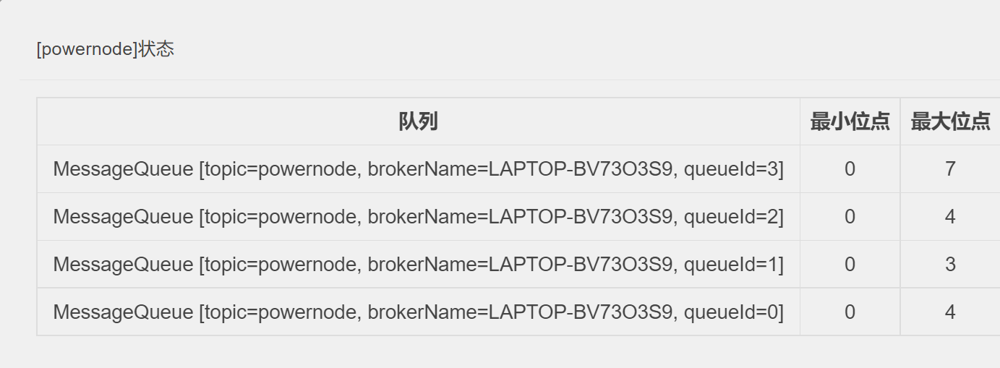

顺序消费的原理解析，在默认的情况下消息发送会采取Round
Robin轮询方式把消息发送到不同的queue(分区队列)；而消费消息的时候从多个queue上拉取消息，这种情况发送和消费是不能保证顺序。但是如果控制发送的顺序消息只依次发送到同一个queue中，消费的时候只从这个queue上依次拉取，则就保证了顺序。当发送和消费参与的queue只有一个，则是全局有序；如果多个queue参与，则为分区有序，即相对每个queue，消息都是有序的。

下面用订单进行分区有序的示例。一个订单的顺序流程是：下订单、发短信通知、物流、签收。订单顺序号相同的消息会被先后发送到同一个队列中，消费时，同一个顺序获取到的肯定是同一个队列。

### 14.1 场景分析

模拟一个订单的发送流程，创建两个订单，发送的消息分别是

订单号111 消息流程 下订单-\>物流-\>签收

订单号112 消息流程 下订单-\>物流-\>拒收

### 14.2 创建一个订单对象

```
@Data
@AllArgsConstructor
@NoArgsConstructor
public class Order {
    /**
     * 订单id
     */
    private Integer orderId;

    /**
     * 订单编号
     */
    private Integer orderNumber;
    
    /**
     * 订单价格
     */
    private Double price;

    /**
     * 订单号创建时间
     */
    private Date createTime;

    /**
     * 订单描述
     */
    private String desc;

}
```


### 14.3 顺序消息生产者

```
@Test
public void testOrderlyProducer() throws Exception {
    // 创建默认的生产者
    DefaultMQProducer producer = new DefaultMQProducer("test-group");
    // 设置nameServer地址
    producer.setNamesrvAddr("localhost:9876");
    // 启动实例
    producer.start();
    List<Order> orderList = Arrays.asList(
            new Order(1, 111, 59D, new Date(), "下订单"),
            new Order(2, 111, 59D, new Date(), "物流"),
            new Order(3, 111, 59D, new Date(), "签收"),
            new Order(4, 112, 89D, new Date(), "下订单"),
            new Order(5, 112, 89D, new Date(), "物流"),
            new Order(6, 112, 89D, new Date(), "拒收")
    );
    // 循环集合开始发送
    orderList.forEach(order -> {
        Message message = new Message("TopicTest", order.toString().getBytes());
        try {
            // 发送的时候 相同的订单号选择同一个队列
            producer.send(message, new MessageQueueSelector() {
                @Override
                public MessageQueue select(List<MessageQueue> mqs, Message msg, Object arg) {
                    // 当前主题有多少个队列
                    int queueNumber = mqs.size();
                    // 这个arg就是后面传入的 order.getOrderNumber()
                    Integer i = (Integer) arg;
                    // 用这个值去%队列的个数得到一个队列
                    int index = i % queueNumber;
                    // 返回选择的这个队列即可 ，那么相同的订单号 就会被放在相同的队列里 实现FIFO了
                    return mqs.get(index);
                }
            }, order.getOrderNumber());
        } catch (Exception e) {
            System.out.println("发送异常");
        }
    });
    // 关闭实例
    producer.shutdown();
}
```


### 14.4 顺序消息消费者，测试时等一会即可有延迟

```
@Test
public void testOrderlyConsumer() throws Exception {
    // 创建默认消费者组
        DefaultMQPushConsumer consumer = new DefaultMQPushConsumer("consumer-group");
    // 设置nameServer地址
    consumer.setNamesrvAddr("localhost:9876");
    // 订阅一个主题来消费   *表示没有过滤参数 表示这个主题的任何消息
    consumer.subscribe("TopicTest", "*");
    // 注册一个消费监听 MessageListenerOrderly 是顺序消费 单线程消费
    consumer.registerMessageListener(new MessageListenerOrderly() {
        @Override
        public ConsumeOrderlyStatus consumeMessage(List<MessageExt> msgs, ConsumeOrderlyContext context) {
            MessageExt messageExt = msgs.get(0);
            System.out.println(new String(messageExt.getBody()));
            return ConsumeOrderlyStatus.SUCCESS;
        }
    });
    consumer.start();
    System.in.read();
}
```


## 15 RocketMQ发送批量消息

Rocketmq可以一次性发送一组消息，那么这一组消息会被当做一个消息消费

### 15.1 批量消息生产者

```java
@Test
public void testBatchProducer() throws Exception {
    // 创建默认的生产者
    DefaultMQProducer producer = new DefaultMQProducer("test-group");
    // 设置nameServer地址
    producer.setNamesrvAddr("localhost:9876");
    // 启动实例
    producer.start();
    List<Message> msgs = Arrays.asList(
            new Message("TopicTest", "我是一组消息的A消息".getBytes()),
            new Message("TopicTest", "我是一组消息的B消息".getBytes()),
            new Message("TopicTest", "我是一组消息的C消息".getBytes())

    );
    SendResult send = producer.send(msgs);
    System.out.println(send);
    // 关闭实例
    producer.shutdown();
}
```


### 15.2 批量消息消费者

```java
@Test
public void testBatchConsumer() throws Exception {
    // 创建默认消费者组
    DefaultMQPushConsumer consumer = new DefaultMQPushConsumer("consumer-group");
    // 设置nameServer地址
    consumer.setNamesrvAddr("localhost:9876");
    // 订阅一个主题来消费   表达式，默认是*
        consumer.subscribe("TopicTest", "*");
    // 注册一个消费监听 MessageListenerConcurrently是并发消费
    // 默认是20个线程一起消费，可以参看 consumer.setConsumeThreadMax()
    consumer.registerMessageListener(new MessageListenerConcurrently() {
        @Override
        public ConsumeConcurrentlyStatus consumeMessage(List<MessageExt> msgs,
                                                        ConsumeConcurrentlyContext context) {
            // 这里执行消费的代码 默认是多线程消费
            System.out.println(Thread.currentThread().getName() + "----" + new String(msgs.get(0).getBody()));
            return ConsumeConcurrentlyStatus.CONSUME_SUCCESS;
        }
    });
    consumer.start();
    System.in.read();
}
```


## 16 RocketMQ发送事务消息

### 16.1 事务消息的发送流程

它可以被认为是一个两阶段的提交消息实现，以确保分布式系统的最终一致性。事务性消息确保本地事务的执行和消息的发送可以原子地执行。

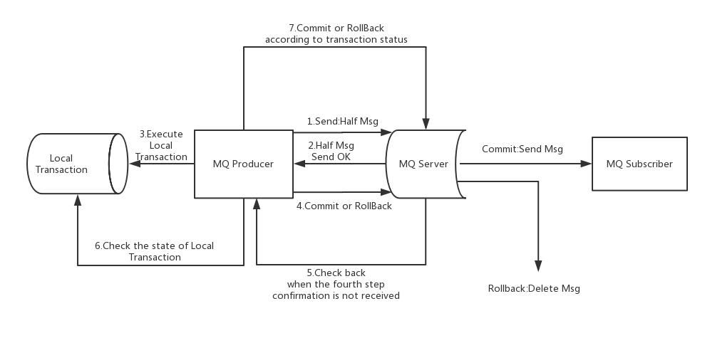

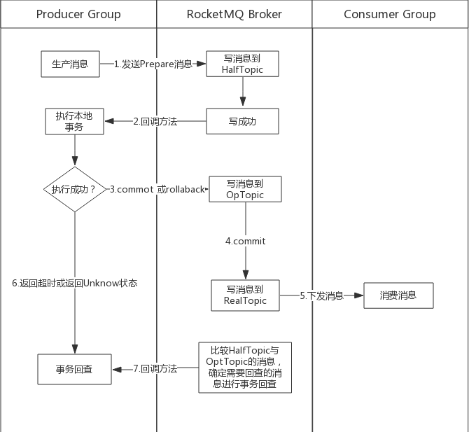

上图说明了事务消息的大致方案，其中分为两个流程：正常事务消息的发送及提交、事务消息的补偿流程。

**事务消息发送及提交**

1.  发送消息（half消息）。

2.  服务端响应消息写入结果。

3.  根据发送结果执行本地事务（如果写入失败，此时half消息对业务不可见，本地逻辑不执行）。

4.  根据本地事务状态执行Commit或Rollback（Commit操作生成消息索引，消息对消费者可见）

**事务补偿**

1.  对没有Commit/Rollback的事务消息（pending状态的消息），从服务端发起一次"回查"

2.  Producer收到回查消息，检查回查消息对应的本地事务的状态

3.  根据本地事务状态，重新Commit或者Rollback

其中，补偿阶段用于解决消息UNKNOW或者Rollback发生超时或者失败的情况。

**事务消息状态**

事务消息共有三种状态，提交状态、回滚状态、中间状态：

-   TransactionStatus.CommitTransaction:
    提交事务，它允许消费者消费此消息。

-   TransactionStatus.RollbackTransaction:
    回滚事务，它代表该消息将被删除，不允许被消费。

-   TransactionStatus.Unknown:
    中间状态，它代表需要检查消息队列来确定状态。

### 16.2 事务消息生产者

```java
/**
 * TransactionalMessageCheckService的检测频率默认1分钟，可通过在broker.conf文件中设置transactionCheckInterval的值来改变默认值，单位为毫秒。
 * 从broker配置文件中获取transactionTimeOut参数值。
 * 从broker配置文件中获取transactionCheckMax参数值，表示事务的最大检测次数，如果超过检测次数，消息会默认为丢弃，即回滚消息。
 *
 * @throws Exception
 */
@Test
public void testTransactionProducer() throws Exception {
    // 创建一个事务消息生产者
    TransactionMQProducer producer = new TransactionMQProducer("test-group");
    producer.setNamesrvAddr("localhost:9876");
    // 设置事务消息监听器
    producer.setTransactionListener(new TransactionListener() {
        // 这个是执行本地业务方法
        @Override
        public LocalTransactionState executeLocalTransaction(Message msg, Object arg) {
            System.out.println(new Date());
            System.out.println(new String(msg.getBody()));
            // 这个可以使用try catch对业务代码进行性包裹
            // COMMIT_MESSAGE 表示允许消费者消费该消息
            // ROLLBACK_MESSAGE 表示该消息将被删除，不允许消费
            // UNKNOW表示需要MQ回查才能确定状态 那么过一会 代码会走下面的checkLocalTransaction(msg)方法
            return LocalTransactionState.UNKNOW;
        }

        // 这里是回查方法 回查不是再次执行业务操作，而是确认上面的操作是否有结果
        // 默认是1min回查 默认回查15次 超过次数则丢弃打印日志 可以通过参数设置
        // transactionTimeOut 超时时间
        // transactionCheckMax 最大回查次数
        // transactionCheckInterval 回查间隔时间单位毫秒
        // 触发条件
        // 1.当上面执行本地事务返回结果UNKNOW时,或者下面的回查方法也返回UNKNOW时 会触发回查
        // 2.当上面操作超过20s没有做出一个结果，也就是超时或者卡主了，也会进行回查
                @Override
        public LocalTransactionState checkLocalTransaction(MessageExt msg) {
            System.err.println(new Date());
            System.err.println(new String(msg.getBody()));
            // 这里
            return LocalTransactionState.UNKNOW;
        }
    });
    producer.start();
    Message message = new Message("TopicTest2", "我是一个事务消息".getBytes());
    // 发送消息
    producer.sendMessageInTransaction(message, null);
    System.out.println(new Date());
    System.in.read();
}
```


### 16.3 事务消息消费者

```java
@Test
public void testTransactionConsumer() throws Exception {
    // 创建默认消费者组
    DefaultMQPushConsumer consumer = new DefaultMQPushConsumer("consumer-group");
    // 设置nameServer地址
    consumer.setNamesrvAddr("localhost:9876");
    // 订阅一个主题来消费   *表示没有过滤参数 表示这个主题的任何消息
    consumer.subscribe("TopicTest2", "*");
    // 注册一个消费监听 MessageListenerConcurrently是并发消费
    // 默认是20个线程一起消费，可以参看 consumer.setConsumeThreadMax()
    consumer.registerMessageListener(new MessageListenerConcurrently() {
        @Override
        public ConsumeConcurrentlyStatus consumeMessage(List<MessageExt> msgs,
                                                        ConsumeConcurrentlyContext context) {
            // 这里执行消费的代码 默认是多线程消费
            System.out.println(Thread.currentThread().getName() + "----" + new String(msgs.get(0).getBody()));
            return ConsumeConcurrentlyStatus.CONSUME_SUCCESS;
        }
    });
    consumer.start();
    System.in.read();
}
```


### 16.4 测试结果

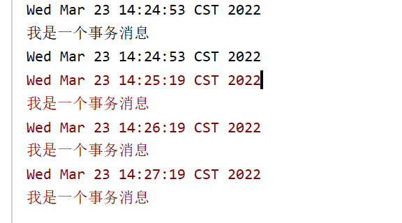

## 17 RocketMQ发送带标签的消息，消息过滤

Rocketmq提供消息过滤功能，通过tag或者key进行区分

我们往一个主题里面发送消息的时候，根据业务逻辑，可能需要区分，比如带有tagA标签的被A消费，带有tagB标签的被B消费，还有在事务监听的类里面，只要是事务消息都要走同一个监听，我们也需要通过过滤才区别对待

### 17.1 标签消息生产者

```
@Test
public void testTagProducer() throws Exception {
    // 创建默认的生产者
    DefaultMQProducer producer = new DefaultMQProducer("test-group");
    // 设置nameServer地址
    producer.setNamesrvAddr("localhost:9876");
    // 启动实例
    producer.start();
    Message msg = new Message("TopicTest","tagA", "我是一个带标记的消息".getBytes());
    SendResult send = producer.send(msg);
    System.out.println(send);
    // 关闭实例
    producer.shutdown();
}
```


### 17.2 标签消息消费者

```
@Test
public void testTagConsumer() throws Exception {
    // 创建默认消费者组
    DefaultMQPushConsumer consumer = new DefaultMQPushConsumer("consumer-group");
    // 设置nameServer地址
    consumer.setNamesrvAddr("localhost:9876");
    // 订阅一个主题来消费   表达式，默认是*,支持"tagA || tagB || tagC" 这样或者的写法 只要是符合任何一个标签都可以消费
    consumer.subscribe("TopicTest", "tagA || tagB || tagC");
    // 注册一个消费监听 MessageListenerConcurrently是并发消费
    // 默认是20个线程一起消费，可以参看 consumer.setConsumeThreadMax()
    consumer.registerMessageListener(new MessageListenerConcurrently() {
        @Override
        public ConsumeConcurrentlyStatus consumeMessage(List<MessageExt> msgs,
                                                        ConsumeConcurrentlyContext context) {
            // 这里执行消费的代码 默认是多线程消费
            System.out.println(Thread.currentThread().getName() + "----" + new String(msgs.get(0).getBody()));
            System.out.println(msgs.get(0).getTags());
            return ConsumeConcurrentlyStatus.CONSUME_SUCCESS;
        }
    });
    consumer.start();
    System.in.read();
}
```


### 17.3 什么时候该用 Topic，什么时候该用 Tag？

总结：不同的业务应该使用不同的Topic如果是相同的业务里面有不同表的表现形式，那么我们要使用tag进行区分

可以从以下几个方面进行判断：

1.消息类型是否一致：如普通消息、事务消息、定时（延时）消息、顺序消息，不同的消息类型使用不同的
Topic，无法通过 Tag 进行区分。

2.业务是否相关联：没有直接关联的消息，如淘宝交易消息，京东物流消息使用不同的
Topic
进行区分；而同样是天猫交易消息，电器类订单、女装类订单、化妆品类订单的消息可以用
Tag 进行区分。

3.消息优先级是否一致：如同样是物流消息，盒马必须小时内送达，天猫超市 24
小时内送达，淘宝物流则相对会慢一些，不同优先级的消息用不同的 Topic
进行区分。

4.消息量级是否相当：有些业务消息虽然量小但是实时性要求高，如果跟某些万亿量级的消息使用同一个
Topic，则有可能会因为过长的等待时间而"饿死"，此时需要将不同量级的消息进行拆分，使用不同的
Topic。

**总的来说，针对消息分类，您可以选择创建多个 Topic，或者在同一个 Topic
下创建多个 Tag。但通常情况下，不同的 Topic 之间的消息没有必然的联系，而
Tag 则用来区分同一个 Topic
下相互关联的消息，例如全集和子集的关系、流程先后的关系。**

## 18 RocketMQ中消息的Key

在rocketmq中的消息，默认会有一个messageId当做消息的唯一标识，我们也可以给消息携带一个key，用作唯一标识或者业务标识，包括在控制面板查询的时候也可以使用messageId或者key来进行查询

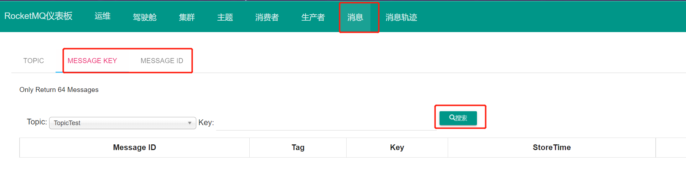

### 18.1 带key消息生产者

```java
@Test
public void testKeyProducer() throws Exception {
    // 创建默认的生产者
    DefaultMQProducer producer = new DefaultMQProducer("test-group");
    // 设置nameServer地址
    producer.setNamesrvAddr("localhost:9876");
    // 启动实例
    producer.start();
    Message msg = new Message("TopicTest","tagA","key", "我是一个带标记和key的消息".getBytes());
    SendResult send = producer.send(msg);
    System.out.println(send);
    // 关闭实例
    producer.shutdown();
}
```


### 18.2 带key消息消费者

```java
@Test
public void testKeyConsumer() throws Exception {
    // 创建默认消费者组
    DefaultMQPushConsumer consumer = new DefaultMQPushConsumer("consumer-group");
    // 设置nameServer地址
    consumer.setNamesrvAddr("localhost:9876");
    // 订阅一个主题来消费   表达式，默认是*,支持"tagA || tagB || tagC" 这样或者的写法 只要是符合任何一个标签都可以消费
    consumer.subscribe("TopicTest", "tagA || tagB || tagC");
    // 注册一个消费监听 MessageListenerConcurrently是并发消费
    // 默认是20个线程一起消费，可以参看 consumer.setConsumeThreadMax()
    consumer.registerMessageListener(new MessageListenerConcurrently() {
        @Override
        public ConsumeConcurrentlyStatus consumeMessage(List<MessageExt> msgs,
                                                        ConsumeConcurrentlyContext context) {
            // 这里执行消费的代码 默认是多线程消费
            System.out.println(Thread.currentThread().getName() + "----" + new String(msgs.get(0).getBody()));
            System.out.println(msgs.get(0).getTags());
            System.out.println(msgs.get(0).getKeys());
            return ConsumeConcurrentlyStatus.CONSUME_SUCCESS;
        }
    });
    consumer.start();
    System.in.read();
}
```

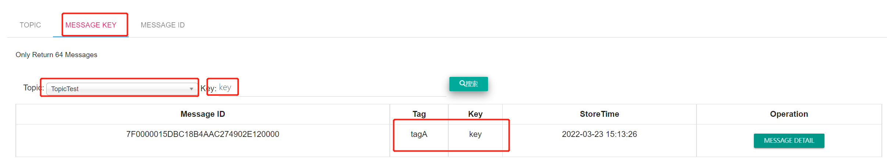

## 19 RocketMQ重试机制

### 19.1 生产者重试

```java
// 失败的情况重发3次
producer.setRetryTimesWhenSendFailed(3);

// 消息在1S内没有发送成功，就会重试
producer.send(msg, 1000);
```


### 19.2 消费者重试

在消费者放return
ConsumeConcurrentlyStatus.RECONSUME_LATER;后就会执行重试

上图代码中说明了，我们再实际生产过程中，一般重试3-5次，如果还没有消费成功，则可以把消息签收了，通知人工等处理

**自定义重试次数**
**消费者默认重试16次,重试时间与延时队列时间相同,不过是第一次重试是从10s开始的 ,10s 30s 1m ..., 可以自定义重试次数**
```java
//设置重试次数一般为5 次
consumer.setMaxReconsumeTimes(2)
```
**重试16次之后，消息会放在死信消息队列中,消费者并发模式下会重试16次,顺序模式下重试int最大值次**


```java
/**
 * 测试消费者
 *
 * @throws Exception
 */
@Test
public void testConsumer() throws Exception {
    // 创建默认消费者组
    DefaultMQPushConsumer consumer = new DefaultMQPushConsumer("consumer-group");
    // 设置nameServer地址
    consumer.setNamesrvAddr("localhost:9876");
    // 订阅一个主题来消费   *表示没有过滤参数 表示这个主题的任何消息
    consumer.subscribe("TopicTest", "*");
    // 注册一个消费监听
    consumer.registerMessageListener(new MessageListenerConcurrently() {
        @Override
        public ConsumeConcurrentlyStatus consumeMessage(List<MessageExt> msgs,
                                                        ConsumeConcurrentlyContext context) {
            try {
                // 这里执行消费的代码
                System.out.println(Thread.currentThread().getName() + "----" + msgs);
                // 这里制造一个错误
                int i = 10 / 0;
            } catch (Exception e) {
                // 出现问题 判断重试的次数
                MessageExt messageExt = msgs.get(0);
                // 获取重试的次数 失败一次消息中的失败次数会累加一次
                int reconsumeTimes = messageExt.getReconsumeTimes();
                if (reconsumeTimes >= 3) {
                    // 则把消息确认了，可以将这条消息记录到日志或者数据库 通知人工处理
                    return ConsumeConcurrentlyStatus.CONSUME_SUCCESS;
                } else {
                    return ConsumeConcurrentlyStatus.RECONSUME_LATER;
                }
            }
            return ConsumeConcurrentlyStatus.CONSUME_SUCCESS;
                    }
    });
    consumer.start();
    System.in.read();
}
```


## 20 RocketMQ死信消息

当消费重试到达阈值以后，消息不会被投递给消费者了，而是进入了死信队列

当一条消息初次消费失败，RocketMQ会自动进行消息重试，达到最大重试次数后，若消费依然失败，则表明消费者在正常情况下无法正确地消费该消息。此时，该消息不会立刻被丢弃，而是将其发送到该消费者对应的特殊队列中，这类消息称为死信消息（Dead-Letter
Message），存储死信消息的特殊队列称为死信队列（Dead-Letter
Queue），死信队列是死信Topic下分区数唯一的单独队列。如果产生了死信消息，那对应的ConsumerGroup的死信Topic名称为%DLQ%ConsumerGroupName，死信队列的消息将不会再被消费。可以利用RocketMQ
Admin工具或者RocketMQ
Dashboard上查询到对应死信消息的信息。我们也可以去监听死信队列，然后进行自己的业务上的逻辑

**处理方式**

**一种是监听死信队列,在死信队列中定义逻辑**

**另一种是在消费者中try..catch 业务逻辑,try中执行正常逻辑，返回broker成功 , 在catch中 获取重试次数, 然后定义重试次数大于多少次之后执行死信逻辑,签收，返回broker成功,否则在继续返回broker重试**
```java
message.getReconsumeTimes()

```

### 20.1 消息生产者

```java
@Test
public void testDeadMsgProducer() throws Exception {
    DefaultMQProducer producer = new DefaultMQProducer("dead-group");
    producer.setNamesrvAddr("localhost:9876");
    producer.start();
    Message message = new Message("dead-topic", "我是一个死信消息".getBytes());
    producer.send(message);
    producer.shutdown();
}
```


### 20.2 消息消费者

```java
@Test
public void testDeadMsgConsumer() throws Exception {
    DefaultMQPushConsumer consumer = new DefaultMQPushConsumer("dead-group");
    consumer.setNamesrvAddr("localhost:9876");
    consumer.subscribe("dead-topic", "*");
    // 设置最大消费重试次数 2 次
    consumer.setMaxReconsumeTimes(2);
    consumer.registerMessageListener(new MessageListenerConcurrently() {
        @Override
        public ConsumeConcurrentlyStatus consumeMessage(List<MessageExt> msgs, ConsumeConcurrentlyContext context) {
            System.out.println(msgs);
            // 测试消费失败
            return ConsumeConcurrentlyStatus.RECONSUME_LATER;
        }
    });
    consumer.start();
    System.in.read();
    }
```


### 20.3 死信消费者 

注意权限问题 2 只能读不能写  4 只能写不能读 6 可写可读


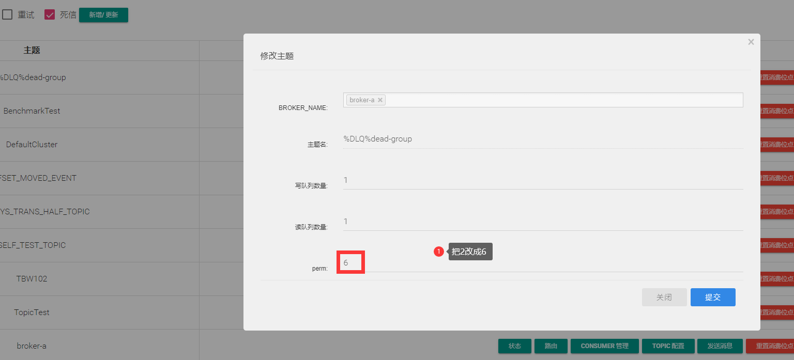

```java
@Test
public void testDeadMq() throws  Exception{
    DefaultMQPushConsumer consumer = new DefaultMQPushConsumer("dead-group");
    consumer.setNamesrvAddr("localhost:9876");
    // 消费重试到达阈值以后，消息不会被投递给消费者了，而是进入了死信队列
    // 队列名称 默认是 %DLQ% + 消费者组名
    consumer.subscribe("%DLQ%dead-group", "*");
    consumer.registerMessageListener(new MessageListenerConcurrently() {
        @Override
        public ConsumeConcurrentlyStatus consumeMessage(List<MessageExt> msgs, ConsumeConcurrentlyContext context) {
            System.out.println(msgs);
            // 处理消息 签收了
            return ConsumeConcurrentlyStatus.CONSUME_SUCCESS;
        }
    });
    consumer.start();
    System.in.read();
}
```


### 20.4 控制台显示

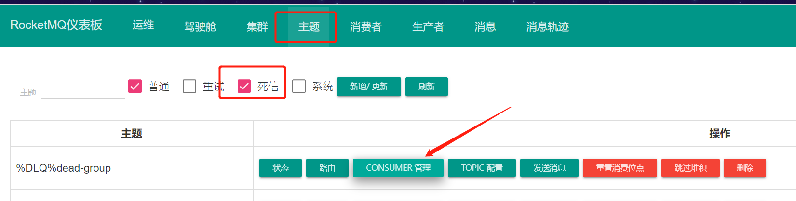

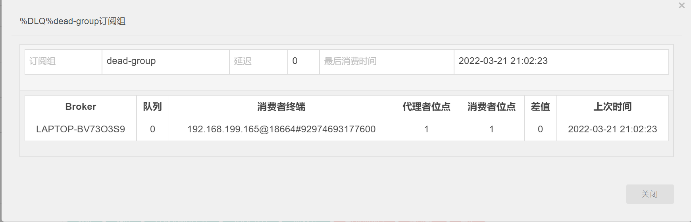

## 21 RocketMQ消息重复消费问题

### 21.1 为什么会出现重复消费问题呢？

BROADCASTING(广播)模式下，所有注册的消费者都会消费，而这些消费者通常是集群部署的一个个微服务，这样就会多台机器重复消费，当然这个是根据需要来选择。

CLUSTERING（负载均衡）模式下，如果一个topic被多个consumerGroup消费，也会重复消费。

即使是在CLUSTERING模式下，同一个consumerGroup下，一个队列只会分配给一个消费者，看起来好像是不会重复消费。但是，有个特殊情况：一个消费者新上线后，同组的所有消费者要重新负载均衡（反之一个消费者掉线后，也一样）。一个队列所对应的新的消费者要获取之前消费的offset（偏移量，也就是消息消费的点位），此时之前的消费者可能已经消费了一条消息，但是并没有把offset提交给broker，那么新的消费者可能会重新消费一次。虽然orderly模式是前一个消费者先解锁，后一个消费者加锁再消费的模式，比起concurrently要严格了，但是加锁的线程和提交offset的线程不是同一个，所以还是会出现极端情况下的重复消费。

还有在发送批量消息的时候，会被当做一条消息进行处理，那么如果批量消息中有一条业务处理成功，其他失败了，还是会被重新消费一次。

**那么如果在CLUSTERING（负载均衡）模式下，并且在同一个消费者组中，不希望一条消息被重复消费，改怎么办呢？我们可以想到去重操作，找到消息唯一的标识，可以是msgId也可以是你自定义的唯一的key，这样就可以去重了**

**如果同一条消息，发送者主动发送两次会产生重复消费问题或者发送者发送第一次，消费者消费但是没返回成功，发送者会重试重新发送，产生重复消费问题，或者消费者的重新负载均衡ReBalance也会造成重复消费的问题，假如一开始在同组下只有一个消费者，第一个消费者消费开始消费，此时broker中的点位未移动，表示还没有消费完成，第二个同组消费者进来，进行重排序，假如第二个消费者会消费对应的队列上的消息，正好此时第一个消费者尚未消费完成，第二个消费者则会收到消息的推送，从而继续消费，造成重复消费**

**解决重复消费问题:发送者发送消息的时候带着key(特殊业务逻辑字段)，创建去重表(添加业务逻辑字段,创建唯一索引),消费者消费时先插入数据库该字段,索引重复报错,收集异常,并返回给broker消费成功,但是不执行后续业务逻辑,无报错则执行后续业务逻辑,try...catch...后续逻辑,如果业务报错,删除去重表中的数据**

**幂等性**
**多次操作产生的影响均和第一次操作产生的额影响相同**
**新增,主键自增,无唯一索引,是非幂等的,即每次操作都不一样,有唯一索引,对相同唯一索引的数据新增，是幂等的**
**修改:**
```sql
对于 update table set m = 0 where id = 1 是幂等的,
update table set m = m- 1 where id = 1 是非幂等的,
每次结果不同
```
**查询/删除:是幂等操作**
**幂等解决**
```java
(设置mysql唯一索引可以解决幂等/redis(setnx))
```

### 21.2 解决方案

使用去重方案解决，例如将消息的唯一标识存起来，然后每次消费之前先判断是否存在这个唯一标识，如果存在则不消费，如果不存在则消费，并且消费以后将这个标记保存。

想法很好，但是消息的体量是非常大的，可能在生产环境中会到达上千万甚至上亿条，那么我们该如何选择一个容器来保存所有消息的标识，并且又可以快速的判断是否存在呢？

我们可以选择布隆过滤器(BloomFilter)

**布隆过滤器（Bloom
Filter）是1970年由布隆提出的。它实际上是一个很长的二进制向量和一系列随机映射函数。布隆过滤器可以用于检索一个元素是否在一个集合中。它的优点是空间效率和查询时间都比一般的算法要好的多，缺点是有一定的误识别率和删除困难。**

**在hutool的工具中我们可以直接使用，当然你自己使用redis的bitmap类型手写一个也是可以的
<https://hutool.cn/docs/#/bloomFilter/%E6%A6%82%E8%BF%B0>**

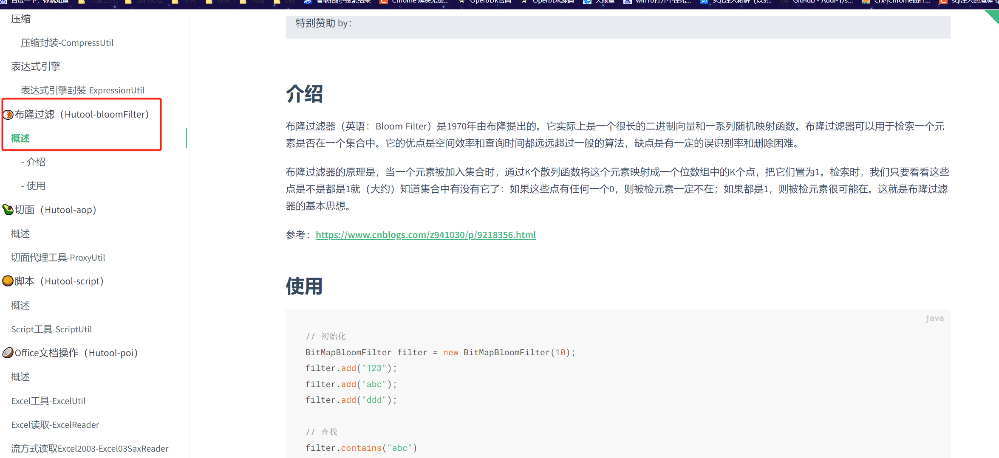

### 21.3 测试生产者

```java
@Test
public void testRepeatProducer() throws Exception {
    // 创建默认的生产者
    DefaultMQProducer producer = new DefaultMQProducer("test-group");
    // 设置nameServer地址
    producer.setNamesrvAddr("localhost:9876");
    // 启动实例
    producer.start();
    // 我们可以使用自定义key当做唯一标识
    String keyId = UUID.randomUUID().toString();
    System.out.println(keyId);
        Message msg = new Message("TopicTest", "tagA", keyId, "我是一个测试消息".getBytes());
    SendResult send = producer.send(msg);
    System.out.println(send);
    // 关闭实例
    producer.shutdown();
}
```


### 21.4 添加hutool的依赖

```xml
<dependency>
    <groupId>cn.hutool</groupId>
    <artifactId>hutool-all</artifactId>
    <version>5.7.11</version>
</dependency>
```


### 21.5 测试消费者

```java
/**
 * 在boot项目中可以使用@Bean在整个容器中放置一个单利对象
 */
public static BitMapBloomFilter bloomFilter = new BitMapBloomFilter(100);

@Test
public void testRepeatConsumer() throws Exception {
    // 创建默认消费者组
    DefaultMQPushConsumer consumer = new DefaultMQPushConsumer("consumer-group");
    consumer.setMessageModel(MessageModel.BROADCASTING);
    // 设置nameServer地址
    consumer.setNamesrvAddr("localhost:9876");
    // 订阅一个主题来消费   表达式，默认是*
    consumer.subscribe("TopicTest", "*");
    // 注册一个消费监听 MessageListenerConcurrently是并发消费
    // 默认是20个线程一起消费，可以参看 consumer.setConsumeThreadMax()
    consumer.registerMessageListener(new MessageListenerConcurrently() {
        @Override
        public ConsumeConcurrentlyStatus consumeMessage(List<MessageExt> msgs,
                                                        ConsumeConcurrentlyContext context) {
            // 拿到消息的key
            MessageExt messageExt = msgs.get(0);
            String keys = messageExt.getKeys();
            // 判断是否存在布隆过滤器中
            if (bloomFilter.contains(keys)) {
                // 直接返回了 不往下处理业务
                return ConsumeConcurrentlyStatus.CONSUME_SUCCESS;
            }
            // 这个处理业务，然后放入过滤器中
            // do sth...
            bloomFilter.add(keys);
            return ConsumeConcurrentlyStatus.CONSUME_SUCCESS;
        }
    });
    consumer.start();
    System.in.read();
}
```


## 22 Rocketmq集成SpringBoot

### 22.1 搭建rocketmq-producer（消息生产者）

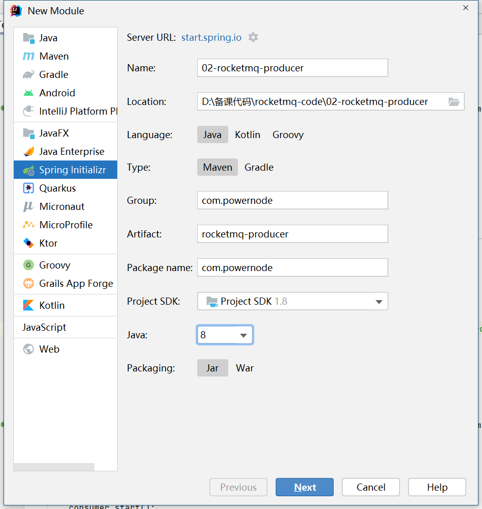

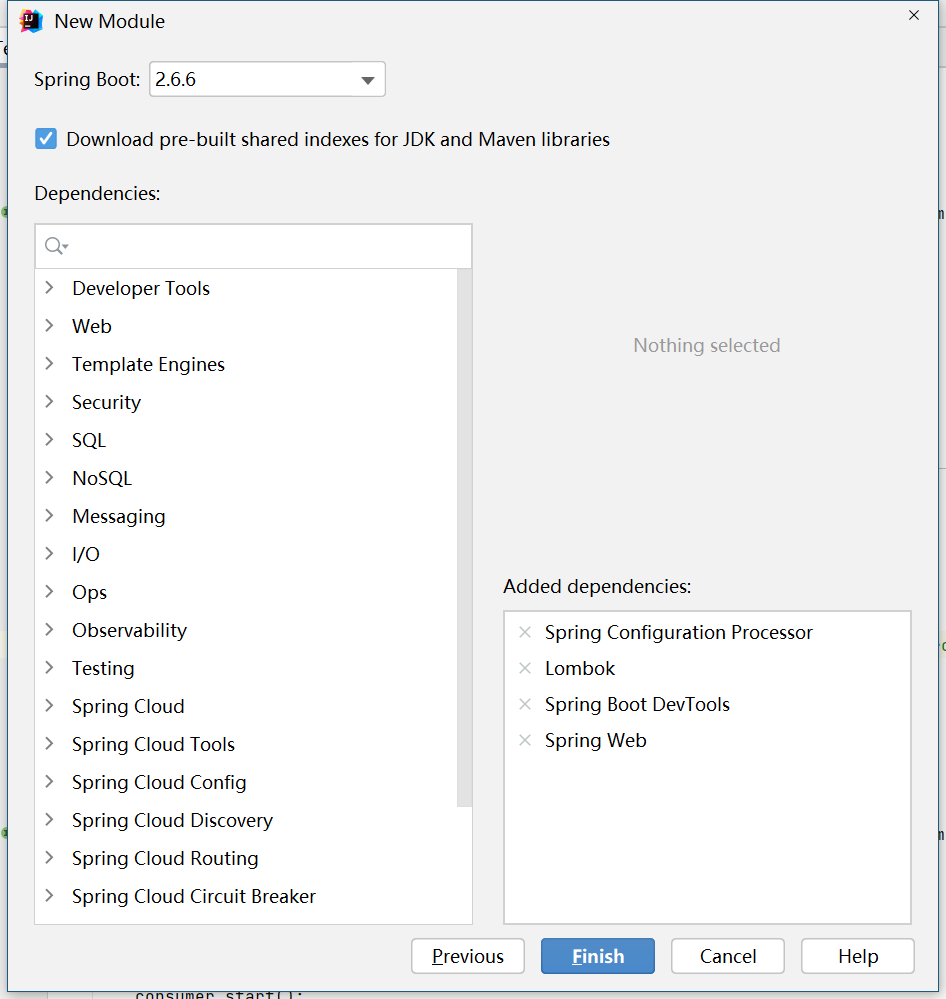

#### 22.1.1 创建项目，完整的pom.xml

```xml
<?xml version="1.0" encoding="UTF-8"?>
<project xmlns="http://maven.apache.org/POM/4.0.0" xmlns:xsi="http://www.w3.org/2001/XMLSchema-instance"
         xsi:schemaLocation="http://maven.apache.org/POM/4.0.0 https://maven.apache.org/xsd/maven-4.0.0.xsd">
    <modelVersion>4.0.0</modelVersion>
    <parent>
        <groupId>org.springframework.boot</groupId>
            <artifactId>spring-boot-starter-parent</artifactId>
        <version>2.6.3</version>
        <relativePath/> <!-- lookup parent from repository -->
    </parent>
    <groupId>com.powernode</groupId>
    <artifactId>01-rocketmq-producer</artifactId>
    <version>0.0.1-SNAPSHOT</version>
    <name>rocketmq-producer</name>
    <description>Demo project for Spring Boot</description>
    <properties>
        <java.version>1.8</java.version>
    </properties>
    <dependencies>
        <dependency>
            <groupId>org.springframework.boot</groupId>
            <artifactId>spring-boot-starter-web</artifactId>
        </dependency>
        <!-- rocketmq的依赖 -->
        <dependency>
            <groupId>org.apache.rocketmq</groupId>
            <artifactId>rocketmq-spring-boot-starter</artifactId>
            <version>2.0.2</version>
        </dependency>

        <dependency>
            <groupId>org.projectlombok</groupId>
            <artifactId>lombok</artifactId>
            <optional>true</optional>
        </dependency>
        <dependency>
            <groupId>org.springframework.boot</groupId>
            <artifactId>spring-boot-starter-test</artifactId>
            <scope>test</scope>
        </dependency>
    </dependencies>

    <build>
        <plugins>
            <plugin>
                <groupId>org.springframework.boot</groupId>
                <artifactId>spring-boot-maven-plugin</artifactId>
                <configuration>
                    <excludes>
                        <exclude>
                            <groupId>org.projectlombok</groupId>
                            <artifactId>lombok</artifactId>
                        </exclude>
                    </excludes>
                </configuration>
            </plugin>
        </plugins>
    </build>

</project>
```


#### 22.1.2 修改配置文件application.yml

```yaml
spring:
    application:
        name: rocketmq-producer
rocketmq:
    name-server: 127.0.0.1:9876     # rocketMq的nameServer地址
    producer:
        group: powernode-group        # 生产者组别
        send-message-timeout: 3000  # 消息发送的超时时间
        retry-times-when-send-async-failed: 2  # 异步消息发送失败重试次数
        max-message-size: 4194304       # 消息的最大长度
```


#### 22.1.3 我们在测试类里面测试发送消息

往powernode主题里面发送一个简单的字符串消息

```java
/**
 * 注入rocketMQTemplate，我们使用它来操作mq
 */
@Autowired
private RocketMQTemplate rocketMQTemplate;

/**
 * 测试发送简单的消息
 *
 * @throws Exception
 */
@Test
public void testSimpleMsg() throws Exception {
    // 往powernode的主题里面发送一个简单的字符串消息
    SendResult sendResult = rocketMQTemplate.syncSend("powernode", "我是一个简单的消息");
    // 拿到消息的发送状态
    System.out.println(sendResult.getSendStatus());
    // 拿到消息的id
    System.out.println(sendResult.getMsgId());
}
```

运行后查看控制台

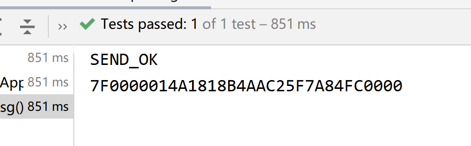

#### 22.1.4 查看rocketMq的控制台

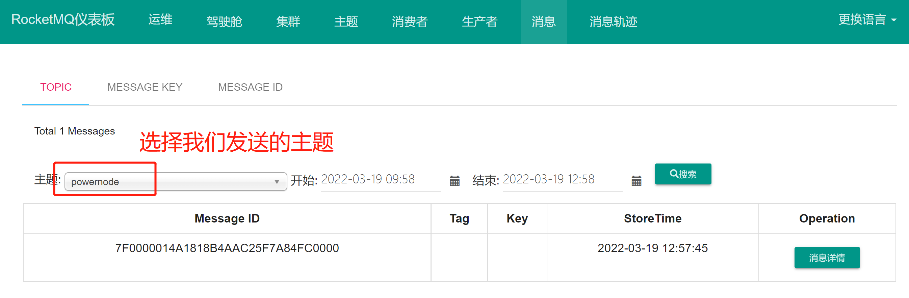

查看消息细节

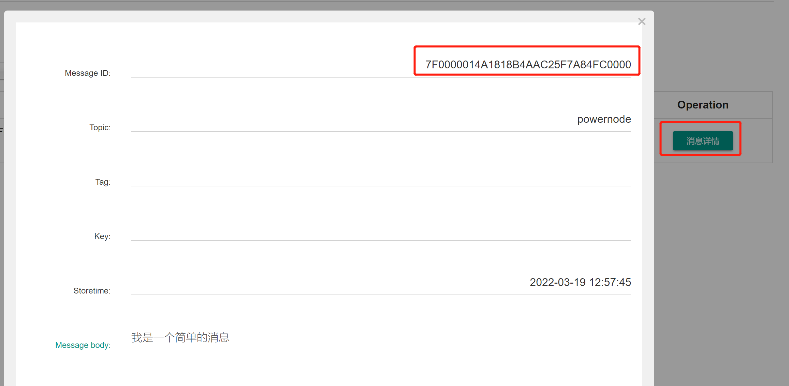

### 22.2 搭建rocketmq-consumer（消息消费者）

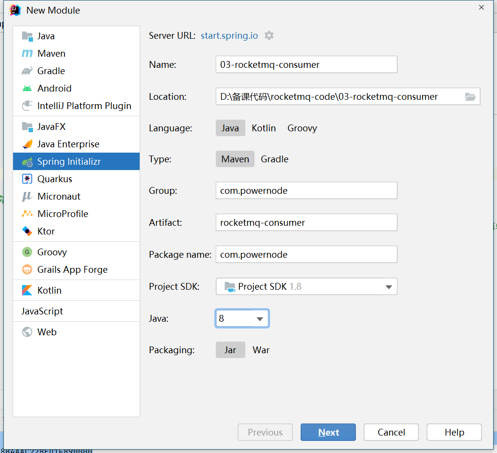


#### 22.2.1 创建项目，完整的pom.xml

```xml
<?xml version="1.0" encoding="UTF-8"?>
<project xmlns="http://maven.apache.org/POM/4.0.0" xmlns:xsi="http://www.w3.org/2001/XMLSchema-instance"
         xsi:schemaLocation="http://maven.apache.org/POM/4.0.0 https://maven.apache.org/xsd/maven-4.0.0.xsd">
    <modelVersion>4.0.0</modelVersion>
    <parent>
        <groupId>org.springframework.boot</groupId>
        <artifactId>spring-boot-starter-parent</artifactId>
        <version>2.6.3</version>
        <relativePath/> <!-- lookup parent from repository -->
    </parent>
    <groupId>com.powernode</groupId>
    <artifactId>02-rocketmq-consumer</artifactId>
        <version>0.0.1-SNAPSHOT</version>
    <name>rocketmq-consumer</name>
    <description>Demo project for Spring Boot</description>
    <properties>
        <java.version>1.8</java.version>
    </properties>
    <dependencies>
        <dependency>
            <groupId>org.springframework.boot</groupId>
            <artifactId>spring-boot-starter-web</artifactId>
        </dependency>
        <!-- rocketmq的依赖 -->
        <dependency>
            <groupId>org.apache.rocketmq</groupId>
            <artifactId>rocketmq-spring-boot-starter</artifactId>
            <version>2.0.2</version>
        </dependency>
        <dependency>
            <groupId>org.projectlombok</groupId>
            <artifactId>lombok</artifactId>
            <optional>true</optional>
        </dependency>
        <dependency>
            <groupId>org.springframework.boot</groupId>
            <artifactId>spring-boot-starter-test</artifactId>
            <scope>test</scope>
        </dependency>
    </dependencies>

    <build>
        <plugins>
            <plugin>
                <groupId>org.springframework.boot</groupId>
                <artifactId>spring-boot-maven-plugin</artifactId>
                <configuration>
                    <excludes>
                        <exclude>
                            <groupId>org.projectlombok</groupId>
                            <artifactId>lombok</artifactId>
                        </exclude>
                    </excludes>
                </configuration>
            </plugin>
        </plugins>
    </build>

</project>
```


#### 22.2.2 修改配置文件application.yml

```yaml
spring:
    application:
            name: rocketmq-consumer
rocketmq:
    name-server: 127.0.0.1:9876
```


#### 22.2.3 添加一个监听的类SimpleMsgListener

消费者要消费消息，就添加一个监听

```java
package com.powernode.listener;

import org.apache.rocketmq.spring.annotation.MessageModel;
import org.apache.rocketmq.spring.annotation.RocketMQMessageListener;
import org.apache.rocketmq.spring.core.RocketMQListener;
import org.springframework.stereotype.Component;

/**
 * 创建一个简单消息的监听
 * 1.类上添加注解@Component和@RocketMQMessageListener
 *      @RocketMQMessageListener(topic = "powernode", consumerGroup = "powernode-group")
 *      topic指定消费的主题，consumerGroup指定消费组,一个主题可以有多个消费者组,一个消息可以被多个不同的组的消费者都消费
 * 2.实现RocketMQListener接口，注意泛型的使用，可以为具体的类型，如果想拿到消息
 * 的其他参数可以写成MessageExt
 */
@Component
@RocketMQMessageListener(topic = "powernode", consumerGroup = "powernode-group",messageModel = MessageModel.CLUSTERING)
public class SimpleMsgListener implements RocketMQListener<String> {

    /**
     * 消费消息的方法
     *
     * @param message
     */
    @Override
    public void onMessage(String message) {
        System.out.println(message);
    }
}
```


#### 22.2.4 启动rocketmq-consumer

查看控制台，发现我们已经监听到消息了

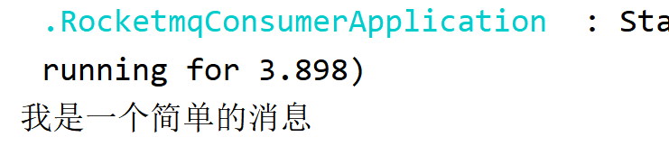

## 23 RocketMQ发送对象消息和集合消息

我们接着在上面项目里面做

### 23.1 发送对象消息

主要是监听的时候泛型中写对象的类型即可

#### 23.1.1 修改rocketmq-producer添加一个Order类

```java
package com.powernode.domain;

import lombok.AllArgsConstructor;
import lombok.Data;
import lombok.NoArgsConstructor;

import java.util.Date;

/**
 * 订单对象
 */
@Data
@AllArgsConstructor
@NoArgsConstructor
public class Order {
    /**
     * 订单号
     */
    private String orderId;

    /**
     * 订单名称
     */
    private String orderName;

    /**
     * 订单价格
     */
    private Double price;

    /**
     * 订单号创建时间
     */
    private Date createTime;
        /**
     * 订单描述
     */
    private String desc;

}
```


#### 23.1.2 修改rocketmq-producer添加一个单元测试

```java
/**
 * 测试发送对象消息
 *
 * @throws Exception
 */
@Test
public void testObjectMsg() throws Exception {
    Order order = new Order();
    order.setOrderId(UUID.randomUUID().toString());
    order.setOrderName("我的订单");
    order.setPrice(998D);
    order.setCreateTime(new Date());
    order.setDesc("加急配送");
    // 往powernode-obj主题发送一个订单对象
    rocketMQTemplate.syncSend("powernode-obj", order);
}
```


#### 23.1.3 发送此消息

#### 23.1.4 修改rocketmq-consumer也添加一个Order类（拷贝过来）

#### 23.1.5 修改rocketmq-consumer添加一个ObjMsgListener

```java
package com.powernode.listener;

import com.powernode.domain.Order;
import org.apache.rocketmq.spring.annotation.RocketMQMessageListener;
import org.apache.rocketmq.spring.core.RocketMQListener;
import org.springframework.stereotype.Component;

/**
 * 创建一个对象消息的监听
 * 1.类上添加注解@Component和@RocketMQMessageListener
 * 2.实现RocketMQListener接口，注意泛型的使用
 */
@Component
@RocketMQMessageListener(topic = "powernode-obj", consumerGroup = "powernode-obj-group")
public class ObjMsgListener implements RocketMQListener<Order> {
    /**
     * 消费消息的方法
     *
     * @param message
     */
    @Override
    public void onMessage(Order message) {
        System.out.println(message);
    }
}
```


#### 23.1.6 重启rocketmq-consumer后查看控制台

对象消息已经监听到了

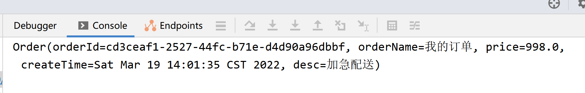

### 23.2 发送集合消息

和对象消息同理，创建一个Order的集合，发送出去，监听方注意修改泛型中的类型为Object即可，这里就不做重复演示了

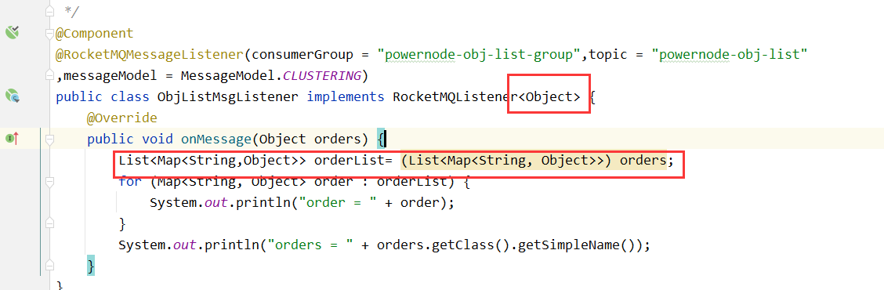

## 24 RocketMQ集成SpringBoot发送不同消息模式

### 24.1 发送同步消息

理解为：消息由消费者发送到broker后，会得到一个确认，是具有可靠性的

这种可靠性同步地发送方式使用的比较广泛，比如：重要的消息通知，短信通知等。

我们在上面的快速入门中演示的消息，就是同步消息，即

```java
rocketMQTemplate.syncSend()

rocketMQTemplate.send()

rocketMQTemplate.convertAndSend()
```

这三种发送消息的方法，底层都是调用syncSend，发送的是同步消息

### 24.2 发送异步消息

```java
rocketMQTemplate.asyncSend()
```


#### 24.2.1 修改rocketmq-producer添加一个单元测试

```java
/**
 * 测试异步发送消息
 *
 * @throws Exception
 */
@Test
public void testAsyncSend() throws Exception {
    // 发送异步消息，发送完以后会有一个异步通知
    rocketMQTemplate.asyncSend("powernode", "发送一个异步消息", new SendCallback() {
        /**
         * 成功的回调
         * @param sendResult
         */
        @Override
        public void onSuccess(SendResult sendResult) {
            System.out.println("发送成功");
        }

        /**
         * 失败的回调
         * @param throwable
         */
        @Override
        public void onException(Throwable throwable) {
            System.out.println("发送失败");
        }
    });
    // 测试一下异步的效果
    System.out.println("谁先执行");
    // 挂起jvm 不让方法结束
    System.in.read();
}
```


#### 24.2.2 运行查看控制台效果

谁先发送打印在前面

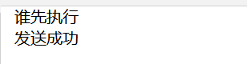

### 24.3 发送单向消息

这种方式主要用在不关心发送结果的场景，这种方式吞吐量很大，但是存在消息丢失的风险，例如日志信息的发送

#### 24.3.1 修改rocketmq-producer添加一个单元测试

```java
/**
 * 测试单向消息
 *
 * @throws Exception
 */
@Test
public void testOnWay() throws Exception {
    // 发送单向消息，没有返回值和结果
    rocketMQTemplate.sendOneWay("powernode", "这是一个单向消息");
}
```


### 24.4 发送延迟消息

#### 24.4.1 修改rocketmq-producer添加一个单元测试

```java
/**
 * 测试延迟消息
 *
 * @throws Exception
 */
@Test
public void testDelay() throws Exception {
    // 构建消息对象
    Message<String> message = MessageBuilder.withPayload("我是一个延迟消息").build();
    // 发送一个延时消息，延迟等级为4级，也就是30s后被监听消费
    SendResult sendResult = rocketMQTemplate.syncSend("powernode", message, 2000, 4);
    System.out.println(sendResult.getSendStatus());
}
```


#### 24.4.2 运行后，查看消费者端，过了30s才被消费

这里注意的是RocketMQ不支持任意时间的延时

只支持以下几个固定的延时等级，等级1就对应1s，以此类推，最高支持2h延迟

```
private String messageDelayLevel = "1s 5s 10s 30s 1m 2m 3m 4m 5m 6m 7m 8m 9m 10m 20m 30m 1h 2h";
```


### 24.5 发送顺序消息

#### 24.5.1 修改Order表添加一个顺序字段

```java
/**
 * 订单的流程顺序
 */
private Integer seq;
```


#### 24.5.2 修改rocketmq-producer添加一个单元测试

```java
/**
 * 测试顺序消费
 * mq会根据hash的值来存放到一个队列里面去
 *
 * @throws Exception
 */
@Test
public void testOrderly() throws Exception {
    List<Order> orders = Arrays.asList(
            new Order(UUID.randomUUID().toString().substring(0, 5), "张三的下订单", null, null, null, 1),
            new Order(UUID.randomUUID().toString().substring(0, 5), "张三的发短信", null, null, null, 1),
            new Order(UUID.randomUUID().toString().substring(0, 5), "张三的物流", null, null, null, 1),
            new Order(UUID.randomUUID().toString().substring(0, 5), "张三的签收", null, null, null, 1),

            new Order(UUID.randomUUID().toString().substring(0, 5), "李四的下订单", null, null, null, 2),
            new Order(UUID.randomUUID().toString().substring(0, 5), "李四的发短信", null, null, null, 2),
            new Order(UUID.randomUUID().toString().substring(0, 5), "李四的物流", null, null, null, 2),
            new Order(UUID.randomUUID().toString().substring(0, 5), "李四的签收", null, null, null, 2)
    );
    // 我们控制流程为 下订单->发短信->物流->签收  hash的值为seq，也就是说 seq相同的会放在同一个队列里面，顺序消费
    orders.forEach(order -> {
        rocketMQTemplate.syncSendOrderly("powernode-obj", order, String.valueOf(order.getSeq()));
    });
}
```


#### 24.5.3 发送消息

#### 24.5.4 修改rocketmq-consumer的ObjMsgListener

```java
package com.powernode.listener;

import com.powernode.domain.Order;
import org.apache.rocketmq.spring.annotation.ConsumeMode;
import org.apache.rocketmq.spring.annotation.RocketMQMessageListener;
import org.apache.rocketmq.spring.core.RocketMQListener;
import org.springframework.stereotype.Component;

/**
 * @Author 武汉动力节点
 * 创建一个对象消息的监听
 * 1.类上添加注解@Component和@RocketMQMessageListener
 * 2.实现RocketMQListener接口，注意泛型的使用
 * consumeMode 指定消费类型
 *      CONCURRENTLY 并发消费
 *      ORDERLY 顺序消费 messages orderly. one queue, one thread
 */
@Component
@RocketMQMessageListener(topic = "powernode-obj",
        consumerGroup = "powernode-obj-group",
        consumeMode = ConsumeMode.ORDERLY
)
public class ObjMsgListener implements RocketMQListener<Order> {

    /**
     * 消费消息的方法
     *
     * @param message
     */
    @Override
    public void onMessage(Order message) {
        System.out.println(message);
    }
}
```


#### 24.5.5 重启rocketmq-consumer

查看控制台，消息按照我们的放入顺序进行消费了

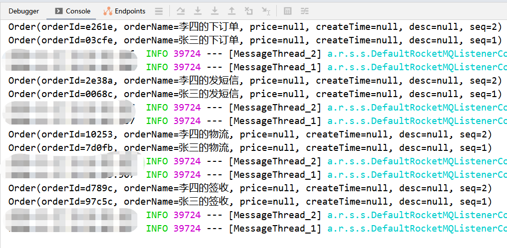

### 24.6 发送事务消息

#### 24.6.1 修改rocketmq-producer添加一个单元测试

```java
/**
 * 测试事务消息
 * 默认是sync（同步的）
 * 事务消息会有确认和回查机制
 * 事务消息都会走到同一个监听回调里面，所以我们需要使用tag或者key来区分过滤
 *
 * @throws Exception
 */
@Test
public void testTrans() throws Exception {
    // 构建消息体
    Message<String> message = MessageBuilder.withPayload("这是一个事务消息").build();
    // 发送事务消息（同步的） 最后一个参数才是消息主题
    TransactionSendResult transaction = rocketMQTemplate.sendMessageInTransaction("powernode", message, "消息的参数");
    // 拿到本地事务状态
    System.out.println(transaction.getLocalTransactionState());
    // 挂起jvm，因为事务的回查需要一些时间
    System.in.read();
}
```


#### 24.6.2 修改rocketmq-producer添加一个本地事务消息的监听（半消息）

```java
/**
 * 事务消息的监听与回查
 * 类上添加注解@RocketMQTransactionListener 表示这个类是本地事务消息的监听类
 * 实现RocketMQLocalTransactionListener接口
 * 两个方法为执行本地事务，与回查本地事务
 */
@Component
@RocketMQTransactionListener(corePoolSize = 4,maximumPoolSize = 8)
public class TmMsgListener implements RocketMQLocalTransactionListener {
 /**
     * 执行本地事务，这里可以执行一些业务
     * 比如操作数据库，操作成功就return RocketMQLocalTransactionState.COMMIT;
     * 可以使用try catch来控制成功或者失败;
     * @param msg
     * @param arg
     * @return
     */
    @Override
    public RocketMQLocalTransactionState executeLocalTransaction(Message msg, Object arg) {
        // 拿到消息参数
        System.out.println(arg);
        // 拿到消息头
        System.out.println(msg.getHeaders());
        // 返回状态COMMIT,UNKNOWN
        return RocketMQLocalTransactionState.UNKNOWN;
    }

    /**
     * 回查本地事务，只有上面的执行方法返回UNKNOWN时，才执行下面的方法 默认是1min回查
     * 此方法为回查方法，执行需要等待一会
     * xxx.isSuccess()  这里可以执行一些检查的方法
     * 如果返回COMMIT，那么本地事务就算是提交成功了，消息就会被消费者看到
     *
     * @param msg
     * @return
     */
    @Override
    public RocketMQLocalTransactionState checkLocalTransaction(Message msg) {
        System.out.println(msg);
        return RocketMQLocalTransactionState.COMMIT;
    }
}

```


#### 24.6.3 测试发送事务，建议断点启动

1.  消息会先到事务监听类的执行方法，

2.  如果返回状态为COMMIT，则消费者可以直接监听到

3.  如果返回状态为ROLLBACK，则消息发送失败，直接回滚

4.  如果返回状态为UNKNOW，则过一会会走回查方法

5.  如果回查方法返回状态为UNKNOW或者ROLLBACK，则消息发送失败，直接回滚

6.  如果回查方法返回状态为COMMIT，则消费者可以直接监听到

## 25 RocketMQ集成SpringBoot的消息过滤

### 25.1 tag过滤（常在消费者端过滤）

我们从源码注释得知，tag带在主题后面用：来携带，感谢注释


```
我们往下去看源码，在org.apache.rocketmq.spring.support.RocketMQUtil的getAndWrapMessage方法里面看到了具体细节，我们也知道了keys在消息头里面携带
```

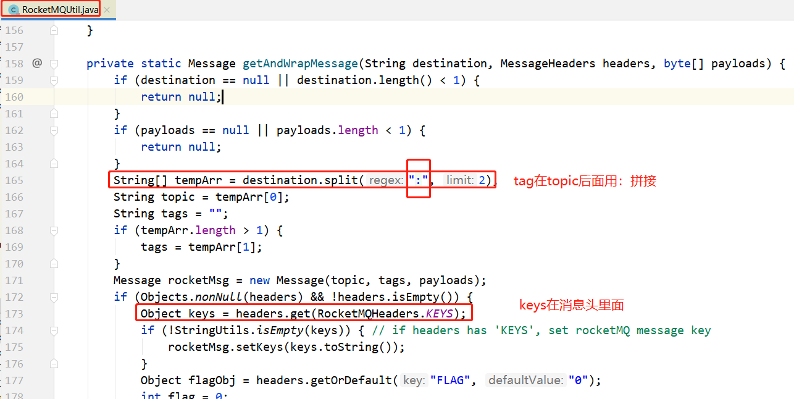

#### 25.1.1 修改rocketmq-producer添加一个单元测试

```java
/**
 * 发送一个带tag的消息
 *
 * @throws Exception
 */
@Test
public void testTagMsg() throws Exception {
    // 发送一个tag为java的数据
    rocketMQTemplate.syncSend("powernode-tag:java", "我是一个带tag的消息");
}
```


#### 25.1.2 发送消息

#### 25.1.3 修改rocketmq-consumer添加一个TagMsgListener

```java
package com.powernode.listener;

import org.apache.rocketmq.spring.annotation.RocketMQMessageListener;
import org.apache.rocketmq.spring.annotation.SelectorType;
import org.apache.rocketmq.spring.core.RocketMQListener;
import org.springframework.stereotype.Component;

/**
 * @Author 武汉动力节点
 * 创建一个简单的标签消息的监听
 * 1.类上添加注解@Component和@RocketMQMessageListener
 *      selectorType = SelectorType.TAG,  指定使用tag过滤。(也可以使用sql92 需要在配置文件broker.conf中开启enbalePropertyFilter=true)
 *      selectorExpression = "java"     表达式，默认是*,支持"tag1 || tag2 || tag3"
 * 2.实现RocketMQListener接口，注意泛型的使用
 */
@Component
@RocketMQMessageListener(topic = "powernode-tag",
        consumerGroup = "powernode-tag-group",
        selectorType = SelectorType.TAG,
        selectorExpression = "java"
)
public class TagMsgListener implements RocketMQListener<String> {

    /**
     * 消费消息的方法
     *
     * @param message
     */
    @Override
    public void onMessage(String message) {
        System.out.println(message);
    }
}
```


#### 25.1.4 重启rocketmq-consumer查看控制台


### 25.2 Key过滤（可以在事务监听的类里面区分）

#### 25.2.1 修改rocketmq-producer添加一个单元测试

```java
/**
 * 发送一个带key的消息,我们使用事务消息 打断点查看消息头
 *
 * @throws Exception
 */
@Test
public void testKeyMsg() throws Exception {
    // 发送一个key为spring的事务消息
    Message<String> message = MessageBuilder.withPayload("我是一个带key的消息")
            .setHeader(RocketMQHeaders.KEYS, "spring")
            .build();
    rocketMQTemplate.sendMessageInTransaction("powernode", message, "我是一个带key的消息");
}
```


#### 25.2.2 断点发送这个消息，查看事务里面消息头

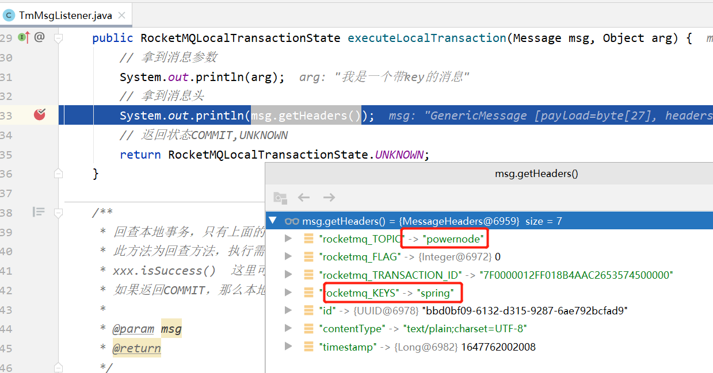

我们在mq的控制台也可以看到

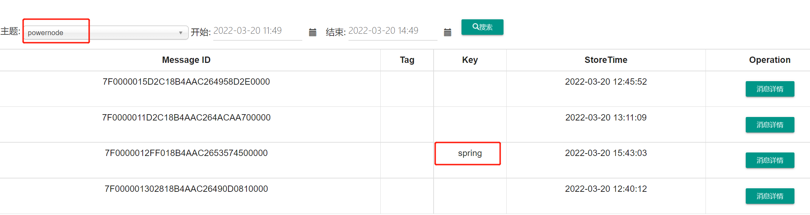

## 26 RocketMQ集成SpringBoot消息消费两种模式

Rocketmq消息消费的模式分为两种：**负载均衡模式和广播模式**

负载均衡模式表示多个消费者交替消费同一个主题里面的消息

广播模式表示每个每个消费者都消费一遍订阅的主题的消息

### 26.1 再搭建一个消费者rocketmq-consumer-b，依赖和配置文件和rocketmq-consumer一致，记住端口修改一下，避免占用

### 26.2 rocketmq-consumer-b添加一个监听

```java
package com.powernode.listener;

import org.apache.rocketmq.spring.annotation.MessageModel;
import org.apache.rocketmq.spring.annotation.RocketMQMessageListener;
import org.apache.rocketmq.spring.core.RocketMQListener;
import org.springframework.stereotype.Component;

/**
 * messageModel  指定消息消费的模式
 *      CLUSTERING 为负载均衡模式
 *      BROADCASTING 为广播模式
 */
@Component
@RocketMQMessageListener(topic = "powernode",
        consumerGroup = "powernode-group",
        messageModel = MessageModel.CLUSTERING
)
public class ConsumerBListener implements RocketMQListener<String> {

    @Override
    public void onMessage(String message) {
        System.out.println(message);
            }
}
```


### 26.3 修改rocketmq-consumer的SimpleMsgListener

```java
/**
 * 创建一个简单消息的监听
 * 1.类上添加注解@Component和@RocketMQMessageListener
 *
 * @RocketMQMessageListener(topic = "powernode", consumerGroup = "powernode-group")
 * topic指定消费的主题，consumerGroup指定消费组,一个主题可以有多个消费者组,一个消息可以被多个不同的组的消费者都消费
 * 2.实现RocketMQListener接口，注意泛型的使用
 */
@Component
@RocketMQMessageListener(topic = "powernode", 
        consumerGroup = "powernode-group",
        messageModel = MessageModel.CLUSTERING)
public class SimpleMsgListener implements RocketMQListener<String> {

    @Override
    public void onMessage(String message) {
        System.out.println(new Date());
        System.out.println(message);
    }
}
```


### 26.4 启动两个消费者

### 26.5 在生产者里面添加一个单元测试并且运行

```java
/**
 * 测试消息消费的模式
 *
 * @throws Exception
 */
@Test
public void testMsgModel() throws Exception {
    for (int i = 0; i < 10; i++) {
        rocketMQTemplate.syncSend("powernode", "我是消息" + i);
    }
}
```


### 26.6 查看两个消费者的控制台，发现是负载均衡的模式

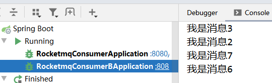

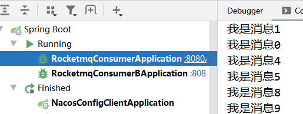

### 26.7 修改两个消费者的模式为BROADCASTING

重启测试，结果是广播模式，每个消费者都消费了这些消息

项目中 一般部署多态机器 消费者 2 - 3 根据业务可以选择具体的模式来配置

**重置消费点位, 将一个组的消费节点 设置在之前的某一个时间点上去
从这个时间点开始往后消费**

**跳过堆积 选择一个组 跳过堆积以后 这个组里面的的所有都不会被消费了**

## 27 如何解决消息堆积问题？

一般认为单条队列消息差值\>=10w时 算堆积问题

### 27.1 什么情况下会出现堆积

1.  生产太快了

    生产方可以做业务限流

    1、增加消费者数量,但是消费者数量\<=队列数量, 适当的设置最大的消费线程数量(根据IO(2n)/CPU(n+1))
    2、(运维在控制台)动态扩容队列数量,从而增加消费者数量

2.  消费者消费出现问题

    排查消费者程序的问题

## 28 如何确保消息不丢失？
**数据库创建消息记录表，根据消息id或者key(业务id)创建表.添加status字段，生产者生产时添加数据,消费者消费之后将数据状态修改为已经修复** 
1.  生产者使用同步发送模式 ，收到mq的返回确认以后
    顺便往自己的数据库里面写

    ```
    msgId status(0) time
    ```
    
2.  消费者消费以后 修改数据这条消息的状态 = 1

3. 写一个定时任务 间隔两天去查询数据

   ```
    如果有status = 0 and time < day-2
   ```

4.  将mq的刷盘机制设置为同步刷盘

5.  使用集群模式 ，搞主备模式，将消息持久化在不同的硬件上

6.  可以开启mq的trace机制，消息跟踪机制

    1.在broker.conf中开启消息追踪

    ```
    traceTopicEnable=true
    ```

    2.重启broker即可

    3.生产者配置文件开启消息轨迹
    
    ```
    enable-msg-trace: true
    ```
    
    4.消费者开启消息轨迹功能，可以给单独的某一个消费者开启
    
    ```
    enableMsgTrace = true
    ```
    
    在rocketmq的面板中可以查看消息轨迹
    
    ```
    默认会将消息轨迹的数据存在 RMQ_SYS_TRACE_TOPIC 主题里面
    ```
    
    

## 29 安全

```
1.  开启acl的控制 在broker.conf中开启aclEnable=true

2.  配置账号密码 修改plain_acl.yml

3.  修改控制面板的配置文件 放开52/53行 把49行改为true上传到服务器的jar包平级目录下即可

java配置文件中：
 rockketmq:
    name-server:***
    consumer:
        access-key:
        secret-key:
        
//修改控制台的配置文件,application.properties开启登录，会读取user.properties配置文件
```

