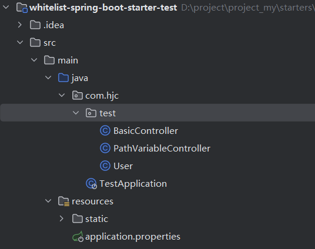

<LockArticle :highHeightPercent="0.3"/>

# 白名单过滤

## 仓库地址

https://gitee.com/hujincheng1732/whitelist-spring-boot-starter

## Git地址

https://gitee.com/hujincheng1732/whitelist-spring-boot-starter.git

## 使用

### 1、引入依赖

暂未上传maven仓库，需要git下载源码insatll到本地仓库引入使用

```
 <dependency>
     <groupId>io.starter</groupId>
     <artifactId>whitelist-spring-boot-starter</artifactId>
     <version>0.0.1-SNAPSHOT</version>
 </dependency>
```

### 2、application.properties中添加需要过滤的用户,逗号间隔

```
io.starter.whitelist.users=zs,ls,ww
```

### 3、控制器添加注解

#### 1、注解@DoWhiteList

#### 2、注解参数key

与参数或与入参中的属性一致，方可获取到对应属性的值

#### 3、注解参数returnJson

表示拦截之后的返回参数，传入json

#### 4、使用注解示范

```java
@DoWhiteList(key = "userId",returnJson = "{\"code\": 500, \"msg\": \"success\"}")

@GetMapping("/testWhiteList")
@ResponseBody
@DoWhiteList(key = "userId",returnJson = "{\"code\": 500, \"msg\": \"success\"}")
public User testWhiteList(@RequestParam String userId){
 return new User().setAge(10).setName(userId);
}
```

### 4、常见问题

#### 1、注解无效，无法拦截用户

需要配置包扫描路径，当前starter路径在io.starter下，如果启动类不在当前包下，需要配置启动类包扫描starter包，同时需要扫描启动类下的包

```java
@SpringBootApplication(scanBasePackages = {"io","com"})   //配置启动类包扫描
//或者这个样，没测试  
//@SpringBootApplication
//@ComponentScan(basePackages = {"io.*"})
public class TestApplication {

    public static void main(String[] args) {
        SpringApplication.run(TestApplication.class, args);
    }
}
```

白名单starter测试项目的目录结构


