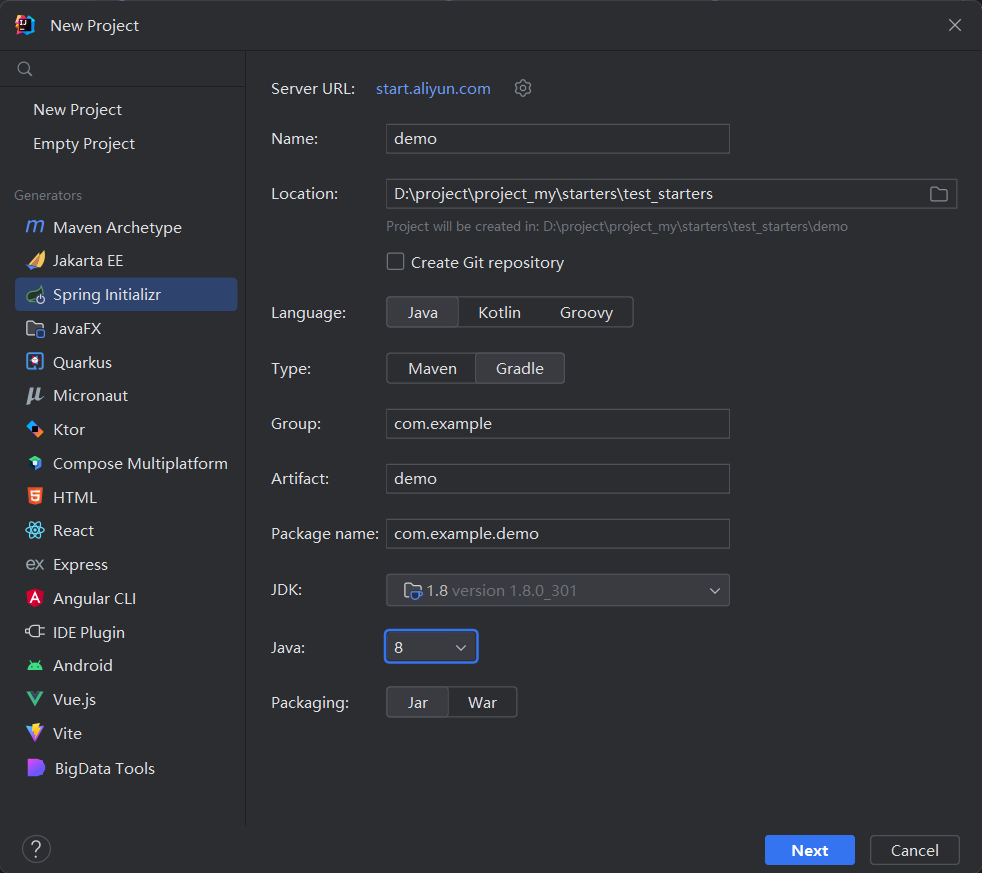
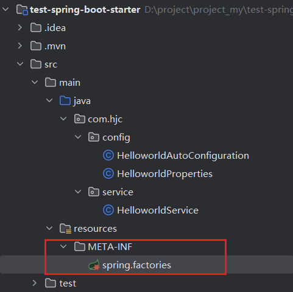
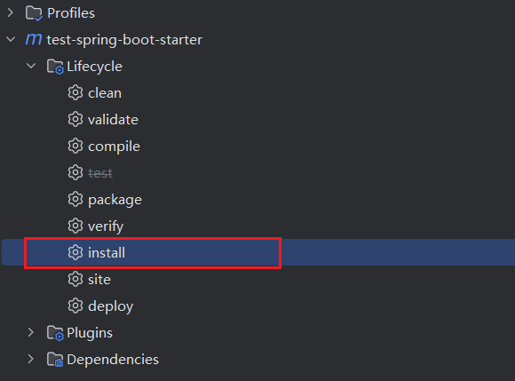

# 自定义starter

## 1、新建springboot项目



#### 所需基础依赖

```xml
<?xml version="1.0" encoding="UTF-8"?>
<project xmlns="http://maven.apache.org/POM/4.0.0" xmlns:xsi="http://www.w3.org/2001/XMLSchema-instance"
         xsi:schemaLocation="http://maven.apache.org/POM/4.0.0 https://maven.apache.org/xsd/maven-4.0.0.xsd">
    <modelVersion>4.0.0</modelVersion>
    <parent>
        <groupId>org.springframework.boot</groupId>
        <artifactId>spring-boot-starter-parent</artifactId>
        <version>2.7.13-SNAPSHOT</version>
        <relativePath/> <!-- lookup parent from repository -->
    </parent>


    <groupId>io.starter</groupId>
    <artifactId>whitelist-spring-boot-starter</artifactId>
    <version>0.0.1-SNAPSHOT</version>
    <name>whitelist-spring-boot-starter</name>
    <description>whitelist-spring-boot-starter</description>
    <packaging>jar</packaging>


    <properties>
        <java.version>1.8</java.version>
    </properties>

    <dependencies>
        <dependency>
            <groupId>org.springframework.boot</groupId>
            <artifactId>spring-boot-starter</artifactId>
        </dependency>

        <dependency>
            <groupId>org.springframework.boot</groupId>
            <artifactId>spring-boot-configuration-processor</artifactId>
            <optional>true</optional>
        </dependency>

        <dependency>
            <groupId>org.springframework.boot</groupId>
            <artifactId>spring-boot-autoconfigure</artifactId>
            <version>1.5.9.RELEASE</version>
        </dependency>

        <dependency>
            <groupId>org.projectlombok</groupId>
            <artifactId>lombok</artifactId>
            <!--            <optional>true</optional>-->
        </dependency>
        <dependency>
            <groupId>org.springframework.boot</groupId>
            <artifactId>spring-boot-starter-test</artifactId>
            <scope>test</scope>
        </dependency>

        <dependency>
            <groupId>org.springframework.boot</groupId>
            <artifactId>spring-boot-starter-aop</artifactId>
        </dependency>
        <dependency>
            <groupId>commons-beanutils</groupId>
            <artifactId>commons-beanutils</artifactId>
            <version>1.8.3</version>
        </dependency>
        <dependency>
            <groupId>com.alibaba</groupId>
            <artifactId>fastjson</artifactId>
            <version>1.2.75</version>
        </dependency>
        <dependency>
            <groupId>junit</groupId>
            <artifactId>junit</artifactId>
            <version>4.12</version>
            <scope>test</scope>
        </dependency>
    </dependencies>

    <build>
        <finalName>whitelist-spring-boot-starter</finalName>
        <resources>
            <resource>
                <directory>src/main/resources</directory>
                <filtering>true</filtering>
                <includes>
                    <include>**/**</include>
                </includes>
            </resource>
        </resources>
        <testResources>
            <testResource>
                <directory>src/test/resources</directory>
                <filtering>true</filtering>
                <includes>
                    <include>**/**</include>
                </includes>
            </testResource>
        </testResources>
        <plugins>
            <plugin>
                <groupId>org.apache.maven.plugins</groupId>
                <artifactId>maven-surefire-plugin</artifactId>
                <version>2.12.4</version>
                <configuration>
                    <skipTests>true</skipTests>
                </configuration>
            </plugin>
            <plugin>
                <groupId>org.apache.maven.plugins</groupId>
                <artifactId>maven-resources-plugin</artifactId>
                <version>2.5</version>
                <configuration>
                    <encoding>${project.build.sourceEncoding}</encoding>
                </configuration>
            </plugin>
            <plugin>
                <groupId>org.apache.maven.plugins</groupId>
                <artifactId>maven-compiler-plugin</artifactId>
                <version>2.3.2</version>
                <configuration>
                    <source>1.8</source>
                    <target>1.8</target>
                    <encoding>${project.build.sourceEncoding}</encoding>
                </configuration>
            </plugin>
            <plugin>
                <groupId>org.apache.maven.plugins</groupId>
                <artifactId>maven-source-plugin</artifactId>
                <version>2.1.2</version>
                <executions>
                    <execution>
                        <id>attach-sources</id>
                        <goals>
                            <goal>jar</goal>
                        </goals>
                    </execution>
                </executions>
            </plugin>
        </plugins>
        <!--        <plugins>-->
        <!--            <plugin>-->
        <!--                <groupId>org.springframework.boot</groupId>-->
        <!--                <artifactId>spring-boot-maven-plugin</artifactId>-->
        <!--                <configuration>-->
        <!--                    <excludes>-->
        <!--                        <exclude>-->
        <!--                            <groupId>org.projectlombok</groupId>-->
        <!--                            <artifactId>lombok</artifactId>-->
        <!--                        </exclude>-->
        <!--                    </excludes>-->
        <!--                </configuration>-->
        <!--            </plugin>-->
        <!--        </plugins>-->
    </build>
    <repositories>
        <repository>
            <id>spring-milestones</id>
            <name>Spring Milestones</name>
            <url>https://repo.spring.io/milestone</url>
            <snapshots>
                <enabled>false</enabled>
            </snapshots>
        </repository>
        <repository>
            <id>spring-snapshots</id>
            <name>Spring Snapshots</name>
            <url>https://repo.spring.io/snapshot</url>
            <releases>
                <enabled>false</enabled>
            </releases>
        </repository>
    </repositories>
    <pluginRepositories>
        <pluginRepository>
            <id>spring-milestones</id>
            <name>Spring Milestones</name>
            <url>https://repo.spring.io/milestone</url>
            <snapshots>
                <enabled>false</enabled>
            </snapshots>
        </pluginRepository>
        <pluginRepository>
            <id>spring-snapshots</id>
            <name>Spring Snapshots</name>
            <url>https://repo.spring.io/snapshot</url>
            <releases>
                <enabled>false</enabled>
            </releases>
        </pluginRepository>
    </pluginRepositories>

</project>

```


## 2、修改pom文件

```yml
<dependencies>
        <dependency>
            <groupId>org.springframework.boot</groupId>
            <artifactId>spring-boot-starter</artifactId>
        </dependency>

        <dependency>
            <groupId>org.springframework.boot</groupId>
            <artifactId>spring-boot-autoconfigure</artifactId>
            <version>1.5.9.RELEASE</version>
        </dependency>

        <dependency>
            <groupId>org.projectlombok</groupId>
            <artifactId>lombok</artifactId>
        </dependency>
        
        <dependency>
            <groupId>org.springframework.boot</groupId>
            <artifactId>spring-boot-starter-test</artifactId>
            <scope>test</scope>
        </dependency>
 </dependencies>
```


## 3、创建properties获取application.yml中的配置

```java
package com.hjc.config;

import org.springframework.boot.context.properties.ConfigurationProperties;

@ConfigurationProperties(prefix = "helloworld")
public class HelloworldProperties {
  public static final String DEFAULT_WORDS = "world";

  private String words = DEFAULT_WORDS;

  public String getWords() {
    return words;
  }

  public void setWords(String words) {
    this.words = words;
  }
}
```

## 4、创建自动装配的配置类

```java
package com.hjc.config;

import com.hjc.service.HelloworldService;
import org.springframework.beans.factory.annotation.Autowired;
import org.springframework.boot.autoconfigure.condition.ConditionalOnClass;
import org.springframework.boot.autoconfigure.condition.ConditionalOnMissingBean;
import org.springframework.boot.context.properties.EnableConfigurationProperties;
import org.springframework.context.annotation.Bean;
import org.springframework.context.annotation.Configuration;

// 相当于一个普通的 java 配置类
@Configuration
// 当 HelloworldService 在类路径的条件下,换句话说，只有当项目中存在HelloworldService类时，这个配置才会被应用。
@ConditionalOnClass({HelloworldService.class})
// 将 application.properties 的相关的属性字段与该类一一对应，并生成 Bean
@EnableConfigurationProperties(HelloworldProperties.class)
public class HelloworldAutoConfiguration {

  // 注入属性类
  @Autowired
  private HelloworldProperties hellowordProperties;

  @Bean
  // 当容器没有这个 Bean 的时候才创建这个 Bean
  @ConditionalOnMissingBean(HelloworldService.class)
  public HelloworldService helloworldService() {
    HelloworldService helloworldService = new HelloworldService();
    helloworldService.setWords(hellowordProperties.getWords());
    return helloworldService;
  }
}

```

## 5、创建对外使用的bean

```java
package com.hjc.service;

public class HelloworldService {

  private String words;

  private String getWords() {
    return words;
  }

  public void setWords(String words) {
    this.words = words;
  }

  public String sayHello() {
     return "hello, " + words;
  }
}
```

## 6、创建META-INF下的spring.factories完成自动装配

### a、目录结构



### b、spring.factories配置springboot自动装配

```
# Auto Configure
org.springframework.boot.autoconfigure.EnableAutoConfiguration=com.hjc.config.HelloworldAutoConfiguration

```

## 7、maven打包至本地仓库



