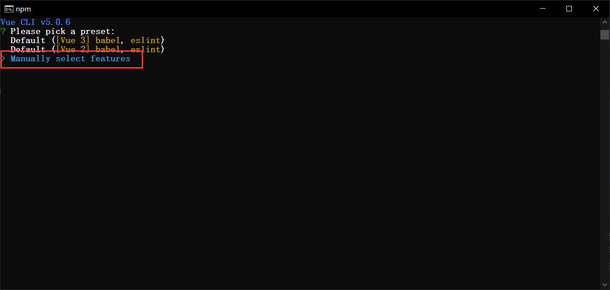
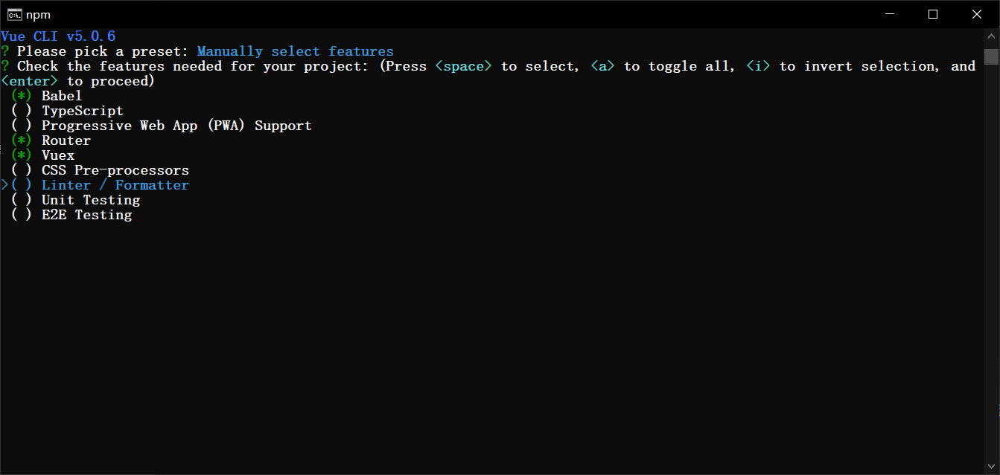
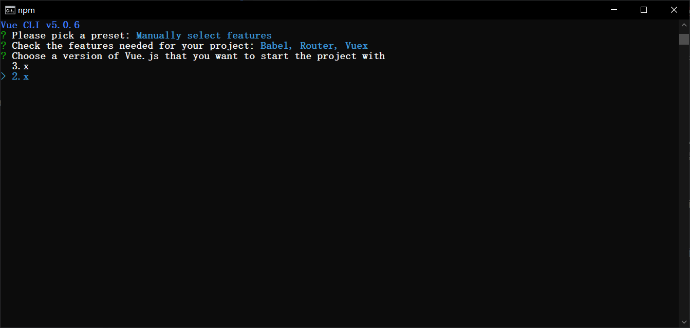
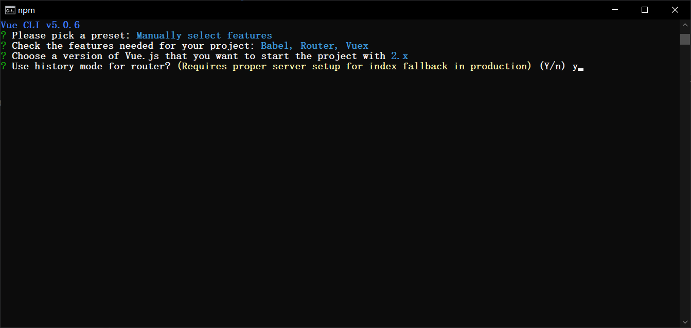
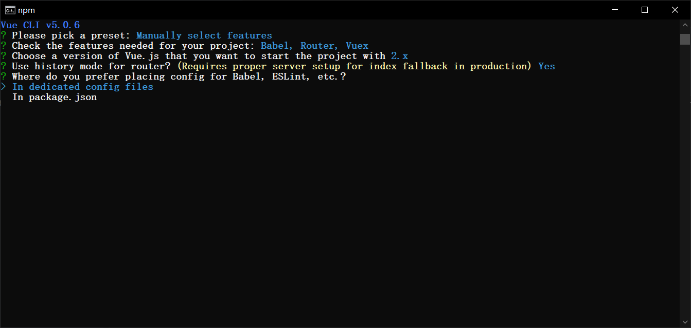
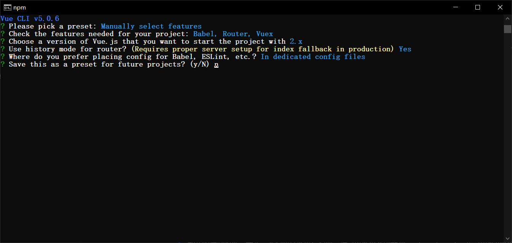
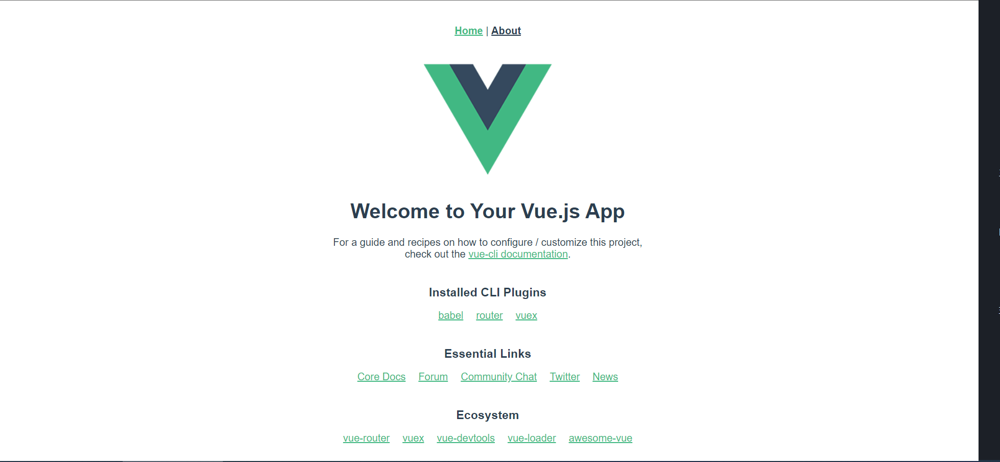
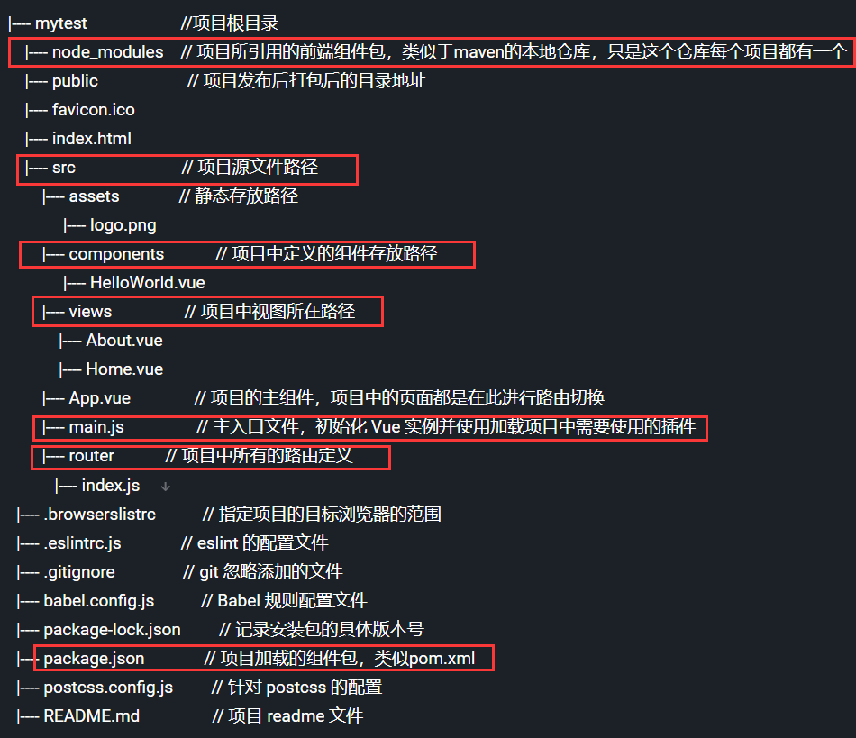
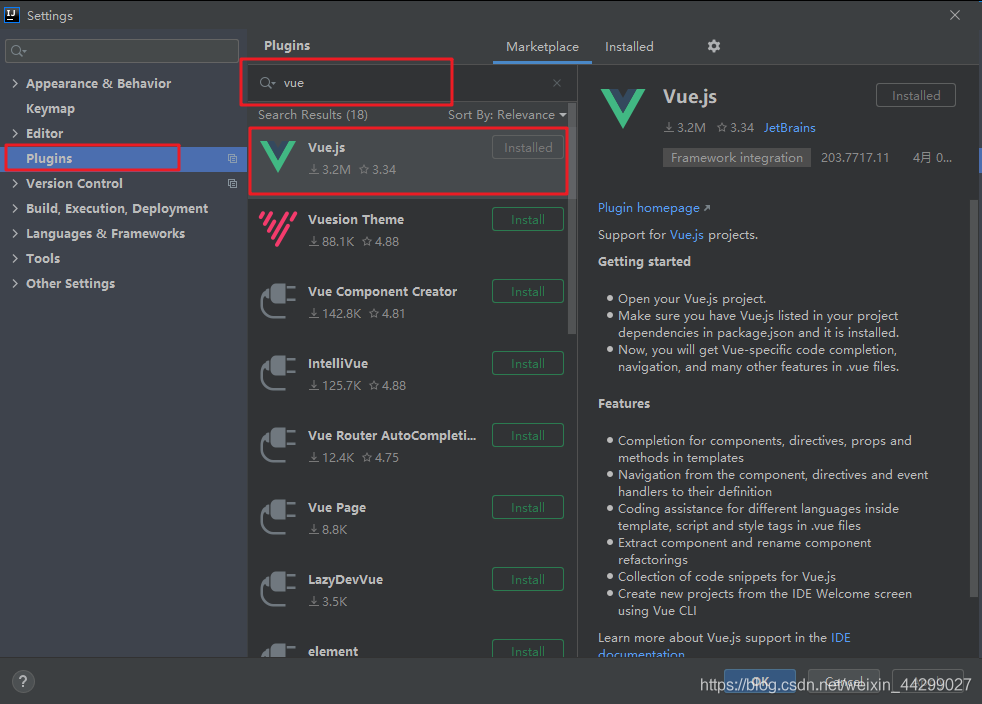

# Vue进阶


发布后台项目的命令:
nohup  java  -jar  XXX.jar &

跨域常见的场景：
前后端分离的开发模式下,页面中有ajax请求,请求的地址和页面的请求地址不一样

端口（除了端口，协议和域名也会产生跨域问题）,解决跨域的方式在Controller类上加@CrossOrigin


##  一、Axios

> `axios`(音标：`[æk'si:əʊ]`)是独立于vue的一个项目，基于promise用于浏览器和node.js的http客户端。作用如下：
>
> - 在浏览器中可以帮助我们完成ajax请求的发送
> - 在node.js中可以向远程接口发送请求
>
> 创建stu.json，假设这是从服务端获取的数据   

```json
[
  {
    "id": 1,
    "name": "zs",
    "age": 20,
    "addr": "qd"
  }, {
    "id": 2,
    "name": "ls",
    "age": 21,
    "addr": "qd"
  }
]
```

> 页面

```html
<!DOCTYPE html>
<html>
<head>
    <meta charset="utf-8" />
    <title>axios</title>
</head>
<body>
<div id="app">
    <table>
        <tr>
            <td>id</td>
            <td>name</td>
            <td>age</td>
            <td>addr</td>
        </tr>
        <tr v-for="(stu, index) in stuList">
            <td>{{stu.id}}</td>
            <td>{{stu.name}}</td>
            <td>{{stu.age}}</td>
            <td>{{stu.addr}}</td>
        </tr>
    </table>
</div>

<script src="./js/vue.js"></script>
<script src="./js/axios.min.js"></script>
<script>
    new Vue({
        el: "#app", //表示要操作的元素
        data: { //数据
            stuList: []
        },
        mounted: function() {
            axios.get('./json/stu.json') //发送get请求
                .then(resp => {//正常情况下运行
                	//resp代表从后台获取的数据，出了我们想要的数据，还包括一些额外信息
                    console.log(resp.data)
                    this.stuList = resp.data
                })
                .catch(error => { //出现错误运行

                })
        }
    })
</script>
</body>
</html>
//使用箭头函数，不要用普通函数
```

## 二、案例

### 2.1、目的

> 我们现在已经学习了SpringBoot+Vue的大部分知识，现在我们通过案例整合之前学习的知识。
>
> 使用的技术：
>
> * SpringBoot
> * MyBatis-Plus
> * MyBatis-Plus代码生成插件  (MybatisX)
> * Swagger2 (Api 框架，生成在线文档，在线测试)
> * Vue
> * Axios
> * BootStrap（光年模板）
>
> 目的：完成一个基于SpringBoot+Vue的CRUD案例。

### 2.2、服务端代码

#### 2.2.1、建库建表

> 数据库中只有一个`tb_user`表

```sql
CREATE DATABASE `springboot_vue_demo`;

USE `springboot_vue_demo`;

CREATE TABLE `tb_user`  (
  `id` int(11) NOT NULL AUTO_INCREMENT,
  `name` varchar(20) CHARACTER SET utf8 COLLATE utf8_general_ci NULL DEFAULT NULL,
  `age` int(11) NULL DEFAULT NULL,
  `gender` varchar(10) CHARACTER SET utf8 COLLATE utf8_general_ci NULL DEFAULT NULL,
  PRIMARY KEY (`id`) USING BTREE
) ENGINE = InnoDB AUTO_INCREMENT = 55 CHARACTER SET = utf8 COLLATE = utf8_general_ci ROW_FORMAT = Dynamic;

INSERT INTO `tb_user` VALUES (1, 'Robin', 11, 'male');
INSERT INTO `tb_user` VALUES (2, 'Perter', 10, 'male');
INSERT INTO `tb_user` VALUES (3, 'Rose', 10, 'female');
```

#### 2.2.2、创建项目

> 创建一个SpringBoot项目，用来进行服务端开发
>
> pom文件如下：

```xml
<?xml version="1.0" encoding="UTF-8"?>
<project xmlns="http://maven.apache.org/POM/4.0.0" xmlns:xsi="http://www.w3.org/2001/XMLSchema-instance"
         xsi:schemaLocation="http://maven.apache.org/POM/4.0.0 https://maven.apache.org/xsd/maven-4.0.0.xsd">
    <modelVersion>4.0.0</modelVersion>
    <parent>
        <groupId>org.springframework.boot</groupId>
        <artifactId>spring-boot-starter-parent</artifactId>
        <version>2.4.13</version>
        <relativePath/> <!-- lookup parent from repository -->
    </parent>
    <groupId>com.qfedu</groupId>
    <artifactId>springboot_vue_crud</artifactId>
    <version>1.0.0</version>
    <name>springboot_vue_crud</name>
    <description>Demo project for Spring Boot</description>
    <properties>
        <java.version>1.8</java.version>
    </properties>
    <dependencies>
        <dependency>
            <groupId>org.springframework.boot</groupId>
            <artifactId>spring-boot-starter-web</artifactId>
        </dependency>
        <dependency>
            <groupId>com.baomidou</groupId>
            <artifactId>mybatis-plus-boot-starter</artifactId>
            <version>3.5.1</version>
        </dependency>
        <dependency>
            <groupId>mysql</groupId>
            <artifactId>mysql-connector-java</artifactId>
            <version>5.1.49</version>
            <scope>runtime</scope>
        </dependency>
        <dependency>
            <groupId>org.projectlombok</groupId>
            <artifactId>lombok</artifactId>
            <optional>true</optional>
        </dependency>
        <dependency>
            <groupId>org.springframework.boot</groupId>
            <artifactId>spring-boot-starter-test</artifactId>
            <scope>test</scope>
        </dependency>
        <!-- swagger2相关 -->
        <dependency>
            <groupId>io.springfox</groupId>
            <artifactId>springfox-swagger2</artifactId>
            <version>2.9.2</version>
        </dependency>
        <dependency>
            <groupId>io.springfox</groupId>
            <artifactId>springfox-swagger-ui</artifactId>
            <version>2.9.2</version>
        </dependency>
    </dependencies>

    <build>
        <plugins>
            <plugin>
                <groupId>org.springframework.boot</groupId>
                <artifactId>spring-boot-maven-plugin</artifactId>
                <configuration>
                    <excludes>
                        <exclude>
                            <groupId>org.projectlombok</groupId>
                            <artifactId>lombok</artifactId>
                        </exclude>
                    </excludes>
                </configuration>
            </plugin>
        </plugins>
    </build>
</project>
```

> 注意：这里没有使用`Druid`连接池，使用的是`SpringBoot`自带的连接池。

#### 2.2.3、配置MyBatisX插件生成代码

> 安装`MyBatisX`插件，连接数据库，生成代码。   （downloaded missing driver）

#### 2.2.4、配置Swagger2

```java
package com.qfedu.config;

import org.springframework.context.annotation.Bean;
import org.springframework.context.annotation.Configuration;
import org.springframework.core.env.Environment;
import springfox.documentation.builders.RequestHandlerSelectors;
import springfox.documentation.service.ApiInfo;
import springfox.documentation.service.Contact;
import springfox.documentation.spi.DocumentationType;
import springfox.documentation.spring.web.plugins.Docket;
import springfox.documentation.swagger2.annotations.EnableSwagger2;

import java.util.ArrayList;

@Configuration
@EnableSwagger2
public class Swagger2Config {
    //配置Swagger2
    @Bean
    public Docket docket(Environment environment) {
        return new Docket(DocumentationType.SWAGGER_2)
                .apiInfo(apiInfo())
                .select()
                .apis(RequestHandlerSelectors.basePackage("com.qfedu.controller"))
                .build();
    }

    //创建文档信息
    private ApiInfo apiInfo() {
        //联系方式
        Contact contact = new Contact("Solar", 
                                      "https://note.codeaction.org", 
                                      "solar@126.com");
        //文档信息
        ApiInfo apiInfo = new ApiInfo("Swagger2测试",
                "学习如何使用Swagger2",
                "10.0.0",
                "https://note.codeaction.org",
                contact,
                "Apache2.0",
                "https://note.codeaction.org", new ArrayList());
        return apiInfo;
    }
}
```

#### 2.2.5、配置MyBatisPlus

> 这里主要配置如下内容：
>
> * 包扫描
> * 分页插件

```java
package com.qfedu.config;

import com.baomidou.mybatisplus.annotation.DbType;
import com.baomidou.mybatisplus.extension.plugins.MybatisPlusInterceptor;
import com.baomidou.mybatisplus.extension.plugins.inner.PaginationInnerInterceptor;
import org.mybatis.spring.annotation.MapperScan;
import org.springframework.context.annotation.Bean;
import org.springframework.context.annotation.Configuration;

@Configuration
@MapperScan("com.qfedu.mapper")
public class MyBatisPlusConfig {
    //配置分页插件
    @Bean   
    public MybatisPlusInterceptor mybatisPlusInterceptor() {
        MybatisPlusInterceptor interceptor = new MybatisPlusInterceptor();
        interceptor.addInnerInterceptor(new PaginationInnerInterceptor(DbType.MYSQL));
        return interceptor;
    }
}
```

#### 2.2.6、创建统一返回数据的Bean

```java
package com.qfedu.beans;

public class RespBean {
    private Integer status; //状态
    private String msg; //消息
    private Object obj; //数据

    public static RespBean build() {
        return new RespBean();
    }

    public static RespBean ok(String msg) {
        return new RespBean(200, msg, null);
    }

    public static RespBean ok(String msg, Object obj) {
        return new RespBean(200, msg, obj);
    }

    public static RespBean error(String msg) {
        return new RespBean(500, msg, null);
    }

    public static RespBean error(String msg, Object obj) {
        return new RespBean(500, msg, obj);
    }

    private RespBean() {
    }

    private RespBean(Integer status, String msg, Object obj) {
        this.status = status;
        this.msg = msg;
        this.obj = obj;
    }

    public Integer getStatus() {
        return status;
    }

    public RespBean setStatus(Integer status) {
        this.status = status;
        return this;
    }

    public String getMsg() {
        return msg;
    }

    public RespBean setMsg(String msg) {
        this.msg = msg;
        return this;
    }

    public Object getObj() {
        return obj;
    }

    public RespBean setObj(Object obj) {
        this.obj = obj;
        return this;
    }
}
```

#### 2.2.7、SpringBoot配置文件

```properties
server.port=9999

spring.datasource.driver-class-name=com.mysql.jdbc.Driver
spring.datasource.url=jdbc:mysql://localhost:3306/springboot_vue_demo?useSSL=false
spring.datasource.username=root
spring.datasource.password=root

# mybatis配置
mybatis.type-aliases-package=com.qfedu.bean
#mybatis.mapper-locations=classpath:mapper/*Mapper.xml

# 日志
logging.level.com.qfedu.mapper=DEBUG
```

#### 2.2.8、Controller代码

```java
package com.qfedu.controller;

import com.baomidou.mybatisplus.extension.plugins.pagination.Page;
import com.qfedu.beans.RespBean;
import com.qfedu.beans.User;
import com.qfedu.service.UserService;
import org.springframework.beans.factory.annotation.Autowired;
import org.springframework.web.bind.annotation.*;

@RestController
@RequestMapping("/user")
public class UserController {
    @Autowired
    private UserService userService;
    
    //查询所有
    @GetMapping("/")
    public RespBean findAll() {
        List<User> list = userService.list();
        return RespBean.ok("success", list);
    }

    //分页查询
    @GetMapping("/list/{currentPage}")
    public RespBean list(@PathVariable("currentPage") Integer currentPage) {
        Page<User> page = new Page<>(currentPage, 2);
        page = userService.page(page);
        return RespBean.ok("success", page);
    }

    //根据ID查询
    @GetMapping("/{id}")
    public RespBean findById(@PathVariable("id") Integer id) {
        User user = userService.getById(id);
        return RespBean.ok("success", user);
    }

    //添加
    @PostMapping("/")
    public RespBean add(@RequestBody User user) {
        boolean result = userService.save(user);
        return RespBean.ok("success");
    }

    //删除
    @DeleteMapping("/{id}")
    public RespBean del(@PathVariable("id") Integer id) {
        boolean result = userService.removeById(id);
        return RespBean.ok("success");
    }

    //修改
    @PutMapping("/")
    public RespBean chg(@RequestBody User user) {
        userService.updateById(user);
        return RespBean.ok("success");
    }
}
```

> 启动项目，访问`http://localhost:9999/swagger-ui.html`对Controller中的方法进行测试。

### 2.3、前端代码

#### 2.3.1、引入相关资源

> * vue
> * axios

#### 2.3.2、前后端联调

> 目的：测试前后端能否互相传递数据。

```javascript
<script>
	let app = new Vue({
		el: '#main',
		data: {},
		methods: {
			findAll() {
				axios.get("http://localhost:9999/user/")
					.then(resp => {
                    	console.log(resp);					        
					})
			}
		},
		created() {
			this.findAll()
		}
    })
</script>
```

> 这里使用的`findAll` 函数和Controller中的`findAll`方法是用来测试的，前后端能够正常交互后，这两部分代码就没有价值了。
>
> 此时我们看控制台，提示如下：

```
Access to XMLHttpRequest at 'xxxxxxxxxxxxxxxxxx' from origin 'xxxxxxxxxxx' has been blocked by CORS policy: No 'Access-Control-Allow-Origin' header is present on the requested
```

> 测试说明产生了跨域问题，关于跨域仔细学习4.4中的内容。

#### 2.3.3、分页查询

> 在data中增加如下内容：

```javascript
page: {}
```

> 分页查询方法

```javascript
findByPage(currentPage) {
	axios.get("http://localhost:9999/user/list/" + currentPage)
		.then(resp => {
			//将服务端返回的数据赋值给userList
			app.page = resp.data.obj
		})
}

created() {
    this.findByPage(1)
}
```

> 页面

```html
<div class="row">
	<table id="tb1" class="table table-bordered text-center table-hover">
		<thead>
            <tr>
                <!-- <th><input type="checkbox"/></th> -->
                <th>id</th>
                <th>姓名</th>
                <th>年龄</th>
                <th>性别</th>
                <th colspan="2">操作</th>
            </tr>
        </thead>
        <tbody>
            <tr v-for="item in page.records">
                <td>{{item.id}}</td>
                <td>{{item.name}}</td>
                <td>{{item.age}}</td>
                <td>{{item.gender}}</td>
                <td class="opt">
                    <a data-toggle="modal" data-target="#chgModal">
                    	<span class="glyphicon glyphicon-edit"></span>
                    </a>
                </td>
                <td class="opt">
                    <a>
                        <span class="glyphicon glyphicon-trash text-warning" ></span>
                    </a>
                </td>
			</tr>
		</tbody>
	</table>
</div>

<div class="row text-center">
    <nav>
        <ul class="pagination">
            <li :class="{disabled:page.current == 1}">
                <a href="#" @click="findByPage(1)">首页</a>
            </li>
            <li :class="{disabled:page.current == 1}">
                <!-- 上一页，在当前页码基础上减1 -->
                <a href="#" @click="findByPage(page.current - 1)">上一页</a>
            </li>
            <li :class="{disabled:page.current == page.pages}">
                <!-- 下一页，在当前页码基础上加1 -->
                <a href="#" @click="findByPage(page.current + 1)">下一页</a>
            </li>
            <li :class="{disabled:page.current == page.pages}">
                <!-- 最后一页，服务端需要的页码从0开始，所有传递的页码值要在总页数基础上减1 -->
                <a href="#" @click="findByPage(page.pages)">尾页</a>
            </li>
        </ul>
    </nav>
</div>
```

#### 2.3.4、添加

> 在data中增加如下内容：

```javascript
userAdd: {
    id: 0,
	name: '',
    age: '',
	gender: ''
}
```

> 添加方法

```javascript
add() {
    axios.post("http://localhost:9999/user/", app.userAdd)
        .then(resp => {
        app.userAdd = {
            id: 0,
            name: '',
            age: '',
            gender: ''
        }
        if(resp.data.status == 200) {
            $.alert('添加成功');
            $("#addModal").modal('hide');
            app.findByPage(1);
        }
    })
}
```

> 页面

```html
<!-- addModal -->
<div class="modal fade" id="addModal" tabindex="-1" role="dialog" aria-labelledby="myModalLabel">
    <div class="modal-dialog" role="document">
        <div class="modal-content">
            <div class="modal-header">
                <button type="button" class="close" data-dismiss="modal" aria-label="Close"><span aria-hidden="true">&times;</span></button>
                <h4 class="modal-title" id="myModalLabel">修改信息</h4>
            </div>
            <div class="modal-body">
                <form class="form-horizontal">
                    <div class="form-group">
                        <label class="col-sm-2 control-label">姓名</label>
                        <div class="col-sm-10">
                            <input type="text" class="form-control" placeholder="请输入姓名" v-model="userAdd.name" />
                        </div>
                    </div>
                    <div class="form-group">
                        <label class="col-sm-2 control-label">年龄</label>
                        <div class="col-sm-10">
                            <input type="number" class="form-control" placeholder="请输入年龄" v-model="userAdd.age" />
                        </div>
                    </div>
                    <div class="form-group">
                        <label class="col-sm-2 control-label">性别</label>
                        <div class="col-sm-10">
                            <div class="checkbox">
                                <label>
                                    <input type="radio" name="gender" value="male" v-model="userAdd.gender" /> 男&nbsp;&nbsp;&nbsp;&nbsp;&nbsp;&nbsp;&nbsp;&nbsp;&nbsp;&nbsp;
                                    <input type="radio" name="gender" value="female" v-model="userAdd.gender" /> 女
                                </label>
                            </div>
                        </div>
                    </div>
                </form>
            </div>
            <div class="modal-footer">
                <button type="button" class="btn btn-primary" @click="add()">保存</button>
                <button type="button" class="btn btn-default" data-dismiss="modal">关闭</button>
            </div>
        </div>
    </div>
</div>
```

#### 2.3.5、修改

> 在data中增加如下内容：

```javascript
userUpdate: {
    id: 0,
	name: '',
	age: '',
	gender: ''
}
```

> 根据id查询、修改方法

```javascript
update() {
    axios.put("http://localhost:9999/user/", app.userUpdate)
        .then(resp => {
        if(resp.data.status == 200) {
            app.userUpdate = {
                id: 0,
                name: '',
                age: '',
                gender: ''
            };
            $("#chgModal").modal('hide');
            $.alert('修改成功');
            app.findByPage(1);
        }
    })
},
findById(id) {
    axios.get("http://localhost:9999/user/" + id)
        .then(resp => {
        app.userUpdate = resp.data.obj;
        $("#chgModal").modal('show');
    })
}
```

> 页面

```html
<!-- chgModal -->
<div class="modal fade" id="chgModal" tabindex="-1" role="dialog" aria-labelledby="myModalLabel">
    <div class="modal-dialog" role="document">
        <div class="modal-content">
            <div class="modal-header">
                <button type="button" class="close" data-dismiss="modal" aria-label="Close"><span aria-hidden="true">&times;</span></button>
                <h4 class="modal-title" id="myModalLabel">修改信息</h4>
            </div>
            <div class="modal-body">
                <form class="form-horizontal">
                    <input type="hidden" v-bind:value="userUpdate.id">
                    <div class="form-group">
                        <label class="col-sm-2 control-label">姓名</label>
                        <div class="col-sm-10">
                            <input type="text" class="form-control" placeholder="请输入姓名" v-model="userUpdate.name"/>
                        </div>
                    </div>
                    <div class="form-group">
                        <label class="col-sm-2 control-label">年龄</label>
                        <div class="col-sm-10">
                            <input type="number" class="form-control" placeholder="请输入年龄" v-model="userUpdate.age"/>
                        </div>
                    </div>
                    <div class="form-group">
                        <label class="col-sm-2 control-label">性别</label>
                        <div class="col-sm-10">
                            <div class="checkbox">
                                <label>
                                    <input type="radio" name="gender" value="male" v-model="userUpdate.gender" /> 男&nbsp;&nbsp;&nbsp;&nbsp;&nbsp;&nbsp;&nbsp;&nbsp;&nbsp;&nbsp;
                                    <input type="radio" name="gender" value="female" v-model="userUpdate.gender" /> 女
                                </label>
                            </div>
                        </div>
                    </div>
                </form>
            </div>
            <div class="modal-footer">
                <button type="button" class="btn btn-primary" @click="update()">修改</button>
                <button type="button" class="btn btn-default" data-dismiss="modal">关闭</button>
            </div>
        </div>
    </div>
</div>
```

#### 2.3.6、删除

```javascript
del(id) {
    $.alert({
        title: '删除确认',
        content: '你确实要删除吗？',
        buttons: {
            confirm: {
                text: '确认',
                btnClass: 'btn-primary',
                action: function(){
                    axios.delete("http://localhost:9999/user/" + id)
                        .then(resp => {
                        if(resp.data.status == 200) {
                            $.alert('删除成功');
                            app.findByPage(1);
                        }
                    })
                }
            },
            cancel: {
                text: '取消'
            }
        }
    });
}
```

### 2.4、跨域

#### 2.4.1、什么是跨域

> **跨域：**指的是浏览器不能执行其他网站的脚本。它是由浏览器的同源策略造成的，是浏览器对Javascript施加的安全限制。
>
> 例如：a页面想获取b页面资源，如果a、b页面的`协议、域名、端口、子域名`不同，所进行的访问行动都是跨域的，而浏览器为了安全问题一般都限制了跨域访问，也就是不允许跨域请求资源。
>
> 注意：跨域限制访问，其实是**浏览器的限制**。理解这一点很重要。
>
> **同源策略：是指协议，域名，端口都要相同，其中有一个不同都会产生跨域。**


> 假设有两个网站，A网站部署在：`http://localhost:81`即本地ip端口81上；B网站部署在：`http://localhost:82` 即本地ip端口82上。现在A网站的页面想去访问B网站的信息，就会产生跨域问题。在控制台会输出如下信息：

 ```
Access to XMLHttpRequest at 'xxxxxxxxxxxxxxxxxx' from origin 'xxxxxxxxxxx' has been blocked by CORS policy: No 'Access-Control-Allow-Origin' header is present on the requested
 ```

#### 2.4.2、处理

在Controller上添加`@CrossOrigin`。      (允许跨域)

违背了同源策略，产生了跨域问题，如何解决，在Controller类上添加@CrossOrigin

## 三、组件       

>  components(组件)  --重用性    
>
> 组件（Component）是 Vue.js 最强大的功能之一。
>
> 组件可以扩展 HTML 元素，封装可重用的代码。
>
> 组件系统让我们可以用独立可复用的小组件来构建大型应用，几乎任意类型的应用的界面都可以抽象为一个组件树：


### 3.1、局部组件

> 定义组件    el data methods computed watch created components

```javascript
new Vue({
    el: '#app',
    // 定义局部组件，这里可以定义多个局部组件
    components: {
        //组件的名字
        'Navbar': {
            //组件的内容
            template: '<ul><li>首页</li><li>项目管理</li></ul>'
        }
    }
})
```

> 使用组件

```html
<div id="app">
    <Navbar></Navbar>
</div>
```

### 3.2、全局组件

> 定义全局组件`components/Navbar.js`

```javascript
// 定义全局组件
Vue.component('Navbar', {
    template: '<ul><li>首页</li><li>项目管理</li><li>人员管理</li></ul>'
})
```

> 使用全局组件

```html
<div id="app">
    <Navbar></Navbar>
</div>
<script src="js/vue.min.js"></script>
<script src="components/Navbar.js"></script>
<script>
    var app = new Vue({
        el: '#app'
    })
</script>
```

## 四、路由         

> Vue.js路由允许我们通过不同的URL访问不同的内容。
>
> 通过Vue.js可以实现多视图的单页Web应用（single page web application，SPA）。 SPA:单页面应用
>
> Vue.js路由需要载入vue-router库

### 4.1、引入js

```html
<script src="js/vue.min.js"></script>
<script src="js/vue-router.min.js"></script>
```

### 4.2、编写html

```html
<div id="app">
    <h1>Hello App!</h1>
    <p>
        <!-- 使用 router-link 组件来导航. -->
        <!-- 通过传入 `to` 属性指定链接. -->
        <!-- <router-link> 默认会被渲染成一个 `<a>` 标签 -->
        <router-link to="/">首页</router-link>
        <router-link to="/student">学生管理</router-link>
        <router-link to="/teacher">讲师管理</router-link>
    </p>
    <!-- 路由出口 -->
    <!-- 路由匹配到的组件将渲染在这里 -->
    <router-view></router-view>
</div>
```

### 4.3、编写js

```javascript
<script>
    // 1. 定义（路由）组件。
    // 可以从其他文件 import 进来
    const Welcome = { template: '<div>欢迎</div>' }
    const Student = { template: '<div>student list</div>' }
    const Teacher = { template: '<div>teacher list</div>' }
    // 2. 定义路由
    // 每个路由应该映射一个组件。 
    const routes = [
        { path: '/', redirect: '/welcome' }, //设置默认指向的路径
        { path: '/welcome', component: Welcome },
        { path: '/student', component: Student },
        { path: '/teacher', component: Teacher }
    ]
    // 3. 创建 router 实例，然后传 `routes` 配置
    const router = new VueRouter({
        routes // （缩写）相当于 routes: routes
    })
    // 4. 创建和挂载根实例。
    // 从而让整个应用都有路由功能
    const app = new Vue({       
        el: '#app',
        router
    })
    // 现在，应用已经启动了！
</script>
 
```

## 五、Vue CLI 脚手架

> 在之前学习`Vue  Cli时，我们还是采用传统的方式，通过在`html`页面上引用`vue.js`这个文件，从而将`Vue`引入到我们的项目开发中。伴随着`Node.js`的出现，以及`React`、`AngularJS`、`Vue`这类的前端 `MVVM`框架的发展，前端越来越像后端靠拢，前端工程化的思想开始出现。现在的前端开发，已经不再只是一个 `html`页面，上面引用各种`js`、`css`文件就可以完成开发的了。  **前端工程化的思想**
>
> 与后端类似，前端开始出现各种已经很完善的框架模板、开始出现针对前端组件包的管理工具、各种各样的单元测试库，以及针对前端所特有的`js`、`css`、`image`这种静态资源文件的模块打包器。那么，我们就从零开始，结合之前学习的`Vue`相关的基础知识，通过`Vue CLI`和`Ant Design Vue`去搭建一个基于`Vue`的`SPA(single page web application)` 前端项目框架模板。

### 5.1、什么是CLI

> 命令行界面（英语：command-line interface，缩写：CLI）是在图形用户界面得到普及之前使用最为广泛的用户界面，它通常不支持鼠标，用户通过键盘输入指令，计算机接收到指令后，予以执行。也有人称之为字符用户界面（CUI）。

### 5.2、什么是Vue CLI

> `Vue CLI` 是一个基于`Vue.js`进行快速开发的完整系统框架，它是一个框架生成**脚手架工具**，可以帮助我们生成基于`Vue`的前端框架模板，我们可以在这个基础上进行基于`Vue`的前端开发。我们可以在这个框架模板上进行开发，从而开发出具有统一标准、规范化的项目。可以将其理解成`Spring`体系下的`SpringBoot`。
>
> `Ant Design Vue`是基于`Vue.js`所做的一套前端组件库，你可以把它理解成类似于`Boostrap`或是`EasyUI` 这种前端的`UI`库基于`Vue`中组件的思想所实现的前端库。通过使用这套组件库，我们就可以更好地统一整个项目的前端样式以及更加方便的进行开发。当然，你也可以采用别的组件库或是自己手写一套。
>
> Ant Design Vue /(光年模板 bootstrap)和 element ui
>
> 

### 5.3、Vue CLI安装

#### 5.3.1、安装node.js

node.js    js

jdk        java

> 可以认为是前端的JDK。
>
> 1. 下载`node.js`
>
>    下载地址:`https://nodejs.org/zh-cn/download/`
>
>    版本: v14.15.3
>
> 2. 安装`node.js`
>
>    默认情况下会配置环境变量
>
> 3. 验证`node.js`是否安装成功
>
>    `node -v`

#### 5.3.2、npm     

安装node.js后即可查看npm -v版本     

> `node package mangager`的缩写，`node.js`包管理工具。前端相关包使用`npm`进行统一管理。
>
> * `maven`管理`java`后端依赖 
> * `npm`管理前端系统依赖 
>
> maven 远程仓库 本地仓库
>
> 相关设置
>
> * 配置淘宝镜像`npm config set registry https://registry.npm.taobao.org`
> * 查看镜像设置`npm config get registry`

#### 5.3.3、安装Vue CLI  

> 当 Node 环境安装好之后，我们就可以安装 Vue CLI 3 脚手架工具了，如果你之前已经全局安装了旧版本的 vue-cli (1.x 或 2.x)，则需要先卸载旧版本的 Vue CLI。

```shell
$ npm uninstall vue-cli -g
```

> 安装Vue CLI

```shell
$ npm install -g @vue/cli
```

> 安装之后，我们就可以在命令行中使用 vue 命令。

```shell
## 查看 vue 相关帮助信息
$ vue 
## 查看安装的 vue cli 版本信息 vue -V 提示不是内部或外部命令的有效解决办法，把vue的路径添加到path中
$ vue --version
path中配置一下vue.cmd路径，例如:C:\Users\XXX\AppData\Roaming\npm\   XXX：因人而异
```

### 5.4、使用Vue CLI创建项目

> 当我们安装完成后，我们就可以通过命令行去创建一个前端项目模板。首先，进入你需要创建项目的路径下，打开终端，然后使用下面的命令来创建我们的项目。因为某些原因，连接 npm 源的速度可能会比较慢，所以在创建项目时，Vue CLI 会提示我们是否将淘宝的镜像源添加 npm 中，从而加快我们访问的速度，你可以自由选择。

```shell
$ vue create 项目名称
```



> 此时，从控制台中可以看到给出了三个选项，第一、二项为系统预设的项目模板配置，而第三项则是我们可以自己选择我们的项目模板需要加载什么前端组件。这里，我们选择第三项，自己来决定加载什么组件。



> 在选择前端组件时，我们可以通过**上下方向键**进行切换，通过**空格**键进行选择，当决定好项目加载的组件后，我们可以通过`Enter`键来进行确定。在这个模板项目中，我添加了上图所示的三个组件，你可以根据自己的需求进行按需加载。每个组件的基本功能介绍如下。
>
> `Babel`：这是一个 JavaScript 转码器，当我们使用新的语法时，旧版本的浏览器可能就无法支持这种新的语法，通过 Babel，我们就可以添加不同的转换规则，从而就可以自动的将新版本的语法糖转换成传统的 JavaScript 语法。 
>
> `TypeScript`：它提供了一些 JavaScript 不支持的强语言特性，例如，类、接口、参数类型约束等等，它使 JavaScript 写起来更像我们的 C# 或是 Java 这种强类型语言，当然最终还是会编译成 js 文件从而让浏览器识别出。
>
> `PWA`：渐进式的 Web 应用，主要是利用提供的标准化框架，在网页应用中实现和原生应用相近的用户体验，让用户以为自己正在使用的是原生应用，微信的小程序其实就可以看成是一种 PWA 应用的载体。
>
> `Router`：这个大家应该很熟悉了，在前面的文章中我们也有介绍过，是`Vue`官方的路由管理组件。
>
> `Vuex`：一个 Vue.js 中的状态管理模式，这里的状态可以简单理解为数据。因为在使用 Vue 的开发中，我们会编写各种组件，有些时候，多个组件之间需要共享相同的数据，以及，各个组件之间的数据传递也比较复杂，所以我们需要一个集中式的状态管理器从而更好的管理数据，方便组件之间的通信。
>
> `CSS Pre-processors`：CSS 的预处理器，可以让我们以一种编程的方式来写 CSS 文件，当然最终它们都会被编译器编译成标准 css 文件。
>
> `Linter / Foramtter`：代码格式检查和格式化工具，主要是为了让我们的项目中写的代码可以更好的采用统一的风格。
>
> `Unit Testing / E2E Testing`：单元测试工具



> 选中Vue版本，这里选中2.x，我们之前就是基于2.6学习的。



> 这里我们继续使用 history 路由模式。



> 加载的这些组件，需要一个配置文件进行配置，你可以选择全部放到 package.json 中，也可以选择将每个组件的配置单独放到一个配置文件中。这里我选择一个组件一个配置文件。



> 最后一步，是否保存这次的设置，如果保存的话，下次在创建项目时就可以直接使用了。这里我没有保存。然后，慢慢等待项目依赖的组件加载完成，这一步的快慢，取决你的网速和人品，请坐和放宽。
>
> 当所有的依赖加载完成后，系统提示我们进入到项目路径，然后执行`npm run serve`命令。当我们执行命令后，可以看到项目已经运行起来了，我们可以打开浏览器进行查看，当出现下面的页面时，项目的基础模板已经搭建的差不多了。



### 5.5、使用WebStorm打开生成的项目

类似IDEA 

vue -cli 脚手架

> 项目中生成了很多文件和目录，下面对其进行说明



可以删除node_modules，允许npm install后可以再次下载

#### 5.5.1、引入Ant Design Vue      

Ant Design Vue   、光年模板、BootStrap

jquery    vue   

jquery    axios 

> 修改`package.json`，在`dependencies`第一行添加`"ant-design-vue": "^1.7.8",`然后执行下面的命令

```shell
$ npm install
```

> 在main.js中添加如下的代码

```javascript
import Antd from 'ant-design-vue';
import 'ant-design-vue/dist/antd.css';

Vue.use(Antd);
```

#### 5.5.2、引入Axios

> 在项目根目录运行下面的命令，安装Axios

```shell
$ npm install axios
```

> 在main.js中添加如下的代码

```javascript
import axios from 'axios'
Vue.prototype.$axios = axios
```

> 分页查询

```javascript
findByPage(pageNum) {
    this.$axios.get("http://localhost:9999/user/list/" + pageNum)
        .then(resp => {
        console.log(resp);
    })
}
```

**5.5.3  引入 element-ui**

执行：npm i element-ui -S

引入：

```
import ElementUI from 'element-ui';
import 'element-ui/lib/theme-chalk/index.css';

Vue.use(ElementUI);
```

## 六、使用IDEA编写Vue程序

可以用IDEA打开，先安装vue.js，以管理员身份启动IDEA

###### 一、idea支持.vue文件

 这一步其实就是安装vue.js插件，具体路径为：**File ----> Settings ----> Plugins ----> 输入vue**，点击搜索结果里的vue.js右边的`install`按钮，安装成功后重启idea，这样idea就能识别.vue文件了。



###### 二、idea设置vue语法提示

File ----> setting ----> Editor ----> Inspections，右侧找到HTML->Unknown HTML tag attribute，在右边Options->Custom HTML tag attributes里面添加如下代码：

@tap
@tap.stop
@tap.prevent
@tap.once
@click
@click.stop
@click.prevent
@click.once
@change
@change.lazy
@change.number
@change.trim
@on
@blur
@fous
@submit
scoped
v-model
v-model.number
v-model.trim
v-for
v-text
v-html
v-show
v-if
v-else-if
v-else
v-pre
v-bind
v-bind:class
v-bind:style
v-bind:id
v-bind:href


## 七、父子组件传值    面试

引用官网的一句话：父子组件的关系可以总结为 props 向下传递，事件向上传递。父组件通过 prop 给子组件下发数据，子组件通过事件给父组件发送消息

**总结：父组件传子组件通过props完成** **,子组件传父组件通过$emit完成**

**1. 父组件向子组件进行传值**

父组件： 

```html
<template>
  <div>
    父组件:
    <input type="text" v-model="name">
    <br>
    <br>
    <!-- 1.引入子组件 -->
    <child :inputName="name"></child>
    <!-- 2.在子组件中自定义绑定一个用于接收父组件传值的属性名inputName，当然这个值等于父组件中data的任意值，例如你需要name的值那就等于name 		然后我们回到子组件中看看，往下看 -->
  </div>
</template>
<script>
  import child from './child'
  export default {
    components: {
      child
    },
    data () {
      return {
        name: ''
      }
    }
  }
</script>
```

子组件：

```jsx
<template>
  <div>
    子组件:
    <span>{{inputName}}</span>
    <!-- 4.然后将inputName挂在任意你需要用到的地方即可 -->
  </div>
</template>
<script>
  export default {
    // 3.接受父组件的值，当然是刚才绑定在子组件身上的这个个属性名inputName用于接收啦，并且最好声明接收父组件传过来的值的类型。
    props: {
      inputName: String
    }
  }
</script>
```

**2. 子组件向父组件传值**

```jsx
<template>
  <div>
    子组件:
    <span>{{childValue}}</span>
    <!-- 定义一个子组件传值的方法 -->
    <input type="button" value="点击触发" @click="childClick">
  </div>
</template>
<script>
  export default {
    data () {
      return {
        childValue: '我是子组件的数据'
      }
    },
    methods: {
      childClick () {
        // childByValue是在父组件on监听的方法，即方法名咯。
        // 第二个参数this.childValue是需要传的值
        this.$emit('childByValue', this.childValue)
      }
    }
  }
</script>
```

父组件：

```jsx
<template>
  <div>
    父组件:
    <span>{{name}}</span>
    <br>
    <br>
    <!-- 引入子组件 定义一个on的方法监听子组件的状态-->
    <child v-on:childByValue="parentByFn"></child>
  </div>
</template>
<script>
  import child from './child'
  export default {
    components: {
      child
    },
    data () {
      return {
        name: ''
      }
    },
    methods: {
      parentByFn: function (childValue) {
        // childValue就是子组件传过来的值
        this.name = childValue
      }
    }
  }
</script>
```

